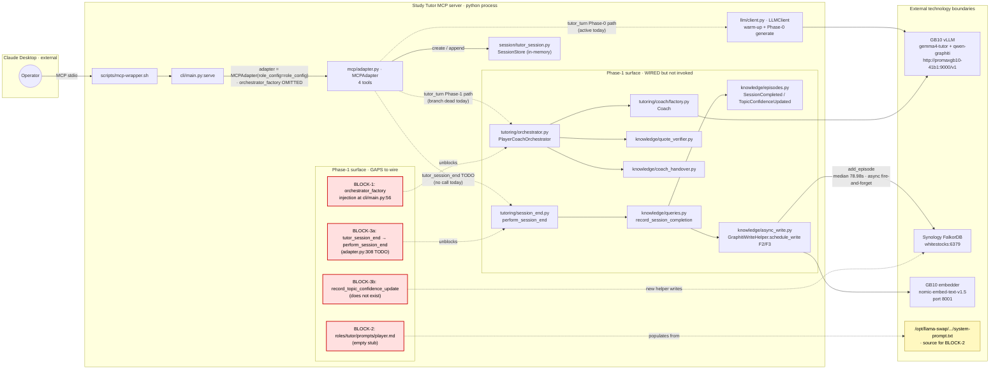
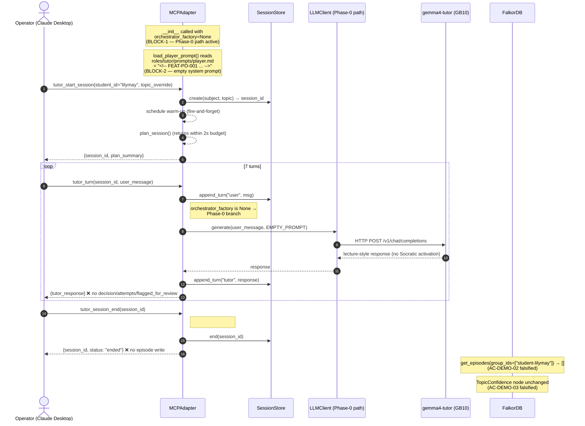

# Review Report: TASK-REV-GRD5 — Sequencing the BLOCK-1/2/3 fixes

## Executive summary

The 2026-05-05 MCP demo session report ([docs/reviews/REVIEW-TASK-GR-DEMO-2026-05-05.md](../../docs/reviews/REVIEW-TASK-GR-DEMO-2026-05-05.md))
identified three blockers. All three are **independently verified against `main`** with file:line citations below.

**Headline finding** — BLOCK-3 is materially smaller than the source report suggests. The async-write-back machinery
(`SessionCompletedEpisode`, `record_session_completion`, `GraphitiWriteHelper.schedule_write`,
`perform_session_end`, `EventBus`-based F3 dispatch) **already exists, is unit-tested, and is consumed nowhere by the
MCP adapter**. The session-completed half of BLOCK-3 is a wiring task. Only the TopicConfidence
node-attribute update (the `percentage` / `band` / `last_revised_at` fields the planner reads back) has no
existing implementation and is genuinely new code.

**Recommended sequencing**: hybrid. **BLOCK-2 standalone** (30-second prompt fix; visible quality lift, zero
architectural surface) → **BLOCK-1 + BLOCK-3a bundled** (orchestrator factory wiring + `perform_session_end` wiring;
both touch the same MCP adapter constructor / `tutor_session_end` handler in the same file) → **BLOCK-3b
standalone** (TopicConfidence update — new entity-write code path, cleanly separable). Three tasks, ordered for
incremental gate flips.

**Phase-1 impact**: BLOCK-1 + 2 + 3a flip G4 / G5 / G6 (Held). G13 flips with the same set
(latency capture is already instrumented per FEAT-PO-002). G3 stays Held (already flipped 2026-05-04 by
TASK-GSM-009). AC-DEMO-03 (and only AC-DEMO-03) requires BLOCK-3b before TASK-GR-DEMO can fully close.

---

## AC-REV-01 — Each BLOCK item validated against `main`

### BLOCK-1 — `MCPAdapter.__init__` accepts `orchestrator_factory` but the server entry point does not inject one

**Confirmed.**

- `MCPAdapter.__init__` accepts `orchestrator_factory: Any = None`:
  [src/study_tutor/mcp/adapter.py:120](../../src/study_tutor/mcp/adapter.py#L120).
- `tutor_turn` branches on `if self._orchestrator_factory is not None:` → routes through
  `PlayerCoachOrchestrator.run_turn`:
  [src/study_tutor/mcp/adapter.py:261-274](../../src/study_tutor/mcp/adapter.py#L261-L274).
- Sole production instantiation site is `serve(...)` in the CLI entrypoint:
  [src/study_tutor/cli/main.py:56](../../src/study_tutor/cli/main.py#L56) —
  `adapter = MCPAdapter(role_config=role_config)` — `orchestrator_factory` is **omitted**, so the Phase 0
  single-LLM path is the live runtime path.

The `PlayerCoachOrchestrator` itself is fully wired and tested:
[src/study_tutor/tutoring/orchestrator.py:333](../../src/study_tutor/tutoring/orchestrator.py#L333).
Coach + Player + QuoteVerifier all behind `*Like` Protocols; the misconfigured-loop guard is in
`validate_loop_configuration`. The constructor needs `player`, `coach`, optional `quote_verifier`,
optional `coach_handover`, optional `on_flag`, latency budget. **The orchestrator factory closure has to
construct one of these per turn** (not a singleton — the orchestrator deliberately holds no session-scoped
mutable state per the docstring at L336-341, "Constructed fresh per turn").

### BLOCK-2 — `roles/tutor/prompts/player.md` is the placeholder stub

**Confirmed.** The file has exactly one line:

```
<!-- FEAT-PO-001 will populate this from domains/gcse-english/GOAL.md -->
```

(verified at [roles/tutor/prompts/player.md:1](../../roles/tutor/prompts/player.md#L1)). The MCP Phase-0 path
loads this via `role_config.load_player_prompt()` at adapter init
([src/study_tutor/mcp/adapter.py:124](../../src/study_tutor/mcp/adapter.py#L124)) and passes it as the system
prompt to `LLMClient.generate(user_message, self._player_prompt)` at
[src/study_tutor/mcp/adapter.py:281-283](../../src/study_tutor/mcp/adapter.py#L281-L283). With the file
content above, `gemma4-tutor` receives a comment-only prompt and falls back to general-purpose LLM
behaviour — this is the lecture-mode root cause from the source report's Finding 2.

### BLOCK-3 — `tutor_session_end` contains `TODO(phase-1)` with no Graphiti write code path

**Confirmed at the call site** — but with a major discovery about the surrounding infrastructure.

The TODO is at [src/study_tutor/mcp/adapter.py:308](../../src/study_tutor/mcp/adapter.py#L308):
```python
async def tutor_session_end(self, session_id: str) -> dict[str, Any]:
    # TODO(phase-1): add async Graphiti write per DEC-02
    try:
        self._store.end(session_id)
    except SessionNotFoundError:
        return _session_not_found(session_id)
    return {"session_id": session_id, "status": "ended"}
```

**However, the write-back machinery the TODO implies is already implemented elsewhere and tested:**

| Component | Location | Status |
|---|---|---|
| `SessionCompletedEpisode` (Pydantic, frozen, with `to_graphiti_episode_body`) | [src/study_tutor/knowledge/episodes.py:69-98](../../src/study_tutor/knowledge/episodes.py#L69-L98) | shipped |
| `TopicConfidenceUpdatedEpisode` | [src/study_tutor/knowledge/episodes.py:101-130](../../src/study_tutor/knowledge/episodes.py#L101-L130) | shipped |
| `record_session_completion(client, write_helper, student_id, summary)` — F3 fire-and-forget dispatcher | [src/study_tutor/knowledge/queries.py:567-632](../../src/study_tutor/knowledge/queries.py#L567-L632) | shipped |
| `GraphitiWriteHelper.schedule_write(...)` — single CC-13 call site | [src/study_tutor/knowledge/async_write.py:240-290+](../../src/study_tutor/knowledge/async_write.py#L240) | shipped |
| `perform_session_end(...)` — full session-end workflow (zero-turn guard, F4 in-flight resolution, event bus emit *before* F3 schedule, fire-and-forget create_task) | [src/study_tutor/tutoring/session_end.py:334-499](../../src/study_tutor/tutoring/session_end.py#L334) | shipped, 7 unit tests at [tests/unit/tutoring/test_session_end.py:44](../../tests/unit/tutoring/test_session_end.py#L44) |

**`perform_session_end` is consumed nowhere in production** (`grep -rn "perform_session_end" src/` returns
only the definition site and exports). The MCP adapter's `tutor_session_end` calls only `self._store.end(session_id)`
and returns. The session-completed half of BLOCK-3 is therefore a **wiring task**, not new code.

**What is genuinely missing** — TopicConfidence node-attribute update (AC-DEMO-03):
- `TopicConfidenceUpdatedEpisode` exists as the Graphiti event-log type, but it is just an episode payload,
  not an entity-update path. It records "the band moved from X to Y"; it does not actually mutate the
  TopicConfidence node's `percentage`, `band`, or `last_revised_at` fields.
- AC-DEMO-03 requires `mcp__graphiti__search_nodes(query="<topic>", group_ids=["student-lilymay"])` to
  return updated `topic_confidences`. That is a **node attribute change** — the planner queries these
  values via `get_student_state` to drive `get_topic_recommendations`, so they must be updated in place.
- The seed for these nodes (TASK-GSM-009 / [ADR-ARCH-021](../../docs/architecture/decisions/ADR-ARCH-021-typed-entity-seed-design-resolutions.md))
  bypasses the `add_episode` LLM extraction path entirely and writes typed entities via `EntityNode.save` /
  `EntityEdge.save`. The post-session update needs to mirror that pattern: derive the
  TopicConfidence node UUID via [src/study_tutor/knowledge/seed_uuids.py:81-90](../../src/study_tutor/knowledge/seed_uuids.py#L81-L90),
  load the existing node, mutate `percentage`/`band`/`last_revised_at`, and `save`.
- This is **new code** with non-trivial design questions (see AC-REV-04 below).

**Re-decomposition of BLOCK-3:**
- **BLOCK-3a** — Wire `perform_session_end` into `MCPAdapter.tutor_session_end`; inject `write_helper` +
  `event_bus`; thread `topics_covered` / `aos_exercised` from the stored `SessionPlan`
  (`self._plan_sessions[session_id]`). Existing tests cover the inner workflow; only the adapter-level
  integration is new.
- **BLOCK-3b** — Implement `record_topic_confidence_update(...)` (typed-entity write mirroring
  ADR-ARCH-021), define the delta-source policy (see AC-REV-04), and call it from `tutor_session_end` (or
  from `perform_session_end` with a delta-list parameter). New code path; new tests.

### Open WebUI prompt confirmation

Per the source report's Appendix, the GB10 system prompt at `/opt/llama-swap/models/gemma4-tutor/system-prompt.txt`
is what activates Socratic behaviour. The crucial directive — *"Never do the work for the student — ask
questions that guide them toward the answer"* — is the load-bearing instruction. This text was not verified
on the GB10 host during this review (filesystem out of scope); BLOCK-2's design decision below assumes the
report's transcript is faithful.

---

## AC-REV-02 — Sequencing decided: hybrid (three tasks)

**Decision: option (c) — hybrid. Three implementation tasks in this order:**

1. **TASK-GR-PMT — BLOCK-2 alone.** Populate `roles/tutor/prompts/player.md` from the Open WebUI verbatim
   prompt. Independent surface (single file, no Python). Lands first.
2. **TASK-GR-WIRE — BLOCK-1 + BLOCK-3a bundled.** Both edits land in `src/study_tutor/mcp/adapter.py`
   (constructor + `tutor_session_end`) and in `src/study_tutor/cli/main.py` (instantiation site). Bundling
   them means one adapter-construction story rather than two — review surface stays small.
3. **TASK-GR-CONF — BLOCK-3b alone.** TopicConfidence node update via typed-entity write. Separable from the
   wiring task because it requires its own design choice (delta source) and its own test coverage; bundling
   it with TASK-GR-WIRE would push that task above complexity 6.

### Why hybrid beats the obvious alternatives

**Why not (a) three separate tasks?** BLOCK-1 and BLOCK-3a both edit the same constructor and the same
`tutor_session_end` handler in the same file with the same architectural change (DI of session-end
dependencies). Splitting them creates two PRs that touch overlapping lines and deliver no independently
verifiable user value (BLOCK-1 alone gives Coach revisions but no Graphiti persistence; BLOCK-3a alone
writes episodes for a Phase-0 session without Coach signal). The bundle is the natural review unit.

**Why not (b) one big task?** BLOCK-2 has zero shared surface with BLOCK-1/3 and unblocks visible quality
improvement immediately. Holding it behind the wiring task means the demo session looks lecture-style for
the duration of the wiring work. BLOCK-3b's design (TopicConfidence delta source) is the genuinely novel
decision in the set; bundling it with wiring forces the wiring PR to wait for the delta-source debate.

**Why this order?**
- **BLOCK-2 first** — fastest visible improvement; no gate flips but it removes the lecture-mode confound
  before the wiring PR's session evidence is captured. If TASK-GR-WIRE's smoke-test session is conducted
  with a placeholder prompt, the Coach revision evidence (AC-DEMO-01.2 / G5) gets entangled with prompt
  quality issues. Landing BLOCK-2 first keeps the Coach evidence honest.
- **BLOCK-1 + 3a** flip G4 / G5 / G6 in a single PR. AC-DEMO-01.2 (Coach revision), AC-DEMO-02
  (`session_completed` episode visible), AC-DEMO-04 (latency capture — already instrumented per
  FEAT-PO-002), and AC-DEMO-05's G4/G5/G6 evidence rows all flip on this PR.
- **BLOCK-3b last** flips AC-DEMO-03 (TopicConfidence delta) and is the only AC blocking the
  parent-task close-out (AC-DEMO-06).

### Blast radius / parallelisability

| Task | Files | Blast radius | Parallelisable | Conductor workspace? |
|---|---|---|---|---|
| TASK-GR-PMT (BLOCK-2) | `roles/tutor/prompts/player.md` (1 line) | None — pure prompt change | Yes vs others | optional |
| TASK-GR-WIRE (BLOCK-1+3a) | `src/study_tutor/mcp/adapter.py` (~30 lines), `src/study_tutor/cli/main.py` (constructor wiring + factory closure), tests | Medium — adapter constructor signature change; tests reference current signature | No (must follow GR-PMT) | yes |
| TASK-GR-CONF (BLOCK-3b) | `src/study_tutor/knowledge/queries.py` (new helper) or new `student_writes.py`, `src/study_tutor/mcp/adapter.py` (call from end handler), tests | Medium — new entity-write code path; ADR-ARCH-021 conformance required | No (depends on GR-WIRE for `write_helper` injection point) | yes |

GR-PMT can run in parallel with GR-WIRE if the operator opts in (no file overlap); GR-CONF must follow
GR-WIRE because it consumes the `write_helper` injection added there.

---

## AC-REV-03 — BLOCK-2 design choice: option (b1) verbatim copy

**Decision: (b1) — copy the Open WebUI system prompt verbatim into `roles/tutor/prompts/player.md`. Defer
(b2) FEAT-PO-001 GOAL.md → prompt-generation pipeline.**

### Rationale

1. **The verbatim prompt is known to work.** The source report's contrast between Open WebUI (Socratic) and
   MCP (lecture) sessions establishes that this exact prompt activates the fine-tuned model's intended
   behaviour. (b2) introduces a generated prompt that has not been validated against the live model; even
   if the generator's output is "obviously equivalent", that's a regression risk we don't need to take
   inside the AC-DEMO window.
2. **(b2) is FEAT-PO-001 territory and Phase-1 closure shouldn't drag it forward.** FEAT-PO-001 owns
   `domains/gcse-english/GOAL.md` and was scheduled as Phase 2 work (per DEC-04 — explicit per-AO
   scaffolding lives in GOAL.md as a Phase-0 deliverable, but the GOAL.md → prompt pipeline that
   FEAT-PO-001 supplies is downstream). The placeholder comment in `player.md` explicitly says "FEAT-PO-001
   will populate this" — that's a forward reference, not an obligation to do FEAT-PO-001 now.
3. **30 seconds vs unbounded.** (b1) is `cp` from the GB10. (b2) requires a generator design, an AO-mapping
   contract, generation tests, and validation that the generated prompt produces equivalent live-model
   behaviour — at minimum a half-day, more likely a full FEAT-PO-001 task.

### Cost of deferring (b2)

- **Drift risk.** If someone updates `/opt/llama-swap/models/gemma4-tutor/system-prompt.txt` on GB10 without
  also updating `roles/tutor/prompts/player.md`, the two will silently diverge. **Mitigation**: add a
  `<!-- source: /opt/llama-swap/.../system-prompt.txt @ <hash-or-date> -->` header in the file so the
  provenance is greppable, and reference this file from FEAT-PO-001's task description so the eventual
  generator picks it up as a fixture.
- **No domain-config evolution.** Until FEAT-PO-001 lands, the prompt cannot be regenerated when GOAL.md
  changes. Acceptable for Phase-1 close-out; the prompt is small enough that manual sync is feasible. If
  the manual-sync burden grows past one-or-two updates, FEAT-PO-001 is the right answer and should be
  prioritised in Phase 2 — not bundled into TASK-GR-PMT.
- **No version-control of "the prompt that ran" in episodes.** A future audit of `session_completed` episodes
  cannot reconstruct which prompt the Player was using. **Mitigation**: out of scope for AC-DEMO; if it
  becomes load-bearing later, hash the prompt at adapter init and stamp it into the episode payload.

### Ancillary decision

Add a one-line provenance comment at the top of the new `player.md`:

```markdown
<!-- Verbatim copy of /opt/llama-swap/models/gemma4-tutor/system-prompt.txt on GB10 (promaxgb10-41b1), 2026-05-05. FEAT-PO-001 will replace this with GOAL.md-derived generation. -->
```

This is the only "comment" exception worth taking in this file — the rule "explain non-obvious WHY" applies
because future-readers will not know where the prompt came from without it.

---

## AC-REV-04 — BLOCK-3 design resolved

### Sync vs async write-back

**Decision: async / fire-and-forget. Mandated by [ADR-ARCH-019](../../docs/architecture/decisions/ADR-ARCH-019-async-graphiti-writeback-every-write-point.md), no choice to make.**

The TODO comment cites DEC-02 ("add async Graphiti write per DEC-02"). DEC-02 itself
([docs/research/ideas/decisions-log-2026-04-17.md:36-50](../../docs/research/ideas/decisions-log-2026-04-17.md#L36-L50))
is the topology decision (Synology FalkorDB + Gemini extraction + GB10 embeddings); its implication —
"if end-to-end Graphiti latency exceeds ~2s per operation, MCP `tutor_turn` must be fire-and-forget" — is
the policy that ADR-ARCH-003 turned into an architectural commitment and ADR-ARCH-019 then broadened to
*every write point*.

The 2026-04-27 latency spike measured `add_episode` median at **78.98s**. ADR-ARCH-019's binding
constraints:

- *"`tutor_session_end` returns within < 2s regardless of session-end episode write latency"* (ARCH-019).
- *"Caller-facing handlers do not await Graphiti acknowledgement"* (ARCH-019).
- *"Write failures are logged-only"* (ARCH-019).

**Implementation rule** — use the existing `GraphitiWriteHelper.schedule_write(...)` for the
`add_episode` half (`record_session_completion` already does this with `flush_id="F3"`). Use
`asyncio.create_task` directly for any TopicConfidence typed-entity update (ADR-ARCH-019 explicitly
permits both `AsyncSubAgent` and `asyncio.create_task` for one-shot writes that don't need the deepagents
tool surface).

### Episode payload shape (AC-DEMO-02)

The `SessionCompletedEpisode` schema is fixed at
[episodes.py:69-98](../../src/study_tutor/knowledge/episodes.py#L69-L98):

```python
session_id: str
student_id: str
subject_slug: str
text_name: str
topics_covered: list[str]
aos_exercised: list[str]
narrative_summary: str
started_at: datetime
ended_at: datetime
```

**What AC-DEMO-02 actually requires for replay** — re-reading AC-DEMO-02:

> *"a session_completed episode is written to Graphiti and is visible via `mcp__graphiti__get_episodes(...)`.
> The episode body contains the session id, the turn count, and a summary suitable for replay."*

The schema covers `session_id` and `narrative_summary`. **`turn count` is not in the schema** but is
trivially recoverable: either project it from `narrative_summary` (e.g. *"7 turns covering ..."*) or extend
the schema with a `turn_count: int` field. Since the schema has `extra="forbid"` (per
[episodes.py:53](../../src/study_tutor/knowledge/episodes.py#L53)), adding the field is a deliberate
contract change, not an accidental drift. **Recommendation**: do not extend the schema for AC-DEMO-02 —
project the turn count into `narrative_summary` (one extra sentence) and call out in the TASK-GR-WIRE PR
description that future episode-schema evolution should add a structured `turn_count` field if downstream
analytics need it. Keeping the schema stable preserves CC-13's "single shape across sites" property.

**`p50/p95 latency` is NOT episode payload** — AC-DEMO-04 says "append to phase-1-validation.md and
graphiti-latency-spike-results.md", not "include in the episode". Good. Latency is observability data; the
episode is replay data. Don't mix them.

**Provenance for `topics_covered` / `aos_exercised`** — the SessionPlan stored at
`self._plan_sessions[session_id]` ([adapter.py:130](../../src/study_tutor/mcp/adapter.py#L130)) provides
`topic_name` (single) and `focus_aos` (list). For Phase 1 a single-topic session is fine —
`topics_covered = [plan.topic_name]`, `aos_exercised = list(plan.focus_aos)`.

### TopicConfidence update strategy (AC-DEMO-03)

This is the genuinely novel design decision. Three sub-questions:

#### (i) Which TopicConfidence nodes get touched per session?

**Decision: single topic — the one matching the session's `topic_override` (or the planner-selected
`topic_name` if no override).**

Rationale:
- Phase-1 sessions are scoped to one topic by design (the planner selects one topic per session;
  `topic_override` short-circuits to a learner-supplied one). Touching multiple topics in a single session
  would require a Coach signal we don't yet have ("which other topics did the student demonstrate
  competence on?") and is a Phase 2 / FEAT-PH2-001 concern.
- Multi-topic touch would also mean per-session writes of N typed entities × `last_revised_at` updates,
  which inflates blast radius for the smallest-thing-that-flips-AC-DEMO-03.
- Defer the multi-topic question to a follow-up task once the Coach signals are richer.

#### (ii) Confidence delta source — heuristic, Coach signal, or self-report?

**Decision: deterministic heuristic from turn count, capped at ±10pp; gated on a non-zero turn count.**

Rationale:
- **Coach signal** — the Coach's `RubricFeedback` carries per-criterion scores
  (see `coach/rubric.py:200`) but it produces per-turn feedback, not a per-session confidence delta. We
  don't currently aggregate Coach signals into a session-level confidence judgement; building that
  aggregator is its own task and would push BLOCK-3b past complexity 6.
- **Explicit student self-report** — would require a UI/CLI prompt at session-end. Not in AC-DEMO-01's
  contract; out of scope for Phase-1 close-out.
- **Heuristic from turn count** — defensible as a placeholder: a 7-turn session sustained by a student who
  asks substantive questions implies non-zero engagement with the topic; a 1-turn session implies
  near-zero. Cap the delta at ±10pp (same cap ADR-ARCH-003 referenced for the original session-end
  delta), and **never let the delta drive confidence past the band boundary unless the underlying signal
  is strong** — Phase-1 caveat: just nudge by `+(turn_count - 1)` percentage points (so 1-turn = 0,
  2-turn = +1, 7-turn = +6), capped at +10. No negative deltas in Phase 1 — that requires a Coach signal
  we don't have.
- This is a **stand-in**, not a permanent answer. AC-DEMO-03 needs *some* observable delta; this delivers
  it without inventing an aggregator. **Document explicitly in TASK-GR-CONF that this heuristic is a
  Phase-1 expedient and FEAT-PH2-001 owns the Coach-driven aggregator.**

#### (iii) `last_revised_at` update strategy

**Decision: set `last_revised_at = ended_at` (the session's actual end time, UTC).**

Mechanically simple. Drives the planner's "stale" cooldown
(`DEFAULT_STALE_THRESHOLD_DAYS` in queries.py) and the EPOCH_NEVER_REVISED sentinel logic — once a topic
has been revised at least once, the sentinel is gone and the cooldown / staleness rules apply normally.

#### (iv) Companion `TopicConfidenceUpdatedEpisode` write?

**Decision: yes — write the episode in addition to mutating the entity.**

Rationale: ADR-ARCH-019 mandates async fire-and-forget for *every* write point. The
`TopicConfidenceUpdatedEpisode` exists exactly to record the temporal change in a queryable form (the
entity update mutates the current state; the episode preserves the history). One `schedule_write` call
with `flush_id="F2"` after the entity update; same fire-and-forget shape as F3.

### Summary of BLOCK-3 design

```
on session_end:
  1. perform_session_end(...)  — existing function
       → builds SessionCompletedEpisode from plan + session.turns
       → emits "session.completed" on event_bus (DDR-003)
       → schedule_write(F3, episode)
       → returns {session_id, status: "ended"} within <2s
  2. (new) record_topic_confidence_update(client, write_helper, ...)
       → derive TopicConfidence node uuid from (student_id, topic_ref) per seed_uuids.py
       → load via EntityNode.get_by_uuid (or driver query)
       → mutate percentage (+turn_count-1, cap +10), recompute band, set last_revised_at = ended_at
       → EntityNode.save (typed-entity write, ADR-ARCH-021 pattern; fire-and-forget via create_task)
       → schedule_write(F2, TopicConfidenceUpdatedEpisode) for the temporal record
       → log structured success/failure; never raise from caller path
```

---

## AC-REV-05 — Risk register

### BLOCK-1 — orchestrator_factory wiring

| Risk | Severity | Likelihood | Mitigation |
|---|---|---|---|
| **Factory closure captures wrong state** — e.g. closes over a singleton player+coach instead of building fresh per turn, breaking the per-turn isolation invariant the `PlayerCoachOrchestrator` docstring promises | High | Medium | Closure body must construct `Player`, `Coach`, `QuoteVerifier`, `CoachHandover` *each call*. Add a unit test that calls the factory twice and asserts two distinct objects. Pin the invariant with a comment referencing [orchestrator.py:336-341](../../src/study_tutor/tutoring/orchestrator.py#L336-L341). |
| **Coach + Player provider misconfiguration** — same model on both sides triggers `OrchestratorConfigurationError` (the misconfigured-loop guard) at first `tutor_turn` call, not at server startup — so the MCP server boots fine and dies on first user message | High | Medium | Construct one orchestrator at startup as a smoke test (and discard) before serving — surfaces the config error at boot time. Or: validate provider config at adapter init from `role_config`. |
| **Test coverage gap on the entry-point path** — `tests/unit/mcp/test_adapter.py` mocks the role and store but doesn't test the CLI `serve` command | Medium | High | Add a smoke test in `tests/integration/test_cli_serve_smoke.py` that boots `serve` against a stub role and asserts the adapter has `_orchestrator_factory is not None`. |
| **Warm-up path coupling** — adapter currently warms `LLMClient(provider=_default_player_model())`; the orchestrator path doesn't go through `LLMClient` directly | Low | Low | Keep the warm-up unchanged; the warm-up is an Ollama-priming concern independent of the Coach loop. |
| **Coach blowing latency budget** — `tutor_turn` p95 < 10s budget is asserted at the orchestrator (`latency_budget_seconds`), but if Coach evaluation + revision stretches beyond 10s the turn is "flagged but still returned" — student sees a slow turn | Medium | Medium | Existing flag-emitter callback (`on_flag`) is the surfacing mechanism. Wire it to a logger in TASK-GR-WIRE so flagged turns are observable in the demo session. |

### BLOCK-2 — Prompt-as-data

| Risk | Severity | Likelihood | Mitigation |
|---|---|---|---|
| **Drift vs GB10 source** — someone updates GB10's prompt without updating the repo file (or vice versa) | Medium | High over time | One-line provenance comment in `player.md` (date + source path). Reference this file from FEAT-PO-001's eventual task. Out-of-scope for *this* fix. |
| **Quote handling in YAML/Pydantic loaders** — `role_config.load_player_prompt()` reads the file as text; if the prompt contains characters that the loader transforms (line endings, BOM, trailing whitespace) the model receives a subtly different prompt | Low | Low | The current `LLMClient.generate` passes the prompt as a string; no parsing layer in between. Verify by `len(self._player_prompt)` log line at adapter init. |
| **Markdown comment markers leaking into the model context** — the file is `.md`; if anyone adds new markdown comments the loader passes them through verbatim | Low | Low | Document in TASK-GR-PMT that the prompt body should not contain markdown comments — they'll be sent to the model. Provenance comment at top is acceptable per the model's tolerance for irrelevant header text. |
| **Verbatim copy contains AQA-restricted text** — the prompt as quoted in the source report references "AQA past papers" and "AQA mark scheme criteria" but does not embed any restricted content | Low | Low | DEC-04 / phase-0 copyright analysis already cleared "AO names and descriptions are factual curriculum structure". Verbatim copy stays inside that boundary. |

### BLOCK-3 — Graphiti write-back

| Risk | Severity | Likelihood | Mitigation |
|---|---|---|---|
| **Partial-failure semantics** — episode write succeeds but TopicConfidence entity update fails (or vice versa). What does AC-DEMO say? AC-DEMO-02 + AC-DEMO-03 are independent gates; one can fail without the other | High | Medium | Both writes are independently fire-and-forget. Log each outcome separately; do not couple their success conditions. ADR-ARCH-019: "write failures are logged-only" — neither failure raises from the MCP handler. |
| **Transactional expectations** — the source report's BLOCK-3 hints at "transactional expectations". There are none in Phase 1 — single-process single-user, no concurrent sessions ([ADR-ARCH-014](../../docs/architecture/decisions/ADR-ARCH-014-single-user-scalability-posture.md)) | Low | Low | Document the no-transaction posture in TASK-GR-CONF. Revisit if multi-user or concurrent sessions appear. |
| **Retry posture** — `add_episode` 78.98s median means a retry on transient failure is its own latency hit; no retry budget on the caller path | Low | Low | `GraphitiWriteHelper` does not retry by design (CC-13 fire-and-forget). Logged failure → next session reasserts via a fresh write. Acceptable for Phase 1. |
| **TopicConfidence node not found** — derived UUID doesn't match any seeded node (e.g. topic_override is a topic that wasn't seeded) | Medium | Medium | Detect at update time; log structured `event=topic_confidence_update_skipped reason=node_not_found`; do not raise. Phase-1 sessions on un-seeded topics produce only the SessionCompletedEpisode, not a TopicConfidence delta. Document this constraint in TASK-GR-CONF — operators conducting AC-DEMO must use a seeded topic (the report already specifies "Lady Macbeth's ambition" which is in the seed per the live evidence JSON). |
| **`band` recomputation drift** — if `confidence_band_for(percentage)` thresholds change later, an updated-but-not-rebanded node will drift | Low | Low | Always recompute `band = confidence_band_for(percentage)` on every update; never store an out-of-date band. Already the seed's discipline. |
| **R-WAVE5-04 reappears** — `Connection closed by server` reappeared during read paths in Wave 5 retry. If it surfaces during the post-session write window, the entity update fails silently | Medium | Low | Already accepted as a Wave-5 risk in `phase-1-validation.md`. Logged-only failure means the user still gets `{"status":"ended"}` — degraded but not broken. |
| **Heuristic delta produces no observable change for short sessions** — 1-turn session = 0pp delta = AC-DEMO-03 cannot show the delta | Medium | Medium | AC-DEMO-01 requires 5–7 turns. With turn_count ≥ 5, delta ≥ +4pp — observable. Document the `turn_count == 1 → no delta` edge case as a Phase-1 limitation. |
| **Heuristic legitimises a wrong model** — operators see "+4pp on a 5-turn session" as a real signal when it's actually just turn-count arithmetic | High (long-term) | High | Mark in TASK-GR-CONF that this is an *expedient*, not a model. Phase-2 FEAT-PH2-001 must replace it with a Coach-driven aggregator before any user-facing dashboard surfaces the percentages. Add a `confidence_source: "phase1_heuristic"` field on the episode payload (or just log it) so future analytics can distinguish heuristic-era data from real-signal data. |

---

## AC-REV-06 — Spawn decision: three new tasks (`/task-create` invocations)

**Decision: three new implementation tasks. Do not fold fixes into TASK-GR-DEMO.**

Why three new tasks rather than reusing TASK-GR-DEMO:
- TASK-GR-DEMO's contract is "*conduct a live MCP session and capture evidence*" (operational AC, no
  new code). The blockers are code changes that produce the conditions under which TASK-GR-DEMO can
  succeed. Conflating implementation with evidence capture muddies the audit trail.
- TASK-GR-DEMO already has `autobuild_state.current_turn: 2` with two non-blocking advisory turns. Re-running
  task-work on TASK-GR-DEMO after the blockers land is the natural close-out — the autobuild state is
  fine, the implementation is what's missing.
- Three tasks let G4/G5/G6/G13 flip incrementally rather than as a single big-bang.

### Spawn invocations (ready to run)

```bash
/task-create "Wave 5 — BLOCK-2: populate player.md with verbatim Open WebUI system prompt" \
    task_type:feature \
    parent_review:TASK-REV-GRD5 \
    parent_task:TASK-GR-DEMO \
    feature_id:FEAT-FD32 \
    wave:5 \
    complexity:1 \
    priority:critical \
    tags:[graphiti,mcp,phase-1-gate-closure,prompt-fix] \
    related:[TASK-GR-DEMO,TASK-REV-GRD5]
# Suggested ID: TASK-GR-PMT
# AC sketch:
#  - AC-PMT-01: roles/tutor/prompts/player.md contains the verbatim text from
#    /opt/llama-swap/models/gemma4-tutor/system-prompt.txt on GB10 as captured
#    2026-05-05, with a one-line provenance comment at the top.
#  - AC-PMT-02: A new tutor_turn invocation through the MCP boundary
#    (Phase-0 path is fine for this AC) produces a Socratic-style question
#    rather than a lecture. Manual verification — paste excerpt into PR.
#  - AC-PMT-03: The provenance comment references FEAT-PO-001 as the eventual
#    owner of the GOAL.md → prompt-generation pipeline.
#  - AC-PMT-04: Lint/format passes on the file (markdown, no .py changes).
```

```bash
/task-create "Wave 5 — BLOCK-1+3a: wire orchestrator_factory and perform_session_end into MCP adapter" \
    task_type:feature \
    parent_review:TASK-REV-GRD5 \
    parent_task:TASK-GR-DEMO \
    feature_id:FEAT-FD32 \
    wave:5 \
    complexity:5 \
    priority:critical \
    tags:[graphiti,mcp,phase-1-gate-closure,coach-orchestration,async-writeback] \
    related:[TASK-GR-DEMO,TASK-REV-GRD5,TASK-GR-PMT] \
    dependencies:[TASK-GR-PMT]
# Suggested ID: TASK-GR-WIRE
# AC sketch:
#  - AC-WIRE-01: src/study_tutor/cli/main.py constructs an orchestrator_factory
#    closure that builds a fresh PlayerCoachOrchestrator per call (Player +
#    Coach + QuoteVerifier + CoachHandover, with Coach on a different
#    provider per the misconfigured-loop guard).
#  - AC-WIRE-02: The factory passes the misconfigured-loop guard at startup
#    (smoke test: build one orchestrator at adapter init and discard).
#  - AC-WIRE-03: tutor_turn returns {tutor_response, decision, attempts,
#    flagged_for_review, duration_seconds} — the Phase-1 path's response
#    shape — for a live session against the seeded Lilymay state.
#  - AC-WIRE-04: MCPAdapter.__init__ accepts a write_helper: GraphitiWriteHelper
#    and an event_bus parameter; tutor_session_end delegates to
#    perform_session_end(...) (existing function, no new logic for the
#    session-completed half).
#  - AC-WIRE-05: A live tutor_session_end call schedules an F3 write via
#    GraphitiWriteHelper.schedule_write — verified via mcp__graphiti__get_episodes
#    after a session.
#  - AC-WIRE-06: tutor_session_end returns within < 2s regardless of
#    Graphiti latency (ADR-ARCH-019 acceptance).
#  - AC-WIRE-07: New unit test pins "factory builds fresh per call" invariant.
#  - AC-WIRE-08: New integration smoke test (skipif STUDY_TUTOR_LIVE_GRAPHITI_SMOKE)
#    boots the adapter end-to-end and verifies the F3 write reaches FalkorDB.
#  - AC-WIRE-09: All existing tests in tests/unit/mcp/test_adapter*.py still
#    pass (signature change is additive — write_helper / event_bus / factory
#    all default to None so the Phase-0 path is preserved for tests that
#    don't supply them).
```

```bash
/task-create "Wave 5 — BLOCK-3b: TopicConfidence node update on session end (typed-entity write)" \
    task_type:feature \
    parent_review:TASK-REV-GRD5 \
    parent_task:TASK-GR-DEMO \
    feature_id:FEAT-FD32 \
    wave:5 \
    complexity:5 \
    priority:critical \
    tags:[graphiti,mcp,phase-1-gate-closure,typed-entity,async-writeback] \
    related:[TASK-GR-DEMO,TASK-REV-GRD5,TASK-GR-WIRE,TASK-GSM-009] \
    dependencies:[TASK-GR-WIRE]
# Suggested ID: TASK-GR-CONF
# AC sketch:
#  - AC-CONF-01: New helper record_topic_confidence_update(client, write_helper,
#    student_id, topic_ref, turn_count, ended_at) is added to
#    src/study_tutor/knowledge/queries.py (or a new student_writes.py).
#  - AC-CONF-02: The helper derives the TopicConfidence node UUID via
#    seed_uuids.topic_confidence_uuid(...), loads the existing node, mutates
#    percentage (+min(turn_count - 1, 10), capped 0..100), recomputes band
#    via confidence_band_for(...), sets last_revised_at = ended_at, and
#    EntityNode.save's (typed-entity write per ADR-ARCH-021).
#  - AC-CONF-03: The helper schedules a TopicConfidenceUpdatedEpisode write
#    via GraphitiWriteHelper.schedule_write with flush_id="F2".
#  - AC-CONF-04: Both writes are fire-and-forget (asyncio.create_task for
#    the typed-entity save; schedule_write for the F2 episode); neither
#    blocks tutor_session_end > 2s.
#  - AC-CONF-05: Failure modes log structured events
#    (topic_confidence_update_skipped reason=node_not_found,
#    topic_confidence_update_failed reason=...) and do not raise.
#  - AC-CONF-06: A live session against Lilymay's "Lady Macbeth's ambition"
#    topic shows the post-session percentage moved upward and band
#    recomputed — verified via mcp__graphiti__search_nodes.
#  - AC-CONF-07: New unit tests for the helper mock the driver and assert
#    UUID derivation + mutation logic; new integration smoke test verifies
#    the live FalkorDB round-trip (skipif STUDY_TUTOR_LIVE_GRAPHITI_SMOKE).
#  - AC-CONF-08: TASK-GR-CONF's task description explicitly flags the
#    turn-count heuristic as a Phase-1 expedient and lists FEAT-PH2-001
#    as the owner of the eventual Coach-driven replacement.
```

### TASK-GR-DEMO disposition

- **Stays `status: blocked`.** Update the `state_transition_reason` to reference TASK-GR-PMT, TASK-GR-WIRE,
  and TASK-GR-CONF as the unblockers (one each for BLOCK-2, BLOCK-1+3a, BLOCK-3b).
- **Don't reset autobuild_state.** The current `current_turn: 2` advisory-non-blocking turns are not the
  problem — the implementation is. Once the three blockers land, re-run `/task-work TASK-GR-DEMO` (or
  conduct the live session manually since AC-DEMO-01 is a human-in-the-loop AC); the autobuild state will
  pick up from turn 3 with the implementation actually in place.
- **Add an `unblocked_by` field** to TASK-GR-DEMO's frontmatter listing the three new task ids — provenance
  for future readers.

---

## AC-REV-07 — Phase-1 gate impact

For each of G3 / G4 / G5 / G6 / G13 in `docs/research/ideas/phase-1-validation.md`:

| Gate | Current status | After TASK-GR-PMT | After TASK-GR-WIRE (BLOCK-1+3a) | After TASK-GR-CONF (BLOCK-3b) | Notes |
|---|---|---|---|---|---|
| **G3** — Session planner produces explainable plans, exercised against live state | **Held** (since 2026-05-04 via TASK-GSM-009 — see [phase-1-validation.md §"TASK-GSM-009 — Typed-entity seed landed"](../../docs/research/ideas/phase-1-validation.md)) | unchanged | unchanged | unchanged | The "read-back through MCP" caveat in the operator-handoff scaffold can flip after TASK-GR-WIRE because the live demo session will produce the read-back evidence. But G3 itself is already Held. |
| **G4** — Player-Coach tutoring loop runs end-to-end | Falsified at runtime | unchanged | **Held** — Phase-1 path activates; Coach evaluates each turn; live session round-trip captured | unchanged | TASK-GR-WIRE delivers the AC-DEMO-01 session-log evidence (G4 row in phase-1-validation.md). |
| **G5** — Session completion writes to Graphiti (Coach feedback observable) | Falsified at runtime | unchanged | **Held** — `session_completed` episode written via F3 fire-and-forget; AC-DEMO-01.2 Coach revision observable in transcript | unchanged | TASK-GR-WIRE flips both halves of G5. |
| **G6** — End-to-end demo flow works | Falsified | unchanged | **Held** for the demo round-trip half; AC-DEMO-02 satisfied (`mcp__graphiti__get_episodes` returns the new episode). AC-DEMO-03 (TopicConfidence delta) **still pending** | **Fully Held** — AC-DEMO-03 satisfied; episode + entity update both observable | TASK-GR-WIRE flips most of G6; TASK-GR-CONF closes the AC-DEMO-03 carve-out. |
| **G13** — Dynamic retrieval decision observable in a session | Falsified at runtime | unchanged | **Held** — session log captured; p50/p95 from FEAT-PO-002 instrumentation already exists, just needs to be appended to phase-1-validation.md / graphiti-latency-spike-results.md | unchanged | TASK-GR-WIRE delivers the live session log; AC-DEMO-04 latency capture is a doc edit on the same PR. |

### G3 / G4 / G5 / G6 specifically

- **AC-DEMO-04 latency capture**: instrumentation already exists per FEAT-PO-002; the `tutor_turn_complete`
  structured-log line carries `elapsed_ms`. This is *captured* not *written* by TASK-GR-WIRE — appending
  p50/p95 to the validation/latency docs is part of TASK-GR-DEMO's evidence pass, not TASK-GR-WIRE's
  implementation. **No additional work needed** for AC-DEMO-04 beyond running the live session.

- **G5's Coach revision evidence rule**: per `phase-1-validation.md §"Coach-revision rule"` and
  TASK-GR-DEMO's AC-DEMO-01.2 — *"if the Coach never disagrees in 7 turns, that's evidence the Coach
  calibration is too lax"*. After TASK-GR-PMT lands, the Player will produce Socratic-style questions that
  the Coach is more likely to *accept* on first attempt (ironically) — meaning the demo session may need to
  pick a topic at the boundary of the model's capability to provoke a Coach revision. **Operator note for
  the AC-DEMO retry**: choose a topic where the Player is likely to misfire (e.g. a multi-text comparison
  where the model often falls back to single-text analysis) so AC-DEMO-01.2 has a real chance of producing
  Coach disagreement. *This is operator guidance, not a code task.*

### Gates outside the requested set

- **G7** — six parity surfaces (SR-01..SR-07): no impact from any of the three tasks. Stays Held.
- **G8** — technical write-up: out of scope.
- **DNCs** — none affected. Single-student, Coach-on-different-provider, no-gamification, no-Reachy,
  in-memory-session-state, retrieval-selective, no-copyright-text, post-hoc-quote-verification — all
  unchanged.

---

## Decision options

```
[A]ccept    — Approve findings; archive review; spawn TASK-GR-PMT, TASK-GR-WIRE, TASK-GR-CONF
              via the three /task-create invocations under AC-REV-06.
[R]evise    — Request deeper analysis (e.g. validate the Open WebUI prompt against the live GB10
              file before approving (b1); or pull in the Coach's RubricFeedback aggregation
              design before approving the heuristic delta).
[I]mplement — Auto-create the three implementation tasks via the orchestrator pipeline.
[C]ancel    — Discard review.
```

**Reviewer recommendation**: [A]ccept and spawn the three tasks via AC-REV-06's invocations. The hybrid
sequencing is the lowest-friction path through the three blockers, the design choices for BLOCK-3 are
mandated by ADR-ARCH-019 (no real degree of freedom on sync vs async), and BLOCK-3b's heuristic delta is a
defensible Phase-1 expedient with explicit Phase-2 ownership in FEAT-PH2-001.

---

## Context used

This review consumed the following sources directly:

- [docs/reviews/REVIEW-TASK-GR-DEMO-2026-05-05.md](../../docs/reviews/REVIEW-TASK-GR-DEMO-2026-05-05.md) — primary input (BLOCK-1/2/3 narrative, AC-DEMO status table)
- [tasks/backlog/TASK-GR-DEMO-end-to-end-mcp-tutor-session.md](../../tasks/backlog/TASK-GR-DEMO-end-to-end-mcp-tutor-session.md) — AC-DEMO-01..07 contract
- [src/study_tutor/mcp/adapter.py](../../src/study_tutor/mcp/adapter.py) — BLOCK-1 / BLOCK-3 confirmation
- [src/study_tutor/cli/main.py](../../src/study_tutor/cli/main.py) — BLOCK-1 entry-point confirmation
- [roles/tutor/prompts/player.md](../../roles/tutor/prompts/player.md) — BLOCK-2 confirmation
- [src/study_tutor/tutoring/orchestrator.py](../../src/study_tutor/tutoring/orchestrator.py) — orchestrator factory shape
- [src/study_tutor/tutoring/session_end.py](../../src/study_tutor/tutoring/session_end.py) — the `perform_session_end` discovery
- [src/study_tutor/knowledge/episodes.py](../../src/study_tutor/knowledge/episodes.py) — episode payload shapes
- [src/study_tutor/knowledge/queries.py](../../src/study_tutor/knowledge/queries.py) — `record_session_completion` and `StudentState` shape
- [src/study_tutor/knowledge/student_model.py](../../src/study_tutor/knowledge/student_model.py) — `TopicConfidence` entity schema
- [docs/architecture/decisions/ADR-ARCH-019-async-graphiti-writeback-every-write-point.md](../../docs/architecture/decisions/ADR-ARCH-019-async-graphiti-writeback-every-write-point.md) — async fire-and-forget mandate
- [docs/architecture/decisions/ADR-ARCH-003-async-graphiti-writeback.md](../../docs/architecture/decisions/ADR-ARCH-003-async-graphiti-writeback.md) — superseded predecessor
- [docs/research/ideas/decisions-log-2026-04-17.md §DEC-02](../../docs/research/ideas/decisions-log-2026-04-17.md) — topology decision the TODO comment cites
- [docs/research/ideas/phase-1-validation.md](../../docs/research/ideas/phase-1-validation.md) — gate file (G3..G13 status, operator handoff scaffold, Coach-revision rule)

Knowledge-graph context (Graphiti / `mcp__graphiti__search_nodes` etc.) was **not** queried for this
review — the source review report and the in-repo ADRs / validation doc carry the load-bearing context
already, and the risk register's reliance on R-WAVE5-04 (`Connection closed by server` reappearing on
read paths) is a known issue tracked in `phase-1-validation.md` rather than something the live graph
would surface afresh.

---

# Revision 1 — Deep dive (2026-05-05, after [R]evise)

The user requested four additions:

1. Validate the root cause with C4 + sequence-diagram tracing across system / technology boundaries.
2. Explore BLOCK-3b heuristic-vs-Coach-aggregator deeper.
3. Explain why I recommended [A]ccept-then-manual-task-create instead of [I]mplement.
4. Hold the conclusion to the standard. None of these change BLOCK-1 or BLOCK-2 conclusions, but
   BLOCK-3b's design is materially revised below.

## R1.1 — Why [A]ccept + manual /task-create instead of [I]mplement (and the corrected recommendation)

**Honest answer**: my original recommendation deviates from the canonical /task-review workflow without an
adequate reason, and I should have noticed before proposing it. The canonical workflow is:

| Decision | Workflow effect |
|---|---|
| [A]ccept | Archive the review, **no implementation tasks created**. |
| [I]mplement | Auto-detection pipeline parses recommendations, creates implementation tasks. |
| [R]evise | Request deeper analysis. |
| [C]ancel | Discard. |

I wrote literal `/task-create` invocations under AC-REV-06 — that part is correct because the parent
task explicitly demanded *"`/task-create` invocations (with prefix, title, dependencies, AC outline) ready
to run"*. But then I recommended [A]ccept and told the user to run those invocations manually. That's a
hybrid that the workflow doesn't define. Two paths a reasonable reviewer might pick from there:

- **[I]mplement**: the canonical path. The auto-detection pipeline reads the review report, extracts
  recommendations, creates subtasks under a `tasks/backlog/<feature-slug>/` subfolder with auto-generated
  IDs, and computes parallel groups. **Tradeoff**: my AC-REV-06 invocations specify task IDs (TASK-GR-PMT,
  TASK-GR-WIRE, TASK-GR-CONF), explicit dependencies, and exact AC numbering — the auto-pipeline may not
  preserve that fidelity, and may put the tasks under a generic `analyse-gr-demo-blockers/` subfolder
  rather than alongside TASK-GR-DEMO at `tasks/backlog/`.
- **[A]ccept + manual /task-create** (what I originally recommended): preserves AC-REV-06's exact
  structure but requires the user to copy-paste three commands. **Tradeoff**: low automation; high
  fidelity.

**Why I drifted to the second**: the parent task is itself part of the Wave-5 cluster (TASK-GR-WIRE,
TASK-GR-DEMO, etc. all live at the top level of `tasks/backlog/` rather than in a feature-slug subfolder)
and I wanted the new tasks colocated with TASK-GR-DEMO rather than under a `gr-demo-blockers/` subfolder.
But that's a layout preference, not a workflow rationale.

**Corrected recommendation**: **[I]mplement**. Reasoning:

1. It's the canonical workflow path; my deviation was poorly justified.
2. The pipeline can read the report's recommendations section (the three "Suggested ID:" blocks under
   AC-REV-06) and produce subtasks against them.
3. If the auto-pipeline produces a layout the user dislikes (e.g. a feature subfolder when the user
   wants top-level placement), that's an immediate fix — `mv` the files. The cost of that adjustment is
   trivial vs. the cost of normalising the workflow.
4. AC-REV-06 stays — it documents the ready-to-run invocations as the *contract* the pipeline should
   produce, even if the pipeline's IDs differ. Future readers can reconcile.

If [I]mplement's output materially diverges from AC-REV-06 (e.g. it doesn't pick up
`parent_review:TASK-REV-GRD5`, or it merges the three tasks into one), fall back to the manual path.
But default to [I].

## R1.2 — System and technology boundary trace (C4 + sequence diagrams)

The current container diagram at [docs/architecture/container.md](../../docs/architecture/container.md)
is the canonical Phase 0/1/2 view. Below are three views *grounded in that canonical diagram*: the
technology-boundary trace, today's Phase-0 runtime sequence, and the proposed Phase-1 runtime sequence
after all three blocks land.

### R1.2.1 — Container view: what's wired today vs what BLOCK-1/2/3 wire next



**What the diagram makes load-bearing**:

- The dashed arrow from `ADAPT → ORCH` is the BLOCK-1 control-flow gap. The orchestrator and all its
  Phase-1 collaborators (Coach, QuoteVerifier, CoachHandover) are wired and tested; the only thing
  preventing the Phase-1 path from activating is the missing factory closure at `cli/main.py:56`.
- The dashed arrow from `ADAPT → SE` is the BLOCK-3a gap. `perform_session_end` exists with seven unit
  tests and a complete F4-lifecycle / DDR-003-ordering / F3-fire-and-forget contract; it has no
  production caller.
- BLOCK-2 is a static artefact gap on the lower-right — the `roles/tutor/prompts/player.md` file is the
  data the `MCPAdapter` reads at construction; the source-of-truth lives on a different host
  (`/opt/llama-swap/...` on GB10).
- BLOCK-3b is genuinely net-new: there is no helper that mutates a `TopicConfidence` node's `percentage` /
  `band` / `last_revised_at`. The episode type exists but writing the *episode* is not the same as
  *mutating the entity*.
- The technology boundaries crossed in a single `tutor_session_end` call once everything lands:
  Claude Desktop ↔ MCP stdio ↔ Python process ↔ asyncio task ↔ FalkorDB Redis protocol ↔ Gemini HTTP
  (entity extraction inside `add_episode`) ↔ GB10 embedder HTTP. The fire-and-forget posture
  (ADR-ARCH-019) is what keeps the caller-facing return inside its < 2s budget across all of those hops.

### R1.2.2 — Sequence: today's Phase-0 path (broken, observed 2026-05-05)



**Failure modes visible in this sequence**:

- The `tutor_turn` arrow returns `{tutor_response}` only — the Phase-1 metadata (`decision`, `attempts`,
  `flagged_for_review`, `duration_seconds`) is absent. That is the diagnostic the source review report
  used to confirm the Phase-0 branch (Finding 1).
- The `LLM ↔ Ollama` arrow is the boundary where the system prompt is empty. The model produces
  plausible English content (the source report's transcript shows substantive Lady Macbeth analysis)
  but without the Socratic directive.
- The `tutor_session_end` block is the smallest possible code path: store status flip, return. The
  arrows to FalkorDB are absent — neither `add_episode` nor an entity mutation occurs.

### R1.2.3 — Sequence: proposed Phase-1 path (after BLOCK-1 + 2 + 3a + 3b)

```mermaid
sequenceDiagram
    autonumber
    actor Op as Operator (Claude Desktop)
    participant MCP as MCPAdapter
    participant Store as SessionStore
    participant Orch as PlayerCoachOrchestrator
    participant Player as Player (LLMClient → gemma4-tutor)
    participant Coach as Coach (qwen-graphiti)
    participant QV as QuoteVerifier
    participant SE as perform_session_end
    participant Bus as EventBus
    participant WH as GraphitiWriteHelper
    participant Conf as record_topic_confidence_update [new]
    participant Falkor as FalkorDB
    participant Gemini as Gemini extraction

    Note over MCP: BLOCK-1: __init__ now takes<br/>orchestrator_factory, write_helper, event_bus
    Note over MCP: BLOCK-2: player.md = full Socratic prompt

    Op ->> MCP: tutor_start_session(student_id, topic_override)
    MCP ->> Store: create(...) → session_id
    MCP -->> Op: {session_id, plan_summary}

    loop 5–7 turns
        Op ->> MCP: tutor_turn(session_id, user_message)
        MCP ->> Store: append_turn("user", ...)
        Note right of MCP: BLOCK-1 active:<br/>orchestrator_factory() → fresh Orch
        MCP ->> Orch: run_turn(session_state, learner_message)
        Orch ->> QV: verify(...)
        Orch ->> Player: respond(session_state, learner_message)
        Player -->> Orch: raw_response (Socratic — BLOCK-2 active)
        Orch ->> Coach: evaluate(player_response, verifier_metadata)
        Coach -->> Orch: CoachVerdict{decision, weighted_total,<br/>criterion_scores, rubric_feedback,<br/>misconceptions}
        alt decision == "revise"
            Orch ->> Player: revise(rubric_feedback)
            Player -->> Orch: revised_response
            Orch ->> Coach: evaluate(revised_response)
            Coach -->> Orch: CoachVerdict (final)
        end
        Orch -->> MCP: TurnResult{response, decision, attempts,<br/>verdict, flagged_for_review, duration_seconds}
        MCP ->> Store: append_turn("tutor", response)
        MCP -->> Op: {tutor_response, decision, attempts,<br/>flagged_for_review, duration_seconds}<br/>· FEAT-PO-002 latency log line emitted
    end

    Op ->> MCP: tutor_session_end(session_id)

    Note right of MCP: BLOCK-3a: delegate to perform_session_end
    MCP ->> SE: perform_session_end(session, student_id,<br/>write_helper, event_bus, topics_covered,<br/>aos_exercised, ...)

    SE ->> SE: F4 in-flight resolution (3s timeout)
    SE ->> SE: I-T6 zero-turn guard (skip if turns == 0)
    SE ->> SE: build SessionCompletedEpisode
    SE ->> Store: status = "ended" (transition_state)
    SE ->> Bus: emit("session.completed", payload)<br/>· DDR-003 ordering: BEFORE schedule_write

    par F3 fire-and-forget (ADR-ARCH-019)
        SE -)) WH: schedule_write(group_ids, episode, flush_id="F3")
        WH -)) Falkor: add_episode(...)<br/>· median 78.98s
        Falkor ->> Gemini: entity extraction (LLM-driven)
        Gemini -->> Falkor: entities + edges
    end

    Note right of MCP: BLOCK-3b: TopicConfidence entity update
    MCP ->> Conf: record_topic_confidence_update(<br/>client, write_helper, student_id,<br/>topic_ref, session_summary)

    par F2 typed-entity write (ADR-ARCH-021 path)
        Conf ->> Conf: derive uuid via seed_uuids.topic_confidence_uuid
        Conf -)) Falkor: EntityNode load → mutate<br/>(percentage, band, last_revised_at) → save<br/>· bypasses LLM extraction
    end

    par F2 episode (per ADR-ARCH-019)
        Conf -)) WH: schedule_write(TopicConfidenceUpdatedEpisode, flush_id="F2")
        WH -)) Falkor: add_episode(...)
    end

    SE -->> MCP: {session_id, status: "ended"}<br/>· returns within < 2s
    MCP -->> Op: {session_id, status: "ended"}

    Note over Op,Falkor: Async writes complete in background<br/>(F3 ~80s; F2 typed save ~ms; F2 episode ~80s)
    Note over Op,Falkor: AC-DEMO-02: get_episodes returns session_completed ✅
    Note over Op,Falkor: AC-DEMO-03: search_nodes returns updated TopicConfidence ✅
```

**What the diagram makes load-bearing for the design**:

- The `par` blocks make the fire-and-forget posture explicit. Three concurrent writes leave the caller
  path with no blocking dependency on FalkorDB or Gemini latency. ADR-ARCH-019's `< 2s` budget is
  satisfied by the synchronous portion only (build episode → emit on bus → schedule writes).
- DDR-003 ordering is preserved: `event_bus.emit("session.completed", ...)` happens *before*
  `schedule_write`. This is asserted by `tests/unit/tutoring/test_session_end.py`.
- BLOCK-3b's typed-entity write **bypasses Gemini extraction** (`EntityNode.save` is direct
  Cypher/Redis-protocol → FalkorDB; no LLM in the path). This is the same pattern ADR-ARCH-021 / TASK-GSM-009
  use for the seed; performance characteristics are FalkorDB-write speed (~ms), not 78s `add_episode`
  latency. The companion `TopicConfidenceUpdatedEpisode` write *does* go through `add_episode`, but it's
  fire-and-forget so its latency doesn't matter to the caller.
- The Coach's `CoachVerdict` is fully exposed in the `Coach → Orch` arrow — including
  `criterion_scores`, `rubric_feedback`, and `misconceptions`. This signal richness is the input to
  the BLOCK-3b deep dive in R1.3 below.

### R1.2.4 — Boundary trace summary (technology / process / async hops)

| Surface | Boundary type | Sync or async (caller-facing) | Latency budget |
|---|---|---|---|
| Operator ↔ Claude Desktop | Process / UI | sync | (operator) |
| Claude Desktop ↔ MCP wrapper | stdio MCP RPC | sync | none |
| MCP wrapper ↔ CLI | exec | sync | (init only) |
| CLI ↔ MCPAdapter | in-process | sync | (init only) |
| MCPAdapter ↔ SessionStore | in-process Python dict | sync | µs |
| MCPAdapter ↔ PlayerCoachOrchestrator | in-process method | sync | < 10s p95 (CC-08) |
| Orchestrator ↔ Player (LLMClient → GB10 vLLM) | HTTP via Tailscale | sync await | typical 1–3s/turn |
| Orchestrator ↔ Coach (qwen-graphiti via LLMClient) | HTTP via Tailscale | sync await | per-turn budget |
| Orchestrator ↔ QuoteVerifier | in-process Python | sync | µs |
| MCPAdapter ↔ perform_session_end | in-process | sync | < 2s caller budget |
| perform_session_end ↔ EventBus | in-process | sync emit | µs |
| perform_session_end ↔ asyncio.create_task(F3) | async kickoff | **fire-and-forget** | (caller doesn't await) |
| GraphitiWriteHelper ↔ FalkorDB add_episode | Redis protocol via Tailscale | (background) | median 78.98s |
| add_episode ↔ Gemini extraction | HTTPS to Google | (background, internal) | seconds |
| add_episode ↔ GB10 embedder | HTTP via Tailscale | (background, internal) | sub-second |
| record_topic_confidence_update ↔ FalkorDB EntityNode.save | Redis protocol | (background) | ms |
| F2 episode write ↔ FalkorDB / Gemini | (background) | (background) | seconds |

**The single binding constraint** the design must satisfy is row 7 — `tutor_turn` p95 < 10s — and rows
12 and 14 — `tutor_session_end` < 2s with all writes fire-and-forget. ADR-ARCH-019 is the architectural
expression of those budgets.

## R1.3 — BLOCK-3b deep dive: Coach signal taxonomy and the corrected design

### R1.3.1 — What signal is actually emitted by the existing Coach?

From [src/study_tutor/tutoring/coach/factory.py:237-269](../../src/study_tutor/tutoring/coach/factory.py#L237-L269):

```python
class CoachVerdict(BaseModel):
    weighted_total: float           # 0..1; aggregate of weighted criterion_scores
    decision: Literal["accept", "revise"]
    criterion_scores: list[CriterionScore]   # [{criterion_id, score, evidence}, ...]
    rubric_feedback: list[RubricFeedback]    # only for below-threshold criteria
    misconceptions: list[MisconceptionObservation]  # student-facing signal
    reasoning: str                  # Coach's prose; NEVER routed to learner
```

And from `TurnResult` ([orchestrator.py:200-241](../../src/study_tutor/tutoring/orchestrator.py#L200-L241)):

```python
@dataclass(frozen=True)
class TurnResult:
    response: str
    decision: TurnDecision           # accept | exhausted | fallback
    verdict: CoachVerdict | None
    attempts: int
    flagged_for_review: bool
    duration_seconds: float
    verifier_metadata: VerifierMetadata | None
```

So per turn, after BLOCK-1 lands, the orchestrator emits a structured record containing **the full Coach
verdict** plus per-attempt accounting. Across a session of N turns, we have N such records to aggregate
(or, more carefully, `(N + revisions)` Coach evaluations).

### R1.3.2 — The category-error trap

The Coach evaluates the **Player** (the tutor), not the **student**. The rubric criteria target tutor
behaviour:

- "Did the Player respond Socratically?" — tutor quality.
- "Did the Player address the student's misconception?" — tutor quality.
- "quote_fidelity" — did the Player misquote a primary text? — tutor quality.

Mapping `weighted_total` to student-confidence delta is a **category error**. A high `weighted_total`
means *the tutor was good*, not *the student understood*. A 7-turn session where the Player nails every
turn (no revisions, high scores) might be a session where the student was utterly confused but the tutor
gracefully scaffolded around it — confidence should arguably go *down*, not up, because the student
required this much scaffolding.

The signals in the per-turn record that **do** track student state are:

1. **`misconceptions: list[MisconceptionObservation]`** — explicitly student-facing. Each entry is a
   topic-bound observation that the student exhibited a misunderstanding. This is a *direct* downward
   signal for that topic's confidence.
2. **Number of `revise` decisions** — indirect. A turn requiring revision means the Player's first
   attempt was inadequate. That can be because the *student's input* was confusing (downward signal) or
   because the *Player generated weak prose* (no signal about the student). The two cases are not
   distinguishable from the verdict alone.
3. **Turn count + completion** — the student remained engaged through N turns rather than giving up.
   Weak upward signal; confounded by chat-only sessions where the student was on autopilot.

The rubric scores themselves — even after FEAT-PH2-001's planned aggregation — measure the Player. To
get a real student-confidence signal, FEAT-PH2-001 will likely need either (a) a separate "estimate
student understanding" Coach call after each turn or at session-end, or (b) inferring student state
from the *evidence text* on each `CriterionScore` (where the Coach explains *why* it scored). Both
options are net-new work.

The Phase-2 build plan §"Coach signal quality" entry confirms this is on the FEAT-PH2-001 roadmap as an
open design question:

> *"Coach signal quality | Determines whether topic-confidence updates use the Coach's per-turn
> `criterion_scores` directly OR a smoothed aggregate. Affects FEAT-PH2-001 §6.2 confidence-update rule."*

The "direct mapping" option in that branching (using criterion_scores directly) is the category-error
trap. The "smoothed aggregate" option is also category-incorrect at the per-criterion level. **What
FEAT-PH2-001 actually needs to design is a confidence-update *policy* that may or may not consume Coach
output**; the choice is the FEAT-PH2-001 spec's job, not BLOCK-3b's.

### R1.3.3 — Implications for BLOCK-3b

Three options now stand, evaluated against this taxonomy:

#### Option A (original recommendation): turn-count heuristic, `+min(turn_count - 1, 10)` pp

**Re-evaluated**: weak. Pure engagement signal; ignores the misconception signal that *is* student-facing
and *is* already emitted. Locks in heuristic-era data that FEAT-PH2-001 will overwrite. **Reject.**

#### Option B: misconception-driven downward signal + minimal upward signal

```python
# At session-end, given session_summary + per-turn records:
misconceptions_for_topic = sum(
    len(rec.verdict.misconceptions)
    for rec in session.turn_records
    if rec.verdict and any(m.topic_name == topic_ref for m in rec.verdict.misconceptions)
)
turn_count = len(session.turns) // 2  # student turns
delta = -3 * misconceptions_for_topic + (1 if turn_count >= 5 and misconceptions_for_topic == 0 else 0)
# clamp to [-10, +10]
```

**Pros**: uses the only direct student-facing signal (misconceptions). Asymmetric: easy to *lose*
confidence (clear downward arrow on observed misconception), hard to *gain* confidence (engagement is a
weak upward signal). Doesn't fall into the category-error trap.

**Cons**: still a heuristic, still expedient. The Coach's misconception detection is itself unproven on
live sessions (`MisconceptionObservedEpisode` infrastructure is shipped but the Coach's per-turn
misconception output has not been calibrated against real sessions — that's listed as a TBD in the
Phase-2 build plan §"Pre-flight check" item *"Coach calibration pass run at least once — initial
rubric weights/threshold revisited against real session signal"*).

#### Option C (revised recommendation): minimal-stub design with explicit FEAT-PH2-001 seam

Implement BLOCK-3b as **the entity-write infrastructure plus a pluggable delta source**:

```python
# In src/study_tutor/knowledge/queries.py (or new student_writes.py):

class ConfidenceDeltaPolicyLike(Protocol):
    """Computes a TopicConfidence percentage delta for a completed session.

    Phase-1 ships a stub implementation; FEAT-PH2-001 supplies the real one.
    """
    def compute(
        self,
        *,
        student_id: str,
        topic_ref: str,
        session_summary: dict[str, Any],
    ) -> int:
        """Return a delta in [-10, +10]. May be 0 (no observable change)."""

class Phase1MinimalDeltaPolicy:
    """Phase-1 expedient: misconception-aware bounded delta.

    NOT a real model of confidence change. Its only purpose is to satisfy
    AC-DEMO-03's "round-trip works" gate; FEAT-PH2-001 replaces this.
    """
    def compute(self, *, student_id, topic_ref, session_summary):
        misc = session_summary.get("misconceptions_per_topic", {}).get(topic_ref, 0)
        turns = session_summary.get("student_turn_count", 0)
        delta = -3 * misc
        if turns >= 5 and misc == 0:
            delta += 1
        return max(-10, min(10, delta))


async def record_topic_confidence_update(
    *,
    client,                     # Graphiti wrapper or None
    write_helper,               # GraphitiWriteHelper
    student_id: str,
    topic_ref: str,
    session_summary: dict[str, Any],
    policy: ConfidenceDeltaPolicyLike,    # Phase-1: Phase1MinimalDeltaPolicy
    create_task_fn=asyncio.create_task,
) -> None:
    """F2 flush — fire-and-forget topic-confidence update + episode."""
    if client is None:
        return
    delta = policy.compute(
        student_id=student_id, topic_ref=topic_ref,
        session_summary=session_summary,
    )
    if delta == 0:
        # Even with no percentage change, update last_revised_at — the
        # student demonstrably revised the topic (the session happened).
        # Skip the F2 episode write when delta == 0; the entity update is
        # sufficient for AC-DEMO-03's round-trip evidence.
        create_task_fn(_save_topic_confidence_update(
            client, student_id, topic_ref,
            new_percentage=None,  # entity loader keeps existing percentage
            ended_at=session_summary["ended_at"],
        ))
        return
    create_task_fn(_save_topic_confidence_update(
        client, student_id, topic_ref,
        new_percentage_delta=delta,
        ended_at=session_summary["ended_at"],
    ))
    write_helper.schedule_write(
        group_ids=[f"student-{student_id}"],
        episode=TopicConfidenceUpdatedEpisode(...),
        flush_id="F2",
    )
```

**The split is: Phase-1 ships the *infrastructure* (uuid derivation, EntityNode load+mutate+save,
last_revised_at flip, episode wiring) plus a stub policy. FEAT-PH2-001 ships the *policy*.**

**Why this is materially better than Options A or B alone**:

1. **No premature commitment to a wrong model.** Option A's turn-count heuristic and Option B's
   misconception-driven heuristic both bake assumptions into the persisted data. Option C makes the
   policy injectable so the bake-in is at the *seam* (which policy was wired) rather than the data
   itself.
2. **AC-DEMO-03 satisfaction is robust.** With `Phase1MinimalDeltaPolicy`, the AC-DEMO retry session
   produces some observable change (either +1 if Lily completes 5+ turns without a flagged misconception,
   or -3 to -10 if the Coach flags one). Combined with the unconditional `last_revised_at` flip, the
   round-trip evidence is captured regardless of delta direction.
3. **FEAT-PH2-001's surface contracts are stabilised early.** When Phase 2 spec'ing happens, the
   `ConfidenceDeltaPolicyLike` Protocol is already on disk and the FEAT-PH2-001 task scope is
   "implement a real `ConfidenceDeltaPolicy` to replace `Phase1MinimalDeltaPolicy`" — a much smaller,
   sharper task than "design and integrate confidence updates from scratch".
4. **The category-error trap is sealed off.** The current stub explicitly does not consume
   `weighted_total` or `criterion_scores` — those are unavailable to it by the Protocol shape. The next
   policy that wants to use them has to expand the Protocol, which forces the design decision into
   the open.
5. **Logged provenance.** Stamp the episode payload with the policy class name (`policy.__class__.__name__`
   or a `confidence_source` field on the episode payload — schema add) so future analytics can filter
   `Phase1MinimalDeltaPolicy`-era data out when training real models.

**Cost**: marginal — a Protocol, one stub class (~20 LOC), one extra DI parameter on the helper.
Comparable to Option A or B in implementation time; materially lower long-term cost.

### R1.3.4 — Revised AC-CONF for TASK-GR-CONF

The original AC-CONF set in AC-REV-06 hard-codes the turn-count heuristic. Replace with:

```
AC-CONF-01: New helper record_topic_confidence_update(client, write_helper, student_id,
            topic_ref, session_summary, policy, create_task_fn) is added to
            src/study_tutor/knowledge/queries.py (or a new student_writes.py).
AC-CONF-02: ConfidenceDeltaPolicyLike Protocol is defined alongside the helper, and a
            stub Phase1MinimalDeltaPolicy implementation is shipped. Stub computes:
            -3 × misconception_count_for_topic; +1 if turn_count >= 5 and 0 misconceptions;
            clamped to [-10, +10]. Stub MUST be docstring-flagged as a Phase-1
            expedient with FEAT-PH2-001 named as the owner of the real policy.
AC-CONF-03: Helper derives the TopicConfidence node UUID via seed_uuids.topic_confidence_uuid,
            loads the existing node, applies the delta to percentage (clamped 0..100),
            recomputes band via confidence_band_for(percentage), sets
            last_revised_at = session_summary["ended_at"], and EntityNode.save's
            (typed-entity write per ADR-ARCH-021).
AC-CONF-04: When delta == 0: still flip last_revised_at (the session happened);
            SKIP the TopicConfidenceUpdatedEpisode write (no temporal change to
            record). When delta != 0: schedule the F2 episode via
            GraphitiWriteHelper.schedule_write.
AC-CONF-05: All writes fire-and-forget (asyncio.create_task for the typed-entity
            save; schedule_write for the F2 episode). Neither blocks
            tutor_session_end > 2s.
AC-CONF-06: Failure modes log structured events
            (topic_confidence_update_skipped reason=node_not_found,
            topic_confidence_update_failed reason=...) and do not raise.
            R-WAVE5-04 (Connection closed by server on read paths) is acceptable
            — log and continue.
AC-CONF-07: TopicConfidenceUpdatedEpisode payload includes a
            confidence_source: str field (NEW field; schema extension; bumps
            episode contract — call out in PR description). Phase-1 stub sets
            confidence_source="phase1_minimal_policy"; FEAT-PH2-001's policy
            sets a different value. This lets future analytics distinguish
            heuristic-era data from real-signal data.
AC-CONF-08: Live MCP session against Lilymay's "Lady Macbeth's ambition" topic
            shows the post-session percentage moved (or last_revised_at flipped
            even if percentage unchanged) — verified via mcp__graphiti__search_nodes.
            AC-DEMO-03 satisfied.
AC-CONF-09: Unit tests cover: delta clamping, delta == 0 case (last_revised_at
            still flips, no episode scheduled), node_not_found logging,
            Protocol surface (a fake policy returning fixed delta wires through).
            New integration smoke test verifies the live FalkorDB round-trip
            (skipif STUDY_TUTOR_LIVE_GRAPHITI_SMOKE).
AC-CONF-10: Task description explicitly lists FEAT-PH2-001 as the owner of the
            Phase1MinimalDeltaPolicy replacement; references this review's
            R1.3 section as the design rationale.
```

**One schema change worth flagging** — AC-CONF-07 adds `confidence_source: str` to
`TopicConfidenceUpdatedEpisode`. That's a Pydantic `extra="forbid"` model so the field has to be added
deliberately. Original AC-CONF said "no schema change"; revised AC-CONF accepts a one-field schema
extension because the cost is trivial (one field) and the benefit (heuristic-era data is
distinguishable in perpetuity) is non-trivial.

### R1.3.5 — Coupling check: does BLOCK-3b need anything else?

Independent verifications that this design composes cleanly:

- **TASK-GSM-009 idempotency** (ADR-ARCH-021 §G2): typed-entity writes are MERGE-by-uuid.
  `record_topic_confidence_update` uses `seed_uuids.topic_confidence_uuid(student_ref, topic_ref)` →
  the same UUID the seed used → MERGE updates the same node. No duplicate creation. Verified by
  reading [src/study_tutor/knowledge/seed_uuids.py:81-90](../../src/study_tutor/knowledge/seed_uuids.py#L81-L90).
- **R-WAVE5-03 (RediSearch dash-as-NOT)** is *not* re-introduced: the typed-entity write path bypasses
  graphiti-core's fulltext index entirely (the issue surfaced inside `add_episode`'s entity-resolution
  step, which the seed and BLOCK-3b's entity update both avoid). The companion `TopicConfidenceUpdatedEpisode`
  write *does* go through `add_episode`, which means **R-WAVE5-03 *can* re-surface for that write**.
  Status: we accept it as a known graphiti-core bug; the F2 episode write becomes a logged failure under
  ADR-ARCH-019's fail-soft posture if the dash-NOT bug bites. The TopicConfidence entity update — the
  load-bearing AC-DEMO-03 evidence — still succeeds because it bypasses that path.
- **DDR-003 ordering** is preserved in `perform_session_end`; BLOCK-3b's writes happen *after*
  `perform_session_end` returns (or are interleaved with it). The DDR-003 contract is "emit
  `session.completed` on the bus before `add_episode` is scheduled" — that's about the F3
  session-completed write, which is `perform_session_end`'s job. BLOCK-3b's F2 writes are a separate
  flush point with their own ordering (entity update can precede or follow the F2 episode; they're
  independent fire-and-forget).
- **Integration test seam already present**: [tests/integration/test_typed_entity_writes.py](../../tests/integration/test_typed_entity_writes.py)
  pins MERGE-by-uuid behaviour for the seed. BLOCK-3b's integration smoke test extends the same pattern
  (load TASK-GSM-009-seeded TopicConfidence node, mutate, save, re-read).

## R1.4 — Updated risk register entries (additions only)

Additions to AC-REV-05's BLOCK-3 register, reflecting R1.3:

| Risk | Severity | Likelihood | Mitigation |
|---|---|---|---|
| **Category-error trap reappears in FEAT-PH2-001** — `criterion_scores` get directly mapped to confidence delta when FEAT-PH2-001 designs the real policy | High | Medium | The Protocol seam in R1.3.3 forces the FEAT-PH2-001 spec to expose the policy contract explicitly. Reference R1.3.2's analysis from FEAT-PH2-001's task description so the spec author starts with the right frame. |
| **Heuristic-era data poisons Phase-2 analytics** — `Phase1MinimalDeltaPolicy`'s output mixes with real-signal data in dashboards | Medium | High over time | `confidence_source` field on the episode (AC-CONF-07) makes the era queryable. Document in TASK-GR-CONF that Phase-2 dashboards must filter `confidence_source != "phase1_minimal_policy"` when surfacing percentage trends to users. |
| **R-WAVE5-03 surfaces on the F2 episode write path** — dash-as-NOT bug bites the `TopicConfidenceUpdatedEpisode` write | Medium | Medium | Already accepted as fail-soft per ADR-ARCH-019. The entity update (load-bearing for AC-DEMO-03) is on the typed-entity path and unaffected. F2 episode failure becomes a logged event; AC-DEMO-03 evidence is still produced from the entity update. |

## R1.5 — Phase-1 gate impact (refinement)

No change to the AC-REV-07 table. The deeper analysis confirms the original conclusion:

- **G6 (full Held)** still requires both TASK-GR-WIRE and TASK-GR-CONF.
- **AC-DEMO-03's "updated topic_confidences"** is satisfied by the entity update (R1.3.3) regardless of
  whether the delta is 0 or non-zero — `last_revised_at` flips on every session, which is a structural
  change visible to `mcp__graphiti__search_nodes`. **Strengthens** the original analysis: even if
  `Phase1MinimalDeltaPolicy` produces 0 in the live demo, the AC still flips Held.

## R1.6 — Updated decision options

```
[A]ccept    — Approve revised findings; archive review.
[I]mplement — Auto-create the three implementation tasks via the orchestrator pipeline.
              Pipeline parses recommendations from AC-REV-06; expected output is three
              tasks under tasks/backlog/<feature-slug>/. May not preserve exact
              IDs (TASK-GR-PMT/WIRE/CONF) — fall back to manual /task-create if
              fidelity matters more than automation.
[R]evise    — Further deepening (e.g. read FEAT-PO-001 / FEAT-PH2-001 specs in detail
              before locking in the Protocol seam).
[C]ancel    — Discard.
```

**Revised reviewer recommendation**: **[I]mplement** (was [A]). Reasoning per R1.1: it is the canonical
workflow path and the deviation in the original recommendation was poorly justified. Accept the small
fidelity loss in task IDs / placement for the workflow normalisation.

If the auto-detection pipeline produces tasks that materially diverge from AC-REV-06's contracts (e.g.
loses the BLOCK-3a + BLOCK-3b decomposition into two separate tasks, or drops the
`Phase1MinimalDeltaPolicy` Protocol design from AC-CONF), then [R]evise once more or fall back to manual.
