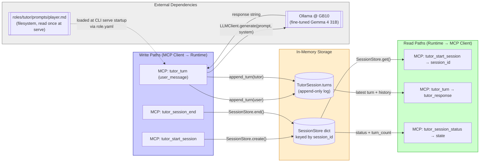
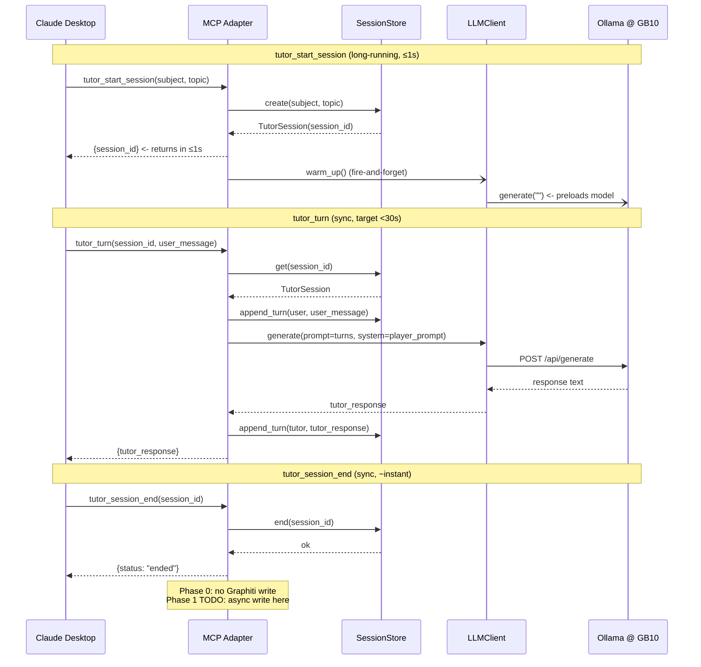
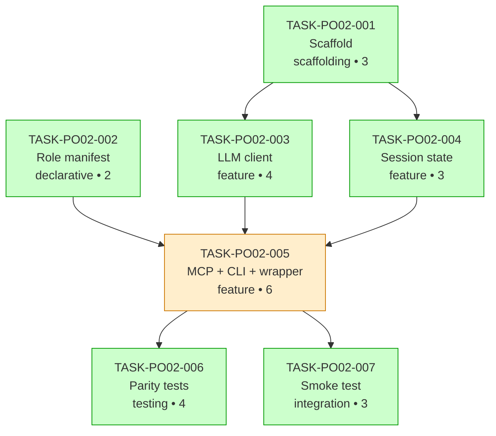

# FEAT-PO-002 Implementation Guide

**Feature:** Fine-tuned English tutoring runtime over local deployment
**Parent review:** [TASK-REV-PO02](../../in_review/TASK-REV-PO02-plan-feat-po-002-tutoring-runtime.md) — score 82/100
**Authoritative spec:** [docs/research/ideas/phase-0-build-plan.md](../../../docs/research/ideas/phase-0-build-plan.md)
**Execution mode:** `/task-work` reviewer-in-loop (no AutoBuild)

---

## Data Flow: Read/Write Paths

This is the primary review artefact. It shows every write and read path for FEAT-PO-002.

**Read as:** Every write has a matching read. The `tutor_session_end` path intentionally has no read — it's a terminal state flip.

**Disconnection check:** ✅ Clean — no orphaned write paths, no orphaned read paths. No write-without-read warnings.

---

## Integration Contracts (Sequence)

Shows the per-turn call sequence from Claude Desktop → MCP adapter → session → LLM client → Ollama → back. The crucial boundary is **MCP adapter ↔ LLM client ↔ Ollama**.

**Crucial checks:**
- `tutor_start_session` returns BEFORE the warm-up LLM call completes (fire-and-forget). This is SR-07 compliance: description says "long-running, returns session_id immediately".
- `tutor_session_end` description says **"marks session ended"** not "triggers async Graphiti write". Phase 0 has no Graphiti; description must match Phase 0 behaviour, not Phase 1.

---

## Task Dependency Graph

_Green = parallel-safe within its wave. Amber = on the critical path (TASK-PO02-005 is the choke point)._

---

## Wave Execution Strategy

### Wave 1 — Foundation (parallel, ~1.5h)

| Task | Mode | Time |
|------|------|------|
| TASK-PO02-001 — Python package scaffold | `/task-work` | 60 min |
| TASK-PO02-002 — Role manifest + player prompt shell | direct | 30 min |

Both tasks are independent — Wave 1 can be executed as two consecutive tasks or via split terminal panes. Single-developer reality means "parallel-safe" just means "no merge conflicts if reviewed separately."

### Wave 2 — Runtime (mixed, ~4h)

| Task | Mode | Time | Blocks |
|------|------|------|--------|
| TASK-PO02-003 — LLM client | `/task-work` | 75 min | TASK-PO02-005 |
| TASK-PO02-004 — Session state | `/task-work` | 45 min | TASK-PO02-005 |
| TASK-PO02-005 — MCP adapter + CLI + wrapper | `/task-work` | 120 min | Wave 3 |

TASK-PO02-003 and TASK-PO02-004 are mutually parallel-safe (both depend only on Wave 1). TASK-PO02-005 is strictly serial — it consumes all three Wave-1/2 artefacts.

### Wave 3 — Hardening (parallel, ~2h)

| Task | Mode | Time |
|------|------|------|
| TASK-PO02-006 — Parity surface tests | `/task-work` | 75 min |
| TASK-PO02-007 — Live smoke test | direct | 45 min |

Wave 3 is the acceptance gate. If TASK-PO02-007 passes, **Phase 0 is submittable as-is** (per build-plan.md:175).

---

## §4: Integration Contracts

Four cross-task data dependencies exist. Consumer tasks carry `consumer_context` blocks in their frontmatter (lean mode — only where the contract has non-obvious format).

### Contract: `AGENT_MODELS__REASONING_MODEL`

- **Producer task:** TASK-PO02-001 (writes placeholder in `.env.example`)
- **Consumer task:** TASK-PO02-003 (reads via `os.environ` inside `_default_player_model()`)
- **Artifact type:** environment variable
- **Format constraint:** string ∈ `{"local", "bedrock", "openai", "anthropic", "gemini"}`. Phase 0 valid values are `"local"` (default, Ollama on GB10) and `"bedrock"` (raises `NotImplementedError`). Others reserved for Phase 1+.
- **Validation method:** `tests/unit/llm/test_provider_resolution.py` (TASK-PO02-006) validates env-var → factory flow end-to-end. SR-03 parity surface.

### Contract: Role manifest path

- **Producer task:** TASK-PO02-002 (creates `roles/tutor/role.yaml`)
- **Consumer task:** TASK-PO02-005 (MCP adapter + CLI load role from `roles/<name>/role.yaml`)
- **Artifact type:** filesystem path
- **Format constraint:** path resolves from the **absolute repo root** set by `scripts/mcp-wrapper.sh` via `cd /absolute/path`. Relative-to-CWD resolution is SR-02 violation.
- **Validation method:** TASK-PO02-007 live smoke test confirms role loads correctly from a wrapper-launched process. SR-02 parity surface.

### Contract: Tutor session interface (implicit)

- **Producer task:** TASK-PO02-004 (defines `TutorSession`, `SessionStore`)
- **Consumer task:** TASK-PO02-005 (MCP handlers)
- **Artifact type:** Python class / in-memory interface
- **Format constraint:** `TutorSession` must remain a plain dataclass — no engine logic, no persistence methods, no async. Phase 1 Graphiti writer wraps this; engine logic in Phase 0 blocks that.
- **Validation method:** Code review at Coach validation. No seam test (internal interface, no format ambiguity).

### Contract: LLM client interface (implicit)

- **Producer task:** TASK-PO02-003 (`LLMClient.generate(prompt, system) -> str`)
- **Consumer task:** TASK-PO02-005 (per-turn call in `_run_tutor_session()`)
- **Artifact type:** Python class / method
- **Format constraint:** synchronous, string-in / string-out. No streaming in Phase 0 (MCP `tutor_turn` is sync per SR-07).
- **Validation method:** Unit test in `test_provider_resolution.py` uses a stubbed client; TASK-PO02-007 exercises the real path end-to-end.

---

## Risk Register (from review)

| Risk | Likelihood | Impact | Owning task |
|------|-----------|--------|-------------|
| Ollama cold-start breaks 30s `tutor_turn` ceiling | Medium | Low | TASK-PO02-005 (warm-up no-op) |
| `tutor_session_end` SR-07 violation (Phase-0 description drift) | High | Medium | TASK-PO02-005 (description text) |
| Role manifest schema drift blocks Phase 1 Coach | Low | Medium | TASK-PO02-002 (copy specialist-agent shape) |
| Parity check on Sunday catches Saturday SR-01/SR-03 miss | Medium | Low | TASK-PO02-006 (shift-left if possible) |
| Session state design leaks assumptions blocking Graphiti | Low | Medium | TASK-PO02-004 (plain dataclass, no engine) |

---

## Next Steps

1. **Begin Wave 1:** `/task-work TASK-PO02-001`
2. After TASK-PO02-001 completes, Wave 1 parallel: `/task-work TASK-PO02-002` (or edit directly — direct mode)
3. **Wave 2:** TASK-PO02-003 and TASK-PO02-004 in parallel, then TASK-PO02-005
4. **Wave 3:** TASK-PO02-006 and TASK-PO02-007 in parallel
5. **Gate:** TASK-PO02-007's live smoke test is the end-of-Saturday review gate. If green, FEAT-PO-002 ships.
