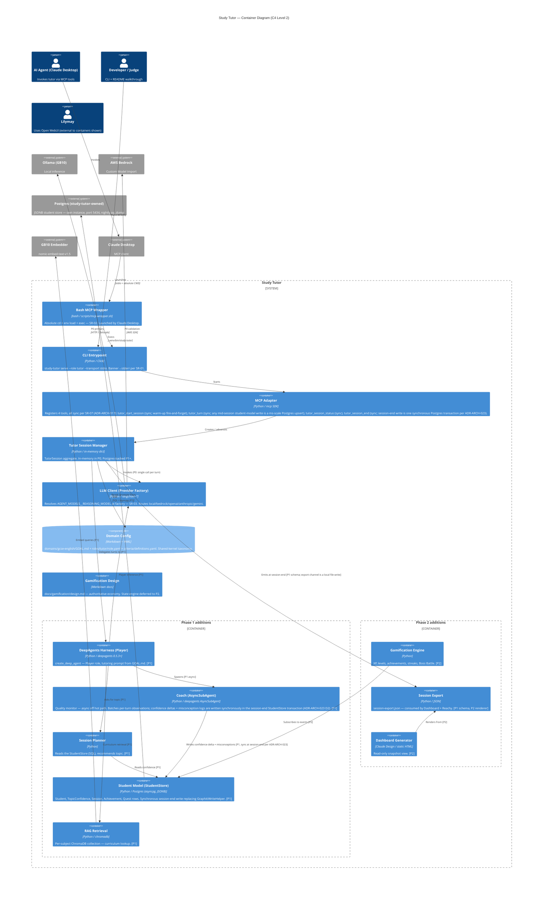

# Study Tutor — C4 Container Diagram (Level 2)

**Status:** Phase 0 canonical.
**Generated:** 2026-04-18 by `/system-arch`.
**Revised:** 2026-07-03 by `/arch-refine` (ADR-ARCH-023) — Graphiti/FalkorDB student model → study-tutor-owned Postgres; synchronous session-end write; mandatory C4 re-review gate approved.
**Approved by:** user, during interactive session.

---

## Purpose

The C4 Level 2 diagram shows Study Tutor's internal containers plus the
immediate external endpoints they talk to. Phase gating is explicit:
solid containers = Phase 0 baseline; containers grouped under `Phase 1
additions` and `Phase 2 additions` arrive in later phases. Relationship
labels mark which phase a particular call path activates.

## Diagram

## What to look for

- **Phase 0 core is 7 containers:** Wrapper → CLI → MCP Adapter → Session
  Manager → LLM Client + Domain Config + Gamification Docs. The Session
  Manager makes a single Ollama/Bedrock call per turn — no deepagents, no
  RAG, no Coach in P0.

- **Phase 1 adds the three-layer architecture runtime:** DeepAgents
  Harness (Player), Coach (async subagent — leveraging deepagents 0.5.3
  `AsyncSubAgent`), Session Planner, Student Model, RAG. Note that the
  Session Manager *delegates* to the Harness in P1 rather than calling
  the LLM Client directly — this is the upgrade path.

- **Phase 2 is three containers + one schema:** Gamification Engine
  (reads student-model events), Session Export (schema lands in P1,
  renderer in P2), Dashboard Generator (Claude-Design-generated static
  HTML).

- **Coach → Student Model is the only write path for confidence deltas.**
  Per **`ADR-ARCH-023`** (D2) this is a **synchronous session-end Postgres
  transaction**; the async CC-13 / `ADR-ARCH-019` write-back is retired
  (no `add_episode` remains — the 79s LLM-per-write tax is gone).

- **Planner → Student Model is read-only.** Recommendation is a read
  operation, no feedback loop to game.

- **LLM Client is the sole boundary with inference endpoints.** CC-03
  anti-corruption boundary visible here — nothing upstream of the LLM
  Client speaks provider-specific protocols.

- **Domain Config is read by both Session Manager (P0) and Harness
  (P1).** This is the shared kernel from Category 2 visible in the
  container graph.

- **Gamification Engine depends only on events from Student Model.**
  Implements CC-11 (in-process event vocabulary); doesn't couple to
  Harness or Session internals.

## Node count

23 nodes (15 internal + 5 external + 3 persons). Well under the 30-node
threshold.

---

*This file is the canonical C4 Level 2 artefact. Revisions require
`/system-arch --mode=refine` or the `/arch-refine` mandatory C4 re-review
gate (last: 2026-07-03, ADR-ARCH-023).*
