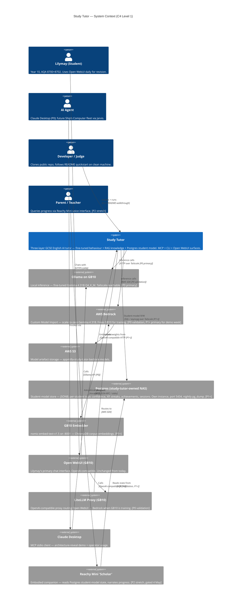

# Study Tutor — C4 System Context Diagram (Level 1)

**Status:** Phase 0 canonical.
**Generated:** 2026-04-18 by `/system-arch`.
**Revised:** 2026-07-03 by `/arch-refine` (ADR-ARCH-023) — Graphiti/FalkorDB student model → study-tutor-owned Postgres; mandatory C4 re-review gate approved.
**Approved by:** user, during interactive session.

---

## Purpose

The C4 Level 1 diagram shows Study Tutor's system boundary, who uses it,
and which external systems it integrates with. Internal containers live
in [`container.md`](./container.md).

Phase labels on each node: `[P0]` = Phase 0 (18–24 April 2026, current
week); `[P1]` = Phase 1 (25 April – 11 May 2026); `[P2]` = Phase 2 (12–16
May 2026).

## Diagram

## What to look for

- **Three distinct inference paths** (Ollama primary, Bedrock validation,
  LiteLLM proxy for Open WebUI) all terminate at the fine-tuned model.
  This is the DEC-07 dual-path architecture that removes the
  GB10-training/inference conflict during demo week.
- **Postgres student store** is a single external store (study-tutor-owned,
  port 5434). The former **Graphiti split topology** (Gemini + FalkorDB +
  Embedder) is retired (ADR-ARCH-023); the GB10 embedder survives only for
  ChromaDB corpus retrieval, not the student model. Dropping the Gemini
  extractor closes the ADR-ARCH-015 on-device-residency exception.
- **Open WebUI appears as external** because it's an unchanged-upstream
  component Study Tutor does not own. Lilymay continues to use it.
- **Reachy reads the Postgres student store directly** — it is a *Student
  Model* consumer, not a *Tutor* consumer. This reflects its role as a
  progress-reporting companion rather than a tutoring surface.
- **Every external system has a Phase label and a Tailscale/network
  annotation** where relevant. The node is informative for reading the
  Phase 0 state vs the target P1/P2 state.

## Node count

14 nodes (4 persons + 1 main system + 9 external) — well under the
30-node threshold. No splitting required.

---

*This file is the canonical C4 Level 1 artefact. Revisions require
`/system-arch --mode=refine` or the `/arch-refine` mandatory C4 re-review
gate (last: 2026-07-03, ADR-ARCH-023).*
