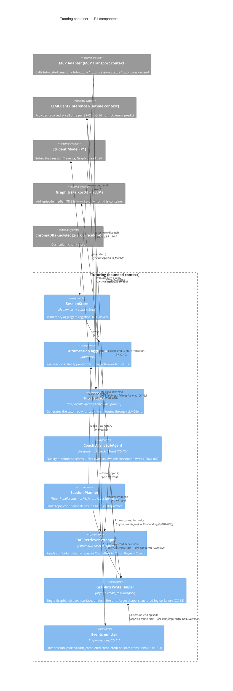

# C4 Level 3 — Tutoring container (Phase 1 components)

**Bounded context:** Tutoring
**Phase:** P1 forward-design (P0 has only a 2-component subset: SessionStore + TutorSession aggregate)
**Generated:** 2026-04-27 by `/system-design --focus="Tutoring"` (refresh)
**Trigger:** Tutoring container crosses the >3-internal-component threshold once Phase 1 lands the Coach AsyncSubAgent + Session Planner + Graphiti Write Helper + RAG Retriever wrapper. Phase 0 deferred this diagram per [`docs/design/README.md §4`](../README.md).
**Related ADRs / DDRs:** [ARCH-012](../../architecture/decisions/ADR-ARCH-012-deepagents-0-5-3-asyncsubagent-coach.md), [ARCH-019](../../architecture/decisions/ADR-ARCH-019-async-graphiti-writeback-every-write-point.md), [DDR-002](../decisions/DDR-002-coach-async-subagent-owns-graphiti-writes.md), [DDR-003](../decisions/DDR-003-session-completed-emits-on-state-transition.md).

> ⚠️ **Stale — regeneration deferred to FEAT-SMP-003 `/system-design` (recorded 2026-07-03 via `/design-refine`).** Two accepted decisions have outrun this diagram: (a) [ADR-ARCH-023](../../architecture/decisions/ADR-ARCH-023-student-model-postgres-jsonb-drop-graphiti.md) retired the Graphiti write path — the Graphiti Write Helper (component 7), the F1–F3 fire-and-forget edges, and the Graphiti external system no longer reflect the architecture (Postgres StudentStore, synchronous writes); (b) the ratified [API-session-cross-device](../contracts/API-session-cross-device.md) contract adds an HTTP/WS App Access adapter and a Postgres-backed, student-keyed `SessionService` at this container's seam. Regenerate when FEAT-SMP-003's `/system-design` decomposes the `SessionService`. The component rationale below remains a valid historical record of the P1 Graphiti-era design.

---

## Component diagram

## Component table

| # | Component | Lives in | Phase live | Owns |
|---|---|---|---|---|
| 1 | `SessionStore` | `src/study_tutor/session/tutor_session.py` (P0) | P0 | UUID → `TutorSession` map; create / get / end |
| 2 | `TutorSession` aggregate | `src/study_tutor/session/tutor_session.py` (P0) | P0 | Per-session state, turns (append-only), status (active / ended) |
| 3 | Tutor Player | `src/study_tutor/roles/tutor/` (P0 stub → P1) | P0 stub, P1 wired | Reply generation via LLMClient + Player prompt |
| 4 | Coach AsyncSubAgent | `src/study_tutor/roles/coach/` (P1) | P1 | Quality monitoring + misconception observations + **F1 dispatch** (per DDR-002) |
| 5 | Session Planner | inside `MCPAdapter.tutor_turn` flow (P1) | P1 | Topic-confidence delta emission; today returns deltas the handler dispatches as **F2** |
| 6 | RAG Retriever wrapper | `src/study_tutor/roles/tutor/` (P1) | P1 | ChromaDB client + ChunkRef serialisation |
| 7 | Graphiti Write Helper | `src/study_tutor/student/graphiti_writer.py` (P1, future) | P1 | Single `add_episode` dispatch surface; `flush.{F-id}` log dimension; CC-13 conformance |
| 8 | Events emitter | `src/study_tutor/session/events.py` (P1, future) | P1 | In-process bus emit for `session.*` (CC-11); DDR-003 timing — emits *before* F3 helper invocation |

External systems shown for context only — they are not Tutoring components:

- **MCP Adapter** lives in MCP Transport context (`src/study_tutor/mcp/adapter.py`).
- **LLMClient** lives in Inference Runtime context (`src/study_tutor/llm/client.py`); CC-14 (`num_ctx`/`num_predict`) is enforced there, not here.
- **Student Model**, **Graphiti**, **ChromaDB** are bounded contexts / external systems; this diagram only shows the edges Tutoring participates in.

## Edge legend

| Style cue | Meaning |
|---|---|
| Sync edges (e.g. `Rel(mcp, player, ...)` with "sync") | Caller-facing path; latency budget binding |
| Fire-and-forget edges (F1 / F2 / F3) | Dispatched via the Graphiti Write Helper; `asyncio.create_task` — caller does not await; failures log-only |
| In-process edges (events to Student Model) | At-most-once; per-aggregate FIFO; subscribers via AsyncSubAgent boundary (CC-12) |

## Why exactly these eight components

- **All three flush points (F1 / F2 / F3) per `DM-tutoring.md §11` are visible** as named edges, each routed through the same Graphiti Write Helper. Auditors can see by inspection that there is no second Graphiti dispatch path — DDR-002's "single helper" rule is structurally enforced by the diagram.
- **The Events emitter and the Graphiti Write Helper are distinct components** even though they both fire on the `tutor_session_end` path. This is the structural expression of DDR-003: events emit on state transition (Events emitter), Graphiti writes are dispatched separately (Helper). A diagram that fused them would obscure the rule and make a future PR's accidental coupling invisible.
- **Tutor Player and Coach are siblings, not parent/child.** The Coach is an `AsyncSubAgent` per ARCH-012; it observes turns produced by the Tutor Player but does not gate them. Drawing them as siblings prevents the diagram from suggesting a synchronous "Tutor → Coach review → reply" flow that does not exist.
- **Session Planner is shown as a Tutoring-internal component, not as its own AsyncSubAgent**, matching DDR-002's Phase 1 stance. The diagram label notes "future AsyncSubAgent" so the migration path is visible. When the migration happens, F2's owner will move from "Tutor handler" to "Planner AsyncSubAgent" — the same edge shape, different owner.
- **`MCPAdapter` is external** because it lives in the MCP Transport context. Tutoring's diagram should not absorb it; doing so would smear the bounded-context boundary.

## Open questions reflected in the diagram

- Open question 4 in [`API-tutoring.md §9`](../contracts/API-tutoring.md): Planner-to-AsyncSubAgent migration. Diagram annotates Planner as "future AsyncSubAgent" so the diagram remains accurate after the migration with only a label change.
- Open question 6 in [`API-tutoring.md §9`](../contracts/API-tutoring.md): a fourth flush site would add a new edge to the Helper (named per the F-id convention from `DM-tutoring.md §11`). Diagram regeneration trivial.

---

*Generated 2026-04-27 by `/system-design --focus="Tutoring"`. Reviewed and approved at the C4 L3 review gate. Re-render via Mermaid Live Editor or `mmdc -i tutoring-c4-l3.md -o tutoring-c4-l3.svg`.*
