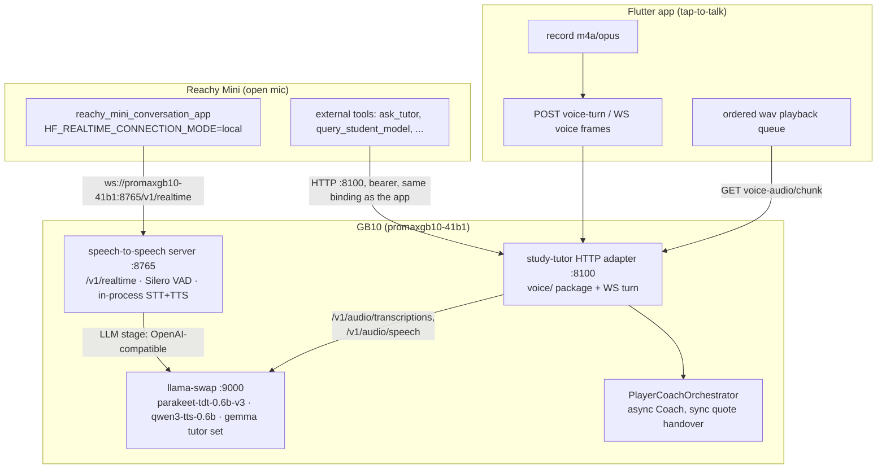

# Voice feature design — tutor voice (server + Flutter) and Reachy local voice migration

**Status:** Proposed — feeds `/design-refine` (contract change) and `/feature-spec` (per wave)
**Date:** 2026-07-05 · **Owner:** Rich
**Authority chain (do not re-open here):**
[unified-voice-orientation.md](../research/ideas/unified-voice-orientation.md) (ratified pins + topology) ·
[ADR-ARCH-024 r1](../architecture/decisions/ADR-ARCH-024-voice-stt-cache-aware-streaming-multilingual-deferred.md) (STT pin, D3 no-cloud-audio, OQ#2 transport) ·
[voice-implementation-blueprint.md](voice-implementation-blueprint.md) (what to lift from `lpa-platform-poc`, phase/gate order) ·
`lpa-platform-poc` ADR-POC-015 r1 · [ADR-ARCH-026](../architecture/decisions/ADR-ARCH-026-player-coach-async-coach-monitor-streaming-ready.md) (async Coach — **Accepted**, ratified at G-RAT 2026-07-05) · [ADR-ARCH-027](../architecture/decisions/ADR-ARCH-027-streaming-quote-handover-chunk-boundary-verification.md) (chunk-boundary quote verification — the §5.4 recommendation, ratified)
**Build plan:** [voice-tutor-and-reachy-scope-and-build-plan.md](../research/ideas/voice-tutor-and-reachy-scope-and-build-plan.md)

---

## 1. What this document adds

The [blueprint](voice-implementation-blueprint.md) already maps what to reuse from the
LPA voice feature and in what order. This design closes the decisions the blueprint
left open, and adds the track the blueprint explicitly excluded (§10 there):

1. **Streaming-first contract design** (owner direction, 2026-07-05): the LLM is the
   latency wall, so the full streaming shape — WS frames, sentence-chunking, audio
   delivery, quote-handover — is designed *now*, and the non-streaming MVP is a
   degenerate case of the same contract. One `BINDING_SHA` re-freeze covers everything.
2. **The Starlette adaptation.** The LPA reference is FastAPI (`APIRouter`,
   `UploadFile`, `Depends`, pydantic-settings); study-tutor's HTTP adapter is
   **Starlette** with hand-rolled routing, per-handler error mapping, and frozen-dataclass
   config ([app.py:434-492](../../src/study_tutor/http/app.py), [auth.py:42-122](../../src/study_tutor/http/auth.py)).
   §5 maps every LPA file to its Starlette-shaped port.
3. **The Reachy Mini local-voice migration** (orientation §4.4): HF `speech-to-speech`
   on the GB10 exposing `/v1/realtime`, robot re-pointed, tool plane untouched — with
   the tutoring path going **direct to the study-tutor, not via Jarvis** (owner
   direction, 2026-07-05).
4. **The Flutter client design**: packages (a deliberate break of the app's
   "zero added runtime dependencies" DoD), ports/adapters/fakes, permissions, and the
   contract-test extension.

## 2. Design principles

- **Streaming-first, MVP as subset.** Every contract shape below is the streaming
  shape; the non-streaming MVP (`POST voice-turn` → whole answer) is the same
  vocabulary with one transcript, one response, one audio ref. Nothing gets redesigned
  when streaming lands.
- **The LLM is the latency wall** (orientation §2). STT is 0.09–0.35 s warm and TTS
  ~1–2 s/sentence — already fast. All UX-latency work targets time-to-first-token
  (TASK-STREAM-001) and overlap (sentence-chunked TTS), not the audio models.
- **Ephemeral audio, strongest form.** The user is a minor. Inbound audio is
  transcribed and discarded; TTS output lives in memory only; no audio bytes at rest
  anywhere; no third-party audio egress. Authority is compound: the no-cloud-egress
  half is ratified ADR-ARCH-024 D3; the never-at-rest half is the blueprint §5
  ephemeral-audio rule (its deliberate D3 strengthening), which this design keeps.
  The Reachy migration *closes* the one standing D3 exception (robot voice currently
  transits HF's cloud).
- **Consume, don't rebuild.** The GB10 endpoints are live (`parakeet-tdt-0.6b-v3` +
  `qwen3-tts-0.6b` behind llama-swap `:9000`, persistent group, preload-first). Nothing
  in this design stands up new *shared* audio serving; only Reachy's s2s server is new,
  and it deliberately duplicates the same pins in-process (orientation §3).
- **Direct to the tutor — no Jarvis in the voice loop.** Both the phone and the robot
  reach the study-tutor's own surfaces. Jarvis keeps its fleet duties; tutoring turns
  never route through it.
- **One freeze, up front.** Voice routes + WS streaming + new error types are a
  single coordinated contract change — **CONTRACT_SHA and BINDING_SHA bumped
  together, once, at gate G-CON before any build wave** — covering
  TASK-STREAM-001's transport work, which then implements against the
  already-frozen shape (binding §7 discipline; this pulls the blueprint's
  Phase-2 re-freeze forward, which is the point of streaming-first).

## 3. Topology



Two deliberately different transports (ADR-ARCH-024 r1, OQ#2): the phone uses discrete
STT/TTS routes orchestrated **server-side inside the tutor's voice-turn**, plus the
tutor's own WS for streaming; the robot uses `/v1/realtime` against its own s2s server.
`/v1/realtime` is Reachy's shape, not the household standard.

## 4. Latency budget (why streaming is designed up front)

Numbers from the live standup (blueprint §2) and ADR-ARCH-026: STT warm 0.09–0.35 s;
Player full generation ≈5 s critical path with async Coach (26B-A4B @ ~55 tok/s);
TTS whole-file mp3 ~1–2 s/sentence; `wav`/`pcm` stream during generation (upstream
claims TTFA <400 ms — treat as unmeasured in our shape).

| Path | Time to first audible audio (est.) | Full answer spoken |
|---|---|---|
| Non-streaming MVP (transcribe → full turn → single TTS) | ~6–9 s | +playback |
| Streaming (tokens → sentence-chunked TTS, first chunk after ~15–25 words) | ~3–5 s | TTS overlaps generation |

Both fit the 15 s app deadline (async Coach already secured the turn path — ADR-ARCH-026
D1), but streaming roughly halves time-to-first-audio and is the only shape that scales
for long answers. Hence: MVP may ship first, but the **contract** ships streaming-shaped
from day one.

## 5. Tutor voice — server design (`src/study_tutor/voice/`)

### 5.1 Package layout and the Starlette adaptation

New package `src/study_tutor/voice/` mirroring the LPA layout, adapted to house idioms:

| LPA file (FastAPI) | study-tutor file (Starlette) | Adaptation |
|---|---|---|
| `src/voice/config.py` — `VoiceSettings(BaseSettings)` | `voice/config.py` — **frozen dataclass** `VoiceConfig.from_env()` | Mirror `HTTPAuthConfig.from_env` ([auth.py:42-107](../../src/study_tutor/http/auth.py)): boot-time frozen config, env read once in `serve-http` wiring (note: this is the boot-snapshot precedent, *not* the SR-03 call-time pattern in `llm/client.py` — voice config doesn't need per-request re-reads). Fields: `stt_base_url`, `stt_model=parakeet-tdt`, `tts_base_url`, `tts_model=qwen3-tts`, `tts_voice=Ryan`, `max_query_seconds=60`, `max_recording_bytes=10MB`, `supported_base_mimetypes`, `enabled` (from `STUDY_TUTOR_VOICE_ENABLED`) |
| `src/voice/clients/audio.py` — `AudioClient` | `voice/client.py` — near-verbatim | Keep injectable `httpx` transport seam, fresh client per call, all httpx errors → `VoiceUnavailable`. Provider-agnostic OpenAI-audio; no framework coupling to remove |
| `src/voice/exceptions.py` — `VoiceHttpError(HTTPException)` | `voice/errors.py` — plain exception hierarchy | **Do not** subclass HTTPException. Voice errors are domain errors mapped per-handler like [`_map_error_to_response`](../../src/study_tutor/http/app.py) (app.py:45-85), into the tutor's `{"error","error_type"}` envelope (§8.3) |
| `src/voice/utils.py` — WebM/Ogg duration probe | `voice/utils.py` — verbatim + optional MP4 probe | Phone records m4a (MP4 container): add a stdlib `moov/mvhd` duration read if cheap; otherwise m4a relies on the byte cap + client-side 60 s stop (both already enforced) |
| `src/voice/router.py` — `validate_audio_upload` (Depends) | `voice/validation.py` — plain async function | Same **order-sensitive** checks: size → empty → base-MIME → best-effort duration (order is implementation-defined in the LPA — add an order-pinning test in the port). **Parse the multipart in memory, not via `await request.form()`**: Starlette spools file parts >1 MB to a disk-backed `SpooledTemporaryFile`, which would break the never-at-rest invariant (§5.6) — stream-parse with `python-multipart` over `request.stream()`, enforcing the 10 MB cap during the read. `python-multipart` becomes an explicit direct pin in `pyproject.toml` (today it's transitive via `mcp` — same rationale as the existing starlette/uvicorn direct pins). Upload field name `audio` |
| `src/voice/service.py` | `voice/service.py` — much smaller | Only `voice_turn` orchestration + TTS chunk synthesis. **Do not port**: narration cache, batch `BackgroundTask` jobs, donor/attorney resolution (blueprint §3 exclusions) |

Wiring: routes appended in `create_app` **only when `voice_config.enabled`** — the
`/__dev__/reset` conditional-route precedent (app.py:478-481; absent flag ⇒ 404).
Dependencies ride `app.state` like everything else.

### 5.2 Routes and WS frames (the streaming-first contract)

Additions to binding §2 — all bearer-authenticated, student derived server-side,
session ownership enforced (403 on mismatch), exactly like the existing verbs:

| Verb | Method + path | Request | Response |
|---|---|---|---|
| `voice_turn` | `POST /api/sessions/{session_id}/voice-turn` | multipart field `audio` (filename + content-type intact); `stream` reserved-and-ignored like `turn` (app.py:265) | `{ transcript, tutor_response, audio: [{seq, chunk_id, url}] }` — MVP: one chunk |
| `voice_audio` | `GET /api/sessions/{session_id}/voice-audio/{chunk_id}` | — | `audio/wav` bytes from the in-memory chunk store |
| `turn_ws` | `GET /api/sessions/{session_id}/ws` (WS upgrade) | frames below | frames below |

The WS route is a `WebSocketRoute` — new to the route table, which today is
`Route`-only. Auth reuses `resolve_student_from_token` on the upgrade request's
`Authorization` header (it takes the raw header string); errors surface as the
`{type:"error"}` frame below instead of the per-handler JSON envelope. **Server
dependency:** the deploy pins plain `uvicorn`, which rejects WS upgrades without a
protocol library — FEAT-VOICE-002 pins `uvicorn[standard]` (or an explicit
`websockets` dep) in `pyproject.toml`.

WS frame vocabulary — extends the **pre-committed** contract §7 frames
(`API-session-cross-device.md:75-80`: `{type:"token", text}` … `{type:"done", turn_index}`),
never replaces them:

```
client → server:
  {type:"turn", user_message, stream:true}          # text turn (TASK-STREAM-001)
  {type:"voice_turn", content_type, size_bytes}     # header, then ONE binary WS
  <binary frame: the recorded clip, ≤10 MB>         # message with the audio

server → client (voice turn):
  {type:"transcript", text}                         # first — doubles as STT confirmation UI
  {type:"token", text}          × N                 # contract §7, unchanged
  {type:"audio_ref", seq, chunk_id, url} × M        # one per synthesized sentence chunk
  {type:"done", turn_index}                         # contract §7, unchanged
  {type:"error", error, error_type}                 # closed-set envelope on the WS
```

Server-side streaming implements — **and widens** — the existing stubs:
`SessionService.turn_stream()` ([service.py:299-316](../../src/study_tutor/session/service.py) —
currently `NotImplementedError`), `TurnEvent` (service.py:163-169, today
`Literal["token","done"]` — gains `transcript`/`audio_ref`/`error` members and the
`seq`/`chunk_id`/`url` fields as part of the same §8 freeze), and `ReplyStreamFn`
(service.py:95 — stays a plain token-string iterator; voice frames are emitted by the
voice layer around it). The Player needs a real `generate_stream` — the current
`LLMClient` hardcodes `"stream": False` and is a sync client
([llm/client.py:185](../../src/study_tutor/llm/client.py), blocking `httpx.post`),
bridged via `asyncio.to_thread` in the Player adapter
([llm_player_adapter.py:162,192](../../src/study_tutor/tutoring/adapters/llm_player_adapter.py)) —
so TASK-STREAM-001 Scope 1 touches the adapter seam as well as the client; not
duplicated here.

**Why chunk-by-URL, not inline/binary audio down the WS:** one delivery mechanism
serves both MVP (HTTP JSON can't carry binary cleanly) and streaming; JSON-only frames
keep the frame vocabulary uniform and testable; the client fetches `audio/wav` with the
same bearer header it already sends. Cost: one GET per sentence chunk on a LAN — noise
next to the LLM. Chunk store: in-memory, TTL ≤120 s, capped, **never disk**
(the §5.6 never-at-rest invariant).
Single-process assumption is acceptable under the single-user posture (ADR-ARCH-014)
and the current single-worker uvicorn deploy; noted as a multi-worker redesign item,
same as the LPA flagged.

### 5.3 Sentence-chunked TTS

Buffer the token stream to sentence boundaries at ~15–25 words (orientation §2 — keeps
Qwen3-TTS voice consistency), one `/v1/audio/speech` call per chunk with
`response_format=wav`, emit `audio_ref` as each chunk completes. Chunks are synthesized
and played **in order** (`seq`). MVP degenerates to one chunk covering the whole answer.

### 5.4 Quote-verification handover under streaming — recommendation

ADR-ARCH-026 D3 keeps `apply_quote_verification` synchronous ("do not show a fabricated
quote"). The blueprint (§4.3) forbids voice from deciding the streaming handover
silently — so this design decides it *explicitly*, for ratification at **G-RAT**
(pulled forward from the blueprint's TASK-STREAM-001-design-pass placement, because
streaming-first means the handover shape must be settled before the contract freezes):

**Recommended: verify-at-the-chunk-boundary.** The sentence buffer (§5.3) is already a
hold point. Run quote verification incrementally on each completed sentence *before*
it is emitted as tokens+audio; a sentence containing an unverifiable quote is
corrected/annotated before it is ever spoken or shown. Rationale: for a minor-facing
tutor, **speaking** a fabricated quote aloud is strictly worse than showing one, and
per-sentence verification costs only the chunk latency already being paid for TTS —
unlike verify-then-stream (which would hold *all* tokens until full generation,
cancelling streaming entirely) or stream-then-annotate (which speaks unverified
quotes). Record the outcome as an ADR-ARCH-026 revision or a small new ADR at G-RAT.

### 5.5 Error taxonomy → tutor envelope

Ported from the LPA closed set, **re-homed** into the tutor envelope (never the LPA's
`{error_code, message}` body):

| Exception (`voice/errors.py`) | HTTP | `error_type` |
|---|---|---|
| `RecordingTooLarge` / `QueryTooLong` | 413 | class name |
| `UnsupportedAudioFormat` | 415 | class name |
| `EmptyRecording` / `UnintelligibleQuery` | 422 | class name |
| `VoiceUnavailable` | 503 | class name |

`error_type` = exception class name, matching the existing convention
(`SessionNotFoundError` etc.). This **extends the closed set in contract §9** → part of
the one `/design-refine` + `BINDING_SHA` bump (§8). The LPA's `VoiceCommandRefused`
(read-only guard) is not ported — a tutor voice turn *is* the command.

**Degradation is a feature with copy, not an error path:** on `VoiceUnavailable` the
app shows "Spoken answers aren't available right now — text still works" and the text
`turn` path is untouched. No cloud failover exists by design (D3).

### 5.6 Ephemeral-audio invariants (testable)

These invariants are this design's D3-derived strengthening (per blueprint §5), not
ratified ADR text — a future relaxation is a design change here, not an ADR re-open.

- Inbound bytes: validated → transcribed → discarded. No write to disk, DB, or logs —
  which is why §5.1 mandates in-memory multipart parsing (Starlette's default
  `request.form()` would spool >1 MB uploads to disk temp files).
- Session history stores the transcript **as a typed turn** via the unchanged
  `SessionService.turn()` persistence path (two rows per exchange, service.py:274-297).
- TTS bytes: in-memory chunk store only, TTL-evicted.
- Live smoke sweeps DB (`no bytea`/blob columns) + disk, per the LPA evidence method.

## 6. Tutor voice — Flutter client design (`app/`)

### 6.1 Scope event: new runtime dependencies

The app's dependency posture is deliberately austere (phase-1 DoD; amended once in
phase 2 for `http`). Voice amends it again — record it as a conscious scope change in
the feature spec:

- **Recorder:** `record` (AAC/m4a default; can emit opus) — final encoder choice gated
  on the Phase-0 m4a-against-live-STT test (blueprint §6/§8).
- **Playback:** `just_audio` (ordered queue of wav chunks; plays from URL with headers
  or from bytes).
- **WS:** `web_socket_channel`. Note: its Android implementation rides dart:io's
  `WebSocket` — pure Dart, **not** the native platform stack — so, exactly like
  `package:http`, it does not consult the Android network-security-config. Any
  fail-closed cleartext control must live in Dart (the open item already logged in
  `app/QUESTIONS.md`); extending the NSC is documented-posture hygiene only.
- Pin exact versions at build time in `pubspec.yaml`/`pubspec.lock`; no state-mgmt
  package is added (plain `StatefulWidget` + constructor injection stays).

Dependency-posture history, stated honestly: phase 1 pinned "zero added runtime
deps"; phase 2 amended it once (`http` — "the one approved dep", `app/PROGRESS.md:41`;
`README.md:148-149` is the stale phase-1 wording). Voice is the **second** amendment,
adding three.

Platform manifests (today: **none** of these exist):
- Android main manifest: add `INTERNET` (currently debug/profile-only — **a release
  build has no network permission at all**) + `RECORD_AUDIO`.
- iOS `Info.plist`: `NSMicrophoneUsageDescription`.
- Cleartext to the GB10 host: per the WS note above, the app's own dart:io traffic
  bypasses the NSC — keep the NSC extension as posture hygiene, and treat Dart-side
  fail-closed cleartext control as the real enforcement (open `QUESTIONS.md` item).
  Never blanket `usesCleartextTraffic`.

### 6.2 Ports & adapters

New **sibling port**, leaving the frozen `SessionApi` untouched:

```dart
abstract interface class VoiceApi {
  Future<VoiceTurnResult> voiceTurn(String sessionId, Uint8List audio,
      {required String contentType});                 // MVP (HTTP)
  Stream<VoiceTurnEvent> voiceTurnStream(String sessionId, Uint8List audio,
      {required String contentType});                 // streaming (WS)
  Future<Uint8List> fetchAudioChunk(String sessionId, String chunkId);
}
```

- `HttpVoiceApi` reuses the `HttpSessionApi` seams: base-URL normalization
  ([http_session_api.dart:35-37](../../app/lib/adapters/http_session_api.dart)),
  `_headers()` bearer injection, the §9 envelope → sealed-exception mapping
  ([http_session_api.dart:73-147](../../app/lib/adapters/http_session_api.dart)) —
  extended with the six voice `error_type`s as new sealed members, the
  `VoiceUnavailable` member driving the degradation copy.
- `FakeVoiceApi`: canned transcript + tiny silent-wav bytes; a `FlakyVoiceApi`
  decorator mirrors `FlakySessionApi` for failure-path tests.
- Composition in `main.dart` follows `composeSessionApi` (compile-time
  `API_BASE_URL` flavour switch, main.dart:15-27).

### 6.3 Tap-to-talk UX (SessionScreen)

- Mic button joins the input row (session_screen.dart:173-199), guarded by the existing
  `_sending`/`_ended` flags. Press → record (elapsed indicator) → press → send.
  **Hard stop at 60 s client-side** — the real enforcement (streamed containers omit
  duration headers; server cap is best-effort); 10 MB byte cap as backstop.
- On send: show the transcript as soon as it arrives (frame 1 in streaming; response
  field in MVP) — it is the user-visible confirmation the STT heard correctly, and it
  enters the transcript list exactly like a typed turn.
- Playback: ordered queue keyed by `seq`; text tokens render incrementally (streaming)
  ahead of audio.
- Degradation: `VoiceUnavailable` → amber notice ("Spoken answers aren't available
  right now — text still works"), mic stays visible but disabled for the session until
  a retry succeeds; typed turns unaffected. Transport errors keep the existing
  `showConnectionProblem` treatment (input/recording preserved, retry = repeat).
- No VAD, no open-mic, no barge-in on the phone — exactly the trade ADR-ARCH-024 r1
  accepted; the sole revisit trigger is **open-mic/barge-in** landing on the phone
  (the ADR's wording — open-mic alone re-opens the STT pin too).

### 6.4 Testing

- **Hermetic:** MockClient direction pins for `voiceTurn` (method/path/auth/multipart
  field name `audio`/filename/content-type with codec params intact — the LPA
  "green but broken" defence, ported to the Dart seam); contract-style test bodies
  with the dual-backend harness (`ContractBackend` → fake + live implementations,
  [contract_backend.dart:14](../../app/test/contract/contract_backend.dart)); widget
  tests for record→send→playback states and degradation copy.
- **Live:** voice variants join `app/test_live/` alongside TASK-STREAM-001 Scope 4's
  streaming variants, under the existing live-suite discipline (same bodies,
  `LiveContractBackend`; `--concurrency=1` per the binding's global-reset note;
  quiet GPU; 60 s turn-deadline precedent).
- **Web-target trick** (only if the Flutter web bonus target is exercised): shim
  `getUserMedia` with a WebAudio `MediaStreamDestination` playing a base64 WAV —
  headless Chromium's fake-device flag yields no audio on the GB10 (LPA browser-E2E
  lesson).

## 7. Reachy Mini — local voice migration

### 7.1 What moves, what stays

Structural fact (orientation §1): the robot's **audio/LLM plane** (today: HF-hosted
Realtime session, open mic) is separate from its **tool plane** (`ask_jarvis`,
`query_student_model`, Personality Studio profiles, NATS wiring). This migration swaps
only the former. It also **closes the D3 residency exception**: a minor's voice stops
transiting HF's cloud.

### 7.2 s2s server on the GB10 (new component)

Nothing exists yet (grep-verified across `dgx-spark`) — this is greenfield:

- **Component:** HF [`speech-to-speech`](https://github.com/huggingface/speech-to-speech)
  in realtime mode: cascaded Silero-VAD-v5 → STT → LLM → TTS exposing an
  OpenAI-Realtime-compatible WS at `/v1/realtime` (default `ws://…:8765/v1/realtime`).
  Must bind non-loopback for the Pi to reach it.
- **Stages:** `--stt parakeet-tdt` (default; resolves `nvidia/parakeet-tdt-0.6b-v3` on
  CUDA via nano-parakeet, pure PyTorch — no NeMo-on-aarch64 pain). TTS `--tts qwen3`
  with `--qwen3_tts_model_name Qwen/Qwen3-TTS-12Hz-0.6B-CustomVoice` — **the pipeline's
  documented default is the 1.7B checkpoint; the 0.6B swap is plausible-but-unverified
  → Phase-0 gate** (fallback: accept 1.7B on the robot path only, pins revisited — an
  owner decision if the gate fails). Voice: keep the fleet pin `Ryan` for one
  consistent voice across robot/app/LPA. Honest status: Ryan appears in the HF
  backend's supported-voices list (`reachy/.env.example:23`) but nothing deployed sets
  `MODEL_VOICE` — the robot currently speaks the backend default. Under local s2s the
  Ryan pin is configured **server-side**; locating that voice flag is an R1 item.
  (Per-profile `voice.txt` values like `Kore` are ignored by the HF backend.)
- **LLM stage → llama-swap:** `--llm_backend responses-api
  --responses_api_base_url http://127.0.0.1:9000/v1` — reasoning stays on the shared
  front door; only STT/TTS duplicate in-process (~4–6 GB, accepted in the ratified
  orientation §3). **Residency caveat the orientation didn't price:** the deployed
  tutor alias (`gemma4-tutor`) is *on-demand* (`ttl: 1800`) and lives only in the
  `tutor` matrix set — a robot turn arriving while another set is active forces a
  set switch (evicting the resident family), and after 30 min idle the next turn pays
  a 26B cold load. The robot's resident-set posture (promote the alias into more sets,
  add a robot set, or knowingly accept the thrash) is an explicit W0-R gate (R-G5),
  not a silent consequence.
- **Residency is its own decision:** llama-swap fronts HTTP request/response; a
  persistent-WS server does not fit the swap-on-request model. Run s2s as a standalone
  systemd/docker unit on `:8765` with digest-pinned images / vendored install (the
  dgx-spark single-maintainer discipline), **outside** llama-swap. Memory arithmetic
  gate before standup: steady state has been ~107–116 GB of 121 GB, and TTS CUDA
  context creation fails outright at ~110 GB used — re-do the sums, don't assume.
- **aarch64/CUDA-13 traps (from verified research):** install
  `qwentts-cpp-python==0.3.0+cu130` from the cu130 aarch64 wheelhouse *before*
  `speech-to-speech` (default wheel targets cu128); the repo's `Dockerfile.arm64` is
  CUDA 12.8-based — compatibility with the GB10's CUDA 13 host is **unverified →
  Phase-0 gate**; no documented end-to-end GB10 run exists → the standup itself is
  gated, runbook-style.

### 7.3 Re-pointing the robot (verified: config-only)

`reachy_mini_conversation_app` documents the override — no code patch:

```
HF_REALTIME_CONNECTION_MODE=local
HF_REALTIME_WS_URL=ws://promaxgb10-41b1:8765/v1/realtime
```

**Pi deployment quirk (Scholar runbook):** the daemon launcher passes no env from
`.bashrc`/`/etc/environment`/`.env` — inject via
`/venvs/apps_venv/.../sitecustomize.py` `os.environ.setdefault(...)`, exactly like
`NATS_URL` today. Never set `REACHY_MINI_EXTERNAL_PROFILES_DIRECTORY` on the Pi
(conflicts with Personality Studio).

**Tool-plane verification is a gate, not an assumption.** Tools ride the Realtime
session; under the HF cloud backend they demonstrably fire, but whether the s2s
server's Realtime implementation forwards tool calls end-to-end is unverified.
Phase-0 gate: a scripted session against local s2s must trigger
`query_student_model` and observe the result narrated.

### 7.4 Direct to the tutor: `ask_tutor` replaces `ask_jarvis` in the loop

Owner direction: no Jarvis in the tutoring loop. New external tool
`ask_tutor` in `fleet-gateway/reachy/external_content/external_tools/`, cloned from
`ask_jarvis`'s plumbing (connect-per-call, generous timeout, graceful offline string,
Pollen `core_tools.Tool` ABC — `parameters_schema` + `async __call__`, the shape the
ABC actually requires):

- **Transport: HTTP to the study-tutor adapter (`http://promaxgb10-41b1:8100`), bearer
  token, same binding the app consumes.** Chosen over the NATS command surface because
  it gives the robot *identical* session semantics to the phone by construction —
  same student derivation, `resume_if_active`, durable Postgres-backed sessions —
  which is what makes D8 phone↔robot mid-thread pickup real. (NATS
  `agents.command.gcse-tutor` remains a documented alternative; it predates the
  durable-sessions work and would need parity checks.)
- **Behaviour:** first call ensures a session (`POST /api/sessions/start` with
  `resume_if_active: true` — resumes the session the phone may have started), then
  `POST …/turn` per question; returns `tutor_response` text to the Realtime session,
  which speaks it in the robot's voice. Sessions are left open for cross-device pickup
  (the tutor's own lifecycle rules apply). **Precondition D8 pickup depends on:**
  `resume_if_active` matches on `(student, subject)`, not student alone, and the HTTP
  handler defaults an omitted subject to `""` — so `ask_tutor` must send the
  *identical* subject string the app uses (pin the constant, currently `maths` per
  `app/lib/ui/home_screen.dart:12`, in the tool's config). Omitting it would silently
  create a parallel subject-`""` session and pickup would never happen.
- **Latency honesty:** a tutor turn is ~5 s+ (the Player wall). The persona
  (`instructions.txt`) should cover the gap conversationally ("let me think about
  that…") — same trick as `ask_jarvis`'s narration-friendly waits. Simple
  conversational turns stay with the s2s LLM stage (today they never left the Realtime
  session either); `ask_tutor` is for *tutoring* turns, per the Scholar persona's
  existing tool-selection instructions.
- `ask_jarvis` stays installed for non-tutoring fleet queries; `query_student_model`
  and the rest of the tool plane are untouched. Update the Scholar profile's
  `tools.txt` (and reconcile the known repo-vs-Pi profile drift while there).

### 7.5 Robot voice-loop latency budget

Silero VAD endpointing (in-process) → Parakeet ~0.2–0.5 s → LLM stage (llama-swap
Gemma, the wall) → Qwen3-TTS streaming. Simple conversational turns: ~1–2.5 s
(prior design estimate, to be verified live — and **warm-set-only**: a set switch or
ttl-expired cold load adds tens of seconds, which is exactly what gate R-G5 prices). `ask_tutor` turns add the tutor's ~5 s+
critical path — acceptable for a deliberate "ask the tutor" interaction, covered by
persona filler. Open-mic VAD quirks inherited from today's deployment (aggressive
end-pointing on long questions) are unchanged by this migration and stay a known
behaviour, not a regression.

## 8. The contract change (one freeze)

Single coordinated change, executed **at gate G-CON, before any build wave** — it
covers TASK-STREAM-001's transport shape, so the later implementation builds against
an already-frozen contract and no second freeze occurs (binding §7: coordinate with
the app side, migration plan if apps in the wild, `/design-refine` because it touches
binding §2 and contract §§7/9). The change edits **both frozen documents**, so both
SHAs bump together, once:

1. **Binding §2:** add `voice_turn`, `voice_audio`, and the WS `turn` route (§5.2).
2. **Contract §7** (`API-session-cross-device.md`): extend the frame vocabulary with
   `transcript`, `voice_turn` (+ one binary upload frame), `audio_ref`, `error` —
   `token`/`done` unchanged.
3. **Contract §9 / binding §4:** add the six voice `error_type`s (§5.5) to the closed
   set (the set is a closed contract; `session/errors.py:6-9` says extending it
   requires `/design-refine` on the cross-device contract).
4. Re-freeze both docs; **re-pin `CONTRACT_SHA`** (binding header) and **bump
   `BINDING_SHA`**, with the voice-phase pins recorded in the
   [build plan §0 header](../research/ideas/voice-tutor-and-reachy-scope-and-build-plan.md)
   — the living consumption point. The phase-2 plan header, `app/PROGRESS.md`,
   and the dev-deploy runbook keep their `22791afb…`/`6eb7b88c…` pins untouched:
   they are the historical record of what phase 2 verified, and the change is
   additive so those clients stay valid. (There is no app-side config pin;
   `main.dart` carries only `API_BASE_URL`.)
   **Executed 2026-07-05:** contract Rev 1 = `574615e9…`, binding Rev 1 = `e50897d1…`.

The Reachy track touches **none** of this contract (its surface is `/v1/realtime` +
the same already-frozen session verbs via `ask_tutor`), so robot work never blocks on
the freeze.

## 9. Design decisions

| Decision | Choice | Reasoning |
|---|---|---|
| Contract posture | Streaming-first; MVP is a subset | LLM is the latency wall; avoids a second freeze and a client redesign (owner direction 2026-07-05) |
| Framework port | LPA *shape*, Starlette idioms | The adapter is Starlette; FastAPI constructs (Depends/UploadFile/BaseSettings) have direct, already-proven house equivalents |
| Audio delivery | Chunk-by-URL (`voice_audio` route), JSON-only WS frames | One mechanism for MVP + streaming; bearer-auth reuse; testable; LAN GET cost is noise vs the LLM |
| Voice errors | Six new `error_type`s (class-name convention) in the closed envelope | Matches existing envelope contract; bundled into the one freeze |
| Quote handover | **Recommend** verify-at-the-chunk-boundary (§5.4) | Never speak an unverified quote; preserves streaming; decided explicitly, ratified at G-RAT (pulled forward from the blueprint's TASK-STREAM-001-design-pass placement) — not silently |
| Phone interaction | Tap-to-talk; client-side 60 s stop; m4a-first, opus fallback | OQ#3 resolution; ADR-ARCH-024 r1 trade; container-cap lesson from the LPA |
| Flutter deps | `record`, `just_audio`, `web_socket_channel` — and nothing else | Smallest set covering record/playback/WS; breaks the zero-deps DoD deliberately and visibly |
| Robot LLM stage | llama-swap `:9000` Gemma (shared front door) | Ratified orientation §3; keeps one reasoning stack; STT/TTS duplication accepted |
| Robot tutoring path | `ask_tutor` tool → HTTP adapter `:8100` (no Jarvis) | Owner direction; identical session semantics to the phone makes D8 pickup real by construction |
| s2s residency | Standalone unit on `:8765`, not behind llama-swap | Persistent WS doesn't fit swap-on-request; residency + memory arithmetic is its own gate |
| Robot TTS checkpoint | Try 0.6B pin in s2s; 1.7B fallback is an owner decision | Pin consistency vs unverified 0.6B support in the s2s qwen3 backend — Phase-0 gate decides |

## 10. Open items carried into gates (not silently decided)

1. ~~Quote-handover ratification (§5.4) — ADR at G-RAT.~~ **Done:** ADR-ARCH-027 (2026-07-05).
2. m4a acceptance by live STT + recorder encoder choice — Phase-0.
3. s2s on GB10: install path (bare-metal cu130 wheels vs patched ARM64 container),
   0.6B TTS checkpoint support, tool-call forwarding, open-mic latency, and the
   robot's resident-set posture for the LLM alias (R-G5) — Phase-0/R1.
4. Robot session lifecycle detail (when, if ever, the robot ends a session) — feature
   spec for `ask_tutor`.
5. Keycloak: D9 unchanged — interim single-user token; the robot uses the same
   dev-table token mechanism until Keycloak fronts `:8100`.

## 11. References

- [Blueprint](voice-implementation-blueprint.md) · [Orientation](../research/ideas/unified-voice-orientation.md) · [ADR-ARCH-024 r1](../architecture/decisions/ADR-ARCH-024-voice-stt-cache-aware-streaming-multilingual-deferred.md) · [ADR-ARCH-026](../architecture/decisions/ADR-ARCH-026-player-coach-async-coach-monitor-streaming-ready.md) · [ADR-ARCH-025](../architecture/decisions/ADR-ARCH-025-flutter-app-in-monorepo.md)
- [API-session-http-binding.md](contracts/API-session-http-binding.md) + `API-session-cross-device.md` §7/§9 · [TASK-STREAM-001](../../tasks/backlog/TASK-STREAM-001-tutor-turn-token-streaming.md) · [conversation starter](../handoffs/study-tutor-mobile-voice-conversation-starter.md)
- `lpa-platform-poc`: `src/voice/`, `tests/voice/`, ADR-POC-015 r1, TASK-VOICE-011, `RUNBOOK/RESULTS-gb10-voice-unified-2026-07.md`
- `fleet-gateway`: `reachy/RUNBOOK-deploy-scholar-reachy-mini.md`, `reachy/external_content/`
- `dgx-spark`: `vendor/README.md` (digests; note the Docker Hub image is `martinb78/parakeet-tdt-v3-spark` — the orientation doc's `dgx-spark-parakeet-asr` name is the *GitHub repo*, not the image), `scripts/audio-*.sh`, `examples/llama-swap-config.gb10-live-2026-07-05-voice-unified.yaml`
- External (verified 2026-07-05): [HF "Reachy Mini goes fully local"](https://huggingface.co/blog/local-reachy-mini-conversation) · [huggingface/speech-to-speech](https://github.com/huggingface/speech-to-speech) · [pollen-robotics/reachy_mini_conversation_app README](https://github.com/pollen-robotics/reachy_mini_conversation_app) (`HF_REALTIME_CONNECTION_MODE`/`HF_REALTIME_WS_URL`) · [cu130 aarch64 wheelhouse](https://huggingface.co/datasets/andito/qwentts-cpp-python-wheels)

---

*Drafted 2026-07-05 from the blueprint + orientation + eleven-source digest. Next action: G-RAT gates in the [build plan](../research/ideas/voice-tutor-and-reachy-scope-and-build-plan.md) §5a.*
