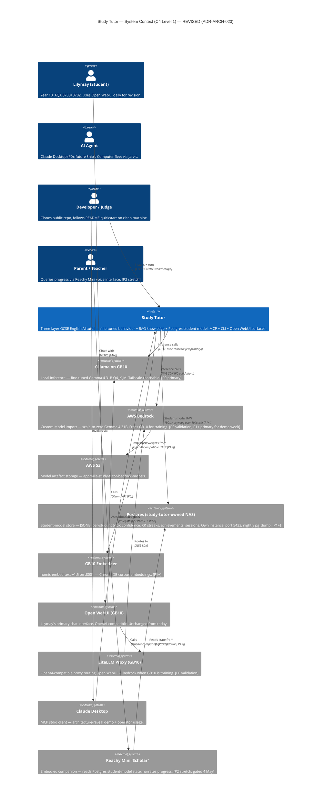
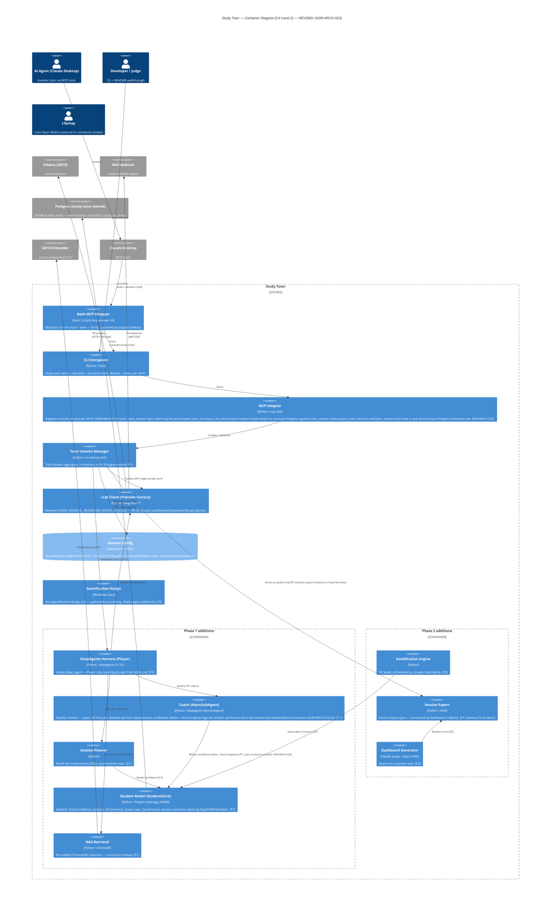

# /arch-refine — history

Captured automatically by `.claude/hooks/capture_slash_command.py`.


---

## /arch-refine — 2026-07-03T05:53:02Z

### Prompt

```
/arch-refine \
  --target docs/architecture/decisions/ADR-ARCH-023-student-model-postgres-jsonb-drop-graphiti.md \
  --context docs/research/ideas/student-model-postgres-migration-scope-and-build-plan.md \
  --context docs/gamification/design.md
```

### Assistant response

I'll execute the `/arch-refine` command. Since you've passed `--target` (a direct ADR path), I'll skip semantic disambiguation but still confirm the selection before any changes. Let me start by loading the target ADR, the context files, and checking Graphiti availability.

Both context files and the target ADR are loaded. Before I present the selection and confirmation gate, I need the current state of the ADRs this refinement will cascade into, plus any C4 diagrams that the re-review gate would cover. Let me gather those.

This is the **G-ADR ratification gate** from the build plan §5a — and my read of the surrounding ADRs surfaces some important nuances I need to reflect accurately before touching anything. Let me pull the C4 diagrams and the index so my impact analysis and the mandatory C4 re-review gate are concrete.

I now have the full dependency picture. This invocation is the **G-ADR ratification gate** from the build plan (§5a / §9 Step 1), and my read of the surrounding ADRs surfaces several things that change how it should be applied. Let me lay them out before touching anything — the command requires explicit confirmation before applying changes.

---

## Graphiti availability (Tier 1)

`.guardkit/graphiti.yaml` → `enabled: true` (FalkorDB `whitestocks:6379`, vLLM `qwen-graphiti`). So config-level `graphiti_available = true`, but connectivity is unverified and this is the very stack ADR-023 decommissions. I'll run the Tier‑2 check only if you opt to seed at the end (Phase 8) — and flag the irony of seeding a "drop Graphiti" ADR *into* Graphiti then.

---

## ✓ SELECTED: ADR-ARCH-023 — drop Graphiti/FalkorDB, adopt study-tutor-owned Postgres (JSONB)

**Current state:** `Status: Proposed` (dated 2026-07-02). Header already declares `Supersedes: ADR-ARCH-003, -007, -019` and "Retires the CC-13 invariant of ADR-ARCH-021."

## This is a ratification, not a supersession — the key deviation

The command's literal Phase 3 mints a *new* ADR that supersedes the target. **That is wrong here.** ADR-023 is *already* the superseding record; minting a new one would create a nonsensical **ADR-025 that supersedes ADR-023** (and 024 already exists). The gate's actual job (§5a/§9): flip **023 → Accepted** and make its declared supersessions effective.

## Change-set I propose to apply

| ADR | Current | Action | Note |
|---|---|---|---|
| **023** (target) | Proposed | → **Accepted** | ratify in place |
| **007** Graphiti split topology | Accepted | → **Superseded by 023** | FalkorDB/Gemini/embedder split is dropped |
| **019** async write-back every point | Accepted | → **Superseded by 023** | D2 reverts writes to synchronous |
| **003** async write-back session-end | **already Superseded by 019** | **no-op** | leave pointing at 019 — preserves the 003→019→023 chain; repointing to 023 would erase 019 from history |
| **021** typed-entity seed | Accepted | **annotate only** | its CC-13 single-call-site invariant is retired by 023; ADR stays Accepted |
| **022** corpus retrieval | Proposed | **out of scope** | build plan §5a: ratify on its own track; doesn't gate SMP |

> Note: the build plan says "flip 003/007/019." 003 is already superseded, so it's a no-op — I've reflected that above.

## ⚡ Impact analysis

**🔍 C4 re-review gate — TRIGGERED (mandatory).** Removing FalkorDB + Gemini-as-extractor and swapping `student_model` from `graphiti-core` to a Postgres client is a topology change:
- **system-context.md (L1):** removes `FalkorDB`, `Gemini (entity-extraction)`; retargets `Reachy → reads state` and the main-system blurb ("Graphiti student model") to Postgres. Embedder stays (ChromaDB).
- **container.md (L2):** `student_model` tech `graphiti-core → StudentStore/Postgres`; drops `falkor`/`gemini` externals, adds a Postgres `ContainerDb`; Coach→student_model write flips from "async fire-and-forget per CC-13" to **synchronous**; MCP tool-description strings lose the CC-13/019 fire-and-forget notes.

⚠️ **ADR-023 under-documented this** — unlike ADR-019 and ADR-022 (which each carry a "C4 re-review status: unchanged" section), ADR-023 has none, yet it's the one that *does* change topology. I'll regenerate both diagrams and present them for mandatory [A/R/C] approval after you confirm scope.

**Downstream flagged stale** (reframe now or defer to `/system-design`): `docs/gamification/design.md` (§2/§6/§11 "maintained in Graphiti"), `docs/planning/feature-roadmap.md` (FEAT-PH1-001), `docs/architecture/domain-model.md` (write-back narrative), `ADR-ARCH-022` parenthetical, and `ARCHITECTURE.md` (index is stale — lists only 16 ADRs through 019, wrong statuses).

**Excluded from this gate regardless** — source (`async_write.py`, `queries.py`, `graphiti_client.py`, `episodes.py`, `seed_uuids.py`, `student_model.py`), `pyproject.toml`, `.env`, seed script. ADR-023 D5 and the build plan defer these to the **W1/W3 FEAT-SMP builds**; a ratification must not touch implementation.

Two decisions before I proceed:

Approach confirmed (ratify in place) and scope confirmed (full reconciliation). One mandatory gate remains before any file is written: the **C4 re-review**. Per the command, revised L1 + L2 must be approved and `[C]ancel` here discards *everything* — so nothing is written until you approve these.

Here are the regenerated diagrams.

---

### 🔍 C4 Level 1 — System Context (REVISED — ADR-ARCH-023)



**Δ L1:** removed `FalkorDB` + `Google Gemini (Graphiti entity-extraction)` and the `studytutor → gemini` edge; added `Postgres (study-tutor-owned NAS)`; retargeted `studytutor → postgres` and `reachy → postgres`; embedder reworded to ChromaDB-only; main-system blurb now "Postgres student model." **Privacy note:** dropping the Gemini extractor *closes* ADR-015's on-device-residency exception — learner data no longer leaves for extraction. **Node count → 14** (4 persons + 1 system + 9 external).

---

### 🔍 C4 Level 2 — Container (REVISED — ADR-ARCH-023)



**Δ L2:** `student_model` tech `graphiti-core → Postgres (asyncpg, JSONB)`; removed `falkor` + `gemini` externals and the `student_model → falkor`, `student_model → gemini`, `student_model → embedder` edges; added `postgres` external + `student_model → postgres`; Coach + MCP + Planner + Session strings flipped from async/fire-and-forget to synchronous session-end. **Node count → 23** (15 internal + 5 external + 3 persons).

---

**If you approve**, I write everything in one batch: **023 → Accepted**; **007 + 019 → Superseded by 023**; **021** CC-13 annotation; both **C4 diagrams** above (incl. their prose/node-count sections); **ARCHITECTURE.md** (index rows 003/007/019/021 + add 020–024, summary + tech-stack + phase-map reframe); and the full-reconciliation prose in **gamification/design.md** (§2/§6/§11), **feature-roadmap.md** (FEAT-PH1-001), **domain-model.md** (write-back narrative), and the **ADR-022** parenthetical. Source/deps/config stay untouched (W1/W3 build targets).

Approved. Writing the full change-set now. Let me track this with a todo list and read the two downstream files I haven't seen yet (feature-roadmap, domain-model) so I edit them precisely.

All files loaded. Setting up tracking and executing the batch. First: the four ADR status changes (independent files), plus a grep for the two ADR statuses I need for the ARCHITECTURE.md index.

ADR statuses done (020=Accepted, 024=Proposed, multi-subject=Accepted noted for the index). Now the C4 Level 1 — mermaid block, prose, node count, and header provenance.

C4 Level 1 done. Now the C4 Level 2 — the larger diagram plus its prose, node count, and header.

Both C4 diagrams reconciled. Now ARCHITECTURE.md — summary, tech stack, Reachy row, CC-13, phase map, the ADR index (flip 007/019 + add 020–024), and counts.

ARCHITECTURE.md reconciled. Now the gamification design doc — the Graphiti references in §2, §6, §9, §11, §12, and the §11.2 "atomic" claim that ADR-023 makes literally true.

gamification design reconciled. Now feature-roadmap.md — a reconciliation banner plus the FEAT-PH1-001 row, SR-08, the dependency-graph node, and the "look for" line.

feature-roadmap reconciled. Now the largest prose file — domain-model.md: §4 location/keys, §4.4, §6.1 Gemini, §7.1 tool row, the §9 event-flow diagram + consistency model, §10 rationale, and the footer.

domain-model.md done. Now the light ADR-022 touch (its heading still literally says "Graphiti → fleet-memory", which is exactly the stale parenthetical ADR-023 flagged), plus a verification grep to confirm the C4 diagrams have no dangling `falkor`/`gemini` node ids.

Good — C4 node-ids are clean (the one `gemini` hit is the LLM provider-factory list, correctly retained). The grep caught two live assertions I should fix in ARCHITECTURE.md (§2 and §7), plus a moot Graphiti-read caveat in domain-model. Fixing those, then a final clean-grep.

All ADR statuses correct and the 003→019→023 chain is intact. One more honest reconciliation: the build plan's own §0 status tracker still says "G-ADR pending" — completing the gate makes that stale. Updating it.

All reconciliation edits are in. Let me confirm the exact file set changed, then finalize.

Two files show as changed that I did **not** edit — `docs/handoffs/study-tutor-mobile-voice-conversation-starter.md` (modified) and `ADR-ARCH-024` (untracked). The session started "clean," so let me look at what's in that handoff diff before I report — I won't claim work I didn't do.

That diff is entirely **ADR-ARCH-024 voice-STT work** — not mine. It was already in the working tree (the session-start "clean" snapshot predated it). I'll keep it separate in the summary so you don't bundle it by accident.
