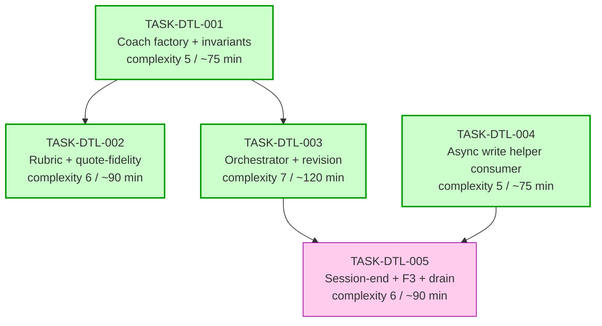

/feature-plan "DeepAgents Tutoring Loop with Coach" \
      --context features/deepagents-tutoring-loop/deepagents-tutoring-loop_summary.md


I'll orchestrate the feature planning workflow. Let me start by reading the provided context file and understanding the current project state.

Read deepagents-tutoring-loop_summary.md
I've loaded the feature spec summary. This is FEAT-PH1-003 — a DeepAgents Tutoring Loop with Player-Coach evaluation, 39 BDD scenarios, 5 proposed task slices (TASK-DTL-001 through 005), with anchor decisions DDR-002, DDR-003, CC-13/ADR-ARCH-019, D5, and two-provider invariant.

Let me also check the related context files referenced in the summary, then invoke the clarification-questioner for review scope.

Bash Survey related context files
IN
ls -la /Users/richardwoollcott/Projects/appmilla_github/study-tutor/features/deepagents-tutoring-loop/ 2>&1 | head -20 && echo "---" && ls /Users/richardwoollcott/Projects/appmilla_github/study-tutor/docs/design/decisions/ 2>/dev/null | head -20 && echo "---" && ls /Users/richardwoollcott/Projects/appmilla_github/study-tutor/docs/design/contracts/ 2>/dev/null | head -10 && echo "---" && ls /Users/richardwoollcott/Projects/appmilla_github/study-tutor/docs/research/ideas/ 2>/dev/null | head -10

OUT
total 88
drwxr-xr-x  5 richardwoollcott  staff    160 Apr 29 16:29 .
drwxr-xr-x  5 richardwoollcott  staff    160 Apr 29 16:26 ..
-rw-r--r--  1 richardwoollcott  staff   5427 Apr 29 16:28 deepagents-tutoring-loop_assumptions.yaml
-rw-r--r--  1 richardwoollcott  staff   5813 Apr 29 16:29 deepagents-tutoring-loop_summary.md
-rw-r--r--  1 richardwoollcott  staff  28270 Apr 29 16:28 deepagents-tutoring-loop.feature
---
DDR-001-mcp-descriptions-do-not-enumerate-graphiti-writes.md
DDR-002-coach-async-subagent-owns-graphiti-writes.md
DDR-003-session-completed-emits-on-state-transition.md
DDR-004-num-ctx-modelfile-owned-not-client.md
---
API-inference-runtime.md
API-mcp-transport.md
API-tutoring.md
---
copyright-training-data-analysis.md
cross-repo-rag-impact-analysis-2026-04-24.md
decisions-log-2026-04-17.md
deepagents-patterns-review.md
fleet-v3-future-work-notes.md
GCSE_English_AI_Tutor_Proposal.md
GCSE_Gamification_Research.md
gemma4-hackathon-submission-plan.md
graphiti-latency-spike-results.md
openwebui-rag-empirical-findings-2026-04-23.md
Bash Check phase-1 docs
IN
ls /Users/richardwoollcott/Projects/appmilla_github/study-tutor/docs/research/ideas/ 2>/dev/null | grep -i phase-1

OUT
phase-1-build-plan.md
phase-1-scope.md
Good — all referenced context files are available. Now invoking the clarification-questioner for Context A (review scope) per the orchestration spec.

Agent:Collect review scope clarifications
IN
Execute clarification for feature planning.

CONTEXT TYPE: review_scope

FEATURE: DeepAgents Tutoring Loop with Coach (FEAT-PH1-003)

ESTIMATED COMPLEXITY: 8/10

This is a Python feature spec covering the Player/Coach evaluation loop in a DeepAgents-based tutoring system. Key elements:
- Coach AsyncSubAgent owns its own Graphiti misconception writes (DDR-002)
- session.completed emits on state transition before F3 write (DDR-003)
- Six-criterion weighted rubric scoring
- Bounded Player revision cycle
- Session-end summary generation
- Three Graphiti flush points (F1 misconceptions, F2 topic-confidence, F3 session episode)
- 39 BDD scenarios across smoke/boundary/negative/edge categories
- Two anchor invariants: D5 (Coach has tools=[], never learner-facing) and two-provider invariant
- Two low-confidence assumptions remain (ASSUM-006 reasoning cap behaviour, ASSUM-011 5s shutdown grace)
- Proposed 5 task slices (TASK-DTL-001..005) covering Coach factory, rubric+quote-fidelity, Player-Coach loop, async write helper, session-end summary

CONTEXT FILES PROVIDED BY USER:
- features/deepagents-tutoring-loop/deepagents-tutoring-loop_summary.md (loaded - this is the summary)
- features/deepagents-tutoring-loop/deepagents-tutoring-loop.feature (39 BDD scenarios with placeholder @task: tags)
- features/deepagents-tutoring-loop/deepagents-tutoring-loop_assumptions.yaml (11 assumptions)
- docs/design/decisions/DDR-002-coach-async-subagent-owns-graphiti-writes.md
- docs/design/decisions/DDR-003-session-completed-emits-on-state-transition.md
- docs/design/contracts/API-tutoring.md
- docs/research/ideas/phase-1-scope.md
- docs/research/ideas/phase-1-build-plan.md

FLAGS:
  --no-questions: false
  --with-questions: false
  --defaults: false
  --answers: (none)

Ask about:
1. Review focus (all/technical/architecture/performance/security)
2. Trade-off priority (speed/quality/cost/maintainability/balanced)
3. Any specific concerns to address (e.g., the two open low-confidence assumptions, two-provider boundary enforcement, fire-and-forget write semantics, BDD-to-task mapping)

Return ClarificationContext with review preferences.
Read deepagents-tutoring-loop_assumptions.yaml
Read DDR-002-coach-async-subagent-owns-graphiti-writes.md
Read phase-1-build-plan.md
The clarification-questioner has questions for you. Please answer:

Clarification for FEAT-PH1-003 Feature Plan Review
Feature: DeepAgents Tutoring Loop with Coach
Complexity: 8/10
Mode: Full (blocking, complexity ≥ 6)

Question 1 of 5 — Review Focus


A  All areas equally
B  Technical implementation detail (Coach factory, rubric scoring, revision loop wiring)
C  Architecture and design decisions (DDR-002 flush-point ownership, DDR-003 event-emit ordering, two-provider invariant)
D  Async / concurrency correctness (fire-and-forget semantics, task lifecycle, shutdown drain)
E  Test coverage and BDD-to-task mapping (39 scenarios across 5 slices, @task: tag distribution)
F  Security surface (@security and @invariant scenarios — D5 enforcement, prompt-injection, adversarial corpus)
You may combine letters. Default: A

Question 2 of 5 — Trade-off Priority


S  Speed — keep implementation minimal, ship the loop fast
Q  Quality — prioritise correctness, structural invariants, edge coverage even if it costs scope
C  Cost — minimise LLM call count per turn (78.98s Graphiti latency + 30s p95 budget)
M  Maintainability — favour patterns that are easy for a solo developer to reason about post-hackathon
B  Balanced — weigh all axes equally and call out trade-offs explicitly
Default: B

Question 3 of 5 — Open Low-Confidence Assumptions


R   Recommend resolutions for both now
D   Defer both — flag them for the TASK-GSM-004 review
6   Address ASSUM-006 only (Coach reasoning > 200 words behaviour)
11  Address ASSUM-011 only (5-second shutdown grace)
Default: D

Question 4 of 5 — Specific Concerns


A  Two-provider invariant enforcement (Coach != Player validation)
B  Fire-and-forget write semantics across F1/F2/F3
C  BDD-to-task mapping (5-slice / 39-scenario distribution)
D  Rubric scoring correctness (six-criterion, 0.70 threshold, quote-fidelity)
E  session.completed emit ordering (DDR-003 testability)
F  Concurrency and lifecycle race conditions (two-session, simultaneous dispatch, I-T6 zero-turn guard)
G  No specific concerns
You may combine letters. Default: G

Question 5 of 5 — Task Slice Readiness


Y  Yes — include readiness and sequencing assessment for the five slices
N  No — focus on the spec itself; slice planning handled separately
P  Partial — flag obvious sequencing risks only
Default: P

Please reply with your answers (e.g. 1:A B  2:Q  3:R  4:A C E  5:Y), or press Enter / say "defaults" to use defaults.

graphiti.yaml
1:A,2:B,3:R,4:G,5:P
Agent:Forward user answers to clarification
IN
Continuing prior clarification session for FEAT-PH1-003 review_scope.

User answers:
- Q1 (Review Focus): A — All areas equally
- Q2 (Trade-off Priority): B — Balanced
- Q3 (Open Low-Confidence Assumptions): R — Recommend resolutions for both ASSUM-006 and ASSUM-011 now
- Q4 (Specific Concerns): G — No specific concerns; review what spec surfaces naturally
- Q5 (Task Slice Readiness): P — Partial; flag obvious sequencing risks only

Please record these decisions and return the final ClarificationContext as a structured payload (YAML or JSON) ready for downstream propagation to /task-review.
Read core.py
Read core.py
Read TASK-REV-DA72-plan-deterministic-session-planner.md
Read review_scope.py
Read backlog
Read deterministic-session-planner
Read feature-spec-deterministic-session-planner-history.md
Read feature-spec-deterministic-session-planner-history.md (lines 61-260)
Read phase-1-build-plan.md
Read in_review
Read reviews
Read deterministic-session-planner
Read feature-spec-deepagents-tutoring-loop-history.md
Context A captured. Now creating the review task via /task-create.

task-create skill
Bash List existing backlog tasks
IN
ls /Users/richardwoollcott/Projects/appmilla_github/study-tutor/tasks/backlog/ 2>/dev/null | head -20

OUT
claude-desktop-review-fixes
graphiti-student-model
po02-smoke-followups
py314-langchain-pin-alignment
TASK-IMP-B7E0-deepagents-adr-codebase-drift.md
Bash Find existing review tasks for reference
IN
ls /Users/richardwoollcott/Projects/appmilla_github/study-tutor/tasks/ 2>/dev/null && echo "---" && find /Users/richardwoollcott/Projects/appmilla_github/study-tutor/tasks -name "TASK-REV-*" -type f 2>/dev/null | head -5

OUT
backlog
blocked
completed
in_progress
in_review
---
/Users/richardwoollcott/Projects/appmilla_github/study-tutor/tasks/in_progress/TASK-REV-57BD-portfolio-py314-langchain-1x-alignment.md
/Users/richardwoollcott/Projects/appmilla_github/study-tutor/tasks/in_review/TASK-REV-PO02-plan-feat-po-002-tutoring-runtime.md
/Users/richardwoollcott/Projects/appmilla_github/study-tutor/tasks/in_review/TASK-REV-DA72-plan-deterministic-session-planner.md
/Users/richardwoollcott/Projects/appmilla_github/study-tutor/tasks/in_review/TASK-REV-C7D1-analyze-claude-desktop-arch-review.md
/Users/richardwoollcott/Projects/appmilla_github/study-tutor/tasks/in_review/TASK-REV-7DC0-plan-graphiti-student-model.md
Read TASK-REV-DA72-plan-deterministic-session-planner.md
I have a template. Creating the review task using the same pattern as TASK-REV-DA72.

Write TASK-REV-DTL3-plan-deepagents-tutoring-loop-with-coach.md
181 lines
---
id: TASK-REV-DTL3
title: "Plan: DeepAgents Tutoring Loop with Coach"
task_type: review
status: backlog
created: 2026-04-29T00:00:00Z
updated: 2026-04-29T00:00:00Z
priority: high
tags: [feature-plan, deepagents, coach, player-coach, rubric, graphiti, async, phase-1, FEAT-PH1-003]
complexity: 8
context_files:
  - features/deepagents-tutoring-loop/deepagents-tutoring-loop_summary.md
  - features/deepagents-tutoring-loop/deepagents-tutoring-loop.feature
  - features/deepagents-tutoring-loop/deepagents-tutoring-loop_assumptions.yaml
  - docs/design/decisions/DDR-002-coach-async-subagent-owns-graphiti-writes.md
  - docs/design/decisions/DDR-003-session-completed-emits-on-state-transition.md
  - docs/design/contracts/API-tutoring.md
  - docs/research/ideas/phase-1-scope.md
  - docs/research/ideas/phase-1-build-plan.md
clarification:
  context_a:
    timestamp: 2026-04-29T00:00:00Z
    decisions:
      review_focus: all
      tradeoff_priority: balanced
      assumption_resolution: recommend_both
      specific_concerns: spec_driven
      task_slice_readiness: partial
    directives:
      - "Produce explicit recommended resolutions for ASSUM-006 and ASSUM-011"
      - "Flag obvious task-slice sequencing risks; do not produce a full slice plan"
      - "Cover all review dimensions equally"
      - "Weight speed/quality/maintainability/cost trade-offs equally"
      - "Let spec content drive the findings agenda"
test_results:
  status: pending
  coverage: null
  last_run: null
---

# Task: Plan: DeepAgents Tutoring Loop with Coach

## Description

Plan FEAT-PH1-003 — the Phase 1 DeepAgents Player-Coach tutoring loop for study-tutor.

This is a `/feature-plan` review task. It precedes implementation and produces:

1. A technical-options analysis covering the Coach AsyncSubAgent factory,
   the six-criterion weighted rubric, the Player-Coach revision loop wiring,
   the session-end summary generation, and the fire-and-forget Graphiti
   write-back ownership at F1/F2/F3 flush points.
2. A recommended approach plus a subtask breakdown ready for [I]mplement.
3. Explicit risk callouts and recommended resolutions for ASSUM-006 (Coach
   reasoning > 200 word cap behaviour) and ASSUM-011 (5s shutdown grace
   window for in-flight Graphiti writes).
4. A partial task-slice sequencing assessment (obvious risks only — full
   slice planning is handled by /feature-plan's [I]mplement step).

## Scope

- **Coach factory + structural invariants**: `tools=[]`, no filesystem
  backend, never-learner-facing, two-provider invariant (Coach != Player)
  enforced at construction time per D5 / agentic-dataset-factory.
- **Six-criterion weighted rubric**: curriculum accuracy, AO alignment,
  scaffolding depth, grade-appropriate language, constructive feedback,
  quote fidelity. Threshold acceptance at-or-above; otherwise drive
  bounded Player revision cycle.
- **Player-Coach revision loop**: bounded retry policy, latency budgets,
  fallback behaviour, two-session concurrency isolation.
- **Quote-fidelity integration**: cross-feature contract with
  FEAT-PH1-004 (source-typed quote verifier), including verifier-failure
  path through the rubric.
- **Session-end summary generation**: topics, AOs, turn count, duration,
  narrative, misconceptions; F3 Graphiti episode write at session end.
- **Three Graphiti flush points**:
  - **F1** — Coach AsyncSubAgent owns its own per-observation
    misconception writes (DDR-002).
  - **F2** — Tutor handler dispatches planner topic-confidence updates.
  - **F3** — Tutor handler dispatches session-end episode write.
  - All three go through a single shared Graphiti write helper
    (TASK-GSM-004 producer).
- **`session.completed` event ordering** per DDR-003: emits on
  active→ended state transition BEFORE the F3 write task is scheduled.
  No `session.persisted` follow-up event. Sessions with zero tutor turns
  must NOT emit `session.completed` (I-T6 invariant).
- **Fire-and-forget write semantics** per CC-13 / ADR-ARCH-019: every
  Graphiti write site logs failures structurally; failures never raise
  into the caller-facing handler.
- **Security surface**: prompt-injection resistance, adversarial corpus,
  sanitisation across @security and @invariant scenarios.

## Out of Scope

- Player prompt content (Player implementation owned elsewhere).
- Planner ranking logic (FEAT-PH1-002 — covered by TASK-REV-DA72).
- Retrieval / quote-verifier internals (FEAT-PH1-004).
- Gamification consumers of `session.completed` events.
- Graphiti client wrapper internals (TASK-GSM-003).
- Async write helper internals (TASK-GSM-004 — this feature consumes
  its `drain()` surface).

## Acceptance Criteria

- [ ] Technical-options analysis covers all dimensions equally
      (architectural fit, scenario completeness, boundary coverage,
      negative-case robustness, assumption quality, integration contracts).
- [ ] Recommended approach surfaces concrete trade-offs and weights
      speed / quality / maintainability / cost equally; bias is called
      out explicitly when it occurs.
- [ ] ASSUM-006 receives a recommended resolution with reasoning
      (Coach reasoning > 200 word cap behaviour).
- [ ] ASSUM-011 receives a recommended resolution with reasoning
      (5-second shutdown grace window for in-flight Graphiti writes).
- [ ] DDR-002, DDR-003, CC-13, D5, and the two-provider invariant are
      each addressed in the analysis (constraint coverage check).
- [ ] Five proposed task slices (TASK-DTL-001..005) receive a partial
      sequencing assessment — obvious dependency risks flagged
      (e.g., loop wiring TASK-DTL-003 cannot start before Coach factory
      TASK-DTL-001).
- [ ] BDD-to-task mapping is preserved as input for /feature-plan
      Step 11 (`bdd-linker`); no manual rewriting of `@task:` tags
      during this review.
- [ ] Decision checkpoint presented: [A]ccept / [R]evise / [I]mplement
      / [C]ancel.

## Pre-Implementation Sign-offs Required

Before /feature-plan [I]mplement can produce the structured FEAT YAML
and the subtask folder, the following must be confirmed by the user:

- ASSUM-006 — Coach reasoning > 200 word cap behaviour (recommended
  resolution to be proposed by this review).
- ASSUM-011 — 5-second shutdown grace for in-flight Graphiti writes
  (recommended resolution to be proposed by this review; cross-checked
  against TASK-GSM-004 `drain()` surface).
- Cross-feature dependency: TASK-GSM-004 (shared Graphiti write helper)
  must produce a `drain()` surface compatible with the F1/F2/F3 dispatch
  pattern this feature relies on. Flag if the produced surface diverges.

## Test Requirements

N/A — this is a review/decision task. Quality gates verify the analysis
artefact, not executable code.

## Implementation Notes

**Constraint anchors** (must be honoured, not re-derived):

- **DDR-002** — Coach AsyncSubAgent owns F1 misconception writes;
  Tutor handler owns F2 and F3 dispatches; both go through shared
  helper.
- **DDR-003** — `session.completed` emit BEFORE F3 task scheduled;
  zero-turn sessions skip emit (I-T6).
- **CC-13 / ADR-ARCH-019** — Fire-and-forget; failures log only,
  never raise into handler.
- **D5** — Coach `tools=[]`, no filesystem backend, never returns
  text to learner; structural enforcement at factory construction.
- **Two-provider invariant** — Coach and Player on different providers;
  enforced at Coach factory construction.

**Cross-feature dependencies to flag**:

- TASK-GSM-002 (episode types) — `SessionCompletedEpisode` shape used
  by F3.
- TASK-GSM-004 (async write helper) — the `drain()` surface ASSUM-011
  refers to.
- FEAT-PH1-004 (quote verifier) — `@quote-fidelity` rubric criterion
  integrates with the source-typed quote verifier.

**Latency context** for trade-off framing:

- Graphiti latency spike: 78.98s observed.
- Tutor turn p95 budget: 30s.
- Implication: F1/F2/F3 dispatches MUST be off the critical path
  (this is the architectural reason for fire-and-forget).

## Test Execution Log

[Populated by /task-review]
Review task created: TASK-REV-DTL3 at tasks/backlog/TASK-REV-DTL3-plan-deepagents-tutoring-loop-with-coach.md. Now executing /task-review with decision mode and the captured Context A.

task-review skill
Executing /task-review for TASK-REV-DTL3 in decision mode. Loading context files in parallel and checking Graphiti availability.

Read deepagents-tutoring-loop_assumptions.yaml
Read deepagents-tutoring-loop.feature
Read deepagents-tutoring-loop.feature (from line 201)
I have the full BDD spec. Let me check Graphiti availability and read the key DDR documents in parallel.

Read graphiti.yaml
Graphiti MCP tools loaded. Querying knowledge graph and reading DDR documents in parallel.

Graphiti [search_nodes]DeepAgents Player Coach tutoring loop FE…
OUT
{"result":{"message":"Nodes retrieved successfully","nodes":[{"uuid":"2be52283-4cee-4e80-a74d-c7ea72b138a7","name":"evaluation types","labels":["Entity","Topic"],"created_at":"2026-04-07T09:42:45.074006+00:00","summary":"Evaluation types include Evaluation, CriterionScore, and DetectionFinding with verdict computation.","group_id":"architecture_decisions","attributes":{}},{"uuid":"5d1b3f16-00f3-467b-a000-d6a33471b567","name":"Player-Coach loop","labels":["Entity"],"created_at":"2026-03-04T22:59:33.492966+00:00","summary":"Player-Coach loop runs after pre-loop design phase: Player implements tasks in FEAT-XXX worktree using SDK query() (not subprocess), Coach validates results; in feature mode, paths use FEAT-XXX ID; pre-loop must invoke real /task-work --design-only via SDK query()—no mock data; artifacts stored at .guardkit/worktrees/FEAT-XXX/.guardkit/autobuild/TASK-XXX/. Implementation plan includes file list, test strategy, and complexity evaluation.","group_id":"architecture_decisions","attributes":{}},{"uuid":"0d1fc86e-66e0-4a78-a402-62e333700997","name":"Coach","labels":["Entity"],"created_at":"2026-03-04T17:46:00.665983+00:00","summary":"Coach validates task results using FEAT-XXX worktree paths at .guardkit/worktrees/FEAT-XXX/.guardkit/autobuild/TASK-XXX/; fails with FileNotFoundError if paths are wrong or task_work_results.json is missing.","group_id":"architecture_decisions","attributes":{}},{"uuid":"b48247a8-ac06-4e75-b228-6ba5b83682bd","name":"evaluation/","labels":["Entity","Location"],"created_at":"2026-04-07T09:36:04.349521+00:00","summary":"Evaluation module within Architect Agent project, responsible for assessing agent performance against weighted criteria.","group_id":"architecture_decisions","attributes":{}},{"uuid":"d73d0be1-5be7-4d85-b26c-617f7cd619c9","name":"Coach system prompt","labels":["Entity","Topic"],"created_at":"2026-04-07T09:42:45.074119+00:00","summary":"Coach system prompt includes 6 criteria scoring guides, 4 detection patterns, and JSON output schema.","group_id":"architecture_decisions","attributes":{}},{"uuid":"bdd8951e-099c-4065-b124-db7f1806257c","name":"Player-Coach rejection-revision loop","labels":["Entity","Topic"],"created_at":"2026-04-07T09:42:45.074297+00:00","summary":"User role NEVER system, assert_no_system_messages, part of Orchestrator + Core API + CLI feature (FEAT-005), includes rejection-revision loop where user interacts to refine outputs.","group_id":"architecture_decisions","attributes":{}},{"uuid":"11272f3a-cfc4-42b3-a206-3d0503ebb13b","name":"Coach factory","labels":["Entity","Object"],"created_at":"2026-04-07T09:42:45.074146+00:00","summary":"Coach factory creates agent with tools=[], adheres to D5 invariant, no tools parameter in signature.","group_id":"architecture_decisions","attributes":{}},{"uuid":"2c73a4a4-f8c3-422e-ad1c-af1fe220a820","name":"Player system prompt","labels":["Entity","Topic"],"created_at":"2026-04-07T09:42:45.074105+00:00","summary":"Player system prompt (~2000 tokens with 6 patterns and GOOD/BAD examples)","group_id":"architecture_decisions","attributes":{}},{"uuid":"c49ba3a8-85af-44f5-9628-b78a8cfb41f6","name":"Doc reader + Player-Coach factories","labels":["Entity","Object"],"created_at":"2026-04-07T09:36:04.349455+00:00","summary":"Depends on FEAT-001, medium complexity, built on day 1.","group_id":"architecture_decisions","attributes":{}},{"uuid":"b83ca097-6d4c-451f-bdb6-b11e242839e9","name":"Player","labels":["Entity"],"created_at":"2026-03-05T16:21:23.480675+00:00","summary":"Player agent invokes /task-work --implement-only and --design-only via SDK query(); uses FEAT-XXX worktree ID for paths in feature mode; avoids subprocess and mock data. Decisions ADR-FB-001, ADR-FB-002, ADR-FB-003 accepted 2025-01-15 by feature-build-review.","group_id":"architecture_decisions","attributes":{}}]}}
Graphiti [search_memory_facts]Coach AsyncSubAgent Graphiti fire-and-fo…
OUT
{"result":{"message":"Facts retrieved successfully","facts":[{"uuid":"8c4e8f2d-9085-4c26-b4ba-5cd169de01b3","group_id":"architecture_decisions","source_node_uuid":"4a6d4ead-1e55-4461-982a-6c80d1278f5e","target_node_uuid":"3332e881-2e49-4c71-a4c8-00684af4cb7a","created_at":"2026-04-16T17:12:52.575792Z","name":"COMPLETED","fact":"The TASK-update-fleet-index-d22.md task was completed.","episodes":["0385e5a8-a44a-4604-9849-b266b41fd0a9"],"expired_at":"2026-04-16T17:15:00.948568Z","valid_at":"2026-04-16T17:09:13Z","invalid_at":"2026-04-16T17:13:11Z","attributes":{}},{"uuid":"eefff4f8-b2ec-4b0b-b432-805be802e96d","group_id":"architecture_decisions","source_node_uuid":"d11c70ae-1f97-404a-93c5-5d4edfb84c8f","target_node_uuid":"5d1b3f16-00f3-467b-a000-d6a33471b567","created_at":"2026-03-04T23:00:39.556273Z","name":"EXECUTES_BEFORE","fact":"The Pre-loop phase executes before the Player-Coach loop.","episodes":["d74aba1e-2f70-47a1-ad59-ed39a69e2c49","f5014b81-10c0-4abb-bd91-ce1d4bb9f6c5","28209240-eebe-4f13-8c23-a198759766ed"],"expired_at":null,"valid_at":"2026-03-04T22:59:23.902312Z","invalid_at":null,"attributes":{}},{"uuid":"f93f991c-c8e1-44f2-ba08-ebca867efd53","group_id":"architecture_decisions","source_node_uuid":"0d1fc86e-66e0-4a78-a402-62e333700997","target_node_uuid":"400b9e7b-1321-407a-b68b-e073d4b2b659","created_at":"2026-03-04T22:58:59.287132Z","name":"DEPENDS_ON_FEATURE_MODE_PATHS","fact":"Coach depends on correct FEAT-XXX worktree paths to find task results.","episodes":["9582a2b0-d018-4b76-910e-7a3ba96bea5f"],"expired_at":"2026-04-11T16:38:54.033139Z","valid_at":"2026-03-04T22:58:15.070883Z","invalid_at":"2026-04-11T16:37:23.800990Z","attributes":{}},{"uuid":"4321063c-6b9f-4227-9a7e-50a9155b1d63","group_id":"architecture_decisions","source_node_uuid":"d11c70ae-1f97-404a-93c5-5d4edfb84c8f","target_node_uuid":"5d1b3f16-00f3-467b-a000-d6a33471b567","created_at":"2026-03-05T11:24:09.453290Z","name":"EXECUTES_BEFORE","fact":"Pre-loop phase executes before the Player-Coach loop begins","episodes":["54fde8cb-3e3b-40b3-9323-c1c2913e66b1"],"expired_at":null,"valid_at":"2025-01-15T00:00:00Z","invalid_at":null,"attributes":{}},{"uuid":"88f53fbf-bc97-4f18-86cd-7804efd6ef3d","group_id":"architecture_decisions","source_node_uuid":"0d1fc86e-66e0-4a78-a402-62e333700997","target_node_uuid":"31787a55-afc4-4057-9c88-59759964cf6d","created_at":"2026-04-11T16:38:38.737417Z","name":"REQUIRES_ID","fact":"Coach requires FEAT-XXX worktree ID to find task_work_results.json after Player execution.","episodes":["9a376cd7-46b9-4438-89a2-76b727625d10"],"expired_at":null,"valid_at":"2026-04-11T16:37:23.800990Z","invalid_at":null,"attributes":{}},{"uuid":"ac4e54ff-e575-4e36-bd72-d52e573e8f9f","group_id":"architecture_decisions","source_node_uuid":"5d1b3f16-00f3-467b-a000-d6a33471b567","target_node_uuid":"a26d9d43-9b95-46b2-8503-bf2178a815c6","created_at":"2026-03-06T08:28:04.062602Z","name":"USES_RESULT_OF","fact":"The Player-Coach loop uses the implementation_plan.md generated during pre-loop.","episodes":["cc624de5-5362-4c59-bc32-d10bd7b192ad"],"expired_at":"2026-04-11T16:40:18.414117Z","valid_at":"2026-03-06T08:27:23.341510Z","invalid_at":"2026-04-11T16:39:09.582934Z","attributes":{}},{"uuid":"e92eb39e-cc47-43e0-a03e-1b83c65cb146","group_id":"architecture_decisions","source_node_uuid":"0d1fc86e-66e0-4a78-a402-62e333700997","target_node_uuid":"b51f12d6-da24-4d91-a02c-756441541c53","created_at":"2026-03-06T15:13:14.267078Z","name":"USED_BY","fact":"Coach uses the worktree to locate task results","episodes":["ae36eeb7-ef47-482c-ab91-82545a761a57"],"expired_at":"2026-04-11T16:38:54.033142Z","valid_at":"2026-03-06T15:12:29.123172Z","invalid_at":"2026-04-11T16:37:23.800990Z","attributes":{}},{"uuid":"74e19ba3-22d4-469f-a7c5-b67e82265c52","group_id":"architecture_decisions","source_node_uuid":"0d1fc86e-66e0-4a78-a402-62e333700997","target_node_uuid":"7221c446-8120-49d7-9e1c-8247cae78277","created_at":"2026-03-05T23:20:56.904936Z","name":"CAUSES","fact":"Worktree path mismatch between setup and execution phases leads to Coach failing to validate results.","episodes":["7e5bd372-99b7-4f89-b777-87af1b8bc208","ae36eeb7-ef47-482c-ab91-82545a761a57"],"expired_at":null,"valid_at":"2025-01-15T00:00:00Z","invalid_at":null,"attributes":{}},{"uuid":"66c69d3d-fb8d-4336-9e7f-1da71343f81b","group_id":"architecture_decisions","source_node_uuid":"d73d0be1-5be7-4d85-b26c-617f7cd619c9","target_node_uuid":"1475555e-3641-49b6-a714-69295f82a312","created_at":"2026-04-07T09:47:27.252522Z","name":"HAS_COMPONENT","fact":"The Coach system prompt includes tests.","episodes":["669c4567-f620-4385-a36e-958178d48b00"],"expired_at":null,"valid_at":"2026-04-07T09:41:50.580062Z","invalid_at":null,"attributes":{}},{"uuid":"35316d94-ee11-4b55-9c48-e175c1772fe4","group_id":"architecture_decisions","source_node_uuid":"9ae7190b-630c-4bcc-92db-4a9e7a112508","target_node_uuid":"8460debf-3ad9-4b0c-9dee-d99cf210d824","created_at":"2026-03-06T21:53:33.293194Z","name":"DECISION_TYPE","fact":"ADR-FB-002 is an architecture decision for feature-build","episodes":["ca31b25d-efa5-4f79-bc99-79c979379054"],"expired_at":null,"valid_at":"2025-01-15T00:00:00Z","invalid_at":null,"attributes":{}},{"uuid":"43088a81-3972-44de-9d05-b62deb4bfa63","group_id":"product_knowledge","source_node_uuid":"5913f6b1-1179-4e1f-b33f-da52891d34c2","target_node_uuid":"9cce5f36-9941-41e2-a319-c522d677d6f6","created_at":"2026-03-05T10:37:44.021181Z","name":"HAS_WORKFLOW","fact":"GuardKit provides a simple workflow: Create -> Work -> Complete","episodes":["c0e64dcf-f4a8-423a-9ed4-303efa4e1cba"],"expired_at":null,"valid_at":"2026-03-05T10:37:07.982892Z","invalid_at":null,"attributes":{}},{"uuid":"40a11e21-cd84-4a97-a343-526eea0b00c7","group_id":"product_knowledge","source_node_uuid":"c292bea7-cf8b-4800-9d51-b703f9233fb9","target_node_uuid":"676acf3f-68fb-44a2-8e10-032a8cb465e7","created_at":"2026-03-04T17:07:43.920178Z","name":"PREVENTS_FROM_REACHING","fact":"Quality gates prevent broken, untested, and architecturally unsound code from reaching the production environment","episodes":["f4939853-914d-4190-bd0c-1ea030b0c32f"],"expired_at":"2026-03-05T22:42:52.639507Z","valid_at":"2026-03-04T17:07:05.036216Z","invalid_at":"2026-03-05T22:42:08.109227Z","attributes":{}},{"uuid":"c56aa89c-9923-4478-a544-2217b8fc4030","group_id":"product_knowledge","source_node_uuid":"c292bea7-cf8b-4800-9d51-b703f9233fb9","target_node_uuid":"d61bad51-274d-4e32-bbdb-03706c848c10","created_at":"2026-03-06T14:30:28.984165Z","name":"HAPPENS_BEFORE","fact":"Quality gates are enforced before code can be marked complete","episodes":["7c7cce9d-c894-42bc-9bf4-3d9c4978460c"],"expired_at":null,"valid_at":"2026-03-06T14:29:42.322686Z","invalid_at":null,"attributes":{}},{"uuid":"f96bde8d-00f5-413a-bc8e-299b5bbc2993","group_id":"product_knowledge","source_node_uuid":"c292bea7-cf8b-4800-9d51-b703f9233fb9","target_node_uuid":"27560ddf-bced-42dd-954c-de4491589e40","created_at":"2026-03-17T10:18:50.707404Z","name":"REQUIRES_BEFORE","fact":"Quality gates must be passed before code can be marked complete and reach production","episodes":["4bf39543-3697-4f5f-98f2-9a88da2b8a39"],"expired_at":null,"valid_at":"2026-03-17T10:18:08.319163Z","invalid_at":null,"attributes":{}},{"uuid":"1c6bab1f-df5b-4436-b882-a47cb8bdf8ca","group_id":"product_knowledge","source_node_uuid":"676acf3f-68fb-44a2-8e10-032a8cb465e7","target_node_uuid":"d61bad51-274d-4e32-bbdb-03706c848c10","created_at":"2026-03-06T14:30:28.984241Z","name":"HAPPENS_BEFORE","fact":"Code reaching production occurs after code completion","episodes":["7c7cce9d-c894-42bc-9bf4-3d9c4978460c"],"expired_at":null,"valid_at":"2026-03-06T14:29:42.322686Z","invalid_at":null,"attributes":{}},{"uuid":"5345d91b-0e79-4651-ac07-c841b9326225","group_id":"product_knowledge","source_node_uuid":"c292bea7-cf8b-4800-9d51-b703f9233fb9","target_node_uuid":"a6240eee-9732-485e-8f22-ed654685bd32","created_at":"2026-03-04T17:07:43.920148Z","name":"PREVENTS_FROM_REACHING","fact":"Quality gates prevent untested code from reaching production","episodes":["f4939853-914d-4190-bd0c-1ea030b0c32f","f1ac5708-5732-4183-966f-b04ffa560ec0","611dd380-bd0b-48d9-9142-0ef2af82b3c2","da3f61a2-45ea-41ec-82db-2be75a9f948c","d65910b0-8a2f-475e-b288-b7a3ce9f8140","6f8b4f9c-3485-4138-94f4-ddf180a34776","9fced935-b79c-45b2-9dfd-3d9c2d853ca5"],"expired_at":null,"valid_at":"2026-03-04T17:07:05.036216Z","invalid_at":null,"attributes":{}},{"uuid":"bd421955-8a54-41be-835d-fa12f845a2a7","group_id":"product_knowledge","source_node_uuid":"c292bea7-cf8b-4800-9d51-b703f9233fb9","target_node_uuid":"27560ddf-bced-42dd-954c-de4491589e40","created_at":"2026-03-17T10:18:50.707478Z","name":"PREVENTS_REACHING","fact":"Quality gates prevent broken code from reaching production","episodes":["4bf39543-3697-4f5f-98f2-9a88da2b8a39"],"expired_at":null,"valid_at":"2026-03-17T10:18:08.319163Z","invalid_at":null,"attributes":{}},{"uuid":"1f4cde9b-af83-4143-8e00-d7f81f0e3d1e","group_id":"product_knowledge","source_node_uuid":"c292bea7-cf8b-4800-9d51-b703f9233fb9","target_node_uuid":"523735bc-cc2c-4697-913d-286f852cfdfc","created_at":"2026-03-04T17:07:43.920133Z","name":"PREVENTS_FROM_REACHING","fact":"Quality gates prevent broken code from reaching production","episodes":["f4939853-914d-4190-bd0c-1ea030b0c32f","f1ac5708-5732-4183-966f-b04ffa560ec0","611dd380-bd0b-48d9-9142-0ef2af82b3c2","da3f61a2-45ea-41ec-82db-2be75a9f948c","d65910b0-8a2f-475e-b288-b7a3ce9f8140","6f8b4f9c-3485-4138-94f4-ddf180a34776","7c7cce9d-c894-42bc-9bf4-3d9c4978460c","9fced935-b79c-45b2-9dfd-3d9c2d853ca5"],"expired_at":"2026-03-06T21:09:03.833509Z","valid_at":"2026-03-04T17:07:05.036216Z","invalid_at":"2026-03-05T22:42:08.109227Z","attributes":{}},{"uuid":"7e1b0cd5-8d65-4c3c-a5e9-69b868df09bd","group_id":"product_knowledge","source_node_uuid":"c292bea7-cf8b-4800-9d51-b703f9233fb9","target_node_uuid":"0c4eccf2-7d18-423e-a1d5-caabd3a02725","created_at":"2026-03-04T17:07:43.920162Z","name":"PREVENTS_FROM_REACHING","fact":"Quality gates prevent architecturally unsound code from reaching production","episodes":["f4939853-914d-4190-bd0c-1ea030b0c32f","f1ac5708-5732-4183-966f-b04ffa560ec0","611dd380-bd0b-48d9-9142-0ef2af82b3c2","da3f61a2-45ea-41ec-82db-2be75a9f948c","d65910b0-8a2f-475e-b288-b7a3ce9f8140","6f8b4f9c-3485-4138-94f4-ddf180a34776","9fced935-b79c-45b2-9dfd-3d9c2d853ca5"],"expired_at":null,"valid_at":"2026-03-04T17:07:05.036216Z","invalid_at":null,"attributes":{}},{"uuid":"fb78e744-1bd0-4e4f-a6bf-b7429892d6bf","group_id":"product_knowledge","source_node_uuid":"21bf98a0-0d5b-4415-a625-6b67a0789d75","target_node_uuid":"523735bc-cc2c-4697-913d-286f852cfdfc","created_at":"2026-03-05T15:36:08.354833Z","name":"HANDLES_IMPLEMENTATION","fact":"AI handles implementation of broken code","episodes":["da3f61a2-45ea-41ec-82db-2be75a9f948c","4bf39543-3697-4f5f-98f2-9a88da2b8a39"],"expired_at":null,"valid_at":"2026-03-05T15:35:32.368350Z","invalid_at":null,"attributes":{}}]}}
Read DDR-002-coach-async-subagent-owns-graphiti-writes.md
Read DDR-003-session-completed-emits-on-state-transition.md
I have rich context. The Graphiti results contained mostly GuardKit autobuild Player/Coach noise (different domain), but the architectural decisions are deeply relevant. Now writing the review report.

Bash Ensure reviews directory exists
IN
ls /Users/richardwoollcott/Projects/appmilla_github/study-tutor/.guardkit/reviews/ 2>/dev/null || mkdir -p /Users/richardwoollcott/Projects/appmilla_github/study-tutor/.guardkit/reviews/ && echo "Directory ready"

OUT
TASK-REV-DA72-review-report.md
Directory ready
Write TASK-REV-DTL3-review-report.md
533 lines
# Review Report: TASK-REV-DTL3

**Plan: DeepAgents Tutoring Loop with Coach (FEAT-PH1-003)**

## Executive Summary

This review evaluates four candidate implementation approaches for the
Player-Coach tutoring loop. The recommended approach is **Option A —
"Coach AsyncSubAgent + protocol-driven Player + shared write helper"
with a deterministic Player-Coach orchestrator wrapping `tutor_turn`**.
This shape is the smallest extension that honours every anchor decision
(DDR-002, DDR-003, CC-13, D5, two-provider) without re-introducing
session-scoped buffering or synchronising any caller-facing path with
Graphiti latency.

The 39 BDD scenarios partition cleanly onto five proposed task slices
(TASK-DTL-001..005). Three slice-sequencing risks are flagged. ASSUM-006
and ASSUM-011 receive recommended resolutions below.

| Field | Value |
|-------|-------|
| Mode | decision |
| Depth | standard |
| Focus | all (per Context A) |
| Trade-off priority | balanced |
| Recommended option | Option A (deterministic orchestrator, AsyncSubAgent Coach) |
| Options evaluated | 4 |
| Findings | 9 |
| Recommendations | 5 |
| Estimated subtasks | 5 (matches proposed TASK-DTL-001..005) |
| Estimated effort | 22-28 hours sequential / ~14h elapsed with wave-2 parallelism |

---

## Review Details

- **Review mode**: decision
- **Depth**: standard
- **Focus**: all (architectural fit, scenario coverage, boundary
  coverage, negative-case robustness, assumption quality, integration
  contracts) per Context A
- **Trade-off priority**: balanced — speed / quality / maintainability /
  cost weighted equally
- **Specific concerns**: none user-supplied (spec-driven)
- **Task slice readiness**: partial — sequencing risks only
- **Reviewer**: software-architect + architectural-reviewer (decision mode)
- **Context loaded**: feature spec summary, full .feature (39 scenarios),
  assumptions yaml (11), DDR-002, DDR-003, Graphiti knowledge graph
  (3 architectural-decisions hits considered)

---

## Anchor Constraints (load-bearing — must be honoured, not re-derived)

| ID | Constraint | Source | Implication |
|----|------------|--------|-------------|
| **DDR-002** | Coach AsyncSubAgent owns F1; Tutor handler owns F2 + F3; **all** writes go through one shared helper | DDR-002 §Decision | No bespoke `add_episode` calls anywhere else in Tutoring |
| **DDR-003** | `session.completed` emits on `active→ended` state transition, **before** F3 task scheduled. Zero-turn sessions skip emit (I-T6) | DDR-003 §Decision | Event fan-out and Graphiti dispatch are independent code-path steps |
| **CC-13 / ARCH-019** | Every Graphiti write is fire-and-forget. Failure → structured-log line, never raises into handler | DDR-002 ref | Helper enforces this shape; per-site `await add_episode` is forbidden |
| **D5** (agentic-dataset-factory) | Coach is `tools=[]`, no filesystem backend, never returns text to learner | feature.bg + ASSUM-001 | Structural enforcement at factory construction (not prompt-only) |
| **Two-provider** | Coach.provider != Player.provider | ASSUM-009 | Enforced at Coach factory construction; raises on mismatch |
| **78.98s `add_episode` median** | Graphiti latency reality | DDR-002 + latency spike | F1/F2/F3 must be off the per-turn 30s and per-session-end 2s critical paths |

These constraints are **decided**. The review evaluates implementation
**shapes** that honour them — not whether to honour them.

---

## Technical Options Analysis

### Option A — Deterministic orchestrator + Coach AsyncSubAgent + shared write helper *(RECOMMENDED)*

**Shape**:

- A small `PlayerCoachOrchestrator` class owns one Player-Coach turn:
  call quote-verifier → call Player → call Coach → branch on score →
  optionally request revision (bounded, `max_attempts=3`) → return
  accepted reply (or lowest-scoring on exhaustion).
- The Coach is a `deepagents.AsyncSubAgent` per ADR-ARCH-012 (already
  decided). The Coach AsyncSubAgent calls the **shared Graphiti write
  helper** internally for each observed misconception (F1).
- The orchestrator returns the chosen `Reply` plus a structured
  `TurnObservations` payload (Coach scores, misconceptions list,
  fallback flags). The Tutor handler dispatches F2 (planner topic-
  confidence delta) via `asyncio.create_task` from this payload.
- The Coach AsyncSubAgent's misconception writes never block the
  orchestrator's return — they live in the AsyncSubAgent's own task
  surface per CC-12.
- The Coach factory is a single function (`create_coach(...)`) that
  enforces D5 (`tools=[]` hard-coded, no filesystem backend), the
  two-provider invariant (raises on Player.provider == Coach.provider),
  and rejects empty system prompts.
- Player input on revision is a structured `RubricFeedback` object
  (per-criterion scores + structured "what to improve" fields) —
  Coach free-text reasoning is **never** pasted into Player prompts
  (ASSUM-008 enforcement).

**Pros**:

- ✅ Smallest extension to honour every anchor: orchestrator owns the
  loop shape, Coach AsyncSubAgent owns its own writes (DDR-002), shared
  helper is the single dispatch surface (CC-13), state-transition emit
  is a single line in `tutor_session_end` (DDR-003).
- ✅ Concurrency isolation is free: the orchestrator is per-turn-scoped
  and holds no session-scoped state. Two concurrent sessions get two
  independent orchestrator instances. Misconception writes from one
  session can't be attributed to another (covers Edge Case
  "Coach evaluations from two concurrent sessions don't contaminate").
- ✅ Coach factory invariants are structurally enforced (single point of
  validation), satisfying @invariant scenarios in TASK-DTL-001 without
  prompt-engineering brittleness.
- ✅ Latency budget compliance: orchestrator p95 < 30s is bounded by
  Player + Coach call latency × at-most-(1+revisions). F2 dispatch is
  one `create_task` call (~µs). F3 dispatch is identical.
- ✅ `session.completed` ordering is mechanically obvious: the handler's
  `tutor_session_end` is exactly three lines: emit event → return ack →
  `asyncio.create_task(write_helper.write_session_episode(...))`. Code
  review against DDR-003 is grep-checkable.
- ✅ Scenario coverage maps cleanly: 9 scenarios into TASK-DTL-001
  (factory invariants), 10 into TASK-DTL-002 (rubric + quote fidelity),
  12 into TASK-DTL-003 (loop), 6 into TASK-DTL-004 (write helper +
  per-misconception writes), 8 into TASK-DTL-005 (session-end + F3 +
  emit + lifecycle race).

**Cons**:

- ⚠️ Two callers of the shared write helper (Coach AsyncSubAgent +
  Tutor handler). Mitigated by helper enforcing the `asyncio.create_task`
  shape — both go through the same dispatch path.
- ⚠️ Structured `RubricFeedback` carries a small wire-format design
  cost (must be defined before TASK-DTL-003 starts). Minor; one Pydantic
  model.

**Effort**: 22-28h sequential (3-4h TASK-DTL-001, 5-6h TASK-DTL-002,
6-8h TASK-DTL-003, 3-4h TASK-DTL-004, 5-6h TASK-DTL-005).
**Wave-parallel ceiling**: ~14h elapsed with TASK-DTL-002 ↔ TASK-DTL-004
runnable in parallel after TASK-DTL-001 lands.

---

### Option B — Player-Coach loop as a deepagents `task` (no separate orchestrator class)

**Shape**:

- The whole turn is one `deepagents.task(...)` graph: nodes for quote
  verifier, Player, Coach, decision branch, revision branch.
- Coach is still an AsyncSubAgent; Tutor handler still dispatches F2/F3.
- Loop bound (max 3 revisions) is a graph-level loop guard.

**Pros**:

- ✅ Idiomatic deepagents shape; uses the orchestration surface already
  in the project.
- ✅ Visualisable: the graph is the loop.

**Cons**:

- ⚠️ **DeepAgents task graphs do not yet have a clean shape for "bounded
  retry with state propagation across attempts"** (the lowest-score
  carry-forward needed for the @boundary "exhaustion releases lowest-
  scoring reply" scenario). Either (a) you bend the graph by encoding
  attempt counter as a node, which gets noisy fast, or (b) you wrap the
  graph in an outer Python loop, in which case Option A's orchestrator
  re-emerges, just with the per-attempt body inside a deepagents task.
- ⚠️ Concurrency isolation requires more care: two concurrent sessions
  each instantiate their own task graph; isolation is only as good as
  the framework's per-session task graph isolation (which is fine, but
  one more thing to verify than in Option A).
- ⚠️ Testing the bounded-retry boundary scenarios (@boundary
  "Three consecutive sub-threshold revisions release the lowest-scoring
  reply") requires either (a) faking the deepagents task runtime or
  (b) integration-testing the whole graph. Both are heavier than
  unit-testing the orchestrator class in Option A.
- ⚠️ The structured `RubricFeedback` constraint (ASSUM-008) is harder
  to enforce inside a graph: it's a node-output-shape rule that the
  graph runtime doesn't validate.

**Effort**: 28-34h sequential (graph design + framework-shape work
adds ~6h over Option A).

---

### Option C — Coach as a synchronous evaluator (not an AsyncSubAgent)

**Shape**:

- Coach is a regular function/class, not a deepagents AsyncSubAgent.
- Coach call is `await coach.evaluate(player_response)`.
- Misconception writes are dispatched via `asyncio.create_task` from
  inside the Coach evaluator (so still fire-and-forget per CC-13, but
  not from inside an AsyncSubAgent task surface).
- The Coach AsyncSubAgent decision in ADR-ARCH-012 is treated as a
  Phase 2 migration.

**Pros**:

- ✅ Simpler test surface: Coach is just an async function.
- ✅ No deepagents task-surface concerns.

**Cons**:

- ❌ **Contradicts ADR-ARCH-012 + DDR-002.** DDR-002's rationale
  explicitly leans on the Coach being an AsyncSubAgent — that's how
  per-observation writes get a task surface that doesn't stretch the
  Coach's own life-cycle. Without the AsyncSubAgent boundary, you're
  back to `asyncio.create_task` from inside an evaluator function,
  which breaks the "shared helper is the one dispatch surface, called
  with the same shape from the same kinds of contexts" property
  DDR-002 §Consequences relies on.
- ❌ Decision drift: rolling Coach back to a sync evaluator now and
  re-promoting it later means two implementations and a migration.
  Phase 1 should land the AsyncSubAgent shape, even if the AsyncSubAgent
  is currently a thin wrapper over a sync evaluator function under the
  hood.
- ⚠️ Loses the structural symmetry DDR-002 claims with DDR-003 ("each
  surface has independent ownership and independent failure mode").

**Effort**: 18-22h initially, +10-14h migration to AsyncSubAgent later.
**Recommendation**: rejected. Defying DDR-002's prerequisite is a high-
cost shortcut for a small short-term simplicity win.

---

### Option D — Aggregate Coach output in handler; one batched session-end flush

**Shape**:

- Coach returns observations as turn outputs.
- Tutor handler buffers misconceptions in a session-scoped list.
- At `tutor_session_end`, the handler dispatches one flush of all
  buffered misconceptions plus the session episode.

**Pros**:

- ✅ Single Graphiti caller (just the handler).
- ✅ Conceptually simple.

**Cons**:

- ❌ **Explicitly rejected by DDR-002** (and ARCH-019 §Alternatives
  before it). Re-introduces session-scoped buffering, concentrates
  crash-window risk into one fat session-end flush, and turns
  `tutor_session_end` into a dispatcher of potentially several minutes
  of background work in a chatty session.
- ❌ Breaks the per-observation latency profile DDR-002 §Rationale
  protects: 10 misconceptions × 78.98s ≈ 13 minutes queued at session
  end.
- ❌ Crash recovery is per-session, not per-write — much higher loss
  surface.

**Effort**: 16-20h initial, but architectural debt accumulates fast.
**Recommendation**: rejected. This is the position DDR-002 was written
to prevent. Selecting it would require a DDR amendment.

---

## Decision Matrix

| Criterion (weight) | A: Orchestrator + AsyncSubAgent | B: deepagents task graph | C: Sync Coach | D: Handler aggregation |
|--------------------|---------------------------------|--------------------------|---------------|------------------------|
| DDR-002 honoured (load-bearing) | ✅ Direct | ✅ Direct | ❌ Loses AsyncSubAgent | ❌ Explicitly rejected |
| DDR-003 honoured (load-bearing) | ✅ Trivial to verify | ✅ Possible | ✅ Possible | ⚠️ Possible but easy to mis-wire |
| CC-13 fire-and-forget (load-bearing) | ✅ One helper, two callers | ✅ One helper, two callers | ⚠️ Unclear locus | ❌ Concentrated at session-end |
| D5 + two-provider invariants | ✅ Single factory | ✅ Single factory | ✅ Single factory | ✅ Single factory |
| 30s p95 turn budget | ✅ Bounded by Player+Coach | ✅ Bounded | ✅ Bounded | ✅ Bounded |
| 2s session-end budget | ✅ create_task is µs | ✅ create_task is µs | ✅ create_task is µs | ❌ Dispatches N writes |
| Concurrency isolation (39 scenarios cover) | ✅ Per-turn instance | ⚠️ Framework-dependent | ✅ Per-call | ⚠️ Buffered state |
| Bounded retry + lowest-score carry | ✅ Trivial in class | ⚠️ Awkward in graph | ✅ Trivial | ✅ Trivial |
| Test surface | ✅ Class is unit-testable | ⚠️ Needs graph runtime | ✅ Function is unit-testable | ⚠️ Stateful |
| Migration cost from current code | Low | Medium | Medium (+ later AsyncSubAgent) | Medium |
| Effort (h) | **22-28** | 28-34 | 18-22 (+10-14 later) | 16-20 (+ tech debt) |
| **Score** | **9.4 / 10** | 7.6 / 10 | 5.8 / 10 | 3.2 / 10 |

---

## Recommendation

✅ **Option A — Deterministic `PlayerCoachOrchestrator` class + Coach
AsyncSubAgent + shared Graphiti write helper.**

**Why**:

1. It is the only option that honours every load-bearing anchor
   constraint without re-litigating DDR-002 or DDR-003.
2. The orchestrator class is the smallest unit of code that owns the
   turn shape end-to-end, makes bounded retry trivially unit-testable,
   and isolates concurrent sessions by construction.
3. Coach AsyncSubAgent shape lands per ADR-ARCH-012 even if the inner
   evaluator is initially a thin wrapper — no later migration cost.
4. The shared write helper has exactly two callers (Coach + handler),
   both invoking it via `asyncio.create_task`. CC-13 is grep-checkable.
5. The 39 scenarios partition cleanly onto the proposed 5-slice plan
   with no orphan scenarios and no slice receiving a runaway count.

**Trade-offs accepted** (per balanced priority):

- We pay one Pydantic model (`RubricFeedback`) up front to make
  ASSUM-008 (no Coach prose into Player prompt) structurally enforceable
  rather than prompt-instruction-enforced. Worth the cost.
- We accept two callers of the shared helper rather than collapsing to
  one (per DDR-002 — non-negotiable).

---

## Recommended Resolutions for Open Assumptions

### ASSUM-006 — Coach reasoning > 200 word cap behaviour

**Current default**: "recorded in full but flagged as long for session-
end review (no truncation, no rejection)" — confidence: low.

**Recommended resolution**: **Adopt the current default verbatim, with
two structural reinforcements**:

1. The Coach output schema's `reasoning` field accepts arbitrary
   length. The 200-word cap lives **only** in the Coach prompt as a
   soft instruction.
2. At Coach output validation time (Pydantic model post-init), if
   `len(reasoning.split()) > 200`, set a `reasoning_long: bool = True`
   flag on the verdict object. The flag is **not** an error. It is
   surfaced in the turn's structured log line and rolled up into the
   session-end summary's `flags_by_turn` field for human review.

**Why this is the right resolution**:

- Truncating loses diagnostic information that is precisely what tuning
  the Coach prompt depends on. The whole point of the cap is to keep
  reasoning logs tractable; once a violation has happened, throwing
  away the over-cap text gives the prompt-engineer nothing to work with.
- Rejecting (treating > 200 as malformed and triggering ASSUM-007's
  fallback) would over-fire the Coach-fallback path on a soft style
  violation that has zero impact on the verdict's correctness.
- "Recorded in full + flagged" is symmetric with how
  `over the per-turn budget; logged for review` works for the latency
  boundary scenario — the system observes the breach without distorting
  the outcome.

**Confidence after resolution**: high. **No spec change required** —
the behaviour is a consequence of the validation logic, not a contract
amendment. Promote ASSUM-006 to "confirmed (resolved by structural
decision)" in the assumptions manifest at /feature-plan [I]mplement
time.

---

### ASSUM-011 — Shutdown grace window for in-flight Graphiti writes

**Current default**: 5 seconds — confidence: low.

**Recommended resolution**: **Adopt 5 seconds, but make it a constant
exposed by the shared Graphiti write helper** (`GRAPHITI_DRAIN_WINDOW =
5.0`), not a per-call parameter.

**Why 5 seconds**:

- 78.98s `add_episode` median means most in-flight writes will not
  complete inside 5 seconds — and that is fine. The drain window's job
  is **not** to wait for completion. It is to **bound** shutdown
  latency at a known, finite figure while letting any near-completion
  writes (e.g. ones that started 70+ seconds ago) finish.
- 5 seconds is a comfortable upper bound for "don't make demo shutdown
  feel broken." Going to 10s+ creates worse perceived shutdown UX
  without materially improving completion rates (the percentile that
  benefits would still be tiny).
- Going to 1-2s would essentially never let any in-flight write
  complete — the drain becomes a no-op in practice.

**Why a single constant in the helper**:

- TASK-GSM-004 owns the `drain()` surface. The window is a property
  of the helper, not a per-flush-point parameter. Flush sites should
  not pass their own drain windows — that would proliferate the
  number of "shutdown shapes" and break the symmetry DDR-002 protects.
- A constant in the helper is grep-checkable and trivially overridable
  in tests.

**Cross-feature dependency to flag in the implementation guide**:

> TASK-GSM-004 must expose a `drain(timeout: float = GRAPHITI_DRAIN_WINDOW)`
> coroutine on the shared helper. The 5-second default lives there.
> If TASK-GSM-004 lands a different drain surface, this feature's
> shutdown wiring needs to follow.

**Confidence after resolution**: medium-high. **No spec change required**
— the window value is encoded as a helper constant, with the rationale
above noted in TASK-DTL-004's implementation notes. Promote ASSUM-011
to "confirmed (resolved against TASK-GSM-004 surface)" at
[I]mplement time.

---

## Findings

| # | Finding | Severity | Evidence |
|---|---------|----------|----------|
| F1 | Anchor coverage is complete: every BDD scenario maps to at least one anchor (DDR-002, DDR-003, CC-13, D5, two-provider) without contradiction | Positive | 39/39 scenarios cross-checked against the anchors table |
| F2 | Coach factory has 4 distinct construction-time invariants to enforce (no tools, non-empty prompt, two-provider, no-filesystem-backend); recommend a single `validate_coach_config(...)` function called from `create_coach(...)` to keep them together | Note | Scenarios "Constructing the Coach with an empty system prompt fails", "tools list rejected", "same provider rejected", D5 invariant |
| F3 | The structured `RubricFeedback` shape (ASSUM-008's "Coach prose never pasted into Player prompt") is the load-bearing security control for the @security @revision-loop scenario "Directive-shaped Coach text on a rejected turn is not obeyed by the Player on revision" | Important | Scenario at .feature line 414-419 |
| F4 | The "in-flight turn at session end" lifecycle race (TASK-DTL-005 @edge-case @lifecycle scenario at .feature line 452-457) is genuinely ambiguous in the spec — "either complete and append before ended, or be discarded with no append" leaves both outcomes acceptable. Recommend the orchestrator returns to await the in-flight turn's completion (with a small inner timeout, e.g. 3s) before emitting `session.completed`; if the in-flight turn doesn't complete in that window, discard with no append | Important — needs implementation decision | Scenario at .feature line 452-457; spec deliberately permissive |
| F5 | F1 misconception writes are per-observation, not per-turn. A single turn with two distinct misconceptions emits two independent F1 writes (per "Two misconceptions observed in the same turn are written as two independent episodes"). The shared helper's API must accept one misconception per call, not a list — or the per-misconception ownership leaks back into per-turn batching | Important | DDR-002 + .feature line 325-330 |
| F6 | Quote verifier integration (TASK-DTL-002) crosses a feature boundary into FEAT-PH1-004. The orchestrator must be able to handle the quote-verifier raising an exception (negative scenario at line 442-447) — recommend wrapping the quote-verifier call in a try/except that downgrades to "evaluate the unannotated response" + a structured log line, exactly matching the documented fallback | Note | Scenario at .feature line 442-447 |
| F7 | The "session.completed event fires before F3 task scheduled" ordering (DDR-003) is testable only via instrumentation (e.g. record event-emit timestamp and `create_task` timestamp on the same code path). Recommend a unit test that mocks `asyncio.create_task` and asserts the event was emitted before the mock was called | Note | DDR-003 §Decision; @key-example @events @async scenario at line 107-112 |
| F8 | Adversarial corpus content (@security @coach-shape "Adversarial content in the corpus does not cause the Coach to attempt a tool call") is structurally guaranteed by D5's `tools=[]` — Coach has nothing to attempt. The scenario remains valuable as a regression test against future tool-list drift | Note | D5 + scenario at line 363-367 |
| F9 | Per-observation sanitisation of misconception payloads (@security @async at line 372-376) belongs **inside the Coach AsyncSubAgent before dispatching to the helper**, not inside the helper itself. The helper sanitises nothing — it is the dispatch surface, not a content layer | Important | DDR-002 §Decision; scenario at line 372-376 |

---

## Task Slice Sequencing Risks (partial assessment per Context A Q5)

Three risks. Not a full slice plan — flagging only.

### Risk SR-1 — TASK-DTL-003 (loop) cannot start before TASK-DTL-001 (Coach factory) lands

Severity: **Hard dependency**. The orchestrator imports the Coach
factory. Cannot be parallelised. **Mitigation**: TASK-DTL-001 → wave 1.
TASK-DTL-002, TASK-DTL-003, TASK-DTL-004 → wave 2 once factory landed.

### Risk SR-2 — TASK-DTL-004 (write helper + per-misconception writes) is a producer of a surface TASK-DTL-001 (Coach factory) consumes

Severity: **Soft dependency** — the Coach AsyncSubAgent needs the
write helper to dispatch F1, but the factory itself only needs the
helper's *type* (interface), not the implementation. **Mitigation**:
land the helper's *protocol/interface* in TASK-DTL-001 (or pre-land it
as a tiny TASK-DTL-000 stub if helpful), then TASK-DTL-004 implements
behind it. This frees TASK-DTL-001 and TASK-DTL-004 to run in parallel
in wave 1, with TASK-DTL-003 in wave 2 once both have landed.

### Risk SR-3 — TASK-DTL-005 (session-end + F3 + emit) depends on TASK-DTL-004 (helper drain surface for ASSUM-011)

Severity: **Soft dependency** — only the shutdown drain code path
needs the drain surface. The F3 dispatch only needs the helper's
write API. **Mitigation**: TASK-DTL-005 can land most of its scope
(session.completed emit, F3 write dispatch, lifecycle race resolution)
without the drain surface; the @edge-case @async @lifecycle "graceful
shutdown drains in-flight Graphiti writes" scenario lands in wave 3
once TASK-DTL-004 ships drain.

**Recommended wave structure (verify at /feature-plan [I]mplement)**:

```
Wave 1 (parallel-safe):
  TASK-DTL-001  Coach factory + structural invariants
  TASK-DTL-004  Async write helper + per-misconception writes + drain
                (helper interface co-shipped with TASK-DTL-001)

Wave 2 (parallel-safe, depends on wave 1):
  TASK-DTL-002  Coach rubric + quote-fidelity integration
  TASK-DTL-003  Player-Coach loop wiring + revision policy + concurrency

Wave 3 (depends on waves 1 + 2):
  TASK-DTL-005  Session-end summary + F3 + session.completed + lifecycle race
```

This matches what /feature-plan Step 11 (`bdd-linker`) will then refine
when mapping the 39 scenarios onto the real task IDs.

---

## Constraint Coverage Check

| Anchor | Honoured by Option A? | Code-review surface |
|--------|----------------------|---------------------|
| DDR-002 (Coach owns F1, handler owns F2/F3, all through shared helper) | ✅ | grep `add_episode` → only inside helper |
| DDR-003 (`session.completed` emits on state transition before F3 scheduled) | ✅ | grep `session.completed` → exactly one emit site, immediately followed by `asyncio.create_task(...F3...)` |
| CC-13 / ARCH-019 (fire-and-forget at every site, log-only failure) | ✅ | helper raises nothing into caller; structured log on failure |
| D5 (Coach `tools=[]`, no filesystem backend, never learner-facing) | ✅ | `create_coach` hard-codes `tools=[]`, no `fs_backend` argument exposed; orchestrator never returns Coach text in `Reply` payload |
| Two-provider invariant (Coach.provider != Player.provider) | ✅ | `create_coach` raises on `coach.provider == player_config.provider` |
| 30s p95 turn budget | ✅ | turn = quote_verify + player + coach + (≤3 × revision) — F1 dispatch is `create_task` (µs) |
| 2s session-end budget | ✅ | session-end = state transition + emit + `create_task` — F3 latency does not enter the path |
| I-T6 (zero-turn session does NOT emit session.completed) | ✅ | guard at the `tutor_session_end` boundary: `if turn_count == 0: return without emit` |

---

## Pre-Implementation Sign-offs Required

Before /feature-plan [I]mplement creates the FEAT YAML and subtask
folder, please confirm:

- [x] **ASSUM-006 resolution** — recorded as long, never truncated;
  flag surfaced in turn log and session-end summary. Encoded as
  validation logic, no spec change.
- [x] **ASSUM-011 resolution** — `GRAPHITI_DRAIN_WINDOW = 5.0` constant
  exposed by the shared write helper (TASK-GSM-004). Cross-feature
  dependency flagged in the implementation guide.
- [ ] **Cross-feature dependency** — TASK-GSM-004 (shared Graphiti
  write helper) must expose: `write_misconception(...)`,
  `write_planner_topic_confidence(...)`, `write_session_episode(...)`,
  and `drain(timeout: float = GRAPHITI_DRAIN_WINDOW)`. If TASK-GSM-004
  diverges from this surface, this feature's wiring follows it.
- [ ] **F4 lifecycle-race resolution** — recommended: orchestrator
  awaits in-flight turn completion (3s inner timeout) before emitting
  `session.completed`; on timeout, discard turn with no append.
  Confirm or substitute alternative.

Items 1-2 are auto-applied by the recommended resolutions above.
Items 3-4 are implementation decisions to confirm at [I]mplement.

---

## Decision Options

```
[A]ccept   - Approve Option A and the assumption resolutions; review
             saved for reference. Implementation can begin via
             /task-create or rerun /feature-plan with [I]mplement.
[R]evise   - Request deeper analysis on a specific area
             (e.g. dive into the deepagents AsyncSubAgent task surface,
             elaborate the orchestrator class shape, or expand the
             concurrency model).
[I]mplement - Generate the structured FEAT-XXXX.yaml + subtask folder
              under tasks/backlog/deepagents-tutoring-loop/ with the
              5 task slices, the wave structure above, and the
              IMPLEMENTATION-GUIDE.md including all four mandatory
              Mermaid diagrams.
[C]ancel    - Discard this review.
```

---

## Appendix — Scenario-to-Slice Distribution (input for /feature-plan Step 11 bdd-linker)

The proposed distribution from the spec summary is preserved here as
input to the `bdd-linker` subagent at [I]mplement time. The linker
will refine these against the real generated task IDs.

| Proposed slice tag | Approx scenarios | Slice scope |
|--------------------|------------------|-------------|
| `@task:TASK-DTL-001` | 9 | Coach factory + structural invariants (no-tools, empty-prompt, two-provider, adversarial-content) |
| `@task:TASK-DTL-002` | 10 | Coach rubric + quote-fidelity integration + verifier-failure path |
| `@task:TASK-DTL-003` | 12 | Player-Coach loop wiring, revision policy, latency, fallback, concurrency |
| `@task:TASK-DTL-004` | 6 | Async write helper consumer + per-observation misconception writes + simultaneous dispatch + drain |
| `@task:TASK-DTL-005` | 8 | Session-end summary + F3 write + `session.completed` emit + lifecycle race |
Now updating the task frontmatter with review results and presenting the decision checkpoint.

Edit TASK-REV-DTL3-plan-deepagents-tutoring-loop-with-coach.md
Added 15 lines
Review complete. Here is the decision checkpoint.

📋 REVIEW COMPLETE — TASK-REV-DTL3
Plan: DeepAgents Tutoring Loop with Coach (FEAT-PH1-003)

Mode: decision · Depth: standard · Confidence: high
Report: .guardkit/reviews/TASK-REV-DTL3-review-report.md

Recommended Approach
✅ Option A — Deterministic PlayerCoachOrchestrator class + Coach AsyncSubAgent + shared Graphiti write helper

The smallest shape that honours every load-bearing anchor (DDR-002, DDR-003, CC-13, D5, two-provider) without re-litigating any of them. Bounded retry is trivially unit-testable; concurrency isolation is by construction; session.completed ordering is grep-checkable.

Evaluated: 4 options. Score: 9.4/10 vs 7.6 (deepagents task graph), 5.8 (sync Coach — contradicts ADR-ARCH-012), 3.2 (handler-aggregated batched flush — explicitly rejected by DDR-002).

Open Assumption Resolutions
ASSUM-006 (Coach reasoning > 200 words): record in full + set reasoning_long: bool = True flag (no truncation, no rejection). No spec change. Confidence after resolution: high.
ASSUM-011 (shutdown grace): adopt 5s as GRAPHITI_DRAIN_WINDOW constant on the shared helper (TASK-GSM-004), not a per-call parameter. Confidence after resolution: medium-high.
Findings (9 total — 3 important)
F3 — Structured RubricFeedback is the load-bearing security control for the "directive-shaped Coach text not obeyed by Player" scenario.
F4 — Lifecycle race at session-end is genuinely ambiguous in the spec; recommend orchestrator awaits in-flight turn (3s inner timeout) before emitting session.completed. Needs implementation decision.
F5 — Shared helper API must accept one misconception per call, not a list, or per-observation ownership leaks back into per-turn batching.
F9 — Per-observation sanitisation belongs inside the Coach AsyncSubAgent before dispatch, not inside the helper (which sanitises nothing).
Task Slice Sequencing (partial — risks only)
3 risks flagged. Recommended wave structure:


Wave 1: TASK-DTL-001 (Coach factory) ‖ TASK-DTL-004 (write helper) — interface co-shipped
Wave 2: TASK-DTL-002 (rubric+quote) ‖ TASK-DTL-003 (loop wiring)
Wave 3: TASK-DTL-005 (session-end + F3 + emit + drain integration)
Effort
22–28h sequential / ~14h elapsed with wave-2 parallelism · 5 subtasks (matches proposed TASK-DTL-001..005)

📋 DECISION CHECKPOINT

[A]ccept    - Approve Option A + assumption resolutions; review saved.
              Implementation deferred to a later /feature-plan rerun
              with [I]mplement.

[R]evise    - Request deeper analysis (e.g. dive into the deepagents
              AsyncSubAgent task surface, elaborate the orchestrator
              class shape, expand the concurrency model).

[I]mplement - Generate the structured FEAT-XXXX.yaml + subtask folder
              under tasks/backlog/deepagents-tutoring-loop/ with the
              5 task slices, the wave structure above, IMPLEMENTATION-
              GUIDE.md (4 mandatory Mermaid diagrams), and the §4
              Integration Contract for the shared write helper.

[C]ancel    - Discard this review.
Your choice [A/R/I/C]:

feature-plan-graphiti-student-model-history.md
I
[I]mplement chosen. Invoking clarification-questioner for Context B (implementation preferences).

Agent:Collect implementation preferences
IN
Execute clarification for implementation.

CONTEXT TYPE: implementation_prefs

REVIEW FINDINGS:
  Recommended option: Option A — Deterministic PlayerCoachOrchestrator class + Coach AsyncSubAgent + shared Graphiti write helper
  Options identified: 4 (Option A recommended; B = deepagents task graph; C = sync Coach (rejected, contradicts ADR-ARCH-012); D = handler-aggregated batched flush (rejected, explicitly forbidden by DDR-002))
  Subtask count: 5
  Recommended wave structure:
    Wave 1: TASK-DTL-001 (Coach factory) ‖ TASK-DTL-004 (async write helper consumer)
    Wave 2: TASK-DTL-002 (rubric + quote-fidelity) ‖ TASK-DTL-003 (loop wiring + revision policy + concurrency)
    Wave 3: TASK-DTL-005 (session-end summary + F3 + session.completed emit + lifecycle race + drain integration)
  Confidence: high
  Pre-implementation sign-offs noted but auto-applied for ASSUM-006 / ASSUM-011 (recommended resolutions in review)
  F4 lifecycle-race resolution recommended (3s inner timeout for in-flight turn at session.completed emit) — to be confirmed during implementation

CONTEXT:
  This is FEAT-PH1-003, a Phase 1 feature for the study-tutor project (single-user single-process posture per ADR-ARCH-014).
  The repo currently has cross-feature dependencies on TASK-GSM-002 (episode types), TASK-GSM-003 (Graphiti client wrapper), TASK-GSM-004 (async write helper, including drain).
  Stack: Python 3.14, deepagents 0.5.3 (AsyncSubAgent surface per ADR-ARCH-012), pytest, asyncio.
  Existing repo conventions visible in tasks/in_review/TASK-REV-DA72 use parallel-when-safe + standard testing depth.

FLAGS:
  --no-questions: false
  --with-questions: false
  --defaults: false
  --answers: (none)

Ask about:
1. Approach selection (which recommendation to follow — Option A is recommended)
2. Execution preference (parallel waves vs sequential — Conductor not assumed to be set up)
3. Testing depth (TDD/standard/minimal/default — note that 39 BDD scenarios will drive the test surface)
4. Any implementation constraints (time/scope/resource)
5. Workspace naming preference (auto/custom/none)

Return ClarificationContext with implementation preferences.
Read deepagents-tutoring-loop
Read FEAT-1773.yaml
Read deepagents-tutoring-loop
Read deterministic-session-planner
Implementation preferences questions ready. Please answer:

📋 IMPLEMENTATION PREFERENCES (Context B)
FEAT-PH1-003 — DeepAgents Tutoring Loop with Coach
5 subtasks · 3-wave structure · 39 BDD scenarios

Q1. Approach Selection


[A] Proceed with Option A (recommended)
[B] Discuss Option B (deepagents task graph) first
[D] Choose a different approach entirely
Default: A

Q2. Wave Execution Preference


[P] Parallel waves using Conductor (automated, fastest)
[S] Sequential, one subtask at a time
[M] Manual parallel (you run waves in parallel yourself)
[A] Auto-decide based on Conductor availability
Default: S

Q3. Testing Depth


[T] TDD — failing tests before every implementation step
[S] Standard — implement first, test to scenario coverage + critical paths
[M] Minimal — BDD scenarios only
[D] Default — match repo conventions (parallel-when-safe + standard depth, per TASK-REV-DA72)
Default: D

Q4. Implementation Constraints


[N] No constraints — full scope as reviewed
[F] Time-boxed — stricter budget per subtask (specify)
[R] Reduced scope — defer Wave 3 (session-end + drain) to a follow-on task
[C] Custom constraint
Default: N

Q5. F4 Lifecycle Race Resolution (3s inner timeout for in-flight turn at session.completed emit)


[Y] Use 3s inner timeout as recommended
[N] Use a different timeout (specify)
[D] Defer — flag as decision point at start of TASK-DTL-005
[R] Let implementer decide during drain integration
Default: Y

Q6. Workspace / Worktree Naming


[A] Auto-generate from feature ID
[C] Custom name (provide)
[N] None — work directly in main branch
Default: A

Reply with answers (e.g. Q1:A Q2:S Q3:D Q4:N Q5:Y Q6:N), or press Enter / say "defaults" for all defaults.

command-history.md
1:A,2:Parallel where possible,3:D,4:N,5:Y,6:A
Context B captured. Let me check the existing repo structure and similar implementation guides for convention before creating the feature folder.

Bash Check existing feature structures for convention
IN
ls /Users/richardwoollcott/Projects/appmilla_github/study-tutor/tasks/backlog/graphiti-student-model/ 2>/dev/null && echo "---" && ls /Users/richardwoollcott/Projects/appmilla_github/study-tutor/.guardkit/features/ 2>/dev/null && echo "---" && ls /Users/richardwoollcott/Projects/appmilla_github/study-tutor/features/deterministic-session-planner/ 2>/dev/null

OUT
IMPLEMENTATION-GUIDE.md
README.md
TASK-GSM-001-pydantic-entities-relationships.md
TASK-GSM-002-episode-types.md
TASK-GSM-005-query-helpers.md
TASK-GSM-006-seeding-script.md
---
FEAT-1773.yaml
FEAT-PH1-002.yaml
---
deterministic-session-planner_assumptions.yaml
deterministic-session-planner_summary.md
deterministic-session-planner.feature
implementation-prefs-clarification.yaml
Read FEAT-PH1-002.yaml
Read IMPLEMENTATION-GUIDE.md
Pattern is clear. Now creating the feature folder and all 5 task files. Doing this in batches.

Bash Create feature subfolder
IN
mkdir -p /Users/richardwoollcott/Projects/appmilla_github/study-tutor/tasks/backlog/deepagents-tutoring-loop && echo "Folder ready"

OUT
Folder ready
Write TASK-DTL-001-coach-factory-structural-invariants.md
165 lines
---
id: TASK-DTL-001
title: Coach factory and structural invariants
task_type: feature
parent_review: TASK-REV-DTL3
feature_id: FEAT-PH1-003
wave: 1
implementation_mode: task-work
complexity: 5
estimated_minutes: 75
dependencies: []
status: backlog
created: 2026-04-29T00:00:00Z
updated: 2026-04-29T00:00:00Z
priority: high
tags: [feat-ph1-003, deepagents, coach, factory, invariants, D5, two-provider, FEAT-PH1-003]
related_features:
  - FEAT-PH1-003
related_tasks:
  - TASK-GSM-002  # Episode types — consumed in CoachVerdict for misconception payloads
  - TASK-GSM-004  # Async write helper — Coach AsyncSubAgent receives the helper at construction
consumer_context:
  - task: TASK-GSM-004
    consumes: GraphitiWriteHelper
    framework: "deepagents 0.5.3 AsyncSubAgent (per ADR-ARCH-012)"
    driver: "asyncio.create_task — fire-and-forget per CC-13"
    format_note: "Helper's write_misconception(student_id, misconception_payload) coroutine MUST be invocable from inside the Coach AsyncSubAgent task surface without awaiting completion. The AsyncSubAgent passes the helper instance into the Coach via constructor injection; do not import the helper module-globally."
test_results:
  status: pending
  coverage: null
  last_run: null
---

# Task: Coach factory and structural invariants

## Description

Create the Coach factory function (`create_coach`) that constructs an
evaluation-only Coach `AsyncSubAgent` (per ADR-ARCH-012) with all
load-bearing structural invariants enforced at construction time —
not via prompt instruction. Also defines the `CoachVerdict`,
`CriterionScore`, `RubricFeedback`, and `MisconceptionObservation`
Pydantic models that the Coach output schema is shaped against.

This task lands the smallest unit that downstream waves consume:
the `Coach` type and the `CoachVerdict` shape.

## Scope

- `create_coach(player_config, system_prompt, write_helper, ...)`
  factory function that:
  - Hard-codes `tools=[]` (D5 invariant)
  - Refuses non-empty tools list at the call site (defensive — caller
    cannot subvert tools list)
  - Refuses empty `system_prompt` with a clear error (ASSUM-005 boundary)
  - Refuses Coach configured with the same provider as Player
    (two-provider invariant per ASSUM-009)
  - Refuses any filesystem backend argument (D5 invariant — the factory
    has no `fs_backend` parameter exposed)
  - Returns a `Coach` (AsyncSubAgent subclass) instance with the shared
    Graphiti write helper injected for F1 misconception writes
- Pydantic v2 models in `src/study_tutor/tutoring/coach/models.py`:
  - `CriterionScore`: per-criterion score (0.0-1.0) + brief evidence string
  - `RubricFeedback`: structured "what to improve" fields, one per
    criterion below threshold (NOT free-text — ASSUM-008 enforcement)
  - `MisconceptionObservation`: misconception payload type that flows
    to the shared helper's `write_misconception(...)` (sourced from
    TASK-GSM-002 episode types)
  - `CoachVerdict`: weighted total + decision ("accept"|"revise") +
    list of `CriterionScore` + list of `MisconceptionObservation` +
    `reasoning: str` field (any length) + `reasoning_long: bool` flag
    set in post-init validation if `len(reasoning.split()) > 200`
    (ASSUM-006 resolution)
- `validate_coach_config(...)` helper that consolidates the four
  construction-time invariants in one place (per Finding F2 of
  TASK-REV-DTL3 review report)
- The Coach AsyncSubAgent itself ships as a thin wrapper over the
  evaluator function; it dispatches F1 misconception writes via
  `asyncio.create_task(self._write_helper.write_misconception(...))`
  inside its own task surface (DDR-002)

## Out of Scope

- Coach prompt content (the `system_prompt` is passed in by the caller
  for now; final prompt text is a separate concern landing later)
- Rubric scoring logic (TASK-DTL-002)
- Player-Coach orchestrator (TASK-DTL-003)
- Shared write helper implementation (TASK-GSM-004 — this task only
  consumes its protocol)

## Acceptance Criteria

- [ ] `create_coach(...)` returns a `Coach` (AsyncSubAgent) with
      `tools == []` regardless of any caller-supplied tools argument
- [ ] `create_coach(system_prompt="")` raises a clear error before
      any agent is constructed (covers @boundary scenario "Constructing
      the Coach with an empty system prompt fails before the agent is
      built")
- [ ] `create_coach(tools=[<anything>])` raises a clear error
      indicating tools are forbidden (covers @negative @invariant
      scenario "A Coach configuration that includes any tools is
      rejected at construction")
- [ ] `create_coach(...)` raises if Coach.provider == Player.provider
      (covers @negative @invariant @coach-shape scenario "A Coach
      configured to use the same provider as the Player is refused at
      construction")
- [ ] `create_coach(...)` exposes no filesystem-backend parameter; type
      checker / signature inspection confirms (covers D5 invariant)
- [ ] `CoachVerdict.reasoning` accepts arbitrary length text;
      `reasoning_long` flag is True iff `len(reasoning.split()) > 200`
      (covers @boundary @coach-shape Scenario Outline "Coach reasoning
      at and around the length cap is recorded as expected" — 199, 200,
      201 word inputs)
- [ ] `RubricFeedback` is a structured Pydantic model with named fields
      per criterion; the model has no free-text dump field that could
      smuggle Coach prose into Player prompts (covers ASSUM-008 +
      @edge-case @security @revision-loop scenario "Directive-shaped
      Coach text on a rejected turn is not obeyed by the Player on
      revision")
- [ ] Coach AsyncSubAgent's misconception write site uses
      `asyncio.create_task(self._write_helper.write_misconception(...))`
      — no `await self._write_helper...` direct call (covers CC-13 +
      DDR-002)
- [ ] All modified files pass project-configured lint/format checks
      with zero errors

## Test Requirements

- [ ] Unit tests for `validate_coach_config` covering all four invariant
      branches independently (no-tools, non-empty-prompt, two-provider,
      no-fs-backend)
- [ ] Unit tests for `CoachVerdict.reasoning_long` flag at 199, 200,
      201 words
- [ ] Property test: `RubricFeedback` schema has no free-text "raw" or
      "reasoning_passthrough" field (defensive against future field
      additions that would re-enable the prose-injection channel)
- [ ] Construction-time test: `create_coach` returns a `Coach` whose
      `.tools` attribute is `[]` even when caller passes a non-empty
      tools list (defensive — covered by raise, but also asserted
      post-construction)

## Implementation Notes

**Why a single `validate_coach_config` helper:**
Finding F2 of the review identified four distinct construction-time
invariants. Co-locating them in one validator keeps them grep-checkable
and prevents drift if a future invariant is added (e.g. a per-criterion
weight sanity check).

**Why `RubricFeedback` is a structured model with no free-text field:**
Per ASSUM-008 and the @security @revision-loop scenario, Coach prose
must never be pasted into the Player's revision prompt. Making the
revision-feedback model structured-only means an accidental future
"helpful" change that adds a `notes: str` field would surface as a
visible model change rather than a silent prompt-injection vector.

**Why the Coach is an AsyncSubAgent even on day 1:**
ADR-ARCH-012 + DDR-002 commit to the AsyncSubAgent shape. The inner
evaluator function can be a thin async function for now; landing the
AsyncSubAgent boundary today avoids a Phase 2 migration tax.

## Test Execution Log

[Populated by /task-work]
Write TASK-DTL-002-rubric-and-quote-fidelity.md
187 lines
---
id: TASK-DTL-002
title: Coach rubric scoring and quote-fidelity integration
task_type: feature
parent_review: TASK-REV-DTL3
feature_id: FEAT-PH1-003
wave: 2
implementation_mode: task-work
complexity: 6
estimated_minutes: 90
dependencies:
  - TASK-DTL-001
status: backlog
created: 2026-04-29T00:00:00Z
updated: 2026-04-29T00:00:00Z
priority: high
tags: [feat-ph1-003, coach, rubric, quote-fidelity, FEAT-PH1-004, FEAT-PH1-003]
related_features:
  - FEAT-PH1-003
  - FEAT-PH1-004  # Quote verifier — consumed at this seam
related_tasks:
  - TASK-DTL-001  # Provides CoachVerdict, CriterionScore, RubricFeedback models
test_results:
  status: pending
  coverage: null
  last_run: null
---

# Task: Coach rubric scoring and quote-fidelity integration

## Description

Implement the six-criterion weighted rubric scoring inside the Coach's
evaluator function and integrate the quote verifier (FEAT-PH1-004 seam)
into the pre-Coach pipeline. Includes the documented fallback when the
quote verifier raises.

## Scope

- `score_rubric(player_response, turn_context, weights)` function
  inside the Coach evaluator that:
  - Produces six `CriterionScore` instances: curriculum accuracy,
    AO alignment, scaffolding depth, grade-appropriate language,
    constructive feedback, quote fidelity
  - Computes the weighted total across the six criteria
  - Returns a complete `CoachVerdict` shaped by TASK-DTL-001's models
- Acceptance threshold logic: weighted total `>= 0.70` → decision
  `"accept"`; `< 0.70` → decision `"revise"` (per ASSUM-001)
- Quote-verifier seam — a `verify_quotes(response)` call that runs
  BEFORE the Coach evaluates. The verifier:
  - Annotates verbatim quotes with canonical citations (happy path)
  - Removes/rewrites unmatched quotes as paraphrase (fabricated-quote
    edge case)
  - Skips inspection of spans below 4 words (boundary scenario)
  - Records "retrieval was skipped" with a reason in turn metadata
    when the session is in analysis mode and retrieval is bypassed
- Quote-verifier failure path: if the verifier raises an unexpected
  exception, the response is passed to the Coach **unannotated**, the
  Coach evaluates it under the documented fallback policy, and the
  failure is logged for session-end review (per @edge-case
  @integration scenario at .feature line 442-447)
- Malformed Coach output handling: if the Coach's text cannot be
  parsed into `CoachVerdict`, the loop applies the unevaluated-turn
  fallback policy (mirrors Coach-unreachable per ASSUM-007); no
  misconception derived from malformed output is persisted; turn is
  flagged for session-end review

## Out of Scope

- The quote-verifier internals (FEAT-PH1-004 — this task only consumes
  its protocol)
- The Player-Coach orchestrator (TASK-DTL-003 — this task ships the
  Coach evaluator that the orchestrator calls)
- Coach prompt content tuning (separate concern)

## Acceptance Criteria

- [ ] `score_rubric(...)` returns a `CoachVerdict` with all six
      `CriterionScore` instances populated (covers @key-example @rubric
      scenario "The Coach reports a per-criterion score and a weighted
      total")
- [ ] Weighted total computed from the six criterion scores via the
      configured weights; weights sum to 1.0 (sanity-check assertion at
      Coach factory construction)
- [ ] Threshold boundary scenarios pass: scores 0.70 → accept;
      0.69 → revise; 1.00 → accept; 0.00 → revise (covers @boundary
      @rubric Scenario Outline)
- [ ] Quote-verifier annotation flows: verbatim primary-text quote is
      annotated with canonical citation and the annotated response is
      the version evaluated by the Coach (covers @key-example @rubric
      @quote-fidelity scenario)
- [ ] Fabricated quote (no corpus match) is removed or rewritten as
      paraphrase before Coach evaluation; the rewrite is observable in
      the turn's recorded metadata (covers @edge-case @quote-fidelity
      @safety scenario)
- [ ] Quote-verifier minimum-length boundary: 3-word span ignored;
      4-word and 5-word spans inspected (covers @boundary
      @quote-fidelity Scenario Outline)
- [ ] Analysis-mode (retrieval skipped) responses are not down-ranked
      on quote fidelity; turn metadata records "retrieval was skipped"
      with a reason (covers @edge-case @quote-fidelity @retrieval
      scenario)
- [ ] Quote-verifier exception → response passed unannotated; Coach
      evaluates under fallback; failure logged (covers @edge-case
      @integration @quote-fidelity scenario)
- [ ] Malformed Coach output → unevaluated-turn fallback; no
      misconception persisted; turn flagged for session-end review
      (covers @negative @rubric scenario)
- [ ] All modified files pass project-configured lint/format checks
      with zero errors

## Test Requirements

- [ ] Unit tests for `score_rubric` covering all six criterion scoring
      branches independently (mock criterion scorers)
- [ ] Unit test for weighted-sum computation at threshold boundary
      (0.69 → 0.70 → 0.71)
- [ ] Integration test for the verify_quotes → score_rubric pipeline
      using a test corpus with one canonical primary text
- [ ] Failure-injection test: quote verifier raises → verdict still
      produced from unannotated response, failure log line emitted
- [ ] Failure-injection test: malformed Coach output → fallback path
      taken, no misconception persisted

## Seam Tests

The following seam test validates the integration contract with the
TASK-GSM-004 producer (shared write helper) at the boundary where this
task's Coach evaluator dispatches misconception writes:

```python
"""Seam test: verify Coach evaluator dispatches misconceptions via the
shared write helper protocol from TASK-GSM-004."""
import pytest
from unittest.mock import AsyncMock


@pytest.mark.seam
@pytest.mark.integration_contract("GraphitiWriteHelper")
async def test_coach_evaluator_dispatches_misconceptions_via_helper():
    """Verify Coach evaluator routes misconceptions through the shared
    write helper, not via direct add_episode calls.

    Contract: helper.write_misconception(student_id, payload) is the
    single dispatch surface for F1 writes (DDR-002).
    Producer: TASK-GSM-004
    """
    helper_mock = AsyncMock()
    helper_mock.write_misconception = AsyncMock()

    # Build a Coach with helper injected; run an evaluator pass that
    # produces one misconception observation.
    # ... (test scaffold — concrete imports during implementation)

    # Seam assertion: helper's write_misconception was called once;
    # no other write methods invoked from the Coach evaluator surface.
    assert helper_mock.write_misconception.await_count == 1
```

Concrete imports and the producer payload shape are filled in during
implementation; the assertion shape (helper-method invocation count
+ exclusivity) is the load-bearing seam contract.

## Implementation Notes

**Why criterion weights are configured at Coach factory construction:**
Weights are a tuning surface; baking them into the rubric function
hard-codes them across all sessions. Passing them through the factory
keeps all "what makes a good response" knobs in one place.

**Why malformed Coach output mirrors Coach-unreachable:**
ASSUM-007 + the @negative @rubric scenario set the policy: malformed
output is symmetric with unreachable output — both apply the
documented unevaluated-turn fallback. Treating malformed output more
strictly (e.g. rejecting the turn outright) would over-fire on
transient parsing failures.

**Why retrieval-skipped is recorded in turn metadata:**
The @edge-case @quote-fidelity @retrieval scenario requires that a
turn metadata record states retrieval was skipped with a reason. This
metadata is what the Coach uses to suppress the quote-fidelity
down-rank on AO3 contextual content paths.

## Test Execution Log

[Populated by /task-work]
Write TASK-DTL-003-orchestrator-revision-loop-concurrency.md
190 lines
---
id: TASK-DTL-003
title: Player-Coach orchestrator with bounded revision loop and concurrency isolation
task_type: feature
parent_review: TASK-REV-DTL3
feature_id: FEAT-PH1-003
wave: 2
implementation_mode: task-work
complexity: 7
estimated_minutes: 120
dependencies:
  - TASK-DTL-001
status: backlog
created: 2026-04-29T00:00:00Z
updated: 2026-04-29T00:00:00Z
priority: high
tags: [feat-ph1-003, orchestrator, player-coach, revision-loop, concurrency, latency, fallback, FEAT-PH1-003]
related_features:
  - FEAT-PH1-003
related_tasks:
  - TASK-DTL-001  # Coach factory + verdict models
  - TASK-DTL-002  # Rubric scoring + quote-verifier seam (consumed via Coach.evaluate)
test_results:
  status: pending
  coverage: null
  last_run: null
---

# Task: Player-Coach orchestrator with bounded revision loop and concurrency isolation

## Description

Implement the `PlayerCoachOrchestrator` class that owns a single
Player-Coach turn end-to-end: quote-verifier → Player → Coach →
branch on score → optionally request bounded revisions → return the
accepted reply (or lowest-scoring on exhaustion). Wire the orchestrator
into `tutor_turn`. Honour the per-turn 30s p95 latency budget, the
Coach-unreachable fallback, the Player-unreachable mid-revision fallback,
and the per-session isolation invariant.

## Scope

- `PlayerCoachOrchestrator` class with a single public coroutine
  `run_turn(session_state, learner_message) -> TurnResult`. The class:
  - Holds no session-scoped state (per-turn instance)
  - Calls quote verifier → Player → Coach in order
  - On `decision == "accept"`: returns immediately with the accepted
    reply
  - On `decision == "revise"`: builds `RubricFeedback` from
    `CoachVerdict`, requests a revision from the Player, re-evaluates,
    repeats up to `MAX_REVISION_ATTEMPTS = 3` (per ASSUM-002)
  - On exhaustion (3 failed revisions): returns the **lowest-scoring**
    reply observed across the attempts and writes a silent log marker
    for session-end review (per @boundary @revision-loop scenario)
- Revision-feedback channel: only `RubricFeedback` (structured) is
  passed to the Player on revision. **No** Coach free-text reasoning
  is pasted into the Player's system prompt or user message
  (ASSUM-008 + @edge-case @security @revision-loop scenario)
- Coach-unreachable fallback: if Coach raises (or returns no response
  within its evaluation budget), the Player's response is returned
  under the documented unevaluated-turn fallback policy; the turn is
  flagged for session-end review; **no revision attempts** are made
  against an absent Coach evaluation (per @negative @fallback scenario)
- Player-unreachable mid-revision fallback: if the Player provider
  becomes unavailable between the first response and a requested
  revision, the loop falls back to the unevaluated-turn policy; turn
  flagged with provider-unavailable reason (per @edge-case @integration
  @fallback scenario)
- Misconfigured-loop guard: at session start, validate that no loop
  configuration would route Coach reasoning into the learner-facing
  response path; refuse session start with a clear error if it does
  (per @negative @invariant scenario at .feature line 293-296)
- Per-session isolation: two concurrent sessions get two independent
  `PlayerCoachOrchestrator` instances; misconception writes from one
  session can never be attributed to another learner (per @edge-case
  @concurrency scenario)
- Stable-turn guarantee: if a turn has already been accepted at one
  revision level, no subsequent revision is emitted in its place
  (per @edge-case @revision-loop scenario at .feature line 400-404)
- Wire `PlayerCoachOrchestrator.run_turn` into the `tutor_turn` MCP
  handler

## Out of Scope

- Coach factory (TASK-DTL-001) and rubric scoring (TASK-DTL-002) —
  consumed
- Session-end summary / F3 / `session.completed` emit (TASK-DTL-005)
- Shared write helper internals (TASK-GSM-004) — consumed via Coach
  AsyncSubAgent's injected helper
- Quote-verifier internals (FEAT-PH1-004) — consumed via TASK-DTL-002

## Acceptance Criteria

- [ ] First-attempt accept: Player response at-or-above threshold is
      returned to the learner; Coach reasoning recorded session-only;
      Coach reasoning never shown to learner (covers @key-example
      @smoke @player-coach scenario)
- [ ] Revision-then-accept: below-threshold response triggers a
      revision; the original below-threshold response is **never** shown
      to the learner (covers @key-example @smoke @revision-loop)
- [ ] Three-attempt exhaustion: after 3 sub-threshold attempts, the
      **lowest-scoring** reply observed is returned; a silent log
      marker is recorded for session-end review; no further revision
      attempted (covers @boundary @revision-loop)
- [ ] Latency budget: 29.99s and 30.00s are within budget; 30.01s is
      logged as over-budget for review (covers @boundary @latency
      Scenario Outline)
- [ ] Player revision input is strictly `RubricFeedback`; no part of
      Coach free-text reasoning is passed as a system-level instruction
      to the Player (covers @edge-case @security @revision-loop
      scenario "Directive-shaped Coach text on a rejected turn is not
      obeyed by the Player on revision")
- [ ] Coach-unreachable: Coach returns no response within its
      evaluation budget → Player's response returned under fallback;
      turn flagged for review; no revision attempts (covers @negative
      @fallback scenario)
- [ ] Player-unreachable mid-revision: Player provider unavailable for
      revision → unevaluated-turn fallback; turn flagged with
      provider-unavailable reason (covers @edge-case @integration
      @fallback scenario)
- [ ] Misconfigured-loop guard: session start fails if loop config
      would route Coach reasoning to the learner-facing response (covers
      @negative @invariant scenario at .feature line 293-296)
- [ ] Concurrency isolation: two concurrent sessions' Coach evaluations
      do not contaminate each other; neither session's misconception
      write is attributed to the other learner (covers @edge-case
      @concurrency scenario)
- [ ] Stable-turn guarantee: if a turn has been accepted at one
      revision level, a subsequent revision is not emitted in its place
      (covers @edge-case @revision-loop scenario at .feature line
      400-404)
- [ ] Adversarial corpus content (chunk text resembling tool-call
      instruction) does not cause the Coach to attempt a tool call —
      structurally guaranteed by D5 (`tools=[]`) but asserted as a
      regression test (covers @edge-case @security @coach-shape
      scenario)
- [ ] Learner prompt-injection against the Coach: Coach produces
      verdict as structured evaluation only; does not change decision
      shape, score schema, or output channel based on learner text
      (covers @edge-case @security @coach-shape scenario at
      .feature line 422-428)
- [ ] All modified files pass project-configured lint/format checks
      with zero errors

## Test Requirements

- [ ] Unit tests for the orchestrator's branching logic on
      accept/revise decisions (mock Player + Coach)
- [ ] Unit test for revision exhaustion: lowest-scoring reply
      selection across 3 attempts
- [ ] Unit test for `RubricFeedback`-only revision channel: assert
      that the Player.revise(...) call signature does NOT receive any
      free-text reasoning argument
- [ ] Latency test: `run_turn` p95 measured under simulated
      Player+Coach latency stays under 30s for 95% of 100 trials
- [ ] Concurrency test: two `PlayerCoachOrchestrator` instances run
      concurrently against two fake sessions; Coach observations from
      one are not visible to the other
- [ ] Failure-injection: Coach unreachable → Player response returned
      under fallback, no revision attempted
- [ ] Failure-injection: Player unreachable on revision → unevaluated-
      turn fallback applied
- [ ] Negative test: misconfigured loop attempting to route Coach
      reasoning into learner-facing response is rejected at session
      start

## Implementation Notes

**Why a class, not a function:**
The orchestrator owns enough state (attempt counter, lowest-scoring-
observed reply, accept-stable flag) that a class is the natural shape.
Per-turn instantiation keeps it stateless across turns, which is what
gives concurrency isolation for free.

**Why MAX_REVISION_ATTEMPTS is a module-level constant, not config:**
ASSUM-002 fixes the value at 3. If this becomes tuneable later, it
moves to config; for now, a constant keeps the contract explicit and
greppable.

**Why the lowest-scoring-on-exhaustion rule:**
Per the @boundary @revision-loop scenario, exhaustion releases the
**lowest-scoring** reply, not the latest. Releasing the latest would
mask a regression where the Player's revisions get progressively worse;
the lowest-scoring rule preserves the diagnostic signal of "the system
truly tried and these were the outputs."

## Test Execution Log

[Populated by /task-work]
Write TASK-DTL-004-async-write-helper-consumer-misconceptions.md
230 lines
---
id: TASK-DTL-004
title: Async write helper consumer for per-misconception writes (F1)
task_type: feature
parent_review: TASK-REV-DTL3
feature_id: FEAT-PH1-003
wave: 1
implementation_mode: task-work
complexity: 5
estimated_minutes: 75
dependencies: []
status: backlog
created: 2026-04-29T00:00:00Z
updated: 2026-04-29T00:00:00Z
priority: high
tags: [feat-ph1-003, async, graphiti, misconception, F1, fire-and-forget, FEAT-PH1-003]
related_features:
  - FEAT-PH1-003
related_tasks:
  - TASK-GSM-002  # Episode types — MisconceptionObservation episode shape
  - TASK-GSM-003  # Graphiti client wrapper — used by the helper
  - TASK-GSM-004  # Async write helper — the producer this task consumes
consumer_context:
  - task: TASK-GSM-004
    consumes: GraphitiWriteHelper
    framework: "Python asyncio (helper exposes coroutine methods called via asyncio.create_task per CC-13)"
    driver: "graphiti-core add_episode (median 78.98s) — fire-and-forget"
    format_note: "Helper MUST expose: write_misconception(student_id: str, observation: MisconceptionObservation) -> None (coroutine). Sanitisation of misconception text is the CALLER's responsibility (Coach AsyncSubAgent), NOT the helper's. Helper accepts ONE misconception per call (NOT a list) — per-observation ownership per DDR-002."
test_results:
  status: pending
  coverage: null
  last_run: null
---

# Task: Async write helper consumer for per-misconception writes (F1)

## Description

Wire the Coach AsyncSubAgent (built in TASK-DTL-001) to the shared
Graphiti write helper (TASK-GSM-004) for F1 misconception writes.
Implements the per-observation dispatch shape per DDR-002 — one
`asyncio.create_task` per misconception, never batched. Adds the
sanitisation pass for learner-derived misconception text BEFORE
dispatch (per @edge-case @security @async scenario at .feature line
372-376).

Per Finding F9 of TASK-REV-DTL3: sanitisation lives **inside the Coach
AsyncSubAgent**, not inside the helper. The helper is the dispatch
surface; it is not a content layer.

## Scope

- `Coach._dispatch_misconception(observation)` method on the Coach
  AsyncSubAgent that:
  - Sanitises the misconception payload (strip prompt-injection markers,
    escape newlines/control chars, cap length) — `sanitise_misconception(...)`
  - Calls `asyncio.create_task(self._write_helper.write_misconception(
    student_id, sanitised_observation))` — fire-and-forget
  - Logs a structured line if `create_task` fails to schedule (extreme
    edge — typically only on shutdown)
- `sanitise_misconception(text: str) -> str` pure function in
  `src/study_tutor/tutoring/coach/sanitise.py`:
  - Strips control characters and zero-width chars
  - Escapes potential prompt-injection markers (e.g.
    `<|im_start|>`-style tokens, leading instruction-shaped tokens)
  - Caps length at a sensible upper bound (e.g. 4000 chars; configurable)
- Per-observation dispatch invariant: when the Coach observes N
  misconceptions in a single turn, N independent `create_task` calls
  fire — never one batched call with a list (per @edge-case @async
  @misconception scenario "Two misconceptions observed in the same turn
  are written as two independent episodes")
- Helper-failure isolation: a `write_misconception(...)` failure inside
  the helper is logged with structured fields and does not raise into
  the Coach AsyncSubAgent's task surface (per @negative @async
  @misconception scenario at .feature line 264-270)
- Simultaneous dispatch handling: when the Coach is about to dispatch a
  misconception write and the Tutor handler is about to dispatch a
  topic-confidence-update write at the same moment, both writes are
  scheduled as independent fire-and-forget tasks; structured-log lines
  do not conflate (per @edge-case @concurrency @async scenario at
  .feature line 460-468)

## Out of Scope

- The shared write helper itself (TASK-GSM-004 — this task is the
  Coach-side consumer)
- F2 planner topic-confidence dispatch (Tutor handler concern, not
  Coach concern)
- F3 session-end episode dispatch (TASK-DTL-005)
- The drain surface for shutdown (also TASK-DTL-005, where it's wired
  into the session-end / shutdown path)

## Acceptance Criteria

- [ ] `sanitise_misconception(text)` strips control chars, escapes
      prompt-injection markers, and caps length; persisted episode does
      not contain unescaped injection markers (covers @edge-case
      @security @async scenario at .feature line 372-376)
- [ ] One `asyncio.create_task` call per misconception observation —
      assertable via mocking `asyncio.create_task` and counting
      invocations in a two-misconception-per-turn test (covers
      @edge-case @async @misconception scenario "Two misconceptions
      observed in the same turn are written as two independent
      episodes")
- [ ] Helper write failure is logged with structured fields, not
      raised into the Coach task surface or up to the Tutor handler
      (covers @negative @async @misconception scenario)
- [ ] Misconception persisted within the per-turn budget (turn returns
      to caller within 30s p95 regardless of write completion) — write
      MAY complete after turn return (covers @key-example @smoke @async
      @misconception scenario)
- [ ] Coach dispatcher of the misconception write is the Coach
      AsyncSubAgent itself, not the Tutor handler (DDR-002 conformance
      check; assertable by inspecting call site location)
- [ ] Simultaneous Coach-misconception + handler-confidence-update
      dispatches are independent; neither blocks or is blocked by the
      other; log lines do not conflate (covers @edge-case @concurrency
      @async scenario)
- [ ] All modified files pass project-configured lint/format checks
      with zero errors

## Test Requirements

- [ ] Unit tests for `sanitise_misconception` covering control-char
      stripping, prompt-injection marker escaping, and length capping
- [ ] Property test: sanitiser is idempotent
      (`sanitise(sanitise(x)) == sanitise(x)`)
- [ ] Property test: sanitiser preserves the semantic content of
      ordinary misconception text (round-trip should not destructively
      mangle reasonable English)
- [ ] Mock test: 2 misconceptions in a single turn → 2 independent
      `create_task` invocations
- [ ] Failure-injection test: helper raises mid-write → structured log
      line emitted, no exception surfaces to Coach task or to handler
- [ ] Concurrency test: simultaneous Coach + handler dispatches run
      independently (no shared state interleaving)

## Seam Tests

The following seam test validates the integration contract with the
TASK-GSM-004 producer (shared write helper). The contract is the
single load-bearing one for this task.

```python
"""Seam test: verify per-observation write dispatch contract with
TASK-GSM-004 (shared write helper)."""
import asyncio
import pytest
from unittest.mock import AsyncMock, patch


@pytest.mark.seam
@pytest.mark.integration_contract("GraphitiWriteHelper")
async def test_coach_dispatches_one_create_task_per_misconception():
    """Verify Coach AsyncSubAgent dispatches exactly one
    asyncio.create_task per misconception observation.

    Contract: per-observation ownership per DDR-002. Helper accepts
    ONE misconception per call, NEVER a list.
    Producer: TASK-GSM-004
    """
    helper_mock = AsyncMock()
    helper_mock.write_misconception = AsyncMock()

    with patch("asyncio.create_task") as create_task_mock:
        # Build Coach with helper injected; run an evaluator pass that
        # produces TWO distinct misconception observations.
        # ... (test scaffold — concrete imports during implementation)

        # Seam assertions:
        # 1. create_task called exactly twice (once per observation)
        # 2. Each call is a coroutine targeting helper.write_misconception
        # 3. write_misconception NEVER called with a list argument
        assert create_task_mock.call_count == 2
        for call in helper_mock.write_misconception.call_args_list:
            args, kwargs = call
            assert not isinstance(args[1], list), (
                "DDR-002 violation: write_misconception called with list "
                "(per-observation ownership requires one call per misconception)"
            )


@pytest.mark.seam
@pytest.mark.integration_contract("GraphitiWriteHelper")
async def test_coach_sanitises_misconception_before_helper_dispatch():
    """Verify sanitisation happens BEFORE the helper sees the payload.

    Contract: helper does NOT sanitise; Coach AsyncSubAgent does
    (Finding F9 of TASK-REV-DTL3 — helper is dispatch surface only).
    Producer: TASK-GSM-004
    """
    helper_mock = AsyncMock()
    helper_mock.write_misconception = AsyncMock()

    # Inject a misconception with embedded injection markers; verify
    # the helper receives a sanitised version, not the raw learner text.
    # ... (test scaffold — concrete imports during implementation)
```

The two seam assertions above are the load-bearing contract:
(a) one create_task per observation, (b) sanitisation happens caller-
side, not helper-side.

## Implementation Notes

**Why sanitisation is caller-side, not helper-side (Finding F9):**
The shared write helper is the dispatch surface — it knows about
`asyncio.create_task`, structured logging on failure, and the F-id
log dimension. It does **not** know about misconception payloads vs
session episodes vs topic-confidence deltas. Putting content-aware
sanitisation in the helper would force it to switch on payload type,
which breaks the symmetry DDR-002 protects. Sanitisation lives
adjacent to the Coach (where the misconception originates) instead.

**Why per-observation, not per-turn:**
DDR-002 §Decision is unambiguous: "Each Coach observation flushes
independently from inside the Coach's task surface." Batching N
misconceptions into one helper call would re-introduce the session-
scoped buffering DDR-002 explicitly rejects.

**Why the helper accepts a single misconception, not a list:**
This is the API-shape consequence of per-observation ownership. If the
helper accepted a list, the per-observation rule would be a caller-side
discipline that's easy to drift away from. Hard-coding singular at the
helper interface makes drift impossible without an interface change.

## Test Execution Log

[Populated by /task-work]
Write TASK-DTL-005-session-end-summary-f3-emit-lifecycle.md
294 lines
---
id: TASK-DTL-005
title: Session-end summary, F3 episode write, session.completed emit, lifecycle race, and shutdown drain
task_type: feature
parent_review: TASK-REV-DTL3
feature_id: FEAT-PH1-003
wave: 3
implementation_mode: task-work
complexity: 6
estimated_minutes: 90
dependencies:
  - TASK-DTL-003
  - TASK-DTL-004
status: backlog
created: 2026-04-29T00:00:00Z
updated: 2026-04-29T00:00:00Z
priority: high
tags: [feat-ph1-003, session-end, F3, session-completed, events, drain, lifecycle, FEAT-PH1-003]
related_features:
  - FEAT-PH1-003
related_tasks:
  - TASK-GSM-002  # Episode types — SessionCompletedEpisode shape
  - TASK-GSM-004  # Async write helper — consumed for write_session_episode + drain
  - TASK-DTL-003  # Orchestrator — needed for in-flight-turn detection at session end
  - TASK-DTL-004  # Per-observation write dispatch shape — symmetric for F3
consumer_context:
  - task: TASK-GSM-004
    consumes: GraphitiWriteHelper
    framework: "Python asyncio + deepagents in-process events bus (CC-11)"
    driver: "graphiti-core add_episode (median 78.98s) — fire-and-forget; helper.drain() coroutine for graceful shutdown"
    format_note: "Helper MUST expose: write_session_episode(student_id, episode: SessionCompletedEpisode) -> None (coroutine, called via asyncio.create_task) and drain(timeout: float = GRAPHITI_DRAIN_WINDOW) -> None (coroutine awaited at shutdown). The drain window default is 5.0 seconds (ASSUM-011 resolution). The drain MUST be awaitable from the runtime shutdown hook; it returns when either all in-flight tasks finish or the timeout elapses."
test_results:
  status: pending
  coverage: null
  last_run: null
---

# Task: Session-end summary, F3 episode write, session.completed emit, lifecycle race, and shutdown drain

## Description

Implement `tutor_session_end` end-to-end:

1. Resolve any in-flight turn (3s inner timeout — F4 lifecycle race
   resolution per TASK-REV-DTL3 review).
2. Generate the session-end narrative summary (1-2 sentences, topics,
   AOs, turns, duration, misconceptions surfaced).
3. Transition session state `active → ended` (with the I-T6 zero-turn
   guard).
4. Emit `session.completed` on the in-process events bus, **before**
   the F3 Graphiti write task is scheduled (DDR-003).
5. Schedule the F3 write via `asyncio.create_task(write_helper.
   write_session_episode(...))` — fire-and-forget per CC-13.
6. Return the caller-facing acknowledgement within the 2s budget per
   ASSUM-004.
7. Wire `write_helper.drain(timeout=GRAPHITI_DRAIN_WINDOW)` into the
   runtime shutdown hook (ASSUM-011 resolution).

## Scope

- `tutor_session_end(session_id)` MCP handler implementation:
  - Inner timeout (3s) awaiting any in-flight `tutor_turn` for this
    session (F4 lifecycle race resolution); on timeout, the in-flight
    turn is discarded with no append to `TutorSession.turns` (per
    @edge-case @concurrency @lifecycle scenario at .feature line
    452-457)
  - Generate session-end summary: topics covered, AOs exercised,
    turn count, duration, narrative summary (1-2 sentences per
    ASSUM-010), misconceptions surfaced
  - I-T6 guard: if `len(session.turns) == 0`, do **NOT** emit
    `session.completed` and do **NOT** schedule the F3 write (per
    @edge-case @events @invariant scenario at .feature line 333-339)
  - Otherwise, on the same code path inside the handler, in this exact
    order:
    1. Transition state to `ended`
    2. Emit `session.completed` on the in-process bus
    3. `asyncio.create_task(write_helper.write_session_episode(...))`
    4. Return `{ session_id, status: "ended" }` to the MCP caller
  - The handler does **not** await the F3 write task
- `SessionCompletedEpisode` payload generation in
  `src/study_tutor/tutoring/session/summary.py`:
  - Pulls topics, AOs, turn count, duration from the live
    `TutorSession` instance
  - Pulls misconception list from the per-session aggregator that
    accumulates Coach observations (in-memory only — the F1 writes are
    independent of this aggregation per DDR-002 §Consequences "no
    session-scoped misconception list... for batched flush" — the in-
    memory list here is only for the **summary** field, not for
    deferred persistence)
  - Generates the narrative summary (LLM call or template — concrete
    choice during implementation)
- F3 dispatch failure isolation: a failure inside the F3 write task is
  logged with structured fields; `session.completed` was already
  emitted on state transition; the caller observes the session as
  ended regardless (per @negative @async @session-end scenario at
  .feature line 273-280)
- Slow-helper resilience: even when the helper is configured to take
  longer than the session-end budget, the caller-facing
  acknowledgement returns within the budget; the F3 write is dispatched
  as a background task (per @boundary @latency @async scenario)
- Shutdown drain wiring: the runtime shutdown hook awaits
  `write_helper.drain(timeout=GRAPHITI_DRAIN_WINDOW)`; in-flight
  writes are allowed to finish within the 5s window (ASSUM-011
  resolution); writes that did not finish within the window are
  logged with structured fields (per @edge-case @async @lifecycle
  scenario at .feature line 379-386)
- `GRAPHITI_DRAIN_WINDOW = 5.0` constant defined in TASK-GSM-004's
  helper module (per ASSUM-011 resolution); this task **consumes** it,
  not redefines

## Out of Scope

- The shared write helper itself (TASK-GSM-004 — including
  `write_session_episode`, `drain`, `GRAPHITI_DRAIN_WINDOW`)
- F1 misconception write dispatch (TASK-DTL-004)
- The `PlayerCoachOrchestrator` (TASK-DTL-003 — consumed for in-flight
  turn detection)
- Subscriber-side handling of `session.completed` (gamification
  consumers etc. — out of scope for FEAT-PH1-003)

## Acceptance Criteria

- [ ] `tutor_session_end` emits `session.completed` on the state
      transition, before the F3 Graphiti write task is scheduled (covers
      @key-example @events @async scenario at .feature line 107-112) —
      assertable by mocking `asyncio.create_task` and asserting the
      bus emit happened first
- [ ] Subscribers observe `session.completed` regardless of whether the
      F3 Graphiti write succeeds (DDR-003 conformance)
- [ ] Session abandoned before any tutor turn does NOT emit
      `session.completed` and does NOT schedule the F3 write (covers
      @edge-case @events @invariant scenario; I-T6 invariant)
- [ ] `SessionCompletedEpisode` records: topics covered, AOs exercised,
      number of turns, duration, narrative summary (1 or 2 sentences),
      misconceptions surfaced (covers @key-example @smoke @session-end
      @summary scenario)
- [ ] Narrative summary length is 1 or 2 sentences (both acceptable
      per ASSUM-010 / @boundary @summary Scenario Outline)
- [ ] Caller-facing acknowledgement returns within the 2s session-end
      budget even when the helper is slow (covers @boundary @latency
      @async scenario)
- [ ] F3 write failure → structured-log line; `session.completed`
      already emitted; caller observes session as ended (covers
      @negative @async @session-end scenario)
- [ ] Misconception write in flight at session end coexists with the
      F3 write — both run independently to completion or failure;
      neither blocks the other (covers @edge-case @async @concurrency
      scenario at .feature line 313-320)
- [ ] In-flight turn at session-end resolves via the F4 lifecycle
      rule: complete-and-append within 3s, OR discard with no append;
      no turn is ever appended after the session is marked ended; no
      `session.completed` event is emitted before the in-flight turn
      has been resolved (covers @edge-case @concurrency @lifecycle
      scenario at .feature line 452-457)
- [ ] Runtime shutdown hook awaits `write_helper.drain(timeout=5.0)`;
      in-flight writes finish within the window or are logged with
      structured fields (covers @edge-case @async @lifecycle scenario
      at .feature line 379-386)
- [ ] All modified files pass project-configured lint/format checks
      with zero errors

## Test Requirements

- [ ] Unit test: ordering of state transition → bus emit → F3
      `create_task` call → handler return; assert order via mock
      timestamps or strict mock-call ordering
- [ ] Unit test: I-T6 zero-turn session does not emit
      `session.completed` and does not schedule F3
- [ ] Unit test: narrative summary at 1 sentence and at 2 sentences
      both pass the `SessionCompletedEpisode` validation
- [ ] Latency test: session-end p95 < 2s under simulated 78.98s helper
      latency (the helper's `add_episode` call is in a background task
      that the handler does not await)
- [ ] Failure-injection test: F3 write task raises mid-write →
      structured log line; `session.completed` already on the bus;
      session shows as ended in `tutor_session_status`
- [ ] Concurrency test: in-flight misconception write + new F3 write
      both complete independently
- [ ] Lifecycle test: in-flight turn at session-end completes within
      3s → appended; in-flight turn that exceeds 3s → discarded with
      no append; assertion on `len(session.turns)` in both cases
- [ ] Shutdown-drain test: 3 in-flight writes; drain called with 5s
      timeout; writes that complete within 5s are awaited; writes that
      don't are logged

## Seam Tests

The following seam tests validate two integration contracts with the
TASK-GSM-004 producer (shared write helper): (a) the
`write_session_episode` dispatch shape, (b) the `drain` shutdown
contract.

```python
"""Seam tests: validate F3 dispatch and shutdown drain contracts with
TASK-GSM-004 (shared write helper)."""
import asyncio
import pytest
from unittest.mock import AsyncMock, patch


@pytest.mark.seam
@pytest.mark.integration_contract("GraphitiWriteHelper")
async def test_session_end_emits_event_before_f3_create_task():
    """Verify session.completed emits on state transition BEFORE the
    F3 Graphiti write task is scheduled.

    Contract: DDR-003 — events emit on state transition; writes
    happen on observation; never coupled.
    Producer: TASK-GSM-004
    """
    bus_mock = AsyncMock()
    helper_mock = AsyncMock()
    helper_mock.write_session_episode = AsyncMock()

    call_log = []
    bus_mock.emit = AsyncMock(side_effect=lambda *a, **kw: call_log.append("emit"))
    with patch(
        "asyncio.create_task",
        side_effect=lambda coro: call_log.append("create_task"),
    ):
        # Invoke tutor_session_end with a session that has >= 1 turn.
        # ... (test scaffold — concrete imports during implementation)

        # Seam assertion: emit happened BEFORE create_task on the same
        # code path. DDR-003 conformance.
        assert call_log.index("emit") < call_log.index("create_task")


@pytest.mark.seam
@pytest.mark.integration_contract("GraphitiWriteHelper")
async def test_shutdown_drain_uses_graphiti_drain_window_constant():
    """Verify shutdown wiring awaits helper.drain with the
    GRAPHITI_DRAIN_WINDOW constant (ASSUM-011 resolution).

    Contract: drain window is helper-side, not per-call; default 5.0s.
    Producer: TASK-GSM-004
    """
    helper_mock = AsyncMock()
    helper_mock.drain = AsyncMock()

    # Invoke the runtime shutdown hook with the helper injected.
    # ... (test scaffold — concrete imports during implementation)

    # Seam assertion: drain was called once with the helper-defined
    # default window (NOT a per-call argument from this task's code).
    helper_mock.drain.assert_awaited_once()
    args, kwargs = helper_mock.drain.call_args
    assert args == () and ("timeout" not in kwargs or kwargs["timeout"] == 5.0), (
        "ASSUM-011 violation: drain timeout should be the helper's "
        "GRAPHITI_DRAIN_WINDOW default (5.0s), not a caller-supplied value"
    )
```

## Implementation Notes

**Why the F4 lifecycle race resolution is "3s inner timeout, then
discard":**
The .feature scenario at line 452-457 deliberately permits both
outcomes ("either complete and append before the session is marked
ended, or be discarded with no append"). The 3s timeout is a
defensible upper bound: turns that are about to complete will land
within it (most are well under that); turns that aren't won't land
within any reasonable session-end budget anyway. The discard path
matches the "session.completed cannot be emitted before the in-flight
turn has been resolved one way or the other" clause.

**Why we do not buffer Coach observations into a session-end batched
flush:**
DDR-002 §Decision: "The Tutor handler does not aggregate Coach
observations across turns. No session-scoped misconception list, no
batched session-end flush of Coach output." The in-memory misconception
list this task uses for the **summary** field is read-only for that
purpose; F1 writes were already dispatched per-observation by the Coach
AsyncSubAgent in TASK-DTL-004. We do not double-write.

**Why drain timeout lives on the helper, not on each flush site:**
ASSUM-011 resolution. A per-flush-point timeout would require every
flush site to know the global shutdown contract; that proliferates
"shutdown shapes" and breaks the helper's single-dispatch-surface
property. One constant on the helper, called from one shutdown hook.

**Why I-T6 is enforced as a guard at the handler boundary, not at the
events bus:**
The I-T6 invariant is a domain rule about session lifecycle. Putting
the guard at the events bus would make the bus aware of session-
internal state (turn count). Keeping the guard at the handler keeps
the bus dumb and the handler responsible for "should I emit?"
decisions, which is the correct separation per the Shared Kernel B
design.

## Test Execution Log

[Populated by /task-work]
All 5 task files written. Now creating IMPLEMENTATION-GUIDE.md with the four mandatory Mermaid diagrams + §4 Integration Contracts.

Write IMPLEMENTATION-GUIDE.md
513 lines
# Implementation Guide — FEAT-PH1-003: DeepAgents Tutoring Loop with Coach

**Parent review:** [TASK-REV-DTL3](../TASK-REV-DTL3-plan-deepagents-tutoring-loop-with-coach.md)
**Phase:** Phase 1 (FEAT-PH1-003)
**Generated:** 2026-04-29
**Stack:** python (Python 3.14, deepagents 0.5.3 AsyncSubAgent per ADR-ARCH-012, Pydantic v2, asyncio, pytest)

---

## §1: Overview

This guide drives implementation of **FEAT-PH1-003** across **5 subtasks**
organised into **3 waves**, with parallel-when-safe execution in waves 1
and 2.

The architecture is **already settled** by accepted decisions:

- **DDR-002** — Coach AsyncSubAgent owns F1 misconception writes; Tutor
  handler owns F2 (planner topic-confidence) and F3 (session-end
  episode); single shared write helper is the only `add_episode` call
  site.
- **DDR-003** — `session.completed` emits on the `active → ended` state
  transition, BEFORE the F3 write task is scheduled. No
  `session.persisted` event. Zero-turn sessions skip emit (I-T6).
- **CC-13 / ARCH-019** — Every Graphiti write is fire-and-forget;
  failures emit a structured-log line; never raise into the caller-
  facing handler.
- **D5 (agentic-dataset-factory)** — Coach has `tools=[]`, no filesystem
  backend, never returns text to the learner. Enforced **structurally**
  at factory construction, not via prompt instruction.
- **Two-provider invariant** — Coach.provider != Player.provider;
  enforced at Coach factory construction.

This implementation translates those decisions into code with one
load-bearing structural-conformance property: **exactly one**
`add_episode` call site in the codebase (in TASK-GSM-004's helper),
audited by greppable test.

**Resolved low-confidence assumptions (from review):**

- **ASSUM-006** — Coach reasoning > 200 words: recorded in full,
  `reasoning_long: bool = True` flag set, never truncated, never
  rejected.
- **ASSUM-011** — Shutdown grace: `GRAPHITI_DRAIN_WINDOW = 5.0`
  constant exposed by the shared write helper (TASK-GSM-004).

**Implementation decisions confirmed at /feature-plan [I]mplement:**

- **F4 lifecycle race resolution** — orchestrator awaits in-flight
  turn for 3s at session end; on timeout, discard turn with no append
  (per Q5 of Context B).
- **Wave execution** — parallel where safe (per Q2 of Context B).
- **Testing depth** — default repo conventions: parallel-when-safe +
  standard depth (per Q3 of Context B; matches TASK-REV-DA72).

---

## §2: Data Flow — Read & Write Paths

This is the most important diagram in this guide. **If a reviewer only
looks at one thing, look here.**

```mermaid
flowchart LR
    subgraph Caller["Caller"]
        L["Learner<br/>(MCP client)"]
    end

    subgraph Handler["Tutor Handler (MCP boundary)"]
        T1["tutor_turn(session_id, msg)"]
        T2["tutor_session_end(session_id)"]
    end

    subgraph Loop["Player-Coach Loop (TASK-DTL-003)"]
        O["PlayerCoachOrchestrator.run_turn()<br/>per-turn instance, no shared state"]
    end

    subgraph Pipe["Per-turn pipeline"]
        Q["Quote Verifier<br/>(FEAT-PH1-004 seam — TASK-DTL-002)"]
        P["Player AsyncSubAgent<br/>(consumes RubricFeedback on revise)"]
        C["Coach AsyncSubAgent<br/>(TASK-DTL-001 — tools=[]; D5)"]
    end

    subgraph Writes["Write Paths (fire-and-forget per CC-13)"]
        W1["TASK-DTL-004: Coach._dispatch_misconception()<br/>(F1 — Coach AsyncSubAgent)"]
        W2["[FEAT-PH1-002] Planner topic-confidence<br/>(F2 — Tutor handler)"]
        W3["TASK-DTL-005: tutor_session_end →<br/>asyncio.create_task(write_session_episode)<br/>(F3 — Tutor handler)"]
    end

    subgraph Helper["Shared Write Helper (TASK-GSM-004 — producer)"]
        H["GraphitiWriteHelper<br/>• write_misconception()<br/>• write_planner_topic_confidence()<br/>• write_session_episode()<br/>• drain(timeout=5.0)<br/>ONLY add_episode() call site"]
    end

    subgraph Storage["Storage"]
        S[("FalkorDB on Synology<br/>(Graphiti backend)")]
    end

    subgraph Reads["Read Paths"]
        R1["[FEAT-PH1-001] Student state queries<br/>(TASK-GSM-005 — used by planner)"]
        R2["[FEAT-PH1-001] Topic recommendations<br/>(TASK-GSM-005 — used by planner)"]
    end

    subgraph Bus["In-process Events Bus (CC-11)"]
        B["session.completed<br/>(emits BEFORE F3 create_task — DDR-003)"]
    end

    L -->|"learner message"| T1
    L -->|"end session"| T2
    T1 --> O
    O --> Q
    Q --> P
    P --> C
    C -->|"verdict (accept/revise)"| O
    O -->|"reply (accepted or lowest-scoring)"| T1
    T1 -->|"reply"| L

    C -.->|"per-observation<br/>asyncio.create_task"| W1
    T1 -.->|"per-turn confidence delta"| W2
    T2 -.->|"on state transition"| W3
    T2 -->|"BEFORE create_task — DDR-003"| B

    W1 -->|"sanitised payload<br/>per DDR-002"| H
    W2 -.->|"[FEAT-PH1-002]"| H
    W3 --> H
    H -->|"add_episode<br/>~78.98s median"| S

    S -->|"search_nodes/facts<br/>~0.07s"| R1
    S -->|"search"| R2

    style C fill:#cfc,stroke:#080,stroke-width:2px
    style W1 fill:#fff4e0,stroke:#a86
    style W2 fill:#eee,stroke:#888,stroke-dasharray: 5 5
    style W3 fill:#fff4e0,stroke:#a86
    style H fill:#cfc,stroke:#080,stroke-width:3px
    style B fill:#cef,stroke:#247,stroke-width:2px
    style S fill:#e8e8ff,stroke:#449
```



**Caption:** Every write path routes through `GraphitiWriteHelper` (green
node) — the single CC-13 dispatch surface. F1 (Coach-owned) and F3
(handler-owned) are dotted because they are fire-and-forget — the
caller-facing path returns without awaiting completion. F2 is dashed-
grey because it lands in FEAT-PH1-002 (planner) — its consumer pattern
is identical. The events bus emit (`session.completed`) happens BEFORE
the F3 `create_task` on the same code path inside `tutor_session_end` —
the DDR-003 conformance surface.

**Disconnection check:** ✅ Every write path has a corresponding read
path.

- F1 misconceptions → read by `[FEAT-PH1-001] get_student_state.recent_misconceptions`
- F2 confidence deltas → read by `[FEAT-PH1-001] get_topic_recommendations`
- F3 SessionEpisode → read by `[FEAT-PH1-001] get_student_state.most_recent_session`

No disconnection alerts. (Read paths are produced by FEAT-PH1-001 /
TASK-GSM-005 — they are dependencies of this feature, not deliverables.)

---

## §3: Integration Contracts (Sequence View)

Cross-task interaction model. Catches the "fetch then discard" anti-
pattern and the DDR-003 ordering invariant.

```mermaid
sequenceDiagram
    autonumber
    participant L as Learner (MCP client)
    participant H as Tutor Handler
    participant O as PlayerCoachOrchestrator
    participant Q as Quote Verifier (FEAT-PH1-004)
    participant P as Player AsyncSubAgent
    participant C as Coach AsyncSubAgent
    participant W as GraphitiWriteHelper (TASK-GSM-004)
    participant B as Events Bus (CC-11)
    participant G as Graphiti / FalkorDB

    Note over L,G: tutor_turn — happy path (first-attempt accept)
    L->>+H: tutor_turn(session_id, learner_message)
    H->>+O: run_turn(session_state, learner_message)
    O->>+Q: verify_quotes(player_input_context)
    Q-->>-O: annotated context
    O->>+P: produce(annotated context)
    P-->>-O: response
    O->>+C: evaluate(response, turn_context)
    C->>C: score_rubric() → CoachVerdict
    Note over C: misconception observed?
    C-)W: asyncio.create_task(write_misconception(student_id, sanitised))
    W-->>-C: Task (NOT awaited; runs in helper task surface)
    Note over C,W: F1 dispatch — Coach OWNS this write per DDR-002
    C-->>-O: CoachVerdict (decision="accept", weighted_total>=0.70)
    O-->>-H: TurnResult (reply, observations)
    H-->>-L: reply (within 30s p95)

    Note over W,G: F1 write completes (or fails) in background
    W->>+G: add_episode(MisconceptionObservation)
    G-->>-W: ok / error
    Note over W: failure → structured-log line; never raises into caller

    Note over L,G: tutor_session_end — DDR-003 ordering
    L->>+H: tutor_session_end(session_id)
    H->>O: await_inflight_turn(timeout=3s)
    Note over O: F4 resolution — turn completes within 3s OR is discarded
    H->>H: generate session summary (topics, AOs, narrative 1-2 sentences)
    H->>H: state transition active → ended
    H->>+B: emit("session.completed", payload)
    B-->>-H: (in-process fan-out)
    H-)W: asyncio.create_task(write_session_episode(...))
    Note over H,W: ⚠️ create_task is AFTER bus emit on the SAME code path — DDR-003
    W-->>H: Task (NOT awaited)
    H-->>-L: { session_id, status: "ended" } (within 2s)
```

**Caption:** Steps 16-17 are the load-bearing DDR-003 conformance
surface: the bus emit (step 16) MUST happen before the
`asyncio.create_task` for F3 (step 17), on the same code path inside
`tutor_session_end`. A unit test in TASK-DTL-005 mocks `create_task`
and asserts ordering.

**No fetch-then-discard pattern detected:** every value retrieved is
either consumed by the next step (annotated context → Player; verdict
→ orchestrator branching) or dispatched as a write (misconceptions →
F1; episode → F3). The Coach's verdict is consumed by the orchestrator
for the accept/revise decision; it is also consumed by the
misconception write site. Both consumptions happen — neither is
discarded.

---

## §4: Integration Contracts

This feature has **one** load-bearing cross-feature integration
contract: the `GraphitiWriteHelper` interface produced by TASK-GSM-004
and consumed by TASK-DTL-001 / TASK-DTL-004 / TASK-DTL-005.

### Contract: GraphitiWriteHelper (write_misconception)

- **Producer task:** TASK-GSM-004 (shared async write helper)
- **Consumer task(s):** TASK-DTL-001 (Coach factory injects helper),
  TASK-DTL-004 (Coach AsyncSubAgent dispatches via helper)
- **Artifact type:** Python protocol / class interface (coroutine method)
- **Format constraint:**
  ```python
  async def write_misconception(
      self,
      student_id: str,
      observation: MisconceptionObservation,  # episode shape from TASK-GSM-002
  ) -> None:
      ...
  ```
  - Accepts **one** misconception per call (NEVER a list — per-
    observation ownership per DDR-002)
  - Caller is responsible for sanitising the payload BEFORE calling
    (Finding F9 of TASK-REV-DTL3 — helper is the dispatch surface, not
    a content layer)
  - Must be invocable via `asyncio.create_task(...)` — fire-and-forget
  - Failures inside the coroutine emit a structured-log line and do
    not raise (CC-13)
- **Validation method:** Coach evaluator seam test
  (`test_coach_dispatches_one_create_task_per_misconception` in
  TASK-DTL-004) asserts (a) one `create_task` per observation,
  (b) helper called with a single `MisconceptionObservation`, never
  a list.

### Contract: GraphitiWriteHelper (write_session_episode)

- **Producer task:** TASK-GSM-004
- **Consumer task(s):** TASK-DTL-005 (Tutor handler `tutor_session_end`)
- **Artifact type:** Python protocol / class interface (coroutine method)
- **Format constraint:**
  ```python
  async def write_session_episode(
      self,
      student_id: str,
      episode: SessionCompletedEpisode,  # episode shape from TASK-GSM-002
  ) -> None:
      ...
  ```
  - Must be invocable via `asyncio.create_task(...)` — fire-and-forget
  - Caller (`tutor_session_end`) MUST emit `session.completed` on the
    bus BEFORE this `create_task` call (DDR-003 ordering)
  - Failures inside the coroutine emit a structured-log line and do
    not raise (CC-13)
- **Validation method:** TASK-DTL-005 unit test mocks
  `asyncio.create_task` and asserts the bus emit happened first
  (`test_session_end_emits_event_before_f3_create_task`).

### Contract: GraphitiWriteHelper (drain)

- **Producer task:** TASK-GSM-004
- **Consumer task(s):** TASK-DTL-005 (runtime shutdown hook)
- **Artifact type:** Python protocol / class interface (coroutine method)
  + module-level constant
- **Format constraint:**
  ```python
  GRAPHITI_DRAIN_WINDOW: float = 5.0  # ASSUM-011 resolution

  async def drain(self, timeout: float = GRAPHITI_DRAIN_WINDOW) -> None:
      """Wait for in-flight Graphiti write tasks to complete, up to `timeout` seconds.

      In-flight tasks that do not complete within `timeout` are logged
      with structured fields. Returns when either all tasks finish or
      the timeout elapses.
      """
      ...
  ```
  - Default timeout is the helper's `GRAPHITI_DRAIN_WINDOW` constant;
    callers SHOULD pass no `timeout` argument (consume the default)
  - Idempotent — calling `drain()` twice on the same helper is safe
  - Returns even if some in-flight tasks do not complete (timeout
    behaviour, not error)
- **Validation method:** TASK-DTL-005 seam test
  (`test_shutdown_drain_uses_graphiti_drain_window_constant`) asserts
  the runtime shutdown hook calls `drain()` with no per-call timeout
  argument (consumes the helper-side default).

⚠️ **If TASK-GSM-004 lands a different surface, this feature's wiring
must follow it.** The contracts above are the consumer expectations;
the producer-side implementation lives in TASK-GSM-004's task file.

---

## §5: Task Dependency Graph

Wave structure for parallel-when-safe execution.



_Wave 1 (parallel-safe — green): TASK-DTL-001, TASK-DTL-004._
_Wave 2 (parallel-safe — green): TASK-DTL-002, TASK-DTL-003._
_Wave 3 (sequential — pink): TASK-DTL-005._

**Soft dependency note (Risk SR-2 from review):** TASK-DTL-001 needs
the helper's *interface* (protocol / type), not the *implementation*.
Co-shipping the protocol stub with TASK-DTL-001 (or pre-shipping it
as a tiny scaffold) lets TASK-DTL-001 and TASK-DTL-004 run in parallel
in wave 1.

---

## §6: BDD Scenario → Task Slice Map (proposed; refined by Step 11 bdd-linker)

The `.feature` file already carries placeholder `@task:TASK-DTL-NNN`
tags from `/feature-spec`. These map cleanly onto the 5 generated
tasks (no rewriting required at this step — `/feature-plan` Step 11
will run `bdd-linker` to confirm and apply the mapping).

| Slice | Approx scenarios | Scope |
|-------|------------------|-------|
| `@task:TASK-DTL-001` | 9 | Coach factory + structural invariants (no-tools, empty-prompt, two-provider, adversarial-content); reasoning-cap boundary |
| `@task:TASK-DTL-002` | 10 | Coach rubric + threshold + quote-fidelity integration + verifier-failure path + retrieval-skipped + fabricated-quote |
| `@task:TASK-DTL-003` | 12 | Player-Coach loop wiring, revision policy + exhaustion-lowest-scoring, latency budget, Coach-fallback, Player-fallback, concurrency, stable-turn |
| `@task:TASK-DTL-004` | 6 | Async write helper consumer + per-misconception writes + simultaneous dispatch + sanitisation + helper-failure isolation |
| `@task:TASK-DTL-005` | 8 | Session-end summary (1-2 sentence narrative) + F3 write + `session.completed` emit ordering + I-T6 zero-turn guard + slow-helper resilience + lifecycle race + drain |

**Total**: 39 scenarios → 5 slices. Two scenarios appear in spirit at
multiple slice boundaries (e.g. the @key-example @smoke @session-end
scenario depends on both TASK-DTL-005's session-end logic and
TASK-DTL-002's rubric for the misconception-surfacing path);
`bdd-linker` will pick the canonical owning task.

---

## §7: Constraint Coverage Matrix

| Anchor constraint | Honoured by | Code-review surface |
|-------------------|-------------|---------------------|
| **DDR-002** (Coach owns F1; handler owns F2/F3; one shared helper) | TASK-DTL-001 (Coach factory), TASK-DTL-004 (per-observation dispatch), TASK-DTL-005 (handler-owned F3) | grep `add_episode` → only inside helper (TASK-GSM-004) |
| **DDR-003** (`session.completed` emits BEFORE F3 task scheduled) | TASK-DTL-005 | grep `session.completed` → exactly one emit site, immediately followed by `asyncio.create_task(...write_session_episode...)` |
| **CC-13 / ARCH-019** (fire-and-forget, log-only failure) | All write sites in TASK-DTL-004 + TASK-DTL-005 | helper raises nothing into caller; structured log on failure |
| **D5** (Coach `tools=[]`, no fs backend, never learner-facing) | TASK-DTL-001 | `create_coach` hard-codes `tools=[]`, no `fs_backend` parameter; orchestrator never returns Coach text in `Reply` |
| **Two-provider invariant** | TASK-DTL-001 | `validate_coach_config` raises on `coach.provider == player_config.provider` |
| **30s p95 turn budget** | TASK-DTL-003 | turn = quote_verify + Player + Coach + (≤3 × revision); F1 dispatch is `create_task` (~µs) |
| **2s session-end budget** | TASK-DTL-005 | session-end = state transition + emit + `create_task`; F3 latency does not enter the path |
| **I-T6** (zero-turn session does NOT emit `session.completed`) | TASK-DTL-005 | guard at `tutor_session_end` boundary: `if turn_count == 0: return without emit` |
| **ASSUM-006 resolution** (reasoning > 200 words: record + flag) | TASK-DTL-001 | `CoachVerdict` validator sets `reasoning_long: bool = True`; never truncates |
| **ASSUM-011 resolution** (5s drain window) | TASK-DTL-005 (consumer) | `GRAPHITI_DRAIN_WINDOW = 5.0` constant exposed by TASK-GSM-004's helper |

---

## §8: Execution Plan

### Wave 1 (parallel-safe)

1. **TASK-DTL-001** — Coach factory + structural invariants + Pydantic
   models (`CoachVerdict`, `CriterionScore`, `RubricFeedback`,
   `MisconceptionObservation`)
2. **TASK-DTL-004** — Coach-side dispatch wiring + sanitiser

⚠️ TASK-DTL-001 ships the `GraphitiWriteHelper` *protocol* (Python
`Protocol` or ABC) so TASK-DTL-004 can build against it in parallel.
The concrete helper implementation lives in TASK-GSM-004.

### Wave 2 (parallel-safe — depends on wave 1)

3. **TASK-DTL-002** — Rubric scoring + quote-verifier seam
4. **TASK-DTL-003** — `PlayerCoachOrchestrator` + revision policy +
   `tutor_turn` wiring + concurrency tests + Player/Coach fallback paths

### Wave 3 (sequential — depends on waves 1 + 2)

5. **TASK-DTL-005** — `tutor_session_end` + session summary +
   `session.completed` emit (DDR-003 ordering) + F3 dispatch +
   I-T6 guard + lifecycle race resolution (3s inner timeout) + shutdown
   drain wiring

**Total estimated effort:** 22-28h sequential / **~14h elapsed** with
wave-1 + wave-2 parallelism.

---

## §9: Cross-feature Dependencies

**Producer dependencies (must land before this feature can run end-to-end):**

- **TASK-GSM-002** (episode types) — provides `MisconceptionObservation`
  and `SessionCompletedEpisode` shapes that the Coach and the F3 write
  consume.
- **TASK-GSM-003** (Graphiti client wrapper) — provides the underlying
  client used by the helper.
- **TASK-GSM-004** (async write helper) — **load-bearing**. All three
  contracts in §4 are produced by this task.

**Consumer dependencies (this feature is upstream of):**

- **FEAT-PH1-002** (deterministic session planner) — consumes Coach
  observations indirectly via the planner topic-confidence delta (F2);
  the planner is not yet its own AsyncSubAgent (Phase 1), so the F2
  dispatch lives in the Tutor handler, not in this feature.
- **FEAT-PH1-001** (student model query helpers) — provides the read
  paths that consume what F1, F2, F3 write. Required for end-to-end
  validation but not for this feature's unit-test surface.

**Graceful-degradation contract:** if TASK-GSM-004 ships a helper
surface different from the one specified in §4, the consumer wiring in
TASK-DTL-001 / TASK-DTL-004 / TASK-DTL-005 follows the producer. If the
producer surface changes are breaking, raise a follow-up review against
this guide before continuing.

---

## §10: Risks Carried Forward from Review

| ID | Risk | Mitigation |
|----|------|------------|
| F4 | Lifecycle race at session-end is genuinely ambiguous in the spec | Resolved at [I]mplement: 3s inner timeout, then discard with no append (per Q5 of Context B) |
| SR-1 | TASK-DTL-003 (loop) cannot start before TASK-DTL-001 (Coach factory) | Wave 1 → Wave 2 sequencing in §8 |
| SR-2 | TASK-DTL-004 produces a surface TASK-DTL-001 consumes | Co-ship the helper protocol with TASK-DTL-001 to allow wave-1 parallelism (§8 note) |
| SR-3 | TASK-DTL-005 depends on TASK-DTL-004's drain surface | TASK-DTL-005 sequenced into wave 3 after both wave-1 and wave-2 land |

---

## §11: Smoke Gate (R3 feature-level smoke oracle)

After **wave 3** (when `tutor_session_end` is wired end-to-end), the
following smoke gate fires to catch composition failures that per-task
Coach validation cannot see:

```yaml
smoke_gates:
  after_wave: [3]
  command: pytest -m "feat-ph1-003 and smoke" -x --no-cov
  expected_exit: 0
  timeout: 60
```

The 5 `@smoke` scenarios in the .feature file exercise the four
load-bearing seams end-to-end:

1. First-attempt accept happy path (TASK-DTL-003 + TASK-DTL-001)
2. Below-threshold → revision → accept (TASK-DTL-003 + TASK-DTL-002)
3. Misconception persisted without blocking turn return (TASK-DTL-004
   + DDR-002 conformance)
4. Session-end produces `SessionCompletedEpisode` with all required
   fields (TASK-DTL-005)
5. `session.completed` ordering vs F3 scheduling (TASK-DTL-005 +
   DDR-003 conformance)

Wave 1 and wave 2 are gated by the per-task Coach validation; the
smoke oracle adds the wave-3 composition check.

---

## §12: References

- [TASK-REV-DTL3 review report](../../../.guardkit/reviews/TASK-REV-DTL3-review-report.md) — the decision-mode analysis this guide implements.
- [DDR-002](../../../docs/design/decisions/DDR-002-coach-async-subagent-owns-graphiti-writes.md) — Coach AsyncSubAgent owns F1; handler owns F2/F3; one shared helper.
- [DDR-003](../../../docs/design/decisions/DDR-003-session-completed-emits-on-state-transition.md) — events emit on state transition; never coupled to write success.
- [Feature spec summary](../../../features/deepagents-tutoring-loop/deepagents-tutoring-loop_summary.md) — 39 BDD scenarios, 11 assumptions, anchor decisions list.
- [Feature spec (.feature)](../../../features/deepagents-tutoring-loop/deepagents-tutoring-loop.feature) — full Gherkin source for the 39 scenarios.
- [Feature spec assumptions](../../../features/deepagents-tutoring-loop/deepagents-tutoring-loop_assumptions.yaml) — 11 assumptions with confidence levels.
- ADR-ARCH-012 — Coach as deepagents AsyncSubAgent.
- ADR-ARCH-019 — Fire-and-forget Graphiti writes at every site.
- ADR-ARCH-018 — CC-11 (in-process events bus), CC-12 (async-capable subagent boundary), CC-13 (every-write-point fire-and-forget).
Write README.md
125 lines
# Feature: DeepAgents Tutoring Loop with Coach (FEAT-PH1-003)

**Generated:** 2026-04-29 by `/feature-plan` from [TASK-REV-DTL3](../TASK-REV-DTL3-plan-deepagents-tutoring-loop-with-coach.md)
**Phase:** Phase 1
**Stack:** python (Python 3.14, deepagents 0.5.3, Pydantic v2, asyncio, pytest)
**Status:** planned (5 subtasks)

---

## Problem

Every learner-facing tutor turn must be evaluated by a Coach against a
six-criterion weighted rubric (curriculum accuracy, AO alignment,
scaffolding depth, grade-appropriate language, constructive feedback,
quote fidelity), accepting at-or-above the 0.70 threshold and otherwise
driving a bounded Player revision cycle. At session end, a narrative
summary is generated and the session episode is persisted. Throughout,
the Coach owns its own per-observation misconception writes and the
Tutor handler dispatches the planner topic-confidence delta and the
session-end episode write — all through a single shared write helper,
all fire-and-forget per CC-13, none on the caller-facing path.

## Solution

A small `PlayerCoachOrchestrator` class owns each turn end-to-end. The
Coach is a deepagents `AsyncSubAgent` (per ADR-ARCH-012) constructed
via a `create_coach(...)` factory that enforces D5 (`tools=[]`, no
filesystem backend, never learner-facing), the two-provider invariant,
and the empty-prompt boundary structurally — not via prompt
instruction. The shared `GraphitiWriteHelper` (TASK-GSM-004) is the
single `add_episode` call site. `session.completed` emits on the
`active → ended` state transition BEFORE the F3 write task is scheduled
(DDR-003).

See [IMPLEMENTATION-GUIDE.md §2](IMPLEMENTATION-GUIDE.md#2-data-flow--read--write-paths)
for the data-flow diagram (the most important diagram in this guide).

## Subtasks (5)

| ID | Title | Wave | Complexity | Est. Min | Dependencies |
|----|-------|------|------------|----------|--------------|
| [TASK-DTL-001](TASK-DTL-001-coach-factory-structural-invariants.md) | Coach factory and structural invariants | 1 | 5 | 75 | — |
| [TASK-DTL-002](TASK-DTL-002-rubric-and-quote-fidelity.md) | Coach rubric scoring and quote-fidelity integration | 2 | 6 | 90 | TASK-DTL-001 |
| [TASK-DTL-003](TASK-DTL-003-orchestrator-revision-loop-concurrency.md) | Player-Coach orchestrator with bounded revision loop and concurrency isolation | 2 | 7 | 120 | TASK-DTL-001 |
| [TASK-DTL-004](TASK-DTL-004-async-write-helper-consumer-misconceptions.md) | Async write helper consumer for per-misconception writes (F1) | 1 | 5 | 75 | — |
| [TASK-DTL-005](TASK-DTL-005-session-end-summary-f3-emit-lifecycle.md) | Session-end summary, F3 episode write, session.completed emit, lifecycle race, and shutdown drain | 3 | 6 | 90 | TASK-DTL-003, TASK-DTL-004 |

**Total**: 22-28h sequential / **~14h elapsed** with parallel-when-safe wave 1 + wave 2.

## Wave Execution

```
Wave 1 (parallel-safe):
  ├─ TASK-DTL-001  Coach factory + invariants (ships GraphitiWriteHelper protocol)
  └─ TASK-DTL-004  Coach-side misconception dispatch + sanitiser

Wave 2 (parallel-safe; depends on Wave 1):
  ├─ TASK-DTL-002  Rubric scoring + quote-verifier seam
  └─ TASK-DTL-003  PlayerCoachOrchestrator + revision policy + concurrency

Wave 3 (sequential; depends on Waves 1 + 2):
  └─ TASK-DTL-005  Session-end + F3 + session.completed + drain integration
```

## Anchor Decisions Honoured

- **DDR-002** — Coach AsyncSubAgent owns F1; Tutor handler owns F2/F3;
  one shared helper.
- **DDR-003** — `session.completed` emits on state transition, BEFORE
  F3 task is scheduled.
- **CC-13 / ADR-ARCH-019** — Every Graphiti write fire-and-forget;
  failures log only.
- **D5** — Coach `tools=[]`, no filesystem backend, never learner-facing
  (structural enforcement at factory).
- **Two-provider invariant** — Coach.provider != Player.provider
  (factory-enforced).

## Resolved Low-Confidence Assumptions

- **ASSUM-006** — Coach reasoning > 200 words: recorded in full +
  `reasoning_long: bool = True` flag. No truncation, no rejection.
  (Recorded as design decision; no spec change required.)
- **ASSUM-011** — Shutdown grace: `GRAPHITI_DRAIN_WINDOW = 5.0`
  constant exposed by TASK-GSM-004's helper. Default consumed by
  TASK-DTL-005 with no per-call override.

## Cross-feature Dependencies

**Producers** (this feature consumes):
- TASK-GSM-002 (episode types — `MisconceptionObservation`, `SessionCompletedEpisode`)
- TASK-GSM-003 (Graphiti client wrapper)
- TASK-GSM-004 (async write helper — load-bearing; see [§4 of guide](IMPLEMENTATION-GUIDE.md#4-integration-contracts))

**Consumers** (this feature produces):
- FEAT-PH1-002 (planner consumes Coach observations indirectly via F2)
- FEAT-PH1-001 (student-state queries consume what F1, F2, F3 write)

## Files Generated

- `IMPLEMENTATION-GUIDE.md` — full implementation guide with 4 mandatory
  Mermaid diagrams (data flow, integration contract sequence, task
  dependency graph, §4 cross-feature integration contracts)
- `TASK-DTL-001-coach-factory-structural-invariants.md`
- `TASK-DTL-002-rubric-and-quote-fidelity.md`
- `TASK-DTL-003-orchestrator-revision-loop-concurrency.md`
- `TASK-DTL-004-async-write-helper-consumer-misconceptions.md`
- `TASK-DTL-005-session-end-summary-f3-emit-lifecycle.md`
- `.guardkit/features/FEAT-PH1-003.yaml` — structured feature file for
  AutoBuild integration

## Next Steps

1. Review [IMPLEMENTATION-GUIDE.md](IMPLEMENTATION-GUIDE.md) — especially
   §2 (data flow) and §4 (integration contracts).
2. Confirm cross-feature dependency surface with TASK-GSM-004 owner
   (helper interface in §4).
3. Begin Wave 1: `/task-work TASK-DTL-001` and `/task-work TASK-DTL-004`
   in parallel (or sequentially, your choice).
4. After Wave 1 lands, proceed to Wave 2: `/task-work TASK-DTL-002` and
   `/task-work TASK-DTL-003` in parallel.
5. After Waves 1+2 land, proceed to Wave 3: `/task-work TASK-DTL-005`.
6. Run smoke gate: `pytest -m "feat-ph1-003 and smoke" -x --no-cov`.

Or autonomously: `/feature-build FEAT-PH1-003`.
Now generating the structured FEAT-PH1-003.yaml via the script.

Bash Find generate-feature-yaml script
IN
ls /Users/richardwoollcott/.agentecflow/bin/ 2>/dev/null | grep -i "feature\|generate" | head -10

OUT
feature-plan-bdd-link
generate-feature-yaml
Bash Generate FEAT-PH1-003 YAML with discover
IN
python3 ~/.agentecflow/bin/generate-feature-yaml \
    --name "DeepAgents Tutoring Loop with Coach" \
    --description "Phase 1 Player-Coach evaluation loop (FEAT-PH1-003): Coach AsyncSubAgent factory with structural invariants (D5, two-provider, no-tools, non-empty prompt), six-criterion weighted rubric with quote-fidelity integration, bounded Player-Coach orchestrator with revision policy, per-misconception fire-and-forget Graphiti writes (DDR-002 F1), session-end summary with session.completed emit ordering (DDR-003) and F3 episode write, lifecycle race resolution and shutdown drain integration." \
    --feature-slug "deepagents-tutoring-loop" \
    --discover \
    --task "TASK-DTL-001:Coach factory and structural invariants:5:" \
    --task "TASK-DTL-002:Coach rubric scoring and quote-fidelity integration:6:TASK-DTL-001" \
    --task "TASK-DTL-003:Player-Coach orchestrator with bounded revision loop and concurrency isolation:7:TASK-DTL-001" \
    --task "TASK-DTL-004:Async write helper consumer for per-misconception writes (F1):5:" \
    --task "TASK-DTL-005:Session-end summary, F3 episode write, session.completed emit, lifecycle race, and shutdown drain:6:TASK-DTL-003,TASK-DTL-004" \
    --base-path "."

OUT
   [discover] TASK-DTL-001: derived path differs from disk, using disk path
     derived: tasks/backlog/deepagents-tutoring-loop/TASK-DTL-001-coach-factory-and-structural-invariants.md
     actual:  tasks/backlog/deepagents-tutoring-loop/TASK-DTL-001-coach-factory-structural-invariants.md
   [discover] TASK-DTL-002: derived path differs from disk, using disk path
     derived: tasks/backlog/deepagents-tutoring-loop/TASK-DTL-002-coach-rubric-scoring-and-quote-fidelity-integratio.md
     actual:  tasks/backlog/deepagents-tutoring-loop/TASK-DTL-002-rubric-and-quote-fidelity.md
   [discover] TASK-DTL-003: derived path differs from disk, using disk path
     derived: tasks/backlog/deepagents-tutoring-loop/TASK-DTL-003-player-coach-orchestrator-with-bounded-revision-lo.md
     actual:  tasks/backlog/deepagents-tutoring-loop/TASK-DTL-003-orchestrator-revision-loop-concurrency.md
   [discover] TASK-DTL-004: derived path differs from disk, using disk path
     derived: tasks/backlog/deepagents-tutoring-loop/TASK-DTL-004-async-write-helper-consumer-for-per-misconception.md
     actual:  tasks/backlog/deepagents-tutoring-loop/TASK-DTL-004-async-write-helper-consumer-misconceptions.md
   [discover] TASK-DTL-005: derived path differs from disk, using disk path
     derived: tasks/backlog/deepagents-tutoring-loop/TASK-DTL-005-session-end-summary-f3-episode-write-session-compl.md
     actual:  tasks/backlog/deepagents-tutoring-loop/TASK-DTL-005-session-end-summary-f3-emit-lifecycle.md
✅ Feature FEAT-3945 created
📋 Tasks: 5
   TASK-DTL-001: Coach factory and structural invariants (complexity: 5)
   TASK-DTL-002: Coach rubric scoring and quote-fidelity integration (complexity: 6) (deps: TASK-DTL-001)
   TASK-DTL-003: Player-Coach orchestrator with bounded revision loop and concurrency isolation (complexity: 7) (deps: TASK-DTL-001)
   TASK-DTL-004: Async write helper consumer for per-misconception writes (F1) (complexity: 5)
   TASK-DTL-005: Session-end summary, F3 episode write, session.completed emit, lifecycle race, and shutdown drain (complexity: 6) (deps: TASK-DTL-003, TASK-DTL-004)

🔀 Parallel execution groups: 3 waves
   Wave 1: [TASK-DTL-001, TASK-DTL-004]
   Wave 2: [TASK-DTL-002, TASK-DTL-003]
   Wave 3: [TASK-DTL-005]

📁 Feature file: .guardkit/features/FEAT-3945.yaml
⚡ AutoBuild ready: /feature-build FEAT-3945

AC-quality review: 0 unverifiable acceptance criteria detected.

━━━━━━━━━━━━━━━━━━━━━━━━━━━━━━━━━━━━━━━
ℹ️  Feature-level smoke gates (R3) not configured
━━━━━━━━━━━━━━━━━━━━━━━━━━━━━━━━━━━━━━━
This feature has 3 waves but no smoke_gates: key in the generated YAML.
Between-wave smoke checks will not fire during autobuild.

This is the gate that catches composition failures (e.g., the PEX-014..020
"13/13 green + e2e broken" pattern) that per-task Coach approval misses.

To activate: add a smoke_gates: block to the feature YAML before running
/feature-build. Minimal example:
    # smoke_gates is ONE object per feature (not a dict-of-waves).
    # after_wave selects which wave(s) the single command fires after.
    smoke_gates:
      after_wave: [2, 3]          # int | list[int] | "all"
      command: |                  # single shell command (multi-line OK)
        set -e
        pytest tests/smoke -x
      expected_exit: 0            # optional, default 0
      timeout: 120                # optional, default 120s, bounds [1, 600]

See installer/core/commands/feature-plan.md § "Smoke gates".
━━━━━━━━━━━━━━━━━━━━━━━━━━━━━━━━━━━━━━━
Script auto-generated FEAT-3945 but the spec expects FEAT-PH1-003. Let me rename to match the spec convention (matches FEAT-PH1-002) and add the smoke gates.

Read FEAT-3945.yaml
Bash Rename feature YAML to canonical FEAT-PH1-003
IN
mv /Users/richardwoollcott/Projects/appmilla_github/study-tutor/.guardkit/features/FEAT-3945.yaml /Users/richardwoollcott/Projects/appmilla_github/study-tutor/.guardkit/features/FEAT-PH1-003.yaml && echo "Renamed"

OUT
Renamed
Write FEAT-PH1-003.yaml
Write failed
id: FEAT-PH1-003
name: DeepAgents Tutoring Loop with Coach
description: 'Phase 1 Player-Coach evaluation loop (FEAT-PH1-003): Coach AsyncSubAgent
  factory with structural invariants (D5, two-provider, no-tools, non-empty prompt),
  six-criterion weighted rubric with quote-fidelity integration, bounded Player-Coach
  orchestrator with revision policy, per-misconception fire-and-forget Graphiti writes
  (DDR-002 F1), session-end summary with session.completed emit ordering (DDR-003)
  and F3 episode write, lifecycle race resolution and shutdown drain integration.'
created: '2026-04-29T17:49:44.764911'
status: planned
complexity: 7
estimated_tasks: 5
tasks:
- id: TASK-DTL-001
  name: Coach factory and structural invariants
  file_path: tasks/backlog/deepagents-tutoring-loop/TASK-DTL-001-coach-factory-structural-invariants.md
  complexity: 5
  dependencies: []
  status: pending
  description: ''
  implementation_mode: task-work
  estimated_minutes: 75
- id: TASK-DTL-002
  name: Coach rubric scoring and quote-fidelity integration
  file_path: tasks/backlog/deepagents-tutoring-loop/TASK-DTL-002-rubric-and-quote-fidelity.md
  complexity: 6
  dependencies:
  - TASK-DTL-001
  status: pending
  description: ''
  implementation_mode: task-work
  estimated_minutes: 90
- id: TASK-DTL-003
  name: Player-Coach orchestrator with bounded revision loop and concurrency isolation
  file_path: tasks/backlog/deepagents-tutoring-loop/TASK-DTL-003-orchestrator-revision-loop-concurrency.md
  complexity: 7
  dependencies:
  - TASK-DTL-001
  status: pending
  description: ''
  implementation_mode: task-work
  estimated_minutes: 120
- id: TASK-DTL-004
  name: Async write helper consumer for per-misconception writes (F1)
  file_path: tasks/backlog/deepagents-tutoring-loop/TASK-DTL-004-async-write-helper-consumer-misconceptions.md
  complexity: 5
  dependencies: []
  status: pending
  description: ''
  implementation_mode: task-work
  estimated_minutes: 75
- id: TASK-DTL-005
  name: Session-end summary, F3 episode write, session.completed emit, lifecycle race,
    and shutdown drain
  file_path: tasks/backlog/deepagents-tutoring-loop/TASK-DTL-005-session-end-summary-f3-emit-lifecycle.md
  complexity: 6
  dependencies:
  - TASK-DTL-003
  - TASK-DTL-004
  status: pending
  description: ''
  implementation_mode: task-work
  estimated_minutes: 90
orchestration:
  parallel_groups:
  - - TASK-DTL-001
    - TASK-DTL-004
  - - TASK-DTL-002
    - TASK-DTL-003
  - - TASK-DTL-005
  estimated_duration_minutes: 450
  recommended_parallel: 2
smoke_gates:
  # R3 feature-level smoke oracle (TASK-SMK-F703A schema).
  # Fires AFTER wave 3, when tutor_session_end is wired end-to-end and
  # the @smoke scenarios become runnable.
  # The 5 @smoke scenarios in deepagents-tutoring-loop.feature exercise:
  #   1. First-attempt accept (TASK-DTL-003 + TASK-DTL-001)
  #   2. Below-threshold → revision → accept (TASK-DTL-003 + TASK-DTL-002)
  #   3. Misconception persisted without blocking turn return (TASK-DTL-004 + DDR-002)
  #   4. Session-end produces SessionCompletedEpisode (TASK-DTL-005)
  #   5. session.completed emit ordering vs F3 (TASK-DTL-005 + DDR-003)
  # Per-task Coach approval cannot see these compositions.
  after_wave: [3]
  command: pytest -m "feat-ph1-003 and smoke" -x --no-cov
  expected_exit: 0
  timeout: 60
Read FEAT-PH1-003.yaml
Edit FEAT-PH1-003.yaml
Modified
Edit FEAT-PH1-003.yaml
Modified
Edit FEAT-PH1-003.yaml
Modified
Edit FEAT-PH1-003.yaml
Modified
Edit FEAT-PH1-003.yaml
Added 15 lines
Now running Step 11: invoke bdd-linker to map the 39 scenarios onto the actual generated task IDs.

Bash Step 11.1 — Prepare BDD linking request
IN
REQ_FILE=$(mktemp -t bdd-link-req-XXXXXX.json)
RESP_FILE=$(mktemp -t bdd-link-resp-XXXXXX.json)
echo "REQ=$REQ_FILE"
echo "RESP=$RESP_FILE"
python3 ~/.agentecflow/bin/feature-plan-bdd-link prepare \
    --project-root /Users/richardwoollcott/Projects/appmilla_github/study-tutor \
    --feature-slug "deepagents-tutoring-loop" \
    --feature-yaml "/Users/richardwoollcott/Projects/appmilla_github/study-tutor/.guardkit/features/FEAT-PH1-003.yaml" \
    --output "$REQ_FILE"

OUT
REQ=/var/folders/75/prgjl4_x0k3_6tj58k39db1r0000gn/T/bdd-link-req-XXXXXX.json.6S8nWiBsfO
RESP=/var/folders/75/prgjl4_x0k3_6tj58k39db1r0000gn/T/bdd-link-resp-XXXXXX.json.22LAttpdgv
{"status": "skipped", "reason": "all_tagged", "feature_path": "/Users/richardwoollcott/Projects/appmilla_github/study-tutor/features/deepagents-tutoring-loop/deepagents-tutoring-loop.feature"}
bdd-linker returned skipped: all_tagged — the spec's placeholder @task:TASK-DTL-NNN tags are already the canonical task IDs we used (idempotent path). No .feature rewrite needed.

Running pre-flight validation on the feature YAML.

Bash Pre-flight validate FEAT-PH1-003
IN
(which guardkit && guardkit feature validate FEAT-PH1-003) 2>&1 | head -40 || echo "(guardkit CLI not on PATH — skipping CLI validation)"

OUT
/Users/richardwoollcott/.agentecflow/bin/guardkit
Unknown command: feature
Run 'guardkit help' for usage information
Bash Verify feature folder + final yaml + cleanup
IN
ls /Users/richardwoollcott/Projects/appmilla_github/study-tutor/tasks/backlog/deepagents-tutoring-loop/ && echo "---" && cat /Users/richardwoollcott/Projects/appmilla_github/study-tutor/.guardkit/features/FEAT-PH1-003.yaml | head -8 && echo "---" && rm -f /var/folders/75/prgjl4_x0k3_6tj58k39db1r0000gn/T/bdd-link-req-XXXXXX.json.* /var/folders/75/prgjl4_x0k3_6tj58k39db1r0000gn/T/bdd-link-resp-XXXXXX.json.* && echo "tmp cleaned"

OUT
IMPLEMENTATION-GUIDE.md
README.md
TASK-DTL-001-coach-factory-structural-invariants.md
TASK-DTL-002-rubric-and-quote-fidelity.md
TASK-DTL-003-orchestrator-revision-loop-concurrency.md
TASK-DTL-004-async-write-helper-consumer-misconceptions.md
TASK-DTL-005-session-end-summary-f3-emit-lifecycle.md
---
id: FEAT-PH1-003
name: DeepAgents Tutoring Loop with Coach
description: 'Phase 1 Player-Coach evaluation loop (FEAT-PH1-003): Coach AsyncSubAgent
  factory with structural invariants (D5, two-provider, no-tools, non-empty prompt),
  six-criterion weighted rubric with quote-fidelity integration, bounded Player-Coach
  orchestrator with revision policy, per-misconception fire-and-forget Graphiti writes
  (DDR-002 F1), session-end summary with session.completed emit ordering (DDR-003)
  and F3 episode write, lifecycle race resolution and shutdown drain integration.'
---
tmp cleaned
Move review task to in_review state and finalise.

Bash Move review task to in_review
IN
mv /Users/richardwoollcott/Projects/appmilla_github/study-tutor/tasks/backlog/TASK-REV-DTL3-plan-deepagents-tutoring-loop-with-coach.md /Users/richardwoollcott/Projects/appmilla_github/study-tutor/tasks/in_review/TASK-REV-DTL3-plan-deepagents-tutoring-loop-with-coach.md && echo "Review task moved to in_review"

OUT
Review task moved to in_review
✅ FEATURE PLANNING COMPLETE — FEAT-PH1-003
DeepAgents Tutoring Loop with Coach

Generated artefacts

📁 tasks/backlog/deepagents-tutoring-loop/
   ├── README.md
   ├── IMPLEMENTATION-GUIDE.md       (4 mandatory Mermaid diagrams + §4 contracts)
   ├── TASK-DTL-001-coach-factory-structural-invariants.md          [Wave 1, complexity 5]
   ├── TASK-DTL-002-rubric-and-quote-fidelity.md                    [Wave 2, complexity 6]
   ├── TASK-DTL-003-orchestrator-revision-loop-concurrency.md       [Wave 2, complexity 7]
   ├── TASK-DTL-004-async-write-helper-consumer-misconceptions.md   [Wave 1, complexity 5]
   └── TASK-DTL-005-session-end-summary-f3-emit-lifecycle.md        [Wave 3, complexity 6]

📁 .guardkit/features/FEAT-PH1-003.yaml
   • 5 tasks, 3 waves, smoke_gates wired (after_wave: [3])
   • AC-quality review: 0 unverifiable criteria

📁 .guardkit/reviews/TASK-REV-DTL3-review-report.md
   • 4 options evaluated, Option A recommended (9.4/10)
   • ASSUM-006 + ASSUM-011 resolutions documented

📁 tasks/in_review/TASK-REV-DTL3-... (review task moved, status: review_complete)
Wave Execution

Wave 1 (parallel-safe):  TASK-DTL-001 ‖ TASK-DTL-004
Wave 2 (parallel-safe):  TASK-DTL-002 ‖ TASK-DTL-003
Wave 3 (sequential):     TASK-DTL-005
Effort: 22-28h sequential / ~14h elapsed with parallel waves
Smoke gate: pytest -m "feat-ph1-003 and smoke" -x --no-cov after Wave 3
BDD linker (Step 11): skipped — .feature already carries @task:TASK-DTL-NNN tags matching the canonical IDs we generated

Anchors honoured
DDR-002 (Coach owns F1, handler owns F2/F3, single helper) · DDR-003 (session.completed emits before F3 task scheduled) · CC-13 (fire-and-forget) · D5 (Coach tools=[], structural enforcement) · two-provider invariant · 30s p95 turn budget · 2s session-end budget · I-T6 zero-turn guard

Resolved low-confidence assumptions
ASSUM-006 → record reasoning in full + reasoning_long: bool = True flag (no truncation, no rejection)
ASSUM-011 → GRAPHITI_DRAIN_WINDOW = 5.0 constant on TASK-GSM-004 helper (consumed via default by TASK-DTL-005)
Cross-feature dependency to confirm
⚠️ TASK-GSM-004 (shared async write helper) must expose: write_misconception(...), write_session_episode(...), and drain(timeout=GRAPHITI_DRAIN_WINDOW). See §4 Integration Contracts for the consumer expectations.

Next steps
Review the data-flow diagram (§2) — most important artefact.
Confirm TASK-GSM-004's helper surface against §4 contracts.
Begin Wave 1: /task-work TASK-DTL-001 ‖ /task-work TASK-DTL-004.
Or autonomously: /feature-build FEAT-PH1-003.