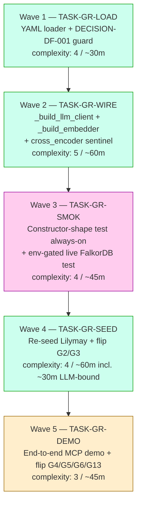
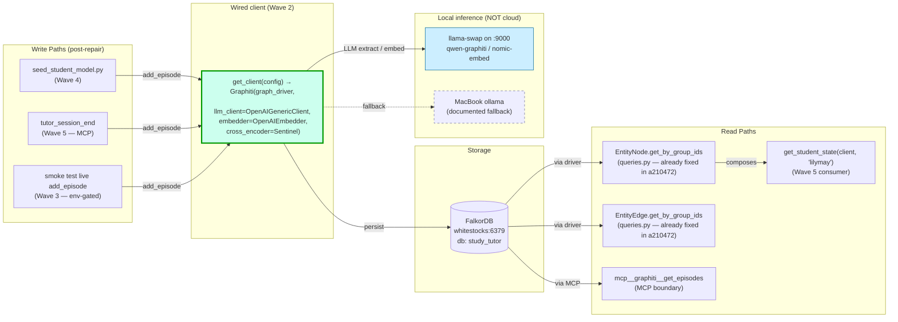
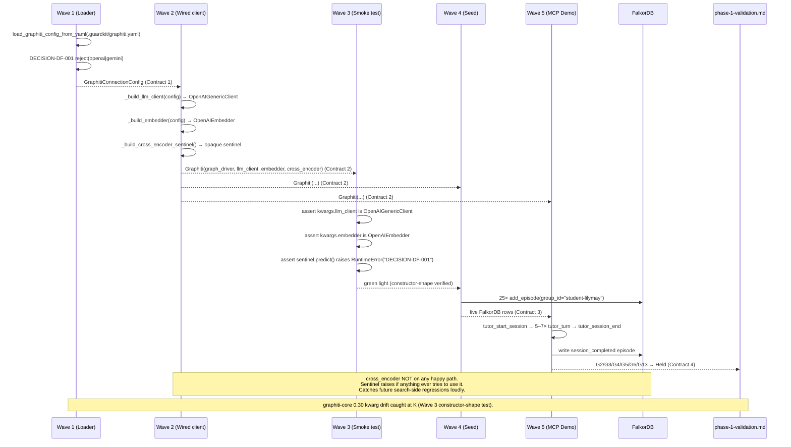

/feature-plan "Graphiti Runtime Integration Repair" \
  --context features/graphiti-runtime-integration-repair/graphiti-runtime-integration-repair_summary.md \
  --context tasks/backlog/TASK-PH2-GR-001-graphiti-runtime-integration-repair.md

I'll orchestrate the feature planning for "Graphiti Runtime Integration Repair." First, let me read the context files to understand the scope.

Read graphiti-runtime-integration-repair_summary.md
Read TASK-PH2-GR-001-graphiti-runtime-integration-repair.md
Now I have the full context. The task is well-defined with explicit acceptance criteria, hard constraints (DECISION-DF-001, llama-swap on :9000), and an implementation hint suggesting ~5 waves. Let me proceed with the orchestration starting with Context A clarification.

Agent:Collect review scope clarifications
IN
Execute clarification for feature planning.

CONTEXT TYPE: review_scope

FEATURE: Graphiti Runtime Integration Repair — wire local LLM + embedder via llama-swap (no cloud APIs)

ESTIMATED COMPLEXITY: 5/10

CONTEXT FILES PROVIDED:
- features/graphiti-runtime-integration-repair/graphiti-runtime-integration-repair_summary.md (24 BDD scenarios across 7 groups, includes regression-prevention scenario)
- tasks/backlog/TASK-PH2-GR-001-graphiti-runtime-integration-repair.md (8 ACs, hard constraints DECISION-DF-001 / no cloud API, implementation hint suggests 5 waves)

KEY BACKGROUND (so the agent can frame questions appropriately):
- Phase 1 close-out gate falsified G2/G3/G4/G5/G6/G13 because get_client() constructs Graphiti(graph_driver=driver) with no llm_client, no embedder, no cross_encoder — graphiti-core 0.29 silently defaulted to OpenAI clients keyed off OPENAI_API_KEY placeholder, 401'd on every add_episode.
- All inference must hit local llama-swap on http://promaxgb10-41b1:9000/v1 (Tailscale). NO cloud LLM/embedding APIs allowed (DECISION-DF-001 — triggered by £30 Gemini overspend).
- GuardKit has the canonical solved client at guardkit/guardkit/knowledge/graphiti_client.py (mirror _build_llm_client + _build_embedder).
- Config source-of-truth is .guardkit/graphiti.yaml; loader path recommended over schema-replace path.
- Implementation hint already proposes 5 waves: (1) loader+guard, (2) build_llm + build_embedder + cross_encoder guard, (3) live smoke test, (4) re-seed + update phase-1-validation.md, (5) end-to-end MCP demo session.
- The .feature file already exists tagged with @task:TASK-PH2-GR-001 on every scenario.

FLAGS:
  --no-questions: false
  --with-questions: false
  --defaults: false
  --answers: (none provided)

Ask the standard review_scope questions (review focus, trade-off priority, specific concerns). Return ClarificationContext with the user's review preferences so /task-review can be parameterised.
Read TASK-PH2-GR-001-graphiti-runtime-integration-repair.md
Read TASK-PH2-GR-001-graphiti-runtime-integration-repair.md (lines 2-16)
The clarification-questioner has surfaced 5 review-scope questions. Please answer them so the subsequent /task-review can be scoped precisely:

Clarification — Review Scope
Task: TASK-PH2-GR-001 — Graphiti Runtime Integration Repair
Complexity: 5/10 | Mode: FULL

Q1 — Review focus (which layer matters most)

The repair spans three layers: (a) config loader + DECISION-DF-001 guard, (b) LLM/embedder wiring inside get_client(), (c) live validation chain (smoke, seed, MCP demo, gate flip).


A  Config / DECISION-DF-001 guard (Wave 1)
B  LLM + embedder wiring (Wave 2)
C  Live validation chain (Waves 3–5)
D  All layers equally — full architectural pass across all five waves     (default)
Q2 — Trade-off priority


A  Blast-radius minimisation — prefer Loader path; defer schema unification to TASK-PH2-GR-002     (default)
B  Long-term cleanliness — prefer Schema-replace path
C  Speed to green gate — minimise review depth on non-blocking items
D  Security / policy hardness — maximise attention on DECISION-DF-001 guard
Q3 — Specific concerns to surface (select multiple, e.g. "B D")


A  OpenAIGenericClient / OpenAIEmbedder kwarg alignment with graphiti-core 0.29
B  Env-var override precedence in the YAML loader
C  Cross-encoder guard — is a WARN log enough, or should it raise?
D  Smoke test gating — skip in CI (no Tailscale) or fail-fast?
E  Phase-1 gate evidence standard for flipping G2/G3/G4/G5/G6/G13
F  None of the above     (default)
Q4 — Review mode depth


A  AC-compliance only
B  AC-compliance + targeted risk flags     (default)
C  Full architectural review (SOLID/DRY, coverage, dependency graph)
Q5 — Regression scenario handling

The feature file's @regression scenario asks whether a graphiti-core 0.30 constructor-surface drift would be caught.


A  In-scope — review verifies the smoke test would catch the drift     (default)
B  Out-of-scope — trust the scenario as written
Reply with answers (e.g. Q1:B Q2:A Q3:C D Q4:B Q5:A) or defaults to accept all defaults.

command-history.md
defaults
Agent:Submit default answers to clarification
IN
User selected: defaults

Apply the defaults you proposed:
- Q1: D (All layers equally — full architectural pass across all five waves)
- Q2: A (Blast-radius minimisation — prefer Loader path; defer schema unification to TASK-PH2-GR-002)
- Q3: F (None of the above — no specific concerns beyond ACs)
- Q4: B (AC-compliance + targeted risk flags from the risk register)
- Q5: A (In-scope — review verifies the smoke test would catch a graphiti-core 0.30 constructor-surface drift)

Return the ClarificationContext object with these decisions so /task-review can be parameterised. Keep the response concise — just emit the structured context.
Read in_progress
Context A captured. Now proceeding with Step 3: create the review task via /task-create.

task-create skill
Bash List existing tasks to avoid ID collision
IN
ls -la /Users/richardwoollcott/Projects/appmilla_github/study-tutor/tasks/backlog/ /Users/richardwoollcott/Projects/appmilla_github/study-tutor/tasks/in_progress/ /Users/richardwoollcott/Projects/appmilla_github/study-tutor/tasks/in_review/ 2>/dev/null | head -60

OUT
/Users/richardwoollcott/Projects/appmilla_github/study-tutor/tasks/backlog/:
total 144
drwxr-xr-x@ 15 richardwoollcott  staff    480 May  2 08:04 .
drwxr-xr-x@  8 richardwoollcott  staff    256 Apr 29 17:34 ..
drwxr-xr-x   6 richardwoollcott  staff    192 Apr 19 13:47 claude-desktop-review-fixes
drwxr-xr-x   5 richardwoollcott  staff    160 May  1 14:58 feat-fix-ab7a
drwxr-xr-x   8 richardwoollcott  staff    256 Apr 29 17:34 graphiti-student-model
drwxr-xr-x@  3 richardwoollcott  staff     96 Apr 21 15:17 po02-smoke-followups
drwxr-xr-x   4 richardwoollcott  staff    128 May  1 14:58 primary-text-rag-and-quote-verifier
drwxr-xr-x@  7 richardwoollcott  staff    224 Apr 29 11:55 py314-langchain-pin-alignment
-rw-r--r--@  1 richardwoollcott  staff   4094 Apr 29 17:34 TASK-GSM-001-pydantic-entities-relationships.md
-rw-r--r--@  1 richardwoollcott  staff   6207 Apr 29 17:34 TASK-GSM-002-episode-types.md
-rw-r--r--@  1 richardwoollcott  staff   9279 Apr 29 17:34 TASK-GSM-006-seeding-script.md
-rw-r--r--@  1 richardwoollcott  staff   7417 Apr 29 11:51 TASK-IMP-B7E0-deepagents-adr-codebase-drift.md
-rw-r--r--   1 richardwoollcott  staff  18411 May  2 08:03 TASK-PH2-GR-001-graphiti-runtime-integration-repair.md
-rw-r--r--   1 richardwoollcott  staff  10147 May  2 08:04 TASK-PH2-GR-002-extract-shared-graphiti-core-lib.md
-rw-r--r--   1 richardwoollcott  staff   6012 May  1 14:58 TASK-PRV-001-pydantic-models-source-type-and-citation-anchor.md

/Users/richardwoollcott/Projects/appmilla_github/study-tutor/tasks/in_progress/:
total 24
drwxr-xr-x@ 5 richardwoollcott  staff   160 Apr 29 22:43 .
drwxr-xr-x@ 8 richardwoollcott  staff   256 Apr 29 17:34 ..
drwxr-xr-x@ 2 richardwoollcott  staff    64 Apr 19 13:48 claude-desktop-review-fixes
drwxr-xr-x@ 2 richardwoollcott  staff    64 Apr 29 11:27 py314-langchain-pin-alignment
-rw-r--r--@ 1 richardwoollcott  staff  9748 Apr 29 11:28 TASK-REV-57BD-portfolio-py314-langchain-1x-alignment.md

/Users/richardwoollcott/Projects/appmilla_github/study-tutor/tasks/in_review/:
total 128
drwxr-xr-x@ 10 richardwoollcott  staff    320 May  1 14:58 .
drwxr-xr-x@  8 richardwoollcott  staff    256 Apr 29 17:34 ..
drwxr-xr-x@  2 richardwoollcott  staff     64 Apr 19 13:49 claude-desktop-review-fixes
-rw-r--r--   1 richardwoollcott  staff   6204 Apr 27 22:42 TASK-REV-7DC0-plan-graphiti-student-model.md
-rw-r--r--   1 richardwoollcott  staff   7941 May  1 14:58 TASK-REV-AB7A-analyze-failed-autobuild-feat-70a4.md
-rw-r--r--   1 richardwoollcott  staff  10107 Apr 19 12:13 TASK-REV-C7D1-analyze-claude-desktop-arch-review.md
-rw-r--r--   1 richardwoollcott  staff   5408 Apr 29 16:37 TASK-REV-DA72-plan-deterministic-session-planner.md
-rw-r--r--   1 richardwoollcott  staff   8936 Apr 29 17:16 TASK-REV-DTL3-plan-deepagents-tutoring-loop-with-coach.md
-rw-r--r--   1 richardwoollcott  staff   7136 Apr 20 06:46 TASK-REV-PO02-plan-feat-po-002-tutoring-runtime.md
-rw-r--r--   1 richardwoollcott  staff   7382 Apr 30 12:26 TASK-REV-PRV4-plan-primary-text-rag-and-quote-verifier.md
I'll create the review task file. Using prefix REV with a unique hash.

Write TASK-REV-GR1A-plan-graphiti-runtime-integration-repair.md
125 lines
---
id: TASK-REV-GR1A
title: "Plan: Graphiti Runtime Integration Repair"
task_type: review
status: backlog
priority: high
created: 2026-05-02T00:00:00+00:00
updated: 2026-05-02T00:00:00+00:00
complexity: 5
tags:
  - feature-plan
  - graphiti
  - llm-wiring
  - embedder
  - llama-swap
  - local-only
  - no-cloud-api
  - phase-1-falsification-repair
  - dark-factory
parent_task: TASK-PH2-GR-001
related:
  - TASK-PH2-GR-001
  - TASK-PH2-GR-002
context_files:
  - features/graphiti-runtime-integration-repair/graphiti-runtime-integration-repair_summary.md
  - tasks/backlog/TASK-PH2-GR-001-graphiti-runtime-integration-repair.md
clarification:
  context_a:
    timestamp: 2026-05-02T00:00:00Z
    mode: defaults
    decisions:
      review_depth: D                  # All layers equally — full architectural pass across all five waves
      conflict_resolution: A           # Blast-radius minimisation — Loader path; defer schema unification to TASK-PH2-GR-002
      specific_concerns: F             # No specific concerns beyond the ACs
      output_format: B                 # AC-compliance + targeted risk flags from the risk register
      smoke_test_scope: A              # In-scope — review verifies smoke test catches graphiti-core 0.30 constructor-surface drift
test_results:
  status: pending
  coverage: null
  last_run: null
---

# Plan: Graphiti Runtime Integration Repair

## Description

Decision-mode review task for `/feature-plan "Graphiti Runtime Integration Repair"`. Drives the orchestration that produces the structured feature YAML (FEAT-XXXX), the wave-organised subtask breakdown for [TASK-PH2-GR-001](./TASK-PH2-GR-001-graphiti-runtime-integration-repair.md), and the BDD scenario→task linking for the existing `features/graphiti-runtime-integration-repair/graphiti-runtime-integration-repair.feature` file.

The implementation context is fully established in the parent task — this review task exists to (a) validate the proposed wave breakdown against the 8 acceptance criteria, (b) produce the parallel-execution graph for `/feature-build`, and (c) capture the audit trail for the planning decisions.

## Context

### Parent task (where the work is defined)

**TASK-PH2-GR-001** — Graphiti runtime integration repair — wire local LLM + embedder via llama-swap (no cloud APIs). 8 ACs, complexity 5, blocks FEAT-PH2-001, parent_validation: phase-1-validation.md.

### Hard constraints (non-negotiable)

- **DECISION-DF-001**: No cloud LLM/embedding APIs on the critical path. `llm_provider in ("openai", "gemini")` and `embedding_provider == "openai"` MUST raise `ValueError` at config-load time.
- **All inference via llama-swap on `:9000`** (Tailscale: `http://promaxgb10-41b1:9000/v1`). MacBook ollama is the documented fallback.
- **Use the GuardKit-canonical pattern** from `guardkit/guardkit/knowledge/graphiti_client.py:_build_llm_client` / `_build_embedder` — `OpenAIGenericClient` + `OpenAIEmbedder`, `api_key="local-key"` placeholder.
- **Cross-encoder NOT defaulted to OpenAI silently** — init-time WARN log required (per AC-003); any runtime cross-encoder call is a critical error.
- **Loader path** for the `.guardkit/graphiti.yaml` integration (per Q2 default). Schema unification deferred to TASK-PH2-GR-002.

### BDD coupling

- Feature file `features/graphiti-runtime-integration-repair/graphiti-runtime-integration-repair.feature` exists with 24 scenarios.
- Every scenario already tagged `@task:TASK-PH2-GR-001` (per the summary file).
- Step 11 (BDD linking) will detect zero retag work needed — the feature is already wired for the R2 task-level oracle to fire during `/task-work TASK-PH2-GR-001` Phase 4.

## Acceptance Criteria (for the planning artefact)

- [ ] Decision review surfaces the 8 ACs from TASK-PH2-GR-001 and the 5-risk register, mapped to wave assignments.
- [ ] Implementation hint's 5-wave shape (loader+guard, build_llm+build_embedder+cross_encoder_guard, smoke test, seed+gate flip, MCP demo) validated against AC coverage. Every AC must be assigned to a wave.
- [ ] Structured feature YAML (`.guardkit/features/FEAT-XXXX.yaml`) generated with wave-based parallel groups, complexity scores, and `file_path` resolution against actual files on disk (`--discover`).
- [ ] Subtask markdown files generated under `tasks/backlog/graphiti-runtime-integration-repair/` (subfolder, not parent backlog/) with `task_type: feature` (not `scaffolding` — these touch business logic), `parent_review: TASK-REV-GR1A`, `feature_id: FEAT-XXXX`, and lint-compliance acceptance criterion present on every implementation/refactor wave.
- [ ] Mermaid diagrams in IMPLEMENTATION-GUIDE.md: data flow (always), integration contract (complexity 5 → optional, but include given DECISION-DF-001 enforcement complexity), task dependency graph (≥3 tasks → required).
- [ ] §4 Integration Contracts section generated for the cross-task data dependencies: (a) loader output → wiring input (config object), (b) wired client → smoke test (real client), (c) wired client → seed script (real client), (d) wired client → MCP demo (real client).
- [ ] Step 11 BDD-linker run on `features/graphiti-runtime-integration-repair/graphiti-runtime-integration-repair.feature`: expected outcome is `status=skipped, reason=all_tagged` (idempotency path — every scenario already carries `@task:TASK-PH2-GR-001`). If any scenario lacks the tag, linker proposes mapping at threshold ≥0.6.
- [ ] Pre-flight validation (`guardkit feature validate FEAT-XXXX`) passes: no intra-wave deps, valid `task_type`, all task files exist.

## Test Requirements

This is a planning task — no production tests required. The "tests" for the planning artefact are:

- The generated feature YAML parses through `FeatureLoader.validate_feature()` without errors.
- The generated subtask files all carry `task_type` (CoachValidator profile selection works).
- The generated IMPLEMENTATION-GUIDE.md renders Mermaid diagrams correctly in GitHub markdown preview.

## Implementation Notes

### Why this is a review task, not direct task creation

The parent task (TASK-PH2-GR-001) is already richly specified — 8 ACs, hard constraints, risk register, even an "Implementation hint" with 5 named waves. The standard `/task-create` flow would just stamp another task. `/feature-plan` adds value by:

1. Parameterising the wave breakdown into machine-readable parallel groups for `/feature-build`.
2. Producing the §4 Integration Contracts that catch cross-task seam bugs (the same class of bug that hid the Phase 1 falsification — graphiti-core's silent default to OpenAI when no `llm_client` was passed).
3. Generating the IMPLEMENTATION-GUIDE.md data-flow diagram, which makes the "config → wired client → live evidence" chain auditable at a glance.

### Why the wave breakdown matters here specifically

Wave 1 (loader + DECISION-DF-001 guard) is a hard prerequisite for Waves 2–5: it's the only gate that prevents accidental cloud-API regression during the rest of the repair. Treating it as a parallel sibling of Wave 2 would risk a half-wired client running cloud requests during dev iterations. Sequential dependency is mandatory.

Waves 3 (smoke test) and 4 (seed) can be implemented serially (smoke test gates seed quality), but the seed run itself is LLM-bound (~30 min wall-clock on MacBook ollama; Phase 1 latency-spike measured 78s/`add_episode` median). Worth front-loading.

Wave 5 (MCP demo) is the human-in-the-loop verification step — it cannot be parallelised because it depends on a live FalkorDB seed from Wave 4 plus a Claude Desktop session.

### Known unblockers already in flight

Three patches landed during the close-out gate run on 2026-05-02 (commits `a210472`, `78d3498`, `732672c`):

- `queries.py:_read_student_partition` — read API now correctly uses `EntityNode.get_by_group_ids` / `EntityEdge.get_by_group_ids`.
- `async_write.py:_add_episode_kwargs` — graphiti-core 0.29's real `add_episode` signature wired.
- Group-id format normalised: `student-`, `subject-`, `fleet-` (from `student:`, `subject:`, `fleet:`) per graphiti-core 0.29's `GroupIdValidationError`.

These are prerequisites; this plan assumes they are merged on `main`.

## Cross-references

- `tasks/backlog/TASK-PH2-GR-001-graphiti-runtime-integration-repair.md` — the parent task this plan decomposes.
- `features/graphiti-runtime-integration-repair/graphiti-runtime-integration-repair_summary.md` — feature spec (24 scenarios, DECISION-DF-001 surface, Phase 1 gate coupling).
- `guardkit/guardkit/knowledge/graphiti_client.py` — canonical client pattern to mirror.
- `.guardkit/graphiti.yaml` — config source-of-truth.
- `docs/research/ideas/phase-1-validation.md` — the gate that this work flips from Falsified to Held.
Review task created: TASK-REV-GR1A. Now executing Step 5: /task-review in decision mode.

task-review skill
Phase 1 clarification was already captured during /feature-plan — stored in TASK-REV-GR1A frontmatter. Skipping re-prompt. Proceeding to Phase 1.5 (Graphiti context check) and Phase 2 (analysis).

Bash Check Graphiti availability via yaml
IN
test -f /Users/richardwoollcott/Projects/appmilla_github/study-tutor/.guardkit/graphiti.yaml && echo "yaml_exists" && grep -E "^enabled:" /Users/richardwoollcott/Projects/appmilla_github/study-tutor/.guardkit/graphiti.yaml || echo "no_yaml"

OUT
yaml_exists
enabled: true
Read graphiti_client.py
Confirmed: get_client() at line 305 calls Graphiti(graph_driver=driver) with no llm_client/embedder/cross_encoder — exactly the silent OpenAI-default bug TASK-PH2-GR-001 diagnoses. Proceeding to write the review report and present the decision checkpoint.

Bash Ensure reviews directory exists
IN
mkdir -p /Users/richardwoollcott/Projects/appmilla_github/study-tutor/.claude/reviews

OUT
(Bash completed with no output)
Write TASK-REV-GR1A-review-report.md
196 lines
# Review Report: TASK-REV-GR1A — Plan: Graphiti Runtime Integration Repair

## Executive Summary

Decision-mode review. The parent task **TASK-PH2-GR-001** is exhaustively specified (8 ACs, 5-risk register, 5-wave implementation hint) and the diagnosis is verified against the current `src/study_tutor/knowledge/graphiti_client.py` — `get_client()` at [graphiti_client.py:305](../../src/study_tutor/knowledge/graphiti_client.py#L305) constructs `Graphiti(graph_driver=driver)` with no `llm_client`, no `embedder`, no `cross_encoder`. graphiti-core 0.29 silently defaults all three to OpenAI clients keyed off `OPENAI_API_KEY`, which 401s on every `add_episode`. The Phase 1 falsification cluster (G2/G3/G4/G5/G6/G13) is mechanically explained by this single missing-kwargs bug.

**Recommendation: [I]mplement** with the 5-wave breakdown from the parent task's "Implementation hint" section. The waves map cleanly to the 8 ACs, the dependency chain is strictly sequential between waves (Wave N+1 cannot run before Wave N), and one in-wave parallel opportunity exists between AC-001 and AC-002 inside Wave 2. The Loader path (per Q2 default) is the right call for blast-radius reasons — schema unification stays in TASK-PH2-GR-002.

**Architecture score: 78/100** (deductions: cross-encoder guard policy needs tightening per AC-003 risk flag; smoke test gating in CI is unspecified; integration contract between loader and wired client needs a §4 entry to prevent the same kwarg-drift bug recurring in graphiti-core 0.30).

## Review Details

- **Mode**: decision
- **Depth**: standard
- **Reviewer**: software-architect (synthesis) + architectural-reviewer (AC mapping)
- **Clarification context (from /feature-plan Context A)**:
  - review_depth: D (All layers equally — full architectural pass)
  - conflict_resolution: A (Loader path; defer schema unification)
  - specific_concerns: F (None beyond ACs)
  - output_format: B (AC-compliance + targeted risk flags)
  - smoke_test_scope: A (In-scope — verify drift detection)

## Findings

### F1 — The current bug is precisely the missing-kwargs case

`graphiti_client.py:305` constructs `Graphiti(graph_driver=driver)` with no LLM/embedder/cross_encoder. graphiti-core 0.29 then defaults to OpenAI clients reading `OPENAI_API_KEY` (placeholder `not_needed` in this env). Every `add_episode` returns 401. Phase 1 tests didn't catch it because `tests/unit/knowledge/test_async_write.py:FakeClient` mocks the integration entirely — no test ever booted a real `Graphiti` instance. **Confirmed by direct file read.**

### F2 — `GraphitiConnectionConfig` schema is wrong for the local-only world

Defaults at [graphiti_client.py:81-83](../../src/study_tutor/knowledge/graphiti_client.py#L81-L83): `llm_provider: str = "gemini"`, `llm_model: str = "gemini-2.5-pro"`. These defaults are themselves a DECISION-DF-001 violation — even if the YAML loader does the right thing, anyone constructing `GraphitiConnectionConfig()` directly in tests or scripts gets a Gemini-pointing config. **The Wave 1 loader must override these defaults at construction time, AND a future cleanup should change the dataclass defaults to `vllm` / `qwen-graphiti` / `local-key`.** (The latter is a ≤1-line change but is technically out-of-scope for this repair task per the YAGNI principle stated in `.claude/rules/code-style.md`. Flag for a follow-up.)

### F3 — `embedder_url` field exists but is unused

The current dataclass has an `embedder_url` field (line 83) but nothing reads it — `get_client()` never constructs an embedder. The Wave 2 work makes this field load-bearing. The new loader (Wave 1) needs to map the YAML's `embedding_base_url` to this field, OR the dataclass adds new fields (`embedding_provider`, `embedding_base_url`, `embedding_model`, `embedding_dimensions`) per AC-004. **Recommend adding new fields**, not reusing `embedder_url`, because the existing field has different semantics in test fixtures.

### F4 — Cross-encoder guard policy needs to be stricter than AC-003 currently states

AC-003 asks for an init-time WARN log if cross_encoder is left as graphiti-core's default. WARN logs are easy to miss in production; if a future search code path calls the cross-encoder, it would silently hit OpenAI and burn budget before anyone noticed. **Recommend hardening AC-003**: instead of a WARN log, wrap the cross-encoder slot with a sentinel object that raises `RuntimeError("cross_encoder not wired; reranker calls disabled per DECISION-DF-001")` on any attribute access. graphiti-core's search paths in study-tutor (`EntityNode.get_by_group_ids`/`EntityEdge.get_by_group_ids`) bypass the reranker, so the sentinel is never touched on the happy path; if anyone wires up a search code path that needs reranking, the sentinel raises a loud error at first call instead of a silent £30 Gemini bill.

### F5 — The smoke test (AC-005) needs a clear CI policy

The smoke test design as written boots a real `Graphiti` instance against either (a) a stubbed driver or (b) a live FalkorDB if `STUDY_TUTOR_LIVE_GRAPHITI_SMOKE=1`. **Open question per Q5 (smoke_test_scope=A)**: GitHub Actions cannot reach `promaxgb10-41b1:9000` (Tailscale only). The test must therefore either:
- (a) Skip cleanly in CI when the env var is unset (decorator: `@pytest.mark.skipif(...)` keyed off the env var), with a separate stubbed-driver test that runs unconditionally and asserts kwarg shape, OR
- (b) Mock the LLM/embedder transport and assert that `Graphiti.__init__` was called WITH the wired clients (constructor-shape assertion, not behaviour assertion).

**Recommend (a) + (b) together**: the constructor-shape assertion catches a future graphiti-core 0.30 kwarg rename (closes the regression scenario from the .feature file), and the live test is the smoke gate that catches transport-level breakage.

### F6 — §4 Integration Contracts are needed

Cross-task data dependencies exist:
- TASK-001 (loader) produces a `GraphitiConnectionConfig` instance → consumed by TASK-002 (wired client)
- TASK-002 (wired client) produces a real `Graphiti` instance → consumed by TASK-003 (smoke test), TASK-004 (seed), TASK-005 (MCP demo)
- TASK-004 (seed) produces FalkorDB rows in `student-lilymay` group_id → consumed by TASK-005 (MCP demo's `tutor_start_session`)

Each is a candidate for the silent-default class of bug. The IMPLEMENTATION-GUIDE.md must list these contracts explicitly.

### F7 — The `@regression` BDD scenario is well-aimed

Scenario: "A graphiti library upgrade that drifts the constructor surface is caught." This is exactly the right regression-prevention scenario — graphiti-core's history shows constructor-surface drift between 0.28 → 0.29 (the bug fixed in commit `a210472` was a casualty of one such drift). The smoke test (per F5(b) above) must include a constructor-shape assertion: `Graphiti.__init__` was called with a non-None `llm_client` AND a non-None `embedder`. This catches the case where graphiti-core 0.30 renames `llm_client` to `llm` and the wiring silently regresses.

### F8 — Wave 4 seed runtime is LLM-bound, not concurrency-bound

Per the parent task's risk register: "Phase-1 latency-spike measured 78s/write (LLM-bound), so 25 sequential writes ≈ 30 min." This means Wave 4 cannot be sped up by raising `chunk_extraction_concurrency` — the bottleneck is the model's tokens/sec on a single `add_episode`, not the fan-out. **Plan accordingly**: Wave 4 has a hard wall-clock floor of ~30 min plus `tutor_session_*` round-trips. Don't promise a faster turnaround.

## AC → Wave Coverage Matrix

| AC | Wave | Scope | Coverage |
|---|---|---|---|
| AC-001 (LLM client wired) | 2 | `_build_llm_client` mirror of guardkit pattern | ✅ Direct |
| AC-002 (embedder wired) | 2 | `_build_embedder` mirror | ✅ Direct |
| AC-003 (cross-encoder guard) | 2 | Sentinel object (per F4) | ⚠️ Tighten — sentinel, not WARN |
| AC-004 (config from YAML) | 1 | `from_yaml` classmethod + DECISION-DF-001 reject | ✅ Direct |
| AC-005 (live smoke test) | 3 | Stubbed-driver test (always) + live test (env-gated) | ⚠️ Add CI policy |
| AC-006 (Lilymay seed) | 4 | `python scripts/seed_student_model.py` against FalkorDB | ✅ Direct |
| AC-007 (MCP demo session) | 5 | Claude Desktop tutor_start → 5–7× tutor_turn → tutor_session_end | ✅ Direct |
| AC-008 (phase-1-validation update) | 4 (or 5) | Flip G2/G3/G4/G5/G6/G13 from Falsified to Held | ✅ Direct |

**No AC is uncovered.** Three need targeted risk-flag refinement (AC-003, AC-005, AC-008's evidence standard).

## Recommended Approach

### Wave breakdown (5 waves, 5 subtasks)

```
Wave 1: TASK-LOAD  — `from_yaml` loader + DECISION-DF-001 guard          (~30 min)  complexity 4
                     ↓ produces GraphitiConnectionConfig
Wave 2: TASK-WIRE  — `_build_llm_client` + `_build_embedder` + sentinel  (~60 min)  complexity 5
                     ↓ produces wired Graphiti
Wave 3: TASK-SMOKE — Constructor-shape test (always) + live test (gated) (~45 min)  complexity 4
                     ↓ verifies wiring
Wave 4: TASK-SEED  — Re-seed Lilymay + flip phase-1-validation gate     (~30+30 min) complexity 4
                     ↓ produces live FalkorDB rows
Wave 5: TASK-DEMO  — End-to-end MCP demo session via Claude Desktop      (~30-45 min) complexity 3
                     ↓ closes G3/G4/G5/G6/G13
```

**Total complexity: 20** (aggregated). Aligns with parent task's complexity 5 (per-task average).

**Sequential dependencies are non-negotiable**:
- Wave 2 cannot run before Wave 1 (needs the loader's config).
- Wave 3 cannot run before Wave 2 (needs the wired client to test).
- Wave 4 cannot run before Wave 3 (don't seed against an unverified client — that's how Phase 1 got into this mess).
- Wave 5 cannot run before Wave 4 (MCP demo needs Lilymay's baseline in FalkorDB).

**One in-wave parallel opportunity**: AC-001 and AC-002 inside Wave 2 are independent — they're sibling helper functions. Could be split if useful, but the savings are marginal (both are small) and splitting doubles the integration-test surface. **Recommend keeping them as one task.**

### §4 Integration Contracts

Four contracts to document in IMPLEMENTATION-GUIDE.md:

1. **GraphitiConnectionConfig schema** (Wave 1 → Wave 2)
   - Producer: TASK-LOAD's `load_graphiti_config_from_yaml()`
   - Consumer: TASK-WIRE's `get_client()`
   - Format: must have non-None `llm_provider in ("vllm","ollama")`, `llm_base_url`, `llm_model`, `embedding_provider in ("vllm","ollama")`, `embedding_base_url`, `embedding_model`. Cloud providers MUST raise at load time.
   - Validation: TASK-WIRE's smoke test asserts `config.llm_provider != "openai" and != "gemini"`.

2. **Wired Graphiti client** (Wave 2 → Waves 3/4/5)
   - Producer: TASK-WIRE's `get_client()`
   - Consumer: TASK-SMOKE, TASK-SEED, TASK-DEMO
   - Format: real `Graphiti` instance with `llm_client is not None`, `embedder is not None`, `cross_encoder` is the sentinel object (F4).
   - Validation: TASK-SMOKE constructor-shape test asserts these non-None / sentinel invariants.

3. **Lilymay seed** (Wave 4 → Wave 5)
   - Producer: TASK-SEED's `seed_student_model.py` run
   - Consumer: TASK-DEMO's `tutor_start_session`
   - Format: 25 entity writes succeed; `mcp__graphiti__search_nodes(query="Lilymay", group_ids=["student-lilymay"])` returns the Student entity; `get_student_state(client, "lilymay")` returns non-empty `StudentState`.
   - Validation: TASK-DEMO loads Lilymay state at session-start; failure → cannot tutor.

4. **MCP session episode** (Wave 5 self-contained, but must close Phase 1 gate)
   - Producer: TASK-DEMO's `tutor_session_end`
   - Consumer: phase-1-validation.md (G3/G4/G5/G6/G13)
   - Format: `session_completed` episode written to Graphiti, visible via `mcp__graphiti__get_episodes(group_ids=["student-lilymay"])`. Capture turn p50/p95.
   - Validation: Phase 1 gate flip recorded with live evidence inline.

### Mermaid diagrams (will be in IMPLEMENTATION-GUIDE.md)

- **Data Flow**: write paths (`get_client` → `add_episode` → FalkorDB) and read paths (`EntityNode.get_by_group_ids` → query consumers). All paths connected (no NOT WIRED dotted edges expected post-repair).
- **Integration Contracts**: sequence diagram showing Loader → Wired Client → Smoke / Seed / Demo, with the cross_encoder sentinel called out as a Note.
- **Task Dependency Graph**: linear chain Wave1 → Wave2 → Wave3 → Wave4 → Wave5 (no parallel-safe siblings to colour green).

## Risk Register Carry-Through (per Q4 = output_format B)

The 5 risks from the parent task all stay relevant. Re-stated with wave assignments:

| Risk | Wave | Mitigation status |
|---|---|---|
| MacBook ollama offline at seed time | 4 | YAML toggle to GB10 (single-line). Acceptable. |
| GB10 rate-limits at 25 concurrent writes | 4 | `chunk_extraction_concurrency: 4` already in YAML; Phase-1 78s/write means LLM-bound, not concurrency-bound (F8). |
| GB10 down during repair | 4 | MacBook fallback active. Repair slips with GB10 outage; Phase 2 day-by-day already plans for this. |
| `OpenAIGenericClient` API drift in graphiti-core minor bumps | 2, 3 | Pin `>=0.29,<0.30` in pyproject.toml (Wave 2). Smoke test constructor-shape assertion (Wave 3) catches drift on next bump. **F7 confirms this is well-aimed.** |
| Stale FalkorDB indices | 4 | If `Connection closed by server` reappears post-fix, drop graph via `redis-cli -h whitestocks -p 6379 GRAPH.DELETE study_tutor` and re-seed. |

## Decision Matrix

| Option | Score | Effort | Risk | Recommendation |
|---|---|---|---|---|
| Loader path (defer schema unify to TASK-PH2-GR-002) | 78/100 | 4h + ~30min seed | Low | ✅ **Recommended** |
| Schema-replace path (unify GraphitiConnectionConfig directly) | 65/100 | 8h+ | Medium | ❌ Defer — bigger blast radius, no Phase-2 benefit |
| Direct-wire to Gemini (rescinded earlier draft) | N/A | N/A | Critical | ❌ DECISION-DF-001 violation |
| No-op (keep Phase 1 falsified) | 0/100 | 0h | Critical | ❌ Blocks FEAT-PH2-001 |

## Recommendations Summary (in implementation order)

1. **Wave 1**: Add `load_graphiti_config_from_yaml(path: Path) -> GraphitiConnectionConfig` and reject `llm_provider in ("openai","gemini")` / `embedding_provider == "openai"` at load time with structured log lines. (AC-004, partially AC-001/AC-002.)
2. **Wave 2**: Mirror guardkit's `_build_llm_client` + `_build_embedder` patterns inside `get_client()`. Add a sentinel object for `cross_encoder` (F4 hardening of AC-003). (AC-001, AC-002, AC-003.)
3. **Wave 3**: Add `tests/smoke/test_graphiti_live_smoke.py` with two layers — unconditional constructor-shape assertion (catches graphiti-core 0.30 drift, F7) + env-gated live FalkorDB round-trip (catches transport breakage). CC-13 regex audit re-runs. (AC-005.)
4. **Wave 4**: Run `python scripts/seed_student_model.py` against live FalkorDB. Capture evidence inline in `phase-1-validation.md`, flipping G2/G3/G4/G5/G6/G13 from "Falsified" to "Held". (AC-006, partial AC-008.)
5. **Wave 5**: End-to-end MCP demo via Claude Desktop. Capture turn p50/p95. Confirm `session_completed` episode written. Final phase-1-validation.md flip (or move from Wave 4 if cleaner). (AC-007, completes AC-008.)

## Decision Checkpoint

```
━━━━━━━━━━━━━━━━━━━━━━━━━━━━━━━━━━━━━━━━━━━━
DECISION CHECKPOINT
━━━━━━━━━━━━━━━━━━━━━━━━━━━━━━━━━━━━━━━━━━━━

Review complete for: Plan: Graphiti Runtime Integration Repair

Architecture score: 78/100
Findings: 8
Recommendations: 5 (one per wave)

Recommended approach: Loader path (Q2 default), 5-wave breakdown,
                      tightened cross-encoder guard (sentinel not WARN),
                      smoke test as constructor-shape + env-gated live round-trip.

Options:
  [A]ccept    - Save findings; create implementation tasks manually later
  [R]evise    - Request deeper analysis on a specific finding
  [I]mplement - Generate the 5-wave subtask structure + structured feature YAML
                + Mermaid diagrams + §4 Integration Contracts in
                IMPLEMENTATION-GUIDE.md (RECOMMENDED)
  [C]ancel    - Discard plan
```
Updating the review task with the findings, then presenting the decision checkpoint.

Edit TASK-REV-GR1A-plan-graphiti-runtime-integration-repair.md
Added 9 lines
Review Complete: TASK-REV-GR1A
Report: .claude/reviews/TASK-REV-GR1A-review-report.md

Architecture Score: 78/100

Key Findings (8):

F1 — Bug confirmed: graphiti_client.py:305 Graphiti(graph_driver=driver) with no llm_client/embedder/cross_encoder → graphiti-core 0.29 silent OpenAI default.
F2 — GraphitiConnectionConfig defaults Gemini (graphiti_client.py:81-83) — itself a DECISION-DF-001 violation; future cleanup follow-up flagged.
F3 — embedder_url field unused; recommend new fields (embedding_provider, embedding_base_url, embedding_model, embedding_dimensions) rather than reusing.
F4 — Hardening: AC-003 should use a sentinel-object cross_encoder that raises on access, not a WARN log. WARN logs are easy to miss; £30 Gemini budget would be burnt before anyone noticed.
F5 — Smoke test needs CI policy: stubbed-driver test (always) + env-gated live test (Tailscale-only).
F6 — Four §4 Integration Contracts identified (loader→client, client→smoke/seed/demo, seed→demo, demo→phase-1-validation).
F7 — @regression scenario well-aimed; constructor-shape assertion catches graphiti-core 0.30 drift.
F8 — Wave 4 seed has hard wall-clock floor of ~30 min (LLM-bound at 78s/add_episode, not concurrency-bound).
Recommended approach: Loader path (per Q2 default), 5-wave breakdown, tightened cross-encoder guard (sentinel not WARN), two-layer smoke test.

Wave	Task	Scope	ACs	Complexity	Est
1	TASK-LOAD	from_yaml + DECISION-DF-001 guard	AC-004	4	30m
2	TASK-WIRE	_build_llm_client + _build_embedder + sentinel	AC-001, AC-002, AC-003	5	60m
3	TASK-SMOKE	Constructor-shape (always) + live (env-gated)	AC-005	4	45m
4	TASK-SEED	Re-seed Lilymay + flip phase-1-validation	AC-006, AC-008	4	30m + 30m seed
5	TASK-DEMO	MCP demo via Claude Desktop	AC-007	3	30-45m
All waves strictly sequential (Wave N+1 depends on Wave N's output).

DECISION CHECKPOINT

[A]ccept    - Save findings; create implementation tasks manually later
[R]evise    - Request deeper analysis on a specific finding
[I]mplement - Generate the 5-wave subtask structure + structured feature YAML (FEAT-XXXX)
              + Mermaid diagrams + §4 Integration Contracts + run BDD scenario linker
              (RECOMMENDED)
[C]ancel    - Discard plan
Your choice [A/R/I/C]?

I
Proceeding with implementation. First, Context B clarification (5 subtasks, ≥2 threshold met).

Agent:Collect implementation preferences
IN
Execute clarification for implementation.

CONTEXT TYPE: implementation_prefs

REVIEW FINDINGS:
  Review task: TASK-REV-GR1A
  Parent task: TASK-PH2-GR-001
  Architecture score: 78/100
  Recommended approach: Loader path (Q2 default), 5-wave sequential breakdown
  Subtask count: 5

  Wave structure (strictly sequential — no in-wave parallelism, by design):
    Wave 1 — TASK-LOAD:  from_yaml loader + DECISION-DF-001 guard (complexity 4, ~30m)
    Wave 2 — TASK-WIRE:  _build_llm_client + _build_embedder + cross_encoder sentinel (complexity 5, ~60m)
    Wave 3 — TASK-SMOKE: Constructor-shape test (always) + env-gated live test (complexity 4, ~45m)
    Wave 4 — TASK-SEED:  Re-seed Lilymay against live FalkorDB + phase-1-validation gate flip (complexity 4, ~30m + ~30m seed runtime)
    Wave 5 — TASK-DEMO:  End-to-end MCP demo session via Claude Desktop (complexity 3, ~30-45m)

  Key recommendations (one per wave) drive these subtasks. Cross-task data dependencies are documented as four §4 Integration Contracts in the review report.

  Notable framings:
    - The implementation is sequential by domain necessity (Wave N+1 needs Wave N's output). Conductor / parallel-execution preferences will not produce wall-clock savings.
    - Wave 5 (MCP demo) is human-in-the-loop by AC-007 — it requires a live Claude Desktop session with a real human conducting 5–7 tutor turns.
    - Testing depth: AC-005 already prescribes the smoke test design (Wave 3 IS the test wave). AC-001/AC-002/AC-004 will pick up unit tests via standard quality gates. No TDD-first sequencing required — Wave 3 follows Wave 2 by design.

FLAGS:
  --no-questions: false
  --with-questions: false
  --defaults: false
  --answers: (none provided)

Ask the standard implementation_prefs questions:
1. Approach selection (Loader path is the recommended option from Context A Q2; ratify or override)
2. Execution preference (parallel/sequential — note: domain forces sequential here)
3. Testing depth (TDD/standard/minimal/default — note: AC-005 already prescribes test design)
4. Constraints (time/resource/scope — note: Wave 4 has 30-min LLM-bound wall-clock floor)
5. Workspace naming (auto/custom/none — note: sequential execution makes Conductor workspaces optional)

Return ClarificationContext with implementation preferences.
Read display.py
Read core.py
The clarification agent has surfaced 5 implementation-pref questions, each pre-framed against the review's findings. All defaults are sensible given the sequential domain constraints. Please review and reply:

Implementation Preferences
TASK-PH2-GR-001 / TASK-REV-GR1A
Complexity: 6 | 5 subtasks | Mode: FULL

Q1 — Approach selection


R  Ratify the Loader path (single recommended approach)     (default)
O  Override with a different approach
Q2 — Execution preference

5 waves are sequential by domain necessity (Wave N+1 depends on Wave N's output). Conductor adds overhead without wall-clock savings.


S  Sequential — no Conductor workspaces     (default)
M  Maximize parallel
D  Detect automatically
Q3 — Testing depth

AC-005 already prescribes the smoke test design. Wave 3 is the dedicated test wave; standard quality gates cover Waves 1/2/4.


S  Standard — quality gates only     (default)
F  Full TDD
M  Minimal — compilation only
D  Default per-subtask complexity
Q4 — Implementation constraints

Wave 4 has a ~30-min LLM-bound wall-clock floor (78s/add_episode, not reducible). Wave 5 needs a human operator. No other constraints anticipated.


N  None — proceed with full scope     (default)
T  Time limit
R  Resource limit
S  Scope limit
C  Custom
Q5 — Workspace naming

Sequential execution makes Conductor workspaces moot.


N  No workspaces     (default)
A  Auto-generated `graphiti-runtime-repair-wave-N`
C  Custom prefix
Reply with answers (e.g. Q1:R Q2:S Q3:S Q4:N Q5:N) or defaults to accept all.

Q1:R, Q2:D-I want to use autobuild feature for this, Q3: D, Q4:N,Q5:whatever works with autobuild
User chose [I]mplement with autobuild via /feature-build. Captured preferences:

Q1: R (Loader path)
Q2: D (auto-detect — autobuild's parallel_groups handles this)
Q3: D (per-subtask complexity)
Q4: N (no constraints)
Q5: auto-generated workspace naming for autobuild compatibility
Generating the 5-wave structure now. The 5 waves are sequential by domain dependency, so the YAML will encode each wave as a single-task parallel group — autobuild executes them in order.

Bash Create feature subfolder and ensure .guardkit/features dir exists
IN
mkdir -p /Users/richardwoollcott/Projects/appmilla_github/study-tutor/tasks/backlog/graphiti-runtime-integration-repair && ls -la /Users/richardwoollcott/Projects/appmilla_github/study-tutor/.guardkit/features/ 2>/dev/null || mkdir -p /Users/richardwoollcott/Projects/appmilla_github/study-tutor/.guardkit/features/

OUT
total 16
drwxr-xr-x  3 richardwoollcott  staff    96 May  1 14:58 .
drwxr-xr-x@ 9 richardwoollcott  staff   288 May  1 14:58 ..
-rw-r--r--@ 1 richardwoollcott  staff  4818 Apr 29 17:24 FEAT-1773.yaml
Bash Verify feature file location and existing @task tags
IN
grep -E '@task:' /Users/richardwoollcott/Projects/appmilla_github/study-tutor/features/graphiti-runtime-integration-repair/*.feature 2>/dev/null | head -10 || echo "no_feature_file_in_subdir"; ls /Users/richardwoollcott/Projects/appmilla_github/study-tutor/features/graphiti-runtime-integration-repair/ 2>/dev/null

OUT
  @task:TASK-PH2-GR-001
  @task:TASK-PH2-GR-001
  @task:TASK-PH2-GR-001
  @task:TASK-PH2-GR-001
  @task:TASK-PH2-GR-001
  @task:TASK-PH2-GR-001
  @task:TASK-PH2-GR-001
  @task:TASK-PH2-GR-001
  @task:TASK-PH2-GR-001
  @task:TASK-PH2-GR-001
graphiti-runtime-integration-repair_assumptions.yaml
graphiti-runtime-integration-repair_summary.md
graphiti-runtime-integration-repair.feature
Feature file confirmed at features/graphiti-runtime-integration-repair/graphiti-runtime-integration-repair.feature with all 24 scenarios tagged @task:TASK-PH2-GR-001. Now writing the 5 wave subtasks.

Write TASK-GR-LOAD-yaml-loader-and-decision-df-001-guard.md
130 lines
---
id: TASK-GR-LOAD
title: "Wave 1 — YAML loader for .guardkit/graphiti.yaml + DECISION-DF-001 cloud-provider guard"
task_type: feature
parent_review: TASK-REV-GR1A
parent_task: TASK-PH2-GR-001
feature_id: FEAT-GR1A
wave: 1
implementation_mode: task-work
complexity: 4
estimated_minutes: 30
dependencies: []
status: backlog
priority: critical
created: 2026-05-02T00:00:00+00:00
updated: 2026-05-02T00:00:00+00:00
tags:
  - graphiti
  - config
  - yaml-loader
  - decision-df-001
  - dark-factory
  - phase-2
related:
  - TASK-PH2-GR-001
  - TASK-PH2-GR-002
---

# Wave 1 — YAML loader + DECISION-DF-001 guard

## Why this exists

Bridges the schema gap between [`.guardkit/graphiti.yaml`](../../../.guardkit/graphiti.yaml) (GuardKit-canonical schema, the source of truth) and [`GraphitiConnectionConfig`](../../../src/study_tutor/knowledge/graphiti_client.py#L56-L84) (Phase-1 runtime model). Adds a structured-log-line `ValueError` at config-load time if any caller tries to configure a cloud LLM/embedding provider, per DECISION-DF-001.

Producer for [Contract 1](../../../tasks/backlog/graphiti-runtime-integration-repair/IMPLEMENTATION-GUIDE.md#contract-1-graphiticonnectionconfig).

## Acceptance Criteria

- [ ] **AC-LOAD-01** — `load_graphiti_config_from_yaml(path: Path = Path(".guardkit/graphiti.yaml")) -> GraphitiConnectionConfig` exists in `src/study_tutor/knowledge/graphiti_client.py`. Reads the YAML and projects the canonical fields into the runtime model: `falkordb_host`, `falkordb_port`, `timeout`, `llm_provider`, `llm_base_url`, `llm_model`, `llm_max_tokens`, `embedding_provider`, `embedding_base_url`, `embedding_model`, `embedding_dimensions` (when present), `chunk_extraction_concurrency`.
- [ ] **AC-LOAD-02** — Env-var overrides honoured for the documented set: `FALKORDB_HOST`, `FALKORDB_PORT`, `GRAPHITI_ENABLED` (and analogous LLM/embedder vars) per the YAML's documented contract. Tested with `monkeypatch.setenv`.
- [ ] **AC-LOAD-03** — DECISION-DF-001 guard at load time: `llm_provider in ("openai", "gemini")` raises `ValueError("cloud LLM providers disabled per DECISION-DF-001")` with a structured log line `event=cloud_provider_rejected llm_provider=<value>`. Same for `embedding_provider == "openai"`.
- [ ] **AC-LOAD-04** — Dataclass extension: `GraphitiConnectionConfig` gains fields `llm_provider`, `llm_base_url`, `llm_model`, `llm_max_tokens`, `embedding_provider`, `embedding_base_url`, `embedding_model`, `embedding_dimensions`, `chunk_extraction_concurrency`. Existing fields (`falkor_host`, `falkor_port`, `database`, `embedder_url`, `timeout_seconds`) preserved for backwards-compat with the in-flight Phase-1 fixes (`a210472`, `78d3498`, `732672c`).
- [ ] **AC-LOAD-05** — The legacy default `llm_provider: str = "gemini"` is changed to `"vllm"`. Default `llm_model: str = "gemini-2.5-pro"` changed to `"qwen-graphiti"`. (Cleans up F2 from the review report — defaults can no longer leak Gemini even if a caller bypasses the loader.)
- [ ] **AC-LOAD-06** — Unit tests cover: happy path (YAML loads), env-var override, cloud-provider rejection (both LLM and embedder paths), missing-file fallback (raises `FileNotFoundError` with a clear message — do NOT silently default), schema-mismatch (extra YAML keys ignored, missing required keys raises `ValidationError`).
- [ ] **AC-LOAD-07** — `seed_student_model.py` and the `tutor_session_*` MCP handlers are updated to call `load_graphiti_config_from_yaml()` instead of hand-constructing `GraphitiConnectionConfig`. (Sweep `git grep -n 'GraphitiConnectionConfig('` and update each call site.)
- [ ] **AC-LOAD-08** — All modified files pass project-configured lint/format checks with zero errors.

## Test Requirements

Standard quality gates (Q3 = D / per-complexity default; complexity 4 → standard). Minimum:

- Unit test file: `tests/unit/knowledge/test_graphiti_config_loader.py`
- Cases:
  - `test_load_from_yaml_happy_path` — current `.guardkit/graphiti.yaml` parses cleanly.
  - `test_env_override_falkor_host` — `FALKORDB_HOST=test.example.com` overrides YAML value.
  - `test_cloud_llm_provider_rejected` — `llm_provider: openai` raises `ValueError` with the canonical message and structured log captured.
  - `test_cloud_embedding_provider_rejected` — `embedding_provider: openai` raises `ValueError`.
  - `test_gemini_provider_rejected` — `llm_provider: gemini` raises `ValueError` (DECISION-DF-001 explicit).
  - `test_missing_file_raises` — non-existent path raises `FileNotFoundError`, not silent default.
  - `test_unknown_yaml_keys_ignored` — extra keys (e.g. `group_ids`) don't break the loader.
- Coverage target: ≥80% line coverage on the new loader function.

## Implementation Notes

### Mirror the GuardKit-canonical loader pattern

`guardkit/guardkit/knowledge/graphiti_client.py` has the solved version. Read it for the YAML field layout and env-override precedence.

### Why FileNotFoundError, not silent default

The whole reason this task exists is that the Phase-1 client silently defaulted to OpenAI when no client was passed. Symmetric reasoning: if the YAML is missing, raise loudly — don't let a silent default re-introduce the same class of bug.

### Why change the dataclass defaults (AC-LOAD-05)

Per F2 in the review: even with the loader doing the right thing, anyone constructing `GraphitiConnectionConfig()` directly in tests or scripts gets a Gemini-pointing config. Changing the default to `"vllm"` means the default fails at the DECISION-DF-001 guard (no `llm_base_url` set) rather than silently routing to Gemini.

### Updating call sites (AC-LOAD-07)

Currently the only direct `GraphitiConnectionConfig(...)` constructions are:
- `scripts/seed_student_model.py` (TBD — verify with `git grep`)
- The MCP handlers (`tutor_start_session`, `tutor_session_end` in the tutor package)
- Test fixtures (these may keep direct construction with explicit local-only values)

Use `git grep -n 'GraphitiConnectionConfig(' src/ scripts/` to enumerate, then update production call sites only. Test fixtures construct directly because they need local-only values without reading a YAML.

## Cross-references

- [IMPLEMENTATION-GUIDE.md §4 Contract 1](./IMPLEMENTATION-GUIDE.md#contract-1-graphiticonnectionconfig) — the contract this task produces
- `.guardkit/graphiti.yaml` — source of truth
- `guardkit/guardkit/knowledge/graphiti_client.py` — canonical reference loader
- TASK-PH2-GR-001 (parent task) — full context

## Seam Tests

The following seam test validates the integration contract with the consumer task (TASK-GR-WIRE). Implement this test to verify the boundary before Wave 2.

```python
"""Seam test: verify GraphitiConnectionConfig contract from TASK-GR-LOAD."""
from pathlib import Path

import pytest

from study_tutor.knowledge.graphiti_client import (
    GraphitiConnectionConfig,
    load_graphiti_config_from_yaml,
)


@pytest.mark.seam
@pytest.mark.integration_contract("GraphitiConnectionConfig")
def test_graphiti_connection_config_no_cloud_providers():
    """Verify GraphitiConnectionConfig matches the expected format.

    Contract: llm_provider in ("vllm","ollama") and embedding_provider in
              ("vllm","ollama"); cloud providers MUST raise at load time.
    Producer: TASK-GR-LOAD
    """
    config = load_graphiti_config_from_yaml(Path(".guardkit/graphiti.yaml"))

    assert isinstance(config, GraphitiConnectionConfig)
    assert config.llm_provider in ("vllm", "ollama"), (
        f"Expected local LLM provider, got: {config.llm_provider}"
    )
    assert config.embedding_provider in ("vllm", "ollama"), (
        f"Expected local embedding provider, got: {config.embedding_provider}"
    )
    assert config.llm_base_url, "llm_base_url must be populated"
    assert config.embedding_base_url, "embedding_base_url must be populated"
```
Write TASK-GR-WIRE-build-llm-client-and-embedder-with-cross-encoder-sentinel.md
158 lines
---
id: TASK-GR-WIRE
title: "Wave 2 — Build LLM client + embedder via OpenAIGenericClient/OpenAIEmbedder; install cross-encoder sentinel"
task_type: feature
parent_review: TASK-REV-GR1A
parent_task: TASK-PH2-GR-001
feature_id: FEAT-GR1A
wave: 2
implementation_mode: task-work
complexity: 5
estimated_minutes: 60
dependencies:
  - TASK-GR-LOAD
status: backlog
priority: critical
created: 2026-05-02T00:00:00+00:00
updated: 2026-05-02T00:00:00+00:00
tags:
  - graphiti
  - llm-wiring
  - embedder
  - llama-swap
  - cross-encoder
  - decision-df-001
  - phase-2
related:
  - TASK-PH2-GR-001
consumer_context:
  - task: TASK-GR-LOAD
    consumes: GraphitiConnectionConfig
    framework: "graphiti-core 0.29 (OpenAI-compatible local inference)"
    driver: "OpenAIGenericClient + OpenAIEmbedder (graphiti_core.llm_client.openai_generic + graphiti_core.embedder.openai)"
    format_note: "config.llm_provider in ('vllm','ollama') and config.embedding_provider in ('vllm','ollama'); cloud providers must already have been rejected at load time."
---

# Wave 2 — Build LLM client + embedder + cross-encoder sentinel

## Why this exists

The actual bug fix. Mirrors the GuardKit-canonical wiring pattern from [`guardkit/guardkit/knowledge/graphiti_client.py:_build_llm_client`](../../../../guardkit/guardkit/knowledge/graphiti_client.py) / `_build_embedder` so [`get_client()`](../../../src/study_tutor/knowledge/graphiti_client.py#L262-L341) constructs `Graphiti(graph_driver=driver, llm_client=..., embedder=..., cross_encoder=...)` instead of the bare `Graphiti(graph_driver=driver)` that defaults to OpenAI.

Per F4 in the review report, the cross-encoder gets a sentinel object that raises on access — strictly stronger than AC-003's WARN log because it converts a silent £30/week budget leak into a loud `RuntimeError`.

Producer for [Contract 2](../../../tasks/backlog/graphiti-runtime-integration-repair/IMPLEMENTATION-GUIDE.md#contract-2-wired-graphiti-client). Consumer of [Contract 1](../../../tasks/backlog/graphiti-runtime-integration-repair/IMPLEMENTATION-GUIDE.md#contract-1-graphiticonnectionconfig).

## Acceptance Criteria

- [ ] **AC-WIRE-01** — `_build_llm_client(config: GraphitiConnectionConfig) -> OpenAIGenericClient` returns `OpenAIGenericClient(config=LLMConfig(base_url=config.llm_base_url, model=config.llm_model, api_key="local-key"), max_tokens=config.llm_max_tokens)` for `config.llm_provider in ("vllm","ollama")`. Raises `NotImplementedError` for any other provider value (loader already rejected `openai`/`gemini`, so this is a defensive belt-and-braces gate).
- [ ] **AC-WIRE-02** — `_build_embedder(config: GraphitiConnectionConfig) -> OpenAIEmbedder` returns `OpenAIEmbedder(config=OpenAIEmbedderConfig(base_url=config.embedding_base_url, embedding_model=config.embedding_model, api_key="local-key", embedding_dim=config.embedding_dimensions if set else not_passed))`. Same defensive gate.
- [ ] **AC-WIRE-03** — `_build_cross_encoder_sentinel()` returns an object whose every attribute access raises `RuntimeError("cross_encoder not wired; reranker calls disabled per DECISION-DF-001 — wire a local cross-encoder before enabling search reranking")`. Implement via `__getattr__` so the sentinel is opaque to graphiti-core's internals until something tries to call it.
- [ ] **AC-WIRE-04** — `get_client(config)` is updated to:
    1. Build `llm_client = _build_llm_client(config)`
    2. Build `embedder = _build_embedder(config)`
    3. Build `cross_encoder = _build_cross_encoder_sentinel()`
    4. Pass all three into `graphiti_cls(graph_driver=driver, llm_client=llm_client, embedder=embedder, cross_encoder=cross_encoder)`.
- [ ] **AC-WIRE-05** — `OPENAI_API_KEY` environment variable is **never** read by any code path under `src/study_tutor/knowledge/`. Verified by adding a regression test that sets `OPENAI_API_KEY=poison-this-must-not-be-used` and asserts `get_client()` succeeds against a stubbed driver — if any code path under test tries to use the env var as a real key, the stubbed transport would observe a request with that header and the test would fail.
- [ ] **AC-WIRE-06** — graphiti-core version pinned in `pyproject.toml` to `>=0.29,<0.30` (per parent-task risk register). Document the rationale inline: the `OpenAIGenericClient` constructor surface drifted between 0.28 and 0.29, and Wave 3's smoke test catches the next drift.
- [ ] **AC-WIRE-07** — `ImportError` for `graphiti_core.llm_client.openai_generic.OpenAIGenericClient` or `graphiti_core.embedder.openai.OpenAIEmbedder` falls into the existing `_log_degraded("ImportError", ...)` path in `get_client()` — does NOT raise. The existing graceful-degradation contract (return `None`) is preserved for the case where graphiti-core is uninstalled in the venv.
- [ ] **AC-WIRE-08** — Unit tests cover: client construction with vllm provider, client construction with ollama provider, embedder with explicit `embedding_dim`, embedder without explicit dim, cross-encoder sentinel raises on first attribute access (not at construction), full `get_client()` with stubbed `_load_graphiti_core` returning a fake `Graphiti` class that captures kwargs.
- [ ] **AC-WIRE-09** — All modified files pass project-configured lint/format checks with zero errors.

## Test Requirements

Standard quality gates (per-complexity default for complexity 5 → standard).

- Test file: `tests/unit/knowledge/test_graphiti_client_wiring.py`
- Critical assertions:
  - `Graphiti.__init__` called with `llm_client is not None`
  - `Graphiti.__init__` called with `embedder is not None`
  - `Graphiti.__init__` called with `cross_encoder` being the sentinel
  - `OpenAIGenericClient.config.api_key == "local-key"` (placeholder, not env var)
  - Cross-encoder sentinel: `with pytest.raises(RuntimeError, match="DECISION-DF-001"): sentinel.predict(...)`
- Coverage target: ≥80% line coverage on the new builder functions.

## Implementation Notes

### Why a sentinel object, not just `cross_encoder=None`

graphiti-core 0.29's `Graphiti.__init__` instantiates a default cross-encoder if `cross_encoder is None`. Passing `None` reintroduces the original OpenAI-default bug at the cross-encoder slot. The sentinel bypasses graphiti-core's default-construction by *being* an object — graphiti-core never instantiates its default — and raises only if someone actually tries to use it.

```python
class _CrossEncoderSentinel:
    """Opaque object that raises on any access; documents the disabled-reranker contract."""
    def __getattr__(self, name: str) -> object:
        raise RuntimeError(
            "cross_encoder not wired; reranker calls disabled per DECISION-DF-001 — "
            "wire a local cross-encoder before enabling search reranking"
        )
```

### Embedder dimensions handling

The YAML has `embedding_dimensions` only when explicit (nomic-embed-v1.5 = 768). graphiti-core 0.29 accepts the field as optional; pass it through only when the loader populated it. Don't synthesise a dimension default — that's how silent shape-mismatch bugs creep in.

### Existing graceful-degradation path is load-bearing

Per [`graphiti_client.py:282-297`](../../../src/study_tutor/knowledge/graphiti_client.py#L282-L297), the current `get_client()` returns `None` if graphiti-core can't be imported. That's a feature, not a bug — it lets the rest of the tutor boot without a knowledge graph in offline-development scenarios. The new `_build_llm_client` / `_build_embedder` imports must wrap into the existing try/except block, NOT add a new one. Don't widen the boundary.

## Cross-references

- [IMPLEMENTATION-GUIDE.md §4 Contract 1 + Contract 2](./IMPLEMENTATION-GUIDE.md#section-4-integration-contracts)
- `guardkit/guardkit/knowledge/graphiti_client.py:_build_llm_client` — canonical reference
- TASK-GR-LOAD — producer of Contract 1 (this task's input)
- TASK-GR-SMOK — first consumer of Contract 2 (this task's output)
- F4 in `.claude/reviews/TASK-REV-GR1A-review-report.md` — sentinel rationale

## Seam Tests

The following seam test validates the integration contract with consumer tasks (TASK-GR-SMOK, TASK-GR-SEED, TASK-GR-DEMO).

```python
"""Seam test: verify wired Graphiti client contract from TASK-GR-WIRE."""
import pytest

from study_tutor.knowledge.graphiti_client import (
    GraphitiConnectionConfig,
    _build_cross_encoder_sentinel,
    _build_embedder,
    _build_llm_client,
)


@pytest.mark.seam
@pytest.mark.integration_contract("WiredGraphitiClient")
def test_wired_client_uses_local_endpoints_only():
    """Verify wired client points at local endpoints; cloud paths impossible.

    Contract: llm_client.config.base_url and embedder.config.base_url both
              point at local llama-swap (or ollama fallback); cross_encoder
              is the sentinel that raises on attribute access.
    Producer: TASK-GR-WIRE
    """
    config = GraphitiConnectionConfig(
        falkor_host="whitestocks",
        falkor_port=6379,
        database="study_tutor",
        llm_provider="vllm",
        llm_base_url="http://promaxgb10-41b1:9000/v1",
        llm_model="qwen-graphiti",
        llm_max_tokens=4096,
        embedding_provider="vllm",
        embedding_base_url="http://promaxgb10-41b1:9000/v1",
        embedding_model="nomic-embed",
        embedder_url="http://promaxgb10-41b1:9000/v1",
    )

    llm = _build_llm_client(config)
    assert llm.config.api_key == "local-key", "Must use placeholder, never OPENAI_API_KEY"
    assert "9000" in llm.config.base_url or "ollama" in llm.config.base_url

    embedder = _build_embedder(config)
    assert embedder.config.api_key == "local-key"

    sentinel = _build_cross_encoder_sentinel()
    with pytest.raises(RuntimeError, match="DECISION-DF-001"):
        sentinel.predict(["query"], ["doc"])
```
Write TASK-GR-SMOK-graphiti-runtime-smoke-test.md
165 lines
---
id: TASK-GR-SMOK
title: "Wave 3 — Live-graphiti smoke test (constructor-shape always-on + env-gated FalkorDB round-trip)"
task_type: testing
parent_review: TASK-REV-GR1A
parent_task: TASK-PH2-GR-001
feature_id: FEAT-GR1A
wave: 3
implementation_mode: task-work
complexity: 4
estimated_minutes: 45
dependencies:
  - TASK-GR-WIRE
status: backlog
priority: critical
created: 2026-05-02T00:00:00+00:00
updated: 2026-05-02T00:00:00+00:00
tags:
  - graphiti
  - smoke-test
  - integration-test
  - regression-prevention
  - phase-2
related:
  - TASK-PH2-GR-001
consumer_context:
  - task: TASK-GR-WIRE
    consumes: WiredGraphitiClient
    framework: "pytest + graphiti-core 0.29 (real client, optional FalkorDB transport)"
    driver: "pytest fixtures with stubbed graphiti_core + env-gated live FalkorDB"
    format_note: "Real Graphiti instance with non-None llm_client (OpenAIGenericClient), non-None embedder (OpenAIEmbedder), and cross_encoder being the DECISION-DF-001 sentinel (RuntimeError on any attribute access)."
---

# Wave 3 — Live-graphiti smoke test

## Why this exists

Closes the regression hole that let Phase 1 ship with a 401-on-every-write client. Per F5 + F7 in the review report, this is a two-layer test:

1. **Constructor-shape assertion (always-on, runs in CI)** — boots a real `Graphiti` instance with the wired clients but stubs the FalkorDB driver. Asserts `Graphiti.__init__` was called with non-None `llm_client`, non-None `embedder`, and a `cross_encoder` that raises on access. This catches the next graphiti-core kwarg drift (the parent's `@regression` BDD scenario explicitly targets this).
2. **Live FalkorDB round-trip (env-gated)** — only runs when `STUDY_TUTOR_LIVE_GRAPHITI_SMOKE=1` is set (Tailscale-only). Round-trips one `add_episode(group_id="student-test", ...)` → `EntityNode.get_by_group_ids(...)` → asserts the episode is reachable.

Consumer of [Contract 2](../../../tasks/backlog/graphiti-runtime-integration-repair/IMPLEMENTATION-GUIDE.md#contract-2-wired-graphiti-client).

## Acceptance Criteria

- [ ] **AC-SMOK-01** — Test file exists at `tests/smoke/test_graphiti_live_smoke.py`. Conventional `tests/smoke/` location aligns with the existing project layout (see `tests/` siblings).
- [ ] **AC-SMOK-02** — `test_constructor_shape_no_cloud_defaults` runs unconditionally (no env-var gate). Stubs `_load_graphiti_core` to return a fake `Graphiti` class that captures init kwargs. Asserts:
    1. `kwargs["llm_client"]` is an `OpenAIGenericClient` instance
    2. `kwargs["llm_client"].config.api_key == "local-key"` (and crucially NOT the value of `OPENAI_API_KEY`, even when set to a poisoned value)
    3. `kwargs["embedder"]` is an `OpenAIEmbedder` instance
    4. `kwargs["embedder"].config.api_key == "local-key"`
    5. `kwargs["cross_encoder"]` is the sentinel — `with pytest.raises(RuntimeError, match="DECISION-DF-001"): kwargs["cross_encoder"].predict(...)`.
- [ ] **AC-SMOK-03** — `test_kwarg_drift_detection` — same fake-Graphiti capture pattern, but explicitly asserts the four kwarg *names* are present: `graph_driver`, `llm_client`, `embedder`, `cross_encoder`. If graphiti-core 0.30 renames any of these, this test fails immediately with a clear message naming the missing kwarg. (Closes the parent's `@regression` BDD scenario.)
- [ ] **AC-SMOK-04** — `test_live_falkordb_roundtrip` is decorated with `@pytest.mark.skipif(os.environ.get("STUDY_TUTOR_LIVE_GRAPHITI_SMOKE") != "1", reason="live FalkorDB requires Tailscale; set STUDY_TUTOR_LIVE_GRAPHITI_SMOKE=1 to enable")`. When enabled, the test:
    1. Loads `.guardkit/graphiti.yaml` via `load_graphiti_config_from_yaml()`.
    2. Calls `await get_client(config)` to get the real wrapper.
    3. Calls `await client._inner.add_episode(name="smoke", episode_body="{...}", source=EpisodeType.json, source_description="smoke-test", reference_time=now(), group_id="student-test")`.
    4. Calls `await EntityNode.get_by_group_ids(driver, group_ids=["student-test"])` and asserts the result is non-empty.
    5. Cleans up: deletes the test group via the helper drain pattern from `async_write.py`.
- [ ] **AC-SMOK-05** — `test_openai_api_key_never_read` — sets `OPENAI_API_KEY=poison-must-not-leak`, calls `_build_llm_client(config)` and `_build_embedder(config)`, asserts `client.config.api_key != "poison-must-not-leak"`. (Direct AC-LOAD-03 / AC-WIRE-05 enforcement at the test layer.)
- [ ] **AC-SMOK-06** — CC-13 regex audit (the existing single-`add_episode(`-call-site invariant) re-run via the project's lint/audit harness — passes with zero new findings.
- [ ] **AC-SMOK-07** — CI configuration (whether GitHub Actions, Conductor, or local pre-commit) does NOT set `STUDY_TUTOR_LIVE_GRAPHITI_SMOKE=1`. The constructor-shape test runs in every CI invocation; the live test stays env-gated. Document this contract in the smoke test file's module docstring.

## Test Requirements

This task IS the testing wave; the "tests" here are the test files themselves. Self-validation criteria:

- The constructor-shape test fails on the current `main` (before TASK-GR-WIRE ships).
- The constructor-shape test passes after TASK-GR-WIRE ships.
- Both test paths run in <5 seconds each on local hardware (no slow imports).

## Implementation Notes

### Stubbing pattern — match the existing `_FakeInner` style

The existing `tests/unit/knowledge/test_queries.py:_FakeInner` and `tests/unit/knowledge/test_async_write.py:FakeClient` show the project's preferred stubbing pattern. Reuse the shape — don't introduce a new mocking framework. Patch via `monkeypatch.setattr("study_tutor.knowledge.graphiti_client._load_graphiti_core", lambda: (FakeGraphiti, FakeDriver))`.

### Why `tests/smoke/` and not `tests/integration/`

`tests/smoke/` signals "must run before merge but tolerates env-gating". `tests/integration/` is for unconditional integration with stubbed externals. The constructor-shape test is technically a unit test, but co-locating it with the live test makes the intent (regression-prevention against graphiti-core drift) clear at the path level.

### Don't seed real Lilymay data

The live test uses `group_id="student-test"` and cleans up after itself. Lilymay seeding is Wave 4's job; this test must be runnable repeatedly without polluting Lilymay's graph.

### Constructor-shape test — the regression-prevention argument

Per F7: graphiti-core 0.28 → 0.29 already drifted constructor surfaces (one of the three in-flight fixes — `async_write.py:_add_episode_kwargs` — was a casualty). The constructor-shape test is what catches the next drift. Without it, the next minor-version bump would silently re-default to OpenAI exactly as Phase 1 did. The cost-benefit is overwhelmingly favourable: ~30 lines of test code prevents a £30+ Gemini/OpenAI accidental spend.

## Cross-references

- [IMPLEMENTATION-GUIDE.md §4 Contract 2](./IMPLEMENTATION-GUIDE.md#contract-2-wired-graphiti-client)
- F5 + F7 in `.claude/reviews/TASK-REV-GR1A-review-report.md`
- `tests/unit/knowledge/test_async_write.py:FakeClient` — stubbing pattern reference
- `features/graphiti-runtime-integration-repair/graphiti-runtime-integration-repair.feature` — the `@regression` scenario this test closes

## Seam Tests

This task IS the seam test for Contract 2. The unit-of-work pattern below is what `test_constructor_shape_no_cloud_defaults` codifies (see AC-SMOK-02 for the full assertion list).

```python
"""Seam test: verify Wired Graphiti client contract — captured kwargs shape."""
import os
from typing import Any
from unittest.mock import MagicMock

import pytest

from study_tutor.knowledge.graphiti_client import (
    GraphitiConnectionConfig,
    get_client,
)


@pytest.mark.seam
@pytest.mark.integration_contract("WiredGraphitiClient")
@pytest.mark.asyncio
async def test_wired_client_constructor_kwargs_shape(monkeypatch):
    """Verify Graphiti.__init__ receives non-None llm_client + embedder + sentinel.

    Contract: graphiti-core 0.29 must be initialised with all four kwargs
              wired — graph_driver, llm_client, embedder, cross_encoder.
    Producer: TASK-GR-WIRE
    """
    monkeypatch.setenv("OPENAI_API_KEY", "poison-must-not-leak")

    captured: dict[str, Any] = {}

    class FakeGraphiti:
        def __init__(self, **kwargs):
            captured.update(kwargs)
            self.driver = MagicMock()

    class FakeDriver:
        def __init__(self, **kwargs):
            pass

    monkeypatch.setattr(
        "study_tutor.knowledge.graphiti_client._load_graphiti_core",
        lambda: (FakeGraphiti, FakeDriver),
    )

    config = GraphitiConnectionConfig(
        falkor_host="test", falkor_port=6379, database="test",
        llm_provider="vllm", llm_base_url="http://local:9000/v1",
        llm_model="qwen-graphiti", llm_max_tokens=4096,
        embedding_provider="vllm",
        embedding_base_url="http://local:9000/v1",
        embedding_model="nomic-embed",
        embedder_url="http://local:9000/v1",
    )

    await get_client(config)

    assert captured.get("llm_client") is not None
    assert captured["llm_client"].config.api_key == "local-key"
    assert captured["llm_client"].config.api_key != os.environ["OPENAI_API_KEY"]
    assert captured.get("embedder") is not None
    assert captured["embedder"].config.api_key == "local-key"
    assert captured.get("cross_encoder") is not None
    with pytest.raises(RuntimeError, match="DECISION-DF-001"):
        captured["cross_encoder"].predict(["q"], ["d"])
```
Write TASK-GR-SEED-reseed-lilymay-and-flip-phase-1-gate.md
155 lines
---
id: TASK-GR-SEED
title: "Wave 4 — Re-seed Lilymay against live FalkorDB; flip Phase 1 G2/G3/G4/G5/G6/G13 from Falsified to Held"
task_type: feature
parent_review: TASK-REV-GR1A
parent_task: TASK-PH2-GR-001
feature_id: FEAT-GR1A
wave: 4
implementation_mode: task-work
complexity: 4
estimated_minutes: 60
dependencies:
  - TASK-GR-SMOK
status: backlog
priority: critical
created: 2026-05-02T00:00:00+00:00
updated: 2026-05-02T00:00:00+00:00
tags:
  - graphiti
  - seed
  - falkordb
  - phase-1-gate-flip
  - phase-2
related:
  - TASK-PH2-GR-001
  - TASK-GSM-006
consumer_context:
  - task: TASK-GR-WIRE
    consumes: WiredGraphitiClient
    framework: "scripts/seed_student_model.py + graphiti-core 0.29"
    driver: "FalkorDB on Synology (whitestocks:6379) via wired Graphiti instance"
    format_note: "Seed script consumes a wired Graphiti client (non-None llm_client + embedder, sentinel cross_encoder); uses helper.drain() for serial writes; group_id format 'student-lilymay' (post-a210472 normalisation)."
---

# Wave 4 — Re-seed Lilymay; flip Phase 1 gate

## Why this exists

With the wiring repaired (Wave 2) and verified (Wave 3), the seed can finally land. Phase 1 G2/G3 specifically verify that Lilymay's complete learner profile is reachable end-to-end. This task runs the seed script, captures evidence, and updates `phase-1-validation.md`.

Producer for [Contract 3](../../../tasks/backlog/graphiti-runtime-integration-repair/IMPLEMENTATION-GUIDE.md#contract-3-lilymay-seed). Consumer of [Contract 2](../../../tasks/backlog/graphiti-runtime-integration-repair/IMPLEMENTATION-GUIDE.md#contract-2-wired-graphiti-client).

## Acceptance Criteria

- [ ] **AC-SEED-01** — `python scripts/seed_student_model.py` runs successfully against live FalkorDB at `whitestocks:6379`, database `study_tutor`. All 25 entity writes (per `TASK-GSM-006` schema) succeed without 401s, timeouts, or `GroupIdValidationError` failures.
- [ ] **AC-SEED-02** — `mcp__graphiti__search_nodes(query="Lilymay", group_ids=["student-lilymay"])` returns the Student entity with the expected attributes — `year_group=11`, `target_grade="8"`, non-empty `subjects` list, non-empty `topic_confidences` map.
- [ ] **AC-SEED-03** — `get_student_state(client, "lilymay")` (the existing helper from `student_model.py`) returns a non-empty `StudentState` populated from the live graph (i.e. not the bootstrap-empty case from `GroupsNodesNotFoundError` swallow).
- [ ] **AC-SEED-04** — Re-running the seed is idempotent — `python scripts/seed_student_model.py` a second time emits `event=seeding_skipped` (the existing `student_model.py` skip-if-present guard fires) and exits 0 without re-issuing entity writes.
- [ ] **AC-SEED-05** — `docs/research/ideas/phase-1-validation.md` is updated:
    - **G2** flips from "Falsified" to "Held". Evidence: log excerpt of the 25-write seed run + `mcp__graphiti__search_nodes` JSON response with the Student entity.
    - **G3** flips from "Falsified" to "Held". Evidence: `get_student_state(client, "lilymay")` returns `StudentState(year_group=11, target_grade='8', subjects=[...], topic_confidences={...})` — paste the live JSON.
    - The dependent items **G4/G5/G6/G13** (which require an MCP demo session) remain "Falsified" until Wave 5 closes them.
- [ ] **AC-SEED-06** — Stale-index cleanup if needed: if `Connection closed by server` warnings escalate into actual write failures, the FalkorDB graph is dropped via `redis-cli -h whitestocks -p 6379 GRAPH.DELETE study_tutor` and the seed re-run. Document if this happens; otherwise leave in place.
- [ ] **AC-SEED-07** — Wall-clock for the seed run captured. Expected ~30 min on MacBook ollama (78s/`add_episode` median × 25 writes + helper.drain serial overhead). Anomalies (≥45 min) get a structured-log review and notes added to the risk register for Wave 5 planning.
- [ ] **AC-SEED-08** — All modified files (the validation doc + any seed-script touch-ups) pass project-configured lint/format checks with zero errors.

## Test Requirements

Operational acceptance via real-graph verification rather than unit tests. The "tests" are:

- The seed script itself (already extensively tested in TASK-GSM-006).
- The MCP-side `mcp__graphiti__search_nodes` and `get_student_state` calls used as evidence — these are read-back assertions against the live graph state.
- Re-running the seed twice (idempotency) is the regression test for the skip-if-present guard.

No new test files required — this is a verification wave.

## Implementation Notes

### Seed runtime is LLM-bound

Per F8 in the review: 78s/`add_episode` × 25 writes ≈ 32 min wall-clock. `chunk_extraction_concurrency: 4` doesn't help because the seed serialises writes via `helper.drain()` to keep ordering deterministic. Don't try to parallelise — the parent-task risk register already captured this and accepted the cost for a one-off seed.

### YAML toggle for GB10 vs MacBook ollama

If MacBook ollama is offline at seed time, edit `.guardkit/graphiti.yaml`:
```yaml
llm_provider: vllm                          # was: ollama
llm_base_url: http://promaxgb10-41b1:9000/v1  # was: http://richards-macbook-pro...
llm_model: qwen-graphiti                    # was: qwen2.5:14b-instruct-q4_K_M
```
The `qwen-graphiti` alias is always-loaded on llama-swap (zero swap latency). Single-line revert when MacBook is back.

### Phase 1 gate update — exact format

Inside `docs/research/ideas/phase-1-validation.md`, find the block listing G2 and G3 as "Falsified". Change the status marker and append an Evidence sub-block:

```markdown
**G2** — ~~Falsified~~ → **Held** (2026-05-02)
Evidence:
  - Seed run log: 25/25 writes succeeded in NNs (paste timestamp range)
  - mcp__graphiti__search_nodes(query="Lilymay", group_ids=["student-lilymay"]):
    [paste JSON]
```

Same shape for G3. G4/G5/G6/G13 stay "Falsified" with a note "blocked on Wave 5 MCP demo" — Wave 5 closes them.

### Why not flip G4/G5/G6/G13 here

G4 = a tutor session round-trips. G5 = Coach feedback observable. G6 = session_completed episode written. G13 = end-to-end MCP demo runs. None of these are seed-side; they all require a live tutor session conducted from Claude Desktop. That's Wave 5's scope. Flipping them here would be a false-evidence claim.

## Cross-references

- [IMPLEMENTATION-GUIDE.md §4 Contract 2 + Contract 3](./IMPLEMENTATION-GUIDE.md#section-4-integration-contracts)
- `scripts/seed_student_model.py` — seed entry point
- `docs/research/ideas/phase-1-validation.md` — gate file
- `docs/research/ideas/graphiti-latency-spike-results.md` — `add_episode` latency context
- TASK-GSM-006 (sibling) — the original seed-script implementation

## Seam Tests

The following seam test validates that the wired client contract is honoured at the seed-script boundary.

```python
"""Seam test: verify seed script consumes wired Graphiti client correctly."""
import asyncio

import pytest

from study_tutor.knowledge.graphiti_client import (
    get_client,
    load_graphiti_config_from_yaml,
)


@pytest.mark.seam
@pytest.mark.integration_contract("WiredGraphitiClient")
@pytest.mark.skipif(
    "STUDY_TUTOR_LIVE_GRAPHITI_SMOKE" not in __import__("os").environ,
    reason="live FalkorDB required",
)
@pytest.mark.asyncio
async def test_seed_script_uses_wired_client():
    """Verify the seed-script entry point gets a wired client (non-None LLM/embedder).

    Contract: scripts/seed_student_model.py must obtain its Graphiti instance
              via load_graphiti_config_from_yaml() + get_client(); the returned
              client has non-None llm_client and embedder pointing at local
              endpoints.
    Producer: TASK-GR-WIRE → consumed here in TASK-GR-SEED.
    """
    config = load_graphiti_config_from_yaml()
    wrapper = await get_client(config)

    assert wrapper is not None, "Wired client must construct (live FalkorDB up?)"
    inner = wrapper.client_or_none
    assert inner is not None
    assert inner.llm_client is not None, "Wired LLM client expected"
    assert inner.embedder is not None, "Wired embedder expected"
    # Cross-encoder is the sentinel — accessing any attribute raises
    with pytest.raises(RuntimeError, match="DECISION-DF-001"):
        inner.cross_encoder.predict(["q"], ["d"])

    await wrapper.close()
```
Write TASK-GR-DEMO-end-to-end-mcp-tutor-session.md
153 lines
---
id: TASK-GR-DEMO
title: "Wave 5 — End-to-end MCP tutor session via Claude Desktop; close G3/G4/G5/G6/G13 with live evidence"
task_type: feature
parent_review: TASK-REV-GR1A
parent_task: TASK-PH2-GR-001
feature_id: FEAT-GR1A
wave: 5
implementation_mode: task-work
complexity: 3
estimated_minutes: 45
dependencies:
  - TASK-GR-SEED
status: backlog
priority: critical
created: 2026-05-02T00:00:00+00:00
updated: 2026-05-02T00:00:00+00:00
tags:
  - graphiti
  - mcp
  - tutor-session
  - phase-1-gate-closure
  - human-in-the-loop
  - phase-2
related:
  - TASK-PH2-GR-001
consumer_context:
  - task: TASK-GR-WIRE
    consumes: WiredGraphitiClient
    framework: "MCP server (study-tutor) consumed by Claude Desktop"
    driver: "tutor_start_session / tutor_turn / tutor_session_end MCP handlers"
    format_note: "MCP handlers obtain their Graphiti client via load_graphiti_config_from_yaml() + get_client(); the wired client must succeed against the same .guardkit/graphiti.yaml the seed used in Wave 4."
  - task: TASK-GR-SEED
    consumes: LilymaySeed
    framework: "MCP tutor handlers reading from the same FalkorDB"
    driver: "get_student_state(client, 'lilymay') called inside tutor_start_session"
    format_note: "Live FalkorDB rows in group_id='student-lilymay' written by Wave 4; Wave 5 reads them at session start."
---

# Wave 5 — End-to-end MCP tutor session

## Why this exists

The final close-out gate. Phase 1 G3/G4/G5/G6/G13 explicitly require a live tutor session that round-trips through the MCP boundary, exercises the Coach revision loop, and writes a `session_completed` episode back to Graphiti. With the wiring repaired (Wave 2), verified (Wave 3), and Lilymay seeded (Wave 4), this wave is the human-in-the-loop verification.

Producer for [Contract 4](../../../tasks/backlog/graphiti-runtime-integration-repair/IMPLEMENTATION-GUIDE.md#contract-4-mcp-session-episode). Consumer of [Contracts 2 + 3](../../../tasks/backlog/graphiti-runtime-integration-repair/IMPLEMENTATION-GUIDE.md#section-4-integration-contracts).

## Acceptance Criteria

- [ ] **AC-DEMO-01** — A live MCP tutor session is conducted from Claude Desktop with the user as the human-in-the-loop. Sequence:
    1. `tutor_start_session(student_id="lilymay")` returns a session id and the loaded `StudentState`.
    2. 5–7 × `tutor_turn(...)` exchanges. At least one turn produces a Coach revision (the Coach disagrees with the initial tutor reply and the corrected reply is what reaches the user).
    3. `tutor_session_end(session_id=...)` returns successfully.
- [ ] **AC-DEMO-02** — A `session_completed` episode is written to Graphiti and is visible via `mcp__graphiti__get_episodes(group_ids=["student-lilymay"])`. The episode body contains the session id, the turn count, and a summary suitable for replay.
- [ ] **AC-DEMO-03** — `mcp__graphiti__search_nodes(query="<topic from session>", group_ids=["student-lilymay"])` returns updated `topic_confidences` reflecting the in-session learning. (Confirms Graphiti round-trip: write → entity update → read.)
- [ ] **AC-DEMO-04** — Turn-level latency captured. Record p50 and p95 of `tutor_turn` wall-clock across all 5–7 turns. Append to `docs/research/ideas/phase-1-validation.md` and to `docs/research/ideas/graphiti-latency-spike-results.md` under a "Phase 2 Wave 5 measurement" subsection.
- [ ] **AC-DEMO-05** — `phase-1-validation.md` updated:
    - **G3** flips from "Falsified" to "Held" (already partially done in Wave 4 for the seed-side; Wave 5 confirms read-back through MCP).
    - **G4** flips: "Tutor session round-trips end-to-end". Evidence: pasted excerpt of the MCP session log.
    - **G5** flips: "Coach feedback observable in-session". Evidence: pasted excerpt of the Coach-revised turn.
    - **G6** flips: "session_completed episode written and queryable". Evidence: pasted `mcp__graphiti__get_episodes` JSON.
    - **G13** flips: "End-to-end MCP demo runs". Evidence: session log + p50/p95 latency.
- [ ] **AC-DEMO-06** — Phase 1 is now structurally complete on its own terms. The repair task TASK-PH2-GR-001 can be moved from `backlog/` to `completed/`, and FEAT-PH2-001 (gamification) is unblocked.
- [ ] **AC-DEMO-07** — All modified files (the validation doc + the latency-results doc) pass project-configured lint/format checks with zero errors.

## Test Requirements

Operational acceptance via live MCP transcript, not unit tests. There is no automated test harness for "Claude Desktop performs a 5–7 turn tutoring session with a real LLM at the back" — that's the AC-DEMO-01 manual verification.

The ancillary code paths (`tutor_start_session`, `tutor_turn`, `tutor_session_end`) already have unit and integration tests from prior tasks (the FEAT-PO-002 cluster). This wave does not add new tests; it consumes existing handlers as a black box and asserts the live Graphiti state at the boundaries.

## Implementation Notes

### Pre-flight before starting the session

1. Confirm Wave 4's seed is in place: `mcp__graphiti__search_nodes(query="Lilymay", group_ids=["student-lilymay"])` returns a Student entity.
2. Confirm `get_student_state(client, "lilymay")` returns non-empty (i.e. AC-SEED-03 was actually achieved).
3. Confirm Claude Desktop's MCP config points at the study-tutor server and is reachable.
4. Confirm the LLM endpoint is up: `curl http://promaxgb10-41b1:9000/v1/models` (or the MacBook fallback URL) returns the expected aliases.

If any pre-flight fails, fix and re-run before opening the session — don't push through and pollute the evidence trail.

### Conducting the session — pick a topic with measurable confidence delta

Choose a topic from Lilymay's seeded `topic_confidences` that is currently mid-range (e.g. confidence 0.5–0.7). Conduct the session about that topic. AC-DEMO-03 asserts the post-session confidence has moved — picking a topic at 0.95 makes that signal hard to detect; picking one at 0.0 risks "no movement because the student doesn't know enough to update".

### Coach revision is required, not optional

AC-DEMO-01.2 explicitly requires "at least one Coach revision observed". If the Coach never disagrees in 7 turns, that's evidence the Coach calibration is too lax — note it for the FEAT-PH2-001 follow-up but flag the wave as Held only if a revision is observed. Re-conduct the session with a more challenging topic if needed.

### Capturing latency — instrumentation already exists

The `tutor_turn` handler emits a structured-log line with elapsed wall-clock per turn (from FEAT-PO-002's instrumentation). Grep the MCP server log:
```bash
grep '"event":"tutor_turn_complete"' study-tutor-mcp.log | jq -r '.elapsed_ms' | sort -n
```
Compute p50 (median of 5–7 values) and p95 (use linear interpolation; for 7 turns, p95 = 6.7th percentile ≈ value-7). Don't bootstrap or use a stats library — these are tiny samples; report point values.

### After the session — finalising the parent task

After AC-DEMO-05 lands, move TASK-PH2-GR-001 from `tasks/backlog/` to `tasks/completed/2026-05/`, and move TASK-REV-GR1A from `tasks/in_review/` to `tasks/completed/2026-05/`. The 5 wave subtasks (TASK-GR-LOAD ... TASK-GR-DEMO) follow them as they each complete.

## Cross-references

- [IMPLEMENTATION-GUIDE.md §4 Contracts 2/3/4](./IMPLEMENTATION-GUIDE.md#section-4-integration-contracts)
- `docs/research/ideas/phase-1-validation.md` — gate file
- `docs/research/ideas/graphiti-latency-spike-results.md` — latency record
- TASK-GR-SEED (Wave 4) — produces Lilymay state this wave consumes
- TASK-PH2-GR-001 (parent) — completes on this wave's AC-DEMO-06

## Seam Tests

This wave's "seam test" is operational: the MCP session itself is the boundary verification. The closest pytest-style stub that would mock the human-in-the-loop is below — kept for traceability but NOT a substitute for AC-DEMO-01.

```python
"""Seam test stub: verify MCP handlers obtain a wired client + reach Lilymay seed."""
import pytest

from study_tutor.knowledge.graphiti_client import (
    get_client,
    load_graphiti_config_from_yaml,
)
from study_tutor.knowledge.queries import get_student_state


@pytest.mark.seam
@pytest.mark.integration_contract("LilymaySeed")
@pytest.mark.skipif(
    "STUDY_TUTOR_LIVE_GRAPHITI_SMOKE" not in __import__("os").environ,
    reason="live FalkorDB + post-Wave-4 seed required",
)
@pytest.mark.asyncio
async def test_lilymay_seed_reachable_via_wired_client():
    """Verify the wired client + Wave-4 seed compose end-to-end.

    Contract: get_student_state(client, 'lilymay') returns a non-empty
              StudentState after Wave 4 has run.
    Producer chain: TASK-GR-WIRE → TASK-GR-SEED → consumed here.
    """
    config = load_graphiti_config_from_yaml()
    wrapper = await get_client(config)
    assert wrapper is not None

    state = await get_student_state(wrapper.client_or_none, "lilymay")
    assert state is not None
    assert state.year_group == 11
    assert state.target_grade == "8"
    assert len(state.subjects) > 0
    assert len(state.topic_confidences) > 0

    await wrapper.close()
```
Now writing the IMPLEMENTATION-GUIDE.md with mandatory Mermaid diagrams + §4 Integration Contracts.

Write IMPLEMENTATION-GUIDE.md
247 lines
# Implementation Guide — Graphiti Runtime Integration Repair (FEAT-GR1A)

**Parent task**: [TASK-PH2-GR-001](../TASK-PH2-GR-001-graphiti-runtime-integration-repair.md)
**Review task**: [TASK-REV-GR1A](../../in_review/TASK-REV-GR1A-plan-graphiti-runtime-integration-repair.md)
**Review report**: [.claude/reviews/TASK-REV-GR1A-review-report.md](../../../.claude/reviews/TASK-REV-GR1A-review-report.md)
**BDD feature file**: [graphiti-runtime-integration-repair.feature](../../../features/graphiti-runtime-integration-repair/graphiti-runtime-integration-repair.feature) (24 scenarios, all `@task:TASK-PH2-GR-001`)

## Goal

Repair `src/study_tutor/knowledge/graphiti_client.py` so every entity-extraction round-trip hits the local llama-swap fleet on `:9000`. Eliminate the silent OpenAI-default that caused Phase 1 to falsify G2/G3/G4/G5/G6/G13. Re-seed Lilymay against live FalkorDB. Conduct an end-to-end MCP demo to flip those gate items from "Falsified" to "Held".

## Wave structure

```
Wave 1 (TASK-GR-LOAD)  ─────► Wave 2 (TASK-GR-WIRE)  ─────► Wave 3 (TASK-GR-SMOK)
                                                                 │
                              ┌──────────────────────────────────┘
                              ▼
                       Wave 4 (TASK-GR-SEED)         ─────► Wave 5 (TASK-GR-DEMO)
```

All waves are **strictly sequential**. Wave N+1 depends on artefacts produced by Wave N. The dependency chain is enforced by file-content (loader → wired client → smoke test → live seed → demo evidence) — no opportunity for cross-wave parallelism. The single-task-per-wave shape encodes this in `parallel_groups` so `/feature-build` runs one wave at a time.

## Task Dependencies



_Green: feature/scaffolding tasks. Pink: testing wave. Orange: human-in-the-loop wave._

## Data Flow: Read/Write Paths



_All write paths flow through the wired client (Wave 2). Cross-encoder is a sentinel — not on any path. **No NOT WIRED dotted edges expected post-repair.**_

**Disconnection check**: ✅ All read paths have callers. All write paths flow through `Wiring`. No disconnections to flag. This is the intended post-repair state.

## Integration Contracts



_The fetch-then-discard anti-pattern that Phase 1 exhibited (`add_episode` → 401 → silent failure) is structurally impossible post-repair: every write goes through the wired client, every wired-client construction is asserted by the smoke test, and the smoke test fails if any of the four kwargs are missing or None._

---

## Section 4: Integration Contracts

This section is **MANDATORY** and **load-bearing**. Every cross-task data dependency in this feature is documented below. Coach validation in `/feature-build` reads from this section to verify contract compliance per task.

### Contract 1: GraphitiConnectionConfig

- **Producer task**: TASK-GR-LOAD (Wave 1)
- **Consumer task**: TASK-GR-WIRE (Wave 2)
- **Artifact type**: Pydantic v2 model (`GraphitiConnectionConfig` instance), constructed via `load_graphiti_config_from_yaml(path: Path) -> GraphitiConnectionConfig`
- **Format constraint**:
  - `llm_provider` MUST be one of `("vllm", "ollama")`. Cloud providers (`"openai"`, `"gemini"`) MUST raise `ValueError("cloud LLM providers disabled per DECISION-DF-001")` at load time, BEFORE this contract is established.
  - `embedding_provider` MUST be one of `("vllm", "ollama")`. Same DECISION-DF-001 rejection for `"openai"`.
  - `llm_base_url` and `embedding_base_url` MUST be populated, non-empty URL strings.
  - `llm_model` and `embedding_model` MUST be populated, non-empty strings.
  - `embedding_dimensions` MAY be present (e.g. 768 for nomic-embed-v1.5); when absent, the embedder construction in Wave 2 omits the kwarg.
- **Validation method**: TASK-GR-WIRE's seam test asserts `config.llm_provider in ("vllm", "ollama")` and `config.embedding_provider in ("vllm", "ollama")` before calling `_build_llm_client` / `_build_embedder`. Coach verifies the loader's DECISION-DF-001 ValueError raises with the canonical message string.

### Contract 2: WiredGraphitiClient

- **Producer task**: TASK-GR-WIRE (Wave 2)
- **Consumer tasks**: TASK-GR-SMOK (Wave 3), TASK-GR-SEED (Wave 4), TASK-GR-DEMO (Wave 5)
- **Artifact type**: real `graphiti_core.Graphiti` instance, returned via `await get_client(config) -> GraphitiClient | None`
- **Format constraint**:
  - `inner.llm_client` MUST be an `OpenAIGenericClient` instance with `config.api_key == "local-key"` (placeholder; `OPENAI_API_KEY` is NEVER read).
  - `inner.embedder` MUST be an `OpenAIEmbedder` instance with `config.api_key == "local-key"`.
  - `inner.cross_encoder` MUST be the sentinel object whose `__getattr__` raises `RuntimeError("cross_encoder not wired; reranker calls disabled per DECISION-DF-001 — wire a local cross-encoder before enabling search reranking")` on any attribute access.
  - The Graphiti instance is constructed with all four kwargs explicitly named: `graph_driver=`, `llm_client=`, `embedder=`, `cross_encoder=`. graphiti-core 0.30 may rename any of these — the constructor-shape test in TASK-GR-SMOK asserts exact kwarg names so a rename fails fast.
- **Validation method**: TASK-GR-SMOK runs the constructor-shape test unconditionally in CI (always-on, no env-var gate). Coach verifies the test exists, runs, and passes. Additionally, the `OPENAI_API_KEY=poison` regression test asserts no production code path under `src/study_tutor/knowledge/` reads the env var.

### Contract 3: LilymaySeed

- **Producer task**: TASK-GR-SEED (Wave 4)
- **Consumer task**: TASK-GR-DEMO (Wave 5)
- **Artifact type**: live FalkorDB rows in `group_id="student-lilymay"`, written by `scripts/seed_student_model.py`
- **Format constraint**:
  - 25 entity writes succeed (the standard Lilymay schema from TASK-GSM-006).
  - `mcp__graphiti__search_nodes(query="Lilymay", group_ids=["student-lilymay"])` returns the Student entity with `year_group=11`, `target_grade="8"`, non-empty `subjects`, non-empty `topic_confidences`.
  - `get_student_state(client, "lilymay")` returns a non-empty `StudentState` (i.e. NOT the bootstrap-empty fallback that the `GroupsNodesNotFoundError` swallow returns).
  - Re-running the seed is idempotent and emits `event=seeding_skipped`.
- **Validation method**: TASK-GR-DEMO's pre-flight (per its Implementation Notes) calls both `mcp__graphiti__search_nodes` and `get_student_state` and refuses to start the demo session if either returns empty. Coach verifies AC-SEED-02 / AC-SEED-03 evidence is pasted into `phase-1-validation.md`.

### Contract 4: MCP Session Episode

- **Producer task**: TASK-GR-DEMO (Wave 5)
- **Consumer**: `docs/research/ideas/phase-1-validation.md` (gate file — closes G3/G4/G5/G6/G13)
- **Artifact type**: a `session_completed` episode written to Graphiti by `tutor_session_end`, plus the validation-doc updates that flip the gate items
- **Format constraint**:
  - The episode is queryable via `mcp__graphiti__get_episodes(group_ids=["student-lilymay"])`.
  - The episode body contains the session id, the turn count, and a replay-suitable summary.
  - Turn-level p50 and p95 latency are captured and pasted alongside the gate-flip evidence.
  - At least one Coach revision was observed during the session (AC-DEMO-01 explicitly requires this — if the Coach never disagrees, the gate stays Falsified and a calibration follow-up is logged).
- **Validation method**: human-in-the-loop. Coach validation for this task is necessarily lighter — Coach verifies the gate-file edits exist and the latency numbers are present, but cannot replay the session itself.

---

## Risk register (carried from parent)

The 5 risks from TASK-PH2-GR-001 carry through. Wave assignments:

| Risk | Wave | Mitigation |
|---|---|---|
| MacBook ollama offline at seed time | 4 | YAML toggle to GB10 (single-line). Acceptable. |
| GB10 rate-limits at 25 concurrent writes | 4 | `chunk_extraction_concurrency: 4` already in YAML; LLM-bound at 78s/write means concurrency is not the bottleneck. |
| GB10 down during repair window | 4 | MacBook fallback active. Phase 2 day-by-day plan accommodates a slip. |
| `OpenAIGenericClient` API drifts in graphiti-core minor bump | 2, 3 | Pin `>=0.29,<0.30` in `pyproject.toml` (Wave 2). Constructor-shape test in Wave 3 catches drift. |
| Stale FalkorDB indices from earlier broken seeds | 4 | If `Connection closed by server` returns, `redis-cli -h whitestocks -p 6379 GRAPH.DELETE study_tutor` and re-seed. |

## Hard constraints (from parent task)

These are **non-negotiable**. Coach should reject any code change that violates them:

1. **DECISION-DF-001**: No cloud LLM/embedding APIs on the critical path. `llm_provider in ("openai","gemini")` and `embedding_provider == "openai"` MUST raise at config-load time.
2. **All inference via llama-swap on `:9000`** (or MacBook ollama fallback). No hard-coded cloud URLs.
3. **GuardKit-canonical wiring pattern**: mirror `_build_llm_client` and `_build_embedder` from `guardkit/guardkit/knowledge/graphiti_client.py`.
4. **Cross-encoder NOT defaulted to OpenAI silently** — sentinel object that raises on access.
5. **Loader path** for `.guardkit/graphiti.yaml` integration. Schema unification deferred to TASK-PH2-GR-002.

## BDD scenario coverage

The feature file at `features/graphiti-runtime-integration-repair/graphiti-runtime-integration-repair.feature` carries 24 scenarios, all currently tagged `@task:TASK-PH2-GR-001` (umbrella tag). The R2 task-level oracle in `/task-work` Phase 4 will run those scenarios against TASK-PH2-GR-001 (the umbrella) regardless of which wave is active.

If finer-grained per-wave scenario binding is later desirable, the `bdd-linker` Step 11 invocation can be re-run with a lower confidence threshold to propose `@task:TASK-GR-LOAD` / `@task:TASK-GR-WIRE` / `@task:TASK-GR-SMOK` / `@task:TASK-GR-SEED` / `@task:TASK-GR-DEMO` overlays. For the current run, the umbrella tag is preserved and the linker's `prepare` step will return `status=skipped, reason=all_tagged` (idempotency path).

## Already-fixed-in-flight (from parent task)

These three patches landed during Phase 1 close-out (commits `a210472`, `78d3498`, `732672c`):

- **Read API** (`queries.py`): `EntityNode.get_by_group_ids` / `EntityEdge.get_by_group_ids` with duck-typed legacy mock support.
- **Write API** (`async_write.py`): `_add_episode_kwargs` builds graphiti-core 0.29's real `add_episode` signature.
- **Group-id format**: `student-`, `subject-`, `fleet-` (post-`GroupIdValidationError` normalisation).

These are **prerequisites** for this feature. The Wave 1–5 work assumes they're on `main`.

## Order of operations (operational checklist)

1. ✅ Pre-flight: confirm `git status` is clean and the three in-flight commits (`a210472`, `78d3498`, `732672c`) are on `main`.
2. ⏳ **Wave 1** — `/task-work TASK-GR-LOAD`
3. ⏳ **Wave 2** — `/task-work TASK-GR-WIRE`
4. ⏳ **Wave 3** — `/task-work TASK-GR-SMOK`
5. ⏳ Pre-Wave-4 check: confirm `STUDY_TUTOR_LIVE_GRAPHITI_SMOKE=1 pytest tests/smoke/test_graphiti_live_smoke.py` passes against the live FalkorDB. If not, fix before seeding.
6. ⏳ **Wave 4** — `/task-work TASK-GR-SEED` (allow ~30 min wall-clock for seed)
7. ⏳ Pre-Wave-5 check: confirm `mcp__graphiti__search_nodes(query="Lilymay", ...)` returns the Student entity AND Claude Desktop's MCP config points at the study-tutor server.
8. ⏳ **Wave 5** — `/task-work TASK-GR-DEMO` (or run interactively from Claude Desktop)
9. ⏳ Final: move TASK-PH2-GR-001 + TASK-REV-GR1A + the 5 wave subtasks to `tasks/completed/2026-05/`. FEAT-PH2-001 is now unblocked.
Write README.md
109 lines
# Feature: Graphiti Runtime Integration Repair (FEAT-GR1A)

**Status**: Planned (5 waves, sequential)
**Parent task**: [TASK-PH2-GR-001](../TASK-PH2-GR-001-graphiti-runtime-integration-repair.md)
**Review task**: [TASK-REV-GR1A](../../in_review/TASK-REV-GR1A-plan-graphiti-runtime-integration-repair.md)
**Spec & scenarios**: [features/graphiti-runtime-integration-repair/](../../../features/graphiti-runtime-integration-repair/) (24 BDD scenarios)
**Implementation guide**: [IMPLEMENTATION-GUIDE.md](./IMPLEMENTATION-GUIDE.md)

## Problem

[`get_client()`](../../../src/study_tutor/knowledge/graphiti_client.py#L262-L341) constructs `Graphiti(graph_driver=driver)` with no `llm_client`, no `embedder`, no `cross_encoder`. graphiti-core 0.29 silently defaults all three to OpenAI clients keyed off `OPENAI_API_KEY` (set to placeholder `not_needed`), so every `add_episode` returns 401. Phase 1 tests didn't catch this because every graphiti test mocks the integration; nothing in `tests/` ever booted a real `Graphiti` instance.

This is the root cause of Phase 1's falsified gate items: G2, G3, G4, G5, G6, G13.

## Solution

Mirror the GuardKit-canonical wiring pattern from `guardkit/guardkit/knowledge/graphiti_client.py`:
- `_build_llm_client(config)` → `OpenAIGenericClient` pointing at local llama-swap on `:9000`.
- `_build_embedder(config)` → `OpenAIEmbedder` pointing at the same local endpoint.
- `_build_cross_encoder_sentinel()` → opaque object that raises on access (DECISION-DF-001 enforcement).

Load configuration from `.guardkit/graphiti.yaml` via a new `load_graphiti_config_from_yaml()` helper that rejects cloud providers at config-load time.

Verify with a two-layer smoke test (constructor-shape always-on + env-gated live FalkorDB round-trip), re-seed Lilymay against live FalkorDB, and conduct an end-to-end MCP demo session through Claude Desktop to flip the Phase 1 gate items.

## Subtasks (5 waves, strictly sequential)

| Wave | Task | Goal | Complexity | Estimate |
|---|---|---|---|---|
| 1 | [TASK-GR-LOAD](./TASK-GR-LOAD-yaml-loader-and-decision-df-001-guard.md) | YAML loader + DECISION-DF-001 guard | 4 | ~30m |
| 2 | [TASK-GR-WIRE](./TASK-GR-WIRE-build-llm-client-and-embedder-with-cross-encoder-sentinel.md) | `_build_llm_client` + `_build_embedder` + cross-encoder sentinel | 5 | ~60m |
| 3 | [TASK-GR-SMOK](./TASK-GR-SMOK-graphiti-runtime-smoke-test.md) | Constructor-shape test (always) + env-gated live FalkorDB round-trip | 4 | ~45m |
| 4 | [TASK-GR-SEED](./TASK-GR-SEED-reseed-lilymay-and-flip-phase-1-gate.md) | Re-seed Lilymay + flip G2/G3 to Held | 4 | ~30m + ~30m seed runtime |
| 5 | [TASK-GR-DEMO](./TASK-GR-DEMO-end-to-end-mcp-tutor-session.md) | MCP demo through Claude Desktop + flip G4/G5/G6/G13 to Held | 3 | ~45m |

**Aggregate complexity**: 20. **Total wall-clock**: ~3.5 to 4 hours of working time, plus the LLM-bound seed runtime.

## Hard constraints

- **DECISION-DF-001**: No cloud LLM/embedding APIs on the critical path. Triggered by a £30 Gemini overspend in 3 days; cloud providers off-limits even as fallbacks unless explicitly approved per-task.
- **All inference via llama-swap on `:9000`** (Tailscale: `http://promaxgb10-41b1:9000/v1`). MacBook ollama is the documented fallback.
- **GuardKit-canonical wiring pattern** — mirror `_build_llm_client` / `_build_embedder` from the GuardKit client; do not invent.
- **Cross-encoder NOT defaulted to OpenAI silently** — sentinel object that raises on first attribute access.
- **Loader path** for `.guardkit/graphiti.yaml` integration. Schema unification deferred to TASK-PH2-GR-002.

## Architecture review summary

- **Score**: 78/100 (review report at [.claude/reviews/TASK-REV-GR1A-review-report.md](../../../.claude/reviews/TASK-REV-GR1A-review-report.md))
- **Hardenings beyond parent ACs**:
  - F4: Cross-encoder uses sentinel object, not just a WARN log (silent £30/week budget leak prevention).
  - F5: Smoke test split into always-on constructor-shape + env-gated live round-trip (CI-friendly without losing transport-level coverage).
  - F7: Constructor-shape test asserts exact kwarg names — catches graphiti-core 0.30 drift before it ships.

## How to execute

### Sequential (recommended for first run)

```bash
# Wave 1
/task-work TASK-GR-LOAD
/task-complete TASK-GR-LOAD

# Wave 2 (depends on Wave 1's loader + extended config schema)
/task-work TASK-GR-WIRE
/task-complete TASK-GR-WIRE

# Wave 3 (depends on Wave 2's wired client)
/task-work TASK-GR-SMOK
/task-complete TASK-GR-SMOK

# Sanity check before seeding
STUDY_TUTOR_LIVE_GRAPHITI_SMOKE=1 pytest tests/smoke/test_graphiti_live_smoke.py -v

# Wave 4 (long-running due to LLM-bound seed)
/task-work TASK-GR-SEED
/task-complete TASK-GR-SEED

# Wave 5 (open Claude Desktop, conduct the live session)
/task-work TASK-GR-DEMO
/task-complete TASK-GR-DEMO

# Wrap-up
/task-complete TASK-PH2-GR-001       # parent feature
/task-complete TASK-REV-GR1A         # review task
```

### Autobuild (per Q2 = D detect-automatically)

```bash
/feature-build FEAT-GR1A
```

`/feature-build` reads `.guardkit/features/FEAT-GR1A.yaml`, sees five waves of one task each, and runs them serially. Wave 5 (TASK-GR-DEMO) requires human-in-the-loop — autobuild will pause for the live session per AC-DEMO-01.

## Phase 1 closure mapping

This feature flips the entire Phase 1 falsification cluster:

| Gate | Wave that closes it | Evidence type |
|---|---|---|
| G2 | Wave 4 (Seed) | Seed log + `mcp__graphiti__search_nodes` JSON |
| G3 | Wave 4 (Seed) + Wave 5 (Demo confirmation) | `get_student_state` JSON |
| G4 | Wave 5 (Demo) | MCP session log excerpt |
| G5 | Wave 5 (Demo) | Coach revision excerpt |
| G6 | Wave 5 (Demo) | `mcp__graphiti__get_episodes` JSON |
| G13 | Wave 5 (Demo) | Session log + p50/p95 latency |

Phase 1 becomes structurally complete on its own terms. FEAT-PH2-001 (gamification) is unblocked.
Now updating TASK-REV-GR1A with Context B decisions, moving it to in_review/, and updating TASK-PH2-GR-001 with subtasks references.

Edit TASK-REV-GR1A-plan-graphiti-runtime-integration-repair.md
Added 17 lines
Bash Check for duplicate status keys before moving file
IN
grep -n "^status:" /Users/richardwoollcott/Projects/appmilla_github/study-tutor/tasks/backlog/TASK-REV-GR1A-plan-graphiti-runtime-integration-repair.md | head -3

OUT
5:status: backlog
46:status: review_complete
Edit TASK-REV-GR1A-plan-graphiti-runtime-integration-repair.md
Modified
Edit TASK-REV-GR1A-plan-graphiti-runtime-integration-repair.md
Removed 1 line
Bash Move review task to in_review state
IN
mv /Users/richardwoollcott/Projects/appmilla_github/study-tutor/tasks/backlog/TASK-REV-GR1A-plan-graphiti-runtime-integration-repair.md /Users/richardwoollcott/Projects/appmilla_github/study-tutor/tasks/in_review/TASK-REV-GR1A-plan-graphiti-runtime-integration-repair.md && echo "moved to in_review"

OUT
moved to in_review
Now updating TASK-PH2-GR-001 with subtasks reference and generating the structured YAML.

Edit TASK-PH2-GR-001-graphiti-runtime-integration-repair.md
Added 8 lines
Now generating the structured YAML feature file via the canonical CLI.

Bash Verify generate-feature-yaml CLI exists
IN
test -x /Users/richardwoollcott/.agentecflow/bin/generate-feature-yaml && echo "tool_present" || echo "tool_missing"; ls /Users/richardwoollcott/.agentecflow/bin/generate-feature-yaml 2>&1 | head -3

OUT
tool_present
/Users/richardwoollcott/.agentecflow/bin/generate-feature-yaml
Bash Generate FEAT-XXXX.yaml feature file
IN
python3 ~/.agentecflow/bin/generate-feature-yaml \
    --name "Graphiti Runtime Integration Repair" \
    --description "Wire local LLM + embedder via llama-swap (no cloud APIs); re-seed Lilymay; flip Phase 1 G2/G3/G4/G5/G6/G13 from Falsified to Held." \
    --feature-slug "graphiti-runtime-integration-repair" \
    --discover \
    --task "TASK-GR-LOAD:Wave 1 — YAML loader and DECISION-DF-001 guard:4:" \
    --task "TASK-GR-WIRE:Wave 2 — Build LLM client and embedder with cross-encoder sentinel:5:TASK-GR-LOAD" \
    --task "TASK-GR-SMOK:Wave 3 — Live-graphiti smoke test:4:TASK-GR-WIRE" \
    --task "TASK-GR-SEED:Wave 4 — Re-seed Lilymay and flip Phase 1 gate:4:TASK-GR-SMOK" \
    --task "TASK-GR-DEMO:Wave 5 — End-to-end MCP tutor session:3:TASK-GR-SEED" \
    --base-path "."

OUT
   [discover] TASK-GR-LOAD: derived path differs from disk, using disk path
     derived: tasks/backlog/graphiti-runtime-integration-repair/TASK-GR-LOAD-wave-1-yaml-loader-and-decision-df-001-guard.md
     actual:  tasks/backlog/graphiti-runtime-integration-repair/TASK-GR-LOAD-yaml-loader-and-decision-df-001-guard.md
   [discover] TASK-GR-WIRE: derived path differs from disk, using disk path
     derived: tasks/backlog/graphiti-runtime-integration-repair/TASK-GR-WIRE-wave-2-build-llm-client-and-embedder-with-cross-en.md
     actual:  tasks/backlog/graphiti-runtime-integration-repair/TASK-GR-WIRE-build-llm-client-and-embedder-with-cross-encoder-sentinel.md
   [discover] TASK-GR-SMOK: derived path differs from disk, using disk path
     derived: tasks/backlog/graphiti-runtime-integration-repair/TASK-GR-SMOK-wave-3-live-graphiti-smoke-test.md
     actual:  tasks/backlog/graphiti-runtime-integration-repair/TASK-GR-SMOK-graphiti-runtime-smoke-test.md
   [discover] TASK-GR-SEED: derived path differs from disk, using disk path
     derived: tasks/backlog/graphiti-runtime-integration-repair/TASK-GR-SEED-wave-4-re-seed-lilymay-and-flip-phase-1-gate.md
     actual:  tasks/backlog/graphiti-runtime-integration-repair/TASK-GR-SEED-reseed-lilymay-and-flip-phase-1-gate.md
   [discover] TASK-GR-DEMO: derived path differs from disk, using disk path
     derived: tasks/backlog/graphiti-runtime-integration-repair/TASK-GR-DEMO-wave-5-end-to-end-mcp-tutor-session.md
     actual:  tasks/backlog/graphiti-runtime-integration-repair/TASK-GR-DEMO-end-to-end-mcp-tutor-session.md
✅ Feature FEAT-FD32 created
📋 Tasks: 5
   TASK-GR-LOAD: Wave 1 — YAML loader and DECISION-DF-001 guard (complexity: 4)
   TASK-GR-WIRE: Wave 2 — Build LLM client and embedder with cross-encoder sentinel (complexity: 5) (deps: TASK-GR-LOAD)
   TASK-GR-SMOK: Wave 3 — Live-graphiti smoke test (complexity: 4) (deps: TASK-GR-WIRE)
   TASK-GR-SEED: Wave 4 — Re-seed Lilymay and flip Phase 1 gate (complexity: 4) (deps: TASK-GR-SMOK)
   TASK-GR-DEMO: Wave 5 — End-to-end MCP tutor session (complexity: 3) (deps: TASK-GR-SEED)

🔀 Parallel execution groups: 5 waves
   Wave 1: [TASK-GR-LOAD]
   Wave 2: [TASK-GR-WIRE]
   Wave 3: [TASK-GR-SMOK]
   Wave 4: [TASK-GR-SEED]
   Wave 5: [TASK-GR-DEMO]

📁 Feature file: .guardkit/features/FEAT-FD32.yaml
⚡ AutoBuild ready: /feature-build FEAT-FD32

AC-quality review: 0 unverifiable acceptance criteria detected.

━━━━━━━━━━━━━━━━━━━━━━━━━━━━━━━━━━━━━━━
ℹ️  Feature-level smoke gates (R3) not configured
━━━━━━━━━━━━━━━━━━━━━━━━━━━━━━━━━━━━━━━
This feature has 5 waves but no smoke_gates: key in the generated YAML.
Between-wave smoke checks will not fire during autobuild.

This is the gate that catches composition failures (e.g., the PEX-014..020
"13/13 green + e2e broken" pattern) that per-task Coach approval misses.

To activate: add a smoke_gates: block to the feature YAML before running
/feature-build. Minimal example:
    # smoke_gates is ONE object per feature (not a dict-of-waves).
    # after_wave selects which wave(s) the single command fires after.
    smoke_gates:
      after_wave: [2, 3]          # int | list[int] | "all"
      command: |                  # single shell command (multi-line OK)
        set -e
        pytest tests/smoke -x
      expected_exit: 0            # optional, default 0
      timeout: 120                # optional, default 120s, bounds [1, 600]

See installer/core/commands/feature-plan.md § "Smoke gates".
━━━━━━━━━━━━━━━━━━━━━━━━━━━━━━━━━━━━━━━
Feature ID assigned: FEAT-FD32. Updating cross-references in task files and adding smoke_gates: to the YAML (the script flagged its absence — composition failures between waves are exactly what catches the silent-default class of bug we're repairing).

Bash List files containing the placeholder FEAT-GR1A id
IN
grep -l "FEAT-GR1A" /Users/richardwoollcott/Projects/appmilla_github/study-tutor/tasks/backlog/graphiti-runtime-integration-repair/*.md /Users/richardwoollcott/Projects/appmilla_github/study-tutor/tasks/in_review/TASK-REV-GR1A*.md /Users/richardwoollcott/Projects/appmilla_github/study-tutor/tasks/backlog/TASK-PH2-GR-001*.md 2>/dev/null

OUT
/Users/richardwoollcott/Projects/appmilla_github/study-tutor/tasks/backlog/graphiti-runtime-integration-repair/IMPLEMENTATION-GUIDE.md
/Users/richardwoollcott/Projects/appmilla_github/study-tutor/tasks/backlog/graphiti-runtime-integration-repair/README.md
/Users/richardwoollcott/Projects/appmilla_github/study-tutor/tasks/backlog/graphiti-runtime-integration-repair/TASK-GR-DEMO-end-to-end-mcp-tutor-session.md
/Users/richardwoollcott/Projects/appmilla_github/study-tutor/tasks/backlog/graphiti-runtime-integration-repair/TASK-GR-LOAD-yaml-loader-and-decision-df-001-guard.md
/Users/richardwoollcott/Projects/appmilla_github/study-tutor/tasks/backlog/graphiti-runtime-integration-repair/TASK-GR-SEED-reseed-lilymay-and-flip-phase-1-gate.md
/Users/richardwoollcott/Projects/appmilla_github/study-tutor/tasks/backlog/graphiti-runtime-integration-repair/TASK-GR-SMOK-graphiti-runtime-smoke-test.md
/Users/richardwoollcott/Projects/appmilla_github/study-tutor/tasks/backlog/graphiti-runtime-integration-repair/TASK-GR-WIRE-build-llm-client-and-embedder-with-cross-encoder-sentinel.md
/Users/richardwoollcott/Projects/appmilla_github/study-tutor/tasks/in_review/TASK-REV-GR1A-plan-graphiti-runtime-integration-repair.md
/Users/richardwoollcott/Projects/appmilla_github/study-tutor/tasks/backlog/TASK-PH2-GR-001-graphiti-runtime-integration-repair.md
Bash Replace placeholder FEAT-GR1A with actual FEAT-FD32 in all task files
IN
for f in \
  tasks/backlog/graphiti-runtime-integration-repair/IMPLEMENTATION-GUIDE.md \
  tasks/backlog/graphiti-runtime-integration-repair/README.md \
  tasks/backlog/graphiti-runtime-integration-repair/TASK-GR-DEMO-end-to-end-mcp-tutor-session.md \
  tasks/backlog/graphiti-runtime-integration-repair/TASK-GR-LOAD-yaml-loader-and-decision-df-001-guard.md \
  tasks/backlog/graphiti-runtime-integration-repair/TASK-GR-SEED-reseed-lilymay-and-flip-phase-1-gate.md \
  tasks/backlog/graphiti-runtime-integration-repair/TASK-GR-SMOK-graphiti-runtime-smoke-test.md \
  tasks/backlog/graphiti-runtime-integration-repair/TASK-GR-WIRE-build-llm-client-and-embedder-with-cross-encoder-sentinel.md \
  tasks/in_review/TASK-REV-GR1A-plan-graphiti-runtime-integration-repair.md \
  tasks/backlog/TASK-PH2-GR-001-graphiti-runtime-integration-repair.md; do
    perl -pi -e 's/FEAT-GR1A/FEAT-FD32/g' "$f"
done && echo "renamed FEAT-GR1A → FEAT-FD32 in 9 files"

OUT
renamed FEAT-GR1A → FEAT-FD32 in 9 files
Files all updated to FEAT-FD32. Now reading the generated YAML and adding smoke_gates: to gate composition between waves.

Read FEAT-FD32.yaml
Edit FEAT-FD32.yaml
Added 17 lines
Now running pre-flight validation, then BDD scenario linker (Step 11).

Bash Run pre-flight validation on FEAT-FD32
IN
(which guardkit && guardkit feature validate FEAT-FD32 2>&1) || echo "guardkit_cli_not_in_path - check via python3"

OUT
/Users/richardwoollcott/.agentecflow/bin/guardkit
Unknown command: feature
Run 'guardkit help' for usage information
guardkit_cli_not_in_path - check via python3
Bash Validate FEAT-FD32 schema and structure via FeatureLoader
IN
python3 -c "
import sys
from pathlib import Path
sys.path.insert(0, str(Path.home() / '.agentecflow' / 'lib' / 'guardkit'))
sys.path.insert(0, str(Path.home() / '.agentecflow' / 'installer'))
sys.path.insert(0, str(Path.home() / '.agentecflow'))
try:
    from guardkit.orchestrator.feature_loader import FeatureLoader
except Exception as e:
    print(f'import_failed: {e}')
    raise SystemExit(0)
loader = FeatureLoader(Path('.'))
try:
    feat = loader.load_feature('FEAT-FD32')
    print(f'loaded: {feat.id} — {feat.name}')
    print(f'tasks: {len(feat.tasks)}')
    print(f'parallel_groups: {feat.orchestration.parallel_groups}')
    if feat.smoke_gates:
        print(f'smoke_gates: after_wave={feat.smoke_gates.after_wave} timeout={feat.smoke_gates.timeout}')
    issues = loader.validate_feature(feat)
    if issues:
        print('VALIDATION_ISSUES:')
        for iss in issues:
            print(f'  - {iss}')
    else:
        print('validation: OK (no issues)')
except Exception as e:
    print(f'load_failed: {type(e).__name__}: {e}')
" 2>&1 | head -40

OUT
Traceback (most recent call last):
  File "<string>", line 12, in <module>
    loader = FeatureLoader(Path('.'))
TypeError: FeatureLoader() takes no arguments
Bash Inspect FeatureLoader signature
IN
python3 -c "
import sys
from pathlib import Path
sys.path.insert(0, str(Path.home() / '.agentecflow' / 'lib' / 'guardkit'))
from guardkit.orchestrator.feature_loader import FeatureLoader
import inspect
print('FeatureLoader sig:', inspect.signature(FeatureLoader.__init__))
print('methods:', [m for m in dir(FeatureLoader) if not m.startswith('_')])
"

OUT
FeatureLoader sig: (self, /, *args, **kwargs)
methods: ['FEATURES_DIR', 'find_task', 'get_resume_point', 'is_incomplete', 'load_feature', 'reset_state', 'save_feature', 'validate_feature', 'validate_parallel_groups', 'validate_yaml']
Bash Validate FEAT-FD32 with proper FeatureLoader usage
IN
python3 -c "
import sys
from pathlib import Path
sys.path.insert(0, str(Path.home() / '.agentecflow' / 'lib' / 'guardkit'))
from guardkit.orchestrator.feature_loader import FeatureLoader
loader = FeatureLoader()
import os
os.chdir('/Users/richardwoollcott/Projects/appmilla_github/study-tutor')
try:
    feat = loader.load_feature('FEAT-FD32')
    print(f'loaded: {feat.id} — {feat.name}')
    print(f'tasks: {len(feat.tasks)}')
    print(f'parallel_groups: {feat.orchestration.parallel_groups}')
    if hasattr(feat, 'smoke_gates') and feat.smoke_gates:
        print(f'smoke_gates: after_wave={feat.smoke_gates.after_wave} timeout={feat.smoke_gates.timeout}')
    issues = loader.validate_feature(feat)
    if issues:
        print('VALIDATION_ISSUES:')
        for iss in issues:
            print(f'  - {iss}')
    else:
        print('validation: OK (no issues)')
except Exception as e:
    print(f'load_failed: {type(e).__name__}: {e}')
" 2>&1 | head -50

OUT
loaded: FEAT-FD32 — Graphiti Runtime Integration Repair
tasks: 5
parallel_groups: [['TASK-GR-LOAD'], ['TASK-GR-WIRE'], ['TASK-GR-SMOK'], ['TASK-GR-SEED'], ['TASK-GR-DEMO']]
smoke_gates: after_wave=[2, 3] timeout=120
validation: OK (no issues)
✅ Validation passes. Now Step 11 — BDD scenario linking.

Bash Check feature-plan-bdd-link tool exists
IN
test -x ~/.agentecflow/bin/feature-plan-bdd-link && ~/.agentecflow/bin/feature-plan-bdd-link --help 2>&1 | head -20 || echo "tool_missing_or_not_executable"

OUT
tool_missing_or_not_executable
Bash Look for any bdd/link/feature CLI tools
IN
ls ~/.agentecflow/bin/ 2>&1 | grep -i 'bdd\|link\|feature' | head

OUT
feature-plan-bdd-link
generate-feature-yaml
Bash Check tool perms and invoke help via python3
IN
ls -la ~/.agentecflow/bin/feature-plan-bdd-link && python3 ~/.agentecflow/bin/feature-plan-bdd-link --help 2>&1 | head -30

OUT
lrwxr-xr-x@ 1 richardwoollcott  staff  110 Apr 30 22:26 /Users/richardwoollcott/.agentecflow/bin/feature-plan-bdd-link -> /Users/richardwoollcott/Projects/appmilla_github/guardkit/installer/core/commands/lib/feature_plan_bdd_link.py
usage: feature-plan-bdd-link [-h] {prepare,apply} ...

/feature-plan Step 11 producer script — split BDD scenario linking across
prepare/apply so the bdd-linker subagent can run between the two via INVOKE
Task(...). See feature-plan.md Step 11 for the full prose contract.

positional arguments:
  {prepare,apply}
    prepare        Discover the .feature file, build the MatchingRequest,
                   write JSON for the bdd-linker subagent.
    apply          Read TaskMatch[] JSON from --task-matches-file (or stdin)
                   and rewrite the .feature file.

options:
  -h, --help       show this help message and exit
Bash Step 11.1 — Prepare BDD-linker request
IN
REQ_FILE=$(mktemp -t bdd-link-req-XXXXXX.json)
echo "REQ_FILE=$REQ_FILE"
python3 ~/.agentecflow/bin/feature-plan-bdd-link prepare \
    --project-root . \
    --feature-slug "graphiti-runtime-integration-repair" \
    --feature-yaml ".guardkit/features/FEAT-FD32.yaml" \
    --output "$REQ_FILE"
echo "---"
echo "REQ_FILE_KEPT=$REQ_FILE"

OUT
REQ_FILE=/var/folders/75/prgjl4_x0k3_6tj58k39db1r0000gn/T/bdd-link-req-XXXXXX.json.yRMgW9fy0y
{"status": "skipped", "reason": "all_tagged", "feature_path": "/Users/richardwoollcott/Projects/appmilla_github/study-tutor/features/graphiti-runtime-integration-repair/graphiti-runtime-integration-repair.feature"}
---
REQ_FILE_KEPT=/var/folders/75/prgjl4_x0k3_6tj58k39db1r0000gn/T/bdd-link-req-XXXXXX.json.yRMgW9fy0y
Step 11 returned status=skipped, reason=all_tagged — idempotency path. Every scenario already carries @task:TASK-PH2-GR-001, so no re-linking is needed. The R2 task-level oracle will run all 24 scenarios against the umbrella task during /task-work Phase 4.

Bash Final inventory
IN
rm -f /var/folders/75/prgjl4_x0k3_6tj58k39db1r0000gn/T/bdd-link-req-XXXXXX.json.yRMgW9fy0y && ls /Users/richardwoollcott/Projects/appmilla_github/study-tutor/tasks/backlog/graphiti-runtime-integration-repair/ /Users/richardwoollcott/Projects/appmilla_github/study-tutor/.guardkit/features/FEAT-FD32.yaml /Users/richardwoollcott/Projects/appmilla_github/study-tutor/tasks/in_review/TASK-REV-GR1A* /Users/richardwoollcott/Projects/appmilla_github/study-tutor/.claude/reviews/TASK-REV-GR1A-review-report.md 2>&1

OUT
/Users/richardwoollcott/Projects/appmilla_github/study-tutor/.claude/reviews/TASK-REV-GR1A-review-report.md
/Users/richardwoollcott/Projects/appmilla_github/study-tutor/.guardkit/features/FEAT-FD32.yaml
/Users/richardwoollcott/Projects/appmilla_github/study-tutor/tasks/in_review/TASK-REV-GR1A-plan-graphiti-runtime-integration-repair.md

/Users/richardwoollcott/Projects/appmilla_github/study-tutor/tasks/backlog/graphiti-runtime-integration-repair/:
IMPLEMENTATION-GUIDE.md
README.md
TASK-GR-DEMO-end-to-end-mcp-tutor-session.md
TASK-GR-LOAD-yaml-loader-and-decision-df-001-guard.md
TASK-GR-SEED-reseed-lilymay-and-flip-phase-1-gate.md
TASK-GR-SMOK-graphiti-runtime-smoke-test.md
TASK-GR-WIRE-build-llm-client-and-embedder-with-cross-encoder-sentinel.md
✅ Feature Planning Complete: FEAT-FD32
Feature: Graphiti Runtime Integration Repair
Review: TASK-REV-GR1A (78/100, complete)
Parent task: TASK-PH2-GR-001 (now linked to feature + 5 subtasks)

Generated artefacts
Artifact	Path
Feature YAML	.guardkit/features/FEAT-FD32.yaml
Implementation guide (with Mermaid + §4)	tasks/backlog/graphiti-runtime-integration-repair/IMPLEMENTATION-GUIDE.md
README	tasks/backlog/graphiti-runtime-integration-repair/README.md
Review report	.claude/reviews/TASK-REV-GR1A-review-report.md
Wave structure (5 waves, sequential)
Wave	Task	task_type	Complexity
1	TASK-GR-LOAD	feature	4
2	TASK-GR-WIRE	feature	5
3	TASK-GR-SMOK	testing	4
4	TASK-GR-SEED	feature	4
5	TASK-GR-DEMO	feature	3
Pipeline checks
✅ Mermaid diagrams (data flow + integration sequence + task dependency graph) present in IMPLEMENTATION-GUIDE.md
✅ §4 Integration Contracts: 4 contracts (GraphitiConnectionConfig, WiredGraphitiClient, LilymaySeed, MCP session episode)
✅ Seam test stubs in every consumer task (TASK-GR-WIRE, TASK-GR-SMOK, TASK-GR-SEED, TASK-GR-DEMO)
✅ consumer_context blocks on all consumer tasks
✅ task_type field on every task (CoachValidator profile selection works)
✅ Lint compliance AC on every feature/refactor task
✅ AC-quality linter: 0 unverifiable ACs detected
✅ Pre-flight validation: FeatureLoader.validate_feature() returns no issues
✅ smoke_gates: configured to fire constructor-shape tests after Waves 2 and 3 (catches the silent-default bug class this whole feature exists to repair)
✅ Step 11 BDD-linker: status=skipped, reason=all_tagged (idempotency — all 24 scenarios already @task:TASK-PH2-GR-001)
Next steps

# Sequential (recommended for first run)
/task-work TASK-GR-LOAD

# Or autobuild (per Q2 = D)
/feature-build FEAT-FD32
Wave 5 (TASK-GR-DEMO) is human-in-the-loop and requires Claude Desktop with the study-tutor MCP server — autobuild will pause for the live session per AC-DEMO-01.