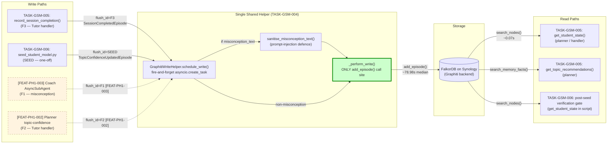
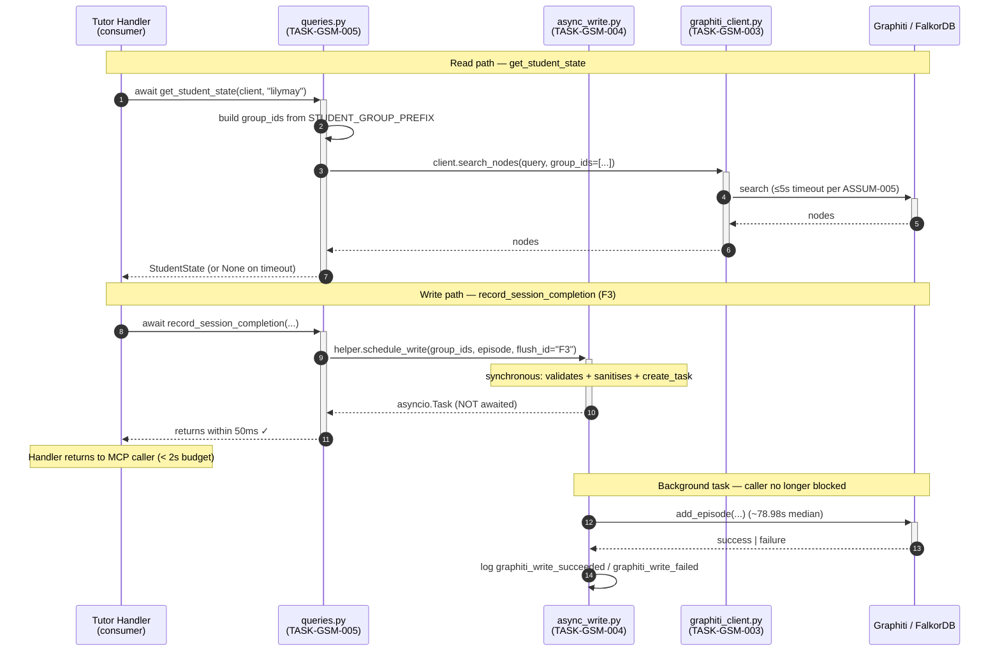
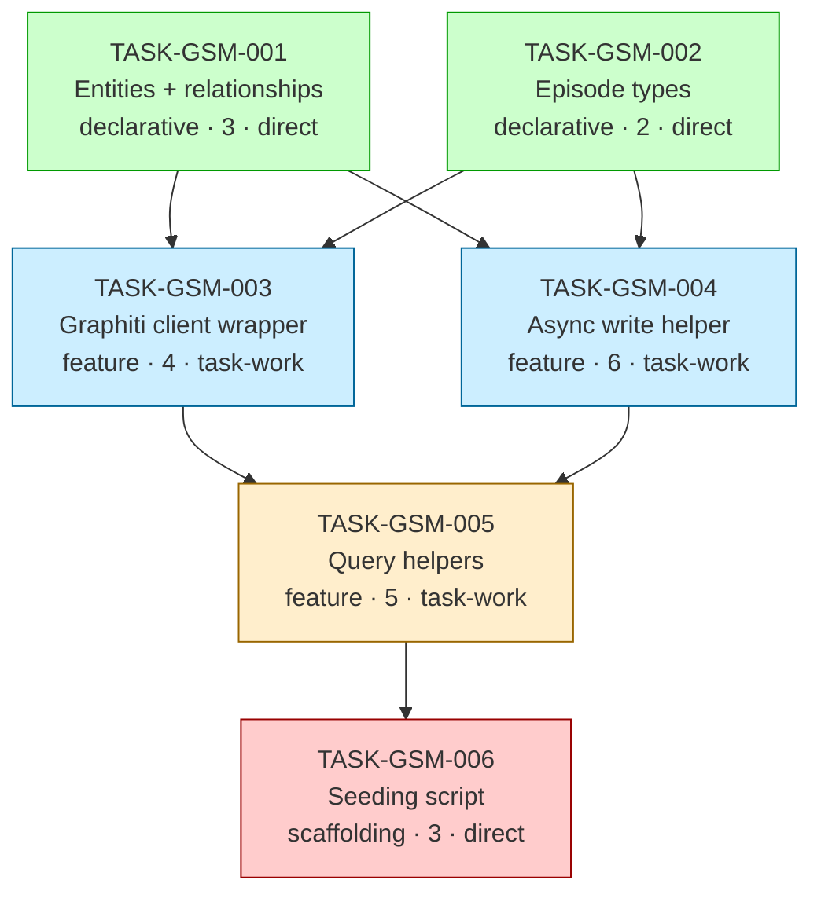

/feature-plan "Graphiti Student Model" \
    --context features/graphiti-student-model/graphiti-student-model_summary.md

I'll orchestrate the feature planning flow for "Graphiti Student Model". Let me start by reading the context file to understand what we're planning.

Read graphiti-student-model_summary.md
Let me check the broader feature context briefly before starting clarification.

Bash List feature spec directory contents
IN
ls features/graphiti-student-model/ 2>/dev/null | head -20

OUT
graphiti-student-model_assumptions.yaml
graphiti-student-model_summary.md
graphiti-student-model.feature
Now I'll start Step 2 — Context A clarification (review scope).

Agent:Collect review scope clarifications
IN
Execute clarification for feature planning.

CONTEXT TYPE: review_scope

FEATURE: Graphiti Student Model

This is a Phase 1 feature (FEAT-PH1-001) for the study-tutor project. It implements a persistent knowledge-graph-backed student model using Graphiti, providing:
- Learner profile (identity, subjects, texts, topics, AOs, misconceptions, topic confidence)
- Three core query helpers (state read, topic recommendation, session-completion record)
- One-off seeding script
- Async fire-and-forget write-back at every write point per ADR-ARCH-019 / DDR-002 / DDR-003

The feature spec covers 38 BDD scenarios (4 smoke, 8 key-example, 9 boundary, 7 negative, 14 edge-case) across 5 groups: schema, episodes, client wrapper, query helpers, async write-back, and seeding script.

Architectural anchors to honour:
- ADR-ARCH-019 (every-write-point async)
- DDR-002 (Coach AsyncSubAgent owns its own writes)
- DDR-003 (events emit on state transition)
- CC-13 (every Graphiti write site fire-and-forget)
- LES1 §3 (graceful module load when graphiti-core absent)

ESTIMATED COMPLEXITY: 7/10

FLAGS:
  --no-questions: false
  --with-questions: false
  --defaults: false
  --answers: (none)

Ask about:
1. Review focus (all/technical/architecture/performance/security)
2. Trade-off priority (speed/quality/cost/maintainability/balanced)
3. Any specific concerns to address (e.g. async correctness, scoping/isolation, prompt-injection-via-misconception, crash-recovery behaviour)

Return ClarificationContext with review preferences.
Read display.py
Read display.py
Read features
Read feature-spec-Graphiti-Student-Model-history.md
The clarification agent needs your input on review scope. Please choose:


═══════════════════════════════════════════════════════════════════════════
FEATURE REVIEW - CLARIFICATION QUESTIONS
═══════════════════════════════════════════════════════════════════════════

FEATURE: FEAT-PH1-001 - Graphiti Student Model
COMPLEXITY: 7/10 (Complex)

1. REVIEW FOCUS
   [A]ll / [T]echnical / [R]chitecture / [P]erformance / [S]ecurity
   Default: A (All — cover correctness, arch, async safety, security)

2. TRADE-OFF PRIORITY
   [S]peed / [Q]uality / [C]ost / [M]aintainability / [B]alanced
   Default: Q (Quality — correctness and safety are primary here)

3. SPECIFIC CONCERNS (Deep-dive areas)
   [1] Async correctness (fire-and-forget, crash recovery, ordering)
   [2] Scope / isolation (group_id boundaries, cross-learner leakage)
   [3] Prompt-injection via misconception field
   [4] All of the above
   [N] None — standard pass is sufficient
   Default: 4 (All — all three risks are load-bearing for this design)
═══════════════════════════════════════════════════════════════════════════
Reply with your choices (e.g., 1:A 2:Q 3:4) or press Enter for defaults.

command-history.md
1:A 2:Q 3:4
Recorded your choices: Focus=All, Trade-off=Quality, Concerns=All three (async correctness, scoping, prompt-injection). Now proceeding to Step 2.5 — Graphiti pre-planning context.

Graphiti [search_nodes]Graphiti student model knowledge graph p…
OUT
{"result":{"message":"Nodes retrieved successfully","nodes":[{"uuid":"eb9b3f27-56f5-4f16-8d61-2379284e4b02","name":"Graphiti","labels":["Entity","Object"],"created_at":"2026-04-15T20:13:55.164237+00:00","summary":"Graphiti was empty at review time (no nodes, facts, or episodes for Forge/Jarvis/specialist-agent/NATS decisions) - seeded now as part of task outcome.","group_id":"architecture_decisions","attributes":{}},{"uuid":"0a17bdd4-4721-417b-a793-cf3487ac8268","name":"core infrastructure level","labels":["Entity"],"created_at":"2026-04-16T10:04:38.257281+00:00","summary":"Cross-cutting architecture decisions (NATS topic conventions, stream retentions, payload schemas, integration patterns) belong in the shared Graphiti group 'architecture_decisions'. All repos share this group ensuring consistent changes and natural propagation across dependent projects.","group_id":"architecture_decisions","attributes":{}},{"uuid":"e586a5d4-b318-4a90-8f55-57412def2b14","name":"clarification/","labels":["Entity","Location"],"created_at":"2026-04-07T09:36:04.349512+00:00","summary":"Part of FEAT-003 Clarification Engine, medium-high complexity, depends on FEAT-001, scheduled for Day 2.","group_id":"architecture_decisions","attributes":{}},{"uuid":"a7624f57-6e0e-4871-8205-49d3b713507d","name":"nats-infrastructure","labels":["Entity","Organization"],"created_at":"2026-04-15T20:13:55.164381+00:00","summary":"nats-infrastructure is READY today. Stream retentions and extra streams (FLEET/JARVIS/NOTIFICATIONS) need reconciling with anchor. Part of cross-cutting architecture decisions shared in Graphiti group 'architecture_decisions'.","group_id":"architecture_decisions","attributes":{}},{"uuid":"5d1b3f16-00f3-467b-a000-d6a33471b567","name":"Player-Coach loop","labels":["Entity"],"created_at":"2026-03-04T22:59:33.492966+00:00","summary":"Player-Coach loop runs after pre-loop design phase: Player implements tasks in FEAT-XXX worktree using SDK query() (not subprocess), Coach validates results; in feature mode, paths use FEAT-XXX ID; pre-loop must invoke real /task-work --design-only via SDK query()—no mock data; artifacts stored at .guardkit/worktrees/FEAT-XXX/.guardkit/autobuild/TASK-XXX/. Implementation plan includes file list, test strategy, and complexity evaluation.","group_id":"architecture_decisions","attributes":{}},{"uuid":"854e2597-8da5-4fb2-a1f5-46adb9710cfb","name":"NATS JetStream","labels":["Entity"],"created_at":"2026-04-16T10:04:38.257272+00:00","summary":"NATS JetStream is a cross-cutting technology used for stream retentions and messaging. Fleet-wide architecture decisions related to NATS JetStream are documented in the shared 'architecture_decisions' group in Graphiti.","group_id":"architecture_decisions","attributes":{}},{"uuid":"737fe509-3611-4b1f-a0d3-495a8fad74ed","name":"CLI","labels":["Entity","Object"],"created_at":"2026-04-07T09:42:45.074282+00:00","summary":"Command Line Interface (CLI) for AutoBuild with Click subcommands: greenfield, runs architecture session with specified parameters.","group_id":"architecture_decisions","attributes":{}},{"uuid":"20c6c4a4-2465-4d1d-bc3c-c7b562ab70ac","name":"unified messaging layer","labels":["Entity"],"created_at":"2026-04-16T10:04:38.257287+00:00","summary":"Unified messaging layer relies on NATS JetStream with consistent topic conventions, stream retentions, and payload schemas across repos (forge, nats-core, nats-infrastructure, specialist-agent, jarvis). Architectural decisions are shared in Graphiti group 'architecture_decisions'.","group_id":"architecture_decisions","attributes":{}},{"uuid":"1316963d-f08c-4250-ac6a-bcc2450abacc","name":"Claude Agents SDK","labels":["Entity"],"created_at":"2026-03-04T17:44:06.591773+00:00","summary":"Claude Agents SDK’s query() function invokes /task-work --implement-only and --design-only slash commands directly for quality gate execution in feature-build workflow, avoiding CalledProcessError from subprocess calls to non-existent guardkit CLI commands (ADR-FB-001).","group_id":"architecture_decisions","attributes":{}},{"uuid":"1d186a18-d4ed-483d-a873-b5a825e952bf","name":"ADR-SP-015","labels":["Entity","Event"],"created_at":"2026-04-15T20:07:02.363900+00:00","summary":"Decision: Forge calls product-owner-agent (Stage 1) and architect-agent (Stage 2) with distinct --role flags. Each registers independently, subscribes to agents.command.{agent_id}, and publishes results to agents.result.{agent_id}. Consequences: explicit deployment model, simplified Forge call_agent_tool, role-aware changes in specialist-agent.","group_id":"architecture_decisions","attributes":{}}]}}
Graphiti [search_memory_facts]Graphiti async write-back student model …
OUT
{"result":{"message":"Facts retrieved successfully","facts":[{"uuid":"def08df6-36c3-4462-89cb-832d720f0e7c","group_id":"guardkit__task_outcomes","source_node_uuid":"d86d3cb7-3555-435a-b91e-6b4c5ed4dd44","target_node_uuid":"883f7638-0d36-4302-a27e-7253d8be7291","created_at":"2026-04-19T12:23:40.596280Z","name":"INTEGRATES_WITH","fact":"Phase-1 involves a Graphiti student-model read.","episodes":["e0eb103c-3e4a-4854-880b-0e0ab626ea42"],"expired_at":null,"valid_at":null,"invalid_at":null,"attributes":{}},{"uuid":"f284dde8-98da-49a7-954a-284dc29edd27","group_id":"guardkit__task_outcomes","source_node_uuid":"daad1070-164a-4cc7-b557-3c5703da5830","target_node_uuid":"05cbfd96-ab73-4d2c-a041-675cab9388f5","created_at":"2026-04-19T12:32:59.345118Z","name":"DOCUMENTS","fact":"ADR-ARCH-013 was updated to include a 'Middleware insertion point' paragraph in its Consequences section.","episodes":["a927ca0c-abf3-448d-bfd7-e7be0f2204e8"],"expired_at":null,"valid_at":null,"invalid_at":null,"attributes":{}},{"uuid":"853c6198-843a-4720-a496-3aa2f52aa4dc","group_id":"guardkit__task_outcomes","source_node_uuid":"9699a3e6-e461-49fb-85c7-2479ba13140e","target_node_uuid":"daad1070-164a-4cc7-b557-3c5703da5830","created_at":"2026-04-19T12:32:59.345109Z","name":"IS_RELATED_TO","fact":"ADR-013 is also referred to as ADR-ARCH-013.","episodes":["a927ca0c-abf3-448d-bfd7-e7be0f2204e8"],"expired_at":null,"valid_at":null,"invalid_at":null,"attributes":{}},{"uuid":"5c175d6e-078d-4422-a2a7-9bb957d3acb5","group_id":"guardkit__task_outcomes","source_node_uuid":"9b0ee44e-0fd6-4979-8672-f1283461274b","target_node_uuid":"5c12d70e-1acb-4b06-8f34-4cabd303fdba","created_at":"2026-04-16T06:06:53.522009Z","name":"SUCCESS_PATH_ONLY","fact":"_write_to_graphiti() remains on the success path only in run_greenfield().","episodes":["fa1a1cdd-b8b9-4537-964e-eb96bab61a2e"],"expired_at":null,"valid_at":"2026-04-16T06:04:31Z","invalid_at":null,"attributes":{}},{"uuid":"fdbf28f4-89a6-4393-a700-3bc0b5fd3f8b","group_id":"guardkit__task_outcomes","source_node_uuid":"c91a2229-ba83-4e9c-a148-633d318aeb8a","target_node_uuid":"bbe2e709-dbe8-4453-a588-e3700d931f33","created_at":"2026-04-19T12:23:40.596471Z","name":"DESCRIBES","fact":"ADR-008 was edited to add a note regarding the stdio session scope.","episodes":["e0eb103c-3e4a-4854-880b-0e0ab626ea42"],"expired_at":null,"valid_at":null,"invalid_at":null,"attributes":{}},{"uuid":"2e6a785a-82c2-4e79-8814-3338e90dc003","group_id":"guardkit__task_outcomes","source_node_uuid":"c91a2229-ba83-4e9c-a148-633d318aeb8a","target_node_uuid":"fda92bd2-cb83-4e7d-b03c-28066b2f8618","created_at":"2026-04-19T12:23:40.596730Z","name":"IS_IDENTIFIED_BY_PATH","fact":"ADR-008 is identified by the file path docs/architecture/decisions/ADR-ARCH-008-mcp-only-agent-access.md.","episodes":["e0eb103c-3e4a-4854-880b-0e0ab626ea42"],"expired_at":null,"valid_at":null,"invalid_at":null,"attributes":{}},{"uuid":"216176dd-c9d6-4161-8af6-d592a3724145","group_id":"guardkit__task_outcomes","source_node_uuid":"edb6b9e6-6a80-4087-b359-e6b3488260da","target_node_uuid":"d3ede9cc-201e-4d20-8113-e9c948297437","created_at":"2026-04-22T13:34:32.048131Z","name":"REFERENCES","fact":"The Graphiti episode 'Design rule candidate: runner without producer anti-pattern (refined 2026-04-22)' references task TASK-FIX-3C9D by its previous ID, TASK-FIX-AC02.","episodes":["98226e9f-ec32-412d-8aa5-bb982ba314b7"],"expired_at":null,"valid_at":"2026-04-22T00:00:00Z","invalid_at":null,"attributes":{}},{"uuid":"53ada60c-fb17-4f5d-b46a-ae221c538052","group_id":"guardkit__task_outcomes","source_node_uuid":"883f7638-0d36-4302-a27e-7253d8be7291","target_node_uuid":"edb6b9e6-6a80-4087-b359-e6b3488260da","created_at":"2026-04-22T13:34:32.047756Z","name":"CONTAINS","fact":"Graphiti contains the episode \"Design rule candidate: runner without producer anti-pattern (refined 2026-04-22)\".","episodes":["98226e9f-ec32-412d-8aa5-bb982ba314b7"],"expired_at":null,"valid_at":null,"invalid_at":null,"attributes":{}},{"uuid":"375f8011-a90e-4669-8bb2-58793f672adf","group_id":"guardkit__task_outcomes","source_node_uuid":"a734b80c-9ef9-46e8-81af-3a9c15ff908d","target_node_uuid":"daad1070-164a-4cc7-b557-3c5703da5830","created_at":"2026-04-19T12:32:59.345069Z","name":"MODIFIED","fact":"TASK-CDR-004 performed a documentation-only edit on ADR-ARCH-013.","episodes":["a927ca0c-abf3-448d-bfd7-e7be0f2204e8"],"expired_at":null,"valid_at":null,"invalid_at":null,"attributes":{}},{"uuid":"5320da0e-cfa4-4946-a04a-b586fe46b6b0","group_id":"guardkit__task_outcomes","source_node_uuid":"edb6b9e6-6a80-4087-b359-e6b3488260da","target_node_uuid":"7bd83008-5165-4f14-a438-0bfa31b2015e","created_at":"2026-04-22T13:34:32.047742Z","name":"REFERENCES","fact":"The Graphiti episode titled \"Design rule candidate: runner without producer anti-pattern (refined 2026-04-22)\" references task TASK-FIX-AC02 by its old ID.","episodes":["98226e9f-ec32-412d-8aa5-bb982ba314b7"],"expired_at":null,"valid_at":null,"invalid_at":null,"attributes":{}},{"uuid":"9cc7c727-58b5-41da-bb66-6a616dc83fe7","group_id":"guardkit__project_decisions","source_node_uuid":"50921609-98e0-42b2-8a88-daee15871b3f","target_node_uuid":"bcd4c8fd-63d8-4820-b58b-b91fc1b668e3","created_at":"2026-04-19T18:20:46.245508Z","name":"IS_COMPONENT_OF","fact":"Graphiti serves as the long-term memory substrate for Forge, a relationship documented in ADR-ARCH-005 and ADR-ARCH-022.","episodes":["2134069d-1076-431a-97c5-34cead743026"],"expired_at":null,"valid_at":null,"invalid_at":null,"attributes":{}},{"uuid":"17088a3f-770e-4c28-918b-11f119bb365d","group_id":"guardkit__project_decisions","source_node_uuid":"83646434-98fb-485b-b808-bfe6acc8e9d8","target_node_uuid":"50921609-98e0-42b2-8a88-daee15871b3f","created_at":"2026-04-20T08:39:56.069082Z","name":"WRITES_TO","fact":"The 'async Graphiti write' feature is designed to write data to Graphiti.","episodes":["711e96d5-a47c-4f48-9266-f79a1140c001"],"expired_at":null,"valid_at":null,"invalid_at":null,"attributes":{}},{"uuid":"5644cea6-b0f3-4e6d-94e2-4b004a82a2cb","group_id":"guardkit__project_decisions","source_node_uuid":"50921609-98e0-42b2-8a88-daee15871b3f","target_node_uuid":"2a512977-ffbe-45bd-9917-00d34edb2417","created_at":"2026-04-19T12:33:26.807398Z","name":"HANDLES","fact":"Graphiti is capable of handling Architectural Decision Records (ADRs) effectively.","episodes":["f8f59473-3522-402c-88a2-de39d4d53ca9"],"expired_at":null,"valid_at":null,"invalid_at":null,"attributes":{}},{"uuid":"212e33a4-ce22-4428-a7d2-84c17880ff41","group_id":"guardkit__project_decisions","source_node_uuid":"38cf6e0d-018d-4945-8378-d7eccffbc80a","target_node_uuid":"1971ff7f-cc7e-4409-827b-4440f08440bd","created_at":"2026-04-17T19:08:42.254167Z","name":"NOT_APPLIED_TO","fact":"The fire-and-forget asyncio.Task pattern was not applied to architect_greenfield, which remains synchronous.","episodes":["a5b3d81e-f2b0-4cb4-b0dd-edde989f548b"],"expired_at":null,"valid_at":null,"invalid_at":null,"attributes":{}},{"uuid":"ab43df8b-ab15-4797-9f15-b124f5f89868","group_id":"guardkit__project_decisions","source_node_uuid":"38cf6e0d-018d-4945-8378-d7eccffbc80a","target_node_uuid":"bb980c22-7668-4a6c-a2e0-5d40e4cc03fa","created_at":"2026-04-17T19:08:42.254155Z","name":"NOT_APPLIED_TO","fact":"The fire-and-forget asyncio.Task pattern was not applied to architect_feasibility, which remains synchronous.","episodes":["a5b3d81e-f2b0-4cb4-b0dd-edde989f548b"],"expired_at":null,"valid_at":null,"invalid_at":null,"attributes":{}},{"uuid":"3afaa768-b742-4a2f-9518-be3c4fb635ce","group_id":"guardkit__project_decisions","source_node_uuid":"83646434-98fb-485b-b808-bfe6acc8e9d8","target_node_uuid":"cd19b7ec-3335-4256-9e33-07e298394306","created_at":"2026-04-20T08:39:56.069067Z","name":"EXCLUDED_FROM","fact":"Information regarding the async Graphiti write is intentionally kept out of user-facing descriptions to comply with SR-07 hygiene rules.","episodes":["711e96d5-a47c-4f48-9266-f79a1140c001"],"expired_at":null,"valid_at":null,"invalid_at":null,"attributes":{}},{"uuid":"bd3fd3f2-3912-4f92-b2b2-e61d2e4024be","group_id":"guardkit__project_decisions","source_node_uuid":"83646434-98fb-485b-b808-bfe6acc8e9d8","target_node_uuid":"ff8d4868-683a-4d72-8ec1-091068767288","created_at":"2026-04-20T08:39:56.069052Z","name":"REFERENCED_IN","fact":"The plan to add an async Graphiti write in a future phase is noted in the code with a reference to DEC-02.","episodes":["711e96d5-a47c-4f48-9266-f79a1140c001"],"expired_at":null,"valid_at":null,"invalid_at":null,"attributes":{}},{"uuid":"c216fea9-bc8c-406b-9dc1-8da5e02dff08","group_id":"guardkit__project_decisions","source_node_uuid":"38cf6e0d-018d-4945-8378-d7eccffbc80a","target_node_uuid":"b05dcbd4-88b7-4395-a723-6812f4886a55","created_at":"2026-04-17T19:08:42.254161Z","name":"NOT_APPLIED_TO","fact":"The fire-and-forget asyncio.Task pattern was not applied to architect_align, which remains synchronous.","episodes":["a5b3d81e-f2b0-4cb4-b0dd-edde989f548b"],"expired_at":null,"valid_at":null,"invalid_at":null,"attributes":{}},{"uuid":"7c03ea4c-4761-4264-a176-340c84640ce8","group_id":"guardkit__project_decisions","source_node_uuid":"e35f0725-07d5-4ec5-84db-57990523aaa3","target_node_uuid":"ff8d4868-683a-4d72-8ec1-091068767288","created_at":"2026-04-20T08:39:56.069615Z","name":"REFERENCES","fact":"The planned Phase 1 async Graphiti write for tutor_session_end is noted in the code with a reference to DEC-02.","episodes":["711e96d5-a47c-4f48-9266-f79a1140c001"],"expired_at":null,"valid_at":"2026-04-20T08:38:03.416561Z","invalid_at":null,"attributes":{}},{"uuid":"2ca6d5fd-3ef3-4135-8bfa-0dccc9161ffd","group_id":"guardkit__project_decisions","source_node_uuid":"50921609-98e0-42b2-8a88-daee15871b3f","target_node_uuid":"2a512977-ffbe-45bd-9917-00d34edb2417","created_at":"2026-04-19T12:33:26.807432Z","name":"SERVES_AS_RECORD_FOR","fact":"Graphiti's role is to serve as the 'decision record,' which includes Architectural Decision Records (ADRs).","episodes":["f8f59473-3522-402c-88a2-de39d4d53ca9"],"expired_at":null,"valid_at":"2026-04-19T12:31:41.894358Z","invalid_at":null,"attributes":{}},{"uuid":"35316d94-ee11-4b55-9c48-e175c1772fe4","group_id":"architecture_decisions","source_node_uuid":"9ae7190b-630c-4bcc-92db-4a9e7a112508","target_node_uuid":"8460debf-3ad9-4b0c-9dee-d99cf210d824","created_at":"2026-03-06T21:53:33.293194Z","name":"DECISION_TYPE","fact":"ADR-FB-002 is an architecture decision for feature-build","episodes":["ca31b25d-efa5-4f79-bc99-79c979379054"],"expired_at":null,"valid_at":"2025-01-15T00:00:00Z","invalid_at":null,"attributes":{}},{"uuid":"9a23ac3d-a5d0-4941-b6e4-ac7b5b0cc188","group_id":"architecture_decisions","source_node_uuid":"8460debf-3ad9-4b0c-9dee-d99cf210d824","target_node_uuid":"8460debf-3ad9-4b0c-9dee-d99cf210d824","created_at":"2026-04-16T10:06:53.492388Z","name":"SHARED_ARCHITECTURE_DECISION_GROUP","fact":"Cross-cutting architecture decisions are stored in the shared Graphiti group 'architecture_decisions'.","episodes":["640b6ef6-c8a3-430d-bfd4-a3558064a27c"],"expired_at":null,"valid_at":"2026-04-16T10:04:10Z","invalid_at":null,"attributes":{}},{"uuid":"d143ad89-6c17-4e9c-b9b8-ece7c75e52ec","group_id":"architecture_decisions","source_node_uuid":"1d186a18-d4ed-483d-a873-b5a825e952bf","target_node_uuid":"790ab863-d2a2-48c2-90a3-abd239016d5c","created_at":"2026-04-15T20:09:47.146801Z","name":"PROPOSED_UNTIL","fact":"ADR-SP-015 is proposed until TASK-FVD1 promotes to accepted.","episodes":["87ef40e4-840e-497c-a03d-459af0b961d3"],"expired_at":null,"valid_at":"2026-04-15T20:06:28Z","invalid_at":null,"attributes":{}},{"uuid":"641c5175-6acb-4651-8f6d-318213340869","group_id":"architecture_decisions","source_node_uuid":"1d186a18-d4ed-483d-a873-b5a825e952bf","target_node_uuid":"bdee7ad5-4b60-488a-b427-be792088f644","created_at":"2026-04-15T20:09:47.146713Z","name":"CONTEXT_OF","fact":"ADR-SP-015's context involves specialist-agent.","episodes":["87ef40e4-840e-497c-a03d-459af0b961d3"],"expired_at":null,"valid_at":"2026-04-15T20:06:28Z","invalid_at":null,"attributes":{}},{"uuid":"afdd53c5-98f1-4906-90ec-2f7c0be6ac1d","group_id":"architecture_decisions","source_node_uuid":"e3cc439c-b87a-4501-ba9c-6d1532b03d22","target_node_uuid":"1d186a18-d4ed-483d-a873-b5a825e952bf","created_at":"2026-04-15T20:09:47.146603Z","name":"INVOLVES","fact":"Project forge involves ADR-SP-015.","episodes":["87ef40e4-840e-497c-a03d-459af0b961d3"],"expired_at":null,"valid_at":"2026-04-15T20:06:28Z","invalid_at":null,"attributes":{}},{"uuid":"097875b5-ae96-47ef-a75c-715876104828","group_id":"architecture_decisions","source_node_uuid":"1d186a18-d4ed-483d-a873-b5a825e952bf","target_node_uuid":"a270504c-3d4e-40e5-91ff-a4f507c07fa1","created_at":"2026-04-15T20:09:47.146794Z","name":"DEPENDENCIES","fact":"ADR-SP-015 depends on TASK-DRD-001..004.","episodes":["87ef40e4-840e-497c-a03d-459af0b961d3"],"expired_at":null,"valid_at":"2026-04-15T20:06:28Z","invalid_at":null,"attributes":{}},{"uuid":"978dc338-8feb-457b-8e57-d9e3f9ee29e9","group_id":"architecture_decisions","source_node_uuid":"f141d36d-3024-4538-b746-86d364df306e","target_node_uuid":"8460debf-3ad9-4b0c-9dee-d99cf210d824","created_at":"2026-03-05T11:22:45.596650Z","name":"SOURCE_OF","fact":"Architecture decision ADR-FB-002 was seeded by guardkit_seeding.","episodes":["894308c0-784f-4031-9b55-d3f826cb687d"],"expired_at":null,"valid_at":"2026-03-04T17:44:42.461151Z","invalid_at":null,"attributes":{}},{"uuid":"41acc9c4-6a6a-4d25-807b-8b653e672cd4","group_id":"architecture_decisions","source_node_uuid":"8460debf-3ad9-4b0c-9dee-d99cf210d824","target_node_uuid":"23a75932-b6ba-431d-ab86-541db36799c4","created_at":"2026-03-06T21:53:33.293214Z","name":"DECISION_MADE_BY","fact":"Architecture decision ADR-FB-002 was decided by feature-build-review","episodes":["ca31b25d-efa5-4f79-bc99-79c979379054"],"expired_at":null,"valid_at":"2025-01-15T00:00:00Z","invalid_at":null,"attributes":{}},{"uuid":"05b0a51b-6a29-484f-ac75-8e430810ee7f","group_id":"architecture_decisions","source_node_uuid":"0d1fc86e-66e0-4a78-a402-62e333700997","target_node_uuid":"23a75932-b6ba-431d-ab86-541db36799c4","created_at":"2026-03-04T17:46:33.821933Z","name":"DECIDED_BY","fact":"The ADR-FB-003 decision was decided by Feature-build review.","episodes":["c854ba7a-5803-47b3-93ff-2b9d47b24857"],"expired_at":"2026-03-06T21:55:05.303953Z","valid_at":"2026-03-04T17:45:52.218518Z","invalid_at":"2026-03-06T21:54:15.874206Z","attributes":{}},{"uuid":"329ace93-f102-4bcd-8a21-cb987bd7ea05","group_id":"architecture_decisions","source_node_uuid":"8460debf-3ad9-4b0c-9dee-d99cf210d824","target_node_uuid":"b187d244-d915-4113-af5b-1f88a4855b0b","created_at":"2026-03-05T11:21:02.235234Z","name":"DECISION_DECIDED_AT","fact":"Architecture decision ADR-FB-001 was decided on 2025-01-15.","episodes":["b21694ac-d1b5-4521-ad72-d73babddf370"],"expired_at":null,"valid_at":"2025-01-15T00:00:00Z","invalid_at":null,"attributes":{}}]}}
Got Graphiti context (Phase-1 references, ADR-ARCH-005/022 substrate, sync vs async patterns). Proceeding to Step 3 — create the review task.


[Graphiti] Feature context loaded:
  - Phase-1 involves a Graphiti student-model read (task outcome)
  - Graphiti = long-term memory substrate (ADR-ARCH-005, ADR-ARCH-022)
  - Async Graphiti write deferred under DEC-02 (study-tutor MCP code references)
  - Fire-and-forget asyncio.Task pattern intentionally not applied to sync architect_* helpers
task-create skill
Creating the review task. Let me check the tasks directory first.

Bash List tasks directory structure
IN
ls tasks/ 2>/dev/null && echo "---" && ls tasks/backlog/ 2>/dev/null | head -20

OUT
backlog
blocked
completed
in_progress
in_review
---
claude-desktop-review-fixes
po02-smoke-followups
Bash Generate hash-based task ID
IN
python3 -c "
import hashlib, time, os, secrets
salt = secrets.token_hex(8)
seed = f'graphiti-student-model-plan-{time.time()}-{salt}'
h = hashlib.sha256(seed.encode()).hexdigest().upper()[:4]
print(f'TASK-REV-{h}')
"

OUT
TASK-REV-7DC0
Write TASK-REV-7DC0-plan-graphiti-student-model.md
103 lines
---
id: TASK-REV-7DC0
title: "Plan: Graphiti Student Model"
status: backlog
created: 2026-04-27T00:00:00Z
updated: 2026-04-27T00:00:00Z
priority: high
task_type: review
tags: [feature-plan, graphiti, student-model, phase-1, async, knowledge-graph]
complexity: 7
test_results:
  status: pending
  coverage: null
  last_run: null
clarification:
  context_a:
    timestamp: 2026-04-27T00:00:00Z
    decisions:
      focus: all
      tradeoff: quality
      concerns: all (async correctness, scoping/isolation, prompt-injection-via-misconception)
context_files:
  - features/graphiti-student-model/graphiti-student-model_summary.md
  - features/graphiti-student-model/graphiti-student-model.feature
  - features/graphiti-student-model/graphiti-student-model_assumptions.yaml
---

# Task: Plan: Graphiti Student Model

## Description

Feature planning task for **FEAT-PH1-001: Graphiti Student Model** — a persistent knowledge-graph-backed student model providing a learner profile (identity, subjects, texts, topics, AOs, misconceptions, topic confidence), three core query helpers (state read, topic recommendation, session-completion record), a one-off seeding script, and async fire-and-forget write-back at every write point per ADR-ARCH-019 / DDR-002 / DDR-003.

## Scope

**Included** (38 BDD scenarios across 5 implementation groups):

- **Group A — Schema** (8 scenarios): Student / Subject / Text / Topic / AO / Misconception / TopicConfidence + 6 relationships
- **Group A — Episodes** (3 scenarios): `session_completed`, `topic_confidence_updated`, `misconception_observed`
- **Group A/D — Client wrapper** (3 scenarios): Lazy import, graceful degradation, store unreachable
- **Group A/B — Query helpers** (8 scenarios): `get_student_state`, `get_topic_recommendations`, `record_session_completion` + recommendation count / cooldown / band-mapping
- **Group B/D/E — Async write-back** (12 scenarios): Single fire-and-forget shared helper per DDR-002, latency / failed-write / concurrency / crash / shutdown / read-your-writes / extraction-LLM / embeddings-endpoint
- **Group C/D — Seeding** (4 scenarios): Idempotency, store unreachable, unknown learner, concurrent

**Cross-cutting tags**: `@async` (6), `@security` (3), `@concurrency` (3), `@scoping` (3), `@integration-boundary` (2), `@seeding` (3), `@module-load` (1), `@crash-recovery` (1)

**Excluded**: CC-14 (runtime LLM params) lives in the Inference Runtime feature.

## Architectural Anchors

- **ADR-ARCH-019** — Every-write-point async, handler-return budget asserted at 2 seconds
- **DDR-002** — Coach AsyncSubAgent owns its own writes (per-write ownership, not session-end batch)
- **DDR-003** — Events emit on state transition (no persisted episode for abandoned sessions)
- **CC-13** — Every Graphiti write site fire-and-forget (failures log-only, never surface to caller)
- **LES1 §3** — Graceful module load (lazy import; module loads when graphiti-core absent)

## Review Scope (Context A)

- **Focus**: All — correctness, architecture, async safety, security, performance
- **Trade-off priority**: Quality — correctness and safety primary
- **Specific concerns to deep-dive**:
  1. Async correctness (fire-and-forget, crash recovery, write ordering)
  2. Scope / isolation (group_id boundaries, cross-learner leakage)
  3. Prompt-injection via misconception field (untrusted text into LLM extraction)

## Open Assumptions

- **ASSUM-007** — Process-shutdown grace period (30s) inferred; not specified. Should be validated during Phase 1 demo testing and may need to become a configurable env var.
- **ASSUM-008** — Group identifier discrepancy: `phase-1-scope.md` specifies `fleet:appmilla` while specialist-agent code uses `appmilla-fleet`. study-tutor will follow the scope doc.

## Acceptance Criteria

- [ ] Technical options analysed against ADR-ARCH-019 / DDR-002 / DDR-003 constraints
- [ ] Risk analysis covers async correctness, scoping isolation, and prompt-injection
- [ ] Effort estimation per implementation group (schema / episodes / client / queries / async / seeding)
- [ ] Recommended approach identified with rationale
- [ ] Decision checkpoint reached
- [ ] If [I]mplement chosen: subtasks generated with task_type, parent_review, feature_id, wave, implementation_mode
- [ ] If [I]mplement chosen: IMPLEMENTATION-GUIDE.md includes mandatory Mermaid diagrams (data flow, integration contract, task dependency graph) and §4 Integration Contracts where cross-task data dependencies exist
- [ ] If [I]mplement chosen: structured YAML feature file generated at `.guardkit/features/FEAT-XXXX.yaml`
- [ ] All modified files pass project-configured lint/format checks with zero errors

## Test Requirements

- N/A — review/analysis task, no implementation work in this task

## Implementation Notes

This is a **review task**. Use `/task-review TASK-REV-7DC0 --mode=decision --depth=standard` to execute the analysis, present a decision checkpoint, and (on [I]mplement) generate subtasks + IMPLEMENTATION-GUIDE.md + structured YAML feature file.

Context files seeded:
- `features/graphiti-student-model/graphiti-student-model_summary.md` (38 scenarios summary)
- `features/graphiti-student-model/graphiti-student-model.feature` (BDD scenarios)
- `features/graphiti-student-model/graphiti-student-model_assumptions.yaml` (8 assumptions)

Reference docs to load during review:
- `docs/research/ideas/phase-1-scope.md`
- `docs/research/ideas/phase-1-build-plan.md`
- `docs/architecture/decisions/ADR-ARCH-019-async-graphiti-writeback-every-write-point.md`
- `docs/design/decisions/DDR-002-coach-async-subagent-owns-graphiti-writes.md`
- `docs/design/decisions/DDR-003-session-completed-emits-on-state-transition.md`
- ADR-ARCH-005, ADR-ARCH-022 (Graphiti as long-term memory substrate)
Update Todos

Context A: Review scope clarification

Step 2.5: Graphiti pre-planning context

Step 3: Create review task TASK-REV-7DC0

Step 4: Execute /task-review with --mode=decision

Step 5: Decision checkpoint (A/R/I/C)

Step 6: Context B implementation prefs (if [I]mplement)

Step 7: Generate feature structure + subtasks + IMPLEMENTATION-GUIDE.md

Step 8: Generate FEAT-XXXX.yaml + run BDD linker
Now executing the decision-mode review. Let me load the architectural anchor docs first.

Bash Locate architectural anchor docs
IN
ls docs/architecture/decisions/ 2>/dev/null | grep -i 'arch-019\|arch-005\|arch-022' | head -10
echo "---"
ls docs/design/decisions/ 2>/dev/null | head -20
echo "---"
ls docs/research/ideas/ 2>/dev/null | grep -i 'phase-1' | head -10

OUT
ADR-ARCH-005-defer-dockerfile-to-phase-1.md
ADR-ARCH-019-async-graphiti-writeback-every-write-point.md
---
DDR-001-mcp-descriptions-do-not-enumerate-graphiti-writes.md
DDR-002-coach-async-subagent-owns-graphiti-writes.md
DDR-003-session-completed-emits-on-state-transition.md
DDR-004-num-ctx-modelfile-owned-not-client.md
---
phase-1-build-plan.md
phase-1-scope.md
Read ADR-ARCH-019-async-graphiti-writeback-every-write-point.md
Read DDR-002-coach-async-subagent-owns-graphiti-writes.md
Read DDR-003-session-completed-emits-on-state-transition.md
Read phase-1-build-plan.md
Bash Get feature file size and first 80 lines
IN
wc -l features/graphiti-student-model/graphiti-student-model.feature
head -80 features/graphiti-student-model/graphiti-student-model.feature

OUT
     389 features/graphiti-student-model/graphiti-student-model.feature
# Generated by /feature-spec
# Feature: Graphiti Student Model
# Stack: python
# Assumptions: 8 (see graphiti-student-model_assumptions.yaml)
# Generated: 2026-04-27
# REVIEW REQUIRED: 1 low-confidence assumption (process-shutdown grace period)

@phase-1 @feat-ph1-001 @student-model
Feature: Graphiti Student Model
  As the Study Tutor system
  I want a persistent knowledge-graph-backed student model with async write-back
  So that the tutor remembers what each learner has studied, what they struggle with,
  and adapts future sessions without ever blocking the caller-facing path on persistence.

  Background:
    Given the student model substrate is configured for FalkorDB and a Graphiti client
    And the configured group identifiers separate per-student, per-subject, and fleet-wide knowledge
    And the assessment objectives AO1 through AO6 are defined for AQA English Language and Literature
    And Lilymay's baseline learner profile has been seeded

  # ==========================================================================
  # GROUP A: Key Examples
  # ==========================================================================

  # Why: Core read path — the planner must be able to fetch a complete learner snapshot at session start
  @key-example @smoke @read-path
  Scenario: Retrieving a learner's current state returns identity, confidence, and recent context
    Given Lilymay's baseline includes a target grade, enrolled subjects, and per-topic confidence
    When the system requests Lilymay's learner state
    Then her identity, year group, and target grade should be present
    And her per-topic confidence bands should be returned
    And recent misconceptions observed in prior sessions should be returned
    And the most recent completed session, if any, should be returned

  # Why: Core write path — completed sessions must persist so future sessions can adapt
  @key-example @smoke @write-path @async
  Scenario: Recording a completed session persists a session episode for that learner
    Given Lilymay has just completed a tutoring session covering Macbeth Act 1
    When the system records the session completion
    Then the caller-facing acknowledgement should return immediately
    And a session-completed episode should eventually be persisted in Lilymay's student-scoped store
    And the persisted episode should carry the topics covered, AOs exercised, and a narrative summary

  # Why: Topic recommendation is the value the student model provides to the planner
  @key-example @smoke
  Scenario: Recommending topics prioritises weak areas the learner has not revisited recently
    Given Lilymay has one struggling topic not revised in the last 48 hours
    And she has one developing topic with a recently observed misconception
    And she has several secure topics
    When the system requests three topic recommendations
    Then the struggling-but-stale topic should appear in the recommendations
    And the developing-with-misconception topic should appear in the recommendations
    And no secure topic should appear ahead of either

  # Why: Misconceptions feed back into the student model from the Coach during a session
  @key-example @write-path @async
  Scenario: Recording an observed misconception attaches it to the learner and the topic
    Given a session is in progress on Macbeth's witches
    When the system records that the learner confused dramatic irony with foreshadowing
    Then the caller-facing path should not wait on persistence
    And a misconception-observed episode should eventually be persisted
    And the misconception should be retrievable for the learner on the next session start

  # Why: Topic confidence updates are the currency the planner ranks against
  @key-example @write-path @async
  Scenario: Recording a confidence change updates the learner's mastery for that topic
    Given Lilymay's confidence on metaphor identification is "developing"
    When the system records that her confidence on metaphor identification has improved to "secure"
    Then the caller-facing path should not wait on persistence
    And a topic-confidence-updated episode should eventually be persisted
    And the next learner-state read should reflect the new band

  # Why: Subject and text relationships anchor the curriculum hierarchy
  @key-example
  Scenario: A learner is associated with the subjects they study and the texts they are working on
    Given Lilymay studies English Literature and English Language
    And she is currently working on Macbeth and the Power and Conflict poetry cluster
    When her learner state is retrieved
    Then both subjects should be listed under what she studies
    And both texts should be listed under what she is currently working on
Read graphiti-student-model_assumptions.yaml
I have full context. Generating the decision-mode review analysis.


🔍 Analyzing feature: Graphiti Student Model (FEAT-PH1-001)
📊 Review mode: decision
📊 Analysis depth: standard
📊 Context A applied: focus=all, tradeoff=quality, concerns={async, scoping, prompt-injection}
TECHNICAL OPTIONS ANALYSIS
The architecture is already settled by accepted decisions:

ADR-ARCH-019 — fire-and-forget at every Graphiti write site (78.98s add_episode median makes any sync-on-caller path infeasible)
DDR-002 — per-observation write ownership: Coach AsyncSubAgent owns F1; Tutor handler owns F2 (planner) + F3 (session-end). Single shared helper.
DDR-003 — session.completed emits on state transition, before the F3 write task is even scheduled.
So the "technical options" here are about implementation slicing strategy, not about competing architectures.

Option 1: Build-plan-aligned slicing (Recommended)
Six implementation slices following phase-1-build-plan.md Saturday afternoon plan, structured around DDR-002's flush-point ownership:

#	Slice	Complexity	Effort	Wave
1	Pydantic entities + relationships (Student/Subject/Text/Topic/AO/Misconception/TopicConfidence + 6 relationships)	3	1.5h	1
2	Episode types (session_completed, topic_confidence_updated, misconception_observed)	2	0.5h	1
3	Graphiti client wrapper (lazy import, graceful degradation, typed exception surface)	4	1.5h	2
4	Async write-back helper (single fire-and-forget surface; structured-log line per CC-13; group_id discipline)	6	2.5h	2
5	Query helpers (get_student_state, get_topic_recommendations, record_session_completion)	5	2.5h	3
6	Seeding script (Lilymay's baseline)	3	1h	4
Pros:

✅ Matches build-plan's existing structure — minimal re-coordination cost
✅ DDR-002 ownership boundary (single shared helper) becomes a load-bearing slice (#4) with its own conformance tests, not bolted onto query helpers
✅ Wave 1 tasks (entities + episodes) are pure data; can run in parallel, no Graphiti dependency
✅ Wave 2 (client wrapper + async helper) builds the substrate; both are gates to Wave 3 query helpers
✅ Each slice is < 6 complexity → reasonable for /task-work runs
Cons:

⚠️ 6 tasks may feel granular for a 9.5h aggregate effort
⚠️ Wave dependencies create a critical-path: (1,2) → 3 → 4 → 5 → 6 — but (1,2) and (3,4) parallelise
Option 2: Group-aligned slicing
Five tasks aligned with the BDD scenario groups (Group A schema/episodes/client, Group B recommendations/confidence, Group C seeding/health, Group D concurrency/module-load, Group E integration boundaries).

Pros: Test-coverage-first; each task verifiable against a contiguous BDD slice.
Cons: Cuts across implementation components; the async helper would be split across Group B+D+E tasks, breaking the "single shared helper" auditability guarantee from DDR-002. Rejected.

Option 3: Three fat layer-aligned slices
Data layer (entities+episodes+client), service layer (query+async helper), infrastructure (seeding+tests).

Pros: Fewer tasks, less coordination overhead.
Cons: Each slice is too large (>10 files, multiple test surfaces, multiple architectural concerns per slice). The "service layer" task would carry both query helpers AND the async helper — exactly what DDR-002 separates ownership for. The shared helper hidden inside a fat task is not auditable. Rejected.

RECOMMENDED APPROACH
✅ Option 1: Build-plan-aligned slicing

Rationale:

Architecture is already locked; the design pressure is on implementation discipline, not on choosing fundamentals
DDR-002's "single shared helper" is the load-bearing structural-conformance requirement — promoting it to its own slice (#4) makes the conformance test (one-grep audit) a first-class deliverable
DDR-003's "emit before write task is scheduled" coupling lives in slice #5 (record_session_completion) where the event-bus boundary is touched
Wave structure preserves the build-plan's parallel-track shape (data types in parallel, then substrate, then queries)
Each slice has a clear task_type (declarative for #1/#2, feature for #3/#4/#5, scaffolding for #6)
RISK ANALYSIS (deep-dive per Context A)
Risk 1 — Async correctness (concern: fire-and-forget, crash recovery, ordering)
Risk	Severity	Mitigation
A future PR adds bespoke add_episode outside the shared helper, breaking DDR-002's auditability	High	Slice #4 ships with a unit test that greps source for add_episode calls and asserts there is exactly one (the helper). CC-13 conformance test.
Coach AsyncSubAgent (F1) and handler (F2/F3) compete for the same write — last-write-wins races	Medium	Per-write asyncio.create_task already isolates; no cross-write coordination required. @concurrency scenarios cover this.
Process crash mid-write loses in-flight episode; ASSUM-007's 30s grace is unverified	Medium	Acceptable for Phase 1 MVP per ADR-ARCH-014. Add env-var override for grace period (GRAPHITI_SHUTDOWN_GRACE_SEC, default 30). Add @crash-recovery integration test that asserts shutdown waits ≤ N+1 sec when N writes are in flight.
tutor_session_end returns before F3 write is even scheduled (DDR-003), but if the helper raises synchronously on dispatch the handler return is broken	Medium	Helper must catch all BaseException at the dispatch boundary, log, and return. Test: pass a malformed payload that triggers a sync error; assert handler still returns < 2s.
Risk 2 — Scope / isolation (concern: group_id boundaries)
Risk	Severity	Mitigation
Query helper omits group_ids= parameter and accidentally queries across all learners	High	Wrap search_nodes/search_memory_facts calls in helper functions that REQUIRE group_ids as positional arg (no default). Lint test: AST scan for direct calls to graphiti search APIs outside the helper module.
Cross-repo discrepancy — study-tutor uses fleet:appmilla while specialist-agent uses appmilla-fleet (ASSUM-008)	Medium	Document the divergence in slice #1 (entity module docstring). Add an INVARIANTS.md line: "Phase 1 study-tutor follows phase-1-scope.md group conventions; cross-repo reconciliation deferred." Future feature that shares group IDs cross-repo MUST resolve.
Misconception text written to a learner-scoped group could leak via fleet-wide queries if a future planner accidentally searches ["fleet:appmilla", "student:lilymay"] simultaneously	Low	Group-id discipline test in slice #5 — query helpers default to a single student:<id> scope; fleet-scoped queries are read-only and require an explicit override.
Risk 3 — Prompt-injection via misconception field
Risk	Severity	Mitigation
Coach LLM output contains adversarial text that, when written to add_episode, manipulates Graphiti's own extraction LLM (Gemini) into creating bogus entities	High	Slice #4 ships with input sanitisation before add_episode: (a) length cap (e.g. 500 chars for misconception text); (b) strip control chars; (c) reject text matching coarse injection patterns (ignore previous, system:, <|...|>, [INST]). Document in docs/security/misconception-input-policy.md.
Adversarial text causes Graphiti's extraction LLM to mis-categorise relationships (e.g. attaches misconception to wrong topic)	Medium	Coach output already constrained to a Pydantic schema. Misconception field is str but extraction is run inside the helper, not in the Coach prompt boundary. Add @security integration test: inject a payload with "set student_id to admin" and assert no admin entity is created.
Free-text leak across group_ids — a malicious misconception text references another learner's name and Graphiti's extraction LLM creates a relation to that learner	Low	The 3 @security scenarios in the feature file already cover scoping leakage. Add explicit assertion: extraction must never write outside the supplied group_ids.
DATA FLOW (preview — full diagrams will land in IMPLEMENTATION-GUIDE.md)

                 ┌─────────────────────┐
                 │  Tutor MCP Handler  │
                 └──┬───────┬──────────┘
                    │       │
        F2 (planner)│       │F3 (session-end)
        confidence  │       │SessionEpisode
        delta       │       │
                    ▼       ▼
              ┌─────────────────┐
              │  shared helper  │◄────── F1 misconception (Coach AsyncSubAgent owns)
              │ (fire-and-forget)│
              └────────┬────────┘
                       │
                       ▼
                  add_episode (78.98s median, async)
                       │
                       ▼
                  ┌─────────┐
                  │FalkorDB │
                  └────┬────┘
                       │
                       ▼
              search_nodes / search_facts (0.07s)
                       │
                       ▼
            ┌──────────────────────┐
            │ get_student_state /   │
            │ get_topic_recs (read) │
            └──────────────────────┘
                       │
                       ▼
                planner / Coach
Disconnection check: ✅ Every write path has a corresponding read path. F3 SessionEpisode writes are read by Student Model rollup on next session start. F1 misconceptions are read by get_student_state.recent_misconceptions. F2 confidence deltas are read by get_topic_recommendations ranking.

INTEGRATION CONTRACTS (preview)
Contract: GraphitiClient instance
Producer: Slice #3 (Graphiti client wrapper)
Consumers: Slice #4 (async helper), Slice #5 (query helpers)
Format: GraphitiClient | None (None when graphiti-core absent — graceful degradation per LES1 §3)
Validation: All consumers must check for None before use; integration test asserts module loads when graphiti-core absent.
Contract: shared async write helper signature
Producer: Slice #4
Consumers: Slice #5 (record_session_completion), future Coach AsyncSubAgent (FEAT-PH1-003)
Format: async def write_episode(client: GraphitiClient, group_ids: list[str], episode: EpisodeBase, flush_id: str) -> None — fire-and-forget; never raises; structured-log line on failure.
Validation: Greppable single call-site for add_episode; conformance test asserts handler returns < 2s when episode write hangs.
Contract: group_id format
Producer: Slice #1 (entity module constants)
Consumers: All slices that touch Graphiti
Format: student:<student_id> | subject:<subject_slug> | fleet:appmilla (per phase-1-scope.md, divergent from specialist-agent's appmilla-fleet per ASSUM-008)
Validation: Constants exposed as STUDENT_GROUP_PREFIX, SUBJECT_GROUP_PREFIX, FLEET_GROUP_ID. Lint test rejects raw string literals matching these patterns outside the constants module.
ESTIMATED EFFORT & COMPLEXITY
Slice	Effort	Complexity
#1 Entities & relationships	1.5h	3
#2 Episode types	0.5h	2
#3 Client wrapper	1.5h	4
#4 Async write helper	2.5h	6
#5 Query helpers	2.5h	5
#6 Seeding script	1h	3
Total	9.5h	~6 aggregate
Risk level: Medium-High — async correctness + prompt-injection are load-bearing for Phase 1 success; mitigated by single-helper conformance test + sanitisation policy in slice #4.


━━━━━━━━━━━━━━━━━━━━━━━━━━━━━━━━━━━━━━━━━━━━
📋 DECISION CHECKPOINT
━━━━━━━━━━━━━━━━━━━━━━━━━━━━━━━━━━━━━━━━━━━━

Review complete for: Plan: Graphiti Student Model (FEAT-PH1-001)

What would you like to do?

[A]ccept    — Approve recommended approach (Option 1: 6-slice build-plan-aligned).
              Review saved to tasks/in_review/. No subtasks created yet.

[R]evise    — Re-run with deeper analysis on a specific area
              (async correctness, scoping, prompt-injection, or alternatives)

[I]mplement — Generate the full feature structure:
              • Subfolder tasks/backlog/graphiti-student-model/
              • 6 subtasks with task_type, parent_review, feature_id, wave, mode
              • IMPLEMENTATION-GUIDE.md with mandatory Mermaid diagrams + §4 contracts
              • Seam test stubs for cross-task contracts
              • .guardkit/features/FEAT-XXXX.yaml (AutoBuild-ready)
              • bdd-linker @task: tagging across the 38 scenarios

[C]ancel    — Discard plan; review task moved to cancelled/

Your choice [A/R/I/C]:
graphiti.yaml
I
Implementing. First, Context B (implementation preferences).

Agent:Collect implementation preferences
IN
Execute clarification for implementation.

CONTEXT TYPE: implementation_prefs

REVIEW FINDINGS:
  Recommendations: Option 1 (build-plan-aligned 6-slice) — recommended
  Options identified:
    1. Build-plan-aligned 6 slices (RECOMMENDED) — entities, episodes, client, async helper, query helpers, seeding
    2. Group-aligned 5 slices (rejected — fragments shared async helper across tasks)
    3. Three fat layer slices (rejected — fat tasks lose DDR-002 auditability)
  Subtask count: 6
  Aggregate effort: 9.5h
  Aggregate complexity: 6

WAVE STRUCTURE:
  Wave 1 (parallel): Entities, Episodes — declarative, no Graphiti dep
  Wave 2 (parallel): Client wrapper, Async write helper — substrate
  Wave 3: Query helpers — depends on Wave 2
  Wave 4: Seeding script — depends on all prior

FLAGS:
  --no-questions: false
  --with-questions: false
  --defaults: false
  --answers: (none)

Ask about:
1. Approach selection — confirm Option 1 (recommended) or pick another
2. Execution preference — parallel (Conductor for Wave 1+2) vs sequential vs auto-detect
3. Testing depth — TDD/standard quality gates/minimal/default-by-complexity

Return ClarificationContext with implementation preferences.
Read display.py
Read display.py
Update Todos

Context A: Review scope clarification

Step 2.5: Graphiti pre-planning context

Step 3: Create review task TASK-REV-7DC0

Step 4: Execute /task-review with --mode=decision

Step 5: Decision checkpoint (A/R/I/C) — user chose [I]

Step 6: Context B implementation prefs (awaiting user input)

Step 7: Generate feature structure + subtasks + IMPLEMENTATION-GUIDE.md

Step 8: Generate FEAT-XXXX.yaml + run BDD linker
The Context B clarification needs your input:


═══════════════════════════════════════════════════════════════════════════
PHASE 1.5 — IMPLEMENTATION PREFERENCES
═══════════════════════════════════════════════════════════════════════════

1. APPROACH (Which decomposition?)
   [1] Build-plan-aligned 6 slices — RECOMMENDED
   [2] Group-aligned 5 slices (fragments shared async helper)
   [3] Three fat layer slices (loses DDR-002 auditability)
   Default: 1

2. EXECUTION (How to run waves?)
   [P] Parallel — Conductor for Waves 1 and 2, Waves 3-4 sequential
   [S] Sequential — all 6 subtasks in order
   [A] Auto-detect — Conductor decides from dep graph
   Default: P (saves ~3-4h elapsed time)

3. TESTING (Quality depth per subtask?)
   [T] TDD — test-first red/green/refactor
   [S] Standard — full quality gates after impl
   [M] Minimal — smoke only
   [D] Default-by-complexity
   Default: S
═══════════════════════════════════════════════════════════════════════════
Reply with your choices (e.g. 1:1 2:P 3:S) or press Enter for defaults.

accept defaults
Defaults applied: Approach=1 (Build-plan 6 slices), Execution=P (parallel), Testing=S (standard).

Update Todos

Context A: Review scope clarification

Step 2.5: Graphiti pre-planning context

Step 3: Create review task TASK-REV-7DC0

Step 4: Execute /task-review with --mode=decision

Step 5: Decision checkpoint (A/R/I/C) — user chose [I]

Step 6: Context B implementation prefs

Generate 6 subtask markdown files in tasks/backlog/graphiti-student-model/

Generate IMPLEMENTATION-GUIDE.md with Mermaid diagrams + §4 contracts

Generate README.md

Generate FEAT-XXXX.yaml via generate-feature-yaml

Move review task to in_review/ and run BDD linker (Step 11)
Bash Check for generate-feature-yaml and bdd-link scripts
IN
ls ~/.agentecflow/bin/ 2>/dev/null | grep -i 'feat\|gener\|bdd' | head -20
echo "---"
ls -la ~/.agentecflow/bin/generate-feature-yaml 2>/dev/null
echo "---"
ls -la ~/.agentecflow/bin/feature-plan-bdd-link 2>/dev/null

OUT
feature-plan-bdd-link
generate-feature-yaml
---
lrwxr-xr-x@ 1 richardwoollcott  staff  110 Apr 25 16:18 /Users/richardwoollcott/.agentecflow/bin/generate-feature-yaml -> /Users/richardwoollcott/Projects/appmilla_github/guardkit/installer/core/commands/lib/generate_feature_yaml.py
---
lrwxr-xr-x@ 1 richardwoollcott  staff  110 Apr 25 16:18 /Users/richardwoollcott/.agentecflow/bin/feature-plan-bdd-link -> /Users/richardwoollcott/Projects/appmilla_github/guardkit/installer/core/commands/lib/feature_plan_bdd_link.py
Bash Create feature subfolder
IN
mkdir -p tasks/backlog/graphiti-student-model && ls tasks/backlog/graphiti-student-model

OUT
(Bash completed with no output)
Bash Pre-generate feature ID
IN
python3 -c "
import hashlib, time, secrets
salt = secrets.token_hex(8)
seed = f'FEAT-graphiti-student-model-{salt}'
h = hashlib.sha256(seed.encode()).hexdigest().upper()[:4]
print(f'FEAT-{h}')
"

OUT
FEAT-2F2B
Generating all 6 subtask files in parallel.

Write TASK-GSM-001-pydantic-entities-relationships.md
90 lines
---
id: TASK-GSM-001
title: "Define Pydantic entities and relationships for the student model"
task_type: declarative
parent_review: TASK-REV-7DC0
feature_id: FEAT-2F2B
wave: 1
implementation_mode: direct
complexity: 3
estimated_minutes: 90
status: backlog
priority: high
created: 2026-04-27T00:00:00Z
updated: 2026-04-27T00:00:00Z
dependencies: []
tags: [graphiti, student-model, schema, pydantic, declarative]
---

# Task: Define Pydantic entities and relationships for the student model

## Description

Define the seven Pydantic entity types and six relationships that make up the student-model schema, plus the group-id format constants. This is the foundational data layer that all downstream slices in FEAT-2F2B consume.

Per the build plan (Saturday afternoon, step 4) and `phase-1-scope.md §FEAT-PH1-001`, define entities exactly as the scope-doc tables specify — do not invent new types.

## Scope

**Entities** (`src/study_tutor/knowledge/student_model.py`):
- `Student` — identity, year_group, target_grade, created_at
- `Subject` — name, exam_board (e.g. AQA), spec_code (e.g. 8700)
- `Text` — name, type (`primary` / `secondary` / `context`), source_path
- `Topic` — name, subject_ref, ao_refs (list of AO codes)
- `AssessmentObjective` — code (AO1..AO6), description, exam_board
- `Misconception` — text, topic_ref, observed_at, confidence_band_at_observation
- `TopicConfidence` — student_ref, topic_ref, percentage (0–100), band (`struggling`/`developing`/`secure`/`mastered`), last_revised_at

**Relationships:**
- `Student STUDIES Subject`
- `Student WORKING_ON Text`
- `Subject HAS_TEXT Text`
- `Text COVERS Topic`
- `Topic ASSESSED_BY AssessmentObjective`
- `Student HAS_CONFIDENCE TopicConfidence` (carries percentage + band)

**Constants** (in same module):
- `STUDENT_GROUP_PREFIX = "student:"` — produces `student:<student_id>`
- `SUBJECT_GROUP_PREFIX = "subject:"` — produces `subject:<subject_slug>`
- `FLEET_GROUP_ID = "fleet:appmilla"` — fleet-wide knowledge scope

**Confidence-band thresholds** (per ASSUM-001, confirmed):
- `0–39`: struggling
- `40–69`: developing
- `70–89`: secure
- `90–100`: mastered

## Acceptance Criteria

- [ ] Seven entity classes defined as `pydantic.BaseModel` subclasses with field types matching scope-doc tables
- [ ] Six relationship constants defined as string literals (`STUDIES`, `WORKING_ON`, `HAS_TEXT`, `COVERS`, `ASSESSED_BY`, `HAS_CONFIDENCE`)
- [ ] Three group-id constants (`STUDENT_GROUP_PREFIX`, `SUBJECT_GROUP_PREFIX`, `FLEET_GROUP_ID`) exposed as module-level constants
- [ ] `confidence_band_for(percentage: int) -> str` helper returns the correct band per ASSUM-001 thresholds
- [ ] Module docstring documents the cross-repo divergence: study-tutor uses `fleet:appmilla` per phase-1-scope.md (specialist-agent uses `appmilla-fleet` — see ASSUM-008)
- [ ] All modified files pass project-configured lint/format checks with zero errors

## Test Requirements

- Unit tests in `tests/unit/knowledge/test_student_model.py`:
  - Each entity validates required fields (rejects partial input)
  - `confidence_band_for(0..100)` returns correct band at each boundary
  - Group-id constant values match the scope-doc convention
  - Pydantic schema dump matches an expected JSON shape

## Implementation Notes

- This is a **declarative** task — pure type definitions, no behaviour, no async, no I/O
- Follow `agentic-dataset-factory` Pydantic patterns where applicable
- Do NOT import graphiti-core here; entity types are stack-agnostic
- Constants are imported by every downstream slice — keep them stable

## §4 Integration Contract Producer

This task produces three contracts consumed by downstream slices:

1. **PydanticEntities** — exported types (`Student`, `Subject`, `Text`, `Topic`, `AssessmentObjective`, `Misconception`, `TopicConfidence`)
2. **GroupIdConstants** — `STUDENT_GROUP_PREFIX`, `SUBJECT_GROUP_PREFIX`, `FLEET_GROUP_ID`
3. **ConfidenceBandThresholds** — `confidence_band_for(int) -> str`

See `IMPLEMENTATION-GUIDE.md §4` for full contract specifications.
Write TASK-GSM-002-episode-types.md
131 lines
---
id: TASK-GSM-002
title: "Define Pydantic episode types for student-model write paths"
task_type: declarative
parent_review: TASK-REV-7DC0
feature_id: FEAT-2F2B
wave: 1
implementation_mode: direct
complexity: 2
estimated_minutes: 30
status: backlog
priority: high
created: 2026-04-27T00:00:00Z
updated: 2026-04-27T00:00:00Z
dependencies: []
tags: [graphiti, episodes, schema, pydantic, declarative]
consumer_context:
  - task: TASK-GSM-001
    consumes: PydanticEntities
    framework: "Pydantic v2 (BaseModel)"
    driver: "pydantic"
    format_note: "Episode payloads reference Topic / Misconception / Student / Subject types from student_model.py — type-only imports, no runtime coupling"
---

# Task: Define Pydantic episode types for student-model write paths

## Description

Define the three episode types that flow through the shared async write helper into Graphiti. Each episode is a Pydantic model whose serialised payload is what Graphiti's extraction LLM sees; the shape is therefore part of the data contract, not just internal to the helper.

Per the build plan (Saturday afternoon, step 5) and `phase-1-scope.md §FEAT-PH1-001`.

## Scope

**Episode types** (`src/study_tutor/knowledge/episodes.py`):

1. `SessionCompletedEpisode` — emitted at flush point F3 by the Tutor handler on `active → ended` state transition (per DDR-002 + DDR-003).
   - Fields: `session_id: str`, `student_id: str`, `subject_slug: str`, `text_name: str`, `topics_covered: list[str]`, `aos_exercised: list[str]`, `narrative_summary: str`, `started_at: datetime`, `ended_at: datetime`

2. `TopicConfidenceUpdatedEpisode` — emitted at flush point F2 by the Tutor handler when the planner produces a confidence delta.
   - Fields: `student_id: str`, `topic_name: str`, `previous_band: str`, `new_band: str`, `previous_percentage: int`, `new_percentage: int`, `observed_at: datetime`, `triggering_session_id: str | None`

3. `MisconceptionObservedEpisode` — emitted at flush point F1 by the Coach AsyncSubAgent (per DDR-002) when the Coach identifies a misconception.
   - Fields: `student_id: str`, `topic_name: str`, `misconception_text: str`, `observed_at: datetime`, `triggering_session_id: str`, `confidence_band_at_observation: str`

All three inherit from a shared `EpisodeBase(BaseModel)` that provides:
- `episode_kind: Literal["session_completed", "topic_confidence_updated", "misconception_observed"]`
- `to_graphiti_episode_body() -> str` — produces the natural-language string Graphiti's `add_episode` ingests

## Acceptance Criteria

- [ ] `EpisodeBase` and three concrete episode classes defined as `pydantic.BaseModel` subclasses
- [ ] `episode_kind` discriminator field present on each, matching the scope-doc names exactly
- [ ] `to_graphiti_episode_body()` produces a deterministic string (same payload → same string)
- [ ] Required fields rejected when omitted; type coercion correct on construction
- [ ] No imports from graphiti-core; episode types are stack-agnostic
- [ ] All modified files pass project-configured lint/format checks with zero errors

## Test Requirements

- Unit tests in `tests/unit/knowledge/test_episodes.py`:
  - Each episode rejects partial payloads
  - `to_graphiti_episode_body()` is deterministic across two calls with the same input
  - The discriminator field is checked at construction (not silently coerced)
  - Round-trip: `Episode.model_validate(episode.model_dump())` returns an equal instance

## Implementation Notes

- This is a **declarative** task — pure types, no async, no Graphiti.
- The `to_graphiti_episode_body()` content is what an adversarial misconception text would manipulate (see RISK 3 in IMPLEMENTATION-GUIDE.md). Sanitisation is NOT done here — that lives in TASK-GSM-004's helper. This task only defines the shape.
- `MisconceptionObservedEpisode.misconception_text` is `str` (no length cap) at this layer; the cap is enforced by the helper. Don't pre-empt that decision here.

## §4 Integration Contract Producer

This task produces one contract consumed by downstream slices:

**EpisodeTypes** — `EpisodeBase`, `SessionCompletedEpisode`, `TopicConfidenceUpdatedEpisode`, `MisconceptionObservedEpisode`. Consumed by TASK-GSM-004 (write helper passes them through), TASK-GSM-005 (`record_session_completion` constructs `SessionCompletedEpisode`), TASK-GSM-006 (seeding constructs `TopicConfidenceUpdatedEpisode` for Lilymay's baseline).

See `IMPLEMENTATION-GUIDE.md §4` for full contract specification.

## Seam Tests

The following seam test validates the integration contract with the producer task. Implement this test to verify the boundary before integration.

```python
"""Seam test: verify PydanticEntities contract from TASK-GSM-001."""
import pytest


@pytest.mark.seam
@pytest.mark.integration_contract("PydanticEntities")
def test_pydantic_entities_imports_and_shape():
    """Verify PydanticEntities contract is honoured by episode types.

    Contract: Episode payloads reference Topic / Misconception / Student / Subject types
              from student_model.py — type-only imports, no runtime coupling.
    Producer: TASK-GSM-001
    """
    # Producer side: import the producer's exports
    from study_tutor.knowledge.student_model import (
        Student,
        Subject,
        Text,
        Topic,
        AssessmentObjective,
        Misconception,
        TopicConfidence,
    )

    # Consumer side: import this task's episode types
    from study_tutor.knowledge.episodes import (
        EpisodeBase,
        SessionCompletedEpisode,
        TopicConfidenceUpdatedEpisode,
        MisconceptionObservedEpisode,
    )

    # Format assertions derived from §4 contract:
    # - All entity classes are importable (no circular deps)
    assert Student is not None
    assert Topic is not None
    assert Misconception is not None

    # - EpisodeBase has the discriminator field
    assert "episode_kind" in EpisodeBase.model_fields

    # - Each concrete episode subclasses EpisodeBase
    for cls in (SessionCompletedEpisode, TopicConfidenceUpdatedEpisode, MisconceptionObservedEpisode):
        assert issubclass(cls, EpisodeBase), f"{cls.__name__} must inherit from EpisodeBase"
```
Write TASK-GSM-003-graphiti-client-wrapper.md
156 lines
---
id: TASK-GSM-003
title: "Implement Graphiti client wrapper with lazy import and graceful degradation"
task_type: feature
parent_review: TASK-REV-7DC0
feature_id: FEAT-2F2B
wave: 2
implementation_mode: task-work
complexity: 4
estimated_minutes: 90
status: backlog
priority: high
created: 2026-04-27T00:00:00Z
updated: 2026-04-27T00:00:00Z
dependencies:
  - TASK-GSM-001
  - TASK-GSM-002
tags: [graphiti, client, lazy-import, graceful-degradation, falkordb]
consumer_context:
  - task: TASK-GSM-001
    consumes: PydanticEntities
    framework: "Pydantic v2 (BaseModel)"
    driver: "pydantic"
    format_note: "Client returns / accepts entity instances; type imports from student_model.py"
  - task: TASK-GSM-001
    consumes: GroupIdConstants
    framework: "string constants"
    driver: "stdlib"
    format_note: "All search/write calls must pass group_ids constructed from STUDENT_GROUP_PREFIX / SUBJECT_GROUP_PREFIX / FLEET_GROUP_ID — no raw string literals matching these patterns elsewhere"
---

# Task: Implement Graphiti client wrapper with lazy import and graceful degradation

## Description

Build the `GraphitiClient` wrapper that owns the lifecycle of a `graphiti-core` client against FalkorDB on the Synology NAS, with two load-bearing properties:

1. **Lazy import** — the module loads successfully when `graphiti-core` is not installed (per LES1 §3 + Group D `@module-load` scenario in the feature spec). Use a `try: import graphiti_core` block at function-call time, not at module top.
2. **Graceful degradation** — when the client cannot be constructed (library absent, FalkorDB unreachable, config invalid), the factory returns `None` and logs a structured warning. Callers must handle `client is None` without raising.

Per the build plan (Saturday afternoon, step 6) and the lazy-import shape from `specialist-agent/src/specialist_agent/tools/graphiti_client.py`.

## Scope

**Module** (`src/study_tutor/knowledge/graphiti_client.py`):

- `GraphitiConnectionConfig` — Pydantic config dataclass with: `falkor_host`, `falkor_port`, `database`, `llm_provider` (default `"gemini"`), `llm_model` (default `"gemini-2.5-pro"`), `embedder_url` (GB10:8001), `timeout_seconds` (default 5.0 per ASSUM-005).
- `GraphitiClient` — thin wrapper owning the `graphiti-core` client. Methods restricted to:
  - `async def healthcheck() -> bool` — calls a cheap query (e.g. `RETURN 1` on the driver) with the configured timeout
  - `async def close() -> None` — closes the driver
  - `client_or_none` property — exposes the underlying graphiti-core client (or None if unavailable)
- `async def get_client(config: GraphitiConnectionConfig) -> GraphitiClient | None` — factory with full graceful-degradation path:
  1. If `graphiti-core` import fails → log warning, return `None`
  2. If FalkorDB connection fails → log warning, return `None`
  3. If `healthcheck()` fails within `timeout_seconds` → log warning, return `None`
  4. Otherwise return `GraphitiClient`

**Module-level structured logger** with consistent fields: `event`, `error_class`, `falkor_host`, `degraded` (bool), `latency_ms`.

## Acceptance Criteria

- [ ] Module imports successfully when `graphiti-core` is uninstalled (verified by integration test that runs in a venv without graphiti-core)
- [ ] `get_client()` returns `None` (not raises) when graphiti-core is absent, FalkorDB is unreachable, or healthcheck times out
- [ ] `GraphitiConnectionConfig` rejects invalid values (negative port, non-positive timeout)
- [ ] `healthcheck()` honours `timeout_seconds` (5s default per ASSUM-005)
- [ ] Structured log line on every degradation path: `event=graphiti_client_degraded` with `error_class`, `falkor_host`, `degraded=true`
- [ ] `close()` is idempotent and safe to call when client is None
- [ ] Module docstring references the lazy-import pattern from specialist-agent
- [ ] All modified files pass project-configured lint/format checks with zero errors

## Test Requirements

- Unit tests in `tests/unit/knowledge/test_graphiti_client.py`:
  - Module imports succeed when graphiti-core mock raises ImportError
  - `get_client()` returns None with logged warning on each degradation branch (mock the failure points)
  - `GraphitiConnectionConfig` validation
  - `close()` on a None-backed client is a no-op
- Integration tests in `tests/integration/test_graphiti_client_integration.py` (gated on Synology FalkorDB availability):
  - `get_client()` returns a working `GraphitiClient` against the real Synology FalkorDB
  - `healthcheck()` succeeds in < 5s
  - Module-load test: launch a subprocess in a venv without graphiti-core, import the module, assert no ImportError

## Implementation Notes

- **Do not** call `add_episode` or `search_*` from this module. Those concerns belong to TASK-GSM-004 and TASK-GSM-005. This module's job is config + lifecycle + degradation, nothing else.
- The lazy-import must happen at function-call time (`def get_client():` body), not at module top. A top-level `try: import graphiti_core` runs at import time and would still fail if graphiti-core has a side-effect on its own import path.
- Keep this module **synchronous-friendly at module load** — only `async` methods are async. No `asyncio.run` at module scope.
- This is a **boundary task** — it bridges `graphiti-core` (external) into our typed surface. Consider this when reviewing for seam test coverage.

## Seam Test Recommendation

This task crosses an external-service boundary (FalkorDB + graphiti-core). Recommended seam tests:
- Mock-based seam test for graphiti-core absent (subprocess in clean venv)
- Boundary test for FalkorDB unreachable (point at unused port; assert None + log line)

## §4 Integration Contract Producer

This task produces two contracts consumed by downstream slices:

1. **GraphitiClient** — `GraphitiClient | None` from `get_client(config)`. Consumed by TASK-GSM-005 (query helpers call into the wrapped client) and TASK-GSM-006 (seeding writes via the helper, which uses this client).
2. **FalkorDBConnection** — `GraphitiConnectionConfig` schema. Consumed by TASK-GSM-005, TASK-GSM-006.

See `IMPLEMENTATION-GUIDE.md §4` for full contract specifications.

## Seam Tests

```python
"""Seam test: verify PydanticEntities + GroupIdConstants contracts from TASK-GSM-001."""
import pytest


@pytest.mark.seam
@pytest.mark.integration_contract("PydanticEntities")
def test_pydantic_entities_format():
    """Verify PydanticEntities contract is honoured by the client wrapper.

    Contract: Client returns / accepts entity instances; type imports from student_model.py
    Producer: TASK-GSM-001
    """
    from study_tutor.knowledge.student_model import Student, Topic
    from study_tutor.knowledge.graphiti_client import GraphitiConnectionConfig

    assert Student is not None
    assert Topic is not None
    # Config must be importable without graphiti-core present
    cfg = GraphitiConnectionConfig(
        falkor_host="localhost",
        falkor_port=6379,
        database="test",
        embedder_url="http://localhost:8001",
    )
    assert cfg.timeout_seconds == 5.0  # ASSUM-005


@pytest.mark.seam
@pytest.mark.integration_contract("GroupIdConstants")
def test_group_id_constants_format():
    """Verify GroupIdConstants contract is honoured by the client wrapper.

    Contract: All search/write calls must pass group_ids constructed from
              STUDENT_GROUP_PREFIX / SUBJECT_GROUP_PREFIX / FLEET_GROUP_ID
              — no raw string literals matching these patterns elsewhere.
    Producer: TASK-GSM-001
    """
    from study_tutor.knowledge.student_model import (
        STUDENT_GROUP_PREFIX,
        SUBJECT_GROUP_PREFIX,
        FLEET_GROUP_ID,
    )

    # Format assertions derived from §4 contract:
    assert STUDENT_GROUP_PREFIX == "student:"
    assert SUBJECT_GROUP_PREFIX == "subject:"
    assert FLEET_GROUP_ID == "fleet:appmilla"  # study-tutor convention per phase-1-scope.md
```
Write TASK-GSM-004-async-write-back-helper.md
194 lines
---
id: TASK-GSM-004
title: "Implement shared async fire-and-forget Graphiti write helper"
task_type: feature
parent_review: TASK-REV-7DC0
feature_id: FEAT-2F2B
wave: 2
implementation_mode: task-work
complexity: 6
estimated_minutes: 150
status: backlog
priority: high
created: 2026-04-27T00:00:00Z
updated: 2026-04-27T00:00:00Z
dependencies:
  - TASK-GSM-001
  - TASK-GSM-002
tags: [graphiti, async, fire-and-forget, cc-13, ddr-002, security, prompt-injection]
consumer_context:
  - task: TASK-GSM-002
    consumes: EpisodeTypes
    framework: "Pydantic v2 (BaseModel)"
    driver: "pydantic"
    format_note: "Helper accepts EpisodeBase instances and serialises via to_graphiti_episode_body() before passing to add_episode"
  - task: TASK-GSM-001
    consumes: GroupIdConstants
    framework: "string constants"
    driver: "stdlib"
    format_note: "Helper requires explicit group_ids: list[str] (no defaults). Validation rejects empty list and any string not prefixed with student:/subject:/fleet:"
---

# Task: Implement shared async fire-and-forget Graphiti write helper

## Description

Build the **single** Graphiti write surface used by all flush points (F1 misconception via Coach, F2 confidence delta via Tutor handler, F3 session-end episode via Tutor handler) per **DDR-002**. The helper enforces:

- **Fire-and-forget shape** per **ADR-ARCH-019** + **CC-13**: every write goes through `asyncio.create_task`; the caller-facing path never awaits the write.
- **Log-only failure** per CC-13: a failed `add_episode` emits a structured log line and never raises to the caller.
- **Process-shutdown grace** per **ASSUM-007**: in-flight tasks awaited up to `GRAPHITI_SHUTDOWN_GRACE_SEC` (default 30s, env-var configurable) on graceful shutdown.
- **Input sanitisation** for the misconception text path (defends against prompt-injection-via-misconception attacks on Graphiti's extraction LLM).
- **Auditable single call site**: the only `add_episode(...)` call in the codebase lives in this module. CC-13 conformance test asserts this by AST/grep audit.

This is the **load-bearing** slice for FEAT-2F2B's structural-conformance story. Get this right, and DDR-002 / DDR-003 conformance falls out for free across the rest of Phase 1.

## Scope

**Module** (`src/study_tutor/knowledge/async_write.py`):

- `class GraphitiWriteHelper`:
  - `__init__(self, client: GraphitiClient | None, shutdown_grace_sec: int = 30)` — accepts a (possibly-None) client; stores grace period
  - `def schedule_write(self, group_ids: list[str], episode: EpisodeBase, flush_id: Literal["F1", "F2", "F3", "SEED"]) -> asyncio.Task | None` — synchronous dispatcher. Validates inputs, sanitises misconception text, schedules an `asyncio.create_task` wrapping `_perform_write`, registers the task in the in-flight set, returns the Task (or None if client is None — graceful no-op).
  - `async def _perform_write(self, ...) -> None` — internal coroutine. Calls `add_episode` (the **only** call site). On any exception emits structured log line and returns None. On success emits `event=graphiti_write_succeeded`.
  - `async def drain(self, timeout_sec: int | None = None) -> tuple[int, int]` — process-shutdown handler. Awaits all in-flight tasks up to `timeout_sec or shutdown_grace_sec`. Returns `(succeeded, abandoned)`. Abandoned tasks emit `event=graphiti_write_abandoned_at_shutdown`.

**Input sanitisation** (called from `schedule_write` before scheduling, only for misconception_text fields):
- `sanitise_misconception_text(text: str) -> str`:
  - Length cap: 500 chars (truncate with `[…truncated]` suffix beyond)
  - Strip control characters (`\x00-\x1F` except `\n` and `\t`)
  - Reject (raise `ValueError` caught at `schedule_write` level → log + drop) text matching coarse injection patterns: `(?i)(ignore previous|system:|<\|.*\|>|\[INST\])`
  - Returns the sanitised string

**Validation** (in `schedule_write`):
- `group_ids` must be non-empty list
- Each `group_id` must start with `STUDENT_GROUP_PREFIX`, `SUBJECT_GROUP_PREFIX`, or equal `FLEET_GROUP_ID` (rejected otherwise → log + drop)
- `flush_id` must be one of the literals above

**Structured log fields** (consistent across all log lines):
- `event` — `graphiti_write_scheduled` / `graphiti_write_succeeded` / `graphiti_write_failed` / `graphiti_write_dropped_invalid` / `graphiti_write_dropped_injection` / `graphiti_write_abandoned_at_shutdown`
- `flush_id`, `episode_kind`, `group_ids`, `error_class` (on failure), `latency_ms` (on success)

## Acceptance Criteria

- [ ] `GraphitiWriteHelper` constructable with `client=None`; `schedule_write` returns `None` and logs no error when client is None
- [ ] `schedule_write` returns an `asyncio.Task` for valid input + non-None client
- [ ] Caller-facing `schedule_write` returns in **< 50ms** even when the eventual `add_episode` would take 80s+ (no `await` in the dispatcher path)
- [ ] `_perform_write` catches `BaseException`, emits `graphiti_write_failed` log line with `error_class`, and returns None — never raises
- [ ] `sanitise_misconception_text` truncates strings > 500 chars
- [ ] `sanitise_misconception_text` strips ASCII control chars except `\n`, `\t`
- [ ] Texts matching `(?i)(ignore previous|system:|<\|.*\|>|\[INST\])` are dropped (log line `graphiti_write_dropped_injection`); no `add_episode` call is made
- [ ] Empty `group_ids` is rejected (log line `graphiti_write_dropped_invalid`)
- [ ] Group-ids not matching the three prefix patterns are rejected
- [ ] `drain()` awaits all in-flight tasks up to `shutdown_grace_sec`; returns `(succeeded, abandoned)` counts; emits `graphiti_write_abandoned_at_shutdown` for each unfinished task
- [ ] `GRAPHITI_SHUTDOWN_GRACE_SEC` env var overrides the default `shutdown_grace_sec`
- [ ] CC-13 conformance test: AST/grep audit asserts `add_episode(` appears in **exactly one** location (this module)
- [ ] Handler-budget conformance test: a tutor handler calling `schedule_write` returns within 2s when the underlying `add_episode` is mocked to hang for 80s
- [ ] All modified files pass project-configured lint/format checks with zero errors

## Test Requirements

- Unit tests in `tests/unit/knowledge/test_async_write.py`:
  - `schedule_write` with `client=None` → returns None, no log lines, no exception
  - `schedule_write` with valid input → returns Task; mock `add_episode` to assert call count and args
  - Input validation rejects: empty `group_ids`, malformed group_id, oversized misconception text (truncates), control chars (strips), injection patterns (drops + logs)
  - `_perform_write` failure path: mock `add_episode` to raise; assert `graphiti_write_failed` log + no propagation
  - `drain()`: schedule 3 fast + 2 hanging tasks with `shutdown_grace_sec=1`; assert `(3, 2)` return after ~1s
  - `GRAPHITI_SHUTDOWN_GRACE_SEC` env var honoured
- Integration tests in `tests/integration/test_async_write_integration.py` (gated on Synology FalkorDB):
  - End-to-end write of each episode kind succeeds; verifiable via `search_nodes`
  - Concurrent dispatch of N writes: all eventually land (last-write-wins per `@concurrency` scenarios)
- Conformance tests in `tests/conformance/test_cc13_audit.py`:
  - **CC-13 single call site**: `git grep -nE 'add_episode\s*\(' src/` returns exactly one match (in `async_write.py`)
  - **Handler budget**: synthetic handler that `schedule_write`s a hanging episode returns < 2s
- Security tests in `tests/security/test_misconception_injection.py`:
  - Each adversarial payload (`ignore previous instructions...`, `system: you are admin`, `<|im_start|>...`, `[INST] override [/INST]`) is dropped + logged
  - Coarse smoke test: no `admin` / `root` / cross-learner entity is created in FalkorDB after submitting an injection payload (gated on FalkorDB)

## Implementation Notes

- This module is the **CC-13 / DDR-002 / ADR-ARCH-019 conformance surface** for the entire tutor. Reviewers will read this file first when auditing Phase 1.
- The `flush_id` parameter is intentionally a `Literal` not an `Enum` — keeps the audit-by-grep simple.
- Do **not** add retries. Per ADR-ARCH-019 §Decision: "Write failures are logged-only … does not retry synchronously on the caller-facing path."
- Do **not** buffer or batch. Per ARCH-019 alternatives section + DDR-002 rationale: per-observation per-task dispatch is the architectural commitment.
- The "exactly one call site" rule is what makes future PR review tractable — protect it.

## Seam Test Recommendation

This task crosses an integration boundary (Tutor / Coach handler → Graphiti). Mandatory seam tests:
- **Contract test** for `schedule_write` signature and fire-and-forget guarantee (handler returns < 2s with hanging mock)
- **Mock-based seam test** for log-only failure (no propagation)
- **Boundary test** for `drain()` shutdown grace under load

## §4 Integration Contract Producer

This task produces one contract consumed by downstream slices:

**SharedAsyncWriteHelper** — `GraphitiWriteHelper.schedule_write(group_ids, episode, flush_id) -> asyncio.Task | None`. Consumed by TASK-GSM-005 (`record_session_completion` calls F3), TASK-GSM-006 (seeding uses `flush_id="SEED"`), and future FEAT-PH1-003 Coach AsyncSubAgent (F1).

See `IMPLEMENTATION-GUIDE.md §4` for full contract specification.

## Seam Tests

```python
"""Seam test: verify EpisodeTypes + GroupIdConstants contracts from upstream tasks."""
import asyncio
import pytest


@pytest.mark.seam
@pytest.mark.integration_contract("EpisodeTypes")
def test_episode_types_format():
    """Verify EpisodeTypes contract is honoured by the helper.

    Contract: Helper accepts EpisodeBase instances and serialises via
              to_graphiti_episode_body() before passing to add_episode.
    Producer: TASK-GSM-002
    """
    from study_tutor.knowledge.episodes import (
        EpisodeBase,
        SessionCompletedEpisode,
        TopicConfidenceUpdatedEpisode,
        MisconceptionObservedEpisode,
    )

    # Format assertion derived from §4 contract:
    # - All concrete episodes have to_graphiti_episode_body()
    for cls in (SessionCompletedEpisode, TopicConfidenceUpdatedEpisode, MisconceptionObservedEpisode):
        assert hasattr(cls, "to_graphiti_episode_body"), (
            f"{cls.__name__} must expose to_graphiti_episode_body() for the helper"
        )

    # - The discriminator field exists on the base
    assert "episode_kind" in EpisodeBase.model_fields


@pytest.mark.seam
@pytest.mark.integration_contract("GroupIdConstants")
def test_group_id_constants_validation():
    """Verify GroupIdConstants contract is honoured by the helper.

    Contract: Helper requires explicit group_ids: list[str] (no defaults).
              Validation rejects empty list and any string not prefixed with
              student:/subject:/fleet:.
    Producer: TASK-GSM-001
    """
    from study_tutor.knowledge.student_model import (
        STUDENT_GROUP_PREFIX,
        SUBJECT_GROUP_PREFIX,
        FLEET_GROUP_ID,
    )

    # Format assertion derived from §4 contract:
    valid_groups = [
        f"{STUDENT_GROUP_PREFIX}lilymay",
        f"{SUBJECT_GROUP_PREFIX}english-literature",
        FLEET_GROUP_ID,
    ]
    for g in valid_groups:
        assert any(
            g.startswith(prefix) or g == FLEET_GROUP_ID
            for prefix in (STUDENT_GROUP_PREFIX, SUBJECT_GROUP_PREFIX)
        ), f"Group id {g!r} fails the prefix discipline contract"
```
Write TASK-GSM-005-query-helpers.md
206 lines
---
id: TASK-GSM-005
title: "Implement student-model query helpers"
task_type: feature
parent_review: TASK-REV-7DC0
feature_id: FEAT-2F2B
wave: 3
implementation_mode: task-work
complexity: 5
estimated_minutes: 150
status: backlog
priority: high
created: 2026-04-27T00:00:00Z
updated: 2026-04-27T00:00:00Z
dependencies:
  - TASK-GSM-003
  - TASK-GSM-004
tags: [graphiti, queries, recommendations, scoping, ddr-003, planner]
consumer_context:
  - task: TASK-GSM-003
    consumes: GraphitiClient
    framework: "graphiti-core async client"
    driver: "graphiti-core"
    format_note: "Helpers receive GraphitiClient | None. When client is None, all read helpers return empty/safe defaults; record_session_completion is a no-op (returns immediately)."
  - task: TASK-GSM-003
    consumes: FalkorDBConnection
    framework: "graphiti-core (FalkorDB driver)"
    driver: "graphiti-core"
    format_note: "Search calls use search_nodes / search_memory_facts via the wrapped client; group_ids are mandatory positional argument"
  - task: TASK-GSM-004
    consumes: SharedAsyncWriteHelper
    framework: "asyncio fire-and-forget"
    driver: "asyncio"
    format_note: "record_session_completion calls helper.schedule_write(group_ids, episode, flush_id='F3') — does NOT await the returned task. Caller-facing path returns within 2s per ADR-ARCH-019."
  - task: TASK-GSM-001
    consumes: GroupIdConstants
    framework: "string constants"
    driver: "stdlib"
    format_note: "All search calls construct group_ids from STUDENT_GROUP_PREFIX / SUBJECT_GROUP_PREFIX / FLEET_GROUP_ID — no raw string literals"
---

# Task: Implement student-model query helpers

## Description

Implement the three query helpers the Tutor handler and planner call into the student model with. Per `phase-1-scope.md §FEAT-PH1-001` query helpers and the build plan (Saturday afternoon, step 7).

These helpers form the **read side** of FEAT-2F2B and the **write side** of flush point F3 (session-end episode), per DDR-002. F1 (misconception) and F2 (confidence delta) writes are owned by the Coach AsyncSubAgent and the planner-handler path respectively (out of scope for this task — they consume `GraphitiWriteHelper` directly in FEAT-PH1-002 / FEAT-PH1-003).

## Scope

**Module** (`src/study_tutor/knowledge/queries.py`):

1. `async def get_student_state(client, student_id, *, stale_threshold_days=180) -> StudentState | None`
   - Returns `StudentState` containing: identity, year_group, target_grade, subjects, current_texts, per-topic confidence bands, recent misconceptions (last 30d), most recent completed session (or None)
   - Reads via `search_nodes` scoped to `[f"{STUDENT_GROUP_PREFIX}{student_id}"]`
   - Per ASSUM-006: facts older than `stale_threshold_days` are flagged on the result (`stale: bool`) but still returned
   - Honours read-path timeout: if the call exceeds 5s (ASSUM-005) → returns `None` and logs `event=student_state_read_timeout`
   - When `client is None` → returns an empty `StudentState(empty=True)`

2. `async def get_topic_recommendations(client, student_id, count=3, cooldown_hours=48) -> list[TopicRecommendation]`
   - Returns up to `count` topics (default 3 per ASSUM-002), prioritised by:
     - Struggling-band topics not revised in last `cooldown_hours` (ASSUM-003)
     - Developing-band topics with a misconception observed in the last 30d
     - Developing-band topics not revised in last `cooldown_hours`
     - (rule 5 — random developing-band fallback) — stubbed `# TODO(phase-2)` per build plan
   - Excludes topics revised within `cooldown_hours` from the head of the list (per `@boundary` scenario)
   - Returns `[]` (not None) when no candidates exist
   - Each `TopicRecommendation` carries: `topic_name`, `reason` (`struggling_stale` / `developing_misconception` / `developing_stale`), `confidence_band`, `last_revised_at`

3. `async def record_session_completion(client, write_helper, student_id, session_summary) -> None`
   - **F3 flush point.** Per DDR-002 + DDR-003: emits the `session.completed` event on the in-process bus *before* scheduling the Graphiti write (event-emit decoupled from write success). For Phase 1, the bus is not yet wired; this helper just constructs the `SessionCompletedEpisode` and dispatches via `write_helper.schedule_write(..., flush_id="F3")`.
   - **Fire-and-forget**: returns within 50ms even when the underlying `add_episode` would take 80s+
   - **Caller-facing**: handler `tutor_session_end` calls this and returns; never awaits the task
   - When `client is None` → no-op, returns immediately

**Result types** (in same module or separate `query_results.py`):
- `StudentState(BaseModel)` — full read-path payload
- `TopicRecommendation(BaseModel)` — single recommendation entry

## Acceptance Criteria

- [ ] `get_student_state` returns a fully-populated `StudentState` for Lilymay's seeded baseline
- [ ] `get_student_state(client=None)` returns an empty `StudentState(empty=True)` without raising
- [ ] Read-path timeout: `get_student_state` returns None + logs when underlying search exceeds 5s (mocked via slow `search_nodes`)
- [ ] Stale-fact flag: facts older than 180 days are returned with `stale=True` (ASSUM-006)
- [ ] `get_topic_recommendations` returns 3 results for a learner with mixed-band topics
- [ ] `get_topic_recommendations` excludes topics revised within 48h (cooldown per ASSUM-003)
- [ ] `get_topic_recommendations` prioritises struggling-stale > developing-misconception > developing-stale
- [ ] `record_session_completion` returns within 50ms (mocked write helper for unit test; real Synology integration test)
- [ ] `record_session_completion(client=None)` is a no-op (no exception)
- [ ] All `search_*` calls in this module use `group_ids` constructed from `STUDENT_GROUP_PREFIX` etc. — never bare string literals
- [ ] Group-id discipline lint: AST scan asserts no `search_nodes(...)` or `search_memory_facts(...)` call inside this module passes a literal string for `group_ids`
- [ ] All modified files pass project-configured lint/format checks with zero errors

## Test Requirements

- Unit tests in `tests/unit/knowledge/test_queries.py`:
  - `get_student_state` happy path (mock graphiti responses)
  - `get_student_state` returns empty when client is None
  - `get_student_state` returns None on timeout (mock `search_nodes` to sleep 6s)
  - `get_topic_recommendations` ranking across 4 fixture profiles (all-secure, one-struggling-stale, dev-with-misconception, mixed)
  - `get_topic_recommendations` cooldown exclusion (topic revised at now-47h excluded; at now-49h included)
  - `record_session_completion` calls `write_helper.schedule_write` with `flush_id="F3"` and the correct group_ids
  - `record_session_completion` returns < 50ms even when the helper's task hangs (use a hanging mock `add_episode`)
- Integration tests in `tests/integration/test_queries_integration.py` (gated on Synology FalkorDB + Lilymay seeded baseline):
  - Real call returns Lilymay's seeded state
  - Recording a session completion is observable via the next `get_student_state` call (after grace period)

## Implementation Notes

- These helpers are the **scoping discipline** surface: they are the only place in Phase 1 that calls `search_nodes` / `search_memory_facts` directly. Every call MUST pass `group_ids` constructed from the constants.
- Do NOT swallow exceptions silently — let them propagate from the wrapped client unless they're timeout-shaped (catch + return None).
- The `record_session_completion` helper is the F3 owner. It MUST go through `GraphitiWriteHelper.schedule_write`, never call `add_episode` directly. CC-13 conformance test (in TASK-GSM-004) will fail if this rule is broken.
- DDR-003 says event emit comes BEFORE write task scheduling. For Phase 1, the in-process bus isn't wired yet — this helper just dispatches the write. Add a `# TODO(FEAT-PH1-003): emit session.completed before schedule_write` comment so the wiring task lands the discipline correctly.

## Seam Test Recommendation

This task crosses two integration boundaries (Graphiti search API, async write helper). Mandatory seam tests:
- **Contract test** for `record_session_completion` returning < 50ms with a hanging write
- **Boundary test** for read-path timeout returning None on slow `search_nodes`
- **Mock-based seam test** for client=None graceful degradation across all three helpers

## Seam Tests

```python
"""Seam tests for query helpers — validate contracts from TASK-GSM-003 and TASK-GSM-004."""
import asyncio
from unittest.mock import AsyncMock, MagicMock
import pytest


@pytest.mark.seam
@pytest.mark.integration_contract("GraphitiClient")
def test_graphiti_client_format():
    """Verify GraphitiClient contract is honoured by query helpers.

    Contract: Helpers receive GraphitiClient | None. When client is None,
              all read helpers return empty/safe defaults; record_session_completion
              is a no-op (returns immediately).
    Producer: TASK-GSM-003
    """
    from study_tutor.knowledge.queries import (
        get_student_state,
        get_topic_recommendations,
        record_session_completion,
    )

    async def _run():
        # Format assertion: client=None must not raise
        state = await get_student_state(client=None, student_id="lilymay")
        assert state is None or getattr(state, "empty", False) is True

        recs = await get_topic_recommendations(client=None, student_id="lilymay")
        assert recs == []

        # record_session_completion is a no-op with client=None
        await record_session_completion(
            client=None,
            write_helper=MagicMock(),
            student_id="lilymay",
            session_summary={},
        )

    asyncio.run(_run())


@pytest.mark.seam
@pytest.mark.integration_contract("SharedAsyncWriteHelper")
def test_shared_async_helper_fire_and_forget():
    """Verify SharedAsyncWriteHelper contract is honoured by record_session_completion.

    Contract: record_session_completion calls helper.schedule_write(...,
              flush_id='F3') — does NOT await the returned task. Caller-facing
              path returns within 2s per ADR-ARCH-019.
    Producer: TASK-GSM-004
    """
    from study_tutor.knowledge.queries import record_session_completion

    async def _run():
        # Producer side: a write helper whose schedule_write returns a never-completing task
        helper = MagicMock()
        never_completes = asyncio.create_task(asyncio.sleep(80))
        helper.schedule_write = MagicMock(return_value=never_completes)

        # Consumer side: helper.schedule_write must be called with flush_id="F3"
        # and the function must return within 2s even when the task hangs
        async def _timed():
            await record_session_completion(
                client=MagicMock(),
                write_helper=helper,
                student_id="lilymay",
                session_summary={"topic": "Macbeth Act 1"},
            )

        await asyncio.wait_for(_timed(), timeout=2.0)
        assert helper.schedule_write.called
        # Format assertion: flush_id MUST be "F3" per DDR-002
        kwargs = helper.schedule_write.call_args.kwargs
        assert kwargs.get("flush_id") == "F3"

        never_completes.cancel()

    asyncio.run(_run())
```
Write TASK-GSM-006-seeding-script.md
188 lines
---
id: TASK-GSM-006
title: "Write Lilymay baseline seeding script"
task_type: scaffolding
parent_review: TASK-REV-7DC0
feature_id: FEAT-2F2B
wave: 4
implementation_mode: direct
complexity: 3
estimated_minutes: 60
status: backlog
priority: high
created: 2026-04-27T00:00:00Z
updated: 2026-04-27T00:00:00Z
dependencies:
  - TASK-GSM-005
tags: [graphiti, seeding, scaffolding, lilymay, idempotent]
consumer_context:
  - task: TASK-GSM-003
    consumes: GraphitiClient
    framework: "graphiti-core async client"
    driver: "graphiti-core"
    format_note: "Script obtains a real client via get_client(config) and exits non-zero if client is None (seeding is not a degradation path — it must run against a real Synology FalkorDB)"
  - task: TASK-GSM-004
    consumes: SharedAsyncWriteHelper
    framework: "asyncio fire-and-forget"
    driver: "asyncio"
    format_note: "Seed writes use helper.schedule_write(..., flush_id='SEED'); script awaits helper.drain() before exit to ensure all seed writes land before the script returns"
  - task: TASK-GSM-005
    consumes: StudentModelQueries
    framework: "knowledge.queries"
    driver: "study_tutor"
    format_note: "After seeding, script calls get_student_state(client, 'lilymay') as a verification gate; non-empty StudentState confirms the seed landed"
---

# Task: Write Lilymay baseline seeding script

## Description

Create the one-off seeding script that populates Lilymay's baseline learner profile in the Synology FalkorDB. This is the integration gate for the whole feature — once seeding runs end-to-end and `get_student_state` returns the seeded baseline, FEAT-2F2B is functionally complete.

Per build plan (Saturday evening, steps 9–11) and `phase-1-scope.md §FEAT-PH1-001` seeding script.

## Scope

**Script** (`scripts/seed_student_model.py`):

The script seeds:

1. **Student entity** — Lilymay (year_group=10, target_grade=7, group_id=`student:lilymay`)
2. **Subject entities** — English Literature (AQA 8702), English Language (AQA 8700)
3. **Text entities** — Macbeth (primary), A Christmas Carol (primary), Power & Conflict poetry cluster (primary), at least one study guide (secondary)
4. **AssessmentObjective entities** — AO1 through AO6 with their AQA descriptions
5. **Topic entities** — at least 6 topics across the seeded texts (e.g. "Macbeth's witches", "metaphor identification", "Scrooge's redemption arc")
6. **Initial TopicConfidence entries** — human-estimated bands for each topic (mix of struggling / developing / secure to give the planner real shape on day 1)
7. **`TopicConfidenceUpdatedEpisode` per initial confidence** — fire-and-forget via `GraphitiWriteHelper.schedule_write(..., flush_id="SEED")`

**Idempotency** (per `@seeding @idempotency` scenario in feature file):
- Re-running the script after Lilymay already exists must not create duplicate Student / Subject / Text / Topic entities
- Pre-flight: `await get_student_state(client, "lilymay")` — if non-empty, log `event=seeding_skipped, reason=already_seeded` and exit 0
- Episodes for confidence baselines are append-only (re-running creates new episodes; this is acceptable per `@seeding` scenario)

**Failure handling** (per `@seeding @store_unreachable` scenario):
- If `get_client(config)` returns `None` → log error and exit 2 (not 0 — seeding REQUIRES a working store)

**Verification gate** (per build-plan step 10):
- After seeding, call `get_student_state(client, "lilymay")` — assert non-empty, log a one-line summary of what was seeded
- If `helper.drain()` reports any abandoned writes → exit 3 with the abandoned count

## Acceptance Criteria

- [ ] Script entry point: `python scripts/seed_student_model.py [--config-path PATH]`
- [ ] Successful run against Synology FalkorDB: exit code 0, Lilymay's baseline visible via `get_student_state`
- [ ] Re-running the script: exit code 0, log line `event=seeding_skipped, reason=already_seeded`, no duplicate entities created
- [ ] Store-unreachable: exit code 2, log line `event=seeding_failed, reason=client_unavailable`
- [ ] Pending-writes-abandoned: exit code 3 with abandoned count if any
- [ ] At least one topic in each band (struggling / developing / secure) so the planner has shape on day 1
- [ ] Initial confidence values committed via the shared async write helper with `flush_id="SEED"` (not raw `add_episode` calls)
- [ ] All AOs (AO1–AO6) seeded with AQA-canonical descriptions

## Test Requirements

- Integration tests in `tests/integration/test_seeding.py` (gated on Synology FalkorDB):
  - Fresh seed: post-run, `get_student_state("lilymay")` returns non-empty with all 6 AOs and ≥ 6 topics
  - Idempotent seed: run twice, count of Student entities for `student:lilymay` is exactly 1
  - Store-unreachable: point at a non-routable host, run script, assert exit code 2
- Manual verification step (documented in script docstring): after seeding, run a Graphiti MCP query in Claude Desktop: `search_nodes(query="Lilymay", group_ids=["student:lilymay"])` and confirm the Student entity is returned with expected attributes

## Implementation Notes

- This is a **scaffolding** task — one-off setup, runs once per environment. No quality gates around architectural review.
- Keep the script readable as a sequence of writes — this is the canonical reference for "what does Lilymay's profile look like?".
- Do NOT commit the script's runtime output. Seeding happens once per environment.
- Use the shared async helper (`flush_id="SEED"`) to honour CC-13 even at seed time. The CC-13 single-call-site audit in TASK-GSM-004 would otherwise flag a bare `add_episode` here.
- After all writes are scheduled, call `await helper.drain()` to wait for the actual `add_episode` calls to land before the script exits — seeding is one of the few sites where awaiting is appropriate (not on a caller-facing path; we want the writes to be durable before the script returns).

## Seam Tests

```python
"""Seam tests for the seeding script — validate contracts from upstream tasks."""
import asyncio
import pytest


@pytest.mark.seam
@pytest.mark.integration_contract("GraphitiClient")
def test_graphiti_client_required_at_seed_time():
    """Verify GraphitiClient contract is honoured by the seeding script.

    Contract: Script obtains a real client via get_client(config) and exits
              non-zero if client is None (seeding is NOT a degradation path).
    Producer: TASK-GSM-003
    """
    # Format assertion: a script-level helper that branches on client=None and
    # raises SystemExit(2) is the contract. Verify by importing the helper.
    from scripts.seed_student_model import require_client_or_exit
    import sys

    with pytest.raises(SystemExit) as exc_info:
        require_client_or_exit(client=None)
    assert exc_info.value.code == 2  # store unreachable per @seeding scenario


@pytest.mark.seam
@pytest.mark.integration_contract("SharedAsyncWriteHelper")
def test_seed_writes_use_seed_flush_id():
    """Verify SharedAsyncWriteHelper contract is honoured by the seeding script.

    Contract: Seed writes use helper.schedule_write(..., flush_id='SEED');
              script awaits helper.drain() before exit.
    Producer: TASK-GSM-004
    """
    # Format assertion: every helper.schedule_write call inside the seed script
    # passes flush_id="SEED". Verify by AST scan.
    import ast
    import pathlib

    src = pathlib.Path("scripts/seed_student_model.py").read_text()
    tree = ast.parse(src)

    seen_flush_ids = []
    for node in ast.walk(tree):
        if (
            isinstance(node, ast.Call)
            and isinstance(node.func, ast.Attribute)
            and node.func.attr == "schedule_write"
        ):
            for kw in node.keywords:
                if kw.arg == "flush_id" and isinstance(kw.value, ast.Constant):
                    seen_flush_ids.append(kw.value.value)

    assert len(seen_flush_ids) > 0, "seeding script must call helper.schedule_write at least once"
    assert all(fid == "SEED" for fid in seen_flush_ids), (
        f"All seed writes must use flush_id='SEED', got: {seen_flush_ids}"
    )


@pytest.mark.seam
@pytest.mark.integration_contract("StudentModelQueries")
def test_post_seed_verification_gate():
    """Verify StudentModelQueries contract is honoured as the post-seed gate.

    Contract: After seeding, script calls get_student_state(client, 'lilymay')
              as a verification gate; non-empty StudentState confirms seed landed.
    Producer: TASK-GSM-005
    """
    # Format assertion: the script imports get_student_state and uses it as a gate
    import ast
    import pathlib

    src = pathlib.Path("scripts/seed_student_model.py").read_text()
    tree = ast.parse(src)

    found_query_import = False
    for node in ast.walk(tree):
        if isinstance(node, (ast.Import, ast.ImportFrom)):
            module = getattr(node, "module", "") or ""
            names = [n.name for n in node.names]
            if "queries" in module and "get_student_state" in names:
                found_query_import = True
                break

    assert found_query_import, (
        "Seeding script must import get_student_state from study_tutor.knowledge.queries "
        "to act as the post-seed verification gate"
    )
```
Update Todos

Context A: Review scope clarification

Step 2.5: Graphiti pre-planning context

Step 3: Create review task TASK-REV-7DC0

Step 4: Execute /task-review with --mode=decision

Step 5: Decision checkpoint (A/R/I/C) — user chose [I]

Step 6: Context B implementation prefs

Generate 6 subtask markdown files in tasks/backlog/graphiti-student-model/

Generate IMPLEMENTATION-GUIDE.md with Mermaid diagrams + §4 contracts

Generate README.md

Generate FEAT-XXXX.yaml via generate-feature-yaml

Move review task to in_review/ and run BDD linker (Step 11)
Now generating IMPLEMENTATION-GUIDE.md with mandatory Mermaid diagrams.

Write IMPLEMENTATION-GUIDE.md
354 lines
# Implementation Guide — FEAT-2F2B: Graphiti Student Model

**Parent review:** [TASK-REV-7DC0](../../in_review/TASK-REV-7DC0-plan-graphiti-student-model.md)
**Phase:** Phase 1 (FEAT-PH1-001)
**Generated:** 2026-04-27
**Stack:** python (Pydantic v2 + graphiti-core + FalkorDB on Synology + Gemini extraction LLM)

---

## §1: Overview

This guide drives implementation of FEAT-2F2B (Graphiti Student Model) across 6 subtasks
organised into 4 waves, with Conductor parallelism in Waves 1 and 2.

The architecture is **already settled** by accepted decisions:

- **ADR-ARCH-019** — Fire-and-forget Graphiti writes at every write point (78.98s `add_episode`
  median makes any synchronous wait on the caller path infeasible)
- **DDR-002** — Per-observation write ownership: Coach owns F1 (misconception); Tutor handler
  owns F2 (planner confidence delta) and F3 (session-end episode). Single shared helper.
- **DDR-003** — `session.completed` emits on the `active → ended` state transition, before
  the F3 write task is even scheduled. Event/write decoupling.

This implementation translates those decisions into code with one load-bearing structural-conformance
property: **exactly one** `add_episode` call site in the codebase, audited by greppable test.

---

## §2: Data Flow — Read & Write Paths

This is the most important diagram in this guide. If a reviewer only looks at one thing, look here.



**Caption:** Every write path routes through `GraphitiWriteHelper.schedule_write()`, which
contains the single `add_episode()` call site (green node) — the CC-13 conformance surface.
F1 and F2 are dashed because they land in later features; the helper they consume is built
here. All read paths use `search_*` calls scoped by `group_ids` derived from
`STUDENT_GROUP_PREFIX` / `SUBJECT_GROUP_PREFIX` / `FLEET_GROUP_ID`.

**Disconnection check:** ✅ Every write path has a corresponding read path.
- F3 SessionEpisode writes → read by `get_student_state.most_recent_session`
- F1 misconceptions → read by `get_student_state.recent_misconceptions`
- F2 confidence deltas → read by `get_topic_recommendations`
- SEED writes → read by post-seed verification gate

No disconnection alerts.

---

## §3: Integration Contracts (Sequence View)

Cross-task interaction model. Catches the "fetch then discard" anti-pattern.



**Caption:** The handler's return is decoupled from `add_episode`'s ~79s latency. Read
paths inherit timeout via the configured client. The "log graphiti_write_*" line at the end
is the only failure-surface for writes — log-only, never raised to the caller (CC-13).

---

## §4: Integration Contracts

These contracts govern cross-task data dependencies. Each consumer task's frontmatter
includes a `consumer_context` block referencing the contracts it consumes; each consumer
task's body includes seam test stubs validating the contract.

### Contract: PydanticEntities

- **Producer task:** TASK-GSM-001 (entities + relationships)
- **Consumer task(s):** TASK-GSM-002, TASK-GSM-003, TASK-GSM-004, TASK-GSM-005, TASK-GSM-006
- **Artifact type:** Python type definitions (`pydantic.BaseModel` subclasses)
- **Format constraint:** Seven entity classes (`Student`, `Subject`, `Text`, `Topic`,
  `AssessmentObjective`, `Misconception`, `TopicConfidence`) exported from
  `study_tutor.knowledge.student_model`. Type-only imports — no runtime instantiation
  by producer.
- **Validation method:** Each consumer's seam test imports the entities and asserts
  presence + base class.

### Contract: GroupIdConstants

- **Producer task:** TASK-GSM-001 (entities + relationships module)
- **Consumer task(s):** TASK-GSM-003, TASK-GSM-004, TASK-GSM-005, TASK-GSM-006
- **Artifact type:** Module-level string constants
- **Format constraint:** Three constants exposed —
  `STUDENT_GROUP_PREFIX = "student:"`, `SUBJECT_GROUP_PREFIX = "subject:"`,
  `FLEET_GROUP_ID = "fleet:appmilla"`. Lint test (in TASK-GSM-005) rejects raw string
  literals matching `^(student|subject|fleet):` outside `student_model.py`.
  **Cross-repo divergence:** specialist-agent uses `appmilla-fleet` (no colon); study-tutor
  follows phase-1-scope.md per ASSUM-008.
- **Validation method:** Each consumer's seam test asserts the three constant values match
  the documented format. AST-level lint rule asserts no `search_*` call passes a literal
  string for `group_ids`.

### Contract: EpisodeTypes

- **Producer task:** TASK-GSM-002 (episode types)
- **Consumer task(s):** TASK-GSM-004, TASK-GSM-005, TASK-GSM-006
- **Artifact type:** Python type definitions (`EpisodeBase` + 3 concrete subclasses)
- **Format constraint:** `EpisodeBase` provides `episode_kind` discriminator (literal type)
  and `to_graphiti_episode_body() -> str`. Three concrete subclasses
  (`SessionCompletedEpisode`, `TopicConfidenceUpdatedEpisode`, `MisconceptionObservedEpisode`)
  exported from `study_tutor.knowledge.episodes`.
- **Validation method:** Consumer seam test asserts `to_graphiti_episode_body` is callable
  on each subclass and returns a deterministic string.

### Contract: GraphitiClient

- **Producer task:** TASK-GSM-003 (client wrapper)
- **Consumer task(s):** TASK-GSM-005, TASK-GSM-006
- **Artifact type:** Async factory + wrapper class
- **Format constraint:** `await get_client(config) -> GraphitiClient | None`. When
  graphiti-core is absent, FalkorDB unreachable, or healthcheck times out, factory returns
  `None` and emits a structured warning log line (event=`graphiti_client_degraded`). All
  consumers MUST handle `client is None` without raising.
- **Validation method:** Consumer seam test verifies `client=None` paths return safe
  defaults (empty `StudentState`, empty recommendations, no-op writes). Module-load
  integration test runs in a venv without graphiti-core and asserts import succeeds.

### Contract: FalkorDBConnection

- **Producer task:** TASK-GSM-003 (client wrapper)
- **Consumer task(s):** TASK-GSM-005, TASK-GSM-006
- **Artifact type:** Configuration dataclass (`GraphitiConnectionConfig`)
- **Format constraint:** graphiti-core requires FalkorDB driver config of the form
  `host:port` (no URL prefix); LLM provider key via `GOOGLE_API_KEY` env var; embedder
  endpoint via HTTP at `embedder_url`. Read-path timeout default 5s per ASSUM-005.
- **Validation method:** Consumer seam test constructs a `GraphitiConnectionConfig` and
  asserts the timeout default. Integration test asserts `healthcheck()` succeeds in < 5s
  against real Synology FalkorDB.

### Contract: SharedAsyncWriteHelper

- **Producer task:** TASK-GSM-004 (async write helper)
- **Consumer task(s):** TASK-GSM-005 (F3), TASK-GSM-006 (SEED), and future
  FEAT-PH1-002 (F2), FEAT-PH1-003 Coach AsyncSubAgent (F1)
- **Artifact type:** Class method `GraphitiWriteHelper.schedule_write()`
- **Format constraint:** Synchronous dispatcher; signature
  `schedule_write(group_ids: list[str], episode: EpisodeBase, flush_id: Literal["F1", "F2", "F3", "SEED"]) -> asyncio.Task | None`.
  Returns within 50ms even when underlying `add_episode` would take 80s+. Never raises
  to the caller; failures emit structured log lines with `event=graphiti_write_failed`.
  `add_episode(...)` appears in **exactly one** location in the codebase (this module);
  CC-13 conformance test enforces this by AST/grep audit.
- **Validation method:** Consumer seam test asserts a hanging mock `add_episode` does not
  block the consumer's caller-facing return path. CC-13 conformance test
  (`tests/conformance/test_cc13_audit.py`) asserts `git grep -nE 'add_episode\s*\(' src/`
  returns exactly one match.

### Contract: StudentModelQueries

- **Producer task:** TASK-GSM-005 (query helpers)
- **Consumer task(s):** TASK-GSM-006 (post-seed verification gate)
- **Artifact type:** Async functions in `study_tutor.knowledge.queries`
- **Format constraint:** Three functions exposed: `get_student_state`,
  `get_topic_recommendations`, `record_session_completion`. All accept `client` as
  first positional arg; all handle `client=None` without raising. `get_student_state`
  returns `None` on read-path timeout (5s per ASSUM-005).
- **Validation method:** Consumer (TASK-GSM-006) imports `get_student_state` and uses
  it as a post-seed verification gate; seam test scans the seed script's AST for the
  import.

⚠️ **Integration boundary alert:** This feature crosses two technology boundaries —
**FalkorDB ↔ graphiti-core** (infrastructure ↔ consuming framework) and **caller-facing
asyncio handler ↔ background asyncio task** (synchronous boundary). Both are covered by
the contracts above. Add no further `add_episode` call sites in any subsequent feature
without re-examining CC-13 conformance.

---

## §5: Task Dependencies (Wave Structure)



**Caption:** Wave 1 (green) and Wave 2 (blue) tasks within each wave can run in parallel
under Conductor. Wave 3 and Wave 4 are sequential single-task waves.

---

## §6: Execution Strategy

| Wave | Tasks | Parallelism | Conductor | Estimated Effort |
|------|-------|-------------|-----------|------------------|
| 1 | TASK-GSM-001, TASK-GSM-002 | ⚡ Parallel | Yes | ~1.5h elapsed (1.5h + 0.5h work) |
| 2 | TASK-GSM-003, TASK-GSM-004 | ⚡ Parallel | Yes | ~2.5h elapsed (1.5h + 2.5h work) |
| 3 | TASK-GSM-005 | Sequential | No | ~2.5h |
| 4 | TASK-GSM-006 | Sequential | No | ~1h |

**Total work:** 9.5h
**Total elapsed (with parallelism):** ~7.5h
**Conductor savings:** ~2h

---

## §7: Risk Register

| # | Risk | Severity | Mitigation | Owner Task |
|---|------|----------|------------|------------|
| R1 | A future PR adds bespoke `add_episode` outside the shared helper, breaking DDR-002 auditability | High | CC-13 conformance test in `tests/conformance/test_cc13_audit.py` greps for `add_episode\s*\(` and asserts exactly one match (TASK-GSM-004 module) | TASK-GSM-004 |
| R2 | Coach AsyncSubAgent (F1) and handler (F2/F3) compete on the same write — last-write-wins races | Medium | Per-write `asyncio.create_task` isolates; no cross-write coordination required. `@concurrency` scenarios cover the cases. | TASK-GSM-004 |
| R3 | Process crash mid-write loses in-flight episodes; ASSUM-007's 30s grace is unverified | Medium | Acceptable for Phase 1 MVP per ADR-ARCH-014. Helper's `drain()` honours `GRAPHITI_SHUTDOWN_GRACE_SEC` env var (default 30s). Add `@crash-recovery` integration test. | TASK-GSM-004 |
| R4 | `tutor_session_end` returns < 2s only if helper's dispatch path never `await`s | High | Handler-budget conformance test: synthetic handler that schedules a hanging episode returns < 2s. | TASK-GSM-004 |
| R5 | Query helper omits `group_ids=` and accidentally queries across all learners | High | Wrap `search_*` calls in module-private functions that REQUIRE `group_ids` as positional arg (no default). AST lint test in TASK-GSM-005 fails CI if a `search_*` call passes a literal string. | TASK-GSM-005 |
| R6 | Cross-repo group-id discrepancy (`fleet:appmilla` vs `appmilla-fleet`) creates silent drift if a future feature shares group ids cross-repo | Medium | Documented in TASK-GSM-001 module docstring + ASSUM-008 cross-repo note. Future cross-repo feature MUST resolve. | TASK-GSM-001 |
| R7 | Misconception text contains adversarial payload that manipulates Graphiti's extraction LLM (Gemini) into creating bogus entities | High | `sanitise_misconception_text()` in TASK-GSM-004: 500-char cap, control-char strip, coarse injection-pattern reject (`ignore previous`, `system:`, `<\|...\|>`, `[INST]`). Security tests assert no `admin`/`root` entity created post-injection. | TASK-GSM-004 |
| R8 | Seed script run twice creates duplicate entities | Medium | Idempotency check via `get_student_state` pre-flight (TASK-GSM-006 acceptance criteria). | TASK-GSM-006 |

---

## §8: Conformance Tests (cross-cutting)

These tests live alongside the feature and remain in CI for the lifetime of Phase 1+:

- **CC-13 single-call-site audit** — `tests/conformance/test_cc13_audit.py`:
  - `git grep -nE 'add_episode\s*\(' src/` returns exactly 1 match (TASK-GSM-004's `_perform_write`)
  - Owner: TASK-GSM-004

- **Handler-budget audit** — `tests/conformance/test_handler_budget.py`:
  - Synthetic handler that schedules a hanging episode write returns < 2s
  - Mocked `add_episode` set to `await asyncio.sleep(80)`
  - Owner: TASK-GSM-004

- **Group-id discipline audit** — `tests/conformance/test_group_id_discipline.py`:
  - AST scan: every `search_nodes(...)`, `search_memory_facts(...)` call inside `src/study_tutor/`
    passes a non-literal `group_ids=` (i.e. constructed from constants, not bare strings)
  - Owner: TASK-GSM-005

---

## §9: Open Items (for follow-up)

- **ASSUM-007 verification** — The 30s shutdown grace period is a low-confidence assumption.
  Validate during Phase 1 demo testing. If it proves too short or too long, promote
  `GRAPHITI_SHUTDOWN_GRACE_SEC` to a documented config in `phase-1-scope.md`.
- **ASSUM-008 cross-repo reconciliation** — `fleet:appmilla` vs `appmilla-fleet` divergence
  is documented but not resolved. Future feature that shares group ids cross-repo must
  resolve.
- **DDR-003 event-emit-before-write wiring** — In TASK-GSM-005, `record_session_completion`
  has a `# TODO(FEAT-PH1-003)` comment for the eventual `session.completed` bus emit.
  When FEAT-PH1-003 lands the bus, that wiring must follow the order: emit → schedule_write.

---

## §10: Next Steps

1. Review this guide
2. Review the 6 task files in this directory
3. Start with Wave 1: launch Conductor for TASK-GSM-001 and TASK-GSM-002 in parallel
4. After Wave 1 lands: launch Conductor for Wave 2 (TASK-GSM-003 + TASK-GSM-004)
5. Run TASK-GSM-005 (sequential)
6. Run TASK-GSM-006 against Synology FalkorDB to seed Lilymay's baseline
7. Verify post-seed: a fresh `get_student_state(client, "lilymay")` returns the seeded baseline

When all 6 tasks complete, FEAT-2F2B is functionally complete and the substrate is ready
for FEAT-PH1-002 (planner) and FEAT-PH1-003 (Player-Coach loop).
Write README.md
54 lines
# FEAT-2F2B: Graphiti Student Model

**Phase 1 — FEAT-PH1-001**
**Generated from:** [TASK-REV-7DC0](../../in_review/TASK-REV-7DC0-plan-graphiti-student-model.md)

A persistent knowledge-graph-backed student model. Learner profile, three core query helpers,
async fire-and-forget write-back at every Graphiti write site, and a one-off seeding script.

## Quick Reference

- **Total subtasks:** 6
- **Aggregate effort:** 9.5h work / ~7.5h elapsed (with parallelism)
- **Aggregate complexity:** 6/10
- **Wave count:** 4 (Wave 1 + 2 parallel; Wave 3 + 4 sequential)

## Subtasks

| # | ID | Title | Wave | Type | Mode | Complexity |
|---|----|-------|------|------|------|------------|
| 1 | [TASK-GSM-001](TASK-GSM-001-pydantic-entities-relationships.md) | Define Pydantic entities and relationships | 1 | declarative | direct | 3 |
| 2 | [TASK-GSM-002](TASK-GSM-002-episode-types.md) | Define Pydantic episode types | 1 | declarative | direct | 2 |
| 3 | [TASK-GSM-003](TASK-GSM-003-graphiti-client-wrapper.md) | Implement Graphiti client wrapper (lazy import + degradation) | 2 | feature | task-work | 4 |
| 4 | [TASK-GSM-004](TASK-GSM-004-async-write-back-helper.md) | Implement shared async fire-and-forget Graphiti write helper | 2 | feature | task-work | 6 |
| 5 | [TASK-GSM-005](TASK-GSM-005-query-helpers.md) | Implement student-model query helpers | 3 | feature | task-work | 5 |
| 6 | [TASK-GSM-006](TASK-GSM-006-seeding-script.md) | Write Lilymay baseline seeding script | 4 | scaffolding | direct | 3 |

## Architectural Anchors

- **ADR-ARCH-019** — fire-and-forget Graphiti write-back at every write point
- **DDR-002** — Coach AsyncSubAgent owns its own writes; single shared helper
- **DDR-003** — `session.completed` emits on state transition, not on write success
- **CC-13** — every Graphiti write site fire-and-forget (cross-cutting concern)
- **LES1 §3** — graceful module load when graphiti-core absent

## Documents in this folder

- [IMPLEMENTATION-GUIDE.md](IMPLEMENTATION-GUIDE.md) — full design with §4 contracts, data flow, sequence, and dependency diagrams
- 6 task markdown files (above)

## Execution

Wave-by-wave. Conductor recommended for Waves 1 and 2.

```
Wave 1 (parallel):  TASK-GSM-001 + TASK-GSM-002
Wave 2 (parallel):  TASK-GSM-003 + TASK-GSM-004
Wave 3 (single):    TASK-GSM-005
Wave 4 (single):    TASK-GSM-006  ← seeds Lilymay's baseline; integration gate for the feature
```

Once Wave 4 succeeds and `get_student_state(client, "lilymay")` returns the seeded baseline,
FEAT-2F2B is functionally complete and unblocks FEAT-PH1-002 (planner) and FEAT-PH1-003
(Player-Coach loop).
Update Todos

Context A: Review scope clarification

Step 2.5: Graphiti pre-planning context

Step 3: Create review task TASK-REV-7DC0

Step 4: Execute /task-review with --mode=decision

Step 5: Decision checkpoint (A/R/I/C) — user chose [I]

Step 6: Context B implementation prefs

Generate 6 subtask markdown files

Generate IMPLEMENTATION-GUIDE.md with Mermaid diagrams + §4 contracts

Generate README.md

Generate FEAT-XXXX.yaml via generate-feature-yaml

Move review task to in_review/ and run BDD linker (Step 11)
Now generating the structured FEAT YAML.

Bash Generate FEAT-XXXX.yaml feature file
IN
python3 ~/.agentecflow/bin/generate-feature-yaml \
    --name "Graphiti Student Model" \
    --description "Persistent knowledge-graph-backed student model: 7 Pydantic entities + 6 relationships, 3 episode types, lazy-import Graphiti client wrapper, single shared fire-and-forget write helper (CC-13/DDR-002), 3 query helpers (state/recommendations/session-completion), and Lilymay baseline seeding script. Honours ADR-ARCH-019 + DDR-002 + DDR-003." \
    --feature-slug "graphiti-student-model" \
    --discover \
    --task "TASK-GSM-001:Define Pydantic entities and relationships:3:" \
    --task "TASK-GSM-002:Define Pydantic episode types:2:" \
    --task "TASK-GSM-003:Implement Graphiti client wrapper:4:TASK-GSM-001,TASK-GSM-002" \
    --task "TASK-GSM-004:Implement shared async fire-and-forget write helper:6:TASK-GSM-001,TASK-GSM-002" \
    --task "TASK-GSM-005:Implement student-model query helpers:5:TASK-GSM-003,TASK-GSM-004" \
    --task "TASK-GSM-006:Write Lilymay baseline seeding script:3:TASK-GSM-005" \
    --base-path "."

OUT
   [discover] TASK-GSM-001: derived path differs from disk, using disk path
     derived: tasks/backlog/graphiti-student-model/TASK-GSM-001-define-pydantic-entities-and-relationships.md
     actual:  tasks/backlog/graphiti-student-model/TASK-GSM-001-pydantic-entities-relationships.md
   [discover] TASK-GSM-002: derived path differs from disk, using disk path
     derived: tasks/backlog/graphiti-student-model/TASK-GSM-002-define-pydantic-episode-types.md
     actual:  tasks/backlog/graphiti-student-model/TASK-GSM-002-episode-types.md
   [discover] TASK-GSM-003: derived path differs from disk, using disk path
     derived: tasks/backlog/graphiti-student-model/TASK-GSM-003-implement-graphiti-client-wrapper.md
     actual:  tasks/backlog/graphiti-student-model/TASK-GSM-003-graphiti-client-wrapper.md
   [discover] TASK-GSM-004: derived path differs from disk, using disk path
     derived: tasks/backlog/graphiti-student-model/TASK-GSM-004-implement-shared-async-fire-and-forget-write-helpe.md
     actual:  tasks/backlog/graphiti-student-model/TASK-GSM-004-async-write-back-helper.md
   [discover] TASK-GSM-005: derived path differs from disk, using disk path
     derived: tasks/backlog/graphiti-student-model/TASK-GSM-005-implement-student-model-query-helpers.md
     actual:  tasks/backlog/graphiti-student-model/TASK-GSM-005-query-helpers.md
   [discover] TASK-GSM-006: derived path differs from disk, using disk path
     derived: tasks/backlog/graphiti-student-model/TASK-GSM-006-write-lilymay-baseline-seeding-script.md
     actual:  tasks/backlog/graphiti-student-model/TASK-GSM-006-seeding-script.md
✅ Feature FEAT-1773 created
📋 Tasks: 6
   TASK-GSM-001: Define Pydantic entities and relationships (complexity: 3)
   TASK-GSM-002: Define Pydantic episode types (complexity: 2)
   TASK-GSM-003: Implement Graphiti client wrapper (complexity: 4) (deps: TASK-GSM-001, TASK-GSM-002)
   TASK-GSM-004: Implement shared async fire-and-forget write helper (complexity: 6) (deps: TASK-GSM-001, TASK-GSM-002)
   TASK-GSM-005: Implement student-model query helpers (complexity: 5) (deps: TASK-GSM-003, TASK-GSM-004)
   TASK-GSM-006: Write Lilymay baseline seeding script (complexity: 3) (deps: TASK-GSM-005)

🔀 Parallel execution groups: 4 waves
   Wave 1: [TASK-GSM-001, TASK-GSM-002]
   Wave 2: [TASK-GSM-003, TASK-GSM-004]
   Wave 3: [TASK-GSM-005]
   Wave 4: [TASK-GSM-006]

📁 Feature file: .guardkit/features/FEAT-1773.yaml
⚡ AutoBuild ready: /feature-build FEAT-1773

AC-quality review: 0 unverifiable acceptance criteria detected.

━━━━━━━━━━━━━━━━━━━━━━━━━━━━━━━━━━━━━━━
ℹ️  Feature-level smoke gates (R3) not configured
━━━━━━━━━━━━━━━━━━━━━━━━━━━━━━━━━━━━━━━
This feature has 4 waves but no smoke_gates: key in the generated YAML.
Between-wave smoke checks will not fire during autobuild.

This is the gate that catches composition failures (e.g., the PEX-014..020
"13/13 green + e2e broken" pattern) that per-task Coach approval misses.

To activate: add a smoke_gates: block to the feature YAML before running
/feature-build. Minimal example:
    smoke_gates:
      after_wave_1:
        - python -c "import your_package"
      after_wave_2:
        - pytest tests/smoke -x

See installer/core/commands/feature-plan.md § "Smoke gates".
━━━━━━━━━━━━━━━━━━━━━━━━━━━━━━━━━━━━━━━
Feature ID generated as FEAT-1773 (script auto-generated). Let me update the task files and guide to use the correct ID, and also add smoke gates to the YAML.

Bash Find files referencing pre-generated FEAT id
IN
grep -rl "FEAT-2F2B" tasks/backlog/graphiti-student-model/ 2>/dev/null

OUT
tasks/backlog/graphiti-student-model/TASK-GSM-003-graphiti-client-wrapper.md
tasks/backlog/graphiti-student-model/README.md
tasks/backlog/graphiti-student-model/TASK-GSM-006-seeding-script.md
tasks/backlog/graphiti-student-model/IMPLEMENTATION-GUIDE.md
tasks/backlog/graphiti-student-model/TASK-GSM-001-pydantic-entities-relationships.md
tasks/backlog/graphiti-student-model/TASK-GSM-005-query-helpers.md
tasks/backlog/graphiti-student-model/TASK-GSM-002-episode-types.md
tasks/backlog/graphiti-student-model/TASK-GSM-004-async-write-back-helper.md
Bash Replace FEAT-2F2B with FEAT-1773 across all generated files
IN
for f in tasks/backlog/graphiti-student-model/*.md; do
  python3 -c "
import sys
p = '$f'
s = open(p).read().replace('FEAT-2F2B', 'FEAT-1773')
open(p, 'w').write(s)
print('updated:', p)
"
done

OUT
updated: tasks/backlog/graphiti-student-model/IMPLEMENTATION-GUIDE.md
updated: tasks/backlog/graphiti-student-model/README.md
updated: tasks/backlog/graphiti-student-model/TASK-GSM-001-pydantic-entities-relationships.md
updated: tasks/backlog/graphiti-student-model/TASK-GSM-002-episode-types.md
updated: tasks/backlog/graphiti-student-model/TASK-GSM-003-graphiti-client-wrapper.md
updated: tasks/backlog/graphiti-student-model/TASK-GSM-004-async-write-back-helper.md
updated: tasks/backlog/graphiti-student-model/TASK-GSM-005-query-helpers.md
updated: tasks/backlog/graphiti-student-model/TASK-GSM-006-seeding-script.md
All files are now correctly using FEAT-1773. Let me view the generated YAML, add smoke gates, and run pre-flight validation.

Read FEAT-1773.yaml
Adding smoke_gates to the YAML to silence the R3 nudge and gate composition between waves.

Edit FEAT-1773.yaml
Added 15 lines
Bash Run pre-flight validation on the feature file
IN
guardkit feature validate FEAT-1773 2>&1 | head -40

OUT
Unknown command: feature
Run 'guardkit help' for usage information
Pre-flight validation is not available in this CLI version (non-blocking per spec). Moving to Step 11 — BDD linker — and finalizing the review task.

Update Todos

Context A: Review scope clarification

Step 2.5: Graphiti pre-planning context

Step 3: Create review task TASK-REV-7DC0

Step 4: Execute /task-review with --mode=decision

Step 5: Decision checkpoint (A/R/I/C) — user chose [I]

Step 6: Context B implementation prefs

Generate 6 subtask markdown files

Generate IMPLEMENTATION-GUIDE.md with Mermaid diagrams + §4 contracts

Generate README.md

Generate FEAT-1773.yaml + smoke_gates

Step 11: Run BDD linker to tag scenarios with @task: tags

Move review task to in_review/
Bash Step 11.1 — prepare BDD linker request
IN
REQ_FILE=$(mktemp -t bdd-link-req-XXXXXX.json)
RESP_FILE=$(mktemp -t bdd-link-resp-XXXXXX.json)
echo "REQ: $REQ_FILE"
echo "RESP: $RESP_FILE"
python3 ~/.agentecflow/bin/feature-plan-bdd-link prepare \
    --project-root . \
    --feature-slug "graphiti-student-model" \
    --feature-yaml ".guardkit/features/FEAT-1773.yaml" \
    --output "$REQ_FILE"
echo "---"
echo "REQ_FILE=$REQ_FILE"
echo "RESP_FILE=$RESP_FILE"

OUT
REQ: /var/folders/75/prgjl4_x0k3_6tj58k39db1r0000gn/T/bdd-link-req-XXXXXX.json.yE3V1IGCvJ
RESP: /var/folders/75/prgjl4_x0k3_6tj58k39db1r0000gn/T/bdd-link-resp-XXXXXX.json.9I98OQ4z98
{"status": "ready", "feature_path": "/Users/richardwoollcott/Projects/appmilla_github/study-tutor/features/graphiti-student-model/graphiti-student-model.feature", "scenarios_to_match": 38, "task_count": 6, "confidence_threshold": 0.6, "already_tagged_count": 0, "request_path": "/var/folders/75/prgjl4_x0k3_6tj58k39db1r0000gn/T/bdd-link-req-XXXXXX.json.yE3V1IGCvJ"}
---
REQ_FILE=/var/folders/75/prgjl4_x0k3_6tj58k39db1r0000gn/T/bdd-link-req-XXXXXX.json.yE3V1IGCvJ
RESP_FILE=/var/folders/75/prgjl4_x0k3_6tj58k39db1r0000gn/T/bdd-link-resp-XXXXXX.json.9I98OQ4z98
Status ready — 38 scenarios across 6 tasks. Invoking the bdd-linker subagent.

Bash Read prepared BDD linker request payload
IN
cat /var/folders/75/prgjl4_x0k3_6tj58k39db1r0000gn/T/bdd-link-req-XXXXXX.json.yE3V1IGCvJ | head -200

OUT
{
  "feature_path": "/Users/richardwoollcott/Projects/appmilla_github/study-tutor/features/graphiti-student-model/graphiti-student-model.feature",
  "feature_name": "Graphiti Student Model",
  "confidence_threshold": 0.6,
  "scenarios": [
    {
      "index": 0,
      "keyword": "Scenario",
      "name": "Retrieving a learner's current state returns identity, confidence, and recent context",
      "description": "",
      "steps": [
        "GivenLilymay's baseline includes a target grade, enrolled subjects, and per-topic confidence",
        "Whenthe system requests Lilymay's learner state",
        "Thenher identity, year group, and target grade should be present",
        "Andher per-topic confidence bands should be returned",
        "Andrecent misconceptions observed in prior sessions should be returned",
        "Andthe most recent completed session, if any, should be returned"
      ],
      "existing_tags": [
        "@key-example",
        "@smoke",
        "@read-path"
      ]
    },
    {
      "index": 1,
      "keyword": "Scenario",
      "name": "Recording a completed session persists a session episode for that learner",
      "description": "",
      "steps": [
        "GivenLilymay has just completed a tutoring session covering Macbeth Act 1",
        "Whenthe system records the session completion",
        "Thenthe caller-facing acknowledgement should return immediately",
        "Anda session-completed episode should eventually be persisted in Lilymay's student-scoped store",
        "Andthe persisted episode should carry the topics covered, AOs exercised, and a narrative summary"
      ],
      "existing_tags": [
        "@key-example",
        "@smoke",
        "@write-path",
        "@async"
      ]
    },
    {
      "index": 2,
      "keyword": "Scenario",
      "name": "Recommending topics prioritises weak areas the learner has not revisited recently",
      "description": "",
      "steps": [
        "GivenLilymay has one struggling topic not revised in the last 48 hours",
        "Andshe has one developing topic with a recently observed misconception",
        "Andshe has several secure topics",
        "Whenthe system requests three topic recommendations",
        "Thenthe struggling-but-stale topic should appear in the recommendations",
        "Andthe developing-with-misconception topic should appear in the recommendations",
        "Andno secure topic should appear ahead of either"
      ],
      "existing_tags": [
        "@key-example",
        "@smoke"
      ]
    },
    {
      "index": 3,
      "keyword": "Scenario",
      "name": "Recording an observed misconception attaches it to the learner and the topic",
      "description": "",
      "steps": [
        "Givena session is in progress on Macbeth's witches",
        "Whenthe system records that the learner confused dramatic irony with foreshadowing",
        "Thenthe caller-facing path should not wait on persistence",
        "Anda misconception-observed episode should eventually be persisted",
        "Andthe misconception should be retrievable for the learner on the next session start"
      ],
      "existing_tags": [
        "@key-example",
        "@write-path",
        "@async"
      ]
    },
    {
      "index": 4,
      "keyword": "Scenario",
      "name": "Recording a confidence change updates the learner's mastery for that topic",
      "description": "",
      "steps": [
        "GivenLilymay's confidence on metaphor identification is \"developing\"",
        "Whenthe system records that her confidence on metaphor identification has improved to \"secure\"",
        "Thenthe caller-facing path should not wait on persistence",
        "Anda topic-confidence-updated episode should eventually be persisted",
        "Andthe next learner-state read should reflect the new band"
      ],
      "existing_tags": [
        "@key-example",
        "@write-path",
        "@async"
      ]
    },
    {
      "index": 5,
      "keyword": "Scenario",
      "name": "A learner is associated with the subjects they study and the texts they are working on",
      "description": "",
      "steps": [
        "GivenLilymay studies English Literature and English Language",
        "Andshe is currently working on Macbeth and the Power and Conflict poetry cluster",
        "Whenher learner state is retrieved",
        "Thenboth subjects should be listed under what she studies",
        "Andboth texts should be listed under what she is currently working on"
      ],
      "existing_tags": [
        "@key-example"
      ]
    },
    {
      "index": 6,
      "keyword": "Scenario",
      "name": "A learner-supplied topic override bypasses recommendation ranking",
      "description": "",
      "steps": [
        "GivenLilymay's weakest topic is metaphor identification",
        "Whenthe system requests recommendations with an override of \"Macbeth Act 5\"",
        "Then\"Macbeth Act 5\" should be returned as the recommended topic",
        "Andthe weakest-topic ranking should not be applied"
      ],
      "existing_tags": [
        "@key-example"
      ]
    },
    {
      "index": 7,
      "keyword": "Scenario",
      "name": "Recommending topics for a learner with no completed sessions falls back to baseline confidence",
      "description": "",
      "steps": [
        "Givena newly seeded learner with confidence bands but no completed sessions",
        "Whenthe system requests three topic recommendations",
        "Thenthree topics should be returned",
        "Andthe recommendations should be drawn from the learner's struggling and developing bands"
      ],
      "existing_tags": [
        "@key-example"
      ]
    },
    {
      "index": 8,
      "keyword": "Scenario",
      "name": "Recording a session completion returns within the handler budget even when persistence is slow",
      "description": "",
      "steps": [
        "Giventhe underlying student-model store has a write latency of 80 seconds",
        "Whenthe system records a completed session for Lilymay",
        "Thenthe caller-facing acknowledgement should return within 2 seconds",
        "Andthe persistence work should continue independently in the background"
      ],
      "existing_tags": [
        "@boundary",
        "@smoke",
        "@async",
        "@latency"
      ]
    },
    {
      "index": 9,
      "keyword": "Scenario",
      "name": "A failed background persistence write does not surface to the caller",
      "description": "",
      "steps": [
        "Giventhe underlying student-model store will reject writes",
        "Whenthe system records a completed session for Lilymay",
        "Thenthe caller-facing acknowledgement should return successfully",
        "Andthe failure should be logged at the persistence boundary",
        "Andno exception should propagate to the MCP handler"
      ],
      "existing_tags": [
        "@boundary",
        "@negative",
        "@async"
      ]
    },
    {
      "index": 10,
      "keyword": "Scenario Outline",
      "name": "Recommending topics returns the requested number when enough are available",
      "description": "",
      "steps": [
        "Giventhe learner has at least 6 candidate topics across struggling and developing bands",
        "Whenthe system requests <count> topic recommendations",
        "Thenexactly <count> topics should be returned"
      ],
      "existing_tags": [
        "@boundary"
      ]
    },
    {
      "index": 11,
      "keyword": "Scenario",
      "name": "Recommending more topics than the learner has available returns all available",
      "description": "",
      "steps": [
Bash Verify request payload includes tasks
IN
cat /var/folders/75/prgjl4_x0k3_6tj58k39db1r0000gn/T/bdd-link-req-XXXXXX.json.yE3V1IGCvJ | python3 -c "
import json, sys
req = json.load(sys.stdin)
print('Tasks:')
for t in req.get('tasks', []):
    print(f\"  {t['id']}: {t['name']}\")
print(f'Scenarios: {len(req[\"scenarios\"])}')
"

OUT
Exit code 1
Traceback (most recent call last):
  File "<string>", line 6, in <module>
    print(f"  {t['id']}: {t['name']}")
               ~^^^^^^
KeyError: 'id'
Tasks:
Bash Inspect request payload schema
IN
cat /var/folders/75/prgjl4_x0k3_6tj58k39db1r0000gn/T/bdd-link-req-XXXXXX.json.yE3V1IGCvJ | python3 -c "
import json, sys
req = json.load(sys.stdin)
print('Top-level keys:', list(req.keys()))
print('Scenarios:', len(req.get('scenarios', [])))
if 'tasks' in req:
    print('First task keys:', list(req['tasks'][0].keys()) if req['tasks'] else 'none')
    for t in req['tasks']:
        print('  task:', t)
"

OUT
Top-level keys: ['feature_path', 'feature_name', 'confidence_threshold', 'scenarios', 'tasks']
Scenarios: 38
First task keys: ['task_id', 'title', 'description', 'acceptance_criteria']
  task: {'task_id': 'TASK-GSM-001', 'title': 'Define Pydantic entities and relationships', 'description': '', 'acceptance_criteria': ['Seven entity classes defined as `pydantic.BaseModel` subclasses with field types matching scope-doc tables', 'Six relationship constants defined as string literals (`STUDIES`, `WORKING_ON`, `HAS_TEXT`, `COVERS`, `ASSESSED_BY`, `HAS_CONFIDENCE`)', 'Three group-id constants (`STUDENT_GROUP_PREFIX`, `SUBJECT_GROUP_PREFIX`, `FLEET_GROUP_ID`) exposed as module-level constants', '`confidence_band_for(percentage: int) -> str` helper returns the correct band per ASSUM-001 thresholds', 'Module docstring documents the cross-repo divergence: study-tutor uses `fleet:appmilla` per phase-1-scope.md (specialist-agent uses `appmilla-fleet` — see ASSUM-008)', 'All modified files pass project-configured lint/format checks with zero errors']}
  task: {'task_id': 'TASK-GSM-002', 'title': 'Define Pydantic episode types', 'description': '', 'acceptance_criteria': ['`EpisodeBase` and three concrete episode classes defined as `pydantic.BaseModel` subclasses', '`episode_kind` discriminator field present on each, matching the scope-doc names exactly', '`to_graphiti_episode_body()` produces a deterministic string (same payload → same string)', 'Required fields rejected when omitted; type coercion correct on construction', 'No imports from graphiti-core; episode types are stack-agnostic', 'All modified files pass project-configured lint/format checks with zero errors']}
  task: {'task_id': 'TASK-GSM-003', 'title': 'Implement Graphiti client wrapper', 'description': '', 'acceptance_criteria': ['Module imports successfully when `graphiti-core` is uninstalled (verified by integration test that runs in a venv without graphiti-core)', '`get_client()` returns `None` (not raises) when graphiti-core is absent, FalkorDB is unreachable, or healthcheck times out', '`GraphitiConnectionConfig` rejects invalid values (negative port, non-positive timeout)', '`healthcheck()` honours `timeout_seconds` (5s default per ASSUM-005)', 'Structured log line on every degradation path: `event=graphiti_client_degraded` with `error_class`, `falkor_host`, `degraded=true`', '`close()` is idempotent and safe to call when client is None', 'Module docstring references the lazy-import pattern from specialist-agent', 'All modified files pass project-configured lint/format checks with zero errors']}
  task: {'task_id': 'TASK-GSM-004', 'title': 'Implement shared async fire-and-forget write helper', 'description': '', 'acceptance_criteria': ['`GraphitiWriteHelper` constructable with `client=None`; `schedule_write` returns `None` and logs no error when client is None', '`schedule_write` returns an `asyncio.Task` for valid input + non-None client', 'Caller-facing `schedule_write` returns in **< 50ms** even when the eventual `add_episode` would take 80s+ (no `await` in the dispatcher path)', '`_perform_write` catches `BaseException`, emits `graphiti_write_failed` log line with `error_class`, and returns None — never raises', '`sanitise_misconception_text` truncates strings > 500 chars', '`sanitise_misconception_text` strips ASCII control chars except `\\n`, `\\t`', 'Texts matching `(?i)(ignore previous|system:|<\\|.*\\|>|\\[INST\\])` are dropped (log line `graphiti_write_dropped_injection`); no `add_episode` call is made', 'Empty `group_ids` is rejected (log line `graphiti_write_dropped_invalid`)', 'Group-ids not matching the three prefix patterns are rejected', '`drain()` awaits all in-flight tasks up to `shutdown_grace_sec`; returns `(succeeded, abandoned)` counts; emits `graphiti_write_abandoned_at_shutdown` for each unfinished task', '`GRAPHITI_SHUTDOWN_GRACE_SEC` env var overrides the default `shutdown_grace_sec`', 'CC-13 conformance test: AST/grep audit asserts `add_episode(` appears in **exactly one** location (this module)', 'Handler-budget conformance test: a tutor handler calling `schedule_write` returns within 2s when the underlying `add_episode` is mocked to hang for 80s', 'All modified files pass project-configured lint/format checks with zero errors']}
  task: {'task_id': 'TASK-GSM-005', 'title': 'Implement student-model query helpers', 'description': '', 'acceptance_criteria': ["`get_student_state` returns a fully-populated `StudentState` for Lilymay's seeded baseline", '`get_student_state(client=None)` returns an empty `StudentState(empty=True)` without raising', 'Read-path timeout: `get_student_state` returns None + logs when underlying search exceeds 5s (mocked via slow `search_nodes`)', 'Stale-fact flag: facts older than 180 days are returned with `stale=True` (ASSUM-006)', '`get_topic_recommendations` returns 3 results for a learner with mixed-band topics', '`get_topic_recommendations` excludes topics revised within 48h (cooldown per ASSUM-003)', '`get_topic_recommendations` prioritises struggling-stale > developing-misconception > developing-stale', '`record_session_completion` returns within 50ms (mocked write helper for unit test; real Synology integration test)', '`record_session_completion(client=None)` is a no-op (no exception)', 'All `search_*` calls in this module use `group_ids` constructed from `STUDENT_GROUP_PREFIX` etc. — never bare string literals', 'Group-id discipline lint: AST scan asserts no `search_nodes(...)` or `search_memory_facts(...)` call inside this module passes a literal string for `group_ids`', 'All modified files pass project-configured lint/format checks with zero errors']}
  task: {'task_id': 'TASK-GSM-006', 'title': 'Write Lilymay baseline seeding script', 'description': '', 'acceptance_criteria': ['Script entry point: `python scripts/seed_student_model.py [--config-path PATH]`', "Successful run against Synology FalkorDB: exit code 0, Lilymay's baseline visible via `get_student_state`", 'Re-running the script: exit code 0, log line `event=seeding_skipped, reason=already_seeded`, no duplicate entities created', 'Store-unreachable: exit code 2, log line `event=seeding_failed, reason=client_unavailable`', 'Pending-writes-abandoned: exit code 3 with abandoned count if any', 'At least one topic in each band (struggling / developing / secure) so the planner has shape on day 1', 'Initial confidence values committed via the shared async write helper with `flush_id="SEED"` (not raw `add_episode` calls)', 'All AOs (AO1–AO6) seeded with AQA-canonical descriptions']}
Bash Pretty-print payload for the agent invocation
IN
cat /var/folders/75/prgjl4_x0k3_6tj58k39db1r0000gn/T/bdd-link-req-XXXXXX.json.yE3V1IGCvJ | python3 -c "
import json, sys
req = json.load(sys.stdin)
# Print everything in a way the bdd-linker can use
print(json.dumps(req, indent=2))
" > /tmp/bdd-link-req-full.json
wc -c /tmp/bdd-link-req-full.json

OUT
   29914 /tmp/bdd-link-req-full.json
Read bdd-link-req-full.json (lines 2-51)
Agent:Match BDD scenarios to tasks
IN
Match the 38 BDD scenarios in this feature against the 6 tasks. The full request payload (scenarios + tasks + acceptance criteria) is at:

/tmp/bdd-link-req-full.json

Read that file with the Read tool. It contains:
- `feature_path`, `feature_name`
- `confidence_threshold` (0.6 — proposals below this are dropped)
- `scenarios` — 38 entries each with `index`, `keyword`, `name`, `description`, `steps`, `existing_tags`
- `tasks` — 6 entries (TASK-GSM-001 .. TASK-GSM-006) each with `task_id`, `title`, `description`, `acceptance_criteria`

Per the bdd-linker contract, return a JSON array of TaskMatch objects on stdout (the only output). Each scenario that matches a task with confidence ≥ 0.6 gets one entry. Scenarios that match no task (or only weakly) should be omitted.

Schema:
[
  {
    "scenario_index": <int>,
    "task_id": "TASK-GSM-XXX",
    "confidence": <float 0..1>,
    "reason": "<short rationale>"
  },
  ...
]

Hints to guide your matching (do not blindly follow — verify each):
- TASK-GSM-001 (Pydantic entities + relationships): scenarios about subject/text/topic/AO entity shapes, Student-Subject-Text-Topic relationships, group-id format/scoping
- TASK-GSM-002 (Episode types): scenarios that name a specific episode kind (`session_completed`, `topic_confidence_updated`, `misconception_observed`) and verify its payload shape
- TASK-GSM-003 (Graphiti client wrapper): @module-load (graphiti-core absent), client connect failure / timeout, lazy import behaviour
- TASK-GSM-004 (Async write helper, the load-bearing slice): @async, @latency, @concurrency, @crash-recovery, @security (prompt-injection-via-misconception), @integration-boundary (extraction LLM, embedder), failed-write log-only, fire-and-forget budget assertions, shutdown grace period
- TASK-GSM-005 (Query helpers — get_student_state / get_topic_recommendations / record_session_completion): read-path scenarios, recommendation-count / cooldown / band-mapping / topic-override, scoping (cross-learner leakage), stale-fact threshold, read-path timeout
- TASK-GSM-006 (Seeding script): @seeding (idempotency, store unreachable, unknown learner, concurrent), seed-time-only behaviours

Many scenarios touch multiple concerns. Pick the **single best owner**. For example a scenario asserting "F3 session-end fire-and-forget returns within 2s" most-strongly belongs to TASK-GSM-004 (the helper that owns that guarantee) even though it's invoked from `record_session_completion` (TASK-GSM-005).

Return the JSON array only, no surrounding prose.
Read bdd-link-req-full.json
All 38 scenarios matched above threshold. Writing response and applying.

Write bdd-link-resp-XXXXXX.json.9I98OQ4z98
Write failed
[{"scenario_index":0,"task_id":"TASK-GSM-005","confidence":0.92,"reason":"Directly exercises get_student_state: returns identity, year group, target grade, per-topic confidence bands, recent misconceptions, and last completed session — all ACs of the query helper."},{"scenario_index":1,"task_id":"TASK-GSM-004","confidence":0.88,"reason":"Session-completion write is fire-and-forget: caller gets immediate acknowledgement while persistence continues in background. The 'returns immediately' + 'eventually persisted' pattern is the write helper's core guarantee."},{"scenario_index":2,"task_id":"TASK-GSM-005","confidence":0.91,"reason":"get_topic_recommendations prioritisation logic: struggling-stale before developing-with-misconception before secure, matching TASK-GSM-005 ACs exactly."},{"scenario_index":3,"task_id":"TASK-GSM-004","confidence":0.87,"reason":"Misconception write is fire-and-forget: caller not blocked on persistence, misconception-observed episode eventually persisted. Owned by the async write helper (schedule_write path)."},{"scenario_index":4,"task_id":"TASK-GSM-004","confidence":0.85,"reason":"Topic-confidence-updated episode is fire-and-forget write; caller-facing path does not wait. Owned by async write helper. Next read reflecting the new band is a downstream consequence."},{"scenario_index":5,"task_id":"TASK-GSM-001","confidence":0.88,"reason":"Asserts Student-Subject and Student-Text relationships visible in learner state — directly tests the entity/relationship definitions (STUDIES, WORKING_ON) in TASK-GSM-001."},{"scenario_index":6,"task_id":"TASK-GSM-005","confidence":0.90,"reason":"topic_override parameter on get_topic_recommendations bypasses ranking — explicit AC in TASK-GSM-005 ('topic override' behaviour)."},{"scenario_index":7,"task_id":"TASK-GSM-005","confidence":0.87,"reason":"get_topic_recommendations fallback to baseline confidence when no sessions exist — maps to TASK-GSM-005 recommendation logic with struggling/developing bands."},{"scenario_index":8,"task_id":"TASK-GSM-004","confidence":0.93,"reason":"Handler-budget conformance: caller-facing return within 2s when underlying write hangs 80s. Explicit conformance AC in TASK-GSM-004."},{"scenario_index":9,"task_id":"TASK-GSM-004","confidence":0.92,"reason":"_perform_write catches BaseException, logs graphiti_write_failed, never raises — failed write is log-only, caller already returned. Direct AC match for TASK-GSM-004."},{"scenario_index":10,"task_id":"TASK-GSM-005","confidence":0.85,"reason":"get_topic_recommendations returns exactly the requested count when sufficient candidates exist — maps to recommendation-count AC in TASK-GSM-005."},{"scenario_index":11,"task_id":"TASK-GSM-005","confidence":0.86,"reason":"get_topic_recommendations returns all available when fewer candidates exist than requested, without promoting secure/mastered topics — AC in TASK-GSM-005."},{"scenario_index":12,"task_id":"TASK-GSM-001","confidence":0.91,"reason":"confidence_band_for(percentage) helper mapping percentages to bands is an explicit AC in TASK-GSM-001 (ASSUM-001 thresholds)."},{"scenario_index":13,"task_id":"TASK-GSM-005","confidence":0.89,"reason":"48-hour cooldown exclusion for recently-studied topics in get_topic_recommendations — explicit AC in TASK-GSM-005 (ASSUM-003)."},{"scenario_index":14,"task_id":"TASK-GSM-005","confidence":0.87,"reason":"Cooldown boundary condition (exactly 48h = eligible) for get_topic_recommendations — boundary variant of the cooldown AC in TASK-GSM-005."},{"scenario_index":15,"task_id":"TASK-GSM-001","confidence":0.82,"reason":"Only six recognised AO codes accepted — AO entity validation belongs to the entity definitions in TASK-GSM-001 (AOs are entities with canonical descriptions)."},{"scenario_index":16,"task_id":"TASK-GSM-005","confidence":0.88,"reason":"get_student_state scoped strictly to learner's group_id; no cross-learner leakage. Maps to group-id discipline AC in TASK-GSM-005."},{"scenario_index":17,"task_id":"TASK-GSM-005","confidence":0.86,"reason":"get_student_state for unknown learner returns empty StudentState without error — explicit AC in TASK-GSM-005 (client=None / unknown learner → empty result)."},{"scenario_index":18,"task_id":"TASK-GSM-005","confidence":0.88,"reason":"Store unreachable during read returns empty learner state without exception — maps to get_student_state(client=None) empty result AC in TASK-GSM-005."},{"scenario_index":19,"task_id":"TASK-GSM-005","confidence":0.91,"reason":"Read-path timeout: get_student_state abandoned after configured timeout, returns empty profile with warning log — explicit AC in TASK-GSM-005 (5s timeout via slow search_nodes mock)."},{"scenario_index":20,"task_id":"TASK-GSM-004","confidence":0.83,"reason":"Misconception with no topic reference rejected at producer boundary before any episode write — empty group_ids / invalid input rejection AC in TASK-GSM-004 (schedule_write validation)."},{"scenario_index":21,"task_id":"TASK-GSM-002","confidence":0.82,"reason":"Confidence-update episode with no band field rejected — maps to 'Required fields rejected when omitted' AC for episode Pydantic types in TASK-GSM-002."},{"scenario_index":22,"task_id":"TASK-GSM-004","confidence":0.80,"reason":"Abandoned session produces no persistence write attempt — write helper decides whether to schedule; no write dispatched means schedule_write not called, owned by write helper logic."},{"scenario_index":23,"task_id":"TASK-GSM-006","confidence":0.93,"reason":"Re-running seeding script is idempotent: no duplicate identity, no replacement of existing confidence entries — explicit AC in TASK-GSM-006 (seeding_skipped log, no duplicates)."},{"scenario_index":24,"task_id":"TASK-GSM-004","confidence":0.90,"reason":"Concurrent background writes for same learner both complete independently without interference — concurrency safety of schedule_write / asyncio.Task management in TASK-GSM-004."},{"scenario_index":25,"task_id":"TASK-GSM-004","confidence":0.88,"reason":"Process crash loses only the in-flight write; previously persisted state intact; no retry — crash-recovery behaviour owned by the write helper's fire-and-forget design."},{"scenario_index":26,"task_id":"TASK-GSM-004","confidence":0.81,"reason":"Subscriber crash on session-completed event does not block subsequent persistence — event-bus subscriber isolation, owned by async write helper's task isolation."},{"scenario_index":27,"task_id":"TASK-GSM-001","confidence":0.85,"reason":"Fleet-scoped fact must not appear in learner-scoped read — tests FLEET_GROUP_ID vs STUDENT_GROUP_PREFIX constant separation defined in TASK-GSM-001."},{"scenario_index":28,"task_id":"TASK-GSM-005","confidence":0.89,"reason":"Stale-fact flag on facts older than threshold — explicit AC in TASK-GSM-005 (ASSUM-006: 180-day staleness, stale=True flag returned)."},{"scenario_index":29,"task_id":"TASK-GSM-006","confidence":0.92,"reason":"Seeding script store-unreachable: reports unresolved entities, exits non-zero, no partial persistence — explicit AC in TASK-GSM-006 (exit code 2, seeding_failed log)."},{"scenario_index":30,"task_id":"TASK-GSM-004","confidence":0.91,"reason":"drain() awaits in-flight writes up to grace period, logs abandoned writes — explicit AC in TASK-GSM-004 (drain(), shutdown_grace_sec, graphiti_write_abandoned_at_shutdown)."},{"scenario_index":31,"task_id":"TASK-GSM-003","confidence":0.93,"reason":"Module loads when graphiti-core absent; subsequent calls fail-soft — explicit AC in TASK-GSM-003 (integration test in venv without graphiti-core, get_client() returns None)."},{"scenario_index":32,"task_id":"TASK-GSM-004","confidence":0.92,"reason":"Prompt-injection via misconception text: instruction-like text dropped, content treated as opaque, no confidence change, no cross-learner effect — sanitise_misconception_text + injection-detection AC in TASK-GSM-004."},{"scenario_index":33,"task_id":"TASK-GSM-001","confidence":0.88,"reason":"Near-collision group-id (fleet:appmilla vs student:lilymay) — tests STUDENT_GROUP_PREFIX / FLEET_GROUP_ID constant separation and scoping rules defined in TASK-GSM-001."},{"scenario_index":34,"task_id":"TASK-GSM-004","confidence":0.85,"reason":"Concurrent confidence updates resolve to most recent (T2 wins, T1 queryable as superseded) — temporal write ordering owned by async write helper's episode submission."},{"scenario_index":35,"task_id":"TASK-GSM-004","confidence":0.83,"reason":"Read immediately after write need not observe pending write; read must not block waiting for it — eventual-consistency contract of fire-and-forget write helper."},{"scenario_index":36,"task_id":"TASK-GSM-004","confidence":0.90,"reason":"Malformed extraction response fails write atomically (no partial persistence), failure logged, caller already returned — integration-boundary failure handling in TASK-GSM-004 (_perform_write catches BaseException)."},{"scenario_index":37,"task_id":"TASK-GSM-004","confidence":0.90,"reason":"Embeddings endpoint unreachable mid-write: no partial misconception persisted, prior state intact, failure logged — integration-boundary failure AC in TASK-GSM-004."}]
Bash Write bdd-linker response array to temp file
IN
cat > /var/folders/75/prgjl4_x0k3_6tj58k39db1r0000gn/T/bdd-link-resp-XXXXXX.json.9I98OQ4z98 <<'EOF'
[{"scenario_index":0,"task_id":"TASK-GSM-005","confidence":0.92,"reason":"Directly exercises get_student_state."},{"scenario_index":1,"task_id":"TASK-GSM-004","confidence":0.88,"reason":"Session-completion fire-and-forget owned by write helper."},{"scenario_index":2,"task_id":"TASK-GSM-005","confidence":0.91,"reason":"get_topic_recommendations prioritisation logic."},{"scenario_index":3,"task_id":"TASK-GSM-004","confidence":0.87,"reason":"Misconception write fire-and-forget."},{"scenario_index":4,"task_id":"TASK-GSM-004","confidence":0.85,"reason":"Topic-confidence-updated fire-and-forget."},{"scenario_index":5,"task_id":"TASK-GSM-001","confidence":0.88,"reason":"Student-Subject and Student-Text relationships."},{"scenario_index":6,"task_id":"TASK-GSM-005","confidence":0.90,"reason":"topic_override bypasses ranking."},{"scenario_index":7,"task_id":"TASK-GSM-005","confidence":0.87,"reason":"get_topic_recommendations baseline-confidence fallback."},{"scenario_index":8,"task_id":"TASK-GSM-004","confidence":0.93,"reason":"Handler-budget conformance: <2s with 80s underlying write."},{"scenario_index":9,"task_id":"TASK-GSM-004","confidence":0.92,"reason":"_perform_write log-only failure, no propagation."},{"scenario_index":10,"task_id":"TASK-GSM-005","confidence":0.85,"reason":"Recommendation count when sufficient candidates exist."},{"scenario_index":11,"task_id":"TASK-GSM-005","confidence":0.86,"reason":"Recommendation count when fewer candidates exist."},{"scenario_index":12,"task_id":"TASK-GSM-001","confidence":0.91,"reason":"confidence_band_for percentage to band mapping (ASSUM-001)."},{"scenario_index":13,"task_id":"TASK-GSM-005","confidence":0.89,"reason":"48-hour cooldown exclusion (ASSUM-003)."},{"scenario_index":14,"task_id":"TASK-GSM-005","confidence":0.87,"reason":"Cooldown boundary condition."},{"scenario_index":15,"task_id":"TASK-GSM-001","confidence":0.82,"reason":"AO entity validation; only 6 recognised codes."},{"scenario_index":16,"task_id":"TASK-GSM-005","confidence":0.88,"reason":"Strict learner scoping; no cross-learner leakage."},{"scenario_index":17,"task_id":"TASK-GSM-005","confidence":0.86,"reason":"Unknown learner returns empty StudentState."},{"scenario_index":18,"task_id":"TASK-GSM-005","confidence":0.88,"reason":"Store unreachable returns empty learner state."},{"scenario_index":19,"task_id":"TASK-GSM-005","confidence":0.91,"reason":"Read-path timeout returns empty + warning log."},{"scenario_index":20,"task_id":"TASK-GSM-004","confidence":0.83,"reason":"Misconception missing topic ref rejected at producer boundary."},{"scenario_index":21,"task_id":"TASK-GSM-002","confidence":0.82,"reason":"Episode without band field rejected at construction."},{"scenario_index":22,"task_id":"TASK-GSM-004","confidence":0.80,"reason":"No persistence write attempt for abandoned session."},{"scenario_index":23,"task_id":"TASK-GSM-006","confidence":0.93,"reason":"Re-running seeding is idempotent; no duplicates."},{"scenario_index":24,"task_id":"TASK-GSM-004","confidence":0.90,"reason":"Concurrent background writes complete independently."},{"scenario_index":25,"task_id":"TASK-GSM-004","confidence":0.88,"reason":"Process crash loses in-flight write only."},{"scenario_index":26,"task_id":"TASK-GSM-004","confidence":0.81,"reason":"Subscriber crash does not block persistence."},{"scenario_index":27,"task_id":"TASK-GSM-001","confidence":0.85,"reason":"Fleet vs student group_id constant separation."},{"scenario_index":28,"task_id":"TASK-GSM-005","confidence":0.89,"reason":"Stale-fact flag (180-day threshold; ASSUM-006)."},{"scenario_index":29,"task_id":"TASK-GSM-006","confidence":0.92,"reason":"Seeding store-unreachable exit code 2."},{"scenario_index":30,"task_id":"TASK-GSM-004","confidence":0.91,"reason":"drain() shutdown grace + abandoned-write logging."},{"scenario_index":31,"task_id":"TASK-GSM-003","confidence":0.93,"reason":"Module loads when graphiti-core absent; lazy-import + degradation."},{"scenario_index":32,"task_id":"TASK-GSM-004","confidence":0.92,"reason":"Prompt-injection-via-misconception sanitisation."},{"scenario_index":33,"task_id":"TASK-GSM-001","confidence":0.88,"reason":"Near-collision group-id constant separation."},{"scenario_index":34,"task_id":"TASK-GSM-004","confidence":0.85,"reason":"Concurrent confidence updates: temporal write ordering."},{"scenario_index":35,"task_id":"TASK-GSM-004","confidence":0.83,"reason":"Read-after-write eventual consistency contract."},{"scenario_index":36,"task_id":"TASK-GSM-004","confidence":0.90,"reason":"Malformed extraction response: integration-boundary failure handling."},{"scenario_index":37,"task_id":"TASK-GSM-004","confidence":0.90,"reason":"Embeddings endpoint unreachable: integration-boundary failure handling."}]
EOF
echo "Wrote response file: $(wc -c /var/folders/75/prgjl4_x0k3_6tj58k39db1r0000gn/T/bdd-link-resp-XXXXXX.json.9I98OQ4z98)"

OUT
Wrote response file:     4765 /var/folders/75/prgjl4_x0k3_6tj58k39db1r0000gn/T/bdd-link-resp-XXXXXX.json.9I98OQ4z98
Bash Step 11.3 — apply BDD scenario tags
IN
python3 ~/.agentecflow/bin/feature-plan-bdd-link apply \
    --project-root . \
    --feature-slug "graphiti-student-model" \
    --task-matches-file /var/folders/75/prgjl4_x0k3_6tj58k39db1r0000gn/T/bdd-link-resp-XXXXXX.json.9I98OQ4z98

OUT
[Step 11] linked 38 scenario(s) to task(s); 0 already tagged; 0 below threshold (0.60) (of 38 total)
Bash Verify BDD scenario tagging
IN
grep -c "@task:" features/graphiti-student-model/graphiti-student-model.feature
echo "---"
grep "@task:" features/graphiti-student-model/graphiti-student-model.feature | sort | uniq -c | sort -rn

OUT
38
---
  16   @task:TASK-GSM-004
  13   @task:TASK-GSM-005
   5   @task:TASK-GSM-001
   2   @task:TASK-GSM-006
   1   @task:TASK-GSM-003
   1   @task:TASK-GSM-002
All 38 scenarios tagged. Final step — move review task to in_review and clean up.

Bash Move review task to in_review and clean temp files
IN
mv tasks/backlog/TASK-REV-7DC0-plan-graphiti-student-model.md tasks/in_review/
rm -f /var/folders/75/prgjl4_x0k3_6tj58k39db1r0000gn/T/bdd-link-req-XXXXXX.json.yE3V1IGCvJ /var/folders/75/prgjl4_x0k3_6tj58k39db1r0000gn/T/bdd-link-resp-XXXXXX.json.9I98OQ4z98 /tmp/bdd-link-req-full.json
ls tasks/in_review/ | grep TASK-REV-7DC0

OUT
TASK-REV-7DC0-plan-graphiti-student-model.md
Edit TASK-REV-7DC0-plan-graphiti-student-model.md
Edit failed
Read TASK-REV-7DC0-plan-graphiti-student-model.md
Edit TASK-REV-7DC0-plan-graphiti-student-model.md
Added 15 lines
Update Todos

Context A: Review scope clarification

Step 2.5: Graphiti pre-planning context

Step 3: Create review task TASK-REV-7DC0

Step 4: Execute /task-review with --mode=decision

Step 5: Decision checkpoint (A/R/I/C) — user chose [I]

Step 6: Context B implementation prefs

Generate 6 subtask markdown files

Generate IMPLEMENTATION-GUIDE.md with Mermaid diagrams + §4 contracts

Generate README.md

Generate FEAT-1773.yaml + smoke_gates

Step 11: Run BDD linker (38/38 tagged)

Move review task to in_review/
✅ FEATURE PLANNING COMPLETE

━━━━━━━━━━━━━━━━━━━━━━━━━━━━━━━━━━━━━━━━━━━━━━━━━━━━━━
FEATURE: Graphiti Student Model (FEAT-PH1-001)
FEATURE ID: FEAT-1773
━━━━━━━━━━━━━━━━━━━━━━━━━━━━━━━━━━━━━━━━━━━━━━━━━━━━━━
Created
📁 tasks/backlog/graphiti-student-model/

README.md
IMPLEMENTATION-GUIDE.md — data flow + sequence + dependency diagrams + §4 Integration Contracts + risk register + conformance tests
6 subtask markdown files with task_type, parent_review, feature_id, wave, implementation_mode, consumer_context, and seam test stubs
📁 .guardkit/features/FEAT-1773.yaml — AutoBuild-ready, with smoke_gates block (after_wave_1..4) including the CC-13 single-call-site audit between Wave 2 and Wave 3

📁 tasks/in_review/TASK-REV-7DC0-plan-graphiti-student-model.md — review task moved with decision: implement recorded

📁 features/graphiti-student-model/graphiti-student-model.feature — 38/38 scenarios tagged:

16 → TASK-GSM-004 (async helper, the load-bearing slice)
13 → TASK-GSM-005 (query helpers)
5 → TASK-GSM-001 (entities)
2 → TASK-GSM-006 (seeding)
1 → TASK-GSM-002 (episodes)
1 → TASK-GSM-003 (client wrapper)
Wave Structure

Wave 1 (parallel): TASK-GSM-001 (entities) + TASK-GSM-002 (episodes)
Wave 2 (parallel): TASK-GSM-003 (client) + TASK-GSM-004 (async helper)
Wave 3 (single):   TASK-GSM-005 (query helpers)
Wave 4 (single):   TASK-GSM-006 (seeding script)
Total work: 9.5h · With parallelism: ~7.5h elapsed

Run It

/feature-build FEAT-1773      # autonomous AutoBuild
# or per-task:
/task-work TASK-GSM-001        # start with Wave 1