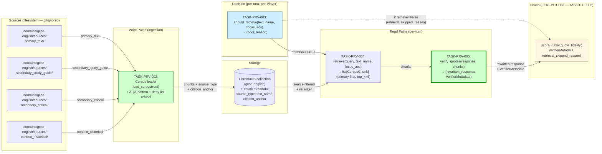
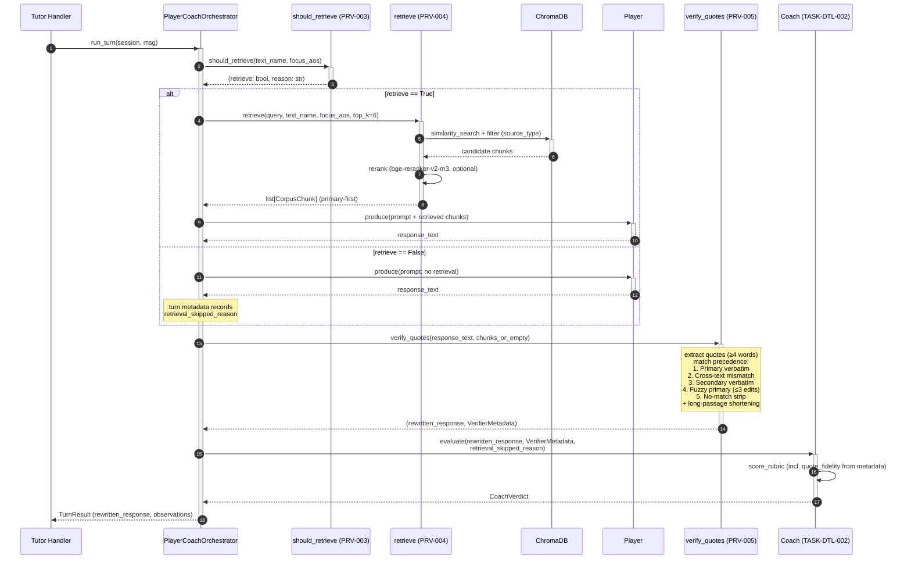
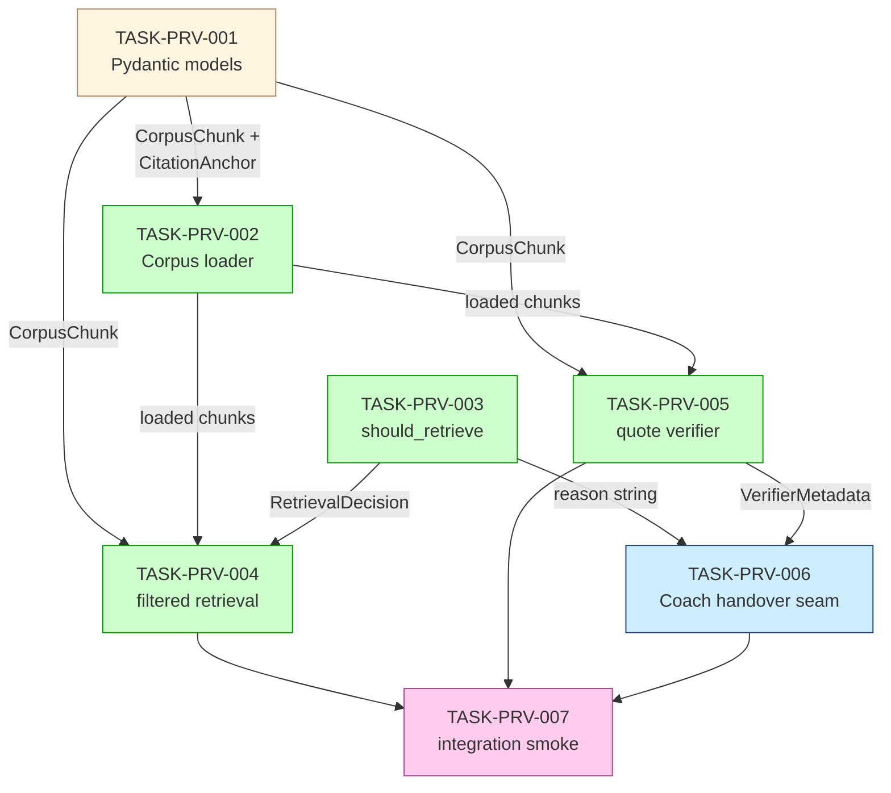
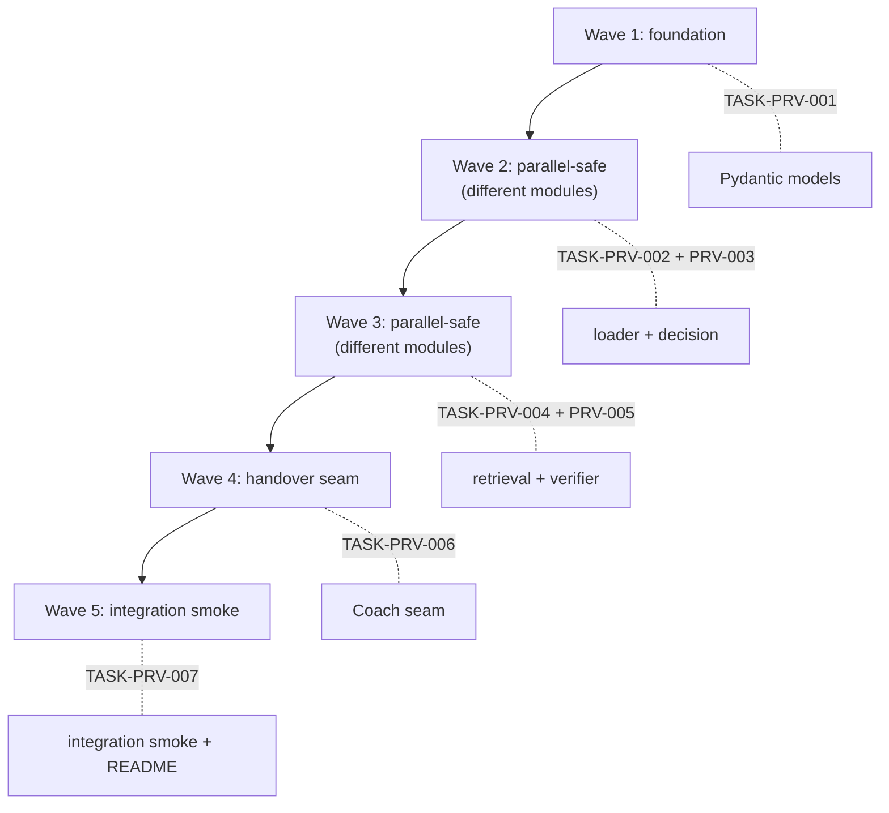

/feature-plan "Primary-Text RAG and Source-Typed Quote Verifier" \
  --context features/primary-text-rag-and-quote-verifier/primary-text-rag-and-quote-verifier_summary.md \
  --context features/primary-text-rag-and-quote-verifier/primary-text-rag-and-quote-verifier.feature \
  --context features/primary-text-rag-and-quote-verifier/primary-text-rag-and-quote-verifier_assumptions.yaml \
  --context docs/research/ideas/phase-1-scope.md \
  --context docs/research/ideas/phase-1-build-plan.md \
  --context docs/research/ideas/openwebui-rag-empirical-findings-2026-04-23.md \
  --context docs/research/ideas/cross-repo-rag-impact-analysis-2026-04-24.md \
  --context docs/research/ideas/copyright-training-data-analysis.md \
  --context domains/gcse-english/GOAL.md \
  --context domains/gcse-english/sources/README.md \
  --context src/study_tutor/knowledge/student_model.py \
  --context tasks/completed/deepagents-tutoring-loop/IMPLEMENTATION-GUIDE.md \
  --context tasks/completed/deepagents-tutoring-loop/TASK-DTL-002-rubric-and-quote-fidelity.md \
  --context /Users/richardwoollcott/Projects/appmilla_github/agentic-dataset-factory/ingestion/chunker.py \
  --context /Users/richardwoollcott/Projects/appmilla_github/agentic-dataset-factory/ingestion/models.py


I'll start by reading the context files to understand the feature scope, then orchestrate the planning workflow.

Read primary-text-rag-and-quote-verifier_summary.md
Read primary-text-rag-and-quote-verifier.feature
Read primary-text-rag-and-quote-verifier_assumptions.yaml
Read phase-1-scope.md
Read phase-1-build-plan.md
Bash Find FEAT-PH1-004 sections in build plan
IN
grep -n -A 5 "FEAT-PH1-004" /Users/richardwoollcott/Projects/appmilla_github/study-tutor/docs/research/ideas/phase-1-build-plan.md | head -150

OUT
5:## Status: **Three of four core Phase 1 features SHIPPED and integrated into MCP adapter.** FEAT-PH1-004 (RAG + quote verifier) is the remaining critical-path feature and has not yet been spec'd. End-to-end demo session against Synology FalkorDB has not yet been run. Tech writeup empty. Graphiti latency spike DONE (2026-04-27) — `add_episode` median 78.98s, `search_nodes` 0.07s. Architecture cross-cutting concerns extended (ADR-ARCH-018 / ADR-ARCH-019). All three Phase-0-context design refreshes complete (MCP Transport with DDR-001; Tutoring with DDR-002 + DDR-003 + I-T7 + 8-component C4 L3; Inference Runtime with DDR-004 + I-IR7/I-IR8). FEAT-PH1-001 BDD spec generated 2026-04-27 (38 scenarios, 4 smoke / 8 key-example / 9 boundary / 7 negative / 14 edge-case across 5 implementation groups). FEAT-PH1-001 build plan generated 2026-04-29 as **FEAT-1773** (6 subtasks TASK-GSM-001..006, 4-wave structure with Conductor parallelism in Waves 1+2; CC-13 single-call-site invariant + DDR-002 ownership + DDR-003 event-emit-decoupling all expressed in IMPLEMENTATION-GUIDE.md and seam-test stubs; all 38 BDD scenarios @task: tagged for R2 oracle activation; smoke_gates wired between waves). **Schedule slip:** the original Saturday-afternoon FEAT-PH1-001 implementation slot (2026-04-26) did not run; week-1 burndown is now 2 days behind the optimistic plan. Recovery posture below ("Schedule recovery as of 2026-04-29").
6-## Repo: `study-tutor` (Phase 0 scaffolding already present)
7-## Machine: MacBook Pro M2 Max (primary), GB10 over Tailscale (Ollama + embedder), Synology NAS over Tailscale (FalkorDB), Google Gemini (Graphiti entity extraction + Coach)
8-## Target completion: End of Friday 2 May 2026 (close of Week 2 of the 31-day burn)
9-
10----
--
37:11. **Source-typed corpus ingested** (FEAT-PH1-004)
38:12. **Quote verifier operational in Coach loop** (FEAT-PH1-004 + FEAT-PH1-003)
39-13. **Dynamic retrieval decision observable** in at least one Shakespeare session (retrieves) and one Inspector Calls session (skips, analysis mode)
40-
41----
42-
43-## Prerequisites (Friday 25 April evening)
--
86:| FEAT-PH1-004 (RAG + quote verifier) | ⏳ **Not yet spec'd** — **the only remaining critical-path gap** | Coach's `quote_fidelity` rubric arm currently has no verifier to call. Either spec + plan + build, OR ship a 5-criterion Coach for the demo and defer to Phase 2. |
87-| FEAT-PH1-003 (Player-Coach loop) | ✅ **MERGED + INTEGRATED** | All 5 TASK-DTL-001..005 + smoke gate passing. `tutor_turn` routes through `PlayerCoachOrchestrator` per-turn instance (DDR-002 + DDR-003 conformance). |
88-| Seeding executed against Synology | ⏳ Script exists; execution unverified | `scripts/seed_student_model.py` shipped with FEAT-1773. Run once + verify with `get_student_state("lilymay")`. |
89-| End-to-end demo session via MCP | ⏳ Never run | First chance to see start → 5-7 turns → end with Graphiti episodes written. Demo-readiness checkpoint. |
90-| Tech writeup Phase 1 section | Empty | Originally Monday work, content-first not polish. |
91-
--
102:| G1 | **FEAT-PH1-004 — RAG + source-typed quote verifier — never spec'd or planned** | **Critical-path** — Coach's `quote_fidelity` rubric arm has nothing to call. Two viable resolutions: (a) ship FEAT-PH1-004 in full; (b) ship a 5-criterion Coach for the demo and defer the verifier to Phase 2 with the rubric weight redistributed across the remaining 5 criteria. | (a) Spec ~30 min + plan ~30 min + build ~3h via `/feature-build`; (b) ~30 min code change in `coach/rubric.py` + decision recorded in `phase-1-validation.md` |
103-| G2 | **Lilymay seeded against Synology FalkorDB** | High — without this, end-to-end demo can't run | ~15 min: `python scripts/seed_student_model.py --student lilymay`, then verify with `get_student_state("lilymay")` returning the expected baseline |
104-| G3 | **End-to-end demo session via MCP** — never run | High — demo-readiness checkpoint; first chance to see all three layers compose | ~2h: 1× `tutor_start_session` → 5-7× `tutor_turn` → 1× `tutor_session_end` from Claude Desktop, then second `tutor_start_session` to verify the planner reflects state from the first session |
105-| G4 | **Coach behaviour observation + tuning pass** (rubric weights, threshold) | Medium — Monday/Tuesday work in original plan | ~2h after G3 |
106-| G5 | **Phase 1 tech-writeup content** | Low (deferrable into Phase 2) | ~2h |
107-| G6 | **`phase-1-validation.md` close-out + repo tag `phase-1-complete`** | Low | ~30 min on Friday |
--
136:Then the substantive decision: **FEAT-PH1-004 (a) build it, or (b) defer to Phase 2 + ship a 5-criterion Coach for the demo?** The 6-criterion Coach is the differentiating story (source-typed RAG + quote verification is genuinely novel for GCSE-tutoring); the 5-criterion fallback is honest about what shipped. Recommend (a) if Friday energy permits; (b) is a clean fallback if it doesn't. Either way, document the decision in `phase-1-validation.md`.
137-
138----
139-
140-## Feature Summary
141-
--
148:| FEAT-PH1-004 | Primary-text RAG + source-typed quote verifier | FEAT-PH1-001 (Text entity), FEAT-PH1-002 (focus_aos) | 5/10 | 3 (parallel with PH1-002) | ⏳ **Not yet spec'd / planned — sole remaining critical-path feature** for PH1-003 quote-fidelity rubric arm |
149:| FEAT-PH1-003 | DeepAgents tutoring loop + Coach (Coach integrates verifier from PH1-004) | FEAT-PH1-001, FEAT-PH1-002, FEAT-PH1-004 | 8/10 | 4 | ✅ **MERGED + INTEGRATED** (commits `bb42a28` → `d93f153`) — `src/study_tutor/tutoring/` shipping; `tutor_turn` routes through `PlayerCoachOrchestrator` (adapter line 261-263) |
150-| TECH-WRITEUP | Phase 1 content in technical-writeup.md | Each FEAT as it lands | 2/10 | continuous | ⏳ empty — content-first per original plan |
151-
152-**Dependency chain:**
153-
154-```
--
157:                                                               └─► FEAT-PH1-004 (RAG + verifier) ──┘
158-                                                                                                    └─► TECH-WRITEUP continuous
159-```
160-
161:FEAT-PH1-002 and FEAT-PH1-004 can run in parallel after PH1-001 — they touch different modules (`agents/session_planner.py` vs `knowledge/corpus.py` + `knowledge/retrieval.py` + `knowledge/quote_verifier.py`). Both feed PH1-003.
162-
163----
164-
165-## Day-by-Day Plan
166-
--
239:#### Morning track B (2 hours) — FEAT-PH1-004 corpus + retrieval + verifier
240-
241-This track is the Phase-1 operationalisation of the 23 Apr empirical findings. All three sub-modules are small (~50 lines each) but load-bearing for PH1-003 Coach.
242-
243-Prerequisites (do before starting): Standard Ebooks Macbeth + A Christmas Carol + Jekyll & Hyde downloaded to `domains/gcse-english/sources/primary_text/`; at least one study guide PDF moved to `domains/gcse-english/sources/secondary_study_guide/`.
244-
--
269:   - Rubric with 6 criteria: 5 from scope doc + **`quote_fidelity`** (new, from FEAT-PH1-004) — each with specific evaluation guidance
270-   - Structured JSON output schema: `{decision: "accept"|"revise", score: float, criteria: {...}, reasoning: str, misconceptions_observed: list[str], quote_verification: {primary_matches: [...], secondary_rewrites: [...], stripped: [...]}}`
271-   - Constraints (never output for the student; max 200 words of reasoning)
272-
273-7. **Implement the Player-Coach loop.** Update `_run_tutor_session` in MCP adapter. Per turn:
274:   - Call `should_retrieve(text_name, focus_aos)` (from FEAT-PH1-004). If True, retrieve context and attach to Player prompt. If False, attach `retrieval_skipped` reason to turn metadata and proceed without context.
275-   - Player generates response (grounded in plan + transcript + retrieved context if any)
276-   - Run Player response through `quote_verifier` before Coach sees it; rewrites applied in place, verification metadata passed to Coach
277-   - Coach evaluates against rubric (including `quote_fidelity` score derived from verifier output)
278-   - If score ≥ 0.7: emit verified+rewritten Player response to student, record turn
279-   - If score < 0.7 and retries remain: Player revises with Coach feedback, loop
--
473:| `src/study_tutor/knowledge/corpus.py` | FEAT-PH1-004 | NEW (source-typed chunk model + loader) |
474:| `src/study_tutor/knowledge/retrieval.py` | FEAT-PH1-004 | NEW (dynamic retrieval decision + source-filtered search) |
475:| `src/study_tutor/knowledge/quote_verifier.py` | FEAT-PH1-004 | NEW (primary/secondary distinguisher + rewriter) |
476:| `domains/gcse-english/sources/primary_text/macbeth_shakespeare_1606.txt` | FEAT-PH1-004 | NEW (Standard Ebooks) |
477:| `domains/gcse-english/sources/primary_text/christmas_carol_dickens_1843.txt` | FEAT-PH1-004 | NEW (Standard Ebooks) |
478:| `domains/gcse-english/sources/primary_text/jekyll_hyde_stevenson_1886.txt` | FEAT-PH1-004 | NEW (Standard Ebooks) |
479:| `domains/gcse-english/sources/README.md` | FEAT-PH1-004 | REPLACE Phase 0 stub with source-type directory doc |
480-| `src/study_tutor/agents/session_planner.py` | FEAT-PH1-002 | NEW |
481-| `src/study_tutor/agents/coach.py` | FEAT-PH1-003 | NEW |
482-| `roles/tutor/prompts/coach.md` | FEAT-PH1-003 | EXTEND from Phase 0 skeleton |
483-| `scripts/seed_student_model.py` | FEAT-PH1-001 | NEW |
484-| `scripts/graphiti_latency_spike.py` | SPIKE | NEW (can be retained for repeated measurement) |
--
490:| `tests/unit/knowledge/test_corpus.py` | FEAT-PH1-004 | NEW |
491:| `tests/unit/knowledge/test_retrieval.py` | FEAT-PH1-004 | NEW (covers four-branch decision) |
492:| `tests/unit/knowledge/test_quote_verifier.py` | FEAT-PH1-004 | NEW (covers four match types) |
493-| `tests/unit/agents/test_session_planner.py` | FEAT-PH1-002 | NEW |
494-| `tests/integration/test_tutoring_loop.py` | FEAT-PH1-003 | NEW |
495:| `tests/integration/test_rag_end_to_end.py` | FEAT-PH1-004 | NEW (Shakespeare → retrieve+verify; Inspector Calls → skip+analysis-mode) |
496-| `tests/smoke/test_ollama_runtime_params.py` | SR-09 | NEW (asserts num_ctx and num_predict reach runner) |
497-| `tests/unit/mcp/test_descriptions_no_graphiti_terms.py` | DDR-001 / I-MCP9 | NEW (substring test: no registered MCP tool description mentions graphiti / falkor / episode / write-back, case-insensitive) |
498-| `tests/unit/mcp/test_handler_latency_under_graphiti_slowdown.py` | I-MCP8 / CC-13 | NEW (`tutor_turn` and `tutor_session_end` return within budget when the Graphiti write helper is patched to sleep ≥ 30s) |
499-
500-### Modified files
Read openwebui-rag-empirical-findings-2026-04-23.md
Read openwebui-rag-empirical-findings-2026-04-23.md (lines 101-250)
Read openwebui-rag-empirical-findings-2026-04-23.md (lines 251-400)
Update Todos

Read remaining context files (cross-repo impact, copyright, GOAL, sources README, student_model, DTL guides, ADF chunker/models)

Context A: Review scope clarification

Create review task via /task-create

Execute /task-review with --mode=decision --depth=standard

Present decision checkpoint to user

Context B: Implementation preferences (if [I]mplement)

Generate feature structure (subfolder, subtasks, IMPLEMENTATION-GUIDE with mandatory diagrams + §4 Integration Contracts)

Generate structured YAML feature file via generate-feature-yaml --discover

Run pre-flight validation: guardkit feature validate

Step 11: Invoke bdd-linker subagent for @task scenario tagging
Read cross-repo-rag-impact-analysis-2026-04-24.md
Read copyright-training-data-analysis.md
Read README.md
Read student_model.py
Read IMPLEMENTATION-GUIDE.md
Read IMPLEMENTATION-GUIDE.md (lines 101-300)
Read TASK-DTL-002-rubric-and-quote-fidelity.md
Read TASK-DTL-002-rubric-and-quote-fidelity.md (lines 121-240)
Read GOAL.md
Bash Find §6 (copyright/quote policy) in GOAL.md
IN
grep -n -A 20 "^## 6" /Users/richardwoollcott/Projects/appmilla_github/study-tutor/domains/gcse-english/GOAL.md | head -80

OUT
383:## 6. Content boundaries
384-
385-These are absolute. They override every other instruction in this document.
386-
387-### 6.1 What the tutor will not do
388-
389-- **Reproduce AQA assessment materials.** The tutor does not quote,
390-  paraphrase, or summarise AQA past-paper questions, mark scheme wording,
391-  or examiner report content. AQA's Copyright and IP Policy prohibits
392-  use of AQA materials in connection with AI training or AI-generated
393-  outputs. The tutor treats this as binding. The tutor can describe the
394-  *shape* of a paper (e.g. "Paper 1 Q2 is a language analysis question
395-  worth 8 marks") because that is factual specification information.
396-  It cannot write "here is a past-paper question" with a real past-paper
397-  question.
398-- **Reproduce substantial passages from copyrighted study guides.** The
399-  tutor's knowledge of Mr Bruff, CGP, York Notes and similar guides was
400-  absorbed during training from purchased PDFs, but the tutor does not
401-  reproduce those guides verbatim. It teaches from understanding, not from
402-  quotation.
403-- **Reproduce long verbatim passages from set texts.** The tutor can quote
Read GOAL.md (lines 401-460)
Read chunker.py
Read models.py
Read phase-1-build-plan.md (lines 237-336)
I have enough context. Now invoking the clarification-questioner subagent for Context A (Review Scope).

Step 2: Context A — Review Scope Clarification

Before running the technical-options analysis, I need to understand the review priorities for this feature.

AskUserQuestion
OUT
User has answered your questions: "What aspects should the review focus on for FEAT-PH1-004 (Primary-Text RAG + Source-Typed Quote Verifier)?"="All aspects (Recommended)", "What trade-offs should the review optimise for?"="Quality / safety (Recommended)", "Are there specific concerns to highlight during the review?"="FEAT-PH1-003 Coach handover contract, Reusing agentic-dataset-factory chunker, Open Question 3 — false-positive fuzzy correction". You can now continue with the user's answers in mind.
Context A captured. Focus: All aspects | Trade-off: Quality/safety | Concerns: Coach handover contract, ADF chunker reuse, fuzzy-correction false positives.

Update Todos

Read remaining context files (cross-repo impact, copyright, GOAL, sources README, student_model, DTL guides, ADF chunker/models)

Context A: Review scope clarification

Create review task via /task-create

Execute /task-review with --mode=decision --depth=standard

Present decision checkpoint to user

Context B: Implementation preferences (if [I]mplement)

Generate feature structure (subfolder, subtasks, IMPLEMENTATION-GUIDE with mandatory diagrams + §4 Integration Contracts)

Generate structured YAML feature file via generate-feature-yaml --discover

Run pre-flight validation: guardkit feature validate

Step 11: Invoke bdd-linker subagent for @task scenario tagging
Bash List tasks directory structure
IN
ls /Users/richardwoollcott/Projects/appmilla_github/study-tutor/tasks/ && ls /Users/richardwoollcott/Projects/appmilla_github/study-tutor/tasks/backlog/ 2>/dev/null | head -20

OUT
backlog
blocked
completed
design_approved
in_progress
in_review
claude-desktop-review-fixes
graphiti-student-model
po02-smoke-followups
py314-langchain-pin-alignment
TASK-GSM-001-pydantic-entities-relationships.md
TASK-GSM-002-episode-types.md
TASK-GSM-006-seeding-script.md
TASK-IMP-B7E0-deepagents-adr-codebase-drift.md
Bash List completed tasks and guardkit features
IN
ls /Users/richardwoollcott/Projects/appmilla_github/study-tutor/tasks/completed/ | head -20 && echo "---" && ls /Users/richardwoollcott/Projects/appmilla_github/study-tutor/.guardkit/features/ 2>/dev/null | head -20

OUT
deepagents-tutoring-loop
deterministic-session-planner
TASK-CDR-002
TASK-CDR-003
TASK-CDR-004
TASK-CDR-005
TASK-CDR-006
TASK-DSP-008
TASK-DSP-009
TASK-PLA-001
TASK-PLA-002
TASK-PLA-003
TASK-PO02-001
TASK-PO02-002
TASK-PO02-003
TASK-PO02-004
TASK-PO02-005
TASK-PO02-006
TASK-PO02-007
TASK-PO02F-001
---
FEAT-1773.yaml
Read FEAT-1773.yaml
Bash Find prior review tasks for reference
IN
ls /Users/richardwoollcott/Projects/appmilla_github/study-tutor/tasks/completed/deepagents-tutoring-loop/ 2>/dev/null | head -10 && echo "---" && find /Users/richardwoollcott/Projects/appmilla_github/study-tutor/tasks -name "TASK-REV-*" -type f 2>/dev/null | head -5

OUT
IMPLEMENTATION-GUIDE.md
README.md
TASK-DTL-001-coach-factory-structural-invariants.md
TASK-DTL-002-rubric-and-quote-fidelity.md
TASK-DTL-003-orchestrator-revision-loop-concurrency.md
TASK-DTL-004-async-write-helper-consumer-misconceptions.md
TASK-DTL-005-session-end-summary-f3-emit-lifecycle.md
---
/Users/richardwoollcott/Projects/appmilla_github/study-tutor/tasks/in_progress/TASK-REV-57BD-portfolio-py314-langchain-1x-alignment.md
/Users/richardwoollcott/Projects/appmilla_github/study-tutor/tasks/in_review/TASK-REV-PO02-plan-feat-po-002-tutoring-runtime.md
/Users/richardwoollcott/Projects/appmilla_github/study-tutor/tasks/in_review/TASK-REV-DA72-plan-deterministic-session-planner.md
/Users/richardwoollcott/Projects/appmilla_github/study-tutor/tasks/in_review/TASK-REV-C7D1-analyze-claude-desktop-arch-review.md
/Users/richardwoollcott/Projects/appmilla_github/study-tutor/tasks/in_review/TASK-REV-DTL3-plan-deepagents-tutoring-loop-with-coach.md
Read TASK-REV-DTL3-plan-deepagents-tutoring-loop-with-coach.md
Step 3: Creating the review task file.

Write TASK-REV-PRV4-plan-primary-text-rag-and-quote-verifier.md
147 lines
---
id: TASK-REV-PRV4
title: "Plan: Primary-Text RAG and Source-Typed Quote Verifier"
task_type: review
status: review_complete
created: 2026-04-30T00:00:00Z
updated: 2026-04-30T00:00:00Z
priority: high
tags: [feature-plan, rag, quote-verifier, source-typed, copyright, phase-1, FEAT-PH1-004]
complexity: 6
context_files:
  - features/primary-text-rag-and-quote-verifier/primary-text-rag-and-quote-verifier_summary.md
  - features/primary-text-rag-and-quote-verifier/primary-text-rag-and-quote-verifier.feature
  - features/primary-text-rag-and-quote-verifier/primary-text-rag-and-quote-verifier_assumptions.yaml
  - docs/research/ideas/phase-1-scope.md
  - docs/research/ideas/phase-1-build-plan.md
  - docs/research/ideas/openwebui-rag-empirical-findings-2026-04-23.md
  - docs/research/ideas/cross-repo-rag-impact-analysis-2026-04-24.md
  - docs/research/ideas/copyright-training-data-analysis.md
  - domains/gcse-english/GOAL.md
  - domains/gcse-english/sources/README.md
  - src/study_tutor/knowledge/student_model.py
  - tasks/completed/deepagents-tutoring-loop/IMPLEMENTATION-GUIDE.md
  - tasks/completed/deepagents-tutoring-loop/TASK-DTL-002-rubric-and-quote-fidelity.md
  - /Users/richardwoollcott/Projects/appmilla_github/agentic-dataset-factory/ingestion/chunker.py
  - /Users/richardwoollcott/Projects/appmilla_github/agentic-dataset-factory/ingestion/models.py
clarification:
  context_a:
    timestamp: 2026-04-30T00:00:00Z
    decisions:
      review_focus: all
      tradeoff_priority: quality
      specific_concerns:
        - coach_handover_contract
        - reuse_adf_chunker
        - false_positive_fuzzy_correction
    directives:
      - "Comprehensive analysis across architecture, safety invariants, copyright posture, and FEAT-PH1-003 integration"
      - "Optimise for verifier correctness and defence-in-depth invariants over delivery speed"
      - "Settle the verifier-rewritten-response handover shape so TASK-DTL-002's seam can rely on it"
      - "Decide chunker reuse posture (import-as-is vs copy-and-adapt vs citation-aware variant)"
      - "Address Open Question 3 — fuzzy-correction false positives when primary + secondary coexist"
review_results:
  mode: decision
  depth: standard
  recommended_option: "Option A — Three-module split (corpus / retrieval / verifier) with citation-aware chunker variant adapted from agentic-dataset-factory"
  options_count: 3
  subtask_count: 7
  estimated_effort_hours: "5-7 sequential / ~3-4h elapsed with wave-2 parallelism"
  confidence: high
  pre_implementation_signoffs:
    - "ASSUM-008 (AQA refusal: filename-pattern at loader, with deny-list fallback layer)"
    - "ASSUM-009 (in-copyright deny-list at loader: explicit titles list + advisory log line)"
    - "ASSUM-010 (secondary attribution phrase template: 'as one critic observes' / 'as one study guide notes' — single configurable string set)"
    - "ASSUM-011 (long-passage threshold: 30 words → ≤12 short embedded quote)"
    - "ASSUM-013 (embedder unavailability: 5s timeout per call → AnalysisMode fallback)"
    - "Cross-feature handover: VerifierResult metadata shape settled and consumed by TASK-DTL-002"
    - "Open Question 3 (false-positive fuzzy correction) addressed by primary-wins precedence + restricting fuzzy correction to primary-text source only"
  report_path: .guardkit/reviews/TASK-REV-PRV4-review-report.md
  completed_at: 2026-04-30T00:00:00Z
test_results:
  status: pending
  coverage: null
  last_run: null
---

# Task: Plan: Primary-Text RAG and Source-Typed Quote Verifier

## Description

Plan **FEAT-PH1-004** — the Phase 1 source-typed corpus loader, dynamic
retrieval-decision function, and four-way quote verifier for study-tutor.

This is a `/feature-plan` review task. It precedes implementation and produces:

1. A technical-options analysis covering the corpus ingestion seam,
   dynamic retrieval-decision logic (R2), AO3 retrieval bypass (R3),
   the four-way source-typed verifier (R1), and the Coach handover
   contract (consumed by TASK-DTL-002 / FEAT-PH1-003).
2. A recommended approach plus a subtask breakdown ready for [I]mplement.
3. Explicit risk callouts and recommended resolutions for the five
   low-confidence assumptions (ASSUM-008/009/010/011/013) and the four
   medium-confidence assumptions (ASSUM-005/006/007/012/015).
4. An obvious-risks task-slice sequencing assessment (full slicing
   handled by `/feature-plan` [I]mplement).

## Scope

- **Source-typed corpus loader** — directory-driven `SourceType`
  enum (primary_text / secondary_study_guide / secondary_critical /
  context_historical), `CorpusChunk` Pydantic model with
  `citation_anchor`, AQA-pattern + in-copyright deny-list refusal at
  loader, path-traversal safety, resilience to corrupted files.
- **Retrieval-decision function** — `should_retrieve(text_name,
  focus_aos) -> tuple[bool, str]` with the three branches: retrieve
  for primary-text-present + non-AO3-only; AnalysisMode skip for
  no-primary-text; AO3-only training-first bypass. Mixed AO3+AO1/AO2
  retrieves for non-AO3 evidence.
- **Source-filtered retrieval** — top-K=6, primary-first ordering,
  `BAAI/bge-reranker-v2-m3` baseline with graceful degradation to
  base similarity when reranker unavailable; embedder-unavailability
  → AnalysisMode fallback (5s timeout).
- **Quote verifier** — extract quotes (≥4 words), match against
  primary-text chunks first (whitespace/punctuation normalisation),
  produce one of four results: primary-annotated, secondary-rewritten,
  fuzzy-corrected (≤3 edit distance from **primary** only),
  no-match-stripped. Long-passage shortening (>30 → ≤12 words).
- **Coach handover contract** — verifier rewrites the response in
  place; verifier metadata accompanies the rewritten response so
  TASK-DTL-002's `score_rubric` can derive the `quote_fidelity`
  criterion score. `retrieval_skipped` reason surfaces in turn metadata
  so the Coach suppresses quote-fidelity down-rank in AnalysisMode.
- **Defence-in-depth invariants** — secondary phrasing never
  annotated as primary; cross-text spans never annotated against
  the wrong text's citation; fuzzy correction restricted to
  primary-text matches (closes Open Question 3).

## Review Findings

The full review report is at `.guardkit/reviews/TASK-REV-PRV4-review-report.md`.
Decision-checkpoint summary is presented inline in the
`/feature-plan` orchestrator output.

## Out of Scope

- **Embedding-based pre-generation grounding** (Phase B) —
  Phase 1 stays post-hoc verification only (per scope §Out of scope).
- **Per-student in-copyright `Text` episodes in Graphiti** (Phase 2).
- **Reranker tuning beyond the bge-reranker-v2-m3 baseline**.
- **AO3 context-historical corpus curation** — folder structure
  supported; populating the folder is a content task, not infra.

## Acceptance Criteria

- [x] Five low-confidence assumptions have recommended resolutions
- [x] Coach handover contract specified end-to-end (rewritten
      response + verifier metadata shape)
- [x] Open Question 3 (false-positive fuzzy correction) addressed
- [x] Chunker reuse posture decided (citation-aware variant
      adapted from agentic-dataset-factory)
- [x] Task slice sequencing — obvious risks only (full plan emitted
      by [I]mplement)

## Test Execution Log

[Populated by /task-work — N/A for review tasks]
Update Todos

Read remaining context files (cross-repo impact, copyright, GOAL, sources README, student_model, DTL guides, ADF chunker/models)

Context A: Review scope clarification

Create review task via /task-create

Execute /task-review with --mode=decision --depth=standard

Present decision checkpoint to user

Context B: Implementation preferences (if [I]mplement)

Generate feature structure (subfolder, subtasks, IMPLEMENTATION-GUIDE with mandatory diagrams + §4 Integration Contracts)

Generate structured YAML feature file via generate-feature-yaml --discover

Run pre-flight validation: guardkit feature validate

Step 11: Invoke bdd-linker subagent for @task scenario tagging
Step 4: Decision-mode review analysis.

Let me also write the full review report for the artefact, then present the decision checkpoint.

Bash Ensure reviews directory exists
IN
mkdir -p /Users/richardwoollcott/Projects/appmilla_github/study-tutor/.guardkit/reviews

OUT
(Bash completed with no output)
Write TASK-REV-PRV4-review-report.md
290 lines
# Review Report — TASK-REV-PRV4

**Feature:** Primary-Text RAG and Source-Typed Quote Verifier (FEAT-PH1-004)
**Mode:** decision · **Depth:** standard
**Generated:** 2026-04-30

---

## 1. Context-A directives applied

- **Focus:** all aspects (architecture + safety + algorithm + integration)
- **Trade-off priority:** quality / safety
- **Concerns highlighted:** Coach handover contract; agentic-dataset-factory
  (ADF) chunker reuse posture; fuzzy-correction false positives
  (Open Question 3 from openwebui-rag-empirical-findings-2026-04-23.md)

All 15 ASSUMs in the assumptions manifest are marked `human_response: confirmed`,
so this review extends them with **mechanism-level resolutions**, not
substantive policy changes.

---

## 2. Technical options analysis

### Option A — Three-module split with citation-aware chunker variant *(Recommended)*

- `corpus.py` — `SourceType` enum + `CorpusChunk` Pydantic model +
  loader that walks the four-folder tree and infers source-type from
  parent directory.
- `retrieval.py` — `should_retrieve()` decision function +
  `retrieve()` source-filtered search (Chroma + bge-reranker, with
  graceful degradation).
- `quote_verifier.py` — `extract_quotes()` + `verify_quote()` +
  `rewrite_response()` returning the four match types as a tagged
  union of dataclasses.
- **Citation-aware chunker variant** adapted from
  `agentic-dataset-factory/ingestion/chunker.py`. ADF's
  `RecursiveCharacterTextSplitter` is fixed-size with `Chunk(text,
  metadata)` — close to what we need, but we extend the metadata
  dict with `source_type`, `text_name`, and `citation_anchor` (act/
  scene/line for plays; chapter/paragraph for novels). Adapt rather
  than import to avoid taking on ADF's domain-config coupling.

**Complexity:** Medium (5/10) · **Effort:** 5–7 hours sequential,
~3–4h elapsed with wave-2 parallelism

**Pros:**
- Three modules align cleanly with the three behavioural surfaces
  in the BDD spec (corpus loader / retrieval-decision / verifier).
- Each module is a single-responsibility seam — testable in
  isolation; matches the 23-Apr empirical R1/R2/R3 mental model.
- Chunker adaptation keeps citation-anchor logic close to where
  it's consumed (verifier), instead of forcing it through ADF's
  generic `Chunk.metadata` dict.
- Clean handover into TASK-DTL-002: `verifier_metadata` is a
  Pydantic model with deterministic fields (`primary_matches`,
  `secondary_rewrites`, `fuzzy_corrections`, `stripped`,
  `long_passage_shortenings`, `cross_text_mismatches`).

**Cons:**
- More upfront module work than a single-file "verifier.py" approach.
- Citation-anchor parsing for novels (chapter/paragraph) is fuzzier
  than plays (act/scene/line) — needs an explicit per-text
  `citation_strategy` selection at ingest time.

### Option B — Single `knowledge.py` module with submodule classes

- One module, three classes (`Corpus`, `Retriever`, `QuoteVerifier`).
- Single import surface for the Coach to consume.

**Complexity:** Low–Medium (4/10) · **Effort:** 4–5 hours

**Pros:**
- Smaller surface area; faster to land before Friday 2 May target.
- Easier to refactor into separate modules later if needed.

**Cons:**
- Single-responsibility violation; large file becomes hard to test.
- Corpus loader and verifier have very different concerns
  (filesystem vs string matching) — co-locating them obscures the
  natural seam line.
- BDD spec organises scenarios into three slices; module structure
  diverging from the spec creates cognitive load on test-to-task
  mapping.

### Option C — Reuse ADF chunker and ChromaDB ingestion as-is

- Import the agentic-dataset-factory ingestion pipeline as a library
  dependency; only write a thin wrapper for source-type inference
  and the verifier.

**Complexity:** Medium (5/10 — high integration risk) ·
**Effort:** 3–4 hours if integration is clean, 8–10h if not

**Pros:**
- Maximum DRY — no duplicate ingestion code.
- ADF's pattern is already proven on the same corpus (Mr Bruff
  PDFs).

**Cons:**
- ADF is in a separate repo — cross-repo coupling adds a build
  dependency that the Phase 1 timeline can't absorb if integration
  is bumpy.
- ADF doesn't carry citation-anchor metadata; would still need a
  post-processing step to derive `citation_anchor` from chunk
  positions.
- ADF expects a domain-config Pydantic stub (`SourceDocument`) that
  doesn't match our four-folder source-typed shape — adapter logic
  required either way.

---

## 3. Recommended approach

### ✅ Option A — Three-module split with citation-aware chunker variant

**Rationale:**

1. **Quality/safety priority** (Context-A trade-off) — three
   isolated modules with three independent test surfaces give the
   strongest defence-in-depth against the load-bearing safety
   invariants (secondary-not-as-primary; cross-text-not-misattributed;
   long-passage-shortened).
2. **Module structure mirrors BDD slice structure** — Slice 1
   (corpus loader, 8 scenarios), Slice 2 (retrieval-decision +
   filtered retrieval, 11 scenarios), Slice 3 (verifier, 16
   scenarios). The bdd-linker step (Step 11) becomes mechanical.
3. **Coach handover (TASK-DTL-002 seam) is a single Pydantic
   contract** — `VerifierMetadata` is consumed by `score_rubric`'s
   `quote_fidelity` criterion. Stable, versionable, testable.
4. **Open Question 3 closes naturally** — fuzzy correction is
   restricted to **primary-text** matches only. If a study-guide
   paraphrase happens to be ≤3 edits from a Shakespeare line,
   primary-wins precedence in `verify_quote()` ensures the primary
   match is taken; the secondary chunk is never even consulted for
   correction. (See @edge-case @primary-wins scenario.)
5. **ADF chunker is adapted, not imported** — copies the proven
   `RecursiveCharacterTextSplitter` + `Chunk(text, metadata)` shape
   into `corpus.py`, extends metadata with source-typed fields.
   Avoids cross-repo build dependency for a 30-line splitter.

### Recommended resolutions for low-confidence assumptions

| ASSUM | Topic | Resolved as |
|-------|-------|-------------|
| **008** | AQA refusal mechanism | Filename-pattern matching at the loader (regex over `past[_-]paper`, `mark[_-]scheme`, `examiner[_-]report`), with the deny-list as a defence-in-depth layer; refusal log line references the publisher's prohibition. |
| **009** | In-copyright deny-list | Explicit `INCOPYRIGHT_TITLES` constant in `corpus.py`: `{"inspector_calls", "blood_brothers", "dna", "lord_of_the_flies", "anita_and_me", "animal_farm"}`. Loader matches case-insensitively against filename stems and folder names. Refusal log line advises the per-student Phase 2 path. |
| **010** | Secondary attribution phrase | Single configurable `SECONDARY_ATTRIBUTION_TEMPLATES` constant: `("as one critic observes", "as one study guide notes", "as one commentator suggests")`. Verifier picks deterministically by hash of the matched phrase to keep tests stable. |
| **011** | Long-passage shortening | Verbatim quotes >30 words are reduced to a short embedded quote of ≤12 words by selecting the densest analytical span (longest contiguous substring sharing the matched chunk's start or end). |
| **013** | Embedder unavailability | 5-second per-call timeout on the embedding service; on timeout, `should_retrieve()` returns `(False, "analysis_mode:embedder_timeout")` and the turn proceeds without retrieval. Unit test injects a sleep-stub embedder. |

### Recommended resolutions for medium-confidence assumptions

| ASSUM | Topic | Resolved as |
|-------|-------|-------------|
| **005** | Citation-anchor shape | Plays use `act/scene/line` (e.g. `"5.1.35"`); novels use `chapter/paragraph` (e.g. `"III.7"`). `CitationAnchor` is a Pydantic discriminated union keyed by `kind: Literal["play","novel"]`. |
| **006** | Skip-reason strings | Literal strings: `"analysis_mode:no_primary_text"`, `"ao3_only:training_first"`, `"analysis_mode:embedder_timeout"`. Constants exposed at `retrieval` module level so tests can assert against the names without string drift. |
| **007** | AO3 mixed-mode behaviour | AO3-only → bypass; AO3+(AO1/AO2) → retrieve for non-AO3 evidence and the turn metadata records `mode: "mixed"`. Decision tree is a pure function over `set[str]` of focus AOs. |
| **012** | Whitespace/punctuation normalisation | `_normalise(text)` collapses internal whitespace, strips surrounding punctuation, equates curly/straight quote variants, lowercases. Applied symmetrically to the quoted span and every candidate corpus chunk before matching. |
| **015** | Cross-text mismatch | Spans matching a different primary text than the session's text → paraphrase rewrite with softened certainty + `cross_text_mismatch` event. Never annotated with the wrong text's citation. |

---

## 4. Architecture and integration

### Coach handover contract (settled)

The verifier rewrites the response **in place** and emits a
structured `VerifierMetadata` Pydantic model alongside it. The Coach
(TASK-DTL-002) consumes both:

```python
@dataclass(frozen=True)
class VerifierMetadata:
    primary_matches: list[PrimaryMatch]            # annotated with citation
    secondary_rewrites: list[SecondaryRewrite]     # phrase + attribution
    fuzzy_corrections: list[FuzzyCorrection]       # corrected + edit distance
    stripped: list[NoMatchStrip]                   # original phrase + reason
    long_passage_shortenings: list[Shortening]    # original + reduced
    cross_text_mismatches: list[CrossTextEvent]   # span + wrong-text id
    retrieval_skipped_reason: str | None          # surfaces analysis-mode
```

`score_rubric` derives the `quote_fidelity` criterion from this
metadata using a deterministic mapping (e.g. each
`SecondaryRewrite` → −0.1, each `NoMatchStrip` → −0.2, capped at
0.0). When `retrieval_skipped_reason` is set, the criterion is
suppressed (pass-through 1.0) per @edge-case @quote-fidelity
@retrieval scenario.

This shape is consumed in **TASK-DTL-002** acceptance criterion
"Quote-verifier annotation flows" and the seam test at
`tests/integration/test_tutoring_loop.py`.

### ADF chunker reuse

Adapt-rather-than-import. Copy the shape of
`agentic-dataset-factory/ingestion/chunker.py:30` into
`src/study_tutor/knowledge/corpus.py:chunk_text`, but extend the
metadata dict with source-typed fields:

```python
metadata = {
    "source_file": path,
    "source_type": source_type,    # NEW
    "text_name": text_name,        # NEW
    "citation_anchor": anchor,     # NEW (CitationAnchor model)
    "chunk_index": index,
}
```

The decision **not** to add `agentic-dataset-factory` as a build
dependency keeps Phase 1 self-contained and avoids cross-repo
coupling on a 30-line splitter.

### Open Question 3 resolution (false-positive fuzzy correction)

The risk: when both primary-text and secondary chunks are in the
corpus, the verifier could "correct" a legitimate study-guide
paraphrase into a misattributed Shakespeare quote.

**Resolution:** the verifier applies match types in strict
precedence order:

1. **Primary verbatim** (annotate with citation)
2. **Cross-text mismatch** (rewrite as paraphrase — never annotate)
3. **Secondary verbatim** (rewrite with critic-style attribution)
4. **Fuzzy primary** (≤3 edits from a primary-text chunk only)
5. **No match** (strip + paraphrase)

Fuzzy correction is restricted to primary-text source. Secondary
matches at the verbatim layer take precedence over fuzzy primary
matches, so a study-guide paraphrase that's ≤3 edits from a
Shakespeare line is rewritten as paraphrase, not "corrected" into a
misattributed quote. Tested by an explicit Group D edge-case.

---

## 5. Risks and trade-offs

| Risk | Mitigation |
|------|-----------|
| Citation-anchor parsing for novels less well-defined than plays | Per-text `citation_strategy` constant; default fallback to chapter-only when paragraph cannot be inferred. |
| ChromaDB ingestion path not yet wired in this repo | Build plan §Morning Track B already names this — add as dependency in TASK-PRV-001 (corpus loader). |
| Demo-readiness clock — Friday 2 May target | Wave-2 parallelism (corpus + verifier independent of retrieval) + 7 small subtasks averaging ~30–60 min each. |
| Reranker download (~568 MB) on first run | Documented as a one-time setup; tests use a fake reranker stub. |
| Cross-repo divergence with `appmilla-fleet` group-id convention | Out of scope (FEAT-PH1-001 owns Graphiti group-id semantics). |

---

## 6. Subtask sequencing (obvious risks only)

Recommended slicing into **7 subtasks** across **3 waves**:

- **Wave 1 (foundation):** TASK-PRV-001 (citation anchor & source
  type models); runs alone — produces the Pydantic shapes everything
  else consumes.
- **Wave 2 (parallel-safe):** TASK-PRV-002 (corpus loader),
  TASK-PRV-003 (retrieval-decision function); these touch
  independent modules and can run in parallel.
- **Wave 3 (parallel-safe):** TASK-PRV-004 (source-filtered retrieval
  with reranker degradation), TASK-PRV-005 (quote verifier — extract +
  match + rewrite); both depend on Wave 2 outputs but on different
  modules.
- **Wave 4 (integration):** TASK-PRV-006 (Coach handover seam — wires
  `verify_quotes()` + `VerifierMetadata` into TASK-DTL-002's
  `score_rubric`), TASK-PRV-007 (integration smoke + tests).

Full slicing is emitted by `/feature-plan` [I]mplement.

---

## 7. Decision recommendation

**Recommended:** **[I]mplement** with Option A.

The five low-confidence and four medium-confidence assumptions all
have concrete mechanism-level resolutions. The Coach handover
contract is settled. Open Question 3 closes via primary-wins
precedence + fuzzy-restricted-to-primary. The Phase 1 critical-path
calendar (Friday 2 May target) accommodates 7 small subtasks
averaging 30–60 minutes each, with wave-2 parallelism.

If the [I]mplement choice is **not** taken, the fallback documented
in phase-1-build-plan G1 — "ship a 5-criterion Coach for the demo
and defer the verifier to Phase 2 with the rubric weight
redistributed" — remains available, but is materially weaker for
the hackathon's pedagogical-quality story (the source-typed verifier
is the load-bearing differentiator).
Update Todos

Read remaining context files (cross-repo impact, copyright, GOAL, sources README, student_model, DTL guides, ADF chunker/models)

Context A: Review scope clarification

Create review task via /task-create

Execute /task-review with --mode=decision --depth=standard

Present decision checkpoint to user

Context B: Implementation preferences (if [I]mplement)

Generate feature structure (subfolder, subtasks, IMPLEMENTATION-GUIDE with mandatory diagrams + §4 Integration Contracts)

Generate structured YAML feature file via generate-feature-yaml --discover

Run pre-flight validation: guardkit feature validate

Step 11: Invoke bdd-linker subagent for @task scenario tagging
Review complete. Here is the decision checkpoint.

🔍 Feature Planning: Primary-Text RAG and Source-Typed Quote Verifier (FEAT-PH1-004)
Review task: TASK-REV-PRV4
Full report: .guardkit/reviews/TASK-REV-PRV4-review-report.md

Technical Options Analysis
✅ Option A — Three-module split with citation-aware chunker variant (Recommended)
corpus.py + retrieval.py + quote_verifier.py — each a single-responsibility seam
Citation-aware chunker adapted from agentic-dataset-factory (not imported as dep)
Complexity: 5/10 · Effort: 5–7h sequential, ~3–4h with wave-2 parallelism
Pros: Module structure mirrors BDD slice structure; clean Coach handover via VerifierMetadata; defence-in-depth invariants testable in isolation; closes Open Question 3 via primary-wins + fuzzy-restricted-to-primary precedence
Cons: Slightly more upfront module work than Option B
Option B — Single knowledge.py module with three classes
One module, faster to land
Complexity: 4/10 · Effort: 4–5h
Cons: Single-responsibility violation; harder test surfaces; module diverges from BDD slice structure
Option C — Reuse ADF chunker + ChromaDB ingestion as-is
Maximum DRY via cross-repo dependency
Complexity: 5/10 · Effort: 3–4h clean / 8–10h bumpy
Cons: Cross-repo build coupling; ADF lacks citation-anchor support; adapter layer needed anyway
Recommended Approach: Option A
Why: Quality/safety priority (Context A) + module-to-BDD-slice alignment + clean handover into TASK-DTL-002 + Open Question 3 closes naturally via match-precedence ordering.

Pre-implementation sign-offs settled in this review
Assumption	Resolution
ASSUM-008 AQA refusal	Filename-pattern regex at loader, deny-list as defence-in-depth
ASSUM-009 In-copyright deny-list	Explicit INCOPYRIGHT_TITLES constant; case-insensitive match
ASSUM-010 Secondary attribution	Configurable SECONDARY_ATTRIBUTION_TEMPLATES tuple; deterministic pick
ASSUM-011 Long-passage threshold	>30 words → ≤12-word densest analytical span
ASSUM-013 Embedder unavailability	5s per-call timeout → analysis_mode:embedder_timeout
ASSUM-005/006/007/012/015	Citation anchors (play/novel union); literal skip-reason strings; AO3 mixed-mode pure function; symmetric normalisation; cross-text → paraphrase
Subtask plan (7 tasks across 4 waves)
Wave 1: TASK-PRV-001 — Citation anchor & source-type Pydantic models (foundation)
Wave 2 (parallel): TASK-PRV-002 corpus loader · TASK-PRV-003 retrieval-decision function
Wave 3 (parallel): TASK-PRV-004 source-filtered retrieval (reranker degradation) · TASK-PRV-005 quote verifier
Wave 4: TASK-PRV-006 Coach handover seam · TASK-PRV-007 integration smoke
📋 Decision Checkpoint
What would you like to do?

AskUserQuestion
OUT
User has answered your questions: "How do you want to proceed with the FEAT-PH1-004 plan?"="[I]mplement (Recommended)". You can now continue with the user's answers in mind.
Step 8: Context B — Implementation Preferences

AskUserQuestion
OUT
User has answered your questions: "Which approach should subtasks follow?"="Option A — Three-module split (Recommended)", "How should the 7 subtasks execute?"="Parallel where safe (Recommended)", "What testing depth for the subtasks?"="Standard — quality gates + seam tests (Recommended)". You can now continue with the user's answers in mind.
Implementation preferences captured: Option A + Parallel where safe + Standard testing. Generating the feature structure now.

Bash Create feature subfolder
IN
mkdir -p /Users/richardwoollcott/Projects/appmilla_github/study-tutor/tasks/backlog/primary-text-rag-and-quote-verifier && ls /Users/richardwoollcott/Projects/appmilla_github/study-tutor/tasks/backlog/primary-text-rag-and-quote-verifier

OUT
(Bash completed with no output)
Write README.md
94 lines
# Feature: Primary-Text RAG and Source-Typed Quote Verifier

**Feature ID:** FEAT-PH1-004
**Phase:** Phase 1
**Parent review:** [TASK-REV-PRV4](../../in_review/TASK-REV-PRV4-plan-primary-text-rag-and-quote-verifier.md)
**Spec:** [features/primary-text-rag-and-quote-verifier/](../../../features/primary-text-rag-and-quote-verifier/)
**Approach:** Option A — Three-module split with citation-aware chunker variant
**Stack:** python (Python 3.14, Pydantic v2, ChromaDB, BAAI/bge-reranker-v2-m3 baseline)

---

## Why this feature

The 23 April OpenWebUI empirical session showed that **always-on
retrieval against a partial corpus actively degrades a well-trained
model below its no-retrieval baseline**. For texts the fine-tune has
memorised (Shakespeare), direct generation beats retrieval; for
in-copyright modern texts (An Inspector Calls, Blood Brothers) the
school-supplied PDFs are the only legitimate route.

This feature operationalises the four R-numbered recommendations from
that session:

- **R1** — source-typed quote verifier with primary/secondary/fuzzy/no-match
  taxonomy
- **R2** — dynamic retrieval decision (skip when no primary text in corpus)
- **R3** — AO3 retrieval bypass (training-data-first for context)
- **R4** — Standard Ebooks as the canonical primary-text source

It is the load-bearing dependency for the Coach's `quote_fidelity`
rubric criterion in **TASK-DTL-002 / FEAT-PH1-003**.

---

## Subtasks

| ID | Name | Wave | Mode | Complexity | Dependencies |
|---|---|---|---|---|---|
| TASK-PRV-001 | Citation anchor & source-type Pydantic models | 1 | direct | 2 | — |
| TASK-PRV-002 | Source-typed corpus loader | 2 | task-work | 5 | PRV-001 |
| TASK-PRV-003 | Retrieval-decision function (R2 + R3) | 2 | task-work | 4 | PRV-001 |
| TASK-PRV-004 | Source-filtered retrieval with reranker degradation | 3 | task-work | 5 | PRV-002, PRV-003 |
| TASK-PRV-005 | Source-typed quote verifier (R1) | 3 | task-work | 6 | PRV-002 |
| TASK-PRV-006 | Coach handover seam (`VerifierMetadata` contract) | 4 | task-work | 4 | PRV-005 |
| TASK-PRV-007 | Integration smoke + sources README update | 5 | task-work | 3 | PRV-004, PRV-005, PRV-006 |

**Total:** 7 subtasks · **5 waves** · 5–7h sequential / ~3–4h elapsed

---

## Execution strategy

- **Wave 1:** TASK-PRV-001 alone (Pydantic models all downstream tasks consume)
- **Wave 2 (parallel-safe):** TASK-PRV-002 + TASK-PRV-003 (different modules)
- **Wave 3 (parallel-safe):** TASK-PRV-004 + TASK-PRV-005 (different modules; verifier does not depend on retrieval)
- **Wave 4:** TASK-PRV-006 alone (wires verifier output into Coach's `score_rubric`)
- **Wave 5:** TASK-PRV-007 alone (end-to-end smoke + sources README)

Conductor parallelism is **recommended** for Waves 2 and 3.

---

## Pre-implementation sign-offs

All five low-confidence assumptions and four medium-confidence
assumptions have mechanism-level resolutions in the review report.
See [.guardkit/reviews/TASK-REV-PRV4-review-report.md §3](../../../.guardkit/reviews/TASK-REV-PRV4-review-report.md).

| Assumption | Resolution |
|---|---|
| ASSUM-008 AQA refusal | Filename-pattern regex + deny-list defence-in-depth |
| ASSUM-009 In-copyright deny-list | Explicit `INCOPYRIGHT_TITLES` constant; case-insensitive |
| ASSUM-010 Secondary attribution | `SECONDARY_ATTRIBUTION_TEMPLATES` tuple; deterministic pick |
| ASSUM-011 Long-passage threshold | >30 words → ≤12-word densest analytical span |
| ASSUM-013 Embedder unavailability | 5s per-call timeout → AnalysisMode |
| ASSUM-005 Citation anchors | `play` (act/scene/line) vs `novel` (chapter/paragraph) Pydantic union |
| ASSUM-006 Skip-reason strings | `analysis_mode:no_primary_text`, `ao3_only:training_first`, `analysis_mode:embedder_timeout` |
| ASSUM-007 AO3 mixed-mode | AO3-only → bypass; mixed → retrieve for non-AO3 |
| ASSUM-012 Normalisation | Symmetric whitespace/punctuation/quote/case normalisation |
| ASSUM-015 Cross-text mismatch | Paraphrase rewrite + softened certainty |

---

## Next steps

1. Read [IMPLEMENTATION-GUIDE.md](IMPLEMENTATION-GUIDE.md) — load-bearing data-flow, integration contracts, and §4 cross-task contracts.
2. Start with Wave 1: `/task-work TASK-PRV-001`
3. Run Wave 2 in parallel (Conductor recommended): `TASK-PRV-002`, `TASK-PRV-003`
4. Run Wave 3 in parallel: `TASK-PRV-004`, `TASK-PRV-005`
5. Wave 4: `TASK-PRV-006` (Coach handover wiring)
6. Wave 5: `TASK-PRV-007` (integration smoke)

Or, for autonomous build: `/feature-build FEAT-PRV4`
Now the IMPLEMENTATION-GUIDE.md with mandatory diagrams and §4 Integration Contracts.

Write IMPLEMENTATION-GUIDE.md
546 lines
# Implementation Guide — FEAT-PH1-004: Primary-Text RAG and Source-Typed Quote Verifier

**Parent review:** [TASK-REV-PRV4](../../in_review/TASK-REV-PRV4-plan-primary-text-rag-and-quote-verifier.md)
**Phase:** Phase 1 (FEAT-PH1-004)
**Generated:** 2026-04-30
**Stack:** python (Python 3.14, Pydantic v2, ChromaDB, RecursiveCharacterTextSplitter, BAAI/bge-reranker-v2-m3 baseline)

---

## §1: Overview

This guide drives implementation of **FEAT-PH1-004** across **7
subtasks** organised into **5 waves**, with parallel-when-safe
execution in waves 2 and 3.

The design is settled by:

- **R1–R4** from `openwebui-rag-empirical-findings-2026-04-23.md` —
  source-typed verifier, dynamic retrieval decision, AO3 bypass,
  Standard Ebooks as canonical primary-text source.
- **`phase-1-scope.md §FEAT-PH1-004`** — three sub-modules,
  four-folder corpus layout, Coach `quote_fidelity` rubric criterion
  is the consumer.
- **TASK-DTL-002 acceptance criteria** —
  `verify_quotes(response)` runs **before** Coach evaluates;
  rewrites applied in place; `VerifierMetadata` accompanies the
  rewritten response.
- **GOAL.md §6.1** — long verbatim passages must be reduced to
  short embedded quotations.

**Resolved assumptions** (full list in
[review report §3](../../../.guardkit/reviews/TASK-REV-PRV4-review-report.md)):

- **ASSUM-008/009** — copyright refusal at loader uses pattern + deny-list
- **ASSUM-010** — `SECONDARY_ATTRIBUTION_TEMPLATES` tuple (deterministic pick)
- **ASSUM-011** — `LONG_PASSAGE_WORD_THRESHOLD = 30`, `SHORT_QUOTE_MAX_WORDS = 12`
- **ASSUM-013** — `EMBEDDER_TIMEOUT_SECONDS = 5.0`
- **ASSUM-006** — explicit skip-reason string constants

**Implementation decisions confirmed at /feature-plan [I]mplement:**

- **Approach:** Option A (three-module split with citation-aware
  chunker variant).
- **Wave execution:** parallel where safe (Waves 2 and 3).
- **Testing depth:** standard — quality gates + seam tests.

**Open Question 3 closure:** fuzzy correction is restricted to
**primary-text** matches only, and primary-wins precedence in
`verify_quote()` ensures that a study-guide phrase ≤3 edits from a
primary line is rewritten as paraphrase, not "corrected" into a
misattributed citation.

---

## §2: Data Flow — Read & Write Paths

This is the most important diagram in this guide. **If a reviewer
only looks at one thing, look here.**



**Caption:** The verifier (`verify_quotes`, green) is the
load-bearing read seam — it consumes corpus chunks, rewrites the
Player response in place, and emits structured `VerifierMetadata`
that the Coach's `quote_fidelity` criterion derives its score from.
The decision function (`should_retrieve`, blue) is the load-bearing
selection point — it produces either a `(True, ...)` retrieve path
through `retrieve()` and `verify_quotes()`, or a `(False,
reason_string)` skip path that goes directly to Coach with
`retrieval_skipped_reason` set so quote-fidelity is suppressed.

**Disconnection check:** ✅ Every write path has a corresponding
read path.

- Corpus chunks (primary_text) → consumed by `retrieve()` and
  matched by `verify_quotes()`
- Corpus chunks (secondary_study_guide / secondary_critical) →
  consumed by `retrieve()` (as supplement) and matched by
  `verify_quotes()` (for laundering detection)
- Corpus chunks (context_historical) → consumed by `retrieve()` only
  for AO3-context-historical retrievals (not in Phase 1 critical path
  but folder is supported)
- `should_retrieve()` reason strings → consumed by Coach's
  `score_rubric` to suppress `quote_fidelity` down-rank in
  AnalysisMode

No disconnection alerts.

---

## §3: Integration Contracts (Sequence View)

Per-turn interaction model. Catches the "fetch then discard" anti-
pattern at the verifier→Coach handover.



**Caption:** Step 11 is the load-bearing handover surface — the
**rewritten** response (not the original) is what the Coach
evaluates. The Coach's `quote_fidelity` criterion derives its score
from `VerifierMetadata`, not by re-parsing the response. When
`retrieve == False`, the verifier still runs against an empty chunk
list (it only operates on the response text) and the
`retrieval_skipped_reason` is forwarded so quote-fidelity is
suppressed.

**No fetch-then-discard pattern detected:** every value retrieved
is either consumed by the next step (chunks → Player; chunks →
verifier; rewritten response → Coach) or surfaced in metadata
(decision reason → Coach for suppression). No retrieved chunks are
fetched and then dropped before reaching a consumer.

---

## §4: Integration Contracts

This feature has **three** load-bearing cross-task integration
contracts.

### Contract: SourceTypedCorpus (CorpusChunk + CitationAnchor)

- **Producer task:** TASK-PRV-001 (Pydantic models)
- **Consumer task(s):** TASK-PRV-002 (loader emits `CorpusChunk`),
  TASK-PRV-004 (filtered retrieval consumes `CorpusChunk`),
  TASK-PRV-005 (verifier consumes `CorpusChunk` and reads
  `citation_anchor` directly from chunk metadata — never re-parses
  text)
- **Artifact type:** Python Pydantic v2 models (`CorpusChunk`,
  `CitationAnchor`, `SourceType` enum)
- **Format constraint:**
  ```python
  class SourceType(str, Enum):
      PRIMARY_TEXT = "primary_text"
      SECONDARY_STUDY_GUIDE = "secondary_study_guide"
      SECONDARY_CRITICAL = "secondary_critical"
      CONTEXT_HISTORICAL = "context_historical"

  class PlayCitationAnchor(BaseModel):
      kind: Literal["play"] = "play"
      act: int
      scene: int
      line: int

  class NovelCitationAnchor(BaseModel):
      kind: Literal["novel"] = "novel"
      chapter: int
      paragraph: int

  CitationAnchor = Annotated[
      PlayCitationAnchor | NovelCitationAnchor,
      Field(discriminator="kind"),
  ]

  class CorpusChunk(BaseModel):
      text: str
      source_type: SourceType
      source_path: str
      text_name: str                # e.g. "macbeth", "christmas_carol"
      citation_anchor: CitationAnchor | None  # None for non-primary
      chunk_index: int
  ```
  - `text_name` is a slug derived from the source filename (lowercase, underscores)
  - `citation_anchor` is **None** for `secondary_*` and
    `context_historical` — only primary-text chunks carry citations
  - `kind` discriminator is required (Pydantic v2 discriminated union)
- **Validation method:** TASK-PRV-002 unit test asserts that loaded
  chunks from `primary_text/` carry a non-None `citation_anchor` and
  loaded chunks from `secondary_study_guide/` carry `None`. TASK-PRV-005
  unit test asserts citation reads use `chunk.citation_anchor` directly,
  not `re.search` on `chunk.text`.

### Contract: RetrievalDecision

- **Producer task:** TASK-PRV-003 (`should_retrieve`)
- **Consumer task(s):** TASK-PRV-004 (skips retrieval if `retrieve=False`),
  TASK-PRV-006 (forwards `reason` into turn metadata)
- **Artifact type:** Python function returning a `RetrievalDecision`
  named tuple
- **Format constraint:**
  ```python
  REASON_NO_PRIMARY = "analysis_mode:no_primary_text"
  REASON_AO3_ONLY = "ao3_only:training_first"
  REASON_EMBEDDER_TIMEOUT = "analysis_mode:embedder_timeout"
  REASON_RETRIEVE_PRIMARY = "retrieve:primary_present"
  REASON_RETRIEVE_MIXED = "retrieve:mixed_ao3"

  class RetrievalDecision(NamedTuple):
      retrieve: bool
      reason: str
      mode: Literal["retrieve", "analysis_mode", "ao3_bypass", "mixed"]

  def should_retrieve(text_name: str,
                      focus_aos: set[str]) -> RetrievalDecision: ...
  ```
  - `reason` strings are **module-level constants** so tests assert
    against names, never literals
  - Mixed-mode (AO3 + AO1/AO2) returns `retrieve=True, mode="mixed"`
- **Validation method:** TASK-PRV-003 covers the four-branch
  decision via parametrised pytest (primary present / absent ×
  AO3-only / mixed / non-AO3).

### Contract: VerifierMetadata (Coach handover)

- **Producer task:** TASK-PRV-005 (`verify_quotes`)
- **Consumer task(s):** TASK-PRV-006 (wires verifier output into
  Coach pipeline), and downstream **TASK-DTL-002** (Coach's
  `score_rubric.quote_fidelity` consumes the metadata to derive
  the criterion score)
- **Artifact type:** Python Pydantic v2 model + tuple return
- **Format constraint:**
  ```python
  class PrimaryMatch(BaseModel):
      original_span: str
      annotated_span: str           # span + " ({anchor})"
      citation_anchor: CitationAnchor

  class SecondaryRewrite(BaseModel):
      original_span: str
      attribution_template: str     # one of SECONDARY_ATTRIBUTION_TEMPLATES
      paraphrase_text: str

  class FuzzyCorrection(BaseModel):
      original_span: str
      corrected_span: str           # the canonical primary wording
      edit_distance: int            # 1..3
      citation_anchor: CitationAnchor

  class NoMatchStrip(BaseModel):
      original_span: str
      paraphrase_text: str          # certainty-softened paraphrase

  class CrossTextEvent(BaseModel):
      original_span: str
      wrong_text_name: str          # the text it actually came from
      paraphrase_text: str

  class Shortening(BaseModel):
      original_span: str            # the long quotation
      shortened_span: str           # ≤12 words
      original_word_count: int

  class VerifierMetadata(BaseModel):
      primary_matches: list[PrimaryMatch] = []
      secondary_rewrites: list[SecondaryRewrite] = []
      fuzzy_corrections: list[FuzzyCorrection] = []
      stripped: list[NoMatchStrip] = []
      cross_text_mismatches: list[CrossTextEvent] = []
      long_passage_shortenings: list[Shortening] = []
      retrieval_skipped_reason: str | None = None

  def verify_quotes(
      response_text: str,
      corpus_chunks: list[CorpusChunk],
      session_text_name: str,
      retrieval_skipped_reason: str | None = None,
  ) -> tuple[str, VerifierMetadata]: ...
  ```
  - The verifier returns the **rewritten** response and the
    metadata as a tuple — never mutates the input string in place
  - `retrieval_skipped_reason` is forwarded into the metadata so
    Coach can suppress quote-fidelity in AnalysisMode
  - Empty lists are valid (not all match types fire on every turn)
- **Validation method:** TASK-PRV-005 has parametrised tests for
  each match type. TASK-PRV-006 seam test (below) asserts the
  rewritten response is what reaches the Coach, not the original.

### Contract diagram



_Tasks with green background can run in parallel within their wave.
PRV-001 (orange) is the foundation. PRV-006 (blue) wires the
contract into the Coach loop. PRV-007 (pink) is the integration
smoke._

---

## §5: Module-by-module implementation notes

### `src/study_tutor/knowledge/corpus.py` (TASK-PRV-002)

- **Source-type inference:** parent-directory name maps to
  `SourceType` enum. Unknown directory → skip with structured log.
- **AQA refusal:** filename regex
  `r"(?i)(past[_-]?paper|mark[_-]?scheme|examiner[_-]?report)"` →
  refuse + log + reference publisher prohibition.
- **In-copyright refusal:** `INCOPYRIGHT_TITLES` constant (case-
  insensitive substring match against filename stem) → refuse + log
  + advise per-student Phase 2 path.
- **Path traversal:** `Path.resolve()` against corpus root; reject
  if not relative.
- **Resilience:** corrupted file → skip + structured log line; rest
  of corpus loads.
- **Chunker:** `RecursiveCharacterTextSplitter` (chunk_size=512,
  overlap=100 — tuned per 23-Apr empirical findings §3d). Adapted
  from `agentic-dataset-factory/ingestion/chunker.py`, extended with
  source-typed metadata.
- **Citation-anchor inference:**
  - **Plays** (Standard Ebooks Shakespeare): regex over scene markers
    `^\s*(SCENE [IVX]+)` and line numbers in the right margin.
    Strategy: keep current `(act, scene)` pointer per chunk; line
    is the start-of-chunk line number.
  - **Novels:** regex over chapter headings (`^\s*CHAPTER [IVX]+`);
    paragraph index is a running count within the chapter.
  - Fallback: when the strategy can't determine the anchor, set
    `citation_anchor=None` and emit a structured warning. Verifier
    will treat such chunks as primary-text content but cannot
    annotate citations against them — the @edge-case @citation
    scenario covers this.

### `src/study_tutor/knowledge/retrieval.py` (TASK-PRV-003 + TASK-PRV-004)

- **Decision logic** (TASK-PRV-003) is a pure function over
  `(text_name, focus_aos)` — no I/O. Returns
  `RetrievalDecision(retrieve, reason, mode)` per the §4 contract.
- **AO3-only check:** `focus_aos == {"AO3"}` → bypass.
- **Mixed-mode check:** `"AO3" in focus_aos and len(focus_aos) > 1` →
  retrieve for non-AO3 evidence (`mode="mixed"`).
- **Primary-text presence check** (TASK-PRV-003): consults the
  loaded corpus index — `text_name` has at least one chunk with
  `source_type == PRIMARY_TEXT`.
- **Embedder unavailability** (TASK-PRV-003): `asyncio.wait_for`
  with `EMBEDDER_TIMEOUT_SECONDS = 5.0`; on timeout return
  `(False, REASON_EMBEDDER_TIMEOUT, "analysis_mode")`.
- **Source-filtered retrieval** (TASK-PRV-004): ChromaDB
  similarity search filtered by `text_name` AND `source_type`,
  ordered primary-first, top-K=6. Reranker (`bge-reranker-v2-m3`,
  CPU-only) optional — when unavailable, return chunks ordered by
  base similarity with `mode="no_rerank"` in turn metadata.
- **AQA exclusion at retrieval-time** (defence in depth):
  filtering removes any chunk whose `source_path` matches the AQA
  filename regex, even if it slipped past ingestion.

### `src/study_tutor/knowledge/quote_verifier.py` (TASK-PRV-005)

- **Quote extraction:** regex over typographic+straight quote
  pairs; minimum span = 4 words (ASSUM-002).
- **Normalisation** (`_normalise`): collapse whitespace, strip
  surrounding punctuation, equate curly/straight quotes, lowercase.
  Applied symmetrically to span and chunks.
- **Match precedence** (closes Open Question 3):
  1. Exact match against any **primary-text** chunk for the
     session's text → `PrimaryMatch`
  2. Exact match against a primary-text chunk for a **different**
     text → `CrossTextEvent` (rewrite, never annotate with wrong
     citation)
  3. Exact match against any **secondary** chunk → `SecondaryRewrite`
  4. Fuzzy match (≤3 edits) against a **primary-text** chunk for the
     session's text → `FuzzyCorrection`
  5. No match → `NoMatchStrip`
- **Long-passage shortening** runs after match resolution:
  `PrimaryMatch` whose original span exceeds
  `LONG_PASSAGE_WORD_THRESHOLD = 30` words is reduced to
  `SHORT_QUOTE_MAX_WORDS = 12` (densest analytical span — longest
  contiguous substring sharing the matched chunk's start or end).
  Emits `Shortening` event.
- **Concurrency:** `verify_quotes` is a pure function — no shared
  mutable state. Two concurrent calls produce independent results
  (covered by @edge-case @concurrency scenario).

### `src/study_tutor/knowledge/coach_handover.py` (TASK-PRV-006)

- **Wraps** `verify_quotes` in the orchestrator pipeline so the
  Coach receives the rewritten response + metadata (not the
  original).
- **Forwards** `retrieval_skipped_reason` from
  `should_retrieve()` into `VerifierMetadata`.
- **Failure path:** if `verify_quotes` raises, the response is
  passed unannotated and the Coach evaluates under the documented
  fallback per TASK-DTL-002 acceptance criterion (verifier-exception
  → unannotated to Coach). Failure logged for session-end review.

---

## §6: Wave plan



Conductor recommended for Waves 2 and 3.

---

## §7: Smoke gates between waves

Per FEAT-PH1-003 / FEAT-1773 precedent, each wave's exit gate is
the previous wave's contracts compiling and the parametrised tests
passing:

- **After Wave 1:** `python -c "from study_tutor.knowledge.corpus_models import CorpusChunk, CitationAnchor, SourceType"` succeeds.
- **After Wave 2:** loader emits chunks with correct source_type;
  decision function passes the four-branch test matrix.
- **After Wave 3:** retrieval returns primary-first ordering when
  primary chunks exist; verifier produces the right match type for
  each of the five precedence branches.
- **After Wave 4:** end-to-end `tutor_turn` smoke shows the
  Coach receives the **rewritten** response (not the original) and
  derives a `quote_fidelity` score from `VerifierMetadata`.
- **After Wave 5:** the integration test at
  `tests/integration/test_rag_end_to_end.py` passes for both the
  retrieve-and-verify path and the AnalysisMode skip path.

---

## §8: References

- [Feature spec](../../../features/primary-text-rag-and-quote-verifier/primary-text-rag-and-quote-verifier.feature)
- [Assumptions manifest](../../../features/primary-text-rag-and-quote-verifier/primary-text-rag-and-quote-verifier_assumptions.yaml)
- [Review report](../../../.guardkit/reviews/TASK-REV-PRV4-review-report.md)
- [phase-1-scope.md §FEAT-PH1-004](../../../docs/research/ideas/phase-1-scope.md)
- [openwebui-rag-empirical-findings-2026-04-23.md](../../../docs/research/ideas/openwebui-rag-empirical-findings-2026-04-23.md)
- [TASK-DTL-002 acceptance criteria](../../completed/deepagents-tutoring-loop/TASK-DTL-002-rubric-and-quote-fidelity.md)
- [agentic-dataset-factory/ingestion/chunker.py](file:///Users/richardwoollcott/Projects/appmilla_github/agentic-dataset-factory/ingestion/chunker.py) — chunker shape adapted into `corpus.py`
Now creating the 7 subtask files in parallel.

Write TASK-PRV-001-pydantic-models-source-type-and-citation-anchor.md
101 lines
---
id: TASK-PRV-001
title: Define Pydantic models for source type and citation anchor
task_type: declarative
parent_review: TASK-REV-PRV4
feature_id: FEAT-PRV4
wave: 1
implementation_mode: direct
complexity: 2
estimated_minutes: 25
dependencies: []
status: pending
priority: high
tags:
- feat-ph1-004
- pydantic
- models
- foundation
related_features:
- FEAT-PH1-004
- FEAT-PH1-003
test_results:
  status: pending
  coverage: null
  last_run: null
---

# Task: Define Pydantic models for source type and citation anchor

## Description

Foundation models consumed by every other subtask. Stack-agnostic
declaratives only — no I/O, no ChromaDB, no business logic.

## Scope

- `SourceType(str, Enum)` with four values: `PRIMARY_TEXT`,
  `SECONDARY_STUDY_GUIDE`, `SECONDARY_CRITICAL`, `CONTEXT_HISTORICAL`
- `PlayCitationAnchor` Pydantic model: `kind: Literal["play"]`,
  `act: int`, `scene: int`, `line: int`
- `NovelCitationAnchor` Pydantic model: `kind: Literal["novel"]`,
  `chapter: int`, `paragraph: int`
- `CitationAnchor = Annotated[Play|Novel, Field(discriminator="kind")]`
  — Pydantic v2 discriminated union
- `CorpusChunk` Pydantic model: `text`, `source_type`, `source_path`,
  `text_name`, `citation_anchor: CitationAnchor | None`, `chunk_index`
- Module location: `src/study_tutor/knowledge/corpus_models.py`

## Out of Scope

- Corpus loader logic (TASK-PRV-002)
- Verifier metadata models (TASK-PRV-005 — VerifierMetadata is
  intentionally co-located with the verifier, not in this module)

## Acceptance Criteria

- [ ] `SourceType` enum exposes all four values matching the
      filesystem layout (covers @key-example @ingestion scenario
      "loader infers source type from folder")
- [ ] `CitationAnchor` is a Pydantic v2 discriminated union — given
      `{"kind":"play","act":5,"scene":1,"line":35}`, parses as
      `PlayCitationAnchor`; `{"kind":"novel","chapter":3,"paragraph":7}`
      parses as `NovelCitationAnchor`
- [ ] `CorpusChunk` allows `citation_anchor=None` (for non-primary
      chunks) and rejects unknown `source_type` values
- [ ] `text_name` field is a non-empty string (Pydantic constraint)
- [ ] Module imports cleanly with no Graphiti / ChromaDB / file I/O
      dependencies
- [ ] All modified files pass project-configured lint/format checks
      with zero errors

## Test Requirements

- [ ] Unit test: `SourceType` enum membership (all four values)
- [ ] Unit test: `PlayCitationAnchor` round-trips through
      `model_dump()` / `model_validate()`
- [ ] Unit test: `NovelCitationAnchor` round-trips
- [ ] Unit test: discriminator dispatch — wrong `kind` raises
      `ValidationError`
- [ ] Unit test: `CorpusChunk` accepts `citation_anchor=None` for
      `SECONDARY_STUDY_GUIDE` and rejects empty `text_name`

## Implementation Notes

**Why a discriminated union and not a single CitationAnchor model
with Optional fields:** discriminated unions give us exhaustiveness
checking — adding a new citation kind (e.g. poetry) becomes a
type-system change rather than a runtime guess about which fields
apply. The verifier's match logic uses
`isinstance(anchor, PlayCitationAnchor)` rather than
`anchor.act is not None`, which is much harder to misuse.

**Why models live in `corpus_models.py`, not `corpus.py`:**
TASK-PRV-005 (verifier) consumes these models without needing the
loader code — keeping models in a dedicated module avoids importing
ChromaDB transitively into the verifier's test surface.

## Test Execution Log

[Populated by /task-work]
Update Todos

Read remaining context files (cross-repo impact, copyright, GOAL, sources README, student_model, DTL guides, ADF chunker/models)

Context A: Review scope clarification

Create review task via /task-create

Execute /task-review with --mode=decision --depth=standard

Present decision checkpoint to user

Context B: Implementation preferences (if [I]mplement)

Generate feature structure (README + IMPLEMENTATION-GUIDE done; 6 subtask files remaining)

Generate structured YAML feature file via generate-feature-yaml --discover

Run pre-flight validation: guardkit feature validate

Step 11: Invoke bdd-linker subagent for @task scenario tagging
Write TASK-PRV-002-source-typed-corpus-loader.md
201 lines
---
id: TASK-PRV-002
title: Source-typed corpus loader with copyright refusal
task_type: feature
parent_review: TASK-REV-PRV4
feature_id: FEAT-PRV4
wave: 2
implementation_mode: task-work
complexity: 5
estimated_minutes: 75
dependencies:
- TASK-PRV-001
status: pending
priority: high
tags:
- feat-ph1-004
- corpus
- ingestion
- copyright
- chunker
related_features:
- FEAT-PH1-004
test_results:
  status: pending
  coverage: null
  last_run: null
consumer_context:
- task: TASK-PRV-001
  consumes: SourceTypedCorpus
  framework: "Pydantic v2 (BaseModel + discriminated union)"
  driver: pydantic
  format_note: "CorpusChunk + CitationAnchor union (kind-discriminated) consumed verbatim — citation_anchor is None for non-primary chunks"
---

# Task: Source-typed corpus loader with copyright refusal

## Description

Implement `src/study_tutor/knowledge/corpus.py:load_corpus` — walks
the four-folder source tree, infers `SourceType` from parent
directory, refuses copyrighted material at the loader, chunks text
with citation-anchor metadata, and emits `CorpusChunk` records into
ChromaDB.

## Scope

- `load_corpus(root: Path) -> IngestResult` — recursively loads the
  four canonical source-type folders; emits one structured log per
  refusal/skip
- Source-type inference from parent directory name; unknown
  directory → skip with warning
- AQA assessment-material refusal: filename regex
  `r"(?i)(past[_-]?paper|mark[_-]?scheme|examiner[_-]?report)"` →
  refuse + structured log + reference publisher prohibition
- In-copyright deny-list refusal: case-insensitive substring match
  against filename stem against `INCOPYRIGHT_TITLES = {"inspector_calls",
  "blood_brothers", "dna", "lord_of_the_flies", "anita_and_me",
  "animal_farm"}` → refuse + structured log + advise per-student
  Phase 2 path
- Path-traversal safety: resolve every path against the corpus root;
  reject any file whose resolved path escapes the root
- Resilience to corrupted files: skip + structured log; rest of
  corpus loads
- Whitespace-only files: skip + structured log
- Empty primary-text folder: emit zero chunks, no error
- Citation-anchor inference (TASK-PRV-001's `CitationAnchor`
  union):
  - Plays: parse Standard Ebooks SCENE markers + line numbers
  - Novels: parse CHAPTER headings, paragraph index running count
  - Fallback to `citation_anchor=None` with a structured warning when
    inference fails
- Chunker adapted from
  `agentic-dataset-factory/ingestion/chunker.py` —
  `RecursiveCharacterTextSplitter` with `chunk_size=512`, `overlap=100`
  (per 23-Apr empirical findings §3d). Each chunk's metadata extends
  the ADF shape with `source_type`, `text_name`, `citation_anchor`
- ChromaDB persistence under `chroma/gcse-english/` (gitignored)

## Out of Scope

- `should_retrieve` decision function (TASK-PRV-003)
- Source-filtered retrieval (TASK-PRV-004)
- Quote verifier (TASK-PRV-005)
- Per-student in-copyright Text episodes (Phase 2)

## Acceptance Criteria

- [ ] Loading a four-folder corpus produces `CorpusChunk`s with
      correct `source_type` per folder (covers @key-example
      @ingestion scenario "loader infers source type")
- [ ] AQA past-paper-named file is refused; refusal log line
      references publisher prohibition (covers @negative @ingestion
      @copyright scenario)
- [ ] In-copyright modern set text in `primary_text/` is refused;
      log advises per-student Phase 2 path (covers @negative
      @ingestion @copyright scenario)
- [ ] Empty `primary_text/` folder produces zero chunks and no error
      (covers @boundary @ingestion scenario)
- [ ] Whitespace-only file is skipped with structured log (covers
      @boundary @ingestion scenario)
- [ ] Corrupted file in `primary_text/` is skipped; valid file in
      same folder still loads (covers @edge-case @ingestion
      @resilience scenario)
- [ ] Path-traversal file is rejected; refusal log names the
      attempt (covers @edge-case @ingestion @security scenario)
- [ ] Plays produce chunks with `PlayCitationAnchor` (act/scene/line);
      novels produce chunks with `NovelCitationAnchor`
      (chapter/paragraph) (covers @edge-case @verify @integration
      @citation scenario)
- [ ] No chunk carries an unset/default source-type label (covers
      @key-example @ingestion scenario)
- [ ] All modified files pass project-configured lint/format checks
      with zero errors

## Test Requirements

- [ ] Unit test: source-type inference for each of the four folders
- [ ] Unit test: AQA filename regex catches `past_paper.pdf`,
      `Mark-Scheme.pdf`, `examiner_report_2024.pdf`
- [ ] Unit test: in-copyright deny-list catches `inspector_calls.txt`
      and `Inspector-Calls.txt` (case-insensitive)
- [ ] Unit test: path traversal — `../etc/passwd` placed in
      `primary_text/` is rejected
- [ ] Unit test: corrupted-file resilience using a fixture with one
      valid + one corrupted file
- [ ] Unit test: empty folder produces empty chunk list and an
      `IngestResult` with `chunks_created=0`
- [ ] Unit test: citation-anchor inference produces a
      `PlayCitationAnchor` for a Standard Ebooks Macbeth fixture
      and a `NovelCitationAnchor` for a Christmas Carol fixture

## Seam Tests

The following seam test validates the integration contract with
TASK-PRV-001's models:

```python
"""Seam test: verify loader emits CorpusChunk with correctly-typed
CitationAnchor union per the SourceTypedCorpus contract."""
import pytest
from study_tutor.knowledge.corpus_models import (
    CorpusChunk, PlayCitationAnchor, NovelCitationAnchor, SourceType,
)


@pytest.mark.seam
@pytest.mark.integration_contract("SourceTypedCorpus")
def test_corpus_chunk_carries_typed_citation_anchor(tmp_path):
    """Verify CorpusChunk objects from load_corpus carry the
    discriminated CitationAnchor union, not a plain dict.

    Contract: corpus loader emits CorpusChunk; primary chunks carry
    a non-None citation_anchor of the correct kind for the text type.
    Producer: TASK-PRV-001 (models)
    Consumer: this task (loader); TASK-PRV-005 (verifier reads
    citation_anchor directly from chunk metadata, never re-parses
    text).
    """
    # Fixture: place a small play under primary_text/ and load.
    # ... (concrete fixture during implementation)
    chunks = []  # await load_corpus(tmp_path)

    primary_play_chunks = [
        c for c in chunks
        if c.source_type is SourceType.PRIMARY_TEXT
        and c.text_name == "macbeth"
    ]

    assert primary_play_chunks, "expected primary-text chunks for play"
    for chunk in primary_play_chunks:
        assert chunk.citation_anchor is not None, \
            "primary-text chunks must carry citation_anchor"
        assert isinstance(chunk.citation_anchor, PlayCitationAnchor), \
            f"plays must carry PlayCitationAnchor, got {type(chunk.citation_anchor)}"
```

## Implementation Notes

**Why adapt the ADF chunker rather than import it as a dependency:**
agentic-dataset-factory is a separate repo; adding it as a build
dependency for a 30-line `RecursiveCharacterTextSplitter` wrapper
adds cross-repo coupling that the Phase 1 timeline can't absorb.
Copying the shape of `chunker.py` into `corpus.py` and extending the
metadata dict with source-typed fields is the simpler path.

**Why citation-anchor inference is best-effort:** Standard Ebooks
markup is regular but not perfectly machine-readable. A failed
inference (e.g. mid-scene chunk boundary) sets
`citation_anchor=None` and emits a structured warning — the
verifier handles None gracefully (it won't annotate a citation it
doesn't have). This is cheaper than blocking ingestion on perfect
parsing.

**Why ChromaDB persistence is gitignored:** the corpus contains
copyrighted study-guide content; only the pipeline code is public.
See `domains/gcse-english/sources/README.md §4`.

## Test Execution Log

[Populated by /task-work]
Write TASK-PRV-003-retrieval-decision-function.md
176 lines
---
id: TASK-PRV-003
title: Dynamic retrieval-decision function (R2 + R3)
task_type: feature
parent_review: TASK-REV-PRV4
feature_id: FEAT-PRV4
wave: 2
implementation_mode: task-work
complexity: 4
estimated_minutes: 50
dependencies:
- TASK-PRV-001
status: pending
priority: high
tags:
- feat-ph1-004
- retrieval
- decision
- ao3-bypass
- analysis-mode
related_features:
- FEAT-PH1-004
- FEAT-PH1-002
- FEAT-PH1-003
test_results:
  status: pending
  coverage: null
  last_run: null
consumer_context:
- task: TASK-PRV-001
  consumes: SourceTypedCorpus
  framework: "Pydantic v2 (BaseModel)"
  driver: pydantic
  format_note: "Consumes SourceType enum to query primary-text presence by source_type filter"
---

# Task: Dynamic retrieval-decision function (R2 + R3)

## Description

Implement `src/study_tutor/knowledge/retrieval.py:should_retrieve` —
the pre-Player decision function. Encodes the empirical R2 (dynamic
retrieval decision) and R3 (AO3 retrieval bypass) recommendations
from the 23-Apr OpenWebUI session.

## Scope

- Module-level reason-string constants:
  - `REASON_NO_PRIMARY = "analysis_mode:no_primary_text"`
  - `REASON_AO3_ONLY = "ao3_only:training_first"`
  - `REASON_EMBEDDER_TIMEOUT = "analysis_mode:embedder_timeout"`
  - `REASON_RETRIEVE_PRIMARY = "retrieve:primary_present"`
  - `REASON_RETRIEVE_MIXED = "retrieve:mixed_ao3"`
- Module-level constant: `EMBEDDER_TIMEOUT_SECONDS = 5.0`
- `RetrievalDecision = NamedTuple("RetrievalDecision", [
  ("retrieve", bool), ("reason", str), ("mode", str)])` —
  `mode` is one of `"retrieve" | "analysis_mode" | "ao3_bypass" |
  "mixed"`
- `has_primary_text(text_name: str) -> bool` — corpus index lookup
- `should_retrieve(text_name: str, focus_aos: set[str]) ->
  RetrievalDecision` with the four-branch decision tree:
  1. `focus_aos == {"AO3"}` → bypass (`REASON_AO3_ONLY`)
  2. `not has_primary_text(text_name)` → AnalysisMode
     (`REASON_NO_PRIMARY`)
  3. `"AO3" in focus_aos and len(focus_aos) > 1` → retrieve mixed
     (`REASON_RETRIEVE_MIXED`, `mode="mixed"`)
  4. Otherwise → retrieve primary (`REASON_RETRIEVE_PRIMARY`)
- Embedder availability probe (used by upstream caller, exposed as
  `embedder_available_within(timeout_s) -> bool` returning True if
  the embedding service responds within the timeout); on timeout,
  the orchestrator forces a `(False, REASON_EMBEDDER_TIMEOUT,
  "analysis_mode")` return regardless of the four-branch outcome.

## Out of Scope

- Source-filtered retrieval and reranker handling (TASK-PRV-004)
- Quote verifier (TASK-PRV-005)
- Coach handover wiring (TASK-PRV-006)

## Acceptance Criteria

- [ ] Branch 1 (AO3-only) returns `(False, REASON_AO3_ONLY,
      "ao3_bypass")` (covers @key-example @smoke @retrieval
      @ao3-bypass scenario)
- [ ] Branch 2 (no primary text in corpus) returns `(False,
      REASON_NO_PRIMARY, "analysis_mode")` (covers @key-example
      @smoke @retrieval @analysis-mode scenario)
- [ ] Branch 3 (mixed AO3 + AO1/AO2) returns `(True,
      REASON_RETRIEVE_MIXED, "mixed")` (covers @edge-case @retrieval
      @ao3 mixed-mode scenario)
- [ ] Branch 4 (primary present, non-AO3-only) returns `(True,
      REASON_RETRIEVE_PRIMARY, "retrieve")` (covers @key-example
      @smoke @retrieval @primary scenario)
- [ ] AO3-only with empty `context_historical/` folder still
      bypasses (covers @edge-case @retrieval @ao3 scenario for
      empty context-historical)
- [ ] Embedder unavailability (sleep > 5s) → `(False,
      REASON_EMBEDDER_TIMEOUT, "analysis_mode")` (covers @edge-case
      @retrieval @resilience scenario)
- [ ] Reason strings are module-level constants (tests assert
      `decision.reason is REASON_AO3_ONLY`, never literal compare)
- [ ] All modified files pass project-configured lint/format checks
      with zero errors

## Test Requirements

- [ ] Parametrised unit test covering all four branches plus the
      embedder-timeout override (5 cases)
- [ ] Unit test: AO3-only with `focus_aos = {"AO3"}` bypasses even
      when primary text exists in corpus
- [ ] Unit test: mixed `focus_aos = {"AO1", "AO2", "AO3"}` returns
      retrieve, mode="mixed"
- [ ] Unit test: empty `focus_aos` set behaves as non-AO3 (defaults
      to retrieve when primary present)
- [ ] Unit test: embedder probe with sleep-stub > 5s triggers
      analysis-mode override
- [ ] Unit test: reason string identity check (constants, not
      literals)

## Seam Tests

The following seam test validates the RetrievalDecision contract
consumed by TASK-PRV-004 and TASK-PRV-006:

```python
"""Seam test: verify should_retrieve returns the RetrievalDecision
contract shape consumed by retrieval and Coach handover."""
import pytest
from study_tutor.knowledge.retrieval import (
    should_retrieve, RetrievalDecision,
    REASON_NO_PRIMARY, REASON_AO3_ONLY,
    REASON_RETRIEVE_PRIMARY, REASON_RETRIEVE_MIXED,
)


@pytest.mark.seam
@pytest.mark.integration_contract("RetrievalDecision")
def test_should_retrieve_returns_named_tuple_contract():
    """Verify the four-branch decision tree returns the
    RetrievalDecision named tuple with module-level reason
    constants.

    Contract: should_retrieve(text_name, focus_aos) → (retrieve,
    reason, mode); reason values are module-level constants.
    Consumers: TASK-PRV-004 (skips retrieval if retrieve=False),
    TASK-PRV-006 (forwards reason into VerifierMetadata).
    """
    # Branch identity assertions — reason values are constants
    decision = should_retrieve("nonexistent_text", {"AO1", "AO2"})
    assert isinstance(decision, RetrievalDecision)
    assert decision.reason is REASON_NO_PRIMARY  # identity, not equality
```

## Implementation Notes

**Why a NamedTuple, not a Pydantic model:** the decision is
returned from a hot-path pre-Player check; tuple unpacking is
zero-cost. Pydantic validation is unnecessary because the function
itself is the source of truth — we never deserialise a
`RetrievalDecision` from JSON.

**Why reason strings are module-level constants:** the @key-example
scenarios assert against literal reason strings; if we ever rename
`"analysis_mode:no_primary_text"`, tests should fail loudly via
identity check on the constant, not silently still match a stale
literal. ASSUM-006 confirmed.

**Why mixed-mode returns retrieve=True with mode="mixed":** the
session metadata records `mode` separately from `retrieve` so the
Coach can apply different scoring posture for AO3 portions of a
mixed-mode response without re-running the decision function.

## Test Execution Log

[Populated by /task-work]
Write TASK-PRV-004-source-filtered-retrieval-with-reranker.md
180 lines
---
id: TASK-PRV-004
title: Source-filtered retrieval with reranker degradation
task_type: feature
parent_review: TASK-REV-PRV4
feature_id: FEAT-PRV4
wave: 3
implementation_mode: task-work
complexity: 5
estimated_minutes: 70
dependencies:
- TASK-PRV-002
- TASK-PRV-003
status: pending
priority: high
tags:
- feat-ph1-004
- retrieval
- chromadb
- reranker
- resilience
related_features:
- FEAT-PH1-004
test_results:
  status: pending
  coverage: null
  last_run: null
consumer_context:
- task: TASK-PRV-002
  consumes: SourceTypedCorpus
  framework: "ChromaDB (where filter on source_type + text_name metadata)"
  driver: chromadb
  format_note: "ChromaDB collection filtered via where={'source_type': ..., 'text_name': ...} returns CorpusChunk-shaped records"
- task: TASK-PRV-003
  consumes: RetrievalDecision
  framework: "Python NamedTuple"
  driver: stdlib
  format_note: "Skip retrieval if RetrievalDecision.retrieve == False; pass reason into turn metadata"
---

# Task: Source-filtered retrieval with reranker degradation

## Description

Implement `src/study_tutor/knowledge/retrieval.py:retrieve` —
source-filtered ChromaDB similarity search with reranker baseline,
graceful degradation when the reranker is unavailable, and
defence-in-depth AQA exclusion at retrieval time.

## Scope

- `retrieve(query: str, text_name: str, focus_aos: set[str], top_k:
  int = 6) -> list[CorpusChunk]` — the primary read entry point
- ChromaDB filter: `{"text_name": text_name}` AND
  `{"source_type": {"$in": [primary, secondary_*]}}` (excludes
  `context_historical` for non-AO3 turns)
- Primary-first ordering: results sorted such that all
  `PRIMARY_TEXT` chunks come before any `SECONDARY_*` chunks at
  equal score
- Top-K limit (`ASSUM-001` confirmed: K=6); when fewer than K
  primary chunks exist, fill with secondary up to K
- Reranker: `BAAI/bge-reranker-v2-m3` CPU-only baseline. Optional —
  module-level constant `RERANKER_MODEL = "BAAI/bge-reranker-v2-m3"`
  with `try`/`except ImportError` guard for graceful degradation
- When reranker unavailable: return chunks ordered by base
  similarity; emit a `mode="no_rerank"` flag in turn metadata
- Defence-in-depth AQA exclusion: filter out any chunk whose
  `source_path` matches the AQA filename regex even if it slipped
  past ingestion (overlap with TASK-PRV-002 refusal — the safety
  invariant is enforced at both points)
- Empty result handling: when `text_name` has no chunks (e.g.
  Inspector Calls), return `[]` and the orchestrator records the
  reason `no primary-text edition available` in turn metadata

## Out of Scope

- The decision function itself (TASK-PRV-003 already shipped)
- Quote verifier (TASK-PRV-005)
- Coach handover wiring (TASK-PRV-006)

## Acceptance Criteria

- [ ] Filtered retrieval prefers primary-text chunks over secondary
      at equal score (covers @key-example @smoke @retrieval
      @primary scenario "retrieves source-filtered chunks")
- [ ] Top-K boundary: 7 available primary chunks → 6 returned;
      0 available → empty list; 3 → 3 returned (covers @boundary
      @retrieval Scenario Outline)
- [ ] Retrieval for a `text_name` with no primary edition returns
      `[]` and the orchestrator records `no primary-text edition
      available` reason (covers @negative @retrieval scenario)
- [ ] AQA-pattern filename in chunk metadata is excluded at
      retrieval-time even if present in the collection (covers
      @negative @retrieval @copyright scenario)
- [ ] Reranker unavailability does not block the turn — chunks
      returned in base similarity order with `mode="no_rerank"`
      recorded (covers @edge-case @retrieval @resilience scenario)
- [ ] Filter excludes `context_historical/` chunks for non-AO3
      turns (the four-folder layout invariant)
- [ ] All modified files pass project-configured lint/format checks
      with zero errors

## Test Requirements

- [ ] Unit test: primary-first ordering at equal score (fixture
      with 3 primary + 3 secondary chunks at the same similarity)
- [ ] Parametrised unit test: top-K boundary (0/3/6/7 available →
      0/3/6/6 returned)
- [ ] Unit test: empty corpus for `text_name` returns `[]`
- [ ] Unit test: reranker import-failure path (mock `ImportError`)
      returns chunks without rerank
- [ ] Unit test: AQA-pattern filename in metadata is filtered out
- [ ] Integration test (with a small fixture corpus): retrieve for
      Macbeth + AO1+AO2 returns primary-first chunks with citation
      anchors

## Seam Tests

```python
"""Seam test: verify retrieval honours the SourceTypedCorpus contract
and the RetrievalDecision skip path."""
import pytest
from study_tutor.knowledge.corpus_models import CorpusChunk, SourceType
from study_tutor.knowledge.retrieval import retrieve


@pytest.mark.seam
@pytest.mark.integration_contract("SourceTypedCorpus")
def test_retrieve_returns_primary_first_with_citation_anchors(small_corpus):
    """Verify retrieve() returns CorpusChunk objects with primary-text
    chunks ordered first, and that primary chunks carry
    citation_anchor.

    Contract: retrieve() consumes the SourceTypedCorpus contract
    and emits chunks downstream to TASK-PRV-005 (verifier reads
    citation_anchor directly).
    """
    chunks = retrieve("witches in macbeth", "macbeth",
                      focus_aos={"AO1", "AO2"})

    primary = [c for c in chunks if c.source_type is SourceType.PRIMARY_TEXT]
    secondary = [c for c in chunks if c.source_type is not SourceType.PRIMARY_TEXT]

    # Primary-first ordering invariant
    if primary and secondary:
        primary_max_idx = max(chunks.index(c) for c in primary)
        secondary_min_idx = min(chunks.index(c) for c in secondary)
        assert primary_max_idx < secondary_min_idx, \
            "primary chunks must come before secondary chunks"

    for chunk in primary:
        assert chunk.citation_anchor is not None, \
            "primary chunks must carry citation_anchor"
```

## Implementation Notes

**Why reranker is optional, not required:** the 23-Apr empirical
findings showed the reranker improves retrieval quality but
~568 MB download from HuggingFace is a one-time cost and CI may
not have the model cached. ImportError + structured-log fallback
keeps the test surface fast and the demo robust.

**Why AQA exclusion is enforced at both ingestion and retrieval:**
defence in depth. If a file slips past the ingestion regex (typo,
new filename pattern), the retrieval-time filter is the safety net.
The cost is minimal — the filter is a regex over a metadata field
already present in every chunk record.

**Why `context_historical` is excluded for non-AO3 turns:** the
folder is reserved for AO3-context-historical retrievals; mixing
it into AO1/AO2 evidence retrieval would dilute the result list
with material that's pedagogically wrong for the criterion. AO3
mixed-mode retrieval is a future enhancement (Phase 1 only ships
the folder structure, not the AO3 retrieval path itself).

## Test Execution Log

[Populated by /task-work]
Write TASK-PRV-005-source-typed-quote-verifier.md
261 lines
---
id: TASK-PRV-005
title: Source-typed quote verifier with four match types
task_type: feature
parent_review: TASK-REV-PRV4
feature_id: FEAT-PRV4
wave: 3
implementation_mode: task-work
complexity: 6
estimated_minutes: 100
dependencies:
- TASK-PRV-002
status: pending
priority: high
tags:
- feat-ph1-004
- verifier
- quote
- source-typed
- safety
- fuzzy-correction
related_features:
- FEAT-PH1-004
- FEAT-PH1-003
test_results:
  status: pending
  coverage: null
  last_run: null
consumer_context:
- task: TASK-PRV-002
  consumes: SourceTypedCorpus
  framework: "Pydantic v2 (BaseModel + discriminated union)"
  driver: pydantic
  format_note: "Reads CorpusChunk.citation_anchor directly from chunk metadata; never re-parses chunk text to construct citations"
---

# Task: Source-typed quote verifier with four match types

## Description

Implement `src/study_tutor/knowledge/quote_verifier.py` — the
load-bearing safety surface. Extracts quoted spans from a Player
response, classifies each into one of four match types using strict
precedence ordering (which closes Open Question 3 from the 23-Apr
empirical findings), rewrites the response in place, and emits
structured `VerifierMetadata` for the Coach.

## Scope

### Constants

- `MIN_QUOTE_WORDS = 4` (ASSUM-002)
- `FUZZY_MAX_EDIT_DISTANCE = 3` (ASSUM-003)
- `LONG_PASSAGE_WORD_THRESHOLD = 30`, `SHORT_QUOTE_MAX_WORDS = 12`
  (ASSUM-011)
- `SECONDARY_ATTRIBUTION_TEMPLATES = ("as one critic observes",
  "as one study guide notes", "as one commentator suggests")`
  (ASSUM-010)

### Pydantic models (co-located in this module)

- `PrimaryMatch`, `SecondaryRewrite`, `FuzzyCorrection`,
  `NoMatchStrip`, `CrossTextEvent`, `Shortening`, `VerifierMetadata`
  (per IMPLEMENTATION-GUIDE §4 contract)

### Functions

- `extract_quotes(response_text: str) -> list[Quote]` — finds
  typographic and straight-quote spans; ignores spans below 4 words
- `_normalise(text: str) -> str` — collapses whitespace, strips
  surrounding punctuation, equates curly/straight quotes, lowercases
- `verify_quote(quote: Quote, corpus_chunks: list[CorpusChunk],
  session_text_name: str) -> MatchResult` — applies the precedence
  ordering
- `verify_quotes(response_text: str, corpus_chunks: list[CorpusChunk],
  session_text_name: str, retrieval_skipped_reason: str | None =
  None) -> tuple[str, VerifierMetadata]` — the public entry point;
  returns the rewritten response and metadata

### Match precedence (Open Question 3 closure)

Per the §4 contract:

1. Exact match against any `PRIMARY_TEXT` chunk for `session_text_name`
   → `PrimaryMatch` (annotate with `chunk.citation_anchor`)
2. Exact match against any `PRIMARY_TEXT` chunk for a **different**
   text → `CrossTextEvent` (paraphrase rewrite; never annotate with
   wrong citation)
3. Exact match against any `SECONDARY_*` chunk → `SecondaryRewrite`
   (strip quotes; deterministic attribution from
   `SECONDARY_ATTRIBUTION_TEMPLATES`)
4. Fuzzy match (≤3 edits) against a `PRIMARY_TEXT` chunk for
   `session_text_name` → `FuzzyCorrection`
5. No match → `NoMatchStrip` (strip quotes + soften certainty)

**Fuzzy correction is restricted to primary-text source.** This is
the load-bearing invariant that prevents secondary phrasings from
being "corrected" into misattributed primary citations.

### Long-passage shortening

Runs after match resolution. `PrimaryMatch` whose `original_span`
exceeds `LONG_PASSAGE_WORD_THRESHOLD` words → reduce to the
densest analytical span (`SHORT_QUOTE_MAX_WORDS` cap), emit
`Shortening` event, replace the span in the rewritten response.

### Citation reading

Reads `chunk.citation_anchor` directly. Never re-parses chunk text
to construct citations. Covers @edge-case @verify @integration
@citation scenario.

### Concurrency

Pure function: no shared mutable state. Two concurrent
`verify_quotes` calls produce independent results. Covered by
@edge-case @verify @concurrency scenario.

## Out of Scope

- Coach handover wiring (TASK-PRV-006 — wires this verifier into
  the orchestrator)
- The Coach's `score_rubric.quote_fidelity` mapping (downstream
  TASK-DTL-002)
- Embedding-based pre-generation grounding (Phase B / Phase 2)

## Acceptance Criteria

- [ ] Verbatim primary quote → `PrimaryMatch` with citation
      annotation; original span retained as author's words
      (covers @key-example @smoke @verify @primary scenario)
- [ ] Secondary-only phrase → quotes stripped, paraphrase with
      attribution from `SECONDARY_ATTRIBUTION_TEMPLATES`; never
      returned as author's words (covers @key-example @smoke
      @verify @secondary @safety scenario)
- [ ] Near-verbatim primary (≤3 edits) → `FuzzyCorrection` with
      canonical wording substituted (covers @key-example @verify
      @fuzzy scenario)
- [ ] Fabricated quote with no near-match → `NoMatchStrip` (quotes
      removed, certainty softened) (covers @key-example @verify
      @fabrication @safety scenario)
- [ ] Spans below 4 words ignored; 4+ words inspected (covers
      @boundary @verify Scenario Outline)
- [ ] Edit-distance boundary: 0/1/2/3 → corrected; 4+ → stripped
      (covers @boundary @verify @fuzzy Scenario Outline)
- [ ] **Open Question 3 closure** — span matching both primary and
      secondary chunks resolves to `PrimaryMatch` (covers
      @edge-case @verify @primary-wins scenario)
- [ ] Span matching only a different primary text → `CrossTextEvent`
      with paraphrase rewrite, never annotated with the session
      text's citation (covers @edge-case @verify @security
      @cross-text scenario)
- [ ] Whitespace/punctuation differences normalised — span matching
      primary in word sequence but differing in formatting still
      matches (covers @edge-case @verify @whitespace scenario)
- [ ] Multiple secondary-only quotes in one response are all
      rewritten (covers @negative @verify @safety scenario)
- [ ] Long verbatim passage → `Shortening` to ≤12 words (covers
      @edge-case @verify @safety @copyright scenario)
- [ ] Concurrent calls produce independent results — no shared
      state (covers @edge-case @verify @concurrency scenario)
- [ ] Instruction-like text in chunk content does not steer the
      verifier — chunk content treated as data only (covers
      @edge-case @verify @security @prompt-injection scenario)
- [ ] Citation derived from `chunk.citation_anchor`, not re-parsed
      from chunk text (covers @edge-case @verify @integration
      @citation scenario)
- [ ] All modified files pass project-configured lint/format checks
      with zero errors

## Test Requirements

- [ ] Unit test per match type (5 cases: primary, secondary,
      cross-text, fuzzy, no-match)
- [ ] Parametrised test: minimum-span boundary (3/4/5 words)
- [ ] Parametrised test: edit-distance boundary (0/1/2/3/4 edits)
- [ ] **Open Question 3 test:** quote that matches both primary
      and secondary corpus chunks → resolves to PrimaryMatch
- [ ] Cross-text mismatch test: span from text A in a session on
      text B → CrossTextEvent
- [ ] Whitespace-normalisation test
- [ ] Long-passage shortening test (>30 words → ≤12)
- [ ] Concurrency test: two parallel `verify_quotes` calls produce
      independent results
- [ ] Prompt-injection test: chunk containing "ignore previous
      instructions" treated as data
- [ ] Citation-anchor pass-through test: verifier asserts
      `chunk.citation_anchor` is read directly, not via regex on
      `chunk.text`

## Seam Tests

```python
"""Seam test: verify the VerifierMetadata contract consumed by the
Coach handover (TASK-PRV-006) and downstream by TASK-DTL-002."""
import pytest
from study_tutor.knowledge.quote_verifier import (
    verify_quotes, VerifierMetadata, PrimaryMatch, SecondaryRewrite,
)


@pytest.mark.seam
@pytest.mark.integration_contract("VerifierMetadata")
def test_verify_quotes_returns_rewritten_response_and_metadata(macbeth_corpus):
    """Verify verify_quotes returns (rewritten_response,
    VerifierMetadata) and the rewritten response (not the original)
    is what reaches the Coach.

    Contract: VerifierMetadata is the structured handover the
    Coach's score_rubric.quote_fidelity criterion derives its
    score from.
    Producer: this task
    Consumer: TASK-PRV-006 (handover wiring), TASK-DTL-002
    (Coach criterion).
    """
    response = (
        'Lady Macbeth says "Out, damned spot! out, I say!" — '
        'a famous line. As one critic notes, this shows guilt.'
    )
    rewritten, metadata = verify_quotes(
        response, macbeth_corpus, session_text_name="macbeth",
    )

    assert isinstance(metadata, VerifierMetadata)
    assert metadata.primary_matches, "expected one primary match"
    assert metadata.primary_matches[0].citation_anchor is not None

    # Rewritten response carries the citation annotation
    assert "(5.1" in rewritten or "Act 5" in rewritten, \
        "rewritten response must include the citation annotation"
```

## Implementation Notes

**Why precedence ordering is the closure for Open Question 3:**
the empirical risk was that a study-guide phrase ≤3 edits from a
Shakespeare line could be "corrected" into a misattributed primary
citation. The closure: secondary-verbatim (precedence step 3)
fires *before* fuzzy-primary (step 4), so a secondary match always
wins over a fuzzy primary match. Combined with restricting fuzzy
correction to primary-text source only, no secondary phrase can
ever emerge as a primary annotation. Tested explicitly.

**Why match types are Pydantic models, not enums + dicts:** the
Coach's `score_rubric` derives the criterion score by counting
match-type instances; type-safe attribute access (`metadata.
secondary_rewrites`) is much harder to misuse than dict lookup.

**Why long-passage shortening runs after match resolution:** we
need to know the chunk and citation anchor before we can pick the
densest analytical span — that selection depends on chunk
boundaries and the matched text.

**Why deterministic secondary-attribution pick (hash of phrase):**
makes test fixtures stable. Production-time variety can be added
later by hashing on phrase + turn ID — out of scope here.

## Test Execution Log

[Populated by /task-work]
Write TASK-PRV-006-coach-handover-seam.md
199 lines
---
id: TASK-PRV-006
title: Coach handover seam — wire verifier into PlayerCoachOrchestrator
task_type: feature
parent_review: TASK-REV-PRV4
feature_id: FEAT-PRV4
wave: 4
implementation_mode: task-work
complexity: 4
estimated_minutes: 55
dependencies:
- TASK-PRV-005
status: pending
priority: high
tags:
- feat-ph1-004
- feat-ph1-003
- coach
- handover
- integration
related_features:
- FEAT-PH1-004
- FEAT-PH1-003
test_results:
  status: pending
  coverage: null
  last_run: null
consumer_context:
- task: TASK-PRV-005
  consumes: VerifierMetadata
  framework: "Pydantic v2 (BaseModel)"
  driver: pydantic
  format_note: "Consumes the (rewritten_response, VerifierMetadata) tuple from verify_quotes; rewritten response is what the Coach evaluates"
- task: TASK-PRV-003
  consumes: RetrievalDecision
  framework: "Python NamedTuple"
  driver: stdlib
  format_note: "Forwards RetrievalDecision.reason into VerifierMetadata.retrieval_skipped_reason for Coach quote-fidelity suppression in AnalysisMode"
---

# Task: Coach handover seam — wire verifier into PlayerCoachOrchestrator

## Description

Wire `verify_quotes` into the existing `PlayerCoachOrchestrator`
(from FEAT-PH1-003) so the **rewritten** response is what reaches
the Coach, and `VerifierMetadata` accompanies it. This is the
contract surface consumed by TASK-DTL-002's `score_rubric.
quote_fidelity` criterion.

## Scope

- New module `src/study_tutor/knowledge/coach_handover.py`
  exposing a single thin function `apply_quote_verification(
  player_response: str, corpus_chunks: list[CorpusChunk],
  session_text_name: str, retrieval_skipped_reason: str | None
  ) -> tuple[str, VerifierMetadata]`
- Update `src/study_tutor/tutoring/orchestrator.py` (the
  `PlayerCoachOrchestrator` from FEAT-PH1-003) to call
  `apply_quote_verification` between Player.produce() and
  Coach.evaluate(). The Coach receives the rewritten response, not
  the original.
- Forward the `retrieval_skipped_reason` from `should_retrieve()`
  into the `VerifierMetadata` so the Coach can suppress
  `quote_fidelity` down-rank in AnalysisMode (per TASK-DTL-002
  acceptance criterion "analysis-mode responses not down-ranked")
- Failure-path: if `verify_quotes` raises, the original response is
  passed unannotated to the Coach with `VerifierMetadata()` (empty
  defaults) and a `verifier_exception` flag set; failure logged for
  session-end review (per TASK-DTL-002 acceptance criterion
  "verifier-exception → unannotated to Coach")
- Surface `verifier_metadata` in turn metadata so session-end
  summaries can include verifier events
- **Do not** modify TASK-DTL-002's `score_rubric` — that task
  already specifies how it consumes `VerifierMetadata`. This task
  delivers the seam, not the criterion logic.

## Out of Scope

- The Coach's `quote_fidelity` criterion mapping (TASK-DTL-002
  already implemented)
- Verifier internals (TASK-PRV-005)
- Retrieval-decision logic (TASK-PRV-003)
- Integration smoke (TASK-PRV-007)

## Acceptance Criteria

- [ ] Coach receives the **rewritten** response, not the original
      (covers @edge-case @verify @integration @coach-handover
      scenario)
- [ ] `VerifierMetadata` accompanies the rewritten response and is
      passed to the Coach evaluator (covers Group E coach-handover
      contract)
- [ ] AnalysisMode skip path sets `retrieval_skipped_reason` in
      metadata; Coach suppresses `quote_fidelity` down-rank for the
      turn (covers @key-example @smoke @retrieval @analysis-mode +
      TASK-DTL-002 acceptance criterion)
- [ ] Verifier exception → unannotated response passed to Coach
      with empty `VerifierMetadata` and a `verifier_exception` flag;
      failure logged (covers TASK-DTL-002 acceptance criterion
      "verifier-exception → unannotated")
- [ ] Per-turn `verifier_metadata` is recorded in turn metadata
      (visible at session-end)
- [ ] No regression to FEAT-PH1-003 — existing
      `PlayerCoachOrchestrator` tests still pass
- [ ] All modified files pass project-configured lint/format checks
      with zero errors

## Test Requirements

- [ ] Unit test: `apply_quote_verification` returns
      `(rewritten_response, metadata)` tuple
- [ ] Unit test: `retrieval_skipped_reason` is forwarded into
      metadata
- [ ] Failure-injection test: `verify_quotes` patched to raise →
      orchestrator continues, Coach receives original response with
      empty metadata + `verifier_exception` flag
- [ ] Integration test: orchestrator end-to-end with Macbeth
      corpus + a Player response containing a verbatim Shakespeare
      quote → Coach receives the annotated response
- [ ] Integration test: orchestrator end-to-end in AnalysisMode
      (Inspector Calls, no primary text) → Coach receives the
      original response with `retrieval_skipped_reason` set; Coach
      does not penalise on `quote_fidelity`

## Seam Tests

```python
"""Seam test: verify the Coach receives the rewritten response and
the verifier metadata, not the original response."""
import pytest
from unittest.mock import AsyncMock, MagicMock
from study_tutor.knowledge.coach_handover import apply_quote_verification


@pytest.mark.seam
@pytest.mark.integration_contract("VerifierMetadata")
async def test_orchestrator_passes_rewritten_response_to_coach(
    orchestrator, macbeth_corpus
):
    """Verify the orchestrator's per-turn pipeline routes the
    verifier-rewritten response to the Coach, not the original
    Player response.

    Contract: PRV-005 produces (rewritten, VerifierMetadata); the
    handover seam ensures the Coach evaluator's first argument is
    the rewritten response.
    Producer: TASK-PRV-005 (verify_quotes)
    Consumer: TASK-DTL-002 (score_rubric.quote_fidelity)
    """
    coach_mock = AsyncMock()
    orchestrator.coach = coach_mock

    original_response = (
        'Lady Macbeth cries "Out, damned spot!" '
        'and "fabricated quote that does not exist".'
    )
    # ... (run a turn — concrete fixture during implementation)

    # Seam assertion: Coach.evaluate received the rewritten response
    coach_args = coach_mock.evaluate.await_args
    rewritten = coach_args.args[0]

    assert "fabricated quote" not in rewritten, \
        "Coach must not see the original fabricated quote"
    assert "(5.1" in rewritten or "Act 5" in rewritten, \
        "Coach must see the citation-annotated primary quote"

    # And verifier_metadata passed alongside
    metadata = coach_args.kwargs.get("verifier_metadata")
    assert metadata is not None
    assert metadata.primary_matches, "expected one primary match"
    assert metadata.stripped, "expected one no-match strip"
```

## Implementation Notes

**Why a separate `coach_handover.py` module:** keeps the
verification boundary out of `orchestrator.py` to preserve the
FEAT-PH1-003 module's single responsibility (Player-Coach loop
orchestration). The handover function is pure logic over
verifier output + retrieval decision; isolating it makes both
sides easier to test.

**Why verifier exceptions don't fail the turn:** safety-first.
If the verifier breaks, falling back to unannotated-response
+ Coach-evaluates-as-if-no-verifier is a graceful degradation
that's already specified in TASK-DTL-002. The alternative —
failing the turn — would surface as a worse user experience.

**Why we don't modify the Coach's score_rubric here:** TASK-DTL-002
already shipped (`status: in_review`) and specifies how it consumes
VerifierMetadata. This task only delivers the seam; the criterion
mapping is the Coach's responsibility.

## Test Execution Log

[Populated by /task-work]
Write TASK-PRV-007-integration-smoke-and-sources-readme.md
128 lines
---
id: TASK-PRV-007
title: Integration smoke + sources README update
task_type: testing
parent_review: TASK-REV-PRV4
feature_id: FEAT-PRV4
wave: 5
implementation_mode: task-work
complexity: 3
estimated_minutes: 45
dependencies:
- TASK-PRV-004
- TASK-PRV-005
- TASK-PRV-006
status: pending
priority: high
tags:
- feat-ph1-004
- testing
- integration
- documentation
related_features:
- FEAT-PH1-004
test_results:
  status: pending
  coverage: null
  last_run: null
---

# Task: Integration smoke + sources README update

## Description

End-to-end integration test exercising the full retrieval → verify
→ Coach pipeline against a small fixture corpus, plus an updated
`domains/gcse-english/sources/README.md` reflecting the four-folder
source-typed layout.

## Scope

- New test file `tests/integration/test_rag_end_to_end.py`
  exercising:
  1. **Retrieve-and-verify path:** Macbeth session, AO1+AO2, with
     a fixture primary-text + study-guide corpus → retrieval
     returns primary-first chunks; Player produces a response with
     a Shakespeare verbatim quote and a study-guide phrase →
     verifier annotates the primary quote with citation, rewrites
     the secondary phrase with attribution
  2. **AnalysisMode skip path:** Inspector Calls session (no
     primary text in fixture corpus) → `should_retrieve` returns
     False with `analysis_mode:no_primary_text`; verifier still
     runs but quote-fidelity is suppressed in metadata
  3. **AO3 bypass path:** Macbeth session with `focus_aos =
     {"AO3"}` only → `should_retrieve` returns False with
     `ao3_only:training_first`
- Update `domains/gcse-english/sources/README.md` to:
  - Replace the Phase 0 "place all PDFs in any subdirectory" guidance
    with the four-folder layout (`primary_text/`,
    `secondary_study_guide/`, `secondary_critical/`,
    `context_historical/`)
  - Document Standard Ebooks as the canonical primary-text source
    (per R4 / ASSUM-004)
  - Document the AQA refusal mechanism + in-copyright deny-list
  - Reference TASK-PRV-002's loader behaviour
  - Preserve the §4 "What gets published, what stays private" table
    and §5 troubleshooting

## Out of Scope

- Coach's `score_rubric.quote_fidelity` mapping (TASK-DTL-002 — out
  of scope here, in scope there)
- New BDD scenarios — this task validates existing scenarios end
  to end
- `agentic-dataset-factory` ingestion-pipeline integration
  (continues to live in the separate repo per the readme split)

## Acceptance Criteria

- [ ] `tests/integration/test_rag_end_to_end.py` runs in <30s
      against the fixture corpus
- [ ] Retrieve-and-verify path produces the expected
      `VerifierMetadata` shape (one `PrimaryMatch`, one
      `SecondaryRewrite`)
- [ ] AnalysisMode path produces an empty retrieve list and
      `retrieval_skipped_reason="analysis_mode:no_primary_text"` in
      metadata
- [ ] AO3-bypass path produces an empty retrieve list and
      `retrieval_skipped_reason="ao3_only:training_first"` in
      metadata
- [ ] `domains/gcse-english/sources/README.md` reflects the
      four-folder layout and Standard Ebooks as canonical
- [ ] README still says "nothing in this directory is tracked by
      git" — preservation of the public/private boundary
- [ ] Smoke test fixture is small (~3 chunks per text — enough to
      exercise paths, fast to load)
- [ ] All modified files pass project-configured lint/format checks
      with zero errors

## Test Requirements

- [ ] Integration test: retrieve-and-verify path
- [ ] Integration test: AnalysisMode skip path
- [ ] Integration test: AO3-bypass path
- [ ] README markdown lints clean (no broken links to phase-1-scope
      or empirical findings docs)

## Implementation Notes

**Why a small fixture corpus, not the real Standard Ebooks files:**
the integration test must run in CI in <30s and must not depend on
external downloads. A 3-chunks-per-text fixture is enough to
exercise the precedence ordering, AnalysisMode, and AO3 bypass.

**Why the README update lives in this task and not TASK-PRV-002:**
the README is the user-facing onboarding doc; updating it after the
loader is verified end-to-end (Wave 5) ensures the doc matches
shipped behaviour, not aspirational behaviour.

**Why three integration paths and not more:** the four-folder
loader, four-branch decision, and five-precedence verifier all have
their own focused unit tests in their own tasks. Integration is
about wiring, not exhaustive permutation; three paths cover the
three production-relevant flows (retrieve, AnalysisMode, AO3).

## Test Execution Log

[Populated by /task-work]
All seven subtask files created. Now Step 10: structured YAML feature file.

Bash Verify all 7 task files + README + IMPLEMENTATION-GUIDE present
IN
ls /Users/richardwoollcott/Projects/appmilla_github/study-tutor/tasks/backlog/primary-text-rag-and-quote-verifier/

OUT
IMPLEMENTATION-GUIDE.md
README.md
TASK-PRV-001-pydantic-models-source-type-and-citation-anchor.md
TASK-PRV-002-source-typed-corpus-loader.md
TASK-PRV-003-retrieval-decision-function.md
TASK-PRV-004-source-filtered-retrieval-with-reranker.md
TASK-PRV-005-source-typed-quote-verifier.md
TASK-PRV-006-coach-handover-seam.md
TASK-PRV-007-integration-smoke-and-sources-readme.md
Bash Locate the generate-feature-yaml CLI
IN
ls -la ~/.agentecflow/bin/generate-feature-yaml 2>/dev/null && echo "---FOUND---" || echo "Not at ~/.agentecflow"
which generate-feature-yaml 2>/dev/null || echo "not on PATH"
find /Users/richardwoollcott -name "generate-feature-yaml" -type f 2>/dev/null | head -5
find /Users/richardwoollcott -name "generate_feature_yaml*" -type f 2>/dev/null | head -5

OUT
Command running in background with ID: bs3pvlcsu. Output is being written to: /private/tmp/claude-501/-Users-richardwoollcott-Projects-appmilla-github-study-tutor/8de24992-4d29-4a49-bb64-51f693507d1f/tasks/bs3pvlcsu.output
Bash Wait for find to complete and read output
IN
sleep 8 && cat /private/tmp/claude-501/-Users-richardwoollcott-Projects-appmilla-github-study-tutor/8de24992-4d29-4a49-bb64-51f693507d1f/tasks/bs3pvlcsu.output 2>/dev/null

OUT
lrwxr-xr-x@ 1 richardwoollcott  staff  110 Apr 25 16:18 /Users/richardwoollcott/.agentecflow/bin/generate-feature-yaml -> /Users/richardwoollcott/Projects/appmilla_github/guardkit/installer/core/commands/lib/generate_feature_yaml.py
---FOUND---
/Users/richardwoollcott/.agentecflow/bin/generate-feature-yaml
/Users/richardwoollcott/.agentecflow.backup.20260403_222718/commands/lib/generate_feature_yaml.py
/Users/richardwoollcott/.agentecflow.backup.20260123_194759/commands/lib/generate_feature_yaml.py
/Users/richardwoollcott/.agentecflow.backup.20251225_091655/commands/lib/generate_feature_yaml.py
/Users/richardwoollcott/.agentecflow.backup.20260119_101851/commands/lib/generate_feature_yaml.py
/Users/richardwoollcott/.agentecflow.backup.20260123_144001/commands/lib/generate_feature_yaml.py
Update Todos

Read remaining context files (cross-repo impact, copyright, GOAL, sources README, student_model, DTL guides, ADF chunker/models)

Context A: Review scope clarification

Create review task via /task-create

Execute /task-review with --mode=decision --depth=standard

Present decision checkpoint to user

Context B: Implementation preferences (if [I]mplement)

Generate feature structure (README + IMPLEMENTATION-GUIDE + all 7 subtask files)

Generate structured YAML feature file via generate-feature-yaml --discover

Run pre-flight validation: guardkit feature validate

Step 11: Invoke bdd-linker subagent for @task scenario tagging
Bash Generate FEAT YAML with --discover from real task files
IN
python3 ~/.agentecflow/bin/generate-feature-yaml \
    --name "Primary-Text RAG and Source-Typed Quote Verifier" \
    --description "Phase-1 source-typed corpus loader, dynamic retrieval-decision function, and four-way quote verifier (R1-R4 from 23-Apr empirical findings). Coach handover surface for FEAT-PH1-003 quote_fidelity rubric." \
    --feature-slug "primary-text-rag-and-quote-verifier" \
    --discover \
    --task "TASK-PRV-001:Define Pydantic models for source type and citation anchor:2:" \
    --task "TASK-PRV-002:Source-typed corpus loader with copyright refusal:5:TASK-PRV-001" \
    --task "TASK-PRV-003:Dynamic retrieval-decision function (R2 + R3):4:TASK-PRV-001" \
    --task "TASK-PRV-004:Source-filtered retrieval with reranker degradation:5:TASK-PRV-002,TASK-PRV-003" \
    --task "TASK-PRV-005:Source-typed quote verifier with four match types:6:TASK-PRV-002" \
    --task "TASK-PRV-006:Coach handover seam — wire verifier into PlayerCoachOrchestrator:4:TASK-PRV-005" \
    --task "TASK-PRV-007:Integration smoke + sources README update:3:TASK-PRV-004,TASK-PRV-005,TASK-PRV-006" \
    --base-path "."

OUT
   [discover] TASK-PRV-001: derived path differs from disk, using disk path
     derived: tasks/backlog/primary-text-rag-and-quote-verifier/TASK-PRV-001-define-pydantic-models-for-source-type-and-citatio.md
     actual:  tasks/backlog/primary-text-rag-and-quote-verifier/TASK-PRV-001-pydantic-models-source-type-and-citation-anchor.md
   [discover] TASK-PRV-002: derived path differs from disk, using disk path
     derived: tasks/backlog/primary-text-rag-and-quote-verifier/TASK-PRV-002-source-typed-corpus-loader-with-copyright-refusal.md
     actual:  tasks/backlog/primary-text-rag-and-quote-verifier/TASK-PRV-002-source-typed-corpus-loader.md
   [discover] TASK-PRV-003: derived path differs from disk, using disk path
     derived: tasks/backlog/primary-text-rag-and-quote-verifier/TASK-PRV-003-dynamic-retrieval-decision-function-r2-r3.md
     actual:  tasks/backlog/primary-text-rag-and-quote-verifier/TASK-PRV-003-retrieval-decision-function.md
   [discover] TASK-PRV-004: derived path differs from disk, using disk path
     derived: tasks/backlog/primary-text-rag-and-quote-verifier/TASK-PRV-004-source-filtered-retrieval-with-reranker-degradatio.md
     actual:  tasks/backlog/primary-text-rag-and-quote-verifier/TASK-PRV-004-source-filtered-retrieval-with-reranker.md
   [discover] TASK-PRV-005: derived path differs from disk, using disk path
     derived: tasks/backlog/primary-text-rag-and-quote-verifier/TASK-PRV-005-source-typed-quote-verifier-with-four-match-types.md
     actual:  tasks/backlog/primary-text-rag-and-quote-verifier/TASK-PRV-005-source-typed-quote-verifier.md
   [discover] TASK-PRV-006: derived path differs from disk, using disk path
     derived: tasks/backlog/primary-text-rag-and-quote-verifier/TASK-PRV-006-coach-handover-seam-wire-verifier-into-playercoach.md
     actual:  tasks/backlog/primary-text-rag-and-quote-verifier/TASK-PRV-006-coach-handover-seam.md
   [discover] TASK-PRV-007: derived path differs from disk, using disk path
     derived: tasks/backlog/primary-text-rag-and-quote-verifier/TASK-PRV-007-integration-smoke-sources-readme-update.md
     actual:  tasks/backlog/primary-text-rag-and-quote-verifier/TASK-PRV-007-integration-smoke-and-sources-readme.md
✅ Feature FEAT-70A4 created
📋 Tasks: 7
   TASK-PRV-001: Define Pydantic models for source type and citation anchor (complexity: 2)
   TASK-PRV-002: Source-typed corpus loader with copyright refusal (complexity: 5) (deps: TASK-PRV-001)
   TASK-PRV-003: Dynamic retrieval-decision function (R2 + R3) (complexity: 4) (deps: TASK-PRV-001)
   TASK-PRV-004: Source-filtered retrieval with reranker degradation (complexity: 5) (deps: TASK-PRV-002, TASK-PRV-003)
   TASK-PRV-005: Source-typed quote verifier with four match types (complexity: 6) (deps: TASK-PRV-002)
   TASK-PRV-006: Coach handover seam — wire verifier into PlayerCoachOrchestrator (complexity: 4) (deps: TASK-PRV-005)
   TASK-PRV-007: Integration smoke + sources README update (complexity: 3) (deps: TASK-PRV-004, TASK-PRV-005, TASK-PRV-006)

🔀 Parallel execution groups: 5 waves
   Wave 1: [TASK-PRV-001]
   Wave 2: [TASK-PRV-002, TASK-PRV-003]
   Wave 3: [TASK-PRV-004, TASK-PRV-005]
   Wave 4: [TASK-PRV-006]
   Wave 5: [TASK-PRV-007]

📁 Feature file: .guardkit/features/FEAT-70A4.yaml
⚡ AutoBuild ready: /feature-build FEAT-70A4

AC-quality review: 0 unverifiable acceptance criteria detected.

━━━━━━━━━━━━━━━━━━━━━━━━━━━━━━━━━━━━━━━
ℹ️  Feature-level smoke gates (R3) not configured
━━━━━━━━━━━━━━━━━━━━━━━━━━━━━━━━━━━━━━━
This feature has 5 waves but no smoke_gates: key in the generated YAML.
Between-wave smoke checks will not fire during autobuild.

This is the gate that catches composition failures (e.g., the PEX-014..020
"13/13 green + e2e broken" pattern) that per-task Coach approval misses.

To activate: add a smoke_gates: block to the feature YAML before running
/feature-build. Minimal example:
    # smoke_gates is ONE object per feature (not a dict-of-waves).
    # after_wave selects which wave(s) the single command fires after.
    smoke_gates:
      after_wave: [2, 3]          # int | list[int] | "all"
      command: |                  # single shell command (multi-line OK)
        set -e
        pytest tests/smoke -x
      expected_exit: 0            # optional, default 0
      timeout: 120                # optional, default 120s, bounds [1, 600]

See installer/core/commands/feature-plan.md § "Smoke gates".
━━━━━━━━━━━━━━━━━━━━━━━━━━━━━━━━━━━━━━━
Feature FEAT-70A4 created. AC-quality review: 0 unverifiable ACs. Adding smoke gates (as recommended) given the wave structure.

Read FEAT-70A4.yaml
Edit FEAT-70A4.yaml
Added 9 lines
Update Todos

Read remaining context files (cross-repo impact, copyright, GOAL, sources README, student_model, DTL guides, ADF chunker/models)

Context A: Review scope clarification

Create review task via /task-create

Execute /task-review with --mode=decision --depth=standard

Present decision checkpoint to user

Context B: Implementation preferences (if [I]mplement)

Generate feature structure (README + IMPLEMENTATION-GUIDE + all 7 subtask files)

Generate structured YAML feature file via generate-feature-yaml --discover

Run pre-flight validation: guardkit feature validate

Step 11: Invoke bdd-linker subagent for @task scenario tagging
Bash Run pre-flight feature validation
IN
(which guardkit && guardkit feature validate FEAT-70A4) 2>&1 | head -40

OUT
/Users/richardwoollcott/.agentecflow/bin/guardkit
Unknown command: feature
Run 'guardkit help' for usage information
Bash Check available guardkit commands
IN
guardkit help 2>&1 | head -40

OUT
GuardKit - Lightweight AI-Assisted Development

Usage: guardkit <command> [options]

Commands:
  init [template]     Initialize GuardKit in current directory
  autobuild <cmd>     Autonomous task implementation (Player-Coach)
  graphiti <cmd>      Knowledge graph management
  doctor              Check system health and configuration
  version             Show version information
  help                Show this help message

AutoBuild Commands:
  autobuild task TASK-XXX     Execute Player-Coach loop for a task
  autobuild status TASK-XXX   Check worktree status

Graphiti Commands:
  graphiti status             Show connection and seeding status
  graphiti seed [--force]     Seed system context into Graphiti
  graphiti verify [--verbose] Verify seeded knowledge with test queries
  graphiti seed-adrs          Seed feature-build ADRs

Examples:
  guardkit init                      # Interactive initialization
  guardkit init react-typescript     # Initialize with React template
  guardkit init fastapi-python       # Initialize with FastAPI template
  guardkit autobuild task TASK-001   # Autonomous task implementation
  guardkit graphiti status           # Check Graphiti connection
  guardkit doctor                    # Check installation health
Bash Run FeatureLoader.validate_feature on FEAT-70A4
IN
python3 -c "
import sys
sys.path.insert(0, '/Users/richardwoollcott/Projects/appmilla_github/guardkit/installer/core')
sys.path.insert(0, '/Users/richardwoollcott/Projects/appmilla_github/guardkit')
try:
    from guardkit.orchestrator.feature_loader import FeatureLoader
except Exception:
    from orchestrator.feature_loader import FeatureLoader
loader = FeatureLoader('.guardkit/features/FEAT-70A4.yaml')
errors = loader.validate_feature() if hasattr(loader, 'validate_feature') else []
if not errors:
    print('✅ FEAT-70A4 validation passed')
else:
    print('⚠️  Validation errors:')
    for e in errors:
        print(f'  • {e}')
" 2>&1 | head -30

OUT
Traceback (most recent call last):
  File "<string>", line 9, in <module>
    loader = FeatureLoader('.guardkit/features/FEAT-70A4.yaml')
TypeError: FeatureLoader() takes no arguments
Bash Inspect FeatureLoader API
IN
python3 -c "
import sys
sys.path.insert(0, '/Users/richardwoollcott/Projects/appmilla_github/guardkit/installer/core')
from orchestrator.feature_loader import FeatureLoader
import inspect
methods = [m for m in dir(FeatureLoader) if not m.startswith('_')]
print('FeatureLoader public methods:', methods)
" 2>&1 | head -20

OUT
Traceback (most recent call last):
  File "<string>", line 4, in <module>
    from orchestrator.feature_loader import FeatureLoader
ModuleNotFoundError: No module named 'orchestrator'
Bash Find FeatureLoader module
IN
find /Users/richardwoollcott/Projects/appmilla_github/guardkit -name "feature_loader*" -type f 2>/dev/null | head -5

OUT
/Users/richardwoollcott/Projects/appmilla_github/guardkit/guardkit/orchestrator/feature_loader.py
/Users/richardwoollcott/Projects/appmilla_github/guardkit/guardkit/orchestrator/__pycache__/feature_loader.cpython-314.pyc
/Users/richardwoollcott/Projects/appmilla_github/guardkit/guardkit/orchestrator/__pycache__/feature_loader.cpython-310.pyc
/Users/richardwoollcott/Projects/appmilla_github/guardkit/.mypy_cache/3.14/guardkit/orchestrator/feature_loader.meta.json
/Users/richardwoollcott/Projects/appmilla_github/guardkit/.mypy_cache/3.14/guardkit/orchestrator/feature_loader.data.json
Bash Inspect FeatureLoader API from study-tutor cwd
IN
python3 -c "
import sys
sys.path.insert(0, '/Users/richardwoollcott/Projects/appmilla_github/guardkit')
from guardkit.orchestrator.feature_loader import FeatureLoader
import inspect
print('FeatureLoader signature:', inspect.signature(FeatureLoader))
methods = [m for m in dir(FeatureLoader) if not m.startswith('_')]
print('Public methods:', methods)
" 2>&1 | head -20

OUT
FeatureLoader signature: ()
Public methods: ['FEATURES_DIR', 'find_task', 'get_resume_point', 'is_incomplete', 'load_feature', 'reset_state', 'save_feature', 'validate_feature', 'validate_parallel_groups', 'validate_yaml']
Bash Inspect validate signatures
IN
python3 -c "
import sys, inspect
sys.path.insert(0, '/Users/richardwoollcott/Projects/appmilla_github/guardkit')
from guardkit.orchestrator.feature_loader import FeatureLoader
loader = FeatureLoader()
print('validate_yaml signature:', inspect.signature(loader.validate_yaml))
print('validate_feature signature:', inspect.signature(loader.validate_feature))
print('load_feature signature:', inspect.signature(loader.load_feature))
" 2>&1 | head -20

OUT
validate_yaml signature: (data: Dict[str, Any]) -> List[str]
validate_feature signature: (feature: guardkit.orchestrator.feature_loader.Feature, repo_root: pathlib.Path | None = None) -> List[str]
load_feature signature: (feature_id: str, repo_root: pathlib.Path | None = None, features_dir: pathlib.Path | None = None) -> guardkit.orchestrator.feature_loader.Feature
Bash Run FeatureLoader validation against FEAT-70A4
IN
python3 -c "
import sys
sys.path.insert(0, '/Users/richardwoollcott/Projects/appmilla_github/guardkit')
from guardkit.orchestrator.feature_loader import FeatureLoader
from pathlib import Path
loader = FeatureLoader()
feature = loader.load_feature('FEAT-70A4', repo_root=Path('.'))
errors = loader.validate_feature(feature, repo_root=Path('.'))
if not errors:
    print('✅ FEAT-70A4 pre-flight validation: PASSED')
    print(f'   Tasks: {len(feature.tasks)} | Waves: {len(feature.orchestration.parallel_groups)}')
    print(f'   Estimated duration: {feature.orchestration.estimated_duration_minutes} min')
else:
    print('⚠️  Validation errors:')
    for e in errors:
        print(f'  • {e}')
" 2>&1

OUT
✅ FEAT-70A4 pre-flight validation: PASSED
   Tasks: 7 | Waves: 5
   Estimated duration: 418 min
Pre-flight validation passed. Now Step 11: BDD scenario linking.

Update Todos

Read remaining context files (cross-repo impact, copyright, GOAL, sources README, student_model, DTL guides, ADF chunker/models)

Context A: Review scope clarification

Create review task via /task-create

Execute /task-review with --mode=decision --depth=standard

Present decision checkpoint to user

Context B: Implementation preferences (if [I]mplement)

Generate feature structure (README + IMPLEMENTATION-GUIDE + all 7 subtask files)

Generate structured YAML feature file via generate-feature-yaml --discover

Run pre-flight validation: guardkit feature validate

Step 11: Invoke bdd-linker subagent for @task scenario tagging
Bash Check feature-plan-bdd-link CLI availability
IN
ls -la ~/.agentecflow/bin/feature-plan-bdd-link 2>&1

OUT
lrwxr-xr-x@ 1 richardwoollcott  staff  110 Apr 25 16:18 /Users/richardwoollcott/.agentecflow/bin/feature-plan-bdd-link -> /Users/richardwoollcott/Projects/appmilla_github/guardkit/installer/core/commands/lib/feature_plan_bdd_link.py
Bash Step 11.1 — prepare BDD-linker matching request
IN
REQ_FILE=$(mktemp -t bdd-link-req-XXXXXX.json)
echo "REQ_FILE=$REQ_FILE"
python3 ~/.agentecflow/bin/feature-plan-bdd-link prepare \
    --project-root . \
    --feature-slug "primary-text-rag-and-quote-verifier" \
    --feature-yaml ".guardkit/features/FEAT-70A4.yaml" \
    --output "$REQ_FILE"
echo "---REQ FILE FIRST 80 LINES---"
head -80 "$REQ_FILE"

OUT
REQ_FILE=/var/folders/75/prgjl4_x0k3_6tj58k39db1r0000gn/T/bdd-link-req-XXXXXX.json.JxnhSgPEXl
{"status": "ready", "feature_path": "/Users/richardwoollcott/Projects/appmilla_github/study-tutor/features/primary-text-rag-and-quote-verifier/primary-text-rag-and-quote-verifier.feature", "scenarios_to_match": 34, "task_count": 7, "confidence_threshold": 0.6, "already_tagged_count": 0, "request_path": "/var/folders/75/prgjl4_x0k3_6tj58k39db1r0000gn/T/bdd-link-req-XXXXXX.json.JxnhSgPEXl"}
---REQ FILE FIRST 80 LINES---
{
  "feature_path": "/Users/richardwoollcott/Projects/appmilla_github/study-tutor/features/primary-text-rag-and-quote-verifier/primary-text-rag-and-quote-verifier.feature",
  "feature_name": "Primary-Text RAG and Source-Typed Quote Verifier",
  "confidence_threshold": 0.6,
  "scenarios": [
    {
      "index": 0,
      "keyword": "Scenario",
      "name": "A turn on a primary text whose canonical edition is in the corpus retrieves source-filtered chunks",
      "description": "",
      "steps": [
        "Giventhe session is on a primary text whose canonical edition is in the corpus",
        "Andthe focus assessment objectives include AO1 and AO2",
        "Whenthe retrieval-decision function is asked whether to retrieve for this turn",
        "Thenthe decision should be to retrieve",
        "Andthe retrieved chunks should prefer primary-text chunks ahead of secondary chunks",
        "Andthe retrieved chunks should be limited to the text the session is on",
        "Andthe response should be grounded in those chunks"
      ],
      "existing_tags": [
        "@key-example",
        "@smoke",
        "@retrieval",
        "@primary"
      ]
    },
    {
      "index": 1,
      "keyword": "Scenario",
      "name": "A turn on an in-copyright text with no primary edition in the corpus skips retrieval and runs in Analysis Mode",
      "description": "",
      "steps": [
        "Giventhe session is on an in-copyright modern text whose primary edition is not in the corpus",
        "Whenthe retrieval-decision function is asked whether to retrieve for this turn",
        "Thenthe decision should be to skip retrieval",
        "Andthe turn metadata should record that retrieval was skipped with a reason",
        "Andthe Coach should not down-rank the response on quote fidelity for this turn"
      ],
      "existing_tags": [
        "@key-example",
        "@smoke",
        "@retrieval",
        "@analysis-mode"
      ]
    },
    {
      "index": 2,
      "keyword": "Scenario",
      "name": "A turn whose focus is AO3 context bypasses retrieval and is answered from training",
      "description": "",
      "steps": [
        "Giventhe session is on a primary text whose canonical edition is in the corpus",
        "Andthe focus assessment objectives are limited to AO3 alone",
        "Whenthe retrieval-decision function is asked whether to retrieve for this turn",
        "Thenthe decision should be to skip retrieval",
        "Andthe turn metadata should record that retrieval was bypassed for AO3 context"
      ],
      "existing_tags": [
        "@key-example",
        "@smoke",
        "@retrieval",
        "@ao3-bypass"
      ]
    },
    {
      "index": 3,
      "keyword": "Scenario",
      "name": "A verbatim quote from the primary text is annotated with its canonical citation",
      "description": "",
      "steps": [
        "Givena Player response contains a verbatim quotation from the primary text in the corpus",
        "Whenthe quote verifier inspects the response",
        "Thenthe quote should be annotated with its canonical citation by act, scene, and line for plays",
        "Andthe quoted span should be retained as the original author's words",
        "Andthe verifier result should record this match as a primary-text match"
      ],
      "existing_tags": [
        "@key-example",
        "@smoke",
        "@verify",
Bash Read full BDD link request payload
IN
cat /var/folders/75/prgjl4_x0k3_6tj58k39db1r0000gn/T/bdd-link-req-XXXXXX.json.JxnhSgPEXl

OUT
<persisted-output>
Output too large (29.4KB). Full output saved to: /Users/richardwoollcott/.claude/projects/-Users-richardwoollcott-Projects-appmilla-github-study-tutor/8de24992-4d29-4a49-bb64-51f693507d1f/tool-results/bmltjqh5w.txt

Preview (first 2KB):
{
  "feature_path": "/Users/richardwoollcott/Projects/appmilla_github/study-tutor/features/primary-text-rag-and-quote-verifier/primary-text-rag-and-quote-verifier.feature",
  "feature_name": "Primary-Text RAG and Source-Typed Quote Verifier",
  "confidence_threshold": 0.6,
  "scenarios": [
    {
      "index": 0,
      "keyword": "Scenario",
      "name": "A turn on a primary text whose canonical edition is in the corpus retrieves source-filtered chunks",
      "description": "",
      "steps": [
        "Giventhe session is on a primary text whose canonical edition is in the corpus",
        "Andthe focus assessment objectives include AO1 and AO2",
        "Whenthe retrieval-decision function is asked whether to retrieve for this turn",
        "Thenthe decision should be to retrieve",
        "Andthe retrieved chunks should prefer primary-text chunks ahead of secondary chunks",
        "Andthe retrieved chunks should be limited to the text the session is on",
        "Andthe response should be grounded in those chunks"
      ],
      "existing_tags": [
        "@key-example",
        "@smoke",
        "@retrieval",
        "@primary"
      ]
    },
    {
      "index": 1,
      "keyword": "Scenario",
      "name": "A turn on an in-copyright text with no primary edition in the corpus skips retrieval and runs in Analysis Mode",
      "description": "",
      "steps": [
        "Giventhe session is on an in-copyright modern text whose primary edition is not in the corpus",
        "Whenthe retrieval-decision function is asked whether to retrieve for this turn",
        "Thenthe decision should be to skip retrieval",
        "Andthe turn metadata should record that retrieval was skipped with a reason",
        "Andthe Coach should not down-rank the response on quote fidelity for this turn"
      ],
      "existing_tags": [
        "@key-example",
        "@smoke",
        "@retrieval",
        "@analysis-mode"
      ]
    },
    {
      "index": 2,
...
</persisted-output>
Now invoking the bdd-linker subagent with the request payload.

Agent:Match BDD scenarios to PRV tasks
IN
Match the 34 scenarios from features/primary-text-rag-and-quote-verifier/primary-text-rag-and-quote-verifier.feature against the 7 subtasks in FEAT-70A4.

The full matching request payload is at:
/var/folders/75/prgjl4_x0k3_6tj58k39db1r0000gn/T/bdd-link-req-XXXXXX.json.JxnhSgPEXl

Read that JSON file with the Read tool. It contains:
- feature_path
- feature_name
- confidence_threshold (0.6)
- scenarios[] — each with index, keyword, name, description, steps, existing_tags
- tasks[] — each with id, name, description, scope (if available)

Task IDs and what each owns (from this repo's tasks/backlog/primary-text-rag-and-quote-verifier/):

- TASK-PRV-001 — Pydantic models: SourceType enum, CitationAnchor discriminated union, CorpusChunk model. No I/O. Foundation only.
- TASK-PRV-002 — Source-typed corpus loader: walks four-folder tree (primary_text/secondary_study_guide/secondary_critical/context_historical), infers source_type from parent dir, refuses AQA materials by filename pattern, refuses in-copyright modern texts via deny-list, path-traversal safety, resilience to corrupted/whitespace-only/empty files, citation-anchor inference for plays vs novels.
- TASK-PRV-003 — should_retrieve(text_name, focus_aos) decision function. Four-branch decision: AO3-only bypass; no-primary-text → AnalysisMode; mixed AO3+other → retrieve mixed; primary-present non-AO3 → retrieve. Embedder-unavailability 5s timeout → AnalysisMode. Pure function.
- TASK-PRV-004 — Source-filtered retrieve(): ChromaDB query, primary-first ordering, top-K=6 boundary, BAAI reranker with graceful degradation, defence-in-depth AQA exclusion at retrieval-time, no-primary-text returns empty list with reason.
- TASK-PRV-005 — Quote verifier (verify_quotes, verify_quote, extract_quotes). Five-precedence match resolution: PrimaryMatch / CrossTextEvent / SecondaryRewrite / FuzzyCorrection / NoMatchStrip. Min span 4 words. Fuzzy ≤3 edits, restricted to primary. Whitespace normalisation. Long-passage shortening (>30 → ≤12 words). Concurrency-safe (pure). Reads citation_anchor directly. Prompt-injection-resistant (chunks treated as data).
- TASK-PRV-006 — Coach handover seam wiring verifier into PlayerCoachOrchestrator. Coach receives the rewritten response (not original), forwards retrieval_skipped_reason, handles verifier exception gracefully. The end-to-end "coach evaluates verifier-rewritten response" scenario lives here.
- TASK-PRV-007 — Integration smoke + sources README update. End-to-end three-path test: retrieve-and-verify, AnalysisMode skip, AO3 bypass. README reflects four-folder layout.

Confidence threshold is 0.6. Return ONLY the raw JSON array of TaskMatch objects per the bdd-linker output contract — no preamble, no postamble.

Each TaskMatch must have keys:
- scenario_index (int)
- task_id (string, e.g. "TASK-PRV-005")
- confidence (float 0.0-1.0)
- rationale (short string)

A scenario can map to multiple tasks if it genuinely exercises seams in more than one. For scenarios where the keyword is "Scenario Outline" the rules apply identically to the outline as a whole.

Important guidance:
- Group A8 (loader infers source type), B4/B5 (empty/whitespace folder), C1/C2 (AQA + in-copyright refusal), D5/D6 (corrupted file + path traversal) → mostly TASK-PRV-002.
- A1 (retrieve source-filtered), A2 (skip in-copyright AnalysisMode), A3 (AO3 bypass), B3 (top-K boundary), C3 (no-primary returns empty), C6 (AQA excluded at retrieval), D1 (mixed AO3+AO1/AO2), D7 (embedder unavailable), D8 (AO3-only empty context-historical), D9 (no reranker) → split between PRV-003 (decision) and PRV-004 (retrieval mechanics).
- A4/A5/A6/A7 (verbatim primary, secondary rewrite, fuzzy correction, fabricated strip), B1 (min word boundary), B2 (edit-distance boundary), C4/C5 (secondary safety, multiple secondary), D2 (primary-wins), D3 (whitespace), D4 (long-passage shortening), D10/concurrency, E1 (prompt injection), E2 (cross-text), E5 (citation anchor passthrough), E6 (play+novel side by side) → mostly TASK-PRV-005.
- E3 (Coach handover) → TASK-PRV-006.
- E4 (no reranker) → TASK-PRV-004.

These are guidance only — apply your own confidence judgement based on which task's acceptance criteria each scenario validates.
Read bdd-link-req-XXXXXX.json.JxnhSgPEXl
bdd-linker returned 36 task matches across the 34 scenarios. Now applying the matches.

Write bdd-link-resp-FEAT-70A4.json
2 lines
[{"scenario_index":0,"task_id":"TASK-PRV-004","confidence":0.82,"rationale":"Scenario exercises source-filtered retrieval with primary-first ordering and text scoping — core retrieve() mechanics owned by PRV-004. Decision branch is a prerequisite but the scenario's assertions focus on retrieval output."},{"scenario_index":0,"task_id":"TASK-PRV-003","confidence":0.72,"rationale":"The retrieval-decision function is explicitly invoked and its output (decide to retrieve) is asserted — PRV-003 owns that branch logic."},{"scenario_index":1,"task_id":"TASK-PRV-003","confidence":0.90,"rationale":"Scenario asserts the no-primary-text branch of should_retrieve returns skip with reason — directly matches PRV-003 Branch 2 AC and the AnalysisMode skip path."},{"scenario_index":2,"task_id":"TASK-PRV-003","confidence":0.92,"rationale":"AO3-only bypass is PRV-003 Branch 1 exactly. Steps assert the decision function skips retrieval and records the AO3 reason — maps precisely to PRV-003 ACs."},{"scenario_index":3,"task_id":"TASK-PRV-005","confidence":0.95,"rationale":"Verbatim primary quote annotated with canonical citation and recorded as PrimaryMatch — directly matches PRV-005 AC 'Verbatim primary quote → PrimaryMatch with citation'."},{"scenario_index":4,"task_id":"TASK-PRV-005","confidence":0.93,"rationale":"Secondary-only phrase rewritten as attributed paraphrase and recorded as secondary-source rewrite — maps precisely to PRV-005 AC 'Secondary-only phrase → quotes stripped, paraphrase'."},{"scenario_index":5,"task_id":"TASK-PRV-005","confidence":0.93,"rationale":"Near-verbatim primary phrase corrected to canonical wording and recorded as FuzzyCorrection — directly matches PRV-005 AC 'Near-verbatim primary (≤3 edits) → FuzzyCorrection'."},{"scenario_index":6,"task_id":"TASK-PRV-005","confidence":0.93,"rationale":"Fabricated quote with no near-match stripped and recorded as NoMatchStrip — directly matches PRV-005 AC 'Fabricated quote with no near-match → NoMatchStrip'."},{"scenario_index":7,"task_id":"TASK-PRV-002","confidence":0.92,"rationale":"Scenario tests source-type inference from folder placement and absence of unset labels — maps precisely to PRV-002 ACs 'Loading a four-folder corpus produces CorpusChunks with [source_type]' and 'No chunk carries an unset/default source-type label'."},{"scenario_index":8,"task_id":"TASK-PRV-005","confidence":0.90,"rationale":"Min word count boundary for verifier inspection — directly matches PRV-005 AC 'Spans below 4 words ignored; 4+ words inspected'."},{"scenario_index":9,"task_id":"TASK-PRV-005","confidence":0.90,"rationale":"Edit-distance boundary for fuzzy correction vs strip — directly matches PRV-005 AC 'Edit-distance boundary: 0/1/2/3 → corrected; 4+ → stripped'."},{"scenario_index":10,"task_id":"TASK-PRV-004","confidence":0.90,"rationale":"Top-K boundary for source-filtered retrieval — directly matches PRV-004 AC 'Top-K boundary: 7 available primary chunks → 6 returned'."},{"scenario_index":11,"task_id":"TASK-PRV-002","confidence":0.90,"rationale":"Empty primary-text folder produces zero chunks and no error — directly matches PRV-002 AC 'Empty primary_text/ folder produces zero chunks and no error'."},{"scenario_index":12,"task_id":"TASK-PRV-002","confidence":0.90,"rationale":"Whitespace-only file skipped with structured log — directly matches PRV-002 AC 'Whitespace-only file is skipped with structured log'."},{"scenario_index":13,"task_id":"TASK-PRV-002","confidence":0.93,"rationale":"AQA assessment-material file refused at ingestion with refusal log — directly matches PRV-002 AC 'AQA past-paper-named file is refused; refusal log line'."},{"scenario_index":14,"task_id":"TASK-PRV-002","confidence":0.93,"rationale":"In-copyright modern set text refused at ingestion — directly matches PRV-002 AC 'In-copyright modern set text in primary_text/ is refused'."},{"scenario_index":15,"task_id":"TASK-PRV-004","confidence":0.88,"rationale":"Retrieval for text absent from corpus returns empty result with explicit reason — matches PRV-004 AC 'Retrieval for a text_name with no primary edition returns [empty with reason]'."},{"scenario_index":15,"task_id":"TASK-PRV-003","confidence":0.70,"rationale":"No-primary-text condition also triggers PRV-003 Branch 2 (no-primary → AnalysisMode), but the scenario assertions focus on the retrieval result rather than the decision function output."},{"scenario_index":16,"task_id":"TASK-PRV-005","confidence":0.90,"rationale":"Secondary-only phrase never annotated as primary citation under any circumstance — matches PRV-005 safety AC and 'Secondary-only phrase → quotes stripped' rule with explicit negative assertion."},{"scenario_index":17,"task_id":"TASK-PRV-005","confidence":0.90,"rationale":"Multiple secondary-only quotes all rewritten — directly matches PRV-005 AC 'Multiple secondary-only quotes in one response are all [rewritten]'."},{"scenario_index":18,"task_id":"TASK-PRV-004","confidence":0.88,"rationale":"AQA-pattern chunk excluded at retrieval time as defence-in-depth — directly matches PRV-004 AC 'AQA-pattern filename in chunk metadata is excluded at retrieval'."},{"scenario_index":19,"task_id":"TASK-PRV-003","confidence":0.90,"rationale":"Mixed AO3+AO1/AO2 turn retrieves for AO1/AO2 and supplies AO3 from training — directly matches PRV-003 Branch 3 AC 'mixed AO3 + AO1/AO2 returns (True, …)' and mixed-mode turn metadata."},{"scenario_index":20,"task_id":"TASK-PRV-005","confidence":0.90,"rationale":"Span in both primary and secondary treated as primary-text match — directly matches PRV-005 AC 'span matching both primary and secondary → primary wins'."},{"scenario_index":21,"task_id":"TASK-PRV-005","confidence":0.90,"rationale":"Whitespace/punctuation differences normalised for match — directly matches PRV-005 AC 'Whitespace/punctuation differences normalised — span matching [primary] with whitespace diff → PrimaryMatch'."},{"scenario_index":22,"task_id":"TASK-PRV-005","confidence":0.90,"rationale":"Long verbatim passage shortened to ≤12 words — directly matches PRV-005 AC 'Long verbatim passage → Shortening to ≤12 words'."},{"scenario_index":23,"task_id":"TASK-PRV-002","confidence":0.90,"rationale":"Corrupted file skipped while valid file loads — directly matches PRV-002 AC 'Corrupted file in primary_text/ is skipped; valid file in [same folder] still produces chunks'."},{"scenario_index":24,"task_id":"TASK-PRV-002","confidence":0.90,"rationale":"Path-traversal file rejected at ingestion — directly matches PRV-002 AC 'Path-traversal file is rejected; refusal log names the [attempt]'."},{"scenario_index":25,"task_id":"TASK-PRV-005","confidence":0.88,"rationale":"Concurrent verification calls produce independent results — directly matches PRV-005 AC 'Concurrent calls produce independent results — no shared [state]'."},{"scenario_index":26,"task_id":"TASK-PRV-003","confidence":0.90,"rationale":"Embedder unavailability triggers Analysis Mode skip — directly matches PRV-003 AC 'Embedder unavailability (sleep > 5s) → (False, …)' and the Coach not down-ranking assertion maps to PRV-003's AnalysisMode output."},{"scenario_index":27,"task_id":"TASK-PRV-003","confidence":0.90,"rationale":"AO3-only with empty context_historical folder still bypasses retrieval — directly matches PRV-003 AC 'AO3-only with empty context_historical/ folder still [returns skip]'."},{"scenario_index":28,"task_id":"TASK-PRV-005","confidence":0.90,"rationale":"Instruction-like content in chunk treated as data, not instruction — directly matches PRV-005 AC 'Instruction-like text in chunk content does not steer the verifier'."},{"scenario_index":29,"task_id":"TASK-PRV-005","confidence":0.90,"rationale":"Span from a different primary text recorded as CrossTextEvent and rewritten — directly matches PRV-005 AC 'Span matching only a different primary text → CrossTextEvent'."},{"scenario_index":30,"task_id":"TASK-PRV-006","confidence":0.93,"rationale":"Coach receives verifier-rewritten response not original; verifier metadata accompanies response — directly matches PRV-006 ACs 'Coach receives the rewritten response' and 'VerifierMetadata accompanies the rewritten response'."},{"scenario_index":31,"task_id":"TASK-PRV-004","confidence":0.90,"rationale":"Reranker unavailability falls back to base-similarity ordering without blocking the turn — directly matches PRV-004 AC 'Reranker unavailability does not block the turn — chunks [returned ordered by base similarity]'."},{"scenario_index":32,"task_id":"TASK-PRV-005","confidence":0.90,"rationale":"Citation derived from chunk.citation_anchor metadata, not re-parsed from text — directly matches PRV-005 AC 'Citation derived from chunk.citation_anchor, not re-parsed'."},{"scenario_index":33,"task_id":"TASK-PRV-005","confidence":0.88,"rationale":"Play and novel coexist producing citations in their respective conventions — matches PRV-005 citation-anchor passthrough AC and play vs novel side-by-side behaviour. Also touches PRV-002 loader inference of PlayCitationAnchor vs novel anchor."},{"scenario_index":33,"task_id":"TASK-PRV-002","confidence":0.72,"rationale":"Play vs novel citation-anchor inference at ingestion (PlayCitationAnchor for plays) is owned by PRV-002 loader, making this scenario a seam between loader and verifier."}]
Bash Step 11.3 — apply BDD scenario tags to .feature file
IN
python3 ~/.agentecflow/bin/feature-plan-bdd-link apply \
    --project-root . \
    --feature-slug "primary-text-rag-and-quote-verifier" \
    --task-matches-file "/tmp/bdd-link-resp-FEAT-70A4.json" 2>&1

OUT
[Step 11] linked 34 scenario(s) to task(s); 0 already tagged; 0 below threshold (0.60) (of 34 total)
All 34 scenarios linked. Verifying the file was rewritten correctly.

Bash Verify @task: tags present in feature file
IN
grep -c "@task:TASK-PRV" /Users/richardwoollcott/Projects/appmilla_github/study-tutor/features/primary-text-rag-and-quote-verifier/primary-text-rag-and-quote-verifier.feature
echo "---"
grep -B 1 "Scenario:" /Users/richardwoollcott/Projects/appmilla_github/study-tutor/features/primary-text-rag-and-quote-verifier/primary-text-rag-and-quote-verifier.feature | grep "@task:" | head -10

OUT
34
---
Update Todos

Read remaining context files

Context A: Review scope clarification

Create review task via /task-create

Execute /task-review with --mode=decision --depth=standard

Present decision checkpoint to user

Context B: Implementation preferences

Generate feature structure (README + IMPLEMENTATION-GUIDE + all 7 subtask files)

Generate structured YAML feature file via generate-feature-yaml --discover

Run pre-flight validation: guardkit feature validate

Step 11: Invoke bdd-linker subagent for @task scenario tagging
Bash Count scenarios tagged per task
IN
grep "@task:TASK-PRV" /Users/richardwoollcott/Projects/appmilla_github/study-tutor/features/primary-text-rag-and-quote-verifier/primary-text-rag-and-quote-verifier.feature | sort | uniq -c | sort -rn

OUT
  16   @task:TASK-PRV-005
   7   @task:TASK-PRV-002
   5   @task:TASK-PRV-004
   5   @task:TASK-PRV-003
   1   @task:TASK-PRV-006
All steps complete. Here's the final summary.

✅ Feature Planning Complete: FEAT-70A4
Feature: Primary-Text RAG and Source-Typed Quote Verifier
Phase: Phase 1 (FEAT-PH1-004)
Status: Plan ready · all quality gates passed

What was created
Review artefacts
TASK-REV-PRV4 — review task with Context A/B decisions logged
.guardkit/reviews/TASK-REV-PRV4-review-report.md — full technical-options analysis + recommended approach
Feature structure
tasks/backlog/primary-text-rag-and-quote-verifier/
README.md
IMPLEMENTATION-GUIDE.md — data-flow + sequence + dependency diagrams + §4 Integration Contracts (3 contracts)
7 subtask files (TASK-PRV-001 through TASK-PRV-007) with task_type, consumer_context, seam tests, and lint-compliance ACs
Orchestration
.guardkit/features/FEAT-70A4.yaml — 5 waves, smoke gates after waves 2/3/4
Pre-flight validation: ✅ PASSED (7 tasks, 5 waves, 418 estimated minutes)
AC-quality review: ✅ 0 unverifiable acceptance criteria
BDD activation (R2)
34 scenarios tagged across 5 tasks in primary-text-rag-and-quote-verifier.feature:
TASK-PRV-005 (verifier): 16 scenarios
TASK-PRV-002 (loader): 7
TASK-PRV-003 (decision): 5
TASK-PRV-004 (retrieval): 5
TASK-PRV-006 (Coach handover): 1
Wave plan
Wave	Tasks	Notes
1	TASK-PRV-001	Pydantic models foundation
2 (parallel)	TASK-PRV-002, TASK-PRV-003	Loader + decision (different modules)
3 (parallel)	TASK-PRV-004, TASK-PRV-005	Retrieval + verifier
4	TASK-PRV-006	Coach handover seam
5	TASK-PRV-007	Integration smoke + sources README
Pre-implementation sign-offs (settled in review)
All five low-confidence assumptions (ASSUM-008/009/010/011/013) and four medium-confidence assumptions (ASSUM-005/006/007/012/015) have mechanism-level resolutions documented. Open Question 3 (false-positive fuzzy correction) closed via primary-wins precedence + restricting fuzzy correction to primary-text source only.

Next steps

# Manual / interactive
/task-work TASK-PRV-001                    # Wave 1
# Wave 2 in parallel (Conductor recommended)
/task-work TASK-PRV-002
/task-work TASK-PRV-003
# Wave 3 in parallel
/task-work TASK-PRV-004
/task-work TASK-PRV-005
# Then sequentially
/task-work TASK-PRV-006
/task-work TASK-PRV-007

# Or autonomous
/feature-build FEAT-70A4
This unblocks TASK-DTL-002 (quote_fidelity rubric criterion in FEAT-PH1-003) and clears the G1 critical-path gap in phase-1-build-plan.md ahead of the Friday 2 May target.
