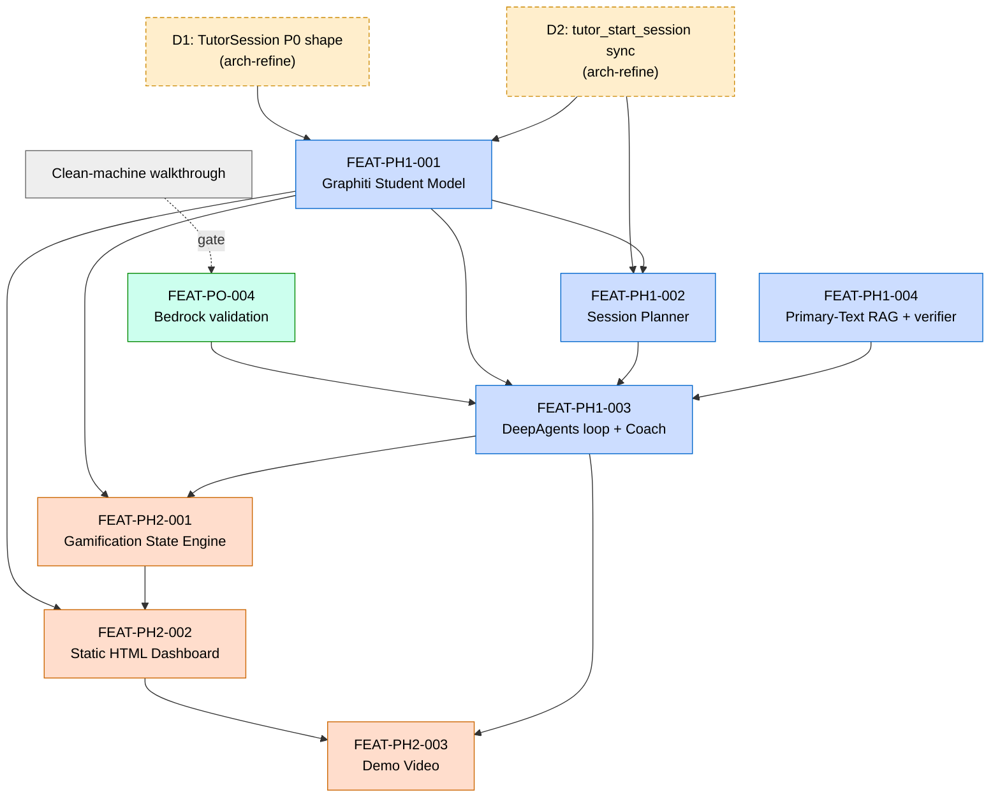
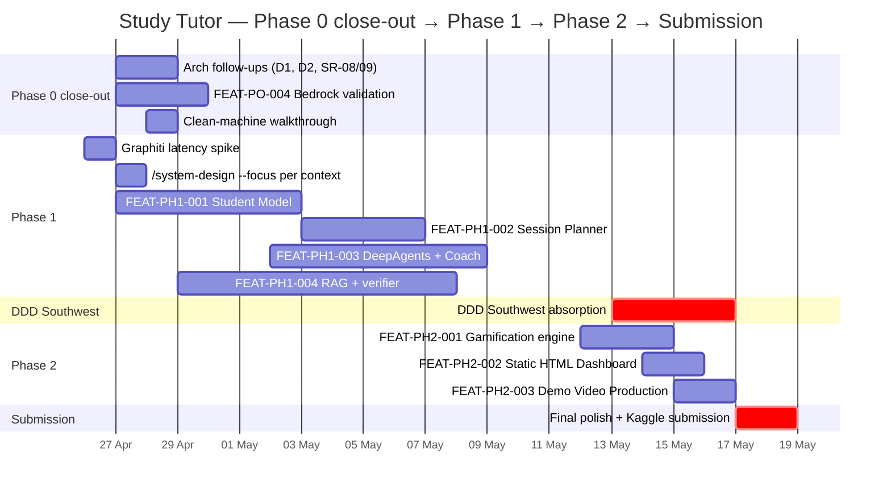

# Study Tutor — Feature Roadmap

**Status:** Phase 0 → Phase 1 transition. Architecture + Phase 0 design canonical.
**Generated:** 2026-04-27 by `/system-plan` (refine mode → hand-off).
**Inputs:** [docs/design/README.md](../design/README.md), [docs/architecture/ARCHITECTURE.md](../architecture/ARCHITECTURE.md), [docs/research/ideas/phase-0-scope.md](../research/ideas/phase-0-scope.md), [docs/research/ideas/phase-0-build-plan.md](../research/ideas/phase-0-build-plan.md), [docs/research/ideas/phase-1-scope.md](../research/ideas/phase-1-scope.md), [docs/research/ideas/phase-2-scope.md](../research/ideas/phase-2-scope.md).
**Consumed by:** `/feature-spec`, `/feature-plan`, `/feature-build`, `/task-work`.
**Deadline anchor:** 2026-05-18 23:59 UTC (Gemma 4 Good Hackathon submission).

---

## 1. Why this document exists

`/system-plan` was invoked after `/system-design` shipped Phase 0 contracts. The architecture (16 ADRs, 6 bounded contexts, 12 cross-cutting concerns) and the Phase 0 design (Tutoring + Inference Runtime + MCP Transport contracts/data-models + Shared Kernel B events) are both canonical. **No architecture refinement is needed today.**

What this document does:

- Translates the open punch-list (Phase 0 close-out) and Phase 1 / Phase 2 scope into ready-to-execute `/feature-spec` and `/feature-plan` invocations.
- Identifies the two **architecture follow-ups (D1, D2)** that should land before Phase 1 wires Graphiti — these are `/arch-refine` candidates, not new ADRs.
- Sequences features along the critical path with explicit dependencies.
- Makes the Shared Kernel B event vocabulary the contract surface every Phase 1 feature respects.

This is **not** a re-statement of scope. The phase scope docs remain the authoritative feature definitions. This document is a thin sequencing layer over them.

## 2. Architecture follow-ups (do before Phase 1 Graphiti)

Both decisions surfaced during the 2026-04-26 `/system-design` run. Captured in [phase-0-build-plan.md punch-list item 7](../research/ideas/phase-0-build-plan.md). Neither requires a new ADR — both fit within the existing architecture envelope. Both should land via `/arch-refine` before Phase 1 wires the Graphiti student model.

| Tag | Action | Affected artefacts | Trigger |
|---|---|---|---|
| **D1** | Document `TutorSession` Phase-0 shape only; defer P1 fields | [docs/architecture/domain-model.md](../architecture/domain-model.md) §7.1, [docs/design/models/DM-tutoring.md](../design/models/DM-tutoring.md) | Already true in code; needs note that P1 fields (`student_id`, `grade_target`, `paper`, `aos_scaffolded`, `rag_chunks_used`, `TurnFeedback`, `SessionSummary`) are deferred to a `/system-design --focus="Tutoring"` re-run |
| **D2** | Reclassify `tutor_start_session` from `long-running` → `sync` | [docs/architecture/domain-model.md](../architecture/domain-model.md) §7.1 (SR-07), [docs/research/ideas/phase-0-scope.md](../research/ideas/phase-0-scope.md) §SR-07 | Live behaviour returns `session_id` synchronously; warm-up is fire-and-forget, not a polled task |

**Recommended `/arch-refine` invocation (one session, both items):**

```bash
/arch-refine \
  --target docs/architecture/domain-model.md \
  --context docs/design/README.md \
  --context docs/research/ideas/phase-0-build-plan.md
```

If Phase 1 shows `tutor_start_session` reads from Graphiti push end-to-end past 1s, D2 reverts and SR-07 stays `long-running`.

## 3. Phase 0 close-out (this week)

Two items remain. Neither is a new feature — both are gates against existing scope.

| Item | Type | Owner | Command |
|---|---|---|---|
| **FEAT-PO-004** Bedrock validation | Existing scope feature | Rich (AWS ops + LLM client wiring) | `/feature-spec` + `/feature-plan` per [phase-0-build-plan.md §"GuardKit Command Sequence"](../research/ideas/phase-0-build-plan.md) |
| **Clean-machine walkthrough** | Gate | Rich (manual) | Manual run; log to [.claude/reviews/TASK-REV-PH0-walkthrough-log.md](../../.claude/reviews/TASK-REV-PH0-walkthrough-log.md) |

**FEAT-PO-004 invocation:**

```bash
/feature-spec "AWS Bedrock Custom Model Import Path — S3 upload, model import, provider integration in LLM client, LiteLLM proxy for OpenWebUI, validation smoke test" \
  --context docs/research/ideas/phase-0-scope.md \
  --context docs/research/ideas/decisions-log-2026-04-17.md \
  --context docs/design/contracts/API-inference-runtime.md \
  --context src/study_tutor/llm/client.py

/feature-plan "AWS Bedrock Custom Model Import Path" \
  --context features/aws-bedrock-custom-model-import/aws-bedrock-custom-model-import_summary.md
```

Bedrock-out contingency (TASK-CDR-005) stands: if eu-west-2 lacks 31B import support, demo runs Ollama/GB10. ADR-ARCH-006 covers both paths.

## 4. Phase 1 features (weekend 26 Apr → Fri 11 May)

Three features that turn the MCP-accessible tutor into a genuinely three-layer adaptive system. Plus FEAT-PH1-004 absorbs the Phase 0 RAG grounding work (TASK-PO02F-001) backed by the [2026-04-23 OpenWebUI empirical findings](../research/ideas/openwebui-rag-empirical-findings-2026-04-23.md).

| Feature | Bounded context(s) | Architecture refs | Live phase for events |
|---|---|---|---|
| **FEAT-PH1-001** Graphiti Student Model | Student Model | ADR-ARCH-003 (async write-back), ADR-ARCH-007 (split topology), CC-11 (events bus) | `session.started`, `session.turn_completed`, `session.completed` |
| **FEAT-PH1-002** Session Planner | Tutoring (reads Student Model) | ADR-ARCH-002 (three-layer), ADR-ARCH-012 (deepagents 0.5.3) | None (planner is sync side of `tutor_start_session`) |
| **FEAT-PH1-003** DeepAgents Tutoring Loop with Coach | Tutoring + Inference Runtime | ADR-ARCH-012 (AsyncSubAgent Coach), CC-08 (fire-and-forget), CC-12 (async subagent boundary) | Coach evaluates `session.turn_completed`; produces `quality_score` for `session.completed` |
| **FEAT-PH1-004** Primary-Text RAG + Source-Typed Quote Verification | Knowledge & Curriculum + Tutoring | ADR-ARCH-002 (Layer 2), CC-09 (safeguarding), CC-10 (copyright/provenance) | None directly; verifier feeds Coach output |

**New cross-cutting requirements introduced in Phase 1** (per [phase-1-scope.md](../research/ideas/phase-1-scope.md)):

- **SR-08** Graphiti write-back asynchrony — session-end write must not block `tutor_session_end` reply.
- **SR-09** Runtime LLM parameters are explicit and asserted — no implicit defaults at the boundary.

These need to be added to [docs/architecture/ARCHITECTURE.md §6](../architecture/ARCHITECTURE.md#6-cross-cutting-concerns-12) (rename to "Cross-cutting concerns (14)") in a Phase 1 `/arch-refine` pass — bundle with D1/D2 if landing before the Phase 1 weekend.

**Phase 1 sequencing (critical path):**

```
Sat 26 Apr morning:    Graphiti latency spike (FEAT-PH1-001 §1)
Sat 26 Apr afternoon:  /system-design --focus="Knowledge & Curriculum"
                       /system-design --focus="Student Model"
Sat 26 Apr eve:        FEAT-PH1-001 schema + seeding kicks off
Sun 27 Apr:            FEAT-PH1-002 + FEAT-PH1-003 player loop
Mon–Fri eves:          FEAT-PH1-004 (RAG + quote verifier) + FEAT-PH1-003 Coach completion
```

**Recommended `/feature-spec` invocations (run after Sat 26 Apr morning `/system-design --focus` re-runs):**

```bash
/feature-spec "Graphiti Student Model — schema, seeding, query helpers, async write-back at session-end" \
  --context docs/research/ideas/phase-1-scope.md \
  --context docs/architecture/decisions/ADR-ARCH-003-async-graphiti-writeback.md \
  --context docs/architecture/decisions/ADR-ARCH-007-graphiti-split-topology.md \
  --context docs/design/events-schema.yaml \
  --context .guardkit/graphiti.yaml

/feature-spec "Session Planner — reads Student Model, writes plan into tutor_start_session, deterministic-first" \
  --context docs/research/ideas/phase-1-scope.md \
  --context docs/design/contracts/API-tutoring.md \
  --context docs/design/models/DM-tutoring.md

/feature-spec "DeepAgents Tutoring Loop with Coach — Player-Coach quality monitor, AsyncSubAgent boundary, session.turn_completed evaluation" \
  --context docs/research/ideas/phase-1-scope.md \
  --context docs/architecture/decisions/ADR-ARCH-012-deepagents-0-5-3-asyncsubagent-coach.md \
  --context roles/tutor/criteria/definitions.yaml \
  --context docs/design/events-schema.yaml

/feature-spec "Primary-Text RAG + Source-Typed Quote Verification — corpus ingestion, dynamic retrieval, AO3 bypass, quote verifier" \
  --context docs/research/ideas/phase-1-scope.md \
  --context docs/research/ideas/rag-grounding-design.md \
  --context docs/research/ideas/openwebui-rag-empirical-findings-2026-04-23.md
```

Each `/feature-spec` is followed by `/feature-plan "<feature title>" --context features/<slug>/<slug>_summary.md`.

## 5. Phase 2 features (12–16 May)

Sketch only — Phase 2 build plan written 1 May per [hybrid cadence](../research/ideas/planning-cadence-hybrid-approach.md). Scope from [phase-2-scope.md](../research/ideas/phase-2-scope.md).

| Feature | Bounded context | Notes |
|---|---|---|
| **FEAT-PH2-001** Gamification State Engine | Gamification | Deterministic rules engine. ADR-ARCH-013 (Proposed → Accepted at Phase 2 kickoff). Consumes `session.completed`; emits `achievement.unlocked`, `quest.completed`, `quest.expired`, `boss_battle.completed`. |
| **FEAT-PH2-002** Static HTML Dashboard via Claude Design | Reporting (cross-context) | Reads `session-export.json` produced at Phase 1 session-end. Pure static HTML. |
| **FEAT-PH2-003** Demo Video Production | Submission | Not code; uses [docs/submission/demo-script.md](../submission/demo-script.md) and [docs/submission/video-outline.md](../submission/video-outline.md) skeletons from Phase 0 FEAT-PO-005. |

Phase 2 invocations are deferred — generate them in the Phase 2 `/system-plan` re-run on 1 May.

## 6. Feature dependency graph



_Look for: D1/D2 are dashed because they are `/arch-refine` follow-ups, not features. PH1-001 is the single biggest fan-out — every Phase 1 and Phase 2 feature depends on the Graphiti student model landing first. PH1-003 is the integration sink for everything in Phase 1._

## 7. Phase timeline



_Look for: DDD Southwest 13–16 May absorbs ~4 days of focus during Phase 2; FEAT-PH2-001/002 must complete before then. Bedrock validation (PO-004) overlaps with Phase 1 Graphiti spike — both can run in parallel because they touch different bounded contexts (Inference Runtime vs Student Model)._

## 8. Recommended next commands (in order)

```bash
# 1. Architecture follow-ups (D1 + D2 + SR-08/09 in one session)
/arch-refine \
  --target docs/architecture/domain-model.md \
  --context docs/design/README.md \
  --context docs/research/ideas/phase-0-build-plan.md \
  --context docs/research/ideas/phase-1-scope.md

# 2. Close out Phase 0
/feature-spec "AWS Bedrock Custom Model Import Path" --context docs/research/ideas/phase-0-scope.md ...
/feature-plan "AWS Bedrock Custom Model Import Path" --context features/.../...

# 3. Phase 1 design re-runs (after Sat 26 Apr morning Graphiti latency spike)
/system-design --focus="Knowledge & Curriculum" \
  --from docs/architecture/ARCHITECTURE.md \
  --context docs/research/ideas/phase-1-scope.md \
  --context docs/research/ideas/rag-grounding-design.md \
  --context docs/research/ideas/openwebui-rag-empirical-findings-2026-04-23.md

/system-design --focus="Student Model" \
  --from docs/architecture/ARCHITECTURE.md \
  --context docs/research/ideas/phase-1-scope.md

# 4. Phase 1 feature work (one /feature-spec + /feature-plan per feature, in dependency order)
#    See § 4 above for full invocations.

# 5. Phase 2 system-plan re-run (1 May per hybrid cadence)
/system-plan \
  --from docs/design/README.md \
  --context docs/architecture/ARCHITECTURE.md \
  --context docs/research/ideas/phase-2-scope.md
```

## 9. Conformance check

✓ No contradictions against the 16 Phase 0 ADRs.
✓ Shared Kernel B (Events) producer/consumer roles match [docs/design/events-schema.yaml](../design/events-schema.yaml) — Tutoring emits `session.*`, Gamification emits `achievement.*` / `quest.*` / `boss_battle.*`. FEAT-PH1-001 wires the in-process bus that CC-11 reserved.
✓ Critical path honours ADR-ARCH-016 (deadline as load-bearing): Bedrock validation finishes before DDD Southwest absorbs focus; Phase 2 gamification + dashboard close before submission week.
✓ ADR-ARCH-013 (gamification engine future) flips Proposed → Accepted at Phase 2 kickoff.

## 10. What this document does **not** cover

- **Reachy Mini stretch** — gated to 2026-05-04 per DEC-06; tracked separately at [reachy-integration-conversation-starter.md](../research/ideas/reachy-integration-conversation-starter.md).
- **Multi-subject expansion** — post-hackathon (DEC-05). Single role (`tutor`) only through 18 May.
- **Per-task TDD/micro mode** — handled by `/task-work` per task; this document only sequences features.
- **Submission narrative content** — populated incrementally per [phase-0-scope.md FEAT-PO-005](../research/ideas/phase-0-scope.md); roadmap touches the *infrastructure* for the submission, not the prose.

---

*Generated: 2026-04-27 by `/system-plan` (refine mode → hand-off).*
*Next:* `/arch-refine` for D1/D2 + SR-08/09, then Phase 1 design re-runs, then per-feature `/feature-spec` → `/feature-plan` → `/feature-build` or `/task-work`.
