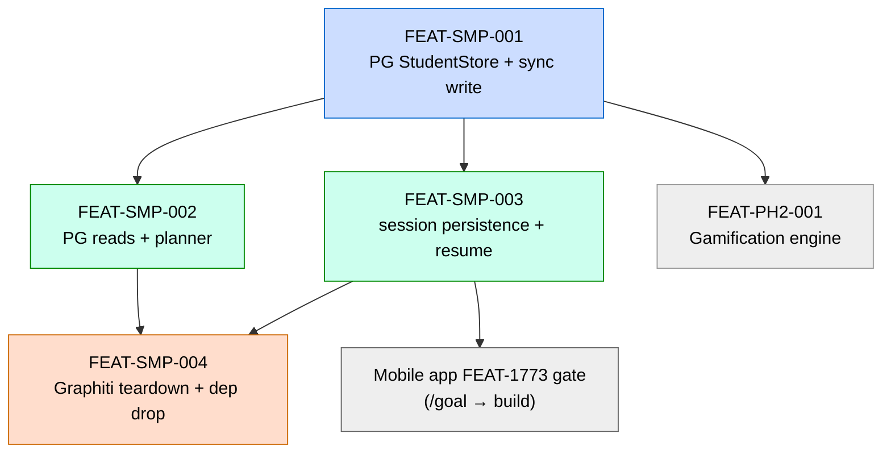

# Student Model → Postgres Migration — Scope + Build Plan

**Status:** Ready for `/feature-spec`. Decision canonical ([ADR-ARCH-023](../../architecture/decisions/ADR-ARCH-023-student-model-postgres-jsonb-drop-graphiti.md)).
**Generated:** 2026-07-02.
**Decision:** [ADR-ARCH-023](../../architecture/decisions/ADR-ARCH-023-student-model-postgres-jsonb-drop-graphiti.md) — drop Graphiti/FalkorDB; adopt a study-tutor-owned Postgres (JSONB) student store; writes revert to synchronous; **start fresh** (no data migration).
**Inputs:** [ADR-ARCH-023](../../architecture/decisions/ADR-ARCH-023-student-model-postgres-jsonb-drop-graphiti.md), [gamification/design.md §11](../../gamification/design.md), [phase-1-scope.md §FEAT-PH1-001](./phase-1-scope.md), the existing FEAT-1773 code (`knowledge/student_model.py`, `queries.py`, `async_write.py`), [mobile+voice handoff](../../handoffs/study-tutor-mobile-voice-conversation-starter.md).
**Consumed by:** `/feature-spec` → `/feature-plan` → `/feature-build`/`/task-work`.

---

## 1. Why this document exists

[ADR-ARCH-023](../../architecture/decisions/ADR-ARCH-023-student-model-postgres-jsonb-drop-graphiti.md) decided the *what* and *why*. This doc is the thin sequencing layer that turns it into ready-to-run `/feature-spec` invocations, in dependency order, using the pattern that has worked for the agent-side changes (scope → per-feature `/feature-spec --context …` → `/feature-plan` → build).

**It re-platforms FEAT-1773** (the student persistence layer). The original FEAT-1773 shipped the Graphiti implementation; this cluster replaces the *persistence mechanism* while keeping the *contract*.

## 2. The migration shape (why this is low-risk)

The student model is already split cleanly, which makes this an **adapter swap behind a stable Pydantic contract**, not a re-model:

| Layer | Today | After | Change |
|---|---|---|---|
| **Entity schema** — `knowledge/student_model.py` | 7 Pydantic entities + relationship/group-id constants + `confidence_band_for`. **Already stack-agnostic — does not import graphiti-core.** | Same file, unchanged (or near). Becomes the table/JSONB contract. | **~none** |
| **Write path** — `knowledge/async_write.py` (`GraphitiWriteHelper` F1/F2/F3, fire-and-forget, CC-13) | LLM-extraction `add_episode`, ~79s, async fire-and-forget | A `StudentStore` port + Postgres adapter; **synchronous** transactional session-end write | replace |
| **Read path** — `knowledge/queries.py` (`_read_student_partition` seam) | graphiti-core `get_by_group_ids` partition enumeration | SQL reads behind the **same seam**; timeout + stale-flag + `client=None` degradation preserved | replace behind seam |
| **Graph plumbing** — `graphiti_client.py`, `episodes.py`, `seed_uuids.py` | Graphiti episodes + UUID5 keys | deleted | delete |
| **Events** — Shared Kernel B (`session.*`) | emitted on state transition ([DDR-003](../../design/decisions/DDR-003-session-completed-emits-on-state-transition.md)) | **unchanged** | none |

_Look for: the `_read_student_partition` single-seam and the `group_id → student_id` mapping are the two load-bearing seams. Keep them; swap what's behind them._

## 3. Scope

**In:**
- Postgres schema (tables + JSONB) + migrations (Alembic) for the §11 entities (Student, Topic/TopicConfidence, Achievement, Quest, Session, Misconception).
- `StudentStore` port + Postgres adapter (ports/adapters style, matching the tutoring/coach adapters).
- Synchronous session-end write (XP/streak/confidence-delta/achievement-check in one transaction).
- SQL read helpers (`get_student_state`, per-topic confidence distribution for the planner).
- Student-keyed, **cross-device-resumable** session persistence (the mobile FEAT-1773 gate).
- Graphiti/FalkorDB code + dependency removal; `.env`/config swap.

**Out:**
- Data migration (**start fresh** — ADR-ARCH-023 D3).
- fleet-memory / NATS / embedder for learner state (ADR-ARCH-023 D4 — study-tutor stays independently deployable).
- The gamification **engine** (FEAT-PH2-001) — a downstream *consumer* of this store, unchanged in scope.
- The ChromaDB corpus / retrieval ([ADR-ARCH-022](../../architecture/decisions/ADR-ARCH-022-corpus-retrieval-lexical-path-defer-agentic-tool.md)) — separate store, untouched.

## 4. Feature decomposition

| Feature | Gist | Depends on |
|---|---|---|
| **FEAT-SMP-001** Postgres StudentStore — schema + sync write | JSONB schema + Alembic; `StudentStore` port + PG adapter; synchronous session-end write replacing `GraphitiWriteHelper`. Foundation. | — |
| **FEAT-SMP-002** Postgres reads + planner wiring | SQL reads behind `_read_student_partition`; confidence distribution feeds the session planner. | SMP-001 |
| **FEAT-SMP-003** Student-keyed session persistence + cross-device resume | Durable sessions keyed to student, resumable phone↔robot; session-contract behind the MCP + HTTP/WS adapter. **The mobile FEAT-1773 gate.** | SMP-001 |
| **FEAT-SMP-004** Graphiti/FalkorDB teardown + dep drop | Delete graph plumbing, retire CC-13 machinery, drop `graphiti-core[falkordb]`, config swap. **Last.** | SMP-001/002/003 green |

## 5. Sequencing (waves)

```
G-ADR  /arch-refine   ADR-ARCH-023 Proposed→Accepted    ── before W1 (§5a)
W0  Postgres infra                               ── stand up per RUNBOOK; dev-local first, durable NAS before W1 tests
W1  FEAT-SMP-001  (schema + sync write)          ── foundation, blocks all
G-CON  /design-refine session contract §10             ── before FEAT-SMP-003 (§5a)
W2  FEAT-SMP-002  (reads + planner)   ‖  FEAT-SMP-003  (session persistence + resume)
W3  FEAT-SMP-004  (teardown + dep drop)           ── only after W1+W2 are green
```

**W0 — infra prerequisite:** stand up the dedicated study-tutor Postgres per [RUNBOOK-study-tutor-postgres-deploy.md](../runbooks/RUNBOOK-study-tutor-postgres-deploy.md) (JSONB, no pgvector, own instance/volume/port 5433, nightly `pg_dump` required). A throwaway local container is enough to develop/test FEAT-SMP-001; the durable NAS instance must exist before W1's write path is validated against real persistence. FEAT-SMP-001 productizes the runbook's Phase 2–3 blocks into `deploy/postgres/deploy.sh` + `smoke.sh`.

Mirrors the guardkit cutover that worked: **adapter/schema → writes → reads → delete the old last**, a working system at every wave. Because study-tutor is a *soft* dependency, W3 can land on its own schedule, decoupled from the fleet-wide Graphiti decommission.



## 5a. Ratification gates (Proposed → Accepted, before the dependent build)

Two artefacts in this cluster are **`Proposed`** and must be ratified with the project's refine commands *before* the `/feature-spec` that builds against them — otherwise the build proceeds against an un-accepted decision/contract.

| Gate | Command | Ratifies | Blocks |
|---|---|---|---|
| **G-ADR** | `/arch-refine` | [ADR-ARCH-023](../../architecture/decisions/ADR-ARCH-023-student-model-postgres-jsonb-drop-graphiti.md) `Proposed → Accepted`; flip ADR-003/007/019 to `superseded` and note ADR-021's CC-13 retirement | W1 (FEAT-SMP-001) |
| **G-CON** | `/design-refine` | [API-session-cross-device.md §10](../../design/contracts/API-session-cross-device.md) — the [ADR-ARCH-008](../../architecture/decisions/ADR-ARCH-008-mcp-only-agent-access.md) partial supersession (HTTP/WS for app clients per ADR-FLEET-003), relaxing API-tutoring's "end-once/append-only", and the §9 closed-set extension (`SessionForbidden` / `Unauthenticated`) | FEAT-SMP-003 |

```bash
# G-ADR — flip ADR-ARCH-023 to Accepted before W1 builds against it
/arch-refine \
  --target docs/architecture/decisions/ADR-ARCH-023-student-model-postgres-jsonb-drop-graphiti.md \
  --context docs/research/ideas/student-model-postgres-migration-scope-and-build-plan.md \
  --context docs/gamification/design.md

# G-CON — ratify the cross-device session contract before FEAT-SMP-003
/design-refine \
  --target docs/design/contracts/API-session-cross-device.md \
  --context docs/design/contracts/API-tutoring.md \
  --context docs/architecture/decisions/ADR-ARCH-023-student-model-postgres-jsonb-drop-graphiti.md \
  --context docs/handoffs/study-tutor-mobile-voice-conversation-starter.md
```

(ADR-ARCH-022, also `Proposed`, is the *retrieval* decision — out of this cluster; ratify it via `/arch-refine` on its own track, it does not gate the SMP build.)

## 6. `/feature-spec` invocations (run in wave order)

Each is followed by `/feature-plan "<title>" --context features/<slug>/<slug>_summary.md`.

```bash
# ── W1 ─────────────────────────────────────────────────────────────────────
/feature-spec "Student Model Postgres Store — JSONB schema + Alembic migrations, StudentStore port + Postgres adapter, synchronous transactional session-end write (replaces GraphitiWriteHelper F1/F2/F3), reusing the persistence-agnostic Pydantic entities" \
  --context src/study_tutor/knowledge/store/port.py \
  --context src/study_tutor/knowledge/store/entities.py \
  --context src/study_tutor/knowledge/store/postgres.py \
  --context src/study_tutor/knowledge/store/schema_reference.sql \
  --context docs/research/ideas/student-model-postgres-migration-scope-and-build-plan.md \
  --context docs/architecture/decisions/ADR-ARCH-023-student-model-postgres-jsonb-drop-graphiti.md \
  --context docs/gamification/design.md \
  --context src/study_tutor/knowledge/student_model.py \
  --context src/study_tutor/knowledge/async_write.py \
  --context src/study_tutor/knowledge/episodes.py \
  --context docs/design/decisions/DDR-003-session-completed-emits-on-state-transition.md \
  --context docs/design/events-schema.yaml

# ── W2 ─────────────────────────────────────────────────────────────────────
/feature-spec "Student Model Postgres Reads — implement the store-backed read helpers (reads.get_student_state, load_planner_inputs) + the recommend_topics ranking lifted from queries.py; repoint queries.py callers at store.reads and delete the graphiti _read_student_partition seam; preserve graceful degradation (no store / read failure -> empty, never raises)" \
  --context src/study_tutor/knowledge/store/reads.py \
  --context src/study_tutor/knowledge/store/provider.py \
  --context src/study_tutor/knowledge/store/port.py \
  --context docs/research/ideas/student-model-postgres-migration-scope-and-build-plan.md \
  --context docs/architecture/decisions/ADR-ARCH-023-student-model-postgres-jsonb-drop-graphiti.md \
  --context src/study_tutor/knowledge/queries.py \
  --context src/study_tutor/knowledge/student_model.py \
  --context src/study_tutor/planner/protocols.py \
  --context src/study_tutor/planner/pipeline.py

# G-CON (gate) — ratify the session contract BEFORE building FEAT-SMP-003 (see §5a)
/design-refine \
  --target docs/design/contracts/API-session-cross-device.md \
  --context docs/design/contracts/API-tutoring.md \
  --context docs/architecture/decisions/ADR-ARCH-023-student-model-postgres-jsonb-drop-graphiti.md \
  --context docs/handoffs/study-tutor-mobile-voice-conversation-starter.md

/feature-spec "Student-keyed Session Persistence + Cross-Device Resume — durable session records keyed to student, resumable across devices (phone<->robot), session contract (start/list/resume/turn/status/end) behind the MCP + HTTP/WS adapter; satisfies the FEAT-1773 gate the mobile client depends on" \
  --context docs/design/contracts/API-session-cross-device.md \
  --context src/study_tutor/session/service.py \
  --context src/study_tutor/session/errors.py \
  --context src/study_tutor/session/provider.py \
  --context docs/research/ideas/student-model-postgres-migration-scope-and-build-plan.md \
  --context docs/architecture/decisions/ADR-ARCH-023-student-model-postgres-jsonb-drop-graphiti.md \
  --context docs/handoffs/study-tutor-mobile-voice-conversation-starter.md \
  --context docs/design/contracts/API-tutoring.md \
  --context docs/design/models/DM-tutoring.md \
  --context src/study_tutor/mcp/adapter.py \
  --context src/study_tutor/session/tutor_session.py \
  --context .guardkit/features/FEAT-1773.yaml

# ── W3 (after W1+W2 green) ─────────────────────────────────────────────────
/feature-spec "Graphiti/FalkorDB Teardown — delete graphiti_client/episodes/seed_uuids and the GraphitiWriteHelper graph path, retire the CC-13 single-call-site machinery, drop graphiti-core[falkordb] from pyproject, swap .env to a Postgres DSN; events bus (DDR-003) unchanged" \
  --context docs/research/ideas/student-model-postgres-migration-scope-and-build-plan.md \
  --context docs/architecture/decisions/ADR-ARCH-023-student-model-postgres-jsonb-drop-graphiti.md \
  --context src/study_tutor/knowledge/async_write.py \
  --context src/study_tutor/knowledge/graphiti_client.py \
  --context src/study_tutor/knowledge/seed_uuids.py \
  --context pyproject.toml
```

## 7. Cross-cutting / ADRs to reconcile

- **Supersede** ADR-ARCH-003 / -007 / -019 (async Graphiti write-back); **retire** the CC-13 single-`add_episode` invariant of ADR-ARCH-021 — folded into FEAT-SMP-004. Set their `Status: superseded` when W3 lands.
- **SR-08** (write-back asynchrony) is retired by the sync write (D2). **SR-09** (explicit LLM params) is unaffected.
- **Keep** the events bus ([DDR-003](../../design/decisions/DDR-003-session-completed-emits-on-state-transition.md)); [DDR-001/DDR-002](../../design/decisions/) (Graphiti-write invisibility) become moot — note, don't chase.
- Update [feature-roadmap.md](../../planning/feature-roadmap.md) FEAT-PH1-001 row (Graphiti → Postgres).

## 8. Downstream gate — mobile app (`/goal` + Fable)

This cluster **is** the FEAT-1773 persistence gate the [mobile+voice slice](../../handoffs/study-tutor-mobile-voice-conversation-starter.md) blocks on (cross-device pickup is impossible without it). Recommended interlock:

1. **Freeze the session contract in FEAT-SMP-003** — `start/turn/status/end`, streaming semantics for `turn`, and how session identity binds to the student (handoff D6/D7/D8; the handoff already *resolves* Flutter, thin-client, shared GB10 voice backend, no-MCP-in-voice-loop, so this is contract-shaping, not re-litigation).
2. **Then run the mobile `/goal` against that frozen contract**, using **Fable** as the attended frontier model (per handoff DF-003), carrying Fable through `/system-arch` → `/system-design` (the divergent, product-shaping steps). Hand off to `/feature-spec` → `/feature-plan` → AutoBuild on the workhorse model (convergent/mechanical); for the Flutter build itself prefer a Flutter/Dart-strong model (D2's "lower-hallucination substrate" intent).
3. `/goal` opener = the mobile handoff + the frozen FEAT-SMP-003 session contract + ADR-FLEET-003 (MCP-vs-HTTP/WS boundary).

_Look for: persistence-first removes the largest rework risk for the mobile build — the client is designed against a real, stable API rather than a moving one._

---

*Generated 2026-07-02. Next: run the W1 `/feature-spec` + `/feature-plan`, then W2 in parallel, then W3.*
</content>
