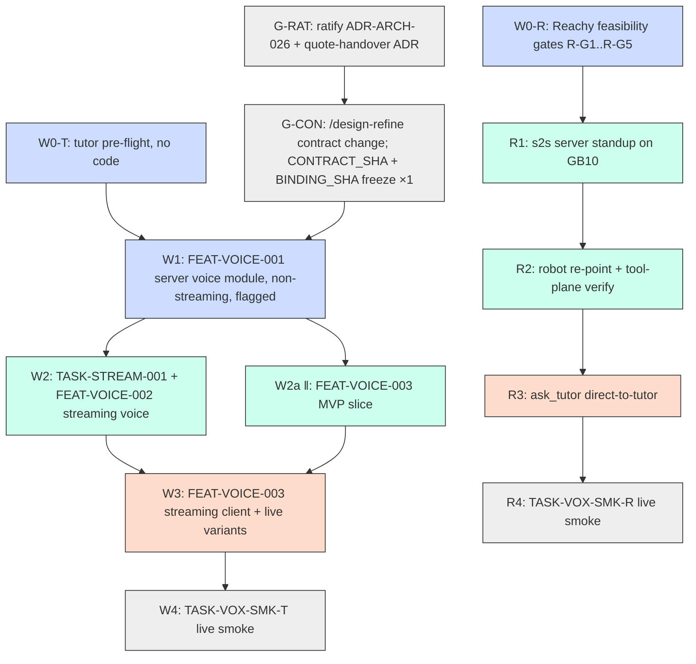

# Voice — Tutor Voice (server + Flutter) and Reachy Local Migration — Scope + Build Plan

**Status:** Drafted 2026-07-05; **G-RAT + G-CON executed 2026-07-05** (§0) — next action is **W0-T / W0-R discovery (§9 Step 3)**. Living status in §0.
**Voice-phase contract pins (authoritative consumption point):** `CONTRACT_SHA=574615e916bfacafd014b2a0027b47cdf20d8f4a` (contract Rev 1) · `BINDING_SHA=e50897d12470b9f7c9455d5c5836f0d7ee298a50` (binding Rev 1). *Local commits — finalized on push ("frozen once pushed"); do not amend/rebase them or the pins invalidate. Phase-2 pins (`22791afb…`/`6eb7b88c…`) remain the historical record of what phase 2 verified.*
**Generated:** 2026-07-05 · **status refreshed:** 2026-07-05
**Design:** [voice-tutor-and-reachy-design.md](../../design/voice-tutor-and-reachy-design.md) — closes the blueprint's open decisions (streaming-first contract, Starlette port map, audio delivery, quote-handover recommendation) and adds the Reachy track
**Decision authority:** [unified-voice-orientation.md](unified-voice-orientation.md) (ratified pins) · [ADR-ARCH-024 r1](../../architecture/decisions/ADR-ARCH-024-voice-stt-cache-aware-streaming-multilingual-deferred.md) · [voice-implementation-blueprint.md](../../design/voice-implementation-blueprint.md) — **do not re-open pins here**
**Inputs:** [ADR-ARCH-026](../../architecture/decisions/ADR-ARCH-026-player-coach-async-coach-monitor-streaming-ready.md) (Proposed — gated) · [TASK-STREAM-001](../../../tasks/backlog/TASK-STREAM-001-tutor-turn-token-streaming.md) · [API-session-http-binding.md](../../design/contracts/API-session-http-binding.md) · [conversation starter](../../handoffs/study-tutor-mobile-voice-conversation-starter.md) · [flutter-app-phase2-build-plan.md](flutter-app-phase2-build-plan.md) (this plan is its phase-3 successor)
**Consumed by:** `/design-refine` (G-CON) → `/feature-spec` → `/feature-plan` → `/feature-build`|`/task-work` per wave

---

## 0. Status (2026-07-05)

| Item | State | Record |
|---|---|---|
| GB10 audio endpoints (`parakeet-tdt-0.6b-v3`, `qwen3-tts-0.6b` behind `:9000`) | **Live, smoked** | `lpa-platform-poc` RUNBOOK/RESULTS-gb10-voice-unified-2026-07 |
| LPA reference implementation (~230 tests) + live smoke TASK-VOICE-011 | **Done** (lift, don't rebuild) | blueprint §3 |
| ADR-ARCH-024 r1 | **Accepted** | — |
| ADR-ARCH-026 (async Coach — streaming precondition) | **Accepted** — G-RAT executed 2026-07-05 | `fdb2878` |
| Quote-handover decision (design §5.4 recommendation) | **Decided** — [ADR-ARCH-027](../../architecture/decisions/ADR-ARCH-027-streaming-quote-handover-chunk-boundary-verification.md) (chunk-boundary verification) | `fdb2878` |
| Contract change + CONTRACT_SHA/BINDING_SHA re-freeze, once (design §8) | **Done** — contract Rev 1 + binding Rev 1; SHAs in the header above (local commits, finalized on push) | `574615e` · `e50897d` |
| W0-T pre-flight (tutor) / W0-R feasibility gates (Reachy, incl. R-G5 resident-set posture) | **Not run — NEXT** | §5 |
| FEAT-VOICE-001…004 | **Not specced** | §4 |

Detailed, ordered actions in **§9**.

## 1. Why this document exists

The [blueprint](../../design/voice-implementation-blueprint.md) says what to lift from
the LPA and in what phase order; the [design](../../design/voice-tutor-and-reachy-design.md)
closes the remaining decisions and adds the Reachy track. This is the thin sequencing
layer that turns both into scoped features, ratification gates, and ready-to-run
`/feature-spec` invocations — for the two consumers the owner asked to build now:
the **Flutter app** (tap-to-talk tutor voice) and the **Reachy Mini** (local voice,
direct to the tutor, no Jarvis in the loop).

## 2. The shape (why this is lower-risk than it looks)

| Layer | Today | After | Change |
|---|---|---|---|
| GB10 audio serving | Live: discrete `/v1/audio/*` behind llama-swap `:9000`, persistent group | Same, untouched | **None** (consume) |
| study-tutor server | Six JSON verbs on `:8100` (Starlette); `turn_stream` stub raises `NotImplementedError` | + `voice/` package, `voice-turn`/`voice-audio` routes, WS turn with token+voice frames | New package + TASK-STREAM-001; contract freeze ×1 |
| Flutter app | Text-only; zero audio deps; no mic/network perms in release manifest | + tap-to-talk, playback queue, streaming client; 3 new deps | Additive; DoD scope event |
| Reachy voice plane | HF-cloud Realtime session (minor's voice off-premises) | s2s server on GB10 `:8765`, robot re-pointed via 2 env keys | New GB10 unit; **config-only** on the robot |
| Reachy tool plane | `ask_jarvis` → NATS → Jarvis; `query_student_model` | + `ask_tutor` → HTTP `:8100` direct; rest untouched | One new tool file; profile `tools.txt` edit |
| Jarvis | In the robot's tutoring path | **Out of the tutoring path** | No Jarvis changes needed |

_Look for: every wave leaves a working system; the robot track never blocks on the app track's contract freeze._

## 3. Scope

**In:**
- Server `voice/` package (LPA port per design §5.1), non-streaming `voice_turn` behind `STUDY_TUTOR_VOICE_ENABLED`.
- The one contract change, executed at G-CON: voice routes (binding §2) + WS frame vocabulary (contract §7) + six voice `error_type`s (contract §9) across **both** frozen docs; `CONTRACT_SHA` and `BINDING_SHA` bumped together, once; TASK-STREAM-001 then implements against the frozen shape (design §8).
- TASK-STREAM-001 execution (existing backlog task, complexity 8) — `generate_stream`, WS transport, streaming contract-suite variants — plus voice's sentence-chunked TTS on that stream.
- Flutter tap-to-talk client + playback + degradation copy + hermetic/live test extensions (design §6).
- Reachy: s2s standup on the GB10, robot re-point, tool-plane verification, `ask_tutor` direct-to-tutor tool, Scholar profile update (design §7).
- Two operator-handoff live smokes with evidence (§8).

**Out:**
- Re-opening model pins, topology, or `:9100`/`:9200` — dead (ADR-ARCH-024 r1 / ADR-POC-015 r1).
- Phone open-mic/VAD/barge-in — the accepted ADR-ARCH-024 r1 trade; sole revisit trigger is open-mic/barge-in landing on the phone.
- On-device Gemma offline fallback — phase-2 keep-warm (conversation starter).
- LPA narration cache / batch jobs / donor-attorney plumbing — explicitly not ported (blueprint §3).
- Keycloak — D9 lands separately; interim single-user tokens serve both clients.
- Jarvis changes — it simply stops being in the tutoring path.
- LPA browser/React voice UI — different repo, already live-smoked.

## 4. Feature decomposition

| Feature | Gist | Depends on |
|---|---|---|
| **FEAT-VOICE-001** | Server voice module: `voice/` package, in-memory multipart validation (`python-multipart` direct pin), `AudioClient`, non-streaming `voice_turn` + `voice-audio` behind flag; contract-seam tests (mock transport, multipart pins) | G-RAT, G-CON, W0-T |
| **FEAT-VOICE-002** | Streaming voice: sentence-chunked TTS on the token stream, WS voice frames (`uvicorn[standard]`/websockets server dep), chunk-boundary quote verification — **executed jointly with TASK-STREAM-001**, implementing the shape already frozen at G-CON | FEAT-VOICE-001, TASK-STREAM-001 |
| **FEAT-VOICE-003** | Flutter voice client: deps + manifests, `VoiceApi` port/adapters/fakes, tap-to-talk UI, playback queue, degradation copy, hermetic + live test variants | G-CON (frozen contract); MVP path needs only FEAT-VOICE-001 |
| **FEAT-VOICE-004** | Reachy local voice: s2s unit on GB10, robot re-point, tool-call verification, `ask_tutor` tool (subject pinned to the app's constant), profile update, D3 residency closure | W0-R gates; **independent of 001–003 and of G-RAT/G-CON** |

Live smokes are `operator_handoff` tasks (AutoBuild cannot provision GPU serving —
the TASK-VOICE-011 pattern), written **before** building: `TASK-VOX-SMK-T` (tutor
voice, AC-V1..V3) and `TASK-VOX-SMK-R` (Reachy, AC-R1..R4). Task prefix `VOX` avoids
cross-repo confusion with lpa-platform-poc's `TASK-VOICE-*`.

## 5. Sequencing (waves)

```
{G-RAT ──► G-CON}  ‖  W0-T  ‖  W0-R          (the two gates and the two discovery sets run in parallel)

G-CON + W0-T ──► W1 (FEAT-VOICE-001) ──► W2 (TASK-STREAM-001 + FEAT-VOICE-002) ──► W3 (FEAT-VOICE-003 streaming) ──► W4 (TASK-VOX-SMK-T)
                                             ‖ W2a: FEAT-VOICE-003 MVP slice (against 001, fakes + dev deploy)

W0-R ──► R1 (s2s standup) ──► R2 (re-point + tools) ──► R3 (ask_tutor) ──► R4 (TASK-VOX-SMK-R)
         [R-track independent of the W-track and of G-RAT/G-CON; the only shared
          resource is the GB10 itself + quiet-GPU discipline]
```



**W0-T — tutor pre-flight (no code; blueprint §8 Phase 0).** `GET :9000/v1/models` lists both audio models; STT round-trips a known clip **including one in the Flutter recorder's actual output format (the m4a test)**; TTS `voice=Ryan` returns playable audio; `GET :9000/running` shows both `ready`. Record timings. *Gate: all four pass.*

**W0-R — Reachy feasibility gates.** Run against a **throwaway foreground s2s instance** — feasibility only; R1 later productionizes the passing configuration into the durable unit. R-G1 s2s installs and runs on GB10 aarch64/CUDA-13 (cu130 wheel first; bare-metal vs container decision); R-G2 `--qwen3_tts_model_name …0.6B-CustomVoice` works under the s2s qwen3 backend (fallback decision to owner if not); R-G3 tool calls round-trip through local s2s (`query_student_model` fires and is narrated); R-G4 memory arithmetic re-done against live steady state (TTS cold-start fails at ~110 GB used — measure, don't assume); R-G5 the robot's LLM resident-set posture decided (`gemma4-tutor` is on-demand `ttl: 1800` and lives only in the `tutor` set — promote it, add a robot set, or knowingly accept set-switch/cold-load thrash; design §7.2). *Gate: all pass or each failure has a recorded decision.*

**W1 — FEAT-VOICE-001.** Port per design §5.1; tutor envelope errors; seam tests pin the wire shape (multipart field/filename/content-type with codec params/model field — the "green but broken" defence); non-streaming `voice_turn` + `voice-audio` behind the flag. *Gate: full tutor suite green; seam tests pin the contract; flag off ⇒ routes 404.*

**W2 — TASK-STREAM-001 + FEAT-VOICE-002 (one joint effort).** `generate_stream` (the current `LLMClient` hardcodes `stream: False` and is bridged via `asyncio.to_thread` in the Player adapter — new path touching both seams, not a rework); WS `turn` implementing — and widening — the stubbed `turn_stream`/`TurnEvent` (design §5.2); `uvicorn[standard]`/websockets server dep pinned; sentence-chunked TTS emitting `audio_ref` frames; chunk-boundary quote verification per the G-RAT decision. **W2a in parallel:** Flutter MVP voice slice (deps, manifests, `VoiceApi`+fakes, tap-to-talk against non-streaming `voice_turn`). *Gate: streaming contract-suite variants green against the dev deploy (`RUNBOOK-study-tutor-http-dev-deploy.md`).*

**W3 — FEAT-VOICE-003 streaming client.** WS consumer, incremental token render, ordered chunk playback, degradation copy; live suite voice variants (`--concurrency=1`, quiet GPU). *Gate: `app/test_live/` voice variants green on device against the GB10.*

**W4 — TASK-VOX-SMK-T (operator handoff).** AC-V1..V3 (§8). *Gate: ACs hold; evidence + RESULTS written.*

**R1–R4 — Reachy track** (starts after W0-R; fully parallel to the W-track): systemd/docker s2s unit productionizing the W0-R configuration (digest-pinned, non-loopback bind, Ryan voice flag located and set) → `sitecustomize.py` env injection + `HF_REALTIME_CONNECTION_MODE=local`/`HF_REALTIME_WS_URL` re-point, open-mic latency + tool verification → `ask_tutor` tool (subject pinned to the app's constant — design §7.4) + Scholar `tools.txt`/persona update (reconcile repo-vs-Pi profile drift) → live smoke AC-R1..R4. *Gates per step; R4 evidence closes the D3 residency exception.*

## 5a. Ratification gates (before the dependent build)

| Gate | Command | Ratifies | Blocks |
|---|---|---|---|
| G-RAT | `/arch-refine` | ADR-ARCH-026 Proposed → Accepted **+** quote-handover decision (design §5.4) as ADR-ARCH-026 revision or new ADR | W1 onward (streaming precondition + handover shape). Does **not** block the R-track |
| G-CON | `/design-refine` | The executed contract change: binding §2 routes, contract §7 frames, contract §9 error set — **both docs re-frozen; `CONTRACT_SHA` + `BINDING_SHA` bumped together, once** | W1 (routes exist), W2a/W3 (app consumes). Does **not** block the R-track |

```bash
/arch-refine "Ratify ADR-ARCH-026 (async Coach) to Accepted and record the chunk-boundary quote-handover decision for streaming voice (design §5.4)" \
  --adr=ADR-ARCH-026 \
  --context docs/design/voice-tutor-and-reachy-design.md

/design-refine "Add voice routes (binding §2), the voice WS frame vocabulary (contract §7), and six voice error_types (contract §9) per the voice design §8; re-freeze both contract docs; CONTRACT_SHA and BINDING_SHA bumped together, once" \
  --context docs/design/contracts/API-session-cross-device.md \
  --context docs/design/contracts/API-session-http-binding.md \
  --context docs/design/voice-tutor-and-reachy-design.md \
  --context tasks/backlog/TASK-STREAM-001-tutor-turn-token-streaming.md
```

## 6. /feature-spec invocations (run in wave order)

```bash
# ── W1 ──────────────────────────────────────────────────────────────
/feature-spec "FEAT-VOICE-001 server voice module: port the lpa-platform-poc voice shape (config/client/errors/utils/validation/service) into src/study_tutor/voice/ on Starlette idioms per design §5.1; in-memory multipart parsing (never request.form() — Starlette spools >1MB parts to disk) with python-multipart as a direct pin; non-streaming POST voice-turn + GET voice-audio behind STUDY_TUTOR_VOICE_ENABLED; six voice error_types in the tutor envelope; httpx.MockTransport seam tests pinning the multipart wire contract; ephemeral audio invariants (no audio at rest)" \
  --context docs/design/voice-tutor-and-reachy-design.md \
  --context docs/design/voice-implementation-blueprint.md \
  --context docs/design/contracts/API-session-http-binding.md \
  --context docs/research/ideas/voice-tutor-and-reachy-scope-and-build-plan.md

# ── W2 ──────────────────────────────────────────────────────────────
/feature-spec "FEAT-VOICE-002 streaming voice on the token stream: implement and widen SessionService.turn_stream/TurnEvent + WebSocketRoute turn per the frozen contract §7 frames; uvicorn[standard]/websockets server dep; LLMClient generate_stream incl. the asyncio.to_thread Player-adapter seam (TASK-STREAM-001 Scope 1); sentence-chunked TTS (~15-25 words, response_format=wav) emitting audio_ref frames; chunk-boundary quote verification per the G-RAT ADR; streaming variants of the contract suite" \
  --context docs/design/voice-tutor-and-reachy-design.md \
  --context tasks/backlog/TASK-STREAM-001-tutor-turn-token-streaming.md \
  --context docs/design/contracts/API-session-http-binding.md \
  --context docs/research/ideas/voice-tutor-and-reachy-scope-and-build-plan.md

# ── W2a/W3 ──────────────────────────────────────────────────────────
/feature-spec "FEAT-VOICE-003 Flutter tap-to-talk voice client: record/just_audio/web_socket_channel deps (deliberate zero-deps DoD scope event); INTERNET+RECORD_AUDIO main-manifest + NSMicrophoneUsageDescription; VoiceApi port with Http/Fake/Flaky adapters mirroring SessionApi seams; tap-to-talk with client-side 60s hard stop; transcript-first display; ordered wav chunk playback; VoiceUnavailable amber degradation copy; hermetic direction-pin tests + app/test_live voice variants" \
  --context docs/design/voice-tutor-and-reachy-design.md \
  --context app/README.md \
  --context docs/design/contracts/API-session-http-binding.md \
  --context docs/research/ideas/voice-tutor-and-reachy-scope-and-build-plan.md

# ── R-track ─────────────────────────────────────────────────────────
/feature-spec "FEAT-VOICE-004 Reachy local voice migration: huggingface speech-to-speech realtime unit on GB10 :8765 (Silero VAD, --stt parakeet-tdt, --tts qwen3 with the 0.6B pin per R-G2, Ryan voice flag, --llm_backend responses-api pointed at llama-swap :9000 with the resident-set posture from R-G5); robot re-point via HF_REALTIME_CONNECTION_MODE=local + HF_REALTIME_WS_URL through sitecustomize.py; verify tool round-trip; ask_tutor external tool direct to the study-tutor HTTP adapter :8100 with resume_if_active session pickup and the subject string pinned to the app's constant (no Jarvis in the tutoring loop); Scholar profile update" \
  --context docs/design/voice-tutor-and-reachy-design.md \
  --context docs/research/ideas/unified-voice-orientation.md \
  --context docs/research/ideas/voice-tutor-and-reachy-scope-and-build-plan.md
```

Each is followed by `/feature-plan "<title>" --context features/<slug>/<slug>_summary.md`.
Sibling-repo context (read in-session, not `--context`): `lpa-platform-poc/src/voice/` +
`tests/voice/`, `fleet-gateway/reachy/RUNBOOK-deploy-scholar-reachy-mini.md`,
`dgx-spark/vendor/README.md` + `scripts/audio-*.sh`.

## 7. Cross-cutting / ADRs to reconcile

- **ADR-ARCH-026** → Accepted at G-RAT; quote-handover recorded (revision or new ADR).
- **New ADR not required for pins** — orientation + ADR-ARCH-024 r1 stay canonical; this plan adds no model decisions.
- **Binding + cross-device contract** re-frozen once at G-CON; `CONTRACT_SHA` re-pinned (binding header + phase-2 plan header) and `BINDING_SHA` bumped (phase-2 plan header, dev-deploy runbook, `app/PROGRESS.md`) together.
- **Roadmap:** voice is absent from `docs/planning/feature-roadmap.md` — add a phase-3 voice row pointing here (FEAT-VOICE-001…004) rather than retro-fitting old phases.
- **Orientation erratum to carry, not fix silently:** the Parakeet Docker Hub image is `martinb78/parakeet-tdt-v3-spark` (the orientation's `martinb78/dgx-spark-parakeet-asr` is the GitHub repo name) — corrected in `dgx-spark/vendor/README.md:14-16`.
- **Fleet-gateway repo:** `ask_tutor` tool + profile changes land there (gateway owns robot-side code — NATS-plan precedent); this plan is their sequencing home.
- **dgx-spark repo:** s2s unit files, install/launch scripts, and the llama-swap-adjacent residency note mirror there (standing config-mirror discipline).

## 8. Downstream gate — the two live smokes (operator handoff)

**TASK-VOX-SMK-T (tutor voice, after W3):**
1. **AC-V1:** a spoken question tap-recorded on the real phone produces a correct transcript (live Parakeet) and an audible tutor answer (live Qwen3-TTS) in the app.
2. **AC-V2:** the session record and logs contain the transcript and **no raw audio anywhere** (DB `bytea`/blob sweep + disk sweep).
3. **AC-V3:** with both audio models stopped **and their launch scripts disabled** (a bare `docker stop audio-*` self-heals via llama-swap), the app degrades to text with the amber copy and **zero third-party calls** (outbound-connection sampling in the adapter container).
4. Objective intelligibility: round-trip TTS output back through live STT and compare text (the LPA no-human-listener check).

**TASK-VOX-SMK-R (Reachy, after R3):**
1. **AC-R1:** open-mic conversation against the local s2s server — no HF-cloud Realtime session established (connection sampling on the Pi and GB10).
2. **AC-R2:** `query_student_model` and `ask_tutor` fire through the local session; a tutor session started on the phone is **resumed by the robot** (D8 pickup — requires `ask_tutor` to send the app's exact subject string, since `resume_if_active` matches on `(student, subject)`; design §7.4).
3. **AC-R3:** no raw audio at rest on Pi or GB10; transcripts only in the tutor's session store.
4. **AC-R4:** open-mic latency recorded (simple turn vs `ask_tutor` turn) against design §7.5 estimates.

Evidence into `docs/runbooks/evidence/` + a RESULTS file each, per house runbook
discipline. Operational guardrails while smoking: quiet-GPU rule (no LPA extraction /
tutor sessions mid-flight), never `GET :9000/unload` (unloads **everything**), check
`systemctl status llama-swap-keepalive.timer` before assuming self-revival (audio pair
is deliberately not probed; timer inactive since 2026-07-03, confirmed during the
2026-07-05 standup).

## 9. Next steps (detailed, in order)

Run order: **{ G-RAT → G-CON } ‖ W0-T ‖ W0-R** first, then **{ W1 → W2(+W2a) → W3 → W4 } ‖ { R1 → R2 → R3 → R4 }**

### Step 1 — G-RAT (and start W0-T / W0-R any time)
**Do:** `/arch-refine` ADR-ARCH-026 to Accepted; ratify the chunk-boundary quote-handover recommendation (design §5.4). W0-T and W0-R are discovery with no gate dependencies — start them in parallel whenever GB10 time allows.
**Produces:** Accepted ADR + handover decision record.
**Gate:** both recorded; no W-track build code before this (the R-track does not wait).
**Why first:** async Coach is the streaming precondition; the handover shape changes what G-CON freezes.

### Step 2 — G-CON
**Do:** `/design-refine` the change across **both** frozen docs (design §8); coordinate the app side; execute the freeze.
**Produces:** both docs re-frozen; `CONTRACT_SHA` + `BINDING_SHA` bumped together, once; pin locations updated (phase-2 plan header, `app/PROGRESS.md`, dev-deploy runbook).
**Gate:** app side has signed off; freeze cost paid **once** — W2 later implements against this shape with no second freeze.

### Step 3 — W0-T + W0-R (if not already run)
**Do:** tutor pre-flight (timings, m4a test) and Reachy feasibility gates R-G1..R-G5 against a throwaway s2s instance; record evidence.
**Produces:** evidence file; recorder-format decision (m4a vs opus); s2s install-path, TTS-checkpoint, and resident-set-posture decisions.
**Gate:** every gate passed or its fallback decided by the owner.

### Step 4a — W1 (FEAT-VOICE-001)
**Do:** `/feature-spec` + `/feature-plan` + build the server voice module.
**Gate:** suite green; seam tests pin the multipart contract; flag off ⇒ 404.

### Step 4b — R1 → R2 → R3 (parallel to Steps 4a–5)
**Do:** productionize the W0-R configuration as the durable s2s unit; re-point the robot; verify tools; build `ask_tutor` (subject pinned) + profile update.
**Gate:** R2's tool round-trip verified; robot converses locally end-to-end.

### Step 5 — W2 + W2a
**Do:** joint TASK-STREAM-001 + FEAT-VOICE-002 build; Flutter MVP slice in parallel (GB10 access is the only resource shared with the R-track).
**Gate:** streaming contract variants green against dev deploy; MVP voice works on device.

### Step 6 — W3 → W4 and R4
**Do:** streaming Flutter client; then the two operator-handoff smokes (§8).
**Gate:** AC-V1..V3 and AC-R1..R4 hold; RESULTS + evidence written; D3 residency exception closed.
**Then:** update roadmap row; retro the freeze discipline (did we really only bump once?).

---

*Generated 2026-07-05; status refreshed 2026-07-05 (G-RAT + G-CON executed — ADR-ARCH-026 Accepted, ADR-ARCH-027 recorded, contract + binding at Revision 1, SHAs pinned in the header). Companion design: [voice-tutor-and-reachy-design.md](../../design/voice-tutor-and-reachy-design.md). Next action: **Step 3 (W0-T / W0-R discovery)** in §9.*
