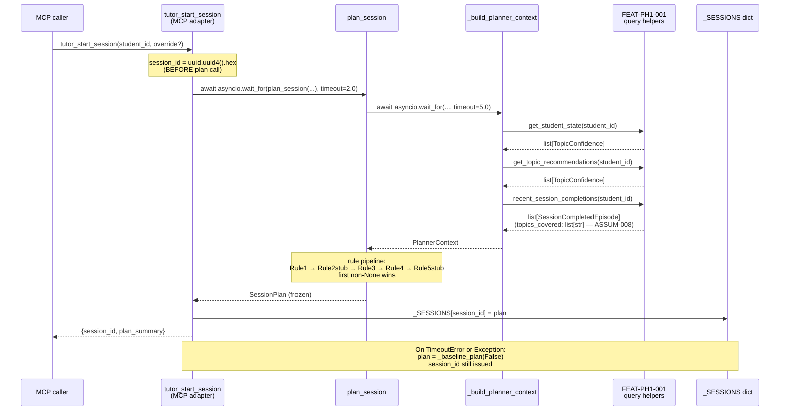
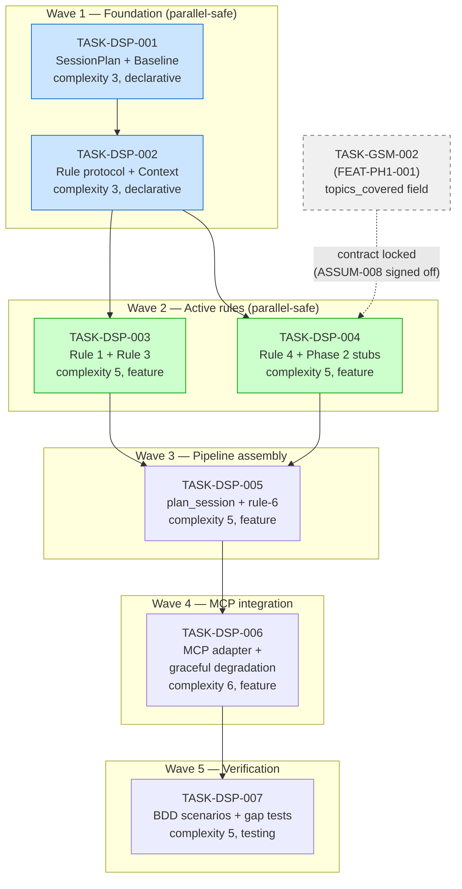

# IMPLEMENTATION-GUIDE.md — FEAT-PH1-002 Deterministic Session Planner

**Feature ID**: FEAT-PH1-002
**Parent review**: [TASK-REV-DA72](../../in_review/TASK-REV-DA72-plan-deterministic-session-planner.md)
**Review report**: [.guardkit/reviews/TASK-REV-DA72-review-report.md](../../../.guardkit/reviews/TASK-REV-DA72-review-report.md)
**Generated**: 2026-04-29
**Approach**: Option A — Sequential short-circuit pipeline of typed Rule objects (Strategy pattern)
**Total subtasks**: 7
**Estimated effort**: 18–22 hours (wave-parallel ceiling ~14h elapsed)

---

## 1. Goal

Build a Phase 1 deterministic session planner for study-tutor that
proposes the next study topic from learner state without invoking an
LLM in the planning step. The planner is wired into the
`tutor_start_session` MCP tool and reads via FEAT-PH1-001 query
helpers. All 29 scenarios in
`features/deterministic-session-planner/deterministic-session-planner.feature`
must pass.

**Why rule-based and not LLM-driven**: the project's knowledge graph
records that "Claude exhibits non-deterministic interpretation of
descriptive prose across different sessions and contexts" as a past
failure pattern. The planner is *deterministic* by name precisely
because the rule pipeline is closed-form, testable, and
reproducible — properties an LLM cannot guarantee under the
`@determinism` scenario.

---

## 2. Architecture

The planner is composed as five typed `Rule` objects iterated in
priority order. The first non-`None` `Candidate` short-circuits
dispatch. When all rules return `None`, rule 6 picks randomly from the
developing band; if even that is empty, the baseline plan ships. The
entire pipeline is wrapped in a single graceful-degradation boundary
at the MCP adapter so no failure mode propagates to the caller.

```
┌──────────────────────────────────────────────────────────────────────┐
│ MCP adapter: tutor_start_session                                     │
│   session_id = uuid.uuid4().hex   ← always issued, before plan call  │
│   try:                                                               │
│     plan = await asyncio.wait_for(plan_session(...), timeout=2.0)   │  ASSUM-006 (signed off)
│   except (TimeoutError, Exception):                                  │
│     plan = _baseline_plan(learner_state_available=False)            │
│   _SESSIONS[session_id] = plan                                       │
│   return {session_id, plan_summary}                                  │
└──────────────────────────────────────────────────────────────────────┘
                              │
                              ▼
┌──────────────────────────────────────────────────────────────────────┐
│ plan_session(student_id, topic_override, *, clock, rng)              │
│   ctx = await asyncio.wait_for(_build_planner_context(...),         │
│                                 timeout=5.0)  ← ASSUM-007 (signed off)│
│   for rule in [Rule1, Rule2stub, Rule3, Rule4, Rule5stub]:           │
│       candidate = rule(ctx)                                          │
│       if candidate is not None: return _plan_from_candidate(...)    │
│   if developing_band: return _rule6_fallback(...)                   │
│   return _baseline_plan(learner_state_available=True)               │
└──────────────────────────────────────────────────────────────────────┘
```

---

## 3. Data Flow Diagram

The runtime path from MCP caller to `SessionPlan`. Solid arrows are
wired; dashed arrows mark the **Phase 2 stubs** that exist in the list
but always return `None`. Red nodes mark degradation paths; green
nodes mark the happy path through Rule 1/3/4.

```mermaid
flowchart LR
    subgraph Writes["Caller-side"]
        W1["MCP caller<br/>(Claude Desktop)"]
        W1 -->|"tutor_start_session(student_id, override?)"| ADAPTER
    end

    subgraph Adapter["MCP adapter (study_tutor.mcp.tools)"]
        ADAPTER["_SESSIONS[session_id] = plan<br/>session_id minted FIRST"]
        ADAPTER -->|"asyncio.wait_for<br/>timeout=2.0 (ASSUM-006)"| PIPE
    end

    subgraph Pipeline["plan_session pipeline"]
        PIPE["plan_session()"]
        PIPE -->|"asyncio.wait_for<br/>timeout=5.0 (ASSUM-007)"| CTXBLD
        CTXBLD["_build_planner_context()"]
        CTXBLD -->|"get_student_state"| FEAT001A
        CTXBLD -->|"get_topic_recommendations"| FEAT001B
        CTXBLD -->|"recent_session_completions"| FEAT001C
        FEAT001A[("FEAT-PH1-001<br/>get_student_state")]
        FEAT001B[("FEAT-PH1-001<br/>get_topic_recommendations")]
        FEAT001C[("FEAT-PH1-001<br/>SessionCompletedEpisode<br/>topics_covered: list[str]")]
        FEAT001A --> CTX
        FEAT001B --> CTX
        FEAT001C --> CTX
        CTX["PlannerContext<br/>(clock, rng, topics, misconceptions, ao_mapping)"]
        CTX --> R1
        CTX -.-> R2
        CTX --> R3
        CTX --> R4
        CTX -.-> R5
        R1["Rule 1<br/>learner override"]
        R2["Rule 2 stub<br/># TODO(phase-2)"]
        R3["Rule 3<br/>weakest stale topic<br/>48h cooldown"]
        R4["Rule 4<br/>unrevisited misconception"]
        R5["Rule 5 stub<br/># TODO(phase-2)"]
        R1 --> CAND
        R3 --> CAND
        R4 --> CAND
        R6["Rule 6 fallback<br/>random from developing"]
        CAND["first non-None Candidate"]
        CAND -->|"none"| R6
        R6 --> PLAN
        R6 -->|"developing band empty"| BASE
        CAND -->|"hit"| PLAN
    end

    subgraph Output["SessionPlan"]
        PLAN["_plan_from_candidate()<br/>SessionPlan (frozen=True)"]
        BASE["_baseline_plan()<br/>rule_selected=baseline"]
    end

    ADAPTER -.->|"on TimeoutError or Exception"| BASE
    PIPE -.->|"on read timeout/empty"| BASE

    style R2 fill:#fffacd,stroke:#999,stroke-dasharray: 5 5
    style R5 fill:#fffacd,stroke:#999,stroke-dasharray: 5 5
    style BASE fill:#ffcccc,stroke:#c00
    style PLAN fill:#ccffcc,stroke:#090
    style CAND fill:#ccffcc,stroke:#090
```



**What to look for**: every read into FEAT-PH1-001 is wrapped in a
timeout, every degradation path lands in `_baseline_plan(...)`, and
the two Phase 2 stubs are present in the dispatch order so adding
their Phase 2 implementations is a body-of-method change, not a list
reorder.

**Disconnection check**: every read path on the diagram has a write
path that consumes it (write paths are inside the pipeline).
**No disconnections.**

---

## 4. §4: Integration Contracts

This feature has one cross-task data dependency that crosses a feature
boundary, plus three internal contracts.

### Contract: SessionCompletedEpisode.topics_covered

- **Producer task**: TASK-GSM-002 (in FEAT-PH1-001 graphiti-student-model)
- **Consumer task(s)**: TASK-DSP-004 (Rule 4 unrevisited-misconception)
- **Artifact type**: Pydantic model field on a Graphiti episode payload
- **Format constraint**: `list[str]` of topic name strings matching
  `Topic.name` from the student model schema. Plain strings, NOT
  `Topic` objects.
- **Validation method**: Coach verifies the seam test
  `test_session_completed_episode_topics_covered_format` (in
  TASK-DSP-004) passes against the producer's actual `Episode` model.
  Field name and type asserted directly.
- **Status**: ✅ Signed off 2026-04-29 (see §8 Resolved Assumptions).

### Contract: SessionPlan model

- **Producer task**: TASK-DSP-001
- **Consumer task(s)**: TASK-DSP-003, TASK-DSP-004, TASK-DSP-005,
  TASK-DSP-006, TASK-DSP-007
- **Artifact type**: Frozen Pydantic v2 BaseModel
- **Format constraint**: see TASK-DSP-001 acceptance criteria.
  Specifically `frozen=True` is load-bearing — `tutor_start_session`
  stores plans in a shared dict and relies on immutability for
  concurrency safety without locks.
- **Validation method**: TASK-DSP-001 unit tests assert
  immutability and field validation; downstream tasks import the
  model directly.

### Contract: Rule protocol

- **Producer task**: TASK-DSP-002
- **Consumer task(s)**: TASK-DSP-003, TASK-DSP-004, TASK-DSP-005
- **Artifact type**: `typing.Protocol`
- **Format constraint**: `__call__(self, ctx: PlannerContext) ->
  Candidate | None`. mypy `--strict` accepts conforming classes
  without explicit inheritance.
- **Validation method**: TASK-DSP-002 unit test demonstrates a plain
  lambda satisfies the protocol; TASK-DSP-003 and TASK-DSP-004 will
  fail mypy if their `__call__` signatures drift.

### Contract: plan_session async signature

- **Producer task**: TASK-DSP-005
- **Consumer task(s)**: TASK-DSP-006 (MCP adapter)
- **Artifact type**: async function
- **Format constraint**: `async def plan_session(student_id: str,
  topic_override: str | None = None, *, clock=None, rng=None) ->
  SessionPlan`. Adapter wraps in `asyncio.wait_for(timeout=2.0)`.
- **Validation method**: Seam test in TASK-DSP-006
  (`test_plan_session_signature_and_async`) introspects the function
  with `inspect.signature` and `asyncio.iscoroutinefunction`.

---

## 5. Integration Contracts Diagram

The two cross-feature seams. The dashed arrow shows the Phase 2 lift
where Rule 4 will start consuming `topics_covered` after TASK-GSM-002
ships.



**What to look for**: `session_id` is issued **before** `plan_session`
is awaited (so a planner crash never blocks session creation), and
every read across the FEAT-PH1-001 boundary returns concretely typed
data — no `Any`, no untyped dicts.

---

## 6. Task Dependency Graph

Five waves, with parallel-safe pairs in Wave 1 and Wave 2 (green).
The dashed inbound arrow from TASK-GSM-002 (FEAT-PH1-001) marks the
cross-feature contract that was resolved by sign-off — no longer a
blocking gate, but the dependency line remains for traceability.



_Tasks with green background can run in parallel within their wave._

---

## 7. Execution Strategy

| Wave | Task | Mode | Conductor workspace | Parallel-safe |
|------|------|------|--------------------|--------------:|
| 1    | TASK-DSP-001 | direct    | deterministic-session-planner-wave1-1 | ✅ |
| 1    | TASK-DSP-002 | direct    | deterministic-session-planner-wave1-2 | ✅ (after TASK-DSP-001) |
| 2    | TASK-DSP-003 | task-work | deterministic-session-planner-wave2-1 | ✅ |
| 2    | TASK-DSP-004 | task-work | deterministic-session-planner-wave2-2 | ✅ |
| 3    | TASK-DSP-005 | task-work | (sequential)                          | — |
| 4    | TASK-DSP-006 | task-work | (sequential)                          | — |
| 5    | TASK-DSP-007 | task-work | (sequential)                          | — |

Workspace naming: auto-generated, slug pattern
`{feature-slug}-wave{n}-{task-index}`. Per Context B Q3.

Recommended execution: kick off TASK-DSP-001 first, then TASK-DSP-002
(it imports from TASK-DSP-001). After both Wave 1 tasks complete,
dispatch TASK-DSP-003 and TASK-DSP-004 in parallel. Waves 3–5 are
sequential.

---

## 8. Resolved Assumptions (Sign-off Block)

All three medium-confidence assumptions flagged by Context A have been
resolved with measured data **prior to implementation**. The
verbatim sign-off wordings are preserved in
[features/deterministic-session-planner/deterministic-session-planner_assumptions.yaml](../../../features/deterministic-session-planner/deterministic-session-planner_assumptions.yaml).

### ASSUM-006 — `tutor_start_session` 2-second handler budget

**Status**: ✅ Signed off 2026-04-29.

> ASSUM-006 confirmed: 2s MCP handler budget for `tutor_start_session`.
> Spike measured `search_nodes` median = 0.07s,
> `search_memory_facts` median = 0.08s — reads complete in <0.2s
> total, leaving >1.8s headroom. The 2s outer guard at the MCP
> adapter is the binding constraint as designed. Signed off.

**Implementation impact**: TASK-DSP-006 enforces this as the outer
`asyncio.wait_for(plan_session(...), timeout=2.0)`.

### ASSUM-007 — Student-model read 5-second timeout

**Status**: ✅ Signed off 2026-04-29.

> Same measured data (Graphiti reads <0.2s total) trivially satisfies
> the 5s read timeout — 25× headroom confirmed.

**Implementation impact**: TASK-DSP-005 / TASK-DSP-006 enforce this as
the inner `asyncio.wait_for(_build_planner_context(...), timeout=5.0)`.
The 2s outer guard is intentionally the binding constraint in the
default configuration; the 5s inner timeout fires first only when
`PLANNER_HANDLER_BUDGET_SEC` is enlarged for testing.

### ASSUM-008 — "Unrevisited misconception" definition

**Status**: ✅ Signed off 2026-04-29.

> ASSUM-008 confirmed: `SessionCompletedEpisode` carries
> `topics_covered: list[str]` — topic name strings matching
> `Topic.name` from the student model schema. TASK-GSM-002 in
> FEAT-PH1-001 implements this field. Cross-feature contract locked.

**Implementation impact**: TASK-DSP-004 implements Rule 4 with the
straightforward set-membership check on `topics_covered`. The seam
test `test_session_completed_episode_topics_covered_format` validates
the contract before integration.

---

## 9. Smoke Gates (R3 feature-level smoke oracle)

The four `@smoke` scenarios in
`deterministic-session-planner.feature` are the feature-level smoke
gate that runs between waves under autobuild:

1. `@key-example @smoke @rule-1` — A learner-supplied topic override
   bypasses ranking entirely.
2. `@key-example @smoke @rule-3` — The lowest-confidence topic outside
   the cooldown window is recommended.
3. `@key-example @smoke @rule-4` — A topic with a recent unrevisited
   misconception is preferred over an equally weak topic without one.
4. `@key-example @smoke @mcp-integration` — Starting a tutoring
   session via MCP returns a plan summary.

These four scenarios collectively exercise the rule pipeline,
short-circuit dispatch, the FEAT-PH1-001 read path, and the MCP
adapter. They must all pass after each wave completes.

---

## 10. Coverage Gap Tests

Two gaps were identified in TASK-REV-DA72 §5 and added to TASK-DSP-007:

1. **`test_all_bands_empty_returns_baseline`**: rules 1/3/4 all return
   `None` AND developing band is empty → `rule_selected="baseline"`,
   `fallback_used="baseline"`. The existing `@boundary @rule-6
   @fallback` scenario requires a non-empty developing band; this
   covers the all-bands-empty fall-through.

2. **`test_post_write_read_consistency_does_not_block`**: with a
   fire-and-forget session-completion write task in-flight, a new
   `tutor_start_session` returns within 2.1 seconds. The existing
   `@edge-case @concurrency @async` scenario specifies the behaviour
   but lacks a wall-clock latency assertion.

Both tests are unit-level; they do not require running the full
scenario suite.

---

## 11. Phase 2 Migration Path

Rules 2 and 5 ship in Phase 1 as inert stubs. Phase 2 replaces the
stub class bodies — no list reorder, no `PlannerContext` change, no
pipeline change.

```python
# Phase 1 (TASK-DSP-004):
class Rule2ActiveQuestStub:
    def __call__(self, ctx: PlannerContext) -> Candidate | None:
        # TODO(phase-2)
        return None

# Phase 2 (future task):
class Rule2ActiveQuestStub:           # rename optional
    def __call__(self, ctx: PlannerContext) -> Candidate | None:
        # implementation
        return Candidate(...) if condition else None
```

The `# TODO(phase-2)` comment is asserted by source-grep test
(TASK-DSP-004 acceptance criterion) so Phase 2 deletion is forced
when the implementation lands. This prevents stub drift.

---

## 12. Reference

- **Feature spec**: [features/deterministic-session-planner/deterministic-session-planner.feature](../../../features/deterministic-session-planner/deterministic-session-planner.feature)
- **Spec summary**: [features/deterministic-session-planner/deterministic-session-planner_summary.md](../../../features/deterministic-session-planner/deterministic-session-planner_summary.md)
- **Assumptions manifest**: [features/deterministic-session-planner/deterministic-session-planner_assumptions.yaml](../../../features/deterministic-session-planner/deterministic-session-planner_assumptions.yaml)
- **Review report**: [.guardkit/reviews/TASK-REV-DA72-review-report.md](../../../.guardkit/reviews/TASK-REV-DA72-review-report.md)
- **Cross-feature dependency**: [tasks/backlog/graphiti-student-model/TASK-GSM-002-episode-types.md](../graphiti-student-model/TASK-GSM-002-episode-types.md)
