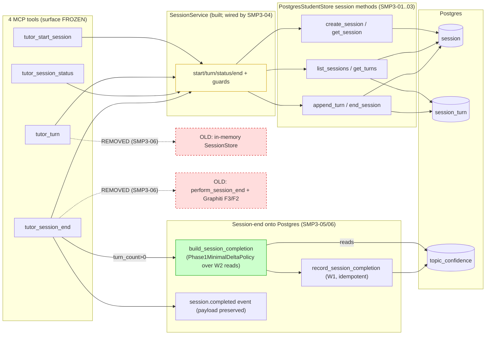
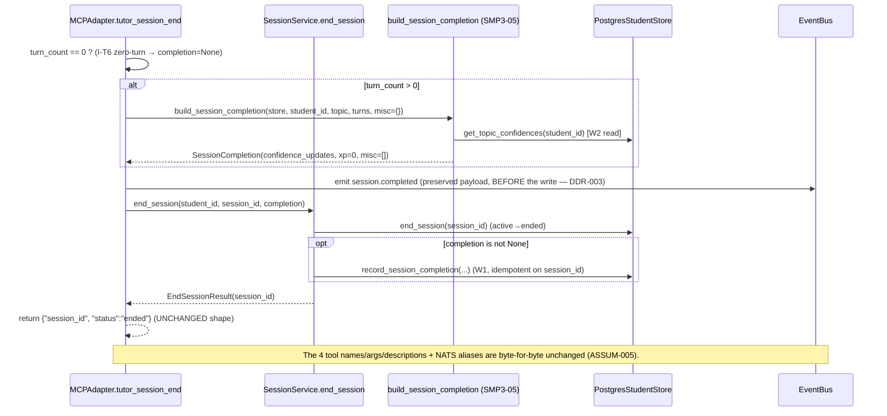
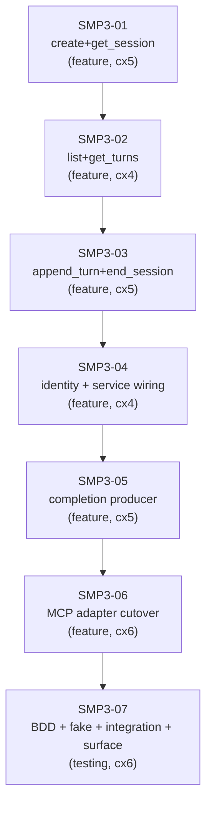

# Implementation Guide — FEAT-SMP-003: Durable Cross-Device Sessions

**Feature:** `FEAT-SMP-003` · **Spec:** [durable-cross-device-sessions.feature](../../../features/durable-cross-device-sessions/durable-cross-device-sessions.feature) (22 scenarios) · **Contract:** [API-session-cross-device.md](../../../docs/design/contracts/API-session-cross-device.md) (Accepted, G-CON) · **Builds on:** W1 (write path), W2 (reads)

## Scope

Makes study sessions durable, student-keyed, and resumable across devices, and moves session-end learner-state
persistence off Graphiti onto Postgres. The 6 `PostgresStudentStore` session methods + wiring the (already-built)
`SessionService` into both MCP adapter sites + a config single-user identity + swapping the 4 MCP tools onto
`SessionService` (surface byte-for-byte unchanged) + the session-end completion port (Phase1MinimalDeltaPolicy
over W2 reads → durable `record_session_completion`, preserving `session.completed`).

**Out of scope:** the HTTP/WS transport + `turn_stream` (mobile `/goal`); a real XP/gamification engine; wiring
the Coach verdict into misconceptions; deleting `session.tutor_session` + the graph write plumbing (FEAT-SMP-004).

## §1: Data Flow — Read/Write Paths (before → after)

**Disconnection note (resolved):** every tool now flows through `SessionService` → durable Postgres; the two
red dotted paths (the in-memory `SessionStore` and the Graphiti session-end write) are **removed by SMP3-06** —
the module files stay until FEAT-SMP-004, but nothing calls them. No write path is left without a read.

## §2: Integration Contract — session-end sequence (the cutover)

## §3: Task Dependency Graph (serialized — one task per wave)

_Strictly serial — store methods, adapter, and main.py all overlap; per the [parallel-wave worktree-pollution retro](../../../docs/retros/2026-07-03-autobuild-parallel-wave-worktree-pollution.md). The **completion producer (05) precedes the cutover (06)** so 06 is one atomic swap — no intermediate "end writes no learner state" a later task must un-break (the [self-defeating-tests retro](../../../docs/retros/2026-07-03-autobuild-self-defeating-boundary-tests.md))._

## §4: Integration Contracts

### Contract: STUDY_TUTOR_PG_DSN
- **Producer:** W0 deploy (`.env`); read by `build_student_store()` / `build_session_service()` (SMP3-04).
- **Consumer(s):** SMP3-04 (boot wiring, both `main.py` sites), transitively the 6 store methods, SMP3-07 (ephemeral PG).
- **Format:** `postgresql+asyncpg://…` (store coerces `postgresql://`); boot guard uses `os.environ.get(...)`.
- **Validation:** SMP3-04 test asserts `build_session_service()` called iff the DSN is set at both sites.

### Contract: SessionService (session.provider → MCP adapter)
- **Producer:** `build_session_service()` (SMP3-04) → `set_session_service(SessionService())`.
- **Consumer:** `MCPAdapter` (SMP3-06) via `get_session_service()` (or an injected fake-backed service in tests).
- **Format:** the built `SessionService` resolves the wired `StudentStore`; an unwired service at boot is fail-fast (provider.py).
- **Validation:** SMP3-06 surface regression (`test_adapter.py`) with an injected `SessionService(store=FakeStudentStore())`.

### Contract: reply_fn (adapter tutor loop → SessionService.turn)
- **Producer:** the adapter wraps today's inline orchestrator/Phase-0 loop as `reply_fn: ReplyFn` (SMP3-06).
- **Consumer:** `SessionService.turn(..., reply_fn=...)` — the service owns the two durable `append_turn` calls.
- **Format:** `reply_fn(user_message) -> TutorReply(response, metadata)`; metadata re-projected into the unchanged response dict.
- **Validation:** SMP3-06/07 assert `tutor_turn` returns the unchanged Phase-0 / orchestrator shapes and persists two turns.

## Assumptions carried into tasks (3 low-confidence, still open)

| Assumption | Decision | Task |
|---|---|---|
| ASSUM-003 | resume-if-active via one transaction (no partial-unique-index migration) | SMP3-01 |
| ASSUM-008 | confidence delta = ported Phase1MinimalDeltaPolicy over store reads (engagement bonus only, misc empty) | SMP3-05 |
| ASSUM-010 | preserve the live `session.completed` payload (events-schema.yaml reconciliation deferred) | SMP3-06 |

## Test strategy

- **Store (SQL) behaviour** → ephemeral-PG integration (throwaway `postgres:16`, non-5434 port); NAS scope-guard test.
- **Service/guard behaviour** → `FakeStudentStore` (its 6 session methods already exist).
- **Surface regression (sharpest gate)** → `tests/unit/mcp/test_adapter.py` + `tests/unit/adapters/test_command_router.py`
  must stay green after the cutover — the 4 tools, descriptions, error envelopes, and NATS aliases are frozen (ASSUM-005).
- **Composition guard** → SMP3-06/07 run the WHOLE `pytest tests/`, and SMP3-07 runs `pytest features/…`
  explicitly (an undefined BDD step is a FAILURE — guardkit retro 2026-07-04, not `pending`).

## AutoBuild operational checklist (READ before `guardkit autobuild`)

1. Waves are already serialized (one task per wave) in `.guardkit/features/FEAT-SMP-003.yaml`.
2. `export STUDY_TUTOR_PG_DSN=<ephemeral PG>` (throwaway `postgres:16`, non-5434 port) before launching.
3. After it finishes, independently run `pytest tests/` AND `pytest features/durable-cross-device-sessions`
   (Coach per-task green ≠ composition green; the surface regression + BDD steps are the risk).
4. Squash-merge only the code/test paths (`src/…/store/postgres.py`, `src/…/session/*`, `src/…/mcp/adapter.py`,
   `src/…/cli/main.py`, `src/…/knowledge/*` for the moved policy, `features/…`, `tests/**`) — not `.guardkit/`/`tasks/` churn.

## Next after W3

FEAT-SMP-004 — delete the graph write plumbing + `session.tutor_session` + `queries.py` write path; retire the CC-13 machinery.
