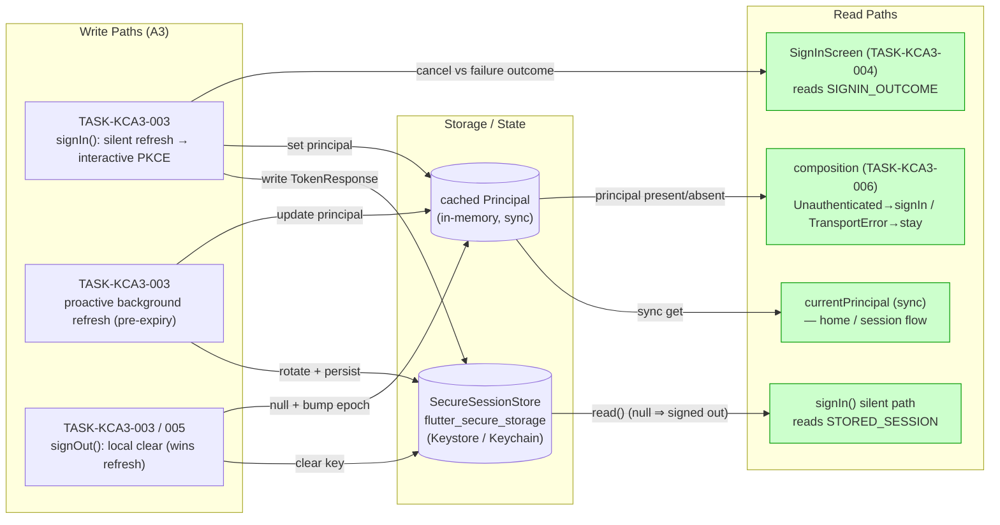
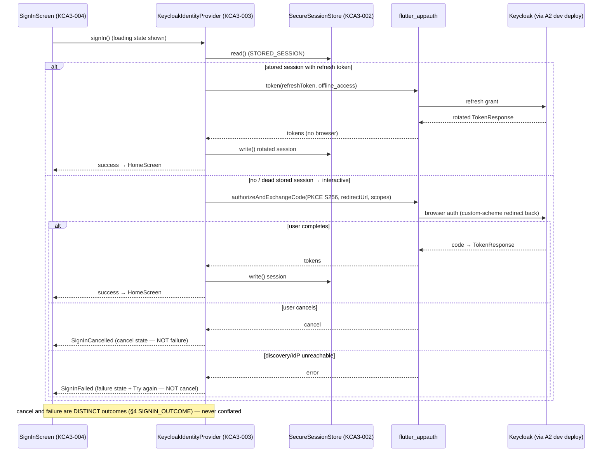
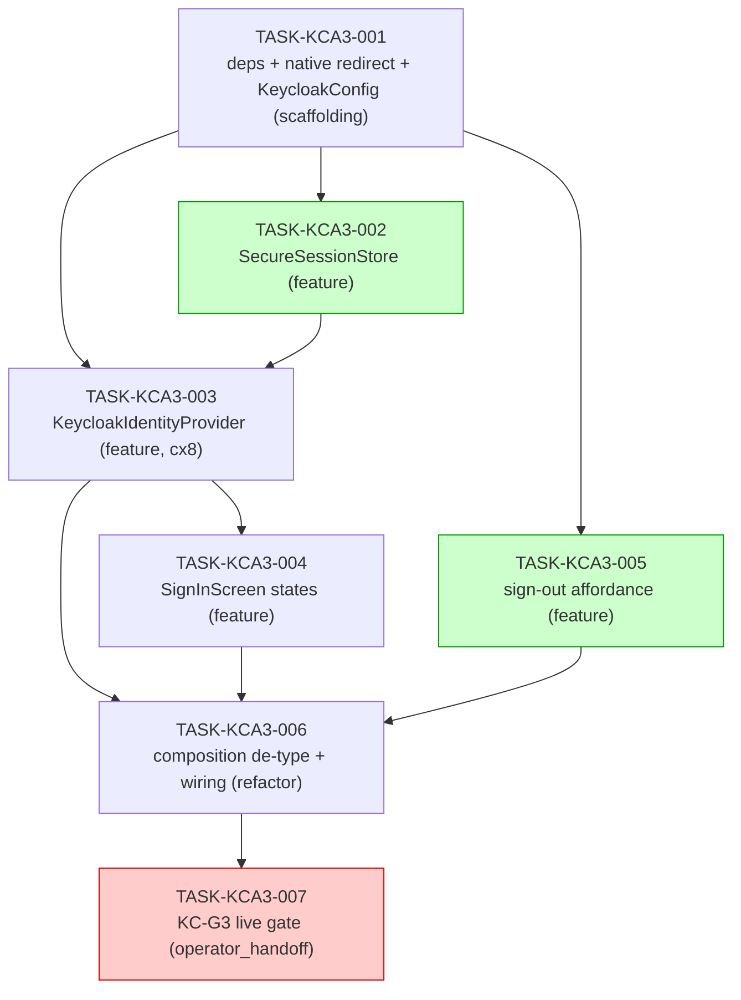

# IMPLEMENTATION GUIDE — FEAT-AUTH-003 A3: Flutter Keycloak Sign-In

**Feature:** FEAT-AUTH-003 (A3 app slice) · **Review:** TASK-REV-KCA3 · **Complexity:** 7/10
**Approach:** KC-D7 (design-frozen) — a real `KeycloakIdentityProvider` implements the
**unchanged** 3-member `IdentityProvider` port. The port's **sync `currentPrincipal` stays**:
the adapter refreshes proactively in the background (appauth token-response expiry) and
`signIn()` tries a **silent refresh before the interactive browser flow** (silent-then-interactive).
PKCE S256 public client, custom-scheme redirect, `offline_access` so the family device stays
signed in. `flutter_appauth` + `flutter_secure_storage` are a **recorded** zero-added-deps DoD
scope event.
**Trade-off:** quality/reliability (security-sensitive) · **Testing:** standard quality gates ·
**Execution:** detect waves (recommended parallel 2)

The one composition seam — `composeSessionApi` in
[main.dart:21](../../../app/lib/main.dart#L21) — de-types its `identity` parameter from the
concrete `FakeIdentityProvider` to the **port**; the hermetic fake flavour keeps the concrete
fake for its `studentIdForToken` introspection hook and stays green. The existing
`Unauthenticated → routeToSignIn` recovery is preserved as the hard fallback and kept strictly
distinct from `TransportError → showConnectionProblem` (a dead backend must not route a
signed-in student to sign-in).

---

## §1 Data Flow: Read/Write Paths

Every write and read path for the A3 slice. **Look for:** the sync `currentPrincipal` read
path is kept answerable by the proactive-refresh write path — no read is left without a writer.

**Disconnection check:** none. Every read path has a writer: `currentPrincipal` (R1) is fed by
signIn/refresh (W1/W2) and cleared by signOut (W3); the silent-refresh read (R2) consumes what
signIn/refresh persisted (S1); the UI outcome read (R3) consumes the adapter's cancel/failure
result (W1); the routing read (R4) consumes principal presence (S2). The offline-window
boundary behaviour (Group B) is `read() → refresh-or-null` on the same paths.

---

## §2 Integration Contract sequence (silent-then-interactive, fetch-then-use check)

**Look for:** `signIn()` **always** attempts the silent refresh before any browser opens, and
the *distinct* cancel-vs-failure outcome is produced by the adapter and consumed by the screen
— it is never dropped or collapsed into one state.

---

## §3 Task Dependencies

**Look for:** wave 2 runs two tasks in parallel on distinct files (`secure_session_store.dart`
vs `home_screen.dart`); the cx-8 adapter (003) is the single hinge; the operator_handoff KC-G3
gate is the tail (AutoBuild will not attempt it).

_Green = parallel-safe within its wave (distinct files). Red = operator-executed (AutoBuild
will not attempt it). Waves: 1 = {001}, 2 = {002, 005}, 3 = {003}, 4 = {004}, 5 = {006},
6 = {007}._

---

## §4 Integration Contracts

Cross-task data dependencies. Each producer artifact must reach its consumer in the exact shape
below — unspecified cross-task contracts are the #1 source of integration-boundary bugs.

### Contract: REDIRECT_URI
- **Producer task:** TASK-KCA3-001 (native config + `KeycloakConfig.redirectUrl`)
- **Consumer task(s):** TASK-KCA3-003 (passes it to `flutter_appauth`)
- **Artifact type:** custom-scheme redirect URI string (frozen constant)
- **Format constraint:** exactly `com.appmilla.studytutor:/oauth2redirect`, **byte-identical**
  in four places that must agree — the Keycloak `study-tutor-app` client Valid Redirect URIs
  (A1 realm-as-code), the Android manifest `appAuthRedirectScheme` (`com.appmilla.studytutor`),
  the iOS `Info.plist` `CFBundleURLSchemes`, and the `redirectUrl` argument the adapter passes
  to appauth. **ASSUM-003, operator-frozen 2026-07-08.**
- **Validation method:** Coach verifies `KeycloakConfig.redirectUrl` equals the Android/iOS
  registered scheme string; seam test in TASK-KCA3-006 asserts the composed adapter carries the
  same redirect. Wire round-trip on a real device is confirmed by the KC-G3 gate (AC-G3-05).

### Contract: OIDC_CLIENT_CONFIG
- **Producer task:** TASK-KCA3-001 (`KeycloakConfig`)
- **Consumer task(s):** TASK-KCA3-003 (adapter constructor), TASK-KCA3-006 (composition builds it)
- **Artifact type:** frozen config value object
- **Format constraint:** `issuer` = the OIDC discovery base (ts.net https, from
  `KEYCLOAK_ISSUER`); `clientId` = `study-tutor-app`; `scopes` = `[openid, offline_access]`
  (offline_access is required so a refresh token is issued and the device stays signed in);
  `redirectUrl` as above. An **empty** `KEYCLOAK_ISSUER` selects the hermetic-fake flavour.
- **Validation method:** Coach verifies the adapter is constructed from `KeycloakConfig` and
  that `offline_access` is in the requested scopes; composition seam test (TASK-KCA3-006)
  asserts empty issuer ⇒ concrete `FakeIdentityProvider`, set issuer ⇒ `KeycloakIdentityProvider`.

### Contract: STORED_SESSION
- **Producer task:** TASK-KCA3-002 (`SecureSessionStore` + `StoredSession`)
- **Consumer task(s):** TASK-KCA3-003 (silent refresh reads it; signIn/refresh write it; signOut clears it)
- **Artifact type:** secure-storage-persisted value object
- **Format constraint:** carries `refreshToken`, `accessToken`, `accessTokenExpiry`,
  `displayName`; persisted via `flutter_secure_storage` (never plaintext); `read()` returns
  `null` for absent **and** unreadable/corrupt blobs and on a backing-store throw (fail-closed
  to signed-out). No `flutter_appauth` type crosses the seam — the adapter maps
  `TokenResponse` ↔ `StoredSession`.
- **Validation method:** Coach verifies `read()` never throws (returns `null`) and that the
  backend is `flutter_secure_storage`; adapter seam test (TASK-KCA3-003) asserts a valid stored
  session drives a silent refresh with **zero** interactive calls.

### Contract: SIGNIN_OUTCOME
- **Producer task:** TASK-KCA3-003 (`signIn()` result)
- **Consumer task(s):** TASK-KCA3-004 (SignInScreen state machine)
- **Artifact type:** distinct sign-in outcomes (two exception types or a sealed result)
- **Format constraint:** a user **cancel** (`SignInCancelled`) and an IdP/discovery/transport
  **failure** (`SignInFailed`) are **distinct and catchable**; a missing discovery document is
  a **failure**, not a cancel. The screen renders a cancel message vs a try-again failure state
  and must never collapse the two.
- **Validation method:** UI seam test (TASK-KCA3-004) asserts cancel ⇒ "cancelled" surface with
  no "Try again", and discovery-unavailable ⇒ the "Try again" failure surface.

> **Cross-feature inputs (not intra-A3 contracts):** the Keycloak `study-tutor-app` client +
> `student_id` mapper come from **FEAT-AUTH-001** (A1 realm-as-code); token **validation** at
> the server is **FEAT-AUTH-002** (A2). A3 only *consumes* a live `keycloak`-mode dev deploy at
> the KC-G3 gate. No A3 task produces the realm or the server resolver.

---

## Security checklist (focus lens)

- [ ] **PKCE S256** for the public client (appauth default) — the interactive flow binds the
      code to this device (an intercepted code cannot be redeemed elsewhere)
- [ ] The session lives in the **platform secure store** (`flutter_secure_storage`), never
      plaintext — a minor's session on a shared family device
- [ ] Only the app's **own custom-scheme redirect** delivers the result — a foreign redirect
      establishes no session (appauth + the registered scheme)
- [ ] **signOut wins an in-flight refresh** — a completing background refresh does not restore a
      cleared session (epoch/generation guard)
- [ ] `offline_access` requested so the family device stays signed in; sign-out is a **local**
      clear (ASSUM-004 — no IdP end-session call this slice)
- [ ] failure ≠ cancel: a missing discovery document is a **failure** state, not a cancel
- [ ] `Unauthenticated → routeToSignIn` stays **distinct** from `TransportError →
      showConnectionProblem` — a dead backend does not route a signed-in student to sign-in

---

## Smoke gate (R3 — feature-level composition)

`smoke_gates` runs `cd app && flutter analyze && flutter test` after **wave 3** (adapter +
store land — unit suites) and **wave 5** (composition de-type + error-routing regression). The
path is the verified Flutter default test root `app/test/` (flutter discovers it — no explicit
argv). Wave 6 (KC-G3) is `operator_handoff` and lands no code, so wave 5 is the final
code-bearing wave and the meaningful last gate — the `feature-validate` "does not cover the
final wave" warning is expected here (same shape as FEAT-AUTH-002).
