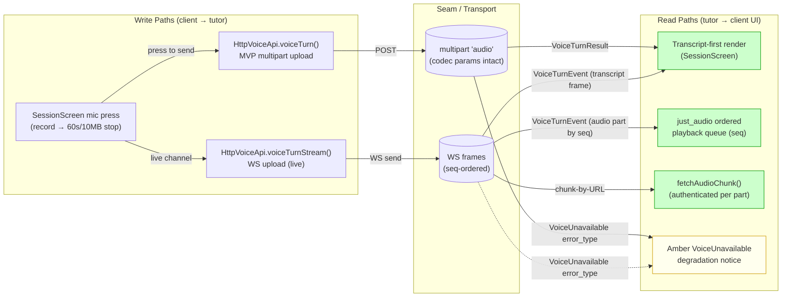
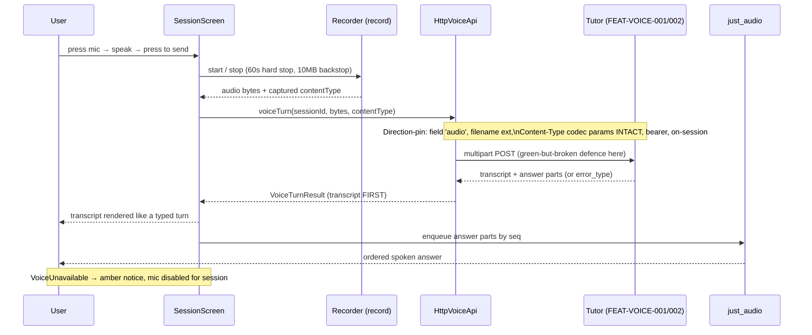
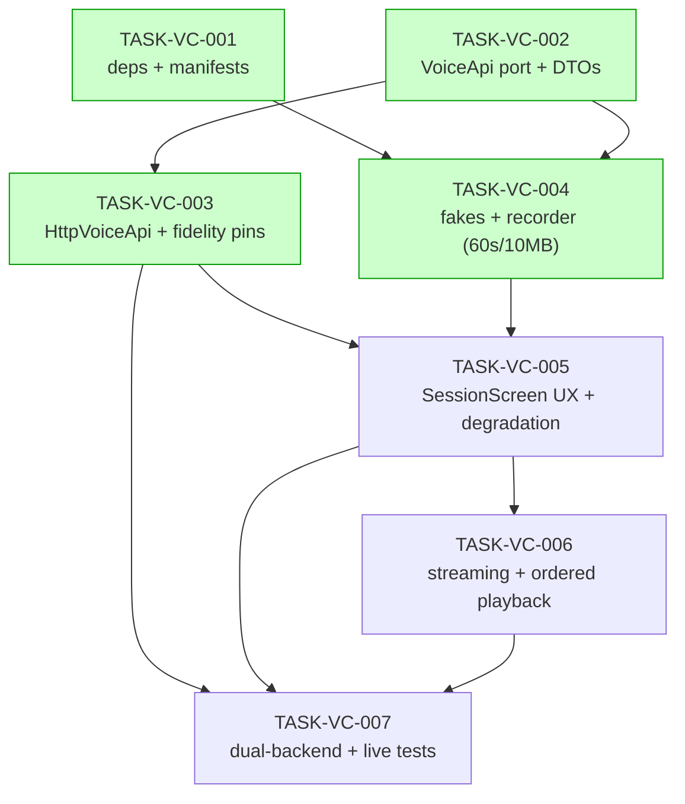

# Implementation Guide: Flutter tap-to-talk voice client (FEAT-VOICE-003)

**Parent review:** TASK-REV-V3C1 · **Approach:** Option 1 (port + fidelity first → MVP HTTP → streaming)
**Trade-off priority:** Quality/reliability · **Testing:** Standard (quality gates + dual-backend/direction-pins)

Client-only feature. Does **not** duplicate FEAT-VOICE-001 (server rulebook) or FEAT-VOICE-002
(server streaming). Where the client surfaces a server decision, it asserts the client's
**surfacing and recoverability**, not the server's rulebook.

---

## Data Flow: Read/Write Paths

_What to look for: every write path (record → upload, MVP + WS) has a wired read path (transcript,
playback, chunk fetch, degradation). No disconnected read._

**Disconnection Alert:** None within the feature. The streaming read paths (R2/R3) depend on
**FEAT-VOICE-002** server delivery — a deliberate **cross-feature** seam (server owns WS frame
ordering + chunk-by-URL), not an in-feature disconnected read. TASK-VC-006 asserts the client side;
the live end-to-end proof lives in TASK-VC-007 against the GB10 tutor.

---

## Integration Contracts (sequence)

_What to look for: the transcript is passed onward to the UI (rendered first) and the answer bytes
reach just_audio — no "fetch then discard". The fidelity contract is asserted at the API→Tutor arrow._

---

## Task Dependencies

_Tasks with green background can run in parallel within their wave._

### Execution waves (auto-detected)

- **Wave 1** (parallel): TASK-VC-001, TASK-VC-002 — no cross-dependency, disjoint files.
- **Wave 2** (parallel): TASK-VC-003, TASK-VC-004 — both build on the port; disjoint files (adapter vs fakes/recorder).
- **Wave 3**: TASK-VC-005 — needs the HTTP turn + recorder/fakes.
- **Wave 4**: TASK-VC-006 — layers streaming on the MVP UX host.
- **Wave 5**: TASK-VC-007 — exercises the full surface, hermetic + live.

---

## §4: Integration Contracts

### Contract: VoiceApi (internal interface)
- **Producer task:** TASK-VC-002
- **Consumer task(s):** TASK-VC-003, TASK-VC-004, TASK-VC-006, TASK-VC-005 (via injection)
- **Artifact type:** Dart `abstract interface class` + DTOs (`VoiceTurnResult`, `VoiceTurnEvent`) + sealed error types
- **Format constraint:** DTO field names and the six sealed `error_type` members are stable; adapters
  implement the interface exactly; `VoiceUnavailable` is the degradation-driving member.
- **Validation method:** Coach verifies all consumers compile against `voice_api.dart` and a `switch`
  over the sealed errors is exhaustive.

### Contract: VOICE_UPLOAD_MULTIPART (the fidelity seam — "green but broken")
- **Producer task:** TASK-VC-003 (builds the outgoing multipart in `HttpVoiceApi.voiceTurn`)
- **Consumer task(s):** TASK-VC-007 (live-seam validation); external consumer = tutor server (FEAT-VOICE-001)
- **Artifact type:** HTTP multipart request via `package:http` MultipartRequest
- **Format constraint:** multipart field name **`audio`**; filename extension matching the **captured
  codec**; `Content-Type` **preserving codec params exactly as recorded** (never silently re-encoded or
  stripped); `Authorization: Bearer …` present; request path bound to the caller's `sessionId`.
- **Validation method:** hermetic MockClient direction-pins in TASK-VC-003 assert every field above;
  TASK-VC-007 ports the same assertions to the live GB10 seam. This is the single highest-value test
  asset — a recording that uploads "green" but arrives mis-authed / wrong-session / re-encoded is the
  exact failure this contract exists to catch.

---

## Open items carried into the build

- **ASSUM-006 (encoder, Phase-0 gated):** m4a/AAC default vs opus fallback is settled by the Phase-0
  m4a-against-live-STT test **inside TASK-VC-004**; keep the encoder injectable. The fidelity guarantee
  holds regardless of winner.
- **ASSUM-010 / ASSUM-011 (copy, low-confidence):** mic-permission + refusal-reason wording is inferred.
  Behaviour is firm and hermetically testable against whatever strings are chosen — remains
  autobuild-suitable; confirm final copy with design before release.

---

## Next steps

1. Review this guide + the data-flow diagram (the primary review artefact).
2. `/feature-build FEAT-VOICE-003` for autonomous wave execution, **or** start Wave 1 manually:
   `/task-work TASK-VC-001` and `/task-work TASK-VC-002`.
