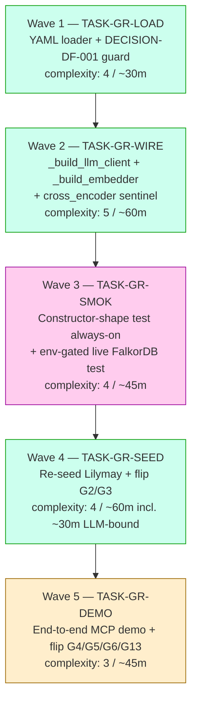
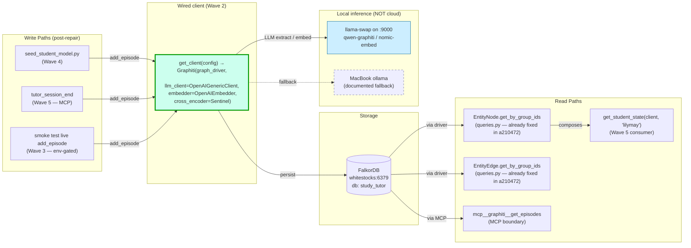
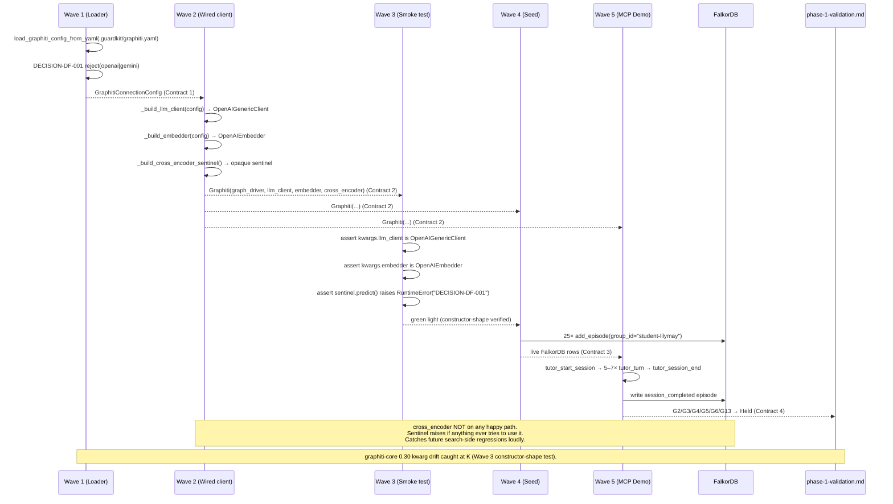

# Implementation Guide — Graphiti Runtime Integration Repair (FEAT-FD32)

**Parent task**: [TASK-PH2-GR-001](../TASK-PH2-GR-001-graphiti-runtime-integration-repair.md)
**Review task**: [TASK-REV-GR1A](../../in_review/TASK-REV-GR1A-plan-graphiti-runtime-integration-repair.md)
**Review report**: [.claude/reviews/TASK-REV-GR1A-review-report.md](../../../.claude/reviews/TASK-REV-GR1A-review-report.md)
**BDD feature file**: [graphiti-runtime-integration-repair.feature](../../../features/graphiti-runtime-integration-repair/graphiti-runtime-integration-repair.feature) (24 scenarios, all `@task:TASK-PH2-GR-001`)

## Goal

Repair `src/study_tutor/knowledge/graphiti_client.py` so every entity-extraction round-trip hits the local llama-swap fleet on `:9000`. Eliminate the silent OpenAI-default that caused Phase 1 to falsify G2/G3/G4/G5/G6/G13. Re-seed Lilymay against live FalkorDB. Conduct an end-to-end MCP demo to flip those gate items from "Falsified" to "Held".

## Wave structure

```
Wave 1 (TASK-GR-LOAD)  ─────► Wave 2 (TASK-GR-WIRE)  ─────► Wave 3 (TASK-GR-SMOK)
                                                                 │
                              ┌──────────────────────────────────┘
                              ▼
                       Wave 4 (TASK-GR-SEED)         ─────► Wave 5 (TASK-GR-DEMO)
```

All waves are **strictly sequential**. Wave N+1 depends on artefacts produced by Wave N. The dependency chain is enforced by file-content (loader → wired client → smoke test → live seed → demo evidence) — no opportunity for cross-wave parallelism. The single-task-per-wave shape encodes this in `parallel_groups` so `/feature-build` runs one wave at a time.

## Task Dependencies



_Green: feature/scaffolding tasks. Pink: testing wave. Orange: human-in-the-loop wave._

## Data Flow: Read/Write Paths



_All write paths flow through the wired client (Wave 2). Cross-encoder is a sentinel — not on any path. **No NOT WIRED dotted edges expected post-repair.**_

**Disconnection check**: ✅ All read paths have callers. All write paths flow through `Wiring`. No disconnections to flag. This is the intended post-repair state.

## Integration Contracts



_The fetch-then-discard anti-pattern that Phase 1 exhibited (`add_episode` → 401 → silent failure) is structurally impossible post-repair: every write goes through the wired client, every wired-client construction is asserted by the smoke test, and the smoke test fails if any of the four kwargs are missing or None._

---

## Section 4: Integration Contracts

This section is **MANDATORY** and **load-bearing**. Every cross-task data dependency in this feature is documented below. Coach validation in `/feature-build` reads from this section to verify contract compliance per task.

### Contract 1: GraphitiConnectionConfig

- **Producer task**: TASK-GR-LOAD (Wave 1)
- **Consumer task**: TASK-GR-WIRE (Wave 2)
- **Artifact type**: Pydantic v2 model (`GraphitiConnectionConfig` instance), constructed via `load_graphiti_config_from_yaml(path: Path) -> GraphitiConnectionConfig`
- **Format constraint**:
  - `llm_provider` MUST be one of `("vllm", "ollama")`. Cloud providers (`"openai"`, `"gemini"`) MUST raise `ValueError("cloud LLM providers disabled per DECISION-DF-001")` at load time, BEFORE this contract is established.
  - `embedding_provider` MUST be one of `("vllm", "ollama")`. Same DECISION-DF-001 rejection for `"openai"`.
  - `llm_base_url` and `embedding_base_url` MUST be populated, non-empty URL strings.
  - `llm_model` and `embedding_model` MUST be populated, non-empty strings.
  - `embedding_dimensions` MAY be present (e.g. 768 for nomic-embed-v1.5); when absent, the embedder construction in Wave 2 omits the kwarg.
- **Validation method**: TASK-GR-WIRE's seam test asserts `config.llm_provider in ("vllm", "ollama")` and `config.embedding_provider in ("vllm", "ollama")` before calling `_build_llm_client` / `_build_embedder`. Coach verifies the loader's DECISION-DF-001 ValueError raises with the canonical message string.

### Contract 2: WiredGraphitiClient

- **Producer task**: TASK-GR-WIRE (Wave 2)
- **Consumer tasks**: TASK-GR-SMOK (Wave 3), TASK-GR-SEED (Wave 4), TASK-GR-DEMO (Wave 5)
- **Artifact type**: real `graphiti_core.Graphiti` instance, returned via `await get_client(config) -> GraphitiClient | None`
- **Format constraint**:
  - `inner.llm_client` MUST be an `OpenAIGenericClient` instance with `config.api_key == "local-key"` (placeholder; `OPENAI_API_KEY` is NEVER read).
  - `inner.embedder` MUST be an `OpenAIEmbedder` instance with `config.api_key == "local-key"`.
  - `inner.cross_encoder` MUST be the sentinel object whose `__getattr__` raises `RuntimeError("cross_encoder not wired; reranker calls disabled per DECISION-DF-001 — wire a local cross-encoder before enabling search reranking")` on any attribute access.
  - The Graphiti instance is constructed with all four kwargs explicitly named: `graph_driver=`, `llm_client=`, `embedder=`, `cross_encoder=`. graphiti-core 0.30 may rename any of these — the constructor-shape test in TASK-GR-SMOK asserts exact kwarg names so a rename fails fast.
- **Validation method**: TASK-GR-SMOK runs the constructor-shape test unconditionally in CI (always-on, no env-var gate). Coach verifies the test exists, runs, and passes. Additionally, the `OPENAI_API_KEY=poison` regression test asserts no production code path under `src/study_tutor/knowledge/` reads the env var.

### Contract 3: LilymaySeed

- **Producer task**: TASK-GR-SEED (Wave 4)
- **Consumer task**: TASK-GR-DEMO (Wave 5)
- **Artifact type**: live FalkorDB rows in `group_id="student-lilymay"`, written by `scripts/seed_student_model.py`
- **Format constraint**:
  - 25 entity writes succeed (the standard Lilymay schema from TASK-GSM-006).
  - `mcp__graphiti__search_nodes(query="Lilymay", group_ids=["student-lilymay"])` returns the Student entity with `year_group=11`, `target_grade="8"`, non-empty `subjects`, non-empty `topic_confidences`.
  - `get_student_state(client, "lilymay")` returns a non-empty `StudentState` (i.e. NOT the bootstrap-empty fallback that the `GroupsNodesNotFoundError` swallow returns).
  - Re-running the seed is idempotent and emits `event=seeding_skipped`.
- **Validation method**: TASK-GR-DEMO's pre-flight (per its Implementation Notes) calls both `mcp__graphiti__search_nodes` and `get_student_state` and refuses to start the demo session if either returns empty. Coach verifies AC-SEED-02 / AC-SEED-03 evidence is pasted into `phase-1-validation.md`.

### Contract 4: MCP Session Episode

- **Producer task**: TASK-GR-DEMO (Wave 5)
- **Consumer**: `docs/research/ideas/phase-1-validation.md` (gate file — closes G3/G4/G5/G6/G13)
- **Artifact type**: a `session_completed` episode written to Graphiti by `tutor_session_end`, plus the validation-doc updates that flip the gate items
- **Format constraint**:
  - The episode is queryable via `mcp__graphiti__get_episodes(group_ids=["student-lilymay"])`.
  - The episode body contains the session id, the turn count, and a replay-suitable summary.
  - Turn-level p50 and p95 latency are captured and pasted alongside the gate-flip evidence.
  - At least one Coach revision was observed during the session (AC-DEMO-01 explicitly requires this — if the Coach never disagrees, the gate stays Falsified and a calibration follow-up is logged).
- **Validation method**: human-in-the-loop. Coach validation for this task is necessarily lighter — Coach verifies the gate-file edits exist and the latency numbers are present, but cannot replay the session itself.

---

## Risk register (carried from parent)

The 5 risks from TASK-PH2-GR-001 carry through. Wave assignments:

| Risk | Wave | Mitigation |
|---|---|---|
| MacBook ollama offline at seed time | 4 | YAML toggle to GB10 (single-line). Acceptable. |
| GB10 rate-limits at 25 concurrent writes | 4 | `chunk_extraction_concurrency: 4` already in YAML; LLM-bound at 78s/write means concurrency is not the bottleneck. |
| GB10 down during repair window | 4 | MacBook fallback active. Phase 2 day-by-day plan accommodates a slip. |
| `OpenAIGenericClient` API drifts in graphiti-core minor bump | 2, 3 | Pin `>=0.29,<0.30` in `pyproject.toml` (Wave 2). Constructor-shape test in Wave 3 catches drift. |
| Stale FalkorDB indices from earlier broken seeds | 4 | If `Connection closed by server` returns, `redis-cli -h whitestocks -p 6379 GRAPH.DELETE study_tutor` and re-seed. |

## Hard constraints (from parent task)

These are **non-negotiable**. Coach should reject any code change that violates them:

1. **DECISION-DF-001**: No cloud LLM/embedding APIs on the critical path. `llm_provider in ("openai","gemini")` and `embedding_provider == "openai"` MUST raise at config-load time.
2. **All inference via llama-swap on `:9000`** (or MacBook ollama fallback). No hard-coded cloud URLs.
3. **GuardKit-canonical wiring pattern**: mirror `_build_llm_client` and `_build_embedder` from `guardkit/guardkit/knowledge/graphiti_client.py`.
4. **Cross-encoder NOT defaulted to OpenAI silently** — sentinel object that raises on access.
5. **Loader path** for `.guardkit/graphiti.yaml` integration. Schema unification deferred to TASK-PH2-GR-002.

## BDD scenario coverage

The feature file at `features/graphiti-runtime-integration-repair/graphiti-runtime-integration-repair.feature` carries 24 scenarios, all currently tagged `@task:TASK-PH2-GR-001` (umbrella tag). The R2 task-level oracle in `/task-work` Phase 4 will run those scenarios against TASK-PH2-GR-001 (the umbrella) regardless of which wave is active.

If finer-grained per-wave scenario binding is later desirable, the `bdd-linker` Step 11 invocation can be re-run with a lower confidence threshold to propose `@task:TASK-GR-LOAD` / `@task:TASK-GR-WIRE` / `@task:TASK-GR-SMOK` / `@task:TASK-GR-SEED` / `@task:TASK-GR-DEMO` overlays. For the current run, the umbrella tag is preserved and the linker's `prepare` step will return `status=skipped, reason=all_tagged` (idempotency path).

## Already-fixed-in-flight (from parent task)

These three patches landed during Phase 1 close-out (commits `a210472`, `78d3498`, `732672c`):

- **Read API** (`queries.py`): `EntityNode.get_by_group_ids` / `EntityEdge.get_by_group_ids` with duck-typed legacy mock support.
- **Write API** (`async_write.py`): `_add_episode_kwargs` builds graphiti-core 0.29's real `add_episode` signature.
- **Group-id format**: `student-`, `subject-`, `fleet-` (post-`GroupIdValidationError` normalisation).

These are **prerequisites** for this feature. The Wave 1–5 work assumes they're on `main`.

## Order of operations (operational checklist)

1. ✅ Pre-flight: confirm `git status` is clean and the three in-flight commits (`a210472`, `78d3498`, `732672c`) are on `main`.
2. ⏳ **Wave 1** — `/task-work TASK-GR-LOAD`
3. ⏳ **Wave 2** — `/task-work TASK-GR-WIRE`
4. ⏳ **Wave 3** — `/task-work TASK-GR-SMOK`
5. ⏳ Pre-Wave-4 check: confirm `STUDY_TUTOR_LIVE_GRAPHITI_SMOKE=1 pytest tests/smoke/test_graphiti_live_smoke.py` passes against the live FalkorDB. If not, fix before seeding.
6. ⏳ **Wave 4** — `/task-work TASK-GR-SEED` (allow ~30 min wall-clock for seed)
7. ⏳ Pre-Wave-5 check: confirm `mcp__graphiti__search_nodes(query="Lilymay", ...)` returns the Student entity AND Claude Desktop's MCP config points at the study-tutor server.
8. ⏳ **Wave 5** — `/task-work TASK-GR-DEMO` (or run interactively from Claude Desktop)
9. ⏳ Final: move TASK-PH2-GR-001 + TASK-REV-GR1A + the 5 wave subtasks to `tasks/completed/2026-05/`. FEAT-PH2-001 is now unblocked.
