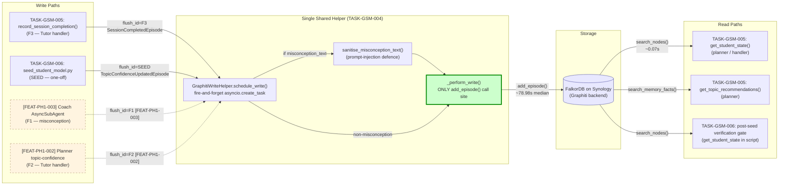
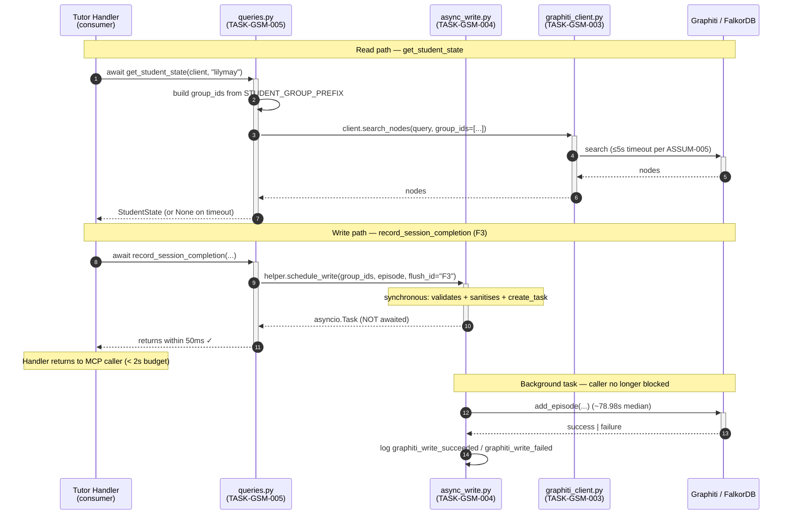
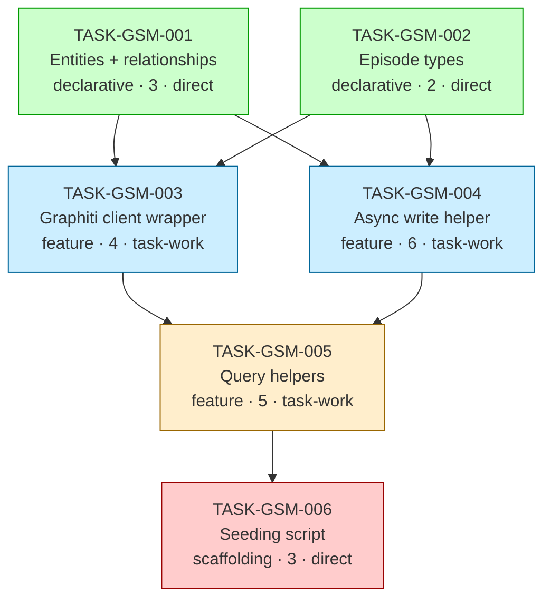

# Implementation Guide — FEAT-1773: Graphiti Student Model

**Parent review:** [TASK-REV-7DC0](../../in_review/TASK-REV-7DC0-plan-graphiti-student-model.md)
**Phase:** Phase 1 (FEAT-PH1-001)
**Generated:** 2026-04-27
**Stack:** python (Pydantic v2 + graphiti-core + FalkorDB on Synology + Gemini extraction LLM)

---

## §1: Overview

This guide drives implementation of FEAT-1773 (Graphiti Student Model) across 6 subtasks
organised into 4 waves, with Conductor parallelism in Waves 1 and 2.

The architecture is **already settled** by accepted decisions:

- **ADR-ARCH-019** — Fire-and-forget Graphiti writes at every write point (78.98s `add_episode`
  median makes any synchronous wait on the caller path infeasible)
- **DDR-002** — Per-observation write ownership: Coach owns F1 (misconception); Tutor handler
  owns F2 (planner confidence delta) and F3 (session-end episode). Single shared helper.
- **DDR-003** — `session.completed` emits on the `active → ended` state transition, before
  the F3 write task is even scheduled. Event/write decoupling.

This implementation translates those decisions into code with one load-bearing structural-conformance
property: **exactly one** `add_episode` call site in the codebase, audited by greppable test.

---

## §2: Data Flow — Read & Write Paths

This is the most important diagram in this guide. If a reviewer only looks at one thing, look here.

**Caption:** Every write path routes through `GraphitiWriteHelper.schedule_write()`, which
contains the single `add_episode()` call site (green node) — the CC-13 conformance surface.
F1 and F2 are dashed because they land in later features; the helper they consume is built
here. All read paths use `search_*` calls scoped by `group_ids` derived from
`STUDENT_GROUP_PREFIX` / `SUBJECT_GROUP_PREFIX` / `FLEET_GROUP_ID`.

**Disconnection check:** ✅ Every write path has a corresponding read path.
- F3 SessionEpisode writes → read by `get_student_state.most_recent_session`
- F1 misconceptions → read by `get_student_state.recent_misconceptions`
- F2 confidence deltas → read by `get_topic_recommendations`
- SEED writes → read by post-seed verification gate

No disconnection alerts.

---

## §3: Integration Contracts (Sequence View)

Cross-task interaction model. Catches the "fetch then discard" anti-pattern.

**Caption:** The handler's return is decoupled from `add_episode`'s ~79s latency. Read
paths inherit timeout via the configured client. The "log graphiti_write_*" line at the end
is the only failure-surface for writes — log-only, never raised to the caller (CC-13).

---

## §4: Integration Contracts

These contracts govern cross-task data dependencies. Each consumer task's frontmatter
includes a `consumer_context` block referencing the contracts it consumes; each consumer
task's body includes seam test stubs validating the contract.

### Contract: PydanticEntities

- **Producer task:** TASK-GSM-001 (entities + relationships)
- **Consumer task(s):** TASK-GSM-002, TASK-GSM-003, TASK-GSM-004, TASK-GSM-005, TASK-GSM-006
- **Artifact type:** Python type definitions (`pydantic.BaseModel` subclasses)
- **Format constraint:** Seven entity classes (`Student`, `Subject`, `Text`, `Topic`,
  `AssessmentObjective`, `Misconception`, `TopicConfidence`) exported from
  `study_tutor.knowledge.student_model`. Type-only imports — no runtime instantiation
  by producer.
- **Validation method:** Each consumer's seam test imports the entities and asserts
  presence + base class.

### Contract: GroupIdConstants

- **Producer task:** TASK-GSM-001 (entities + relationships module)
- **Consumer task(s):** TASK-GSM-003, TASK-GSM-004, TASK-GSM-005, TASK-GSM-006
- **Artifact type:** Module-level string constants
- **Format constraint:** Three constants exposed —
  `STUDENT_GROUP_PREFIX = "student:"`, `SUBJECT_GROUP_PREFIX = "subject:"`,
  `FLEET_GROUP_ID = "fleet:appmilla"`. Lint test (in TASK-GSM-005) rejects raw string
  literals matching `^(student|subject|fleet):` outside `student_model.py`.
  **Cross-repo divergence:** specialist-agent uses `appmilla-fleet` (no colon); study-tutor
  follows phase-1-scope.md per ASSUM-008.
- **Validation method:** Each consumer's seam test asserts the three constant values match
  the documented format. AST-level lint rule asserts no `search_*` call passes a literal
  string for `group_ids`.

### Contract: EpisodeTypes

- **Producer task:** TASK-GSM-002 (episode types)
- **Consumer task(s):** TASK-GSM-004, TASK-GSM-005, TASK-GSM-006
- **Artifact type:** Python type definitions (`EpisodeBase` + 3 concrete subclasses)
- **Format constraint:** `EpisodeBase` provides `episode_kind` discriminator (literal type)
  and `to_graphiti_episode_body() -> str`. Three concrete subclasses
  (`SessionCompletedEpisode`, `TopicConfidenceUpdatedEpisode`, `MisconceptionObservedEpisode`)
  exported from `study_tutor.knowledge.episodes`.
- **Validation method:** Consumer seam test asserts `to_graphiti_episode_body` is callable
  on each subclass and returns a deterministic string.

### Contract: GraphitiClient

- **Producer task:** TASK-GSM-003 (client wrapper)
- **Consumer task(s):** TASK-GSM-005, TASK-GSM-006
- **Artifact type:** Async factory + wrapper class
- **Format constraint:** `await get_client(config) -> GraphitiClient | None`. When
  graphiti-core is absent, FalkorDB unreachable, or healthcheck times out, factory returns
  `None` and emits a structured warning log line (event=`graphiti_client_degraded`). All
  consumers MUST handle `client is None` without raising.
- **Validation method:** Consumer seam test verifies `client=None` paths return safe
  defaults (empty `StudentState`, empty recommendations, no-op writes). Module-load
  integration test runs in a venv without graphiti-core and asserts import succeeds.

### Contract: FalkorDBConnection

- **Producer task:** TASK-GSM-003 (client wrapper)
- **Consumer task(s):** TASK-GSM-005, TASK-GSM-006
- **Artifact type:** Configuration dataclass (`GraphitiConnectionConfig`)
- **Format constraint:** graphiti-core requires FalkorDB driver config of the form
  `host:port` (no URL prefix); LLM provider key via `GOOGLE_API_KEY` env var; embedder
  endpoint via HTTP at `embedder_url`. Read-path timeout default 5s per ASSUM-005.
- **Validation method:** Consumer seam test constructs a `GraphitiConnectionConfig` and
  asserts the timeout default. Integration test asserts `healthcheck()` succeeds in < 5s
  against real Synology FalkorDB.

### Contract: SharedAsyncWriteHelper

- **Producer task:** TASK-GSM-004 (async write helper)
- **Consumer task(s):** TASK-GSM-005 (F3), TASK-GSM-006 (SEED), and future
  FEAT-PH1-002 (F2), FEAT-PH1-003 Coach AsyncSubAgent (F1)
- **Artifact type:** Class method `GraphitiWriteHelper.schedule_write()`
- **Format constraint:** Synchronous dispatcher; signature
  `schedule_write(group_ids: list[str], episode: EpisodeBase, flush_id: Literal["F1", "F2", "F3", "SEED"]) -> asyncio.Task | None`.
  Returns within 50ms even when underlying `add_episode` would take 80s+. Never raises
  to the caller; failures emit structured log lines with `event=graphiti_write_failed`.
  `add_episode(...)` appears in **exactly one** location in the codebase (this module);
  CC-13 conformance test enforces this by AST/grep audit.
- **Validation method:** Consumer seam test asserts a hanging mock `add_episode` does not
  block the consumer's caller-facing return path. CC-13 conformance test
  (`tests/conformance/test_cc13_audit.py`) asserts `git grep -nE 'add_episode\s*\(' src/`
  returns exactly one match.

### Contract: StudentModelQueries

- **Producer task:** TASK-GSM-005 (query helpers)
- **Consumer task(s):** TASK-GSM-006 (post-seed verification gate)
- **Artifact type:** Async functions in `study_tutor.knowledge.queries`
- **Format constraint:** Three functions exposed: `get_student_state`,
  `get_topic_recommendations`, `record_session_completion`. All accept `client` as
  first positional arg; all handle `client=None` without raising. `get_student_state`
  returns `None` on read-path timeout (5s per ASSUM-005).
- **Validation method:** Consumer (TASK-GSM-006) imports `get_student_state` and uses
  it as a post-seed verification gate; seam test scans the seed script's AST for the
  import.

⚠️ **Integration boundary alert:** This feature crosses two technology boundaries —
**FalkorDB ↔ graphiti-core** (infrastructure ↔ consuming framework) and **caller-facing
asyncio handler ↔ background asyncio task** (synchronous boundary). Both are covered by
the contracts above. Add no further `add_episode` call sites in any subsequent feature
without re-examining CC-13 conformance.

---

## §5: Task Dependencies (Wave Structure)

**Caption:** Wave 1 (green) and Wave 2 (blue) tasks within each wave can run in parallel
under Conductor. Wave 3 and Wave 4 are sequential single-task waves.

---

## §6: Execution Strategy

| Wave | Tasks | Parallelism | Conductor | Estimated Effort |
|------|-------|-------------|-----------|------------------|
| 1 | TASK-GSM-001, TASK-GSM-002 | ⚡ Parallel | Yes | ~1.5h elapsed (1.5h + 0.5h work) |
| 2 | TASK-GSM-003, TASK-GSM-004 | ⚡ Parallel | Yes | ~2.5h elapsed (1.5h + 2.5h work) |
| 3 | TASK-GSM-005 | Sequential | No | ~2.5h |
| 4 | TASK-GSM-006 | Sequential | No | ~1h |

**Total work:** 9.5h
**Total elapsed (with parallelism):** ~7.5h
**Conductor savings:** ~2h

---

## §7: Risk Register

| # | Risk | Severity | Mitigation | Owner Task |
|---|------|----------|------------|------------|
| R1 | A future PR adds bespoke `add_episode` outside the shared helper, breaking DDR-002 auditability | High | CC-13 conformance test in `tests/conformance/test_cc13_audit.py` greps for `add_episode\s*\(` and asserts exactly one match (TASK-GSM-004 module) | TASK-GSM-004 |
| R2 | Coach AsyncSubAgent (F1) and handler (F2/F3) compete on the same write — last-write-wins races | Medium | Per-write `asyncio.create_task` isolates; no cross-write coordination required. `@concurrency` scenarios cover the cases. | TASK-GSM-004 |
| R3 | Process crash mid-write loses in-flight episodes; ASSUM-007's 30s grace is unverified | Medium | Acceptable for Phase 1 MVP per ADR-ARCH-014. Helper's `drain()` honours `GRAPHITI_SHUTDOWN_GRACE_SEC` env var (default 30s). Add `@crash-recovery` integration test. | TASK-GSM-004 |
| R4 | `tutor_session_end` returns < 2s only if helper's dispatch path never `await`s | High | Handler-budget conformance test: synthetic handler that schedules a hanging episode returns < 2s. | TASK-GSM-004 |
| R5 | Query helper omits `group_ids=` and accidentally queries across all learners | High | Wrap `search_*` calls in module-private functions that REQUIRE `group_ids` as positional arg (no default). AST lint test in TASK-GSM-005 fails CI if a `search_*` call passes a literal string. | TASK-GSM-005 |
| R6 | Cross-repo group-id discrepancy (`fleet:appmilla` vs `appmilla-fleet`) creates silent drift if a future feature shares group ids cross-repo | Medium | Documented in TASK-GSM-001 module docstring + ASSUM-008 cross-repo note. Future cross-repo feature MUST resolve. | TASK-GSM-001 |
| R7 | Misconception text contains adversarial payload that manipulates Graphiti's extraction LLM (Gemini) into creating bogus entities | High | `sanitise_misconception_text()` in TASK-GSM-004: 500-char cap, control-char strip, coarse injection-pattern reject (`ignore previous`, `system:`, `<\|...\|>`, `[INST]`). Security tests assert no `admin`/`root` entity created post-injection. | TASK-GSM-004 |
| R8 | Seed script run twice creates duplicate entities | Medium | Idempotency check via `get_student_state` pre-flight (TASK-GSM-006 acceptance criteria). | TASK-GSM-006 |

---

## §8: Conformance Tests (cross-cutting)

These tests live alongside the feature and remain in CI for the lifetime of Phase 1+:

- **CC-13 single-call-site audit** — `tests/conformance/test_cc13_audit.py`:
  - `git grep -nE 'add_episode\s*\(' src/` returns exactly 1 match (TASK-GSM-004's `_perform_write`)
  - Owner: TASK-GSM-004

- **Handler-budget audit** — `tests/conformance/test_handler_budget.py`:
  - Synthetic handler that schedules a hanging episode write returns < 2s
  - Mocked `add_episode` set to `await asyncio.sleep(80)`
  - Owner: TASK-GSM-004

- **Group-id discipline audit** — `tests/conformance/test_group_id_discipline.py`:
  - AST scan: every `search_nodes(...)`, `search_memory_facts(...)` call inside `src/study_tutor/`
    passes a non-literal `group_ids=` (i.e. constructed from constants, not bare strings)
  - Owner: TASK-GSM-005

---

## §9: Open Items (for follow-up)

- **ASSUM-007 verification** — The 30s shutdown grace period is a low-confidence assumption.
  Validate during Phase 1 demo testing. If it proves too short or too long, promote
  `GRAPHITI_SHUTDOWN_GRACE_SEC` to a documented config in `phase-1-scope.md`.
- **ASSUM-008 cross-repo reconciliation** — `fleet:appmilla` vs `appmilla-fleet` divergence
  is documented but not resolved. Future feature that shares group ids cross-repo must
  resolve.
- **DDR-003 event-emit-before-write wiring** — In TASK-GSM-005, `record_session_completion`
  has a `# TODO(FEAT-PH1-003)` comment for the eventual `session.completed` bus emit.
  When FEAT-PH1-003 lands the bus, that wiring must follow the order: emit → schedule_write.

---

## §10: Next Steps

1. Review this guide
2. Review the 6 task files in this directory
3. Start with Wave 1: launch Conductor for TASK-GSM-001 and TASK-GSM-002 in parallel
4. After Wave 1 lands: launch Conductor for Wave 2 (TASK-GSM-003 + TASK-GSM-004)
5. Run TASK-GSM-005 (sequential)
6. Run TASK-GSM-006 against Synology FalkorDB to seed Lilymay's baseline
7. Verify post-seed: a fresh `get_student_state(client, "lilymay")` returns the seeded baseline

When all 6 tasks complete, FEAT-1773 is functionally complete and the substrate is ready
for FEAT-PH1-002 (planner) and FEAT-PH1-003 (Player-Coach loop).
