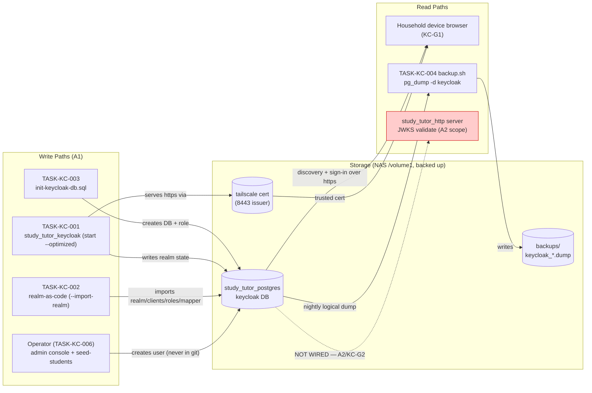
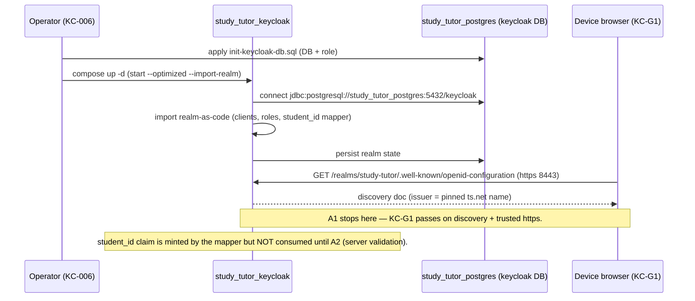
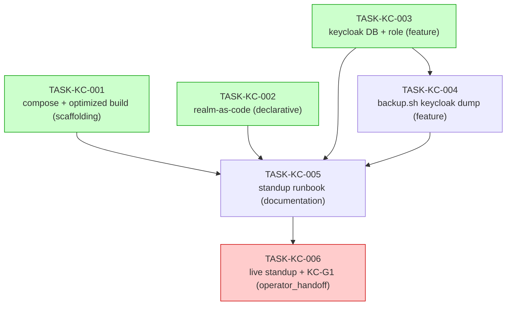

# IMPLEMENTATION GUIDE — FEAT-AUTH-001 A1: Keycloak IdP Standup on the NAS

**Feature:** FEAT-AUTH-001 (A1 standup slice) · **Review:** TASK-REV-KCA1 · **Complexity:** 6/10
**Approach:** Option 1 — prod-safe realm base + runbook-created dev additions (KC-D3 PII posture)
**Deliverable shape:** runbook + committable artifacts (deploy.sh/smoke.sh deferred, as with the postgres slice)

Stand up `study_tutor_keycloak` on the NAS with realm-as-code, tailnet TLS, a
co-located `keycloak` DB, and backups — passing gate **KC-G1**. Mirrors the proven
[Postgres deploy runbook](../../../docs/runbooks/RUNBOOK-study-tutor-postgres-deploy.md)
G0–G7 gate model. Architecture ratified in
[ADR-ARCH-028](../../../docs/architecture/decisions/ADR-ARCH-028-keycloak-idp-nas-placement-tailnet-tls.md)
and [design KC-D1…D7](../../../docs/design/keycloak-auth-user-management-design.md).

---

## §1 Data Flow: Read/Write Paths

Every write path and read path for the A1 slice. **Look for:** the token-validation
read path (server → JWKS) is deliberately **NOT WIRED** in A1 — it is A2 scope.

**Disconnection Alert (acknowledged, not a defect):** the server JWKS read path
(R3) has no caller in A1 — token validation (`TokenResolver` / `auth_keycloak.py`)
is **A2 scope** (design §3 step 2, gate KC-G2), explicitly out of scope for this
slice. It is marked deferred, not wired here, per the design's phased rollout. No
A1 task wires it; this is the intended boundary, not a missing path.

---

## §2 Integration Contract sequence (fetch-then-use check)

**Look for:** the realm `student_id` claim is *produced* in A1 (mapper) but only
*consumed* in A2 — A1 stops at "realm serves discovery"; no A1 component reads the
claim (correctly).

---

## §3 Task Dependencies

**Look for:** wave 1 runs three artifact-authoring tasks in parallel (distinct
files, contracts pinned in §4); the operator_handoff live standup is the tail.

_Green = wave-1 parallel-safe (distinct files under `deploy/keycloak/`). Red =
operator-executed (AutoBuild will not attempt it)._

**Execution waves:**

| Wave | Tasks | Notes |
|---|---|---|
| 1 | TASK-KC-001, TASK-KC-002, TASK-KC-003 | Parallel — distinct files; §4 contracts pin the shared names so no build-order dependency |
| 2 | TASK-KC-004 | Extends `deploy/postgres/backup.sh`; needs the `keycloak` DB defined (TASK-KC-003) |
| 3 | TASK-KC-005 | Runbook documents all four artifacts |
| 4 | TASK-KC-006 | **operator_handoff** — live NAS standup + KC-G1 gate |

---

## §4 Integration Contracts

Cross-task data dependencies exist (Keycloak consumes the co-located DB and the
realm-as-code), so contracts are pinned here. The request names an infra service
(Postgres) **and** a consuming framework (Keycloak 26.6 JDBC), so the exact
connection URL form is specified.

### Contract: KEYCLOAK_DB
- **Producer task:** TASK-KC-003 (creates `keycloak` DB + non-superuser role)
- **Consumer task(s):** TASK-KC-001 (Keycloak JDBC connection), TASK-KC-004 (pg_dump target)
- **Artifact type:** Postgres database + role inside `study_tutor_postgres`
- **Format constraint:**
  - Keycloak (TASK-KC-001): `KC_DB=postgres`, `KC_DB_URL=jdbc:postgresql://study_tutor_postgres:5432/keycloak`, `KC_DB_USERNAME=keycloak`, `KC_DB_PASSWORD=<env>`. **Intra-network port is 5432** (the host `:5434` maps to the container's `:5432`); Keycloak reaches Postgres by service name over a shared docker network, or via the NAS host `:5434` if networks are not shared — never assume `:5434` inside the container network.
  - Backup (TASK-KC-004): dump target DB name is exactly `keycloak`; dump **as the `keycloak` role** (`pg_dump -U keycloak -d keycloak -Fc`) because the `study_tutor` role has no grants into the `keycloak` DB (KC-D3 isolation).
- **Validation method:** Coach greps `deploy/keycloak/docker-compose.yml` for `jdbc:postgresql://study_tutor_postgres:5432/keycloak` and `deploy/postgres/backup.sh` for `pg_dump … -d keycloak`.

### Contract: REALM_IMPORT
- **Producer task:** TASK-KC-002 (`deploy/keycloak/realm/study-tutor-realm.json`)
- **Consumer task(s):** TASK-KC-001 (compose realm mount + `--import-realm`)
- **Artifact type:** realm-as-code JSON directory
- **Format constraint:** realm JSON placed in the dir mounted read-only to `/opt/keycloak/data/import`; imported on optimized start via `--import-realm`; realm and client `id` fields **pinned** to prevent sub-drift across down/up cycles (lpa-poc §3). No users, no secrets, no `live-suite` in the committed prod realm.
- **Validation method:** Coach verifies the compose mounts the realm dir to `/opt/keycloak/data/import` and the start command includes `--import-realm`; greps the realm JSON for absence of `users`/`secret`/`live-suite`.

---

## §5 Security & quality notes (review lens: security + quality)

- **PII posture (KC-D3):** users and secrets are **never committed** — only
  realm/clients/roles/mapper. TASK-KC-002 enforces this as a permanent invariant
  (grep-verifiable absence of `users`/`secret`/`live-suite`).
- **Least privilege (KC-D3):** the `keycloak` role is a distinct non-superuser
  that cannot read learner tables (TASK-KC-003 AC + KC-G1 negative proof).
- **Tailnet-only, no WAN** — identical three-layer posture to the `:5434` deploy;
  admin console tailnet-only (TASK-KC-005 / TASK-KC-006).
- **Residual risk (ADR-028):** the DSM `tailscale cert` path is the single
  unproven leg; two ordered fallbacks documented (`tailscale serve` → GB10).
- **Trajectory ([ADR-ARCH-029](../../../docs/architecture/decisions/ADR-ARCH-029-phased-productionisation-local-first-cloud-native-target.md)):**
  the `tailscale cert`/MagicDNS issuer + `extra_hosts` JWKS workaround are
  transient Phase-2 scaffolding; the `iss`-vs-internal-URL *split* survives to
  Phase 3. Keep the compose/env portable.

## §6 Definition of Done (A1)

All five artifact tasks merged (compose, realm, DB/role, backup, runbook), then
gate **KC-G1** passed and evidenced by the operator (TASK-KC-006). A1 does **not**
turn auth on anywhere — the server stays in `table` mode until A2/KC-G2.
