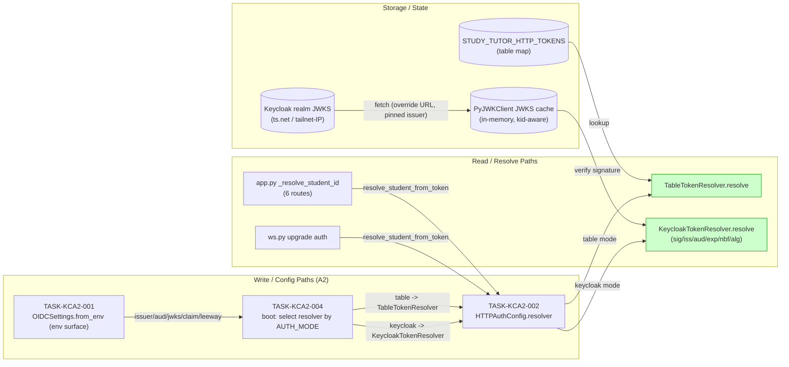
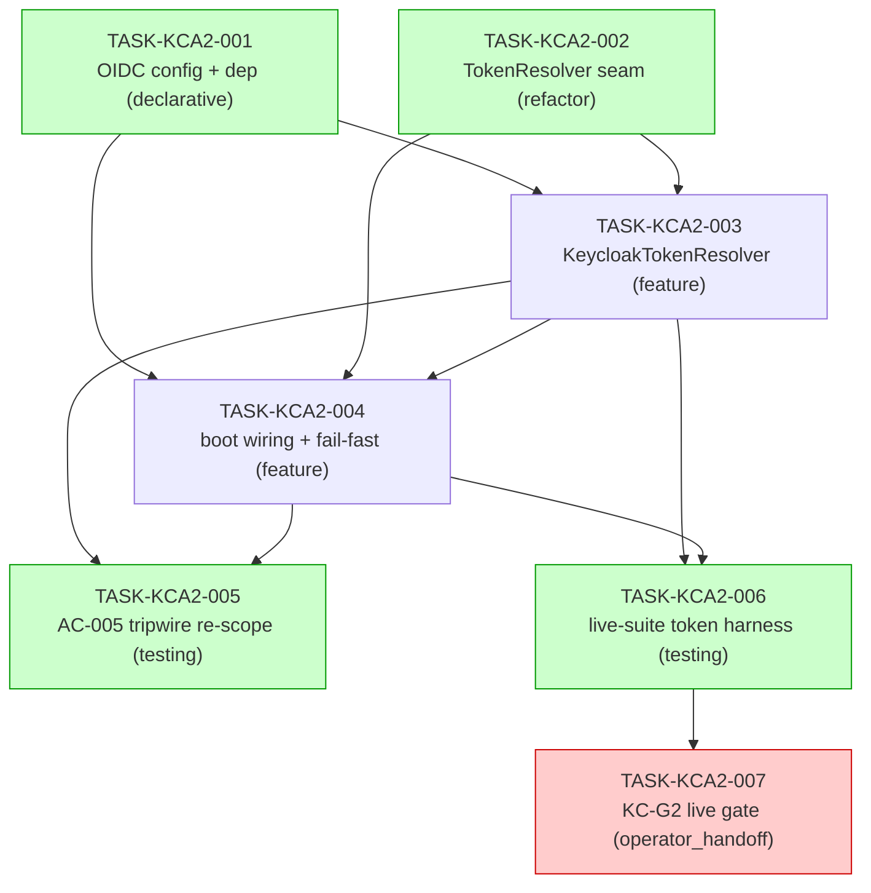

# IMPLEMENTATION GUIDE — FEAT-AUTH-002 A2: Keycloak Server-Side Token Validation

**Feature:** FEAT-AUTH-002 (A2 server slice) · **Review:** TASK-REV-KCA2 · **Complexity:** 8/10
**Approach:** Option 1 — the selected `TokenResolver` is carried on `HTTPAuthConfig`, so
`resolve_student_from_token(header, config, store)` keeps its signature and the app.py/ws.py
callsites are untouched. `auth.py` stays JWT-free; all PyJWT/Keycloak imports live in the new
sibling `http/auth_keycloak.py`.
**Trade-off:** quality/reliability · **Testing:** standard quality gates · **Execution:** detect waves

Add real Keycloak token validation behind the `STUDY_TUTOR_AUTH_MODE=table|keycloak` flag per
design [KC-D6](../../../docs/design/keycloak-auth-user-management-design.md). Default `table`
everywhere → merging A2 changes nothing in prod. This slice **wires the server JWKS read path
that A1 deliberately left `NOT WIRED`** (gate KC-G2).

---

## §1 Data Flow: Read/Write Paths

Every write path and read path for the A2 slice. **Look for:** the previously-deferred
server→JWKS validation read path (R3 in A1) is now **wired** — no disconnected paths remain.



**Disconnection check:** none. Both resolve paths (R3 table, R4 keycloak) have callers
(app.py routes + ws.py upgrade, via the shared `resolve_student_from_token`). The JWKS read
path (R4 → S2 → S3) that A1 marked `NOT WIRED` is wired by this slice — that is the whole
point of A2. The unseeded-student guard (unchanged) runs after `resolve` returns.

---

## §2 Integration Contract sequence (fetch-then-use check)

**Look for:** the validated `student_id` claim is *produced* by `KeycloakTokenResolver` and
*consumed* by the unchanged unseeded guard + the caller — the student is always taken from the
**verified token**, never from the request body (KC-D3).

```mermaid
sequenceDiagram
    participant Rt as Route / WS upgrade
    participant AF as resolve_student_from_token (auth.py)
    participant KR as KeycloakTokenResolver (auth_keycloak.py)
    participant JW as PyJWKClient (JWKS cache)
    participant KC as Keycloak realm
    participant SS as StudentStore (unseeded guard)

    Rt->>AF: resolve_student_from_token(header, config, store)
    AF->>AF: (1) Bearer extraction (unchanged)
    AF->>KR: (2) resolver.resolve(token)
    KR->>JW: signing_key_from_jwt(token)
    alt kid not cached
        JW->>KC: GET JWKS (override URL; issuer stays ts.net)
        KC-->>JW: keys
    end
    JW-->>KR: signing key
    KR->>KR: verify sig + iss + aud + exp/nbf(60s) + alg allowlist
    KR->>KR: extract student_id claim (or Unauthenticated)
    KR-->>AF: student_id (verified)
    AF->>SS: (3) student_exists(student_id) — unchanged guard
    SS-->>AF: True / False
    AF-->>Rt: student_id  (or Unauthenticated — never a 500)
    Note over AF,SS: student always from the verified token, never the request body (KC-D3)
```

---

## §3 Task Dependencies

**Look for:** wave 1 runs two foundation tasks in parallel (distinct files: `pyproject`/
`oidc_config.py` vs `auth.py`); the operator_handoff KC-G2 gate is the tail.



_Green = parallel-safe within its wave (distinct files). Red = operator-executed (AutoBuild
will not attempt it). Waves: 1 = {001,002}, 2 = {003}, 3 = {004}, 4 = {005,006}, 5 = {007}._

---

## §4 Integration Contracts

Cross-task data dependencies. Each producer artifact must reach its consumer in the exact
shape below — unspecified cross-task contracts are the #1 source of integration-boundary bugs.

### Contract: OIDC_SETTINGS
- **Producer task:** TASK-KCA2-001 (`OIDCSettings.from_env`)
- **Consumer task(s):** TASK-KCA2-003 (resolver), TASK-KCA2-004 (boot fail-fast)
- **Artifact type:** frozen settings object built from the env surface
- **Format constraint:** `issuer` is the **ts.net https** name used for `iss` validation and
  stays pinned even when `jwks_url` is overridden to a tailnet IP (KC-D2); `audience` matches
  the token `aud`; `student_claim` defaults to `student_id`; `leeway` defaults to `60`s on
  `exp`/`nbf`; `validate()` returns `[]` only when issuer **and** audience are present in
  keycloak mode and the mode value is one of `table|keycloak`.
- **Validation method:** Coach verifies `validate()` yields boot-blocking messages for
  missing issuer/audience and unknown mode; the resolver's `expected_issuer` equals the
  ts.net name, not the JWKS URL (seam test in TASK-KCA2-003).

### Contract: TOKEN_RESOLVER
- **Producer task:** TASK-KCA2-002 (`TokenResolver` protocol + `TableTokenResolver`)
- **Consumer task(s):** TASK-KCA2-004 (boot selection + injection)
- **Artifact type:** async protocol carried on `HTTPAuthConfig.resolver`
- **Format constraint:** `async resolve(token: str) -> str` raising `Unauthenticated` on any
  un-resolvable token; injected via `HTTPAuthConfig` so `resolve_student_from_token` keeps its
  signature and app.py/ws.py callsites are unchanged.
- **Validation method:** Coach verifies `HTTPAuthConfig.resolver` is populated in both modes
  and that the app.py/ws.py callsites are untouched (seam test in TASK-KCA2-004).

> **Cross-feature input (not an intra-A2 contract):** the `student_id` **claim** in tokens is
> produced by the FEAT-AUTH-001 realm mapper (KC-D3). A2 only *consumes* it via
> `OIDCSettings.student_claim`. No A2 task produces the claim.

---

## Security checklist (focus lens)

- [ ] Algorithm **allowlist** `["RS256"]` — `alg:none` and HS256 explicitly rejected (alg-confusion)
- [ ] `iss` / `aud` / `exp` / `nbf` all verified; 60s leeway on `exp`/`nbf` (ASSUM-001)
- [ ] Every failure mode → `Unauthenticated`, **never a 500** (unreachable JWKS, unknown kid, missing claim, garbage token)
- [ ] `auth.py` stays JWT-free (AC-005 tripwire, re-scoped by TASK-KCA2-005)
- [ ] Boot fail-fast (`SystemExit`) on incomplete keycloak config **and** unknown mode
- [ ] Table mode byte-for-byte identical (smoke scenario 1)
- [ ] Hermetic suites mint no real tokens; live tokens only via the dev-realm live-suite client
</content>
</invoke>
