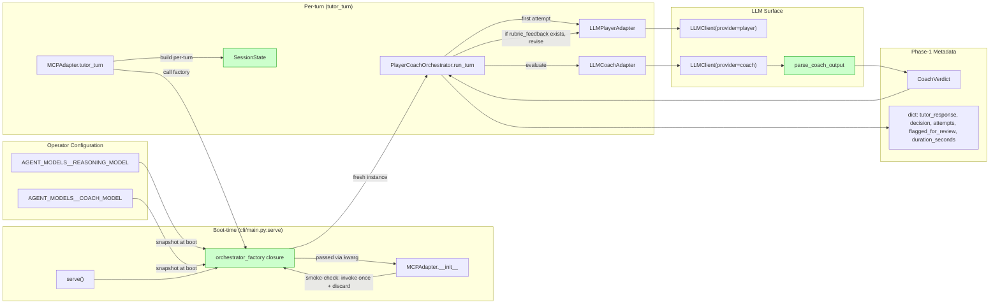
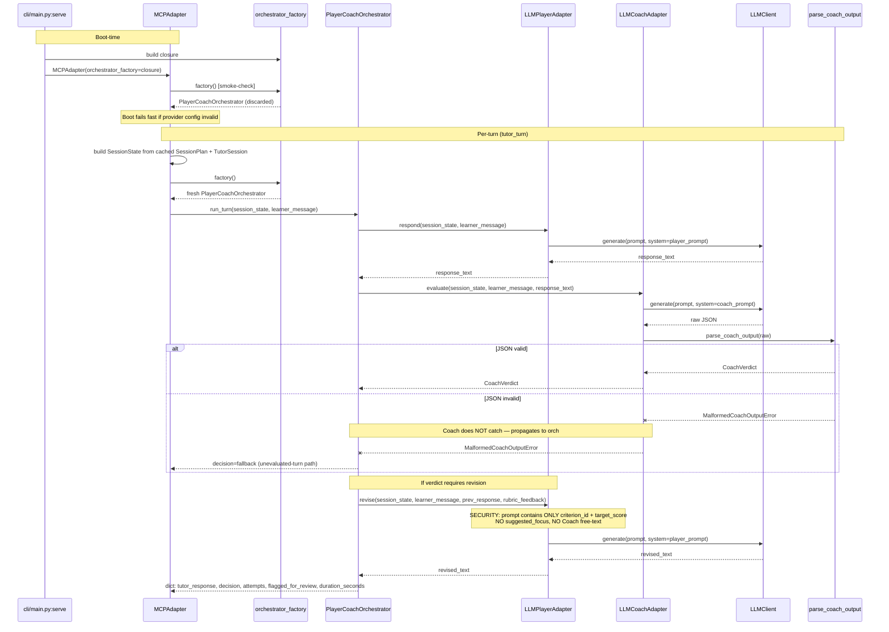
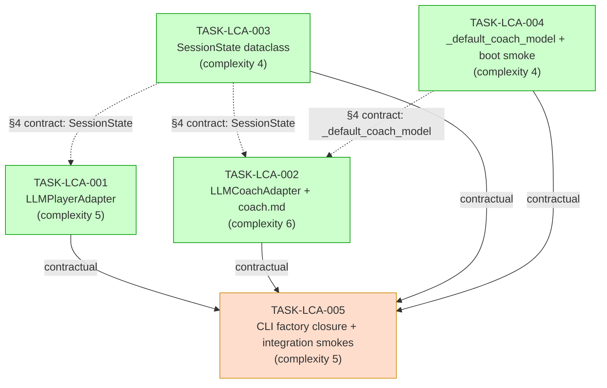

# Implementation Guide: MCP LLM Player and Coach Adapters

**Feature ID**: FEAT-6CC5
**Parent review**: TASK-REV-LCA1
**Recommended path**: Path C (hybrid) — LLM emits per-criterion JSON, deterministic post-processing assembles verdict via `parse_coach_output`
**Total subtasks**: 5 (4 parallel in Wave 1, 1 sequential in Wave 2)
**Aggregate complexity**: 6/10
**Estimated effort**: ~7.25h impl + buffer ≈ 8–12 hours
**Smoke gate**: `pytest -m "feat_lca and smoke"`

## Architecture Overview

This feature replaces the Phase-0 single-LLM `LLMClient.generate` shortcut in
`MCPAdapter.tutor_turn` with the production `PlayerCoachOrchestrator.run_turn`
path. It introduces:

- **`LLMPlayerAdapter`** — production `PlayerLike` implementation
- **`LLMCoachAdapter`** — production `CoachLike` implementation (Path C hybrid)
- **`SessionState`** — typed boundary dataclass replacing `Any`-shaped dicts
- **`_default_coach_model()`** — env-var-driven Coach provider resolution
- **Boot smoke check** — surfaces config errors at server boot, not at first turn
- **CLI factory closure** — per-turn isolation invariant enforcement

## §1: Data Flow — Read/Write Paths



_All paths are connected. No write-without-read dispositions; no read-without-caller orphans._

**Disconnection check**: ✅ All read paths have an upstream caller. The `quote_verifier` and `coach_handover` parameters are intentionally `None` on first cut (ASSUM-LCA-015) — these are explicitly documented follow-ups, not silent disconnections.

## §2: Integration Contract — Per-Turn Sequence



_The `MalformedCoachOutputError` propagation path is the explicit fallback contract (AC-LCA-06). The `revise()` security note is the load-bearing ASSUM-008 boundary._

## §3: Task Dependency Graph



_Green tasks (Wave 1) run in parallel via Conductor; orange task (Wave 2) is sequential. Solid arrows are graph-level dependencies; dotted arrows are §4 integration contracts (developed against a fixed shape, no graph dependency)._

## §4: Integration Contracts

Three cross-task data dependencies are specified to prevent
integration-boundary bugs. Producer and consumer develop in parallel against
the locked contract; the contract is asserted by seam tests in each consumer
task.

### Contract: SessionState

- **Producer task**: TASK-LCA-003
- **Consumer task(s)**: TASK-LCA-001, TASK-LCA-002
- **Artifact type**: Python `@dataclass(frozen=True)` exposed at `study_tutor.tutoring.adapters.session_state.SessionState`
- **Format constraint**:
  - Required fields: `session_id: str`, `student_id: str`
  - Optional fields with defaults: `text_name: str | None = None`, `topic: str | None = None`, `focus_aos: tuple[str, ...] = ()`, `mode: str = "tutor"`
  - `frozen=True` — mutation must raise at runtime
  - Field access via attribute syntax (`state.session_id`), not subscript (`state["session_id"]`)
- **Validation method**: Coach verifies via:
  - `tests/unit/tutoring/adapters/test_session_state.py` — required fields, defaults, immutability, hashability
  - Each consumer's `## Seam Tests` block — asserts shape and access pattern
  - The MCP construction site (`adapter.py:292`) builds SessionState from `SessionPlan` + `TutorSession`

### Contract: _default_coach_model()

- **Producer task**: TASK-LCA-004
- **Consumer task(s)**: TASK-LCA-002
- **Artifact type**: Python function exposed at `study_tutor.llm.client._default_coach_model`
- **Format constraint**:
  - Signature: `() -> str`
  - Returns the value of env var `AGENT_MODELS__COACH_MODEL` verbatim (no canonicalisation)
  - Raises `LLMProviderError` (existing class in `llm/client.py`) when the env var is unset OR an empty string after `.strip()`
  - Error message MUST contain the literal substring `"AGENT_MODELS__COACH_MODEL"` so operators can grep their logs
  - Call-time resolution (SR-03 pattern); not cached
- **Validation method**: Coach verifies via:
  - `tests/unit/llm/test_client.py` — env-set, env-unset, env-empty cases all pass
  - TASK-LCA-002's `## Seam Tests` block — asserts the contract from the consumer's perspective

### Contract: AGENT_MODELS__COACH_MODEL env var

- **Producer task**: TASK-LCA-004 (documents in `.env.example`; helper reads it)
- **Consumer task(s)**: TASK-LCA-002 (via `_default_coach_model()`); TASK-LCA-005 (factory closure)
- **Artifact type**: environment variable read by `_default_coach_model()` at call time
- **Format constraint**:
  - String accepted by `LLMClient(provider=...)` (e.g. `"anthropic"`, `"bedrock"`, `"openai"`, `"local"`)
  - Snapshot at boot (ASSUM-LCA-008): the orchestrator factory closure resolves provider via `_default_coach_model()` on each turn, but the boot smoke check resolves it once at `__init__`. Operator rotation requires a server restart.
  - Must differ from `AGENT_MODELS__REASONING_MODEL` exactly (D3 invariant; enforced by `validate_coach_config` at `coach/factory.py:326`)
- **Validation method**:
  - `.env.example` carries the placeholder + comment explaining D3 + restart-after-rotation semantics
  - Boot smoke check at `MCPAdapter.__init__` invokes the factory once, surfacing `CoachConfigurationError` if both env vars share a provider
  - AC-LCA-08 integration test asserts boot fails fast with both env vars set to the same provider

## Wave Plan

### Wave 1 — Parallel (Conductor recommended)

All four tasks run concurrently. No file conflicts (adapter package is new; the two
`mcp/adapter.py` edits target different lines — `__init__` (TASK-LCA-004, line 153
neighbourhood) vs `tutor_turn` (TASK-LCA-003, line 292)). Per Q4 of Context A,
the spec wave shape is preserved.

| Task | Files (write) | Files (edit) | Test marker |
|------|--------------|--------------|-------------|
| TASK-LCA-001 | `src/study_tutor/tutoring/adapters/llm_player_adapter.py` (new), `tests/unit/tutoring/adapters/test_llm_player_adapter.py` (new) | — | `@pytest.mark.feat_lca` |
| TASK-LCA-002 | `src/study_tutor/tutoring/adapters/llm_coach_adapter.py` (new), `roles/tutor/prompts/coach.md` (new), `tests/unit/tutoring/adapters/test_llm_coach_adapter.py` (new) | `src/study_tutor/roles/loader.py` (add `load_coach_prompt`) | `@pytest.mark.feat_lca` |
| TASK-LCA-003 | `src/study_tutor/tutoring/adapters/__init__.py` (new), `src/study_tutor/tutoring/adapters/session_state.py` (new), `tests/unit/tutoring/adapters/test_session_state.py` (new) | `src/study_tutor/mcp/adapter.py` (line 292 — call-site build of SessionState) | `@pytest.mark.feat_lca` |
| TASK-LCA-004 | `tests/unit/llm/test_client.py` (extend) | `src/study_tutor/llm/client.py` (add `_default_coach_model`), `src/study_tutor/mcp/adapter.py` (`__init__` smoke check at line 153 neighbourhood), `.env.example` | `@pytest.mark.feat_lca` |

**Conductor workspaces** (auto-assigned per Context B Q5 default):
- `mcp-llm-player-coach-adapters-wave1-1` ← TASK-LCA-001
- `mcp-llm-player-coach-adapters-wave1-2` ← TASK-LCA-002
- `mcp-llm-player-coach-adapters-wave1-3` ← TASK-LCA-003
- `mcp-llm-player-coach-adapters-wave1-4` ← TASK-LCA-004

### Wave 2 — Sequential (after all Wave-1 tasks complete)

| Task | Files (write) | Files (edit) | Test marker |
|------|--------------|--------------|-------------|
| TASK-LCA-005 | `tests/integration/test_mcp_lca_smoke.py` (new) | `src/study_tutor/cli/main.py` (extend `serve` to build factory closure) | `@pytest.mark.feat_lca and @pytest.mark.smoke` |

## Smoke Gate

After Wave 2 lands, the smoke gate is:

```bash
pytest -m "feat_lca and smoke" -x
```

This selects:
- `@feat_lca @smoke` per-turn isolation (AC-LCA-01)
- `@feat_lca @smoke` Phase-1 metadata shape (AC-LCA-09)
- `@feat_lca @smoke` Coach malformed-output fallback (AC-LCA-06)
- `@feat_lca @smoke` boot-time same-provider rejection (AC-LCA-02 / AC-LCA-08)
- `@feat_lca @smoke` orchestrator-factory invocation isolation

The live Lilymay session (AC-LCA-10) is `@pytest.mark.live` and is excluded
from the default smoke gate; it is operator-conducted with the
calibration-fallback wording from Context A Q5.

## Load-Bearing Invariants (Quick Reference)

| Invariant | Subtask | AC | Where enforced |
|-----------|---------|----|----------------|
| D3 two-provider — Coach provider must differ from Player provider exactly | TASK-LCA-004 | AC-LCA-02, AC-LCA-08 | `validate_coach_config` (`coach/factory.py:326`) + boot smoke check |
| ASSUM-008 structured-only revision channel — no Coach free-text into Player prompt | TASK-LCA-001 | AC-LCA-04 | `LLMPlayerAdapter._assemble_revise_prompt` |
| Per-turn factory isolation — every turn gets a fresh orchestrator | TASK-LCA-005 | AC-LCA-01 | `cli/main.py:serve` factory closure + `MCPAdapter.tutor_turn` |
| Env-var snapshot at boot — `AGENT_MODELS__*` resolved once at boot | TASK-LCA-004 | AC-LCA-02, AC-LCA-08 | `MCPAdapter.__init__` smoke-check invocation |
| Boot-time failure surfaces, not first-turn | TASK-LCA-004 | AC-LCA-02 | `MCPAdapter.__init__` re-raise |
| Coach malformed-output → fallback | TASK-LCA-002 | AC-LCA-06 | `LLMCoachAdapter` does NOT catch `MalformedCoachOutputError`; orchestrator routes to `decision=fallback` |

## Medium-Confidence Assumptions Spotlighted (Context A Q3)

All six flagged for explicit planning notes per Context A:

| Assumption | Subtask | How addressed |
|------------|---------|---------------|
| ASSUM-LCA-005 (Coach JSON extra-criteria = silently discard) | TASK-LCA-002 | AC requires `parse_coach_output` test suite to lock down discard policy |
| ASSUM-LCA-006 (revise prompt: criterion_id + target_score only) | TASK-LCA-001 | AC explicitly excludes `suggested_focus`; unit test asserts no leak |
| ASSUM-LCA-007 (SessionState required vs optional fields) | TASK-LCA-003 | AC specifies exact field shape with required/optional split |
| ASSUM-LCA-008 (env var snapshot at boot) | TASK-LCA-004 | `.env.example` documents restart-after-rotation requirement |
| ASSUM-LCA-010 (Coach prompt <300 words for Phase-1) | TASK-LCA-002 | AC enforces <300-word ceiling on `coach.md` |
| ASSUM-LCA-015 (`quote_verifier`/`coach_handover` both None) | TASK-LCA-005 | First cut wires both to `None`; follow-up subtask documented in this guide |

## Follow-up Subtasks (out of scope for this feature)

- **`quote_verifier` wiring** (consumer of FEAT-PH1-004) — adds primary-text quote verification before Coach evaluation
- **`coach_handover` wiring** — adds the deepagents `AsyncSubAgent` migration per ADR-ARCH-012
- **Coach calibration / `suggested_focus` in revise prompt** — Phase-2 calibration pass per TASK-REV-GRD5

## Cross-References

- **Source brief**: `docs/research/ideas/llm-player-coach-adapters-brief.md`
- **Feature spec summary**: `features/mcp-llm-player-coach-adapters/mcp-llm-player-coach-adapters_summary.md`
- **Review report**: `.claude/reviews/TASK-REV-LCA1-review-report.md`
- **Existing surfaces**:
  - `src/study_tutor/tutoring/orchestrator.py:123` (`PlayerLike`)
  - `src/study_tutor/tutoring/orchestrator.py:152` (`CoachLike`)
  - `src/study_tutor/tutoring/orchestrator.py:333` (`PlayerCoachOrchestrator`)
  - `src/study_tutor/tutoring/coach/factory.py:326` (`validate_coach_config`)
  - `src/study_tutor/tutoring/coach/rubric.py:597` (`parse_coach_output`)
  - `src/study_tutor/llm/client.py:47` (`_default_player_model` — pattern to mirror)
  - `src/study_tutor/mcp/adapter.py:129` (`MCPAdapter.__init__` — already accepts `orchestrator_factory` kwarg)
  - `src/study_tutor/mcp/adapter.py:292` (`tutor_turn` call site — already routes via factory when supplied)
- **ADRs**:
  - `docs/architecture/decisions/ADR-ARCH-012-deepagents-0-5-3-asyncsubagent-coach.md`
  - `docs/architecture/decisions/ADR-ARCH-019-async-graphiti-writeback-every-write-point.md`

## Next Steps

1. Review this guide and the per-task acceptance criteria
2. Run Wave 1 in parallel (Conductor recommended): `TASK-LCA-001`, `TASK-LCA-002`, `TASK-LCA-003`, `TASK-LCA-004`
3. After all Wave 1 tasks complete: run TASK-LCA-005
4. Run smoke gate: `pytest -m "feat_lca and smoke" -x`
5. Operator-conducted live Lilymay session (AC-LCA-10) — capture outcome in operator log

For autonomous execution: `/feature-build FEAT-6CC5` (after the structured YAML is generated in Step 10).
