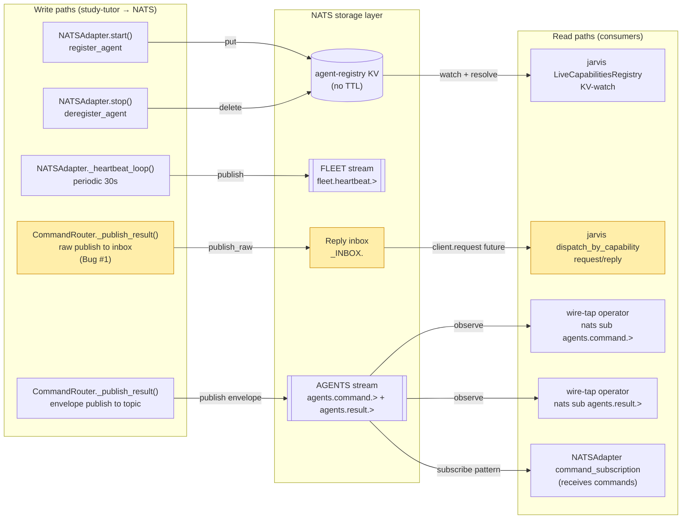
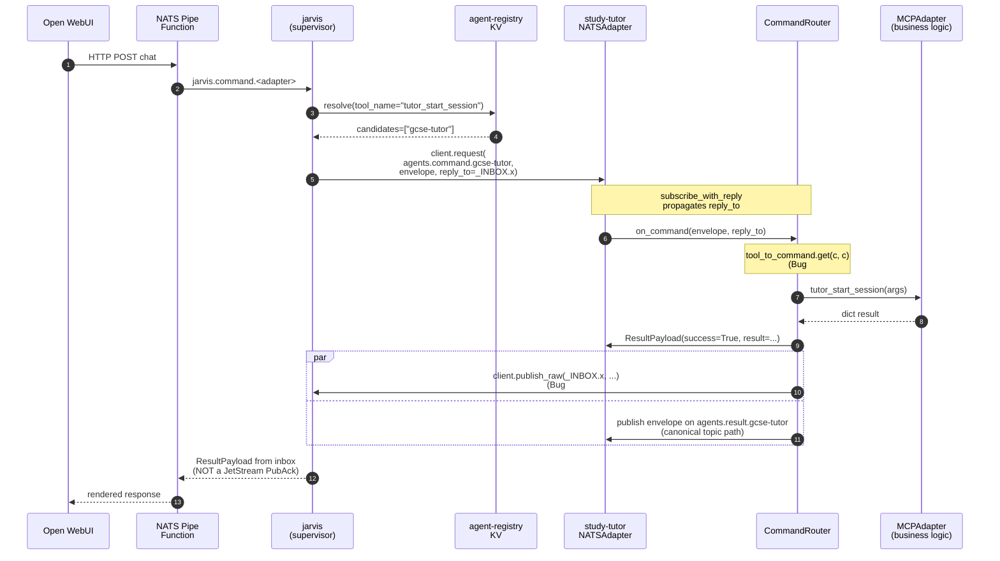
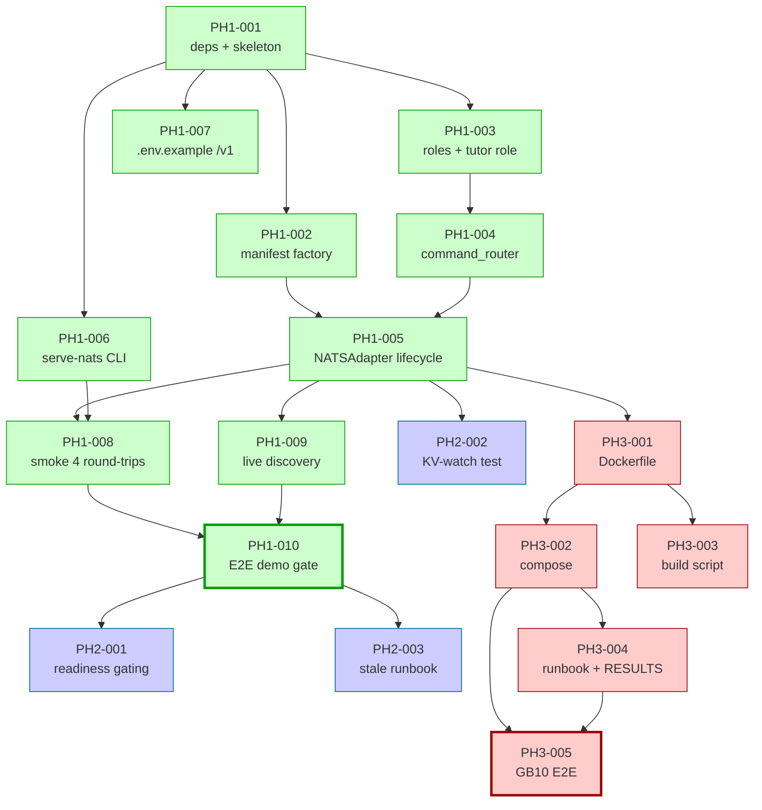

# Implementation Guide: study-tutor NATS Fleet Integration (FEAT-NATS)

**Generated:** 2026-05-08
**Demo deadline:** 2026-05-11 (Phase 1)
**DDD Southwest demo:** 2026-05-16 (Phases 2-3)
**Review doc:** [docs/reviews/REVIEW-NATS-FLEET-PATTERNS-2026-05-08.md](../../../docs/reviews/REVIEW-NATS-FLEET-PATTERNS-2026-05-08.md)
**Gherkin spec:** [features/nats-fleet-integration/nats-fleet-integration.feature](../../../features/nats-fleet-integration/nats-fleet-integration.feature)
**Superseded scope doc:** [features/nats-fleet-integration/nats-fleet-scope-and-build-plan.md](../../../features/nats-fleet-integration/nats-fleet-scope-and-build-plan.md) (kept as historical reference)

---

## Decisions encoded (2026-05-08)

These three project decisions are baked into the task plan:

1. **Phase 1 includes live registration + heartbeat.** No stub-yaml fallback. Tasks PH1-005 / PH1-006 / PH1-007 collapse the architect's pattern (`nats_adapter.py:107-143, 217-252`) into a single cohesive adapter task. Live discovery is verified by PH1-009.
2. **Session durability uses hybrid Graphiti, not JetStream KV.** Hot path remains in-memory `SessionStore`. Mid-session checkpoints to Graphiti land post-demo as TASK-NATS-FU-001.
3. **Stale-agent reaper deferred to jarvis post-demo.** Demo runs with manual cleanup (`nats kv del agent-registry gcse-tutor`); jarvis-side background reaper lands as TASK-NATS-FU-002 in the jarvis repo.

Plus a fourth decision taken during /feature-plan:

4. **ASSUM-007 deferred (Option C).** Tutor behaviour under duplicate delivery is undefined for the demo. Contract: jarvis MUST NOT duplicate-dispatch. If observed in a real runbook, revisit via TASK-NATS-FU-005.

---

## Data Flow: Read/Write Paths

The most important diagram in this guide. Shows every write path and every read path for the feature.

_Yellow nodes encode the Bug #1 reply-path fix: results land on BOTH the inbox (W4 → S4 → R2) AND the canonical result topic (W5 → S3 → R4). Without W4, jarvis's request future resolves with a JetStream PubAck instead of the actual result._

**Disconnection check:** All five write paths have at least one corresponding read path. `agents.command.gcse-tutor` is bidirectional — written by jarvis (external to this diagram), read by R5. No orphaned writes; no orphaned reads. **No disconnection alert.**

---

## Integration Contracts (sequence diagram)

Shows the full request/reply path for a tutor command, with Bug #1 and Bug #2 fix points highlighted.

_Both arrows out of `CR` are required. The `client.publish_raw(_INBOX.x, ...)` is what makes jarvis's `client.request()` future resolve with the actual `ResultPayload` instead of `{"stream":"AGENTS","seq":N}`. Removing it = re-introducing Bug #1._

---

## Task Dependencies

_Green = Phase 1 (demo-critical, 2026-05-11). Blue = Phase 2. Red = Phase 3. Bold border = demo gate (operator_handoff). Tasks at the same level can run in parallel._

---

## Wave plan

| Wave | Tasks | Parallel? | Phase |
|------|-------|-----------|-------|
| 1 | PH1-001 | n/a (single task) | 1 |
| 2 | PH1-002, PH1-003, PH1-007 | yes (3-way parallel) | 1 |
| 3 | PH1-004, PH1-006 | yes (2-way parallel) | 1 |
| 4 | PH1-005 | n/a (single task) | 1 |
| 5 | PH1-008, PH1-009 | yes (2-way parallel) | 1 |
| 6 | **PH1-010** (Phase 1 demo gate) | n/a (operator_handoff) | 1 |
| 7 | PH2-001 | n/a | 2 |
| 8 | PH2-002, PH2-003 | yes (2-way parallel) | 2 |
| 9 | PH3-001 | n/a | 3 |
| 10 | PH3-002, PH3-003 | yes (2-way parallel) | 3 |
| 11 | PH3-004 | n/a | 3 |
| 12 | **PH3-005** (Phase 3 demo gate) | n/a (operator_handoff) | 3 |

**Operator follow-up tasks: 2** — PH1-010 and PH3-005 are `task_type: operator_handoff` and AutoBuild will not attempt them.

---

## §4: Integration Contracts

Cross-task data dependencies that must be specified explicitly. Producer/consumer mismatches here are the #1 source of integration-boundary bugs.

### Contract: AgentManifest

- **Producer task:** TASK-NATS-PH1-002
- **Consumer task(s):** TASK-NATS-PH1-005
- **Artifact type:** Pydantic model (`nats_core.manifest.AgentManifest`)
- **Format constraint:** Must validate against the canonical schema. `len(intents) >= 1` (Bug #5 regression guard — `InMemoryManifestRegistry.register` raises `ValueError` on empty intents). `agent_id` must match `^[a-z][a-z0-9-]*$`.
- **Validation method:** Coach verifies `_tutor_manifest_factory("gcse-tutor")` validates and `len(manifest.intents) >= 1` via the seam test in PH1-002. PH1-005's adapter rejects invalid manifests at registration time.

### Contract: tool_to_command map

- **Producer task:** TASK-NATS-PH1-003
- **Consumer task(s):** TASK-NATS-PH1-004
- **Artifact type:** in-process Python dict via `study_tutor.roles.registry.get_role("tutor").tool_to_command`
- **Format constraint:** Map keys are MCP tool names (e.g. `"tutor_start_session"`); values are canonical commands (e.g. `"start_session"`). The router MUST call `self.tool_to_command.get(c, c)` — passthrough when not present, alias when present (Bug #2 fix).
- **Validation method:** Coach verifies the router's `_dispatch_command` includes the alias-resolution line (`command = self.tool_to_command.get(command, command)`) before the command_map lookup. Unit test in PH1-004 covers both alias-hit and passthrough cases.

### Contract: CommandRouter (subscription handler)

- **Producer task:** TASK-NATS-PH1-004
- **Consumer task(s):** TASK-NATS-PH1-005
- **Artifact type:** Python callable `command_router.on_command(envelope, reply_to)` registered via `client.subscribe_with_reply`.
- **Format constraint:** Adapter MUST call `subscribe_with_reply` (NOT `subscribe`). The reply_to inbox MUST propagate to `command_router._publish_result` and trigger a `client.publish_raw(reply_to, ...)` in addition to the canonical envelope publish (Bug #1 fix).
- **Validation method:** Unit test inspects mock calls on `client.subscribe_with_reply` (not `client.subscribe`). Integration test in PH1-008 asserts replies arrive on the inbox AND the result topic, and that no JetStream PubAck leaks to the inbox.

### Contract: OPENAI_BASE_URL

- **Producer task:** TASK-NATS-PH1-007 (.env.example) and TASK-NATS-PH3-002 (docker-compose env block)
- **Consumer task(s):** TASK-NATS-PH3-002 (compose); ultimately consumed by langchain-openai (`ChatOpenAI` client) inside the tutor process at runtime.
- **Artifact type:** environment variable
- **Format constraint:** URL **must** include the `/v1` suffix. Format: `http://host.docker.internal:9000/v1`. Without `/v1`, langchain-openai POSTs to `/chat/completions` instead of `/v1/chat/completions` and gets a `404 Not Found` mid-`tutor_turn` (Bug #3).
- **Validation method:** Coach verifies (a) `.env.example` line matches `^OPENAI_BASE_URL=.*\/v1$`, (b) docker-compose config emits an `OPENAI_BASE_URL` value ending in `/v1`. Both checks live as Coach validation commands in PH1-007 and PH3-002.

### Contract: study-tutor:dev Docker image

- **Producer task:** TASK-NATS-PH3-001
- **Consumer task(s):** TASK-NATS-PH3-002, TASK-NATS-PH3-003
- **Artifact type:** Docker image tag
- **Format constraint:** Image must be built with the BuildKit named context `nats-core=../nats-core` so the editable `nats-core` install resolves at build time. Image entrypoint defaults to `study-tutor serve-nats`.
- **Validation method:** Coach verifies `docker run --rm study-tutor:dev study-tutor serve-nats --help` succeeds and shows the expected flag surface; `docker compose -f docker-compose.study-tutor.yml config` validates the image reference resolves.

---

## Bug regression guards (one task or scenario per bug)

| Bug | Source runbook | Tasks owning the regression guard | Gherkin scenarios (after Step 11) |
|---|---|---|---|
| **#1 PubAck race** | jarvis runbook 2026-05-08-followup-post-W2.md | PH1-004 (`_publish_result` impl), PH1-005 (`subscribe_with_reply` not `subscribe`), PH1-008 (smoke test asserts both paths) | `@bug-1 @regression` scenarios in Group D |
| **#2 tool_to_command miss** | same runbook | PH1-003 (map declaration), PH1-004 (alias resolution), PH1-008 (alias dispatch test) | `@bug-2 @regression` Outline in Group D |
| **#3 OPENAI_BASE_URL /v1** | same runbook | PH1-007 (.env.example), PH3-002 (compose env block) | `@bug-3 @regression` scenario in Group C |
| **#4 wire-tap subject pattern** | same runbook | PH3-004 (runbook docs flat pattern) | `@bug-4 @regression` scenario in Group D |
| **#5 empty intents** | predicted from `nats-core/manifest.py:261-263` | PH1-002 (factory + seam test) | `@bug-5 @regression` scenario in Group B |

---

## Phase 1 critical path (3 days, demo deadline 2026-05-11)

Roughly 9-11 hours of coding work spread across 6 waves:

- **Day 1 (2026-05-08, Thu)**: Waves 1-2 (foundation: deps, manifest, roles, .env). ~2.5h.
- **Day 2 (2026-05-09, Fri)**: Waves 3-4 (router + adapter — the heaviest work). ~5h.
- **Day 3 (2026-05-10, Sat)**: Wave 5 (smoke + live discovery), prep for demo. ~3h.
- **Day 4 (2026-05-11, Sun)**: Wave 6 — operator runs the demo gate. ~2h.

Phase 2 (waves 7-8) and Phase 3 (waves 9-12) can land between 2026-05-12 and 2026-05-16 (DDD South West). They are not demo-blocking for the 2026-05-11 video shoot.

---

## Risk-tracked follow-ups (post-demo)

These do not block the demo. Captured here so they don't slip:

| Task | Scope |
|---|---|
| TASK-NATS-FU-001 | Hybrid Graphiti session durability (in-memory hot path + async checkpoints + resume-on-boot). Reuses existing `SessionCompletedEpisode` projection. Decision 2, 2026-05-08. |
| TASK-NATS-FU-002 | jarvis-side stale-agent reaper (background polling). **jarvis repo, not study-tutor.** Decision 3, 2026-05-08. |
| TASK-NATS-FU-003 | Evidence-capture script (`scripts/capture-nats-roundtrip.sh`) analogous to specialist-agent's. |
| TASK-NATS-FU-004 | Durable retry for in-flight commands via JetStream pull consumers (forge's pattern). |
| TASK-NATS-FU-005 | Correlation-id idempotency (only if duplicate delivery is observed in a real runbook). Per ASSUM-007 deferral. |

---

## Workflow notes

- **Use `/task-work TASK-NATS-PH1-XXX`** to pick up tasks. Wave dependencies are encoded in frontmatter `dependencies:` lists; the AutoBuild orchestrator should handle scheduling automatically.
- **Operator-handoff tasks (PH1-010, PH3-005)** will short-circuit AutoBuild's Player ↔ Coach loop. Operator drives them manually with the runbook as the procedure, then `/task-complete` once the runtime ACs are met.
- **Bug regression guards in Coach Validation**: each task with a `@bug-N` association ships its regression test as part of its acceptance criteria. Removing a regression test = surface the bug back. Coach should reject any PR that drops them.
- **Lint/format**: every implementation/refactor task includes "All modified files pass project-configured lint/format checks with zero errors" as an AC. This applies to all task types except scaffolding, documentation, and testing.
