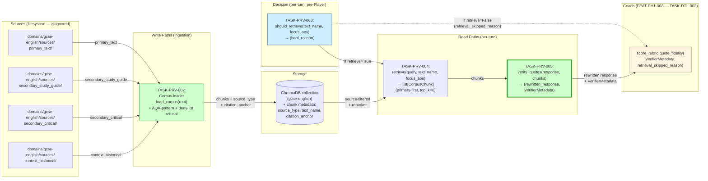
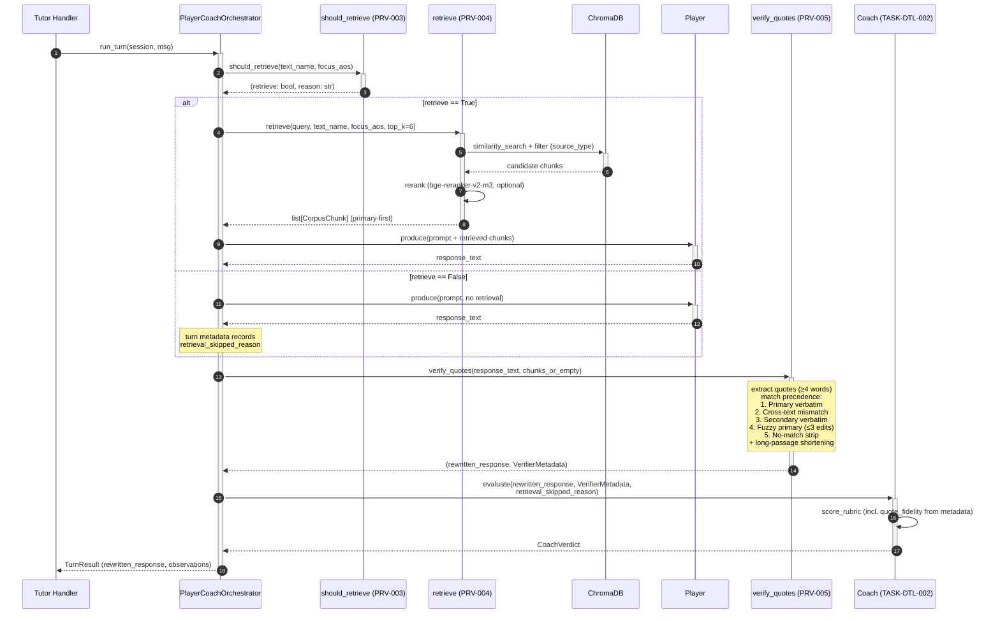
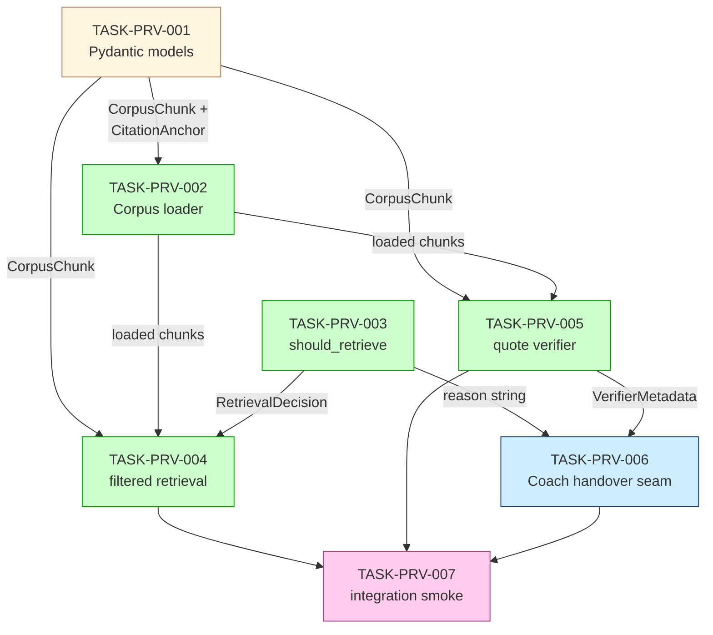
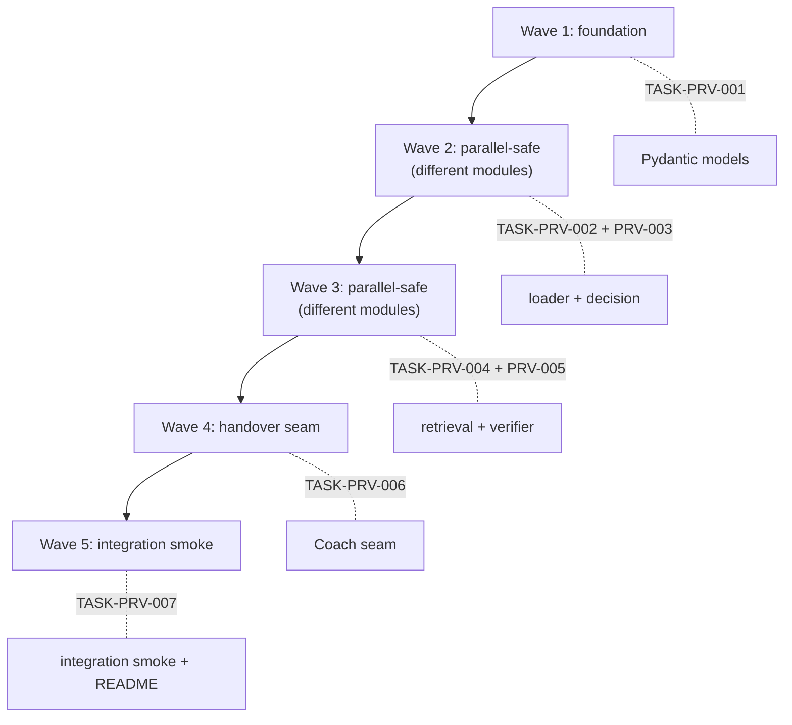

# Implementation Guide — FEAT-PH1-004: Primary-Text RAG and Source-Typed Quote Verifier

**Parent review:** [TASK-REV-PRV4](../../in_review/TASK-REV-PRV4-plan-primary-text-rag-and-quote-verifier.md)
**Phase:** Phase 1 (FEAT-PH1-004)
**Generated:** 2026-04-30
**Stack:** python (Python 3.14, Pydantic v2, ChromaDB, RecursiveCharacterTextSplitter, BAAI/bge-reranker-v2-m3 baseline)

---

## §1: Overview

This guide drives implementation of **FEAT-PH1-004** across **7
subtasks** organised into **5 waves**, with parallel-when-safe
execution in waves 2 and 3.

The design is settled by:

- **R1–R4** from `openwebui-rag-empirical-findings-2026-04-23.md` —
  source-typed verifier, dynamic retrieval decision, AO3 bypass,
  Standard Ebooks as canonical primary-text source.
- **`phase-1-scope.md §FEAT-PH1-004`** — three sub-modules,
  four-folder corpus layout, Coach `quote_fidelity` rubric criterion
  is the consumer.
- **TASK-DTL-002 acceptance criteria** —
  `verify_quotes(response)` runs **before** Coach evaluates;
  rewrites applied in place; `VerifierMetadata` accompanies the
  rewritten response.
- **GOAL.md §6.1** — long verbatim passages must be reduced to
  short embedded quotations.

**Resolved assumptions** (full list in
[review report §3](../../../.guardkit/reviews/TASK-REV-PRV4-review-report.md)):

- **ASSUM-008/009** — copyright refusal at loader uses pattern + deny-list
- **ASSUM-010** — `SECONDARY_ATTRIBUTION_TEMPLATES` tuple (deterministic pick)
- **ASSUM-011** — `LONG_PASSAGE_WORD_THRESHOLD = 30`, `SHORT_QUOTE_MAX_WORDS = 12`
- **ASSUM-013** — `EMBEDDER_TIMEOUT_SECONDS = 5.0`
- **ASSUM-006** — explicit skip-reason string constants

**Implementation decisions confirmed at /feature-plan [I]mplement:**

- **Approach:** Option A (three-module split with citation-aware
  chunker variant).
- **Wave execution:** parallel where safe (Waves 2 and 3).
- **Testing depth:** standard — quality gates + seam tests.

**Open Question 3 closure:** fuzzy correction is restricted to
**primary-text** matches only, and primary-wins precedence in
`verify_quote()` ensures that a study-guide phrase ≤3 edits from a
primary line is rewritten as paraphrase, not "corrected" into a
misattributed citation.

---

## §2: Data Flow — Read & Write Paths

This is the most important diagram in this guide. **If a reviewer
only looks at one thing, look here.**



**Caption:** The verifier (`verify_quotes`, green) is the
load-bearing read seam — it consumes corpus chunks, rewrites the
Player response in place, and emits structured `VerifierMetadata`
that the Coach's `quote_fidelity` criterion derives its score from.
The decision function (`should_retrieve`, blue) is the load-bearing
selection point — it produces either a `(True, ...)` retrieve path
through `retrieve()` and `verify_quotes()`, or a `(False,
reason_string)` skip path that goes directly to Coach with
`retrieval_skipped_reason` set so quote-fidelity is suppressed.

**Disconnection check:** ✅ Every write path has a corresponding
read path.

- Corpus chunks (primary_text) → consumed by `retrieve()` and
  matched by `verify_quotes()`
- Corpus chunks (secondary_study_guide / secondary_critical) →
  consumed by `retrieve()` (as supplement) and matched by
  `verify_quotes()` (for laundering detection)
- Corpus chunks (context_historical) → consumed by `retrieve()` only
  for AO3-context-historical retrievals (not in Phase 1 critical path
  but folder is supported)
- `should_retrieve()` reason strings → consumed by Coach's
  `score_rubric` to suppress `quote_fidelity` down-rank in
  AnalysisMode

No disconnection alerts.

---

## §3: Integration Contracts (Sequence View)

Per-turn interaction model. Catches the "fetch then discard" anti-
pattern at the verifier→Coach handover.



**Caption:** Step 11 is the load-bearing handover surface — the
**rewritten** response (not the original) is what the Coach
evaluates. The Coach's `quote_fidelity` criterion derives its score
from `VerifierMetadata`, not by re-parsing the response. When
`retrieve == False`, the verifier still runs against an empty chunk
list (it only operates on the response text) and the
`retrieval_skipped_reason` is forwarded so quote-fidelity is
suppressed.

**No fetch-then-discard pattern detected:** every value retrieved
is either consumed by the next step (chunks → Player; chunks →
verifier; rewritten response → Coach) or surfaced in metadata
(decision reason → Coach for suppression). No retrieved chunks are
fetched and then dropped before reaching a consumer.

---

## §4: Integration Contracts

This feature has **three** load-bearing cross-task integration
contracts.

### Contract: SourceTypedCorpus (CorpusChunk + CitationAnchor)

- **Producer task:** TASK-PRV-001 (Pydantic models)
- **Consumer task(s):** TASK-PRV-002 (loader emits `CorpusChunk`),
  TASK-PRV-004 (filtered retrieval consumes `CorpusChunk`),
  TASK-PRV-005 (verifier consumes `CorpusChunk` and reads
  `citation_anchor` directly from chunk metadata — never re-parses
  text)
- **Artifact type:** Python Pydantic v2 models (`CorpusChunk`,
  `CitationAnchor`, `SourceType` enum)
- **Format constraint:**
  ```python
  class SourceType(str, Enum):
      PRIMARY_TEXT = "primary_text"
      SECONDARY_STUDY_GUIDE = "secondary_study_guide"
      SECONDARY_CRITICAL = "secondary_critical"
      CONTEXT_HISTORICAL = "context_historical"

  class PlayCitationAnchor(BaseModel):
      kind: Literal["play"] = "play"
      act: int
      scene: int
      line: int

  class NovelCitationAnchor(BaseModel):
      kind: Literal["novel"] = "novel"
      chapter: int
      paragraph: int

  CitationAnchor = Annotated[
      PlayCitationAnchor | NovelCitationAnchor,
      Field(discriminator="kind"),
  ]

  class CorpusChunk(BaseModel):
      text: str
      source_type: SourceType
      source_path: str
      text_name: str                # e.g. "macbeth", "christmas_carol"
      citation_anchor: CitationAnchor | None  # None for non-primary
      chunk_index: int
  ```
  - `text_name` is a slug derived from the source filename (lowercase, underscores)
  - `citation_anchor` is **None** for `secondary_*` and
    `context_historical` — only primary-text chunks carry citations
  - `kind` discriminator is required (Pydantic v2 discriminated union)
- **Validation method:** TASK-PRV-002 unit test asserts that loaded
  chunks from `primary_text/` carry a non-None `citation_anchor` and
  loaded chunks from `secondary_study_guide/` carry `None`. TASK-PRV-005
  unit test asserts citation reads use `chunk.citation_anchor` directly,
  not `re.search` on `chunk.text`.

### Contract: RetrievalDecision

- **Producer task:** TASK-PRV-003 (`should_retrieve`)
- **Consumer task(s):** TASK-PRV-004 (skips retrieval if `retrieve=False`),
  TASK-PRV-006 (forwards `reason` into turn metadata)
- **Artifact type:** Python function returning a `RetrievalDecision`
  named tuple
- **Format constraint:**
  ```python
  REASON_NO_PRIMARY = "analysis_mode:no_primary_text"
  REASON_AO3_ONLY = "ao3_only:training_first"
  REASON_EMBEDDER_TIMEOUT = "analysis_mode:embedder_timeout"
  REASON_RETRIEVE_PRIMARY = "retrieve:primary_present"
  REASON_RETRIEVE_MIXED = "retrieve:mixed_ao3"

  class RetrievalDecision(NamedTuple):
      retrieve: bool
      reason: str
      mode: Literal["retrieve", "analysis_mode", "ao3_bypass", "mixed"]

  def should_retrieve(text_name: str,
                      focus_aos: set[str]) -> RetrievalDecision: ...
  ```
  - `reason` strings are **module-level constants** so tests assert
    against names, never literals
  - Mixed-mode (AO3 + AO1/AO2) returns `retrieve=True, mode="mixed"`
- **Validation method:** TASK-PRV-003 covers the four-branch
  decision via parametrised pytest (primary present / absent ×
  AO3-only / mixed / non-AO3).

### Contract: VerifierMetadata (Coach handover)

- **Producer task:** TASK-PRV-005 (`verify_quotes`)
- **Consumer task(s):** TASK-PRV-006 (wires verifier output into
  Coach pipeline), and downstream **TASK-DTL-002** (Coach's
  `score_rubric.quote_fidelity` consumes the metadata to derive
  the criterion score)
- **Artifact type:** Python Pydantic v2 model + tuple return
- **Format constraint:**
  ```python
  class PrimaryMatch(BaseModel):
      original_span: str
      annotated_span: str           # span + " ({anchor})"
      citation_anchor: CitationAnchor

  class SecondaryRewrite(BaseModel):
      original_span: str
      attribution_template: str     # one of SECONDARY_ATTRIBUTION_TEMPLATES
      paraphrase_text: str

  class FuzzyCorrection(BaseModel):
      original_span: str
      corrected_span: str           # the canonical primary wording
      edit_distance: int            # 1..3
      citation_anchor: CitationAnchor

  class NoMatchStrip(BaseModel):
      original_span: str
      paraphrase_text: str          # certainty-softened paraphrase

  class CrossTextEvent(BaseModel):
      original_span: str
      wrong_text_name: str          # the text it actually came from
      paraphrase_text: str

  class Shortening(BaseModel):
      original_span: str            # the long quotation
      shortened_span: str           # ≤12 words
      original_word_count: int

  class VerifierMetadata(BaseModel):
      primary_matches: list[PrimaryMatch] = []
      secondary_rewrites: list[SecondaryRewrite] = []
      fuzzy_corrections: list[FuzzyCorrection] = []
      stripped: list[NoMatchStrip] = []
      cross_text_mismatches: list[CrossTextEvent] = []
      long_passage_shortenings: list[Shortening] = []
      retrieval_skipped_reason: str | None = None

  def verify_quotes(
      response_text: str,
      corpus_chunks: list[CorpusChunk],
      session_text_name: str,
      retrieval_skipped_reason: str | None = None,
  ) -> tuple[str, VerifierMetadata]: ...
  ```
  - The verifier returns the **rewritten** response and the
    metadata as a tuple — never mutates the input string in place
  - `retrieval_skipped_reason` is forwarded into the metadata so
    Coach can suppress quote-fidelity in AnalysisMode
  - Empty lists are valid (not all match types fire on every turn)
- **Validation method:** TASK-PRV-005 has parametrised tests for
  each match type. TASK-PRV-006 seam test (below) asserts the
  rewritten response is what reaches the Coach, not the original.

### Contract diagram



_Tasks with green background can run in parallel within their wave.
PRV-001 (orange) is the foundation. PRV-006 (blue) wires the
contract into the Coach loop. PRV-007 (pink) is the integration
smoke._

---

## §5: Module-by-module implementation notes

### `src/study_tutor/knowledge/corpus.py` (TASK-PRV-002)

- **Source-type inference:** parent-directory name maps to
  `SourceType` enum. Unknown directory → skip with structured log.
- **AQA refusal:** filename regex
  `r"(?i)(past[_-]?paper|mark[_-]?scheme|examiner[_-]?report)"` →
  refuse + log + reference publisher prohibition.
- **In-copyright refusal:** `INCOPYRIGHT_TITLES` constant (case-
  insensitive substring match against filename stem) → refuse + log
  + advise per-student Phase 2 path.
- **Path traversal:** `Path.resolve()` against corpus root; reject
  if not relative.
- **Resilience:** corrupted file → skip + structured log line; rest
  of corpus loads.
- **Chunker:** `RecursiveCharacterTextSplitter` (chunk_size=512,
  overlap=100 — tuned per 23-Apr empirical findings §3d). Adapted
  from `agentic-dataset-factory/ingestion/chunker.py`, extended with
  source-typed metadata.
- **Citation-anchor inference:**
  - **Plays** (Standard Ebooks Shakespeare): regex over scene markers
    `^\s*(SCENE [IVX]+)` and line numbers in the right margin.
    Strategy: keep current `(act, scene)` pointer per chunk; line
    is the start-of-chunk line number.
  - **Novels:** regex over chapter headings (`^\s*CHAPTER [IVX]+`);
    paragraph index is a running count within the chapter.
  - Fallback: when the strategy can't determine the anchor, set
    `citation_anchor=None` and emit a structured warning. Verifier
    will treat such chunks as primary-text content but cannot
    annotate citations against them — the @edge-case @citation
    scenario covers this.

### `src/study_tutor/knowledge/retrieval.py` (TASK-PRV-003 + TASK-PRV-004)

- **Decision logic** (TASK-PRV-003) is a pure function over
  `(text_name, focus_aos)` — no I/O. Returns
  `RetrievalDecision(retrieve, reason, mode)` per the §4 contract.
- **AO3-only check:** `focus_aos == {"AO3"}` → bypass.
- **Mixed-mode check:** `"AO3" in focus_aos and len(focus_aos) > 1` →
  retrieve for non-AO3 evidence (`mode="mixed"`).
- **Primary-text presence check** (TASK-PRV-003): consults the
  loaded corpus index — `text_name` has at least one chunk with
  `source_type == PRIMARY_TEXT`.
- **Embedder unavailability** (TASK-PRV-003): `asyncio.wait_for`
  with `EMBEDDER_TIMEOUT_SECONDS = 5.0`; on timeout return
  `(False, REASON_EMBEDDER_TIMEOUT, "analysis_mode")`.
- **Source-filtered retrieval** (TASK-PRV-004): ChromaDB
  similarity search filtered by `text_name` AND `source_type`,
  ordered primary-first, top-K=6. Reranker (`bge-reranker-v2-m3`,
  CPU-only) optional — when unavailable, return chunks ordered by
  base similarity with `mode="no_rerank"` in turn metadata.
- **AQA exclusion at retrieval-time** (defence in depth):
  filtering removes any chunk whose `source_path` matches the AQA
  filename regex, even if it slipped past ingestion.

### `src/study_tutor/knowledge/quote_verifier.py` (TASK-PRV-005)

- **Quote extraction:** regex over typographic+straight quote
  pairs; minimum span = 4 words (ASSUM-002).
- **Normalisation** (`_normalise`): collapse whitespace, strip
  surrounding punctuation, equate curly/straight quotes, lowercase.
  Applied symmetrically to span and chunks.
- **Match precedence** (closes Open Question 3):
  1. Exact match against any **primary-text** chunk for the
     session's text → `PrimaryMatch`
  2. Exact match against a primary-text chunk for a **different**
     text → `CrossTextEvent` (rewrite, never annotate with wrong
     citation)
  3. Exact match against any **secondary** chunk → `SecondaryRewrite`
  4. Fuzzy match (≤3 edits) against a **primary-text** chunk for the
     session's text → `FuzzyCorrection`
  5. No match → `NoMatchStrip`
- **Long-passage shortening** runs after match resolution:
  `PrimaryMatch` whose original span exceeds
  `LONG_PASSAGE_WORD_THRESHOLD = 30` words is reduced to
  `SHORT_QUOTE_MAX_WORDS = 12` (densest analytical span — longest
  contiguous substring sharing the matched chunk's start or end).
  Emits `Shortening` event.
- **Concurrency:** `verify_quotes` is a pure function — no shared
  mutable state. Two concurrent calls produce independent results
  (covered by @edge-case @concurrency scenario).

### `src/study_tutor/knowledge/coach_handover.py` (TASK-PRV-006)

- **Wraps** `verify_quotes` in the orchestrator pipeline so the
  Coach receives the rewritten response + metadata (not the
  original).
- **Forwards** `retrieval_skipped_reason` from
  `should_retrieve()` into `VerifierMetadata`.
- **Failure path:** if `verify_quotes` raises, the response is
  passed unannotated and the Coach evaluates under the documented
  fallback per TASK-DTL-002 acceptance criterion (verifier-exception
  → unannotated to Coach). Failure logged for session-end review.

---

## §6: Wave plan



Conductor recommended for Waves 2 and 3.

---

## §7: Smoke gates between waves

Per FEAT-PH1-003 / FEAT-1773 precedent, each wave's exit gate is
the previous wave's contracts compiling and the parametrised tests
passing:

- **After Wave 1:** `python -c "from study_tutor.knowledge.corpus_models import CorpusChunk, CitationAnchor, SourceType"` succeeds.
- **After Wave 2:** loader emits chunks with correct source_type;
  decision function passes the four-branch test matrix.
- **After Wave 3:** retrieval returns primary-first ordering when
  primary chunks exist; verifier produces the right match type for
  each of the five precedence branches.
- **After Wave 4:** end-to-end `tutor_turn` smoke shows the
  Coach receives the **rewritten** response (not the original) and
  derives a `quote_fidelity` score from `VerifierMetadata`.
- **After Wave 5:** the integration test at
  `tests/integration/test_rag_end_to_end.py` passes for both the
  retrieve-and-verify path and the AnalysisMode skip path.

---

## §8: References

- [Feature spec](../../../features/primary-text-rag-and-quote-verifier/primary-text-rag-and-quote-verifier.feature)
- [Assumptions manifest](../../../features/primary-text-rag-and-quote-verifier/primary-text-rag-and-quote-verifier_assumptions.yaml)
- [Review report](../../../.guardkit/reviews/TASK-REV-PRV4-review-report.md)
- [phase-1-scope.md §FEAT-PH1-004](../../../docs/research/ideas/phase-1-scope.md)
- [openwebui-rag-empirical-findings-2026-04-23.md](../../../docs/research/ideas/openwebui-rag-empirical-findings-2026-04-23.md)
- [TASK-DTL-002 acceptance criteria](../../completed/deepagents-tutoring-loop/TASK-DTL-002-rubric-and-quote-fidelity.md)
- [agentic-dataset-factory/ingestion/chunker.py](file:///Users/richardwoollcott/Projects/appmilla_github/agentic-dataset-factory/ingestion/chunker.py) — chunker shape adapted into `corpus.py`
