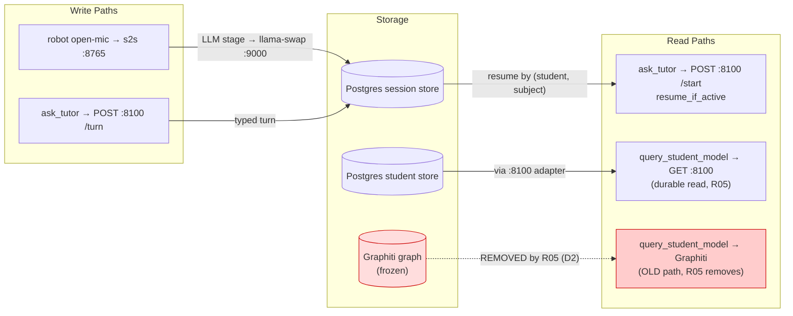
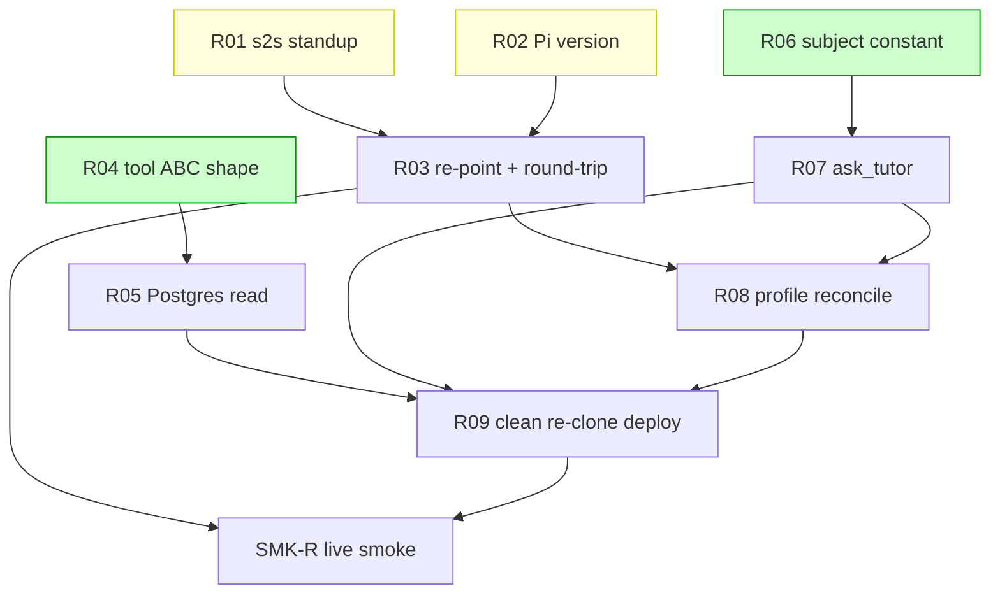

# Implementation Guide — Reachy Local Voice Migration (FEAT-VOICE-004)

**Review:** TASK-REV-RCH4 · **Spec:** `features/reachy-local-voice-migration/` (25 scenarios)
**Approach:** Split-plane, code-first with seam tests, operator-tagged hardware (Option 1)
**Optimise for:** quality/correctness · **Testing:** standard + seam tests

> **Execution model — read first.** The code artefacts (`ask_tutor`,
> `query_student_model`, Scholar profile) live in the **sibling `fleet-gateway` repo**, not
> in study-tutor. study-tutor's `/feature-build` **cannot** build them. Per build-plan §0a
> the whole R-track is **Operator + Opus**. This plan is the authoritative task breakdown +
> seam-test specs + sequencing; the FEAT-VOICE-004 YAML is emitted for traceability, **not**
> as an autobuild entry point. Do **not** run `/feature-build FEAT-VOICE-004` from
> study-tutor expecting it to build fleet-gateway code.

## Task summary

| Task | Plane | task_type | Wave | Cx | Deps |
|---|---|---|---|---|---|
| R01 s2s unit standup (GB10 :8765) | operator | operator_handoff | 1 | 8 | — |
| R02 Pi app version / re-point support (D3) | operator | operator_handoff | 1 | 4 | — |
| R04 query_student_model ABC shape (D1) | code | feature | 1 | 3 | — |
| R06 shared default subject (D6, resolved: english) | code | declarative | 1 | 3 | — |
| R03 re-point + tool round-trip (R-G3) | operator | operator_handoff | 2 | 6 | R01, R02 |
| R05 query_student_model → :8100 read (D2) | code | feature | 2 | 5 | R04 |
| R07 ask_tutor tool (§7.4) | code | feature | 2 | 6 | R06 |
| R08 Scholar profile reconcile (D4) | code | declarative | 3 | 3 | R07, R03 |
| R09 clean re-clone deploy (D7) | operator | operator_handoff | 4 | 5 | R05, R07, R08 |
| SMK-R live smoke AC-R1..R4 | operator | operator_handoff | 5 | 6 | R03, R09 |

**Operator follow-up tasks: 5** (R01, R02, R03, R09, SMK-R)

## Data Flow: Read/Write Paths



_Look for: the red path (R3 → frozen Graphiti) is the D2 rot; R05 deletes it and wires the
green `:8100` durable read (R2). No **new** write path is left without a read — the one
disconnection shown is a deliberate **removal**, not a gap._

**Disconnection Alert:** none outstanding. The single dotted path is the Graphiti read that
**R05 removes by design** (D2). No write path in this feature lacks a corresponding read.

## Integration Contracts (sequence)

```mermaid
sequenceDiagram
    participant Robot as Reachy (open mic)
    participant S2S as s2s :8765
    participant AT as ask_tutor
    participant TUTOR as study-tutor :8100
    participant DB as Postgres session store

    Robot->>S2S: speech (Silero VAD → STT)
    S2S->>AT: tool call (tutoring turn)
    AT->>TUTOR: POST /start {resume_if_active:true, subject:"english"}
    TUTOR->>DB: find active (student, subject)
    DB-->>TUTOR: existing session + transcript
    TUTOR-->>AT: session (resumed=true)
    AT->>TUTOR: POST /turn {message}
    TUTOR-->>AT: tutor_response
    AT-->>S2S: tutor_response text
    S2S-->>Robot: spoken answer (Ryan, TTS)
    Note over AT,TUTOR: subject falls back to the shared default "english"; never empty (D6/D8)
```

_Look for: the subject string on `/start` **must** equal the app's `defaultSubject` or the
`(student, subject)` match misses and D8 pickup never happens. R06 pins it; R07 sends it._

## Task Dependencies



_Green = wave-1 code tasks (parallel-safe, no hardware). Yellow = wave-1 operator gates.
The two planes run in parallel until they converge at R08/R09._

## §4: Integration Contracts

### Contract: SUBJECT_DEFAULT
- **Producer task:** TASK-VOX-R06
- **Consumer task(s):** TASK-VOX-R07 (ask_tutor), TASK-VOX-R08 (Scholar persona)
- **Artifact type:** shared default string (v1 default, not an immutable pin)
- **Resolved value:** `english` (ASSUM-001, 2026-07-07) — the app moved `'maths'`→`'english'`;
  fleet-gateway was already `english`.
- **Format constraint:** `ask_tutor` exposes `subject` as a parameter and **falls back to
  this default when the persona omits it — never empty**. `resume_if_active` matches on
  `(student, subject)`, so an empty/divergent subject silently defeats D8 pickup.
- **Multi-subject:** the parameter carries any subject once the app gains a picker and the
  persona learns to pass it — session store, `query_student_model`, and `ask_tutor` are all
  already subject-parameterized; no rework needed.
- **Validation method:** seam test asserts the default is identical across the app, persona,
  and `ask_tutor`, that ask_tutor's omitted-subject fallback is non-empty, and that an
  explicit subject is forwarded verbatim (R06 + R07 seam tests).

### Contract: STUDY_TUTOR_HTTP_8100
- **Producer task:** TASK-APP-001 (HTTP adapter — already live on GB10 :8100)
- **Consumer task(s):** TASK-VOX-R05 (query_student_model read), TASK-VOX-R07 (ask_tutor)
- **Artifact type:** HTTP API surface (bearer-authenticated)
- **Format constraint:** `POST /api/sessions/start`, `POST /api/sessions/{id}/turn`, and the
  student-model read — bearer token, student derived server-side, same binding the app uses.
- **Validation method:** httpx MockTransport seam tests pin method/path/auth and the
  resume/subject body (R05 + R07).

## Sequencing notes

- **Code-first:** R04/R05/R06/R07/R08 are fully buildable in fleet-gateway against fakes +
  seam tests — do them ahead of / in parallel with the hardware gates.
- **R06 gates R07:** resolve the subject constant (owner decision, ASSUM-001) before
  `ask_tutor` pins it.
- **R03 is the R-G3 proof** and the source of Pi truth for R08's profile reconcile.
- **No smoke_gates block** in the YAML: this feature is not study-tutor autobuild; the
  feature-level gate is the operator live smoke SMK-R.

## Open items to resolve before build

1. ~~**ASSUM-001 (subject constant)**~~ — **RESOLVED 2026-07-07: `english`.** App
   `defaultSubject` moved `'maths'`→`'english'`; treated as a subject-parameterized default,
   so multi-subject is not constrained. R06 is now a reconcile-and-verify task, not a decision.
2. ~~**ASSUM-007 / ASSUM-008**~~ — **RESOLVED 2026-07-07.** Persona copy (tutor-unavailable
   line + rotating filler) drafted and recorded in R07 (tool offline string) + R08 (persona);
   R08 wires it in.
3. ~~**ASSUM-003**~~ — **fallback pre-approved 2026-07-07:** auto-accept 1.7B on the robot
   path if the 0.6B checkpoint fails at R-G2 (R01); decided empirically, no consult.
