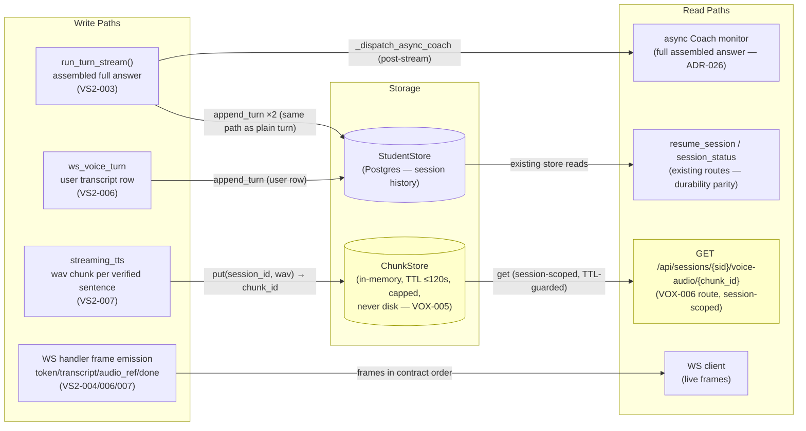
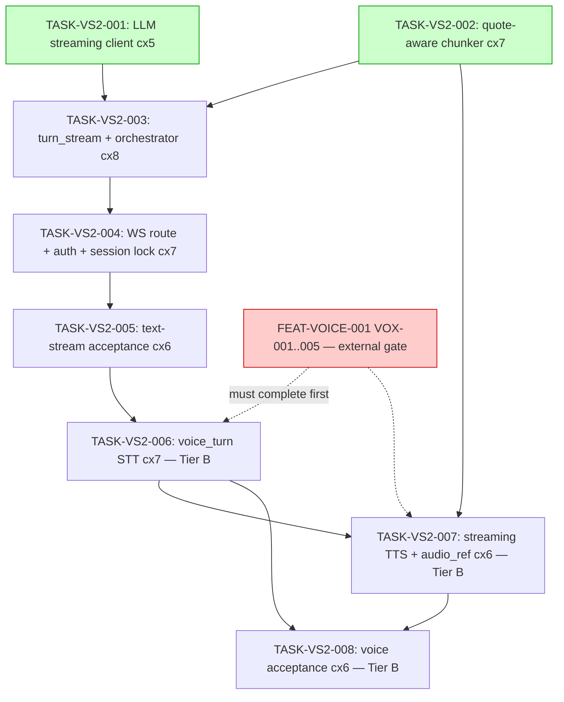

# Implementation Guide — FEAT-VOICE-002 Streaming Voice

**Feature**: Streaming tutoring turns — live text and voice on the session channel
**Parent review**: TASK-REV-F732 (`.claude/reviews/TASK-REV-F732-review-report.md`)
**Spec**: `features/streaming-voice/streaming-voice.feature` (31 scenarios, 10 owner-confirmed assumptions)
**Approach**: Option 1 — tiered dependency (Tier A independent; Tier B hard-gated on FEAT-VOICE-001)
**Frozen pins**: contract §7 Rev 1 + binding §2.1 Rev 1 — `CONTRACT_SHA=574615e9…`, `BINDING_SHA=e50897d1…`. **Implement, don't re-freeze.** No task touches the contract docs.

## ⚠️ Tier B gate (read before running /feature-build)

Waves 1–4 (VS2-001..005, **Tier A**) have zero dependency on FEAT-VOICE-001
and can run immediately. Waves 5–7 (VS2-006/007/008, **Tier B**) import
FEAT-VOICE-001's voice module (VOX-001..005: config, six error types,
AudioClient, validation core, ChunkStore) — **do not run Tier B waves until
FEAT-VOICE-001 is complete and merged.** AutoBuild cannot see cross-feature
dependencies; the in-feature `VS2-005 → VS2-006` edge serializes the tiers,
but the operator owns the VOX gate. One coordination item is open on
FEAT-VOICE-001: TASK-VOX-004 needs a bytes-blob-callable validation core
(`validate_audio_bytes`-shaped extraction from `parse_voice_upload`) — raise
as a scope note before VS2-006 starts.

## Data Flow: Read/Write Paths



_Look for: every write has a read. Session-history writes are read by the
existing resume/status paths (tested for parity in VS2-005). ChunkStore writes
are read by the **FEAT-VOICE-001 VOX-006 route** (yellow) — a cross-feature
read path that exists only after FEAT-VOICE-001 lands; this is the Tier B
gate above, not a disconnection. VS2-007 mints no new fetch route._

**Disconnection check**: no write path is unread within the feature's final
state. The yellow ChunkStore→voice-audio read path is deferred to the Tier B
gate (FEAT-VOICE-001 completion) and acknowledged here per the disconnection
rule.

## Integration Contracts (sequence)

```mermaid
sequenceDiagram
    participant C as WS Client
    participant WS as http/ws.py (VS2-004)
    participant VT as ws_voice_turn (VS2-006)
    participant O as run_turn_stream (VS2-003)
    participant CH as sentence_chunker (VS2-002)
    participant L as LLMClient.generate_stream (VS2-001)
    participant T as streaming_tts (VS2-007)
    participant A as AudioClient (VOX-002)
    participant K as ChunkStore (VOX-005)
    participant DB as StudentStore

    C->>WS: upgrade + Authorization (auth-at-upgrade)
    C->>WS: {type:"voice_turn", content_type, size_bytes} + binary
    WS->>VT: bytes blob
    VT->>VT: validate via shared VOX-004 core (bytes actually received)
    VT->>A: transcribe(bytes)
    A-->>VT: transcript
    VT-->>C: {type:"transcript", text}  ← before anything else
    VT->>O: run_turn_stream(state, transcript)
    O->>DB: append_turn(user)
    O->>L: generate_stream(prompt)
    loop per token
        L-->>CH: token
        CH->>CH: buffer; defer boundary while quote open (ADR-027)
        CH->>CH: apply_quote_verification(ACCUMULATED text) — fail closed
        CH-->>O: verified chunk (text, seq)
        O-->>C: {type:"token", text}
        O->>T: verified chunk
        T->>A: synthesize(chunk, wav)
        T->>K: put(session_id, wav) → chunk_id
        T-->>C: {type:"audio_ref", seq, chunk_id, url}
    end
    O->>DB: append_turn(tutor, assembled answer)
    O->>O: _dispatch_async_coach(full answer)  ← never blocks the stream
    O-->>C: {type:"done", turn_index}
    C->>K: GET voice-audio/{chunk_id} (via VOX-006 route, ownership enforced)
```

_Look for: no fetch-then-discard — every retrieved artifact flows onward
(transcript → turn path; verified chunk → both token frame and TTS; wav →
store → announced url → client fetch). Coach dispatch receives the full
assembled answer after `done`; the stream never waits on it._

## Task Dependencies



_Tasks with green background (Wave 1) can run in parallel. Dotted red: the
cross-feature gate AutoBuild cannot enforce — operator-owned._

## Execution Strategy

| Wave | Tasks | Notes |
|------|-------|-------|
| 1 | VS2-001, VS2-002 | Parallel-safe (recommended_parallel: 2) |
| 2 | VS2-003 | Complexity 8 ⇒ FULL_REQUIRED human checkpoint |
| 3 | VS2-004 | Touches auth ⇒ FULL_REQUIRED checkpoint regardless of score |
| 4 | VS2-005 | **Tier A closes — legitimate release point** |
| 5 | VS2-006 | **Tier B — VOX-001..004 must exist** |
| 6 | VS2-007 | **Tier B — VOX-002/005 must exist** |
| 7 | VS2-008 | **Tier B — VOX-005/006/007 must exist** |

Total ~1140 min (~19h) · aggregate complexity 7 · testing: standard
(quality gates; Context B decision) · all tasks `implementation_mode:
task-work`.

## §4: Integration Contracts

### Contract: GENERATE_STREAM
- **Producer task:** TASK-VS2-001
- **Consumer task(s):** TASK-VS2-003
- **Artifact type:** Python API (`LLMClient.generate_stream`, `LLMPlayerAdapter.respond_stream`)
- **Format constraint:** `async def -> AsyncIterator[str]` of SSE delta tokens in source order, terminating on `data: [DONE]`; httpx **read-timeout** (not total-deadline) semantics per ASSUM-009; `generate()` untouched
- **Validation method:** seam test `integration_contract("GENERATE_STREAM")` with mock httpx transport; Coach verifies `generate()` body unchanged

### Contract: VERIFIED_CHUNK_ITERATOR
- **Producer task:** TASK-VS2-002
- **Consumer task(s):** TASK-VS2-003 (token frames), TASK-VS2-007 (TTS trigger)
- **Artifact type:** Python API (async generator in `tutoring/sentence_chunker.py`)
- **Format constraint:** yields `(chunk_text: str, seq: int)` per **verified** chunk only, seq strictly increasing; boundaries deferred while a quote is open; verification against accumulated text; raises (fail-closed) on `verifier_exception=True`
- **Validation method:** straddling-quote test + idempotent-prefix test + fail-closed test (VS2-002 ACs)

### Contract: RUN_TURN_STREAM
- **Producer task:** TASK-VS2-003
- **Consumer task(s):** TASK-VS2-004 (typed path), TASK-VS2-006 (voice path, transcript as input)
- **Artifact type:** Python API (`PlayerCoachOrchestrator.run_turn_stream`, `SessionService.turn_stream`)
- **Format constraint:** `async def run_turn_stream(session_state, learner_message) -> AsyncIterator[TurnEvent]`; reuses `_apply_coach_handover`/`_dispatch_async_coach` — no duplicate Coach-dispatch path; persistence/Coach detached from consumer cancellation (ASSUM-005)
- **Validation method:** Coach confirms no second dispatch path; disconnect-detachment test (VS2-003 AC)

### Contract: TURN_EVENT_SHAPE / WS_FRAME_ENVELOPE
- **Producer task:** TASK-VS2-003 (type), TASK-VS2-004 (wire envelope)
- **Consumer task(s):** TASK-VS2-005, TASK-VS2-006, TASK-VS2-007, TASK-VS2-008
- **Artifact type:** frozen wire vocabulary (contract §7 Rev 1)
- **Format constraint:** members serialize byte-identically to the frame table — `token`/`done` unchanged; `transcript`, `audio_ref {seq, chunk_id, url}`, `error {error, error_type}` added; terminal errors close the socket, non-terminal refusals don't (ASSUM-003)
- **Validation method:** serialization key-set test vs the frozen table; `TestClient.websocket_connect` frame checks. Any mismatch is a code bug — never grounds to edit the contract docs

### Contract: VOX AudioClient *(external — FEAT-VOICE-001 TASK-VOX-002)*
- **Producer task:** TASK-VOX-002 (external)
- **Consumer task(s):** TASK-VS2-006 (transcribe), TASK-VS2-007 (synthesize)
- **Artifact type:** Python API over STT/TTS HTTP
- **Format constraint:** `transcribe(bytes, filename=, content_type=) -> str`; `synthesize(text, response_format='wav') -> bytes`; only `VoiceUnavailable` escapes
- **Validation method:** reuse VOX-002's existing wire-seam pins; Coach asserts VS2-006/007 call the shared client instance, not new HTTP code

### Contract: VOX ChunkStore *(external — FEAT-VOICE-001 TASK-VOX-005)*
- **Producer task:** TASK-VOX-005 (external)
- **Consumer task(s):** TASK-VS2-007
- **Artifact type:** in-memory store shared with the `voice_audio` route
- **Format constraint:** `put(session_id, wav_bytes) -> chunk_id`; `get(session_id, chunk_id) -> bytes|None`; url `/api/sessions/{sid}/voice-audio/{chunk_id}`; TTL ≤120 s, capped, never disk; **same instance** as the HTTP route; confirm exact `put()` signature when VOX-005 lands
- **Validation method:** seam test `integration_contract("CHUNK_STORE")` (VS2-007)

### Contract: VOX validation core *(external — FEAT-VOICE-001 TASK-VOX-004, scope note open)*
- **Producer task:** TASK-VOX-004 (external — needs the bytes-blob extraction)
- **Consumer task(s):** TASK-VS2-006
- **Artifact type:** pure validation functions + six voice exception classes
- **Format constraint:** size→empty→base-MIME→duration pinned order on bytes **actually received**; identical `error_type`s to the plain `voice_turn` (refusal parity)
- **Validation method:** seam test asserts the shared core is invoked (no second validator) — the concrete no-duplication check

## Key Risks / Decisions Carried From the Review

1. **Fail-closed divergence (ASSUM-007)**: streaming gate inspects
   `metadata.verifier_exception` and fails closed — deliberate divergence from
   `coach_handover`'s swallow-and-degrade; `coach_handover.py`/`quote_verifier.py`
   are not modified (VS2-002).
2. **Session-ordering lock (ASSUM-008)** is new machinery (per-`session_id`,
   not per-connection) — flagged for Coach architectural review in VS2-004.
3. **Quote-aware chunk boundaries** implement ADR-027's straddling obligation
   mechanically (defer boundary while quote marks are unbalanced) (VS2-002).
4. **Single-worker constraint**: `uvicorn[standard]` (VS2-004) must not be
   paired with multi-worker deploy — in-memory ChunkStore assumption.
5. **Test isolation**: `--concurrency=1` or fresh-session-per-test, decided
   and documented in VS2-005/008.

## Required operator follow-up (post-merge verification, not task ACs)

All 8 tasks are hermetic/autobuild-suitable; these three live checks are
operator-run after merge (per the review's operator-handoff analysis):

1. **Live stall bound**: confirm a genuinely stalled model ends in a visible
   failure after the real ~120 s read-timeout window (hermetic mock in
   VS2-001 covers the logic; this confirms the deployed constant).
2. **Live long-answer chunk availability**: a maximum-length spoken answer
   under real TTS pacing and the real 120 s TTL loses no unplayed chunk
   (hermetic fake-clock test in VS2-008 covers the policy).
3. **Never-at-rest sweep** (design §5.6): live smoke sweeps DB (`no
   bytea`/blob columns) + disk for audio bytes, per the LPA evidence method —
   explicitly a human-conducted infrastructure sweep.

## Next Steps

1. Review this guide and `README.md`
2. `/feature-build FEAT-VOICE-002` — **stop after Wave 4 unless FEAT-VOICE-001 is complete**
3. Raise the VOX-004 `validate_audio_bytes` scope note on FEAT-VOICE-001 before Tier B
