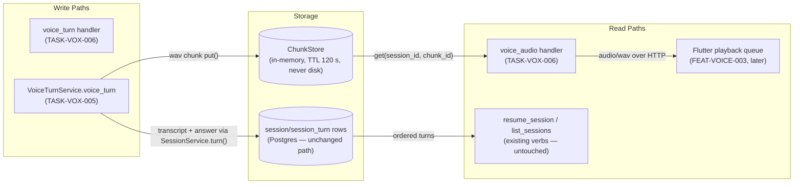
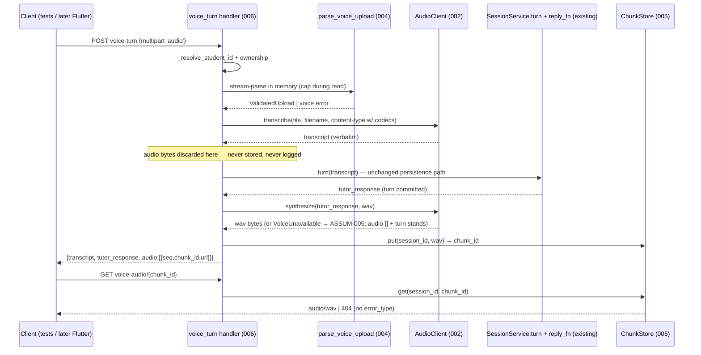
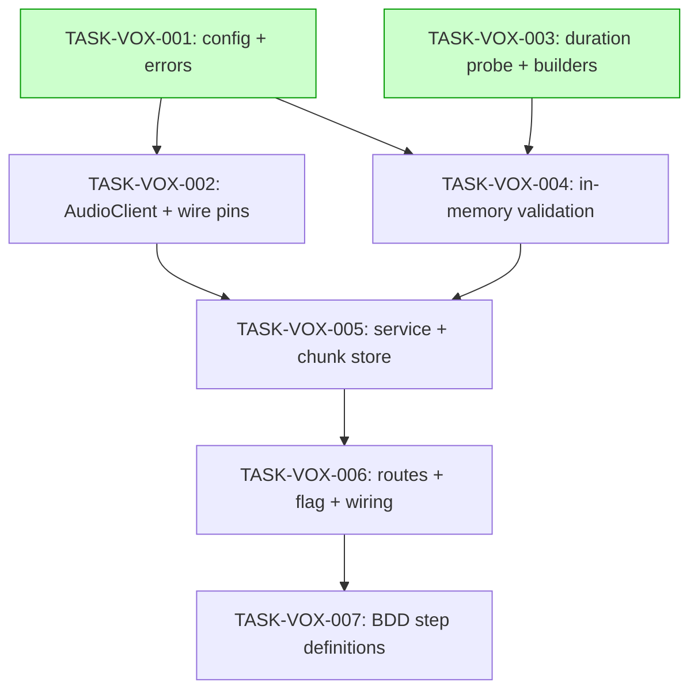

# Implementation Guide — FEAT-VOICE-001 server voice module

**Review:** TASK-REV-852B · **Spec:** [features/voice-server-module/](../../../features/voice-server-module/voice-server-module_summary.md) (27 scenarios, 6 confirmed assumptions)
**Authority:** [design §5](../../../docs/design/voice-tutor-and-reachy-design.md) (Accepted) · contract/binding **Rev 1** (CONTRACT_SHA `574615e9…` / BINDING_SHA `e50897d1…`) — the wire shape is frozen; do not invent alternatives.
**Execution:** sequential, standard testing (owner, 2026-07-06). Waves are the dependency order.

## Data Flow: Read/Write Paths

_Look for: every write has a wired read. **No disconnections** — transcript rows are read by the existing resume path (spec scenario "transcript enters the session history"), chunks by `voice_audio`. Note the deliberate non-store: inbound recording bytes are transcribed and discarded — they never reach Storage (the ephemeral invariant)._

## Integration Contracts (sequence)

_Look for: no fetch-then-discard — every retrieved value is passed onward or deliberately dropped with a named invariant (the recording bytes)._

## Task Dependencies

_Green tasks share no files and could run in parallel; execution is sequential by owner choice — treat waves as ordering._

## §4: Integration Contracts

### Contract: VoiceConfig
- **Producer task:** TASK-VOX-001
- **Consumer task(s):** TASK-VOX-002, TASK-VOX-004, TASK-VOX-005, TASK-VOX-006
- **Artifact type:** frozen dataclass constructed once in `serve-http` from env
- **Format constraint:** env names `STUDY_TUTOR_VOICE_ENABLED`, `STT_BASE_URL`, `STT_MODEL`, `TTS_BASE_URL`, `TTS_MODEL`, `TTS_VOICE` (fleet convention — same names the lpa `.env` uses); base URLs end in `/v1`; caps/TTL/timeout are constants, not env
- **Validation method:** Coach greps `from_env` for exactly these names; boot smoke starts with and without the flag

### Contract: AudioClient wire shape
- **Producer task:** TASK-VOX-002
- **Consumer task(s):** TASK-VOX-005 (and, live, the GB10 `/v1/audio/*` endpoints)
- **Artifact type:** async methods over httpx
- **Format constraint:** STT multipart field **`file`** = (filename, bytes, full content-type incl. codec params) + `model` field; TTS JSON `{model, voice, input, response_format}`; only `VoiceUnavailable` escapes; 10 s timeout
- **Validation method:** raw-captured-request seam tests in TASK-VOX-002 (`@pytest.mark.integration_contract("audio_stt_multipart")`)

### Contract: parse_voice_upload
- **Producer task:** TASK-VOX-004
- **Consumer task(s):** TASK-VOX-005
- **Artifact type:** async function over `request.stream()`
- **Format constraint:** returns `ValidatedUpload(bytes, filename, content_type)` already validated in the pinned order (size→empty→MIME→duration); raises the six TASK-VOX-001 exceptions; never touches disk
- **Validation method:** TASK-VOX-005 seam test asserts rejection precedes any STT call; TASK-VOX-004's SpooledTemporaryFile-poisoning test proves no spooling

### Contract: ChunkStore refs
- **Producer task:** TASK-VOX-005
- **Consumer task(s):** TASK-VOX-006 (and the response's `url` field consumed by FEAT-VOICE-003 later)
- **Artifact type:** in-memory store + URL shape
- **Format constraint:** `url = /api/sessions/{session_id}/voice-audio/{chunk_id}`; `get(session_id, chunk_id) -> bytes | None`; `None` ⇒ transport-level 404 **without** `error_type` (binding §4.2 Rev 1)
- **Validation method:** TASK-VOX-006 seam test (`integration_contract("chunk_store_get")`)

## Standing rules for every task

- The wire shape is **frozen** (contract/binding Rev 1) — if implementation pressure suggests changing a route/field/status, stop and raise it; do not adapt silently.
- Ephemeral audio is an invariant, not a preference: no `request.form()`, no audio in logs, chunk store memory-only.
- Existing tests must stay untouched and green (flag-off default preserves today's behaviour byte-for-byte).
- Scope stops at non-streaming HTTP: no WS, no sentence-chunking, no `generate_stream` (FEAT-VOICE-002).
