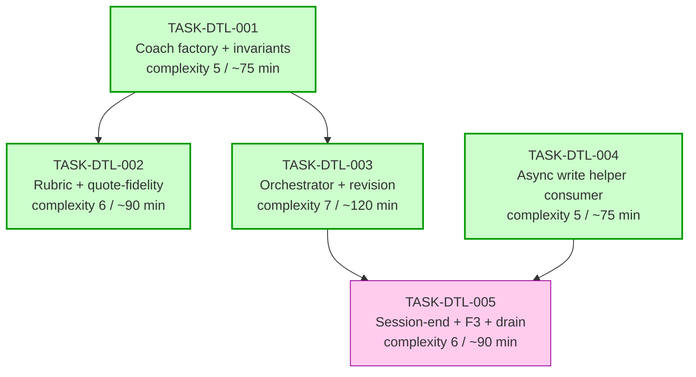

# Implementation Guide — FEAT-PH1-003: DeepAgents Tutoring Loop with Coach

**Parent review:** [TASK-REV-DTL3](../TASK-REV-DTL3-plan-deepagents-tutoring-loop-with-coach.md)
**Phase:** Phase 1 (FEAT-PH1-003)
**Generated:** 2026-04-29
**Stack:** python (Python 3.14, deepagents 0.5.3 AsyncSubAgent per ADR-ARCH-012, Pydantic v2, asyncio, pytest)

---

## §1: Overview

This guide drives implementation of **FEAT-PH1-003** across **5 subtasks**
organised into **3 waves**, with parallel-when-safe execution in waves 1
and 2.

The architecture is **already settled** by accepted decisions:

- **DDR-002** — Coach AsyncSubAgent owns F1 misconception writes; Tutor
  handler owns F2 (planner topic-confidence) and F3 (session-end
  episode); single shared write helper is the only `add_episode` call
  site.
- **DDR-003** — `session.completed` emits on the `active → ended` state
  transition, BEFORE the F3 write task is scheduled. No
  `session.persisted` event. Zero-turn sessions skip emit (I-T6).
- **CC-13 / ARCH-019** — Every Graphiti write is fire-and-forget;
  failures emit a structured-log line; never raise into the caller-
  facing handler.
- **D5 (agentic-dataset-factory)** — Coach has `tools=[]`, no filesystem
  backend, never returns text to the learner. Enforced **structurally**
  at factory construction, not via prompt instruction.
- **Two-provider invariant** — Coach.provider != Player.provider;
  enforced at Coach factory construction.

This implementation translates those decisions into code with one
load-bearing structural-conformance property: **exactly one**
`add_episode` call site in the codebase (in TASK-GSM-004's helper),
audited by greppable test.

**Resolved low-confidence assumptions (from review):**

- **ASSUM-006** — Coach reasoning > 200 words: recorded in full,
  `reasoning_long: bool = True` flag set, never truncated, never
  rejected.
- **ASSUM-011** — Shutdown grace: `GRAPHITI_DRAIN_WINDOW = 5.0`
  constant exposed by the shared write helper (TASK-GSM-004).

**Implementation decisions confirmed at /feature-plan [I]mplement:**

- **F4 lifecycle race resolution** — orchestrator awaits in-flight
  turn for 3s at session end; on timeout, discard turn with no append
  (per Q5 of Context B).
- **Wave execution** — parallel where safe (per Q2 of Context B).
- **Testing depth** — default repo conventions: parallel-when-safe +
  standard depth (per Q3 of Context B; matches TASK-REV-DA72).

---

## §2: Data Flow — Read & Write Paths

This is the most important diagram in this guide. **If a reviewer only
looks at one thing, look here.**

```mermaid
flowchart LR
    subgraph Caller["Caller"]
        L["Learner<br/>(MCP client)"]
    end

    subgraph Handler["Tutor Handler (MCP boundary)"]
        T1["tutor_turn(session_id, msg)"]
        T2["tutor_session_end(session_id)"]
    end

    subgraph Loop["Player-Coach Loop (TASK-DTL-003)"]
        O["PlayerCoachOrchestrator.run_turn()<br/>per-turn instance, no shared state"]
    end

    subgraph Pipe["Per-turn pipeline"]
        Q["Quote Verifier<br/>(FEAT-PH1-004 seam — TASK-DTL-002)"]
        P["Player AsyncSubAgent<br/>(consumes RubricFeedback on revise)"]
        C["Coach AsyncSubAgent<br/>(TASK-DTL-001 — tools=[]; D5)"]
    end

    subgraph Writes["Write Paths (fire-and-forget per CC-13)"]
        W1["TASK-DTL-004: Coach._dispatch_misconception()<br/>(F1 — Coach AsyncSubAgent)"]
        W2["[FEAT-PH1-002] Planner topic-confidence<br/>(F2 — Tutor handler)"]
        W3["TASK-DTL-005: tutor_session_end →<br/>asyncio.create_task(write_session_episode)<br/>(F3 — Tutor handler)"]
    end

    subgraph Helper["Shared Write Helper (TASK-GSM-004 — producer)"]
        H["GraphitiWriteHelper<br/>• write_misconception()<br/>• write_planner_topic_confidence()<br/>• write_session_episode()<br/>• drain(timeout=5.0)<br/>ONLY add_episode() call site"]
    end

    subgraph Storage["Storage"]
        S[("FalkorDB on Synology<br/>(Graphiti backend)")]
    end

    subgraph Reads["Read Paths"]
        R1["[FEAT-PH1-001] Student state queries<br/>(TASK-GSM-005 — used by planner)"]
        R2["[FEAT-PH1-001] Topic recommendations<br/>(TASK-GSM-005 — used by planner)"]
    end

    subgraph Bus["In-process Events Bus (CC-11)"]
        B["session.completed<br/>(emits BEFORE F3 create_task — DDR-003)"]
    end

    L -->|"learner message"| T1
    L -->|"end session"| T2
    T1 --> O
    O --> Q
    Q --> P
    P --> C
    C -->|"verdict (accept/revise)"| O
    O -->|"reply (accepted or lowest-scoring)"| T1
    T1 -->|"reply"| L

    C -.->|"per-observation<br/>asyncio.create_task"| W1
    T1 -.->|"per-turn confidence delta"| W2
    T2 -.->|"on state transition"| W3
    T2 -->|"BEFORE create_task — DDR-003"| B

    W1 -->|"sanitised payload<br/>per DDR-002"| H
    W2 -.->|"[FEAT-PH1-002]"| H
    W3 --> H
    H -->|"add_episode<br/>~78.98s median"| S

    S -->|"search_nodes/facts<br/>~0.07s"| R1
    S -->|"search"| R2

    style C fill:#cfc,stroke:#080,stroke-width:2px
    style W1 fill:#fff4e0,stroke:#a86
    style W2 fill:#eee,stroke:#888,stroke-dasharray: 5 5
    style W3 fill:#fff4e0,stroke:#a86
    style H fill:#cfc,stroke:#080,stroke-width:3px
    style B fill:#cef,stroke:#247,stroke-width:2px
    style S fill:#e8e8ff,stroke:#449
```



**Caption:** Every write path routes through `GraphitiWriteHelper` (green
node) — the single CC-13 dispatch surface. F1 (Coach-owned) and F3
(handler-owned) are dotted because they are fire-and-forget — the
caller-facing path returns without awaiting completion. F2 is dashed-
grey because it lands in FEAT-PH1-002 (planner) — its consumer pattern
is identical. The events bus emit (`session.completed`) happens BEFORE
the F3 `create_task` on the same code path inside `tutor_session_end` —
the DDR-003 conformance surface.

**Disconnection check:** ✅ Every write path has a corresponding read
path.

- F1 misconceptions → read by `[FEAT-PH1-001] get_student_state.recent_misconceptions`
- F2 confidence deltas → read by `[FEAT-PH1-001] get_topic_recommendations`
- F3 SessionEpisode → read by `[FEAT-PH1-001] get_student_state.most_recent_session`

No disconnection alerts. (Read paths are produced by FEAT-PH1-001 /
TASK-GSM-005 — they are dependencies of this feature, not deliverables.)

---

## §3: Integration Contracts (Sequence View)

Cross-task interaction model. Catches the "fetch then discard" anti-
pattern and the DDR-003 ordering invariant.

```mermaid
sequenceDiagram
    autonumber
    participant L as Learner (MCP client)
    participant H as Tutor Handler
    participant O as PlayerCoachOrchestrator
    participant Q as Quote Verifier (FEAT-PH1-004)
    participant P as Player AsyncSubAgent
    participant C as Coach AsyncSubAgent
    participant W as GraphitiWriteHelper (TASK-GSM-004)
    participant B as Events Bus (CC-11)
    participant G as Graphiti / FalkorDB

    Note over L,G: tutor_turn — happy path (first-attempt accept)
    L->>+H: tutor_turn(session_id, learner_message)
    H->>+O: run_turn(session_state, learner_message)
    O->>+Q: verify_quotes(player_input_context)
    Q-->>-O: annotated context
    O->>+P: produce(annotated context)
    P-->>-O: response
    O->>+C: evaluate(response, turn_context)
    C->>C: score_rubric() → CoachVerdict
    Note over C: misconception observed?
    C-)W: asyncio.create_task(write_misconception(student_id, sanitised))
    W-->>-C: Task (NOT awaited; runs in helper task surface)
    Note over C,W: F1 dispatch — Coach OWNS this write per DDR-002
    C-->>-O: CoachVerdict (decision="accept", weighted_total>=0.70)
    O-->>-H: TurnResult (reply, observations)
    H-->>-L: reply (within 30s p95)

    Note over W,G: F1 write completes (or fails) in background
    W->>+G: add_episode(MisconceptionObservation)
    G-->>-W: ok / error
    Note over W: failure → structured-log line; never raises into caller

    Note over L,G: tutor_session_end — DDR-003 ordering
    L->>+H: tutor_session_end(session_id)
    H->>O: await_inflight_turn(timeout=3s)
    Note over O: F4 resolution — turn completes within 3s OR is discarded
    H->>H: generate session summary (topics, AOs, narrative 1-2 sentences)
    H->>H: state transition active → ended
    H->>+B: emit("session.completed", payload)
    B-->>-H: (in-process fan-out)
    H-)W: asyncio.create_task(write_session_episode(...))
    Note over H,W: ⚠️ create_task is AFTER bus emit on the SAME code path — DDR-003
    W-->>H: Task (NOT awaited)
    H-->>-L: { session_id, status: "ended" } (within 2s)
```

**Caption:** Steps 16-17 are the load-bearing DDR-003 conformance
surface: the bus emit (step 16) MUST happen before the
`asyncio.create_task` for F3 (step 17), on the same code path inside
`tutor_session_end`. A unit test in TASK-DTL-005 mocks `create_task`
and asserts ordering.

**No fetch-then-discard pattern detected:** every value retrieved is
either consumed by the next step (annotated context → Player; verdict
→ orchestrator branching) or dispatched as a write (misconceptions →
F1; episode → F3). The Coach's verdict is consumed by the orchestrator
for the accept/revise decision; it is also consumed by the
misconception write site. Both consumptions happen — neither is
discarded.

---

## §4: Integration Contracts

This feature has **one** load-bearing cross-feature integration
contract: the `GraphitiWriteHelper` interface produced by TASK-GSM-004
and consumed by TASK-DTL-001 / TASK-DTL-004 / TASK-DTL-005.

### Contract: GraphitiWriteHelper (write_misconception)

- **Producer task:** TASK-GSM-004 (shared async write helper)
- **Consumer task(s):** TASK-DTL-001 (Coach factory injects helper),
  TASK-DTL-004 (Coach AsyncSubAgent dispatches via helper)
- **Artifact type:** Python protocol / class interface (coroutine method)
- **Format constraint:**
  ```python
  async def write_misconception(
      self,
      student_id: str,
      observation: MisconceptionObservation,  # episode shape from TASK-GSM-002
  ) -> None:
      ...
  ```
  - Accepts **one** misconception per call (NEVER a list — per-
    observation ownership per DDR-002)
  - Caller is responsible for sanitising the payload BEFORE calling
    (Finding F9 of TASK-REV-DTL3 — helper is the dispatch surface, not
    a content layer)
  - Must be invocable via `asyncio.create_task(...)` — fire-and-forget
  - Failures inside the coroutine emit a structured-log line and do
    not raise (CC-13)
- **Validation method:** Coach evaluator seam test
  (`test_coach_dispatches_one_create_task_per_misconception` in
  TASK-DTL-004) asserts (a) one `create_task` per observation,
  (b) helper called with a single `MisconceptionObservation`, never
  a list.

### Contract: GraphitiWriteHelper (write_session_episode)

- **Producer task:** TASK-GSM-004
- **Consumer task(s):** TASK-DTL-005 (Tutor handler `tutor_session_end`)
- **Artifact type:** Python protocol / class interface (coroutine method)
- **Format constraint:**
  ```python
  async def write_session_episode(
      self,
      student_id: str,
      episode: SessionCompletedEpisode,  # episode shape from TASK-GSM-002
  ) -> None:
      ...
  ```
  - Must be invocable via `asyncio.create_task(...)` — fire-and-forget
  - Caller (`tutor_session_end`) MUST emit `session.completed` on the
    bus BEFORE this `create_task` call (DDR-003 ordering)
  - Failures inside the coroutine emit a structured-log line and do
    not raise (CC-13)
- **Validation method:** TASK-DTL-005 unit test mocks
  `asyncio.create_task` and asserts the bus emit happened first
  (`test_session_end_emits_event_before_f3_create_task`).

### Contract: GraphitiWriteHelper (drain)

- **Producer task:** TASK-GSM-004
- **Consumer task(s):** TASK-DTL-005 (runtime shutdown hook)
- **Artifact type:** Python protocol / class interface (coroutine method)
  + module-level constant
- **Format constraint:**
  ```python
  GRAPHITI_DRAIN_WINDOW: float = 5.0  # ASSUM-011 resolution

  async def drain(self, timeout: float = GRAPHITI_DRAIN_WINDOW) -> None:
      """Wait for in-flight Graphiti write tasks to complete, up to `timeout` seconds.

      In-flight tasks that do not complete within `timeout` are logged
      with structured fields. Returns when either all tasks finish or
      the timeout elapses.
      """
      ...
  ```
  - Default timeout is the helper's `GRAPHITI_DRAIN_WINDOW` constant;
    callers SHOULD pass no `timeout` argument (consume the default)
  - Idempotent — calling `drain()` twice on the same helper is safe
  - Returns even if some in-flight tasks do not complete (timeout
    behaviour, not error)
- **Validation method:** TASK-DTL-005 seam test
  (`test_shutdown_drain_uses_graphiti_drain_window_constant`) asserts
  the runtime shutdown hook calls `drain()` with no per-call timeout
  argument (consumes the helper-side default).

⚠️ **If TASK-GSM-004 lands a different surface, this feature's wiring
must follow it.** The contracts above are the consumer expectations;
the producer-side implementation lives in TASK-GSM-004's task file.

---

## §5: Task Dependency Graph

Wave structure for parallel-when-safe execution.



_Wave 1 (parallel-safe — green): TASK-DTL-001, TASK-DTL-004._
_Wave 2 (parallel-safe — green): TASK-DTL-002, TASK-DTL-003._
_Wave 3 (sequential — pink): TASK-DTL-005._

**Soft dependency note (Risk SR-2 from review):** TASK-DTL-001 needs
the helper's *interface* (protocol / type), not the *implementation*.
Co-shipping the protocol stub with TASK-DTL-001 (or pre-shipping it
as a tiny scaffold) lets TASK-DTL-001 and TASK-DTL-004 run in parallel
in wave 1.

---

## §6: BDD Scenario → Task Slice Map (proposed; refined by Step 11 bdd-linker)

The `.feature` file already carries placeholder `@task:TASK-DTL-NNN`
tags from `/feature-spec`. These map cleanly onto the 5 generated
tasks (no rewriting required at this step — `/feature-plan` Step 11
will run `bdd-linker` to confirm and apply the mapping).

| Slice | Approx scenarios | Scope |
|-------|------------------|-------|
| `@task:TASK-DTL-001` | 9 | Coach factory + structural invariants (no-tools, empty-prompt, two-provider, adversarial-content); reasoning-cap boundary |
| `@task:TASK-DTL-002` | 10 | Coach rubric + threshold + quote-fidelity integration + verifier-failure path + retrieval-skipped + fabricated-quote |
| `@task:TASK-DTL-003` | 12 | Player-Coach loop wiring, revision policy + exhaustion-lowest-scoring, latency budget, Coach-fallback, Player-fallback, concurrency, stable-turn |
| `@task:TASK-DTL-004` | 6 | Async write helper consumer + per-misconception writes + simultaneous dispatch + sanitisation + helper-failure isolation |
| `@task:TASK-DTL-005` | 8 | Session-end summary (1-2 sentence narrative) + F3 write + `session.completed` emit ordering + I-T6 zero-turn guard + slow-helper resilience + lifecycle race + drain |

**Total**: 39 scenarios → 5 slices. Two scenarios appear in spirit at
multiple slice boundaries (e.g. the @key-example @smoke @session-end
scenario depends on both TASK-DTL-005's session-end logic and
TASK-DTL-002's rubric for the misconception-surfacing path);
`bdd-linker` will pick the canonical owning task.

---

## §7: Constraint Coverage Matrix

| Anchor constraint | Honoured by | Code-review surface |
|-------------------|-------------|---------------------|
| **DDR-002** (Coach owns F1; handler owns F2/F3; one shared helper) | TASK-DTL-001 (Coach factory), TASK-DTL-004 (per-observation dispatch), TASK-DTL-005 (handler-owned F3) | grep `add_episode` → only inside helper (TASK-GSM-004) |
| **DDR-003** (`session.completed` emits BEFORE F3 task scheduled) | TASK-DTL-005 | grep `session.completed` → exactly one emit site, immediately followed by `asyncio.create_task(...write_session_episode...)` |
| **CC-13 / ARCH-019** (fire-and-forget, log-only failure) | All write sites in TASK-DTL-004 + TASK-DTL-005 | helper raises nothing into caller; structured log on failure |
| **D5** (Coach `tools=[]`, no fs backend, never learner-facing) | TASK-DTL-001 | `create_coach` hard-codes `tools=[]`, no `fs_backend` parameter; orchestrator never returns Coach text in `Reply` |
| **Two-provider invariant** | TASK-DTL-001 | `validate_coach_config` raises on `coach.provider == player_config.provider` |
| **30s p95 turn budget** | TASK-DTL-003 | turn = quote_verify + Player + Coach + (≤3 × revision); F1 dispatch is `create_task` (~µs) |
| **2s session-end budget** | TASK-DTL-005 | session-end = state transition + emit + `create_task`; F3 latency does not enter the path |
| **I-T6** (zero-turn session does NOT emit `session.completed`) | TASK-DTL-005 | guard at `tutor_session_end` boundary: `if turn_count == 0: return without emit` |
| **ASSUM-006 resolution** (reasoning > 200 words: record + flag) | TASK-DTL-001 | `CoachVerdict` validator sets `reasoning_long: bool = True`; never truncates |
| **ASSUM-011 resolution** (5s drain window) | TASK-DTL-005 (consumer) | `GRAPHITI_DRAIN_WINDOW = 5.0` constant exposed by TASK-GSM-004's helper |

---

## §8: Execution Plan

### Wave 1 (parallel-safe)

1. **TASK-DTL-001** — Coach factory + structural invariants + Pydantic
   models (`CoachVerdict`, `CriterionScore`, `RubricFeedback`,
   `MisconceptionObservation`)
2. **TASK-DTL-004** — Coach-side dispatch wiring + sanitiser

⚠️ TASK-DTL-001 ships the `GraphitiWriteHelper` *protocol* (Python
`Protocol` or ABC) so TASK-DTL-004 can build against it in parallel.
The concrete helper implementation lives in TASK-GSM-004.

### Wave 2 (parallel-safe — depends on wave 1)

3. **TASK-DTL-002** — Rubric scoring + quote-verifier seam
4. **TASK-DTL-003** — `PlayerCoachOrchestrator` + revision policy +
   `tutor_turn` wiring + concurrency tests + Player/Coach fallback paths

### Wave 3 (sequential — depends on waves 1 + 2)

5. **TASK-DTL-005** — `tutor_session_end` + session summary +
   `session.completed` emit (DDR-003 ordering) + F3 dispatch +
   I-T6 guard + lifecycle race resolution (3s inner timeout) + shutdown
   drain wiring

**Total estimated effort:** 22-28h sequential / **~14h elapsed** with
wave-1 + wave-2 parallelism.

---

## §9: Cross-feature Dependencies

**Producer dependencies (must land before this feature can run end-to-end):**

- **TASK-GSM-002** (episode types) — provides `MisconceptionObservation`
  and `SessionCompletedEpisode` shapes that the Coach and the F3 write
  consume.
- **TASK-GSM-003** (Graphiti client wrapper) — provides the underlying
  client used by the helper.
- **TASK-GSM-004** (async write helper) — **load-bearing**. All three
  contracts in §4 are produced by this task.

**Consumer dependencies (this feature is upstream of):**

- **FEAT-PH1-002** (deterministic session planner) — consumes Coach
  observations indirectly via the planner topic-confidence delta (F2);
  the planner is not yet its own AsyncSubAgent (Phase 1), so the F2
  dispatch lives in the Tutor handler, not in this feature.
- **FEAT-PH1-001** (student model query helpers) — provides the read
  paths that consume what F1, F2, F3 write. Required for end-to-end
  validation but not for this feature's unit-test surface.

**Graceful-degradation contract:** if TASK-GSM-004 ships a helper
surface different from the one specified in §4, the consumer wiring in
TASK-DTL-001 / TASK-DTL-004 / TASK-DTL-005 follows the producer. If the
producer surface changes are breaking, raise a follow-up review against
this guide before continuing.

---

## §10: Risks Carried Forward from Review

| ID | Risk | Mitigation |
|----|------|------------|
| F4 | Lifecycle race at session-end is genuinely ambiguous in the spec | Resolved at [I]mplement: 3s inner timeout, then discard with no append (per Q5 of Context B) |
| SR-1 | TASK-DTL-003 (loop) cannot start before TASK-DTL-001 (Coach factory) | Wave 1 → Wave 2 sequencing in §8 |
| SR-2 | TASK-DTL-004 produces a surface TASK-DTL-001 consumes | Co-ship the helper protocol with TASK-DTL-001 to allow wave-1 parallelism (§8 note) |
| SR-3 | TASK-DTL-005 depends on TASK-DTL-004's drain surface | TASK-DTL-005 sequenced into wave 3 after both wave-1 and wave-2 land |

---

## §11: Smoke Gate (R3 feature-level smoke oracle)

After **wave 3** (when `tutor_session_end` is wired end-to-end), the
following smoke gate fires to catch composition failures that per-task
Coach validation cannot see:

```yaml
smoke_gates:
  after_wave: [3]
  command: pytest -m "feat_ph1_003 and smoke" -x --no-cov  # underscore form — pytest's -m is a Python expression; hyphens are parsed as subtraction (TASK-DSP-008 trip-wire)
  expected_exit: 0
  timeout: 60
```

The 5 `@smoke` scenarios in the .feature file exercise the four
load-bearing seams end-to-end:

1. First-attempt accept happy path (TASK-DTL-003 + TASK-DTL-001)
2. Below-threshold → revision → accept (TASK-DTL-003 + TASK-DTL-002)
3. Misconception persisted without blocking turn return (TASK-DTL-004
   + DDR-002 conformance)
4. Session-end produces `SessionCompletedEpisode` with all required
   fields (TASK-DTL-005)
5. `session.completed` ordering vs F3 scheduling (TASK-DTL-005 +
   DDR-003 conformance)

Wave 1 and wave 2 are gated by the per-task Coach validation; the
smoke oracle adds the wave-3 composition check.

---

## §12: References

- [TASK-REV-DTL3 review report](../../../.guardkit/reviews/TASK-REV-DTL3-review-report.md) — the decision-mode analysis this guide implements.
- [DDR-002](../../../docs/design/decisions/DDR-002-coach-async-subagent-owns-graphiti-writes.md) — Coach AsyncSubAgent owns F1; handler owns F2/F3; one shared helper.
- [DDR-003](../../../docs/design/decisions/DDR-003-session-completed-emits-on-state-transition.md) — events emit on state transition; never coupled to write success.
- [Feature spec summary](../../../features/deepagents-tutoring-loop/deepagents-tutoring-loop_summary.md) — 39 BDD scenarios, 11 assumptions, anchor decisions list.
- [Feature spec (.feature)](../../../features/deepagents-tutoring-loop/deepagents-tutoring-loop.feature) — full Gherkin source for the 39 scenarios.
- [Feature spec assumptions](../../../features/deepagents-tutoring-loop/deepagents-tutoring-loop_assumptions.yaml) — 11 assumptions with confidence levels.
- ADR-ARCH-012 — Coach as deepagents AsyncSubAgent.
- ADR-ARCH-019 — Fire-and-forget Graphiti writes at every site.
- ADR-ARCH-018 — CC-11 (in-process events bus), CC-12 (async-capable subagent boundary), CC-13 (every-write-point fire-and-forget).
