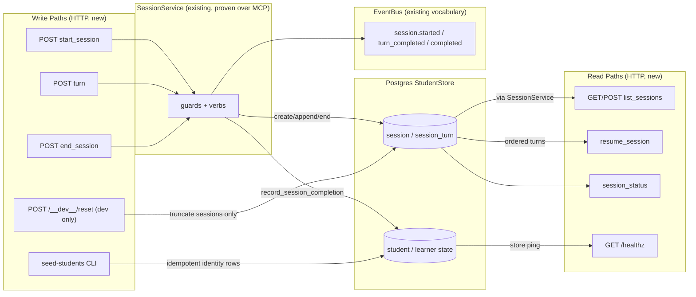
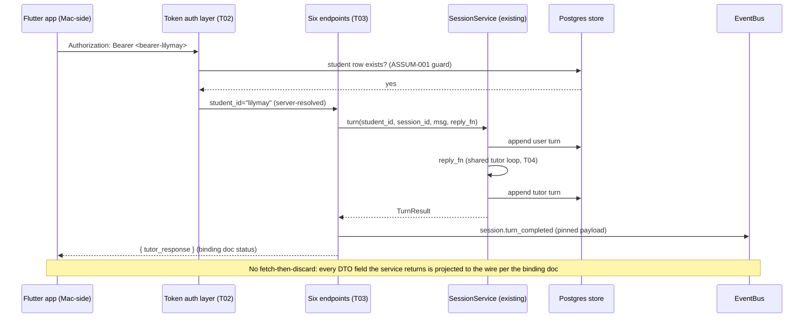
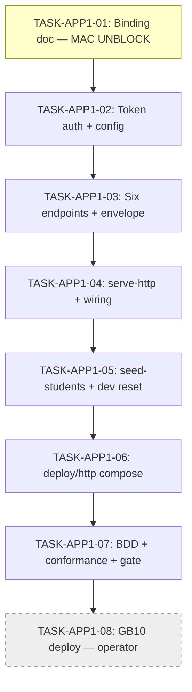

# Implementation Guide — FEAT-APP-001: HTTP App Access Adapter

**Spec:** `features/http-app-access-adapter/` (34 scenarios, 11 assumptions — 4 low-confidence, operator-confirmed).
**Sequencing:** builds BEFORE FEAT-SMP-004 (shared `cli/main.py` + `pyproject.toml` blast radius; the Mac app waves are blocked on wave 1's binding doc).
**Contract pin:** `docs/design/contracts/API-session-cross-device.md` @ `CONTRACT_SHA=22791af…` — read-only.
**Blast radius:** `src/**`, `deploy/**`, `docs/design/contracts/API-session-http-binding.md`, feature/task files. **NEVER `app/**`**, never the pinned contract.

## Data Flow: Read/Write Paths

*Look for: every write goes through `SessionService` except the two dev/ops
tools (reset, seed), which write directly and deliberately narrowly. No
disconnected paths: every storage node has both writers and readers.
`session.completed` consumers (gamification, DDR-003) are pre-existing.*

**Disconnection check:** none. All write paths have live readers (the six
verbs + the Mac's live suite); events flow to the existing bus consumers.

## Integration Contracts (sequence)

## Task Dependencies

*Strictly serialized (one task per wave) per the parallel-wave worktree
pollution retro — every task touches the new `src/study_tutor/http/` package
and/or `cli/main.py`. T8 is `operator_handoff` — AutoBuild skips it. Yellow =
push immediately after merge (the Mac's `BINDING_SHA`).*

## §4: Integration Contracts

### Contract: API-session-http-binding.md
- **Producer task:** TASK-APP1-01
- **Consumer task(s):** TASK-APP1-03 (routes/status codes), TASK-APP1-07
  (conformance test), the Mac-side app build (external, at pinned `BINDING_SHA`)
- **Artifact type:** frozen contract document
- **Format constraint:** verb table (verb → method + path + §5 shape ref),
  status-per-`error_type` for the closed §9 set, dev-endpoints section (both
  dev tokens, reset route, `--concurrency=1` caveat, `/healthz`, port 8100)
- **Validation method:** Coach verifies TASK-APP1-03's routes and TASK-APP1-07's
  conformance test read the doc; any drift fails the conformance scenario

### Contract: STUDY_TUTOR_HTTP_TOKENS (+ STUDY_TUTOR_HTTP_DEV_RESET)
- **Producer task:** TASK-APP1-02 (defines parsing)
- **Consumer task(s):** TASK-APP1-06 (compose sets them per flavour)
- **Artifact type:** environment variables
- **Format constraint:** `STUDY_TUTOR_HTTP_TOKENS` is a JSON object mapping
  token → student_id, e.g. `{"<bearer-lilymay>": "lilymay", "<bearer-alex>": "alex"}`;
  `STUDY_TUTOR_HTTP_DEV_RESET` present/truthy only in the dev flavour
- **Validation method:** Coach verifies the compose env blocks parse with
  TASK-APP1-02's loader (round-trip test in TASK-APP1-07)

### Contract: /healthz READY semantics
- **Producer task:** TASK-APP1-04
- **Consumer task(s):** TASK-APP1-06 (compose healthcheck), TASK-APP1-08
  (operator curl check)
- **Artifact type:** HTTP endpoint
- **Format constraint:** 200 only once the app is accepting requests with a
  wired store; never 200 during fail-fast boot
- **Validation method:** READY boot smoke (TASK-APP1-04) + compose healthcheck
  target match

## Execution strategy & retro constraints (encode, don't soften)

- **One task per wave** (strict dep chain auto-serializes) — do not add
  `--max-parallel`.
- Smoke gate after every wave: `pytest tests/unit -x -q` (path verified:
  `tests/unit/` exists with ≈1049 tests).
- Export an **ephemeral** `STUDY_TUTOR_PG_DSN` (throwaway postgres:16 on a
  non-5434 port, `alembic upgrade head`) before launching autobuild. NEVER the
  NAS.
- Signature/wiring changes → sweep ALL call sites (`cli/main.py` is additive
  this feature; the retro failure was exactly there).
- Independent verification before merge, on `main` with `.env` present:
  `pytest tests/` (minus the 3 known NATS-smoke) + `pytest features/http-app-access-adapter`
  + the READY boot smoke for BOTH `serve` and `serve-http`.
- Selective squash-merge (code+test+docs paths only, not `.guardkit/`/`tasks/`
  churn), rebase onto `origin/main`, **push immediately** — wave 1's binding
  doc at its pushed SHA is what unblocks the Mac.
